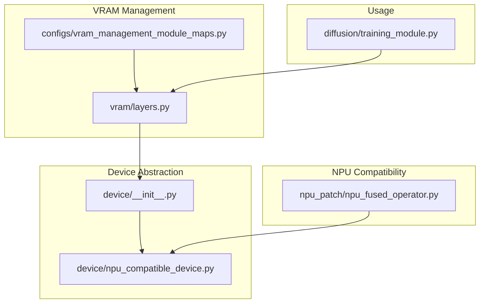
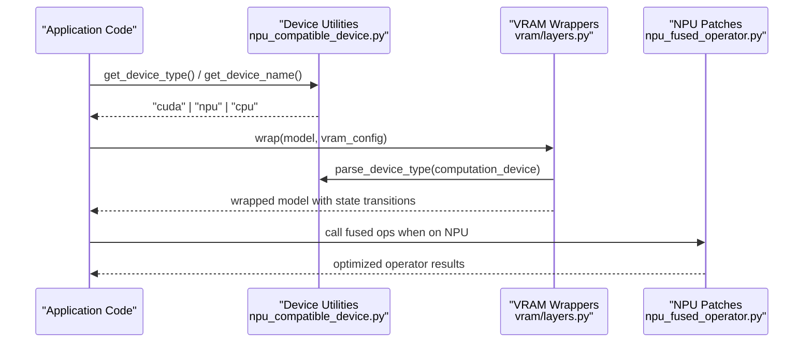
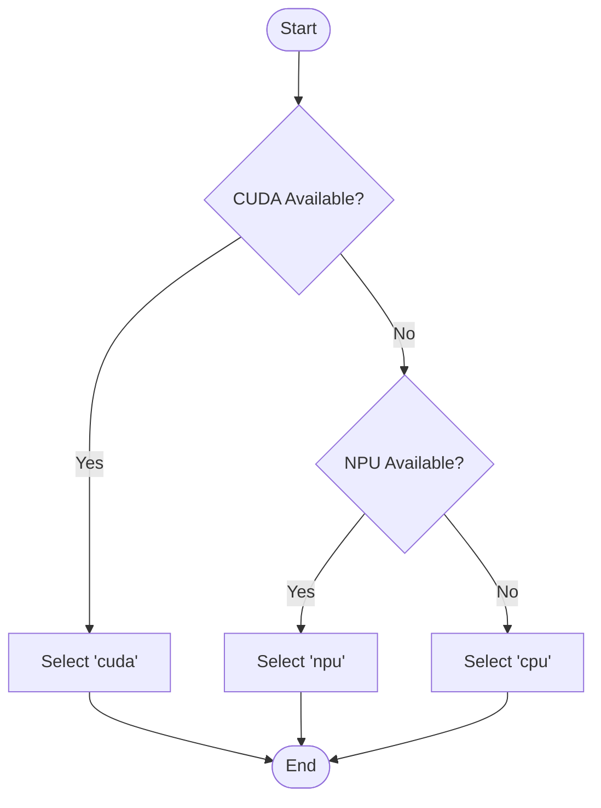
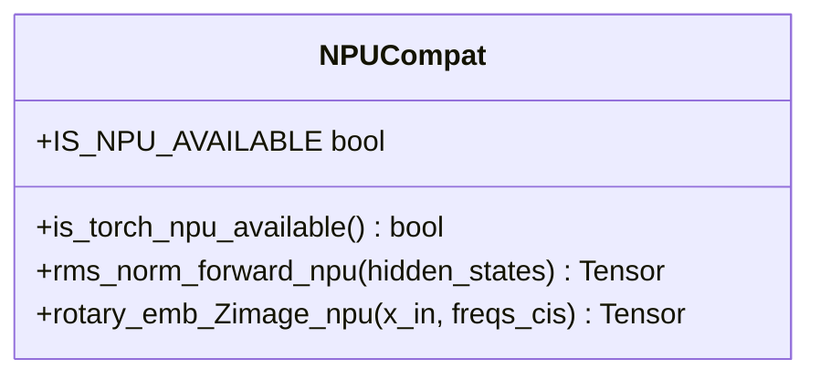
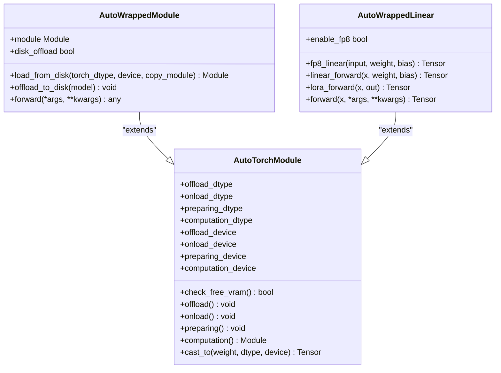
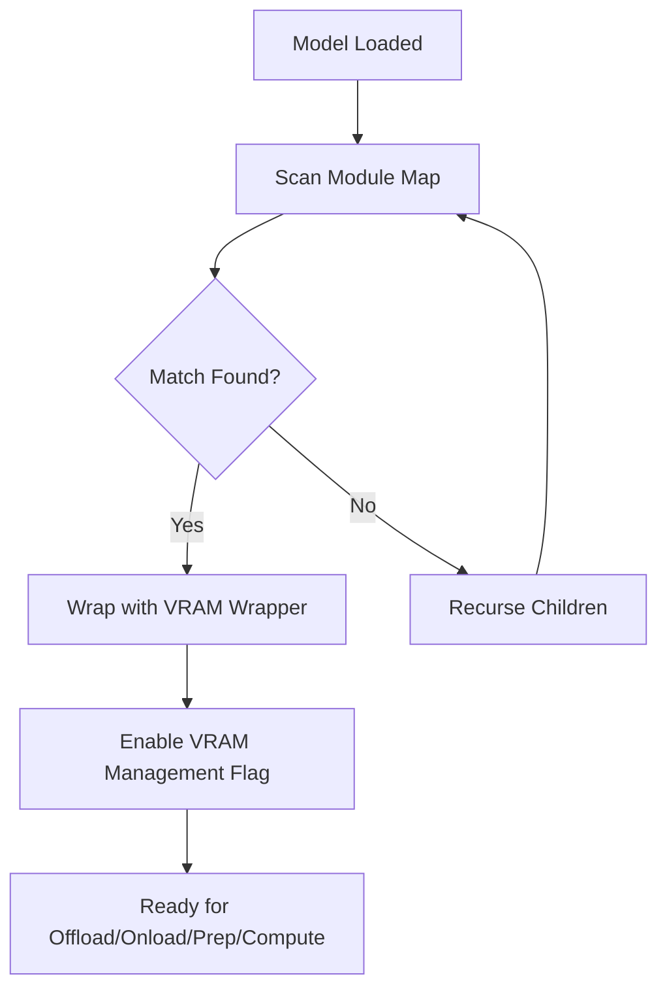
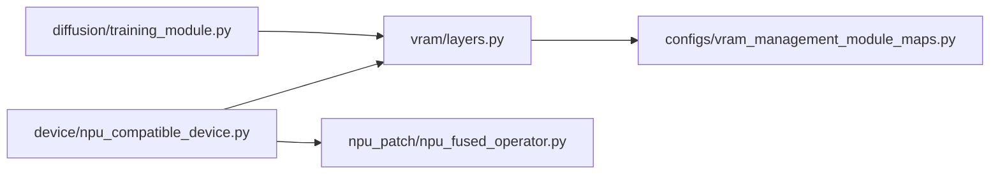

# Device Abstraction Layer

<cite>
**Referenced Files in This Document**
- [npu_compatible_device.py](file://diffsynth/core/device/npu_compatible_device.py)
- [device_init.py](file://diffsynth/core/device/__init__.py)
- [layers.py](file://diffsynth/core/vram/layers.py)
- [npu_fused_operator.py](file://diffsynth/core/npu_patch/npu_fused_operator.py)
- [vram_management_module_maps.py](file://diffsynth/configs/vram_management_module_maps.py)
- [training_module.py](file://diffsynth/diffusion/training_module.py)
</cite>

## Table of Contents
1. [Introduction](#introduction)
2. [Project Structure](#project-structure)
3. [Core Components](#core-components)
4. [Architecture Overview](#architecture-overview)
5. [Detailed Component Analysis](#detailed-component-analysis)
6. [Dependency Analysis](#dependency-analysis)
7. [Performance Considerations](#performance-considerations)
8. [Troubleshooting Guide](#troubleshooting-guide)
9. [Conclusion](#conclusion)

## Introduction
This document explains the device abstraction layer that unifies access to different hardware backends (CPU, GPU via CUDA, and NPU via Huawei Ascend). It covers automatic device detection, device-aware operations, cross-device data transfer, the NPU compatibility layer for Ascend support, and the plugin-style architecture used to enable VRAM management across modules. It also provides guidance on performance tuning and debugging device-specific issues.

## Project Structure
The device abstraction is centered around a small set of core utilities and wrappers:
- Device selection and backend helpers live under the device module.
- VRAM-aware module wrappers provide unified offload/onload/preparing/computation states.
- NPU patches expose fused operators optimized for Ascend devices.
- Configuration maps define how model layers are wrapped with VRAM management.

**Diagram sources**
- [device_init.py:1-3](file://diffsynth/core/device/__init__.py#L1-L3)
- [npu_compatible_device.py:1-108](file://diffsynth/core/device/npu_compatible_device.py#L1-L108)
- [layers.py:1-480](file://diffsynth/core/vram/layers.py#L1-L480)
- [vram_management_module_maps.py:1-312](file://diffsynth/configs/vram_management_module_maps.py#L1-L312)
- [npu_fused_operator.py:1-30](file://diffsynth/core/npu_patch/npu_fused_operator.py#L1-L30)
- [training_module.py:90-110](file://diffsynth/diffusion/training_module.py#L90-L110)

**Section sources**
- [device_init.py:1-3](file://diffsynth/core/device/__init__.py#L1-L3)
- [npu_compatible_device.py:1-108](file://diffsynth/core/device/npu_compatible_device.py#L1-L108)
- [layers.py:1-480](file://diffsynth/core/vram/layers.py#L1-L480)
- [vram_management_module_maps.py:1-312](file://diffsynth/configs/vram_management_module_maps.py#L1-L312)
- [npu_fused_operator.py:1-30](file://diffsynth/core/npu_patch/npu_fused_operator.py#L1-L30)
- [training_module.py:90-110](file://diffsynth/diffusion/training_module.py#L90-L110)

## Core Components
- Device selection and utilities:
  - Automatic detection of available backends (CUDA vs NPU vs CPU).
  - Unified device name/id retrieval, synchronization, cache clearing, and distributed backend selection.
  - High-precision BF16 accumulation control per backend.
- VRAM-aware wrappers:
  - AutoTorchModule, AutoWrappedModule, AutoWrappedLinear implement stateful memory management (offload/onload/preparing/computation).
  - Disk-backed offloading and dynamic casting between dtypes/devices.
- NPU compatibility:
  - Fused RMSNorm and rotary embedding implementations for Ascend.
  - Autocast context handling tailored to device type.
- Plugin-style configuration:
  - Module maps map target classes to VRAM wrapper types, enabling fine-grained control without code changes.

**Section sources**
- [npu_compatible_device.py:19-108](file://diffsynth/core/device/npu_compatible_device.py#L19-L108)
- [layers.py:8-480](file://diffsynth/core/vram/layers.py#L8-L480)
- [npu_fused_operator.py:1-30](file://diffsynth/core/npu_patch/npu_fused_operator.py#L1-L30)
- [vram_management_module_maps.py:1-312](file://diffsynth/configs/vram_management_module_maps.py#L1-L312)

## Architecture Overview
The framework abstracts hardware through a thin device layer that exposes consistent APIs. Higher-level components (VRAM wrappers, training modules, and pipelines) use these APIs to perform device-aware operations and data transfers. The NPU compatibility layer adds fused operators and backend-specific settings.

**Diagram sources**
- [npu_compatible_device.py:19-108](file://diffsynth/core/device/npu_compatible_device.py#L19-L108)
- [layers.py:8-480](file://diffsynth/core/vram/layers.py#L8-L480)
- [npu_fused_operator.py:1-30](file://diffsynth/core/npu_patch/npu_fused_operator.py#L1-L30)

## Detailed Component Analysis

### Device Selection and Automatic Hardware Detection
- Backend availability flags are computed at import time.
- get_device_type returns the preferred backend based on availability order: CUDA > NPU > CPU.
- get_torch_device dynamically resolves torch.cuda or torch.npu namespaces; fallback to CUDA if needed.
- get_device_id and get_device_name provide current device identity.
- synchronize and empty_cache delegate to the active backend namespace.
- get_nccl_backend selects nccl for CUDA or hccl for NPU; raises an error if none available.
- enable_high_precision_for_bf16 disables reduced-precision reductions/matmul on both CUDA and NPU for higher accuracy.
- parse_device_type normalizes string or torch.device inputs into canonical device types.

**Diagram sources**
- [npu_compatible_device.py:19-28](file://diffsynth/core/device/npu_compatible_device.py#L19-L28)

**Section sources**
- [npu_compatible_device.py:10-108](file://diffsynth/core/device/npu_compatible_device.py#L10-L108)

### NPU Compatibility Layer (Huawei Ascend Support)
- Availability check ensures torch_npu is present before importing.
- When NPU is available, internal format behavior is adjusted for compatibility.
- Fused operators:
  - RMSNorm forward uses torch_npu.npu_rms_norm for performance.
  - Rotary embedding uses torch_npu.npu_rotary_mul with interleaved mode.
  - Autocast context is disabled explicitly for certain NPU operations to ensure correct dtype handling.

**Diagram sources**
- [npu_fused_operator.py:1-30](file://diffsynth/core/npu_patch/npu_fused_operator.py#L1-L30)
- [npu_compatible_device.py:6-16](file://diffsynth/core/device/npu_compatible_device.py#L6-L16)

**Section sources**
- [npu_fused_operator.py:1-30](file://diffsynth/core/npu_patch/npu_fused_operator.py#L1-L30)
- [npu_compatible_device.py:6-16](file://diffsynth/core/device/npu_compatible_device.py#L6-L16)

### VRAM-Aware Module Wrappers and Cross-Device Data Transfer
- AutoTorchModule defines dtype/device configurations for offload, onload, preparing, and computation phases.
- AutoWrappedModule wraps arbitrary torch.nn.Module, managing state transitions and optional disk-backed offloading.
- AutoWrappedLinear specializes linear layers with FP8 support and LoRA integration.
- check_free_vram queries backend memory info using the appropriate device API; for NPU, it uses get_device_name to query memory.
- cast_to performs dtype/device conversions efficiently.
- transfer_data_to_device recursively moves tensors, tuples, lists, and dicts to a target device and optionally casts float dtypes.

**Diagram sources**
- [layers.py:8-480](file://diffsynth/core/vram/layers.py#L8-L480)

**Section sources**
- [layers.py:8-480](file://diffsynth/core/vram/layers.py#L8-L480)
- [training_module.py:90-110](file://diffsynth/diffusion/training_module.py#L90-L110)

### Plugin Architecture for Adding New Device Backends
- VRAM management is configured via a module map that associates model classes with wrapper classes.
- The system scans models and replaces matching layers with VRAM-aware wrappers according to the map.
- Version-specific updates can adjust mappings dynamically (e.g., transformer library version checks).
- To add a new backend:
  - Implement device detection and utilities in the device layer.
  - Provide backend-specific fused operators if applicable.
  - Extend module maps to include wrappers for new layer types.
  - Ensure memory queries and distributed backends are supported.

**Diagram sources**
- [vram_management_module_maps.py:1-312](file://diffsynth/configs/vram_management_module_maps.py#L1-L312)
- [layers.py:439-480](file://diffsynth/core/vram/layers.py#L439-L480)

**Section sources**
- [vram_management_module_maps.py:1-312](file://diffsynth/configs/vram_management_module_maps.py#L1-L312)
- [layers.py:439-480](file://diffsynth/core/vram/layers.py#L439-L480)

## Dependency Analysis
- Device utilities are imported by VRAM wrappers and NPU patches.
- VRAM wrappers depend on device utilities for parsing device types and querying memory.
- Training modules use VRAM wrappers indirectly through pipeline configuration and data transfer utilities.

**Diagram sources**
- [npu_compatible_device.py:1-108](file://diffsynth/core/device/npu_compatible_device.py#L1-L108)
- [layers.py:1-480](file://diffsynth/core/vram/layers.py#L1-L480)
- [vram_management_module_maps.py:1-312](file://diffsynth/configs/vram_management_module_maps.py#L1-L312)
- [training_module.py:90-110](file://diffsynth/diffusion/training_module.py#L90-L110)

**Section sources**
- [npu_compatible_device.py:1-108](file://diffsynth/core/device/npu_compatible_device.py#L1-L108)
- [layers.py:1-480](file://diffsynth/core/vram/layers.py#L1-L480)
- [vram_management_module_maps.py:1-312](file://diffsynth/configs/vram_management_module_maps.py#L1-L312)
- [training_module.py:90-110](file://diffsynth/diffusion/training_module.py#L90-L110)

## Performance Considerations
- Prefer fused NPU operators where available to reduce overhead.
- Use enable_high_precision_for_bf16 when numerical stability is critical; note potential performance trade-offs.
- Configure VRAM limits judiciously to avoid frequent offload/onload cycles; leverage preparing state for short-lived computations.
- For large models, consider disk-backed offloading to reduce peak memory usage.
- On NPU, ensure autocast contexts are correctly configured for specific operators to avoid dtype mismatches.

[No sources needed since this section provides general guidance]

## Troubleshooting Guide
- If device selection fails or falls back unexpectedly, verify backend availability flags and environment setup.
- For NPU-specific errors:
  - Confirm torch_npu is installed and accessible.
  - Check fused operator usage and autocast settings.
- For VRAM-related crashes:
  - Inspect check_free_vram logic and memory queries; ensure correct device naming for NPU.
  - Validate module maps include all necessary layer types.
- For distributed communication issues:
  - Ensure get_nccl_backend returns a valid backend for the selected device.

**Section sources**
- [npu_compatible_device.py:60-108](file://diffsynth/core/device/npu_compatible_device.py#L60-L108)
- [layers.py:65-70](file://diffsynth/core/vram/layers.py#L65-L70)
- [npu_fused_operator.py:1-30](file://diffsynth/core/npu_patch/npu_fused_operator.py#L1-L30)

## Conclusion
The device abstraction layer provides a clean, unified interface over CPU, CUDA, and NPU backends. Through automatic detection, VRAM-aware wrappers, and NPU-compatible operators, it enables efficient and portable execution across diverse hardware. The plugin-style module mapping allows easy extension to new backends and layer types, while performance tuning and troubleshooting guidance help maintain robust operation.

[No sources needed since this section summarizes without analyzing specific files]