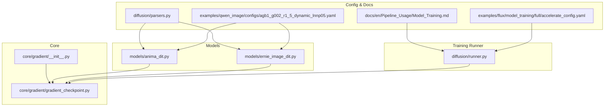
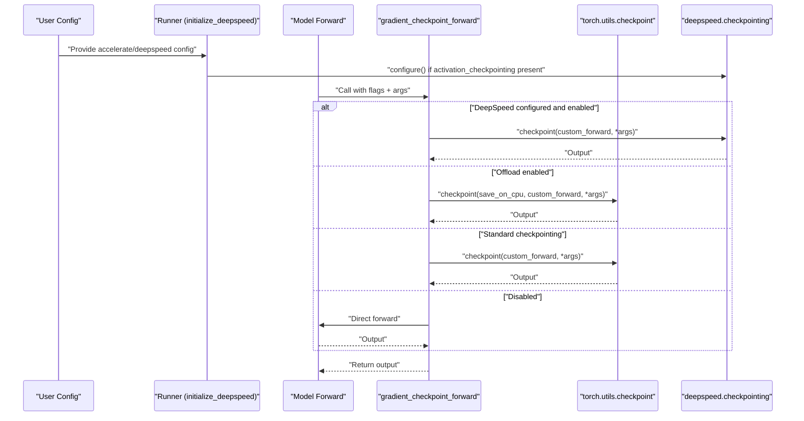
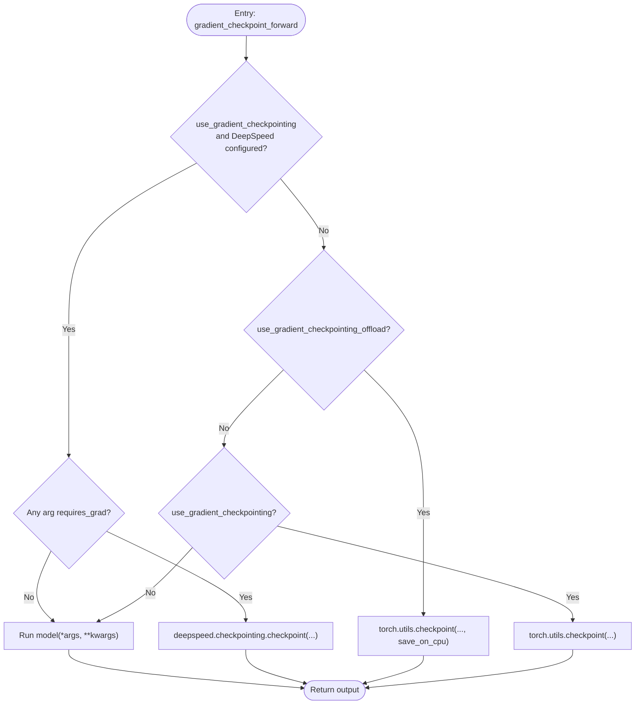
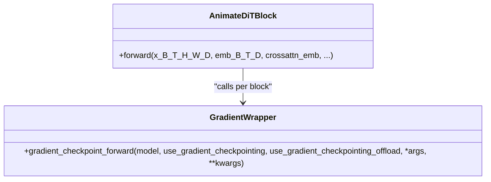
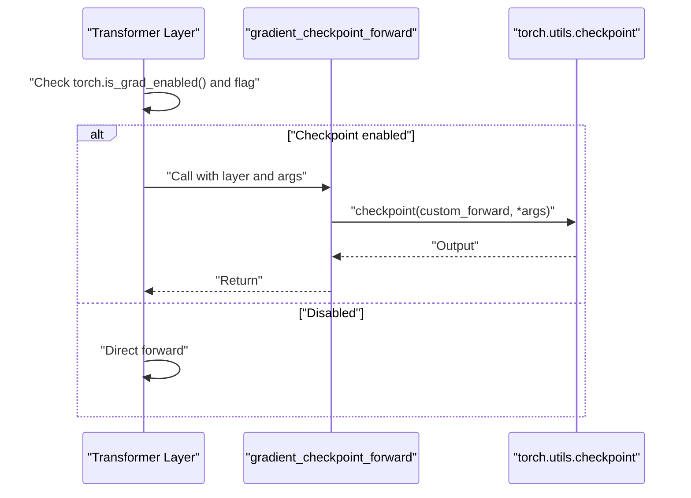
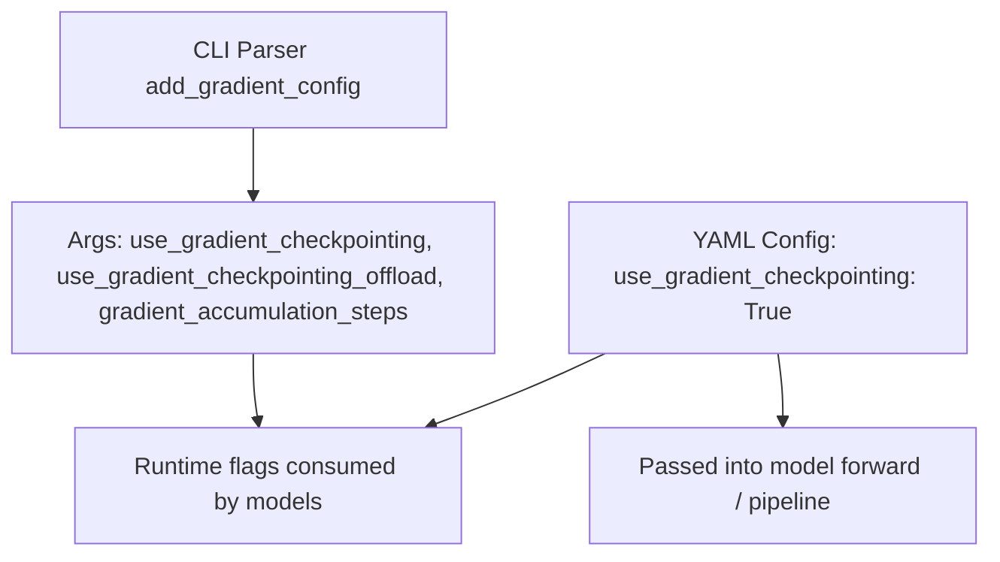
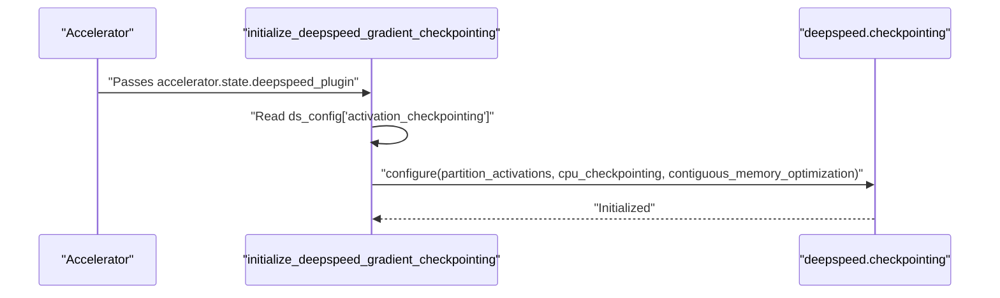
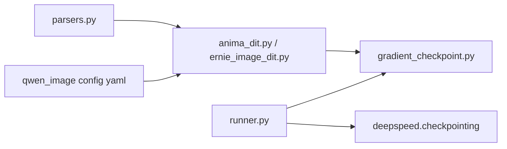

# Gradient Checkpointing

<cite>
**Referenced Files in This Document**
- [gradient_checkpoint.py](file://diffsynth/core/gradient/gradient_checkpoint.py)
- [__init__.py](file://diffsynth/core/gradient/__init__.py)
- [runner.py](file://diffsynth/diffusion/runner.py)
- [anima_dit.py](file://diffsynth/models/anima_dit.py)
- [ernie_image_dit.py](file://diffsynth/models/ernie_image_dit.py)
- [parsers.py](file://diffsynth/diffusion/parsers.py)
- [Model_Training.md](file://docs/en/Pipeline_Usage/Model_Training.md)
- [agb1_g002_r1_5_dynamic_lnnp05.yaml](file://examples/qwen_image/configs/agb1_g002_r1_5_dynamic_lnnp05.yaml)
- [accelerate_config.yaml](file://examples/flux/model_training/full/accelerate_config.yaml)
</cite>

## Table of Contents
1. [Introduction](#introduction)
2. [Project Structure](#project-structure)
3. [Core Components](#core-components)
4. [Architecture Overview](#architecture-overview)
5. [Detailed Component Analysis](#detailed-component-analysis)
6. [Dependency Analysis](#dependency-analysis)
7. [Performance Considerations](#performance-considerations)
8. [Troubleshooting Guide](#troubleshooting-guide)
9. [Conclusion](#conclusion)
10. [Appendices](#appendices)

## Introduction
This document explains the gradient checkpointing system implemented in the repository, focusing on how it trades computation for reduced memory usage during training. It covers configuration options, automatic gradient computation and storage management, integration with DeepSpeed and PyTorch’s checkpoint utilities, and practical guidance for enabling and tuning checkpointing across different models and distributed setups.

## Project Structure
The gradient checkpointing feature is centered around a small core module that provides a unified forward wrapper, which is then used by model implementations to optionally wrap their submodules. Configuration flags are exposed via CLI parsers and YAML configs, while DeepSpeed activation checkpointing can be initialized from an Accelerate runner.

**Diagram sources**
- [gradient_checkpoint.py:1-66](file://diffsynth/core/gradient/gradient_checkpoint.py#L1-L66)
- [__init__.py:1-2](file://diffsynth/core/gradient/__init__.py#L1-L2)
- [anima_dit.py:1015-1084](file://diffsynth/models/anima_dit.py#L1015-L1084)
- [ernie_image_dit.py:290-363](file://diffsynth/models/ernie_image_dit.py#L290-L363)
- [runner.py:75-88](file://diffsynth/diffusion/runner.py#L75-L88)
- [parsers.py:55-71](file://diffsynth/diffusion/parsers.py#L55-L71)
- [Model_Training.md:303-347](file://docs/en/Pipeline_Usage/Model_Training.md#L303-L347)
- [agb1_g002_r1_5_dynamic_lnnp05.yaml:1-39](file://examples/qwen_image/configs/agb1_g002_r1_5_dynamic_lnnp05.yaml#L1-L39)
- [accelerate_config.yaml:1-23](file://examples/flux/model_training/full/accelerate_config.yaml#L1-L23)

**Section sources**
- [gradient_checkpoint.py:1-66](file://diffsynth/core/gradient/gradient_checkpoint.py#L1-L66)
- [__init__.py:1-2](file://diffsynth/core/gradient/__init__.py#L1-L2)
- [runner.py:75-88](file://diffusion/runner.py#L75-L88)
- [anima_dit.py:1015-1084](file://diffsynth/models/anima_dit.py#L1015-L1084)
- [ernie_image_dit.py:290-363](file://diffsynth/models/ernie_image_dit.py#L290-L363)
- [parsers.py:55-71](file://diffsynth/diffusion/parsers.py#L55-L71)
- [Model_Training.md:303-347](file://docs/en/Pipeline_Usage/Model_Training.md#L303-L347)
- [agb1_g002_r1_5_dynamic_lnnp05.yaml:1-39](file://examples/qwen_image/configs/agb1_g002_r1_5_dynamic_lnnp05.yaml#L1-L39)
- [accelerate_config.yaml:1-23](file://examples/flux/model_training/full/accelerate_config.yaml#L1-L23)

## Core Components
- Unified checkpoint wrapper: Provides a single entry point to choose between standard PyTorch checkpointing, CPU-offloaded checkpointing, or DeepSpeed activation checkpointing based on runtime flags and environment.
- Model integrations: Several DiT-style models wrap their transformer blocks with the unified wrapper to enable per-block checkpointing.
- Training runner initialization: Detects DeepSpeed plugin and configures activation checkpointing if present in the Accelerate configuration.
- CLI and config exposure: Command-line flags and YAML settings expose checkpointing toggles for easy enablement.

Key responsibilities:
- Decide which checkpointing backend to use at runtime.
- Ensure gradients flow correctly when inputs require gradients.
- Provide optional CPU offloading for intermediate activations.

**Section sources**
- [gradient_checkpoint.py:1-66](file://diffsynth/core/gradient/gradient_checkpoint.py#L1-L66)
- [runner.py:75-88](file://diffsynth/diffusion/runner.py#L75-L88)
- [anima_dit.py:1015-1084](file://diffsynth/models/anima_dit.py#L1015-L1084)
- [ernie_image_dit.py:290-363](file://diffsynth/models/ernie_image_dit.py#L290-L363)
- [parsers.py:55-71](file://diffsynth/diffusion/parsers.py#L55-L71)

## Architecture Overview
The system composes three layers:
- Configuration layer: CLI arguments and YAML files set flags like use_gradient_checkpointing and use_gradient_checkpointing_offload.
- Initialization layer: The runner initializes DeepSpeed activation checkpointing when configured.
- Execution layer: Model code calls the unified wrapper to decide whether to run normally, use PyTorch checkpointing, or use DeepSpeed checkpointing.

**Diagram sources**
- [runner.py:75-88](file://diffsynth/diffusion/runner.py#L75-L88)
- [gradient_checkpoint.py:30-65](file://diffsynth/core/gradient/gradient_checkpoint.py#L30-L65)
- [anima_dit.py:1071-1079](file://diffsynth/models/anima_dit.py#L1071-L1079)
- [ernie_image_dit.py:345-356](file://diffsynth/models/ernie_image_dit.py#L345-L356)

## Detailed Component Analysis

### Unified Checkpoint Wrapper
The wrapper selects among three strategies:
- DeepSpeed activation checkpointing when available and configured.
- PyTorch checkpointing with optional CPU offloading for saved graphs.
- Standard PyTorch checkpointing without offloading.
- Fallback to direct forward when disabled.

It also checks whether any input tensors require gradients to avoid unnecessary checkpoint overhead when not needed.

**Diagram sources**
- [gradient_checkpoint.py:30-65](file://diffsynth/core/gradient/gradient_checkpoint.py#L30-L65)

**Section sources**
- [gradient_checkpoint.py:1-66](file://diffsynth/core/gradient/gradient_checkpoint.py#L1-L66)

### Model Integrations

#### Anima DiT
Wraps each transformer block with the unified wrapper, passing per-block inputs and embeddings. Flags are exposed in the method signature and passed through.

**Diagram sources**
- [anima_dit.py:1015-1084](file://diffsynth/models/anima_dit.py#L1015-L1084)
- [gradient_checkpoint.py:30-65](file://diffsynth/core/gradient/gradient_checkpoint.py#L30-L65)

**Section sources**
- [anima_dit.py:1015-1084](file://diffsynth/models/anima_dit.py#L1015-L1084)

#### Ernie Image DiT
Conditionally applies checkpointing only when gradients are enabled and the flag is set, otherwise runs directly.

**Diagram sources**
- [ernie_image_dit.py:345-356](file://diffsynth/models/ernie_image_dit.py#L345-L356)
- [gradient_checkpoint.py:30-65](file://diffsynth/core/gradient/gradient_checkpoint.py#L30-L65)

**Section sources**
- [ernie_image_dit.py:290-363](file://diffsynth/models/ernie_image_dit.py#L290-L363)

### Configuration and CLI Exposure
- CLI flags:
  - use_gradient_checkpointing: Enable standard checkpointing.
  - use_gradient_checkpointing_offload: Enable CPU-offloaded checkpointing.
  - gradient_accumulation_steps: Controls accumulation steps alongside checkpointing.
- YAML examples show enabling checkpointing per experiment.

**Diagram sources**
- [parsers.py:55-71](file://diffsynth/diffusion/parsers.py#L55-L71)
- [agb1_g002_r1_5_dynamic_lnnp05.yaml:1-39](file://examples/qwen_image/configs/agb1_g002_r1_5_dynamic_lnnp05.yaml#L1-L39)

**Section sources**
- [parsers.py:55-71](file://diffsynth/diffusion/parsers.py#L55-L71)
- [agb1_g002_r1_5_dynamic_lnnp05.yaml:1-39](file://examples/qwen_image/configs/agb1_g002_r1_5_dynamic_lnnp05.yaml#L1-L39)

### DeepSpeed Integration
When using Accelerate with DeepSpeed, the runner initializes DeepSpeed activation checkpointing if the accelerate config includes an activation_checkpointing section. Options include partition_activations, cpu_checkpointing, and contiguous_memory_optimization.

**Diagram sources**
- [runner.py:75-88](file://diffsynth/diffusion/runner.py#L75-L88)
- [Model_Training.md:303-347](file://docs/en/Pipeline_Usage/Model_Training.md#L303-L347)

**Section sources**
- [runner.py:75-88](file://diffsynth/diffusion/runner.py#L75-L88)
- [Model_Training.md:303-347](file://docs/en/Pipeline_Usage/Model_Training.md#L303-L347)

## Dependency Analysis
- Models depend on the unified wrapper to implement checkpointing consistently.
- The runner depends on Accelerate state to configure DeepSpeed activation checkpointing.
- CLI and YAML configs provide user-facing toggles that propagate into model methods.

**Diagram sources**
- [parsers.py:55-71](file://diffsynth/diffusion/parsers.py#L55-L71)
- [agb1_g002_r1_5_dynamic_lnnp05.yaml:1-39](file://examples/qwen_image/configs/agb1_g002_r1_5_dynamic_lnnp05.yaml#L1-L39)
- [anima_dit.py:1015-1084](file://diffsynth/models/anima_dit.py#L1015-L1084)
- [ernie_image_dit.py:290-363](file://diffsynth/models/ernie_image_dit.py#L290-L363)
- [gradient_checkpoint.py:1-66](file://diffsynth/core/gradient/gradient_checkpoint.py#L1-L66)
- [runner.py:75-88](file://diffsynth/diffusion/runner.py#L75-L88)

**Section sources**
- [gradient_checkpoint.py:1-66](file://diffsynth/core/gradient/gradient_checkpoint.py#L1-L66)
- [runner.py:75-88](file://diffsynth/diffusion/runner.py#L75-L88)
- [anima_dit.py:1015-1084](file://diffsynth/models/anima_dit.py#L1015-L1084)
- [ernie_image_dit.py:290-363](file://diffsynth/models/ernie_image_dit.py#L290-L363)
- [parsers.py:55-71](file://diffsynth/diffusion/parsers.py#L55-L71)
- [agb1_g002_r1_5_dynamic_lnnp05.yaml:1-39](file://examples/qwen_image/configs/agb1_g002_r1_5_dynamic_lnnp05.yaml#L1-L39)

## Performance Considerations
- Memory vs. compute trade-off: Enabling checkpointing reduces peak memory by recomputing activations during backward pass. Expect slower iteration time proportional to the number of checkpointed segments.
- Offloading option: Using CPU offload further reduces GPU memory at the cost of additional host-device transfers; useful for very large models but may increase latency.
- DeepSpeed activation checkpointing: When configured, can optimize memory layout and reduce fragmentation; consider partition_activations and contiguous_memory_optimization depending on hardware.
- Accumulation steps: Larger gradient_accumulation_steps can help amortize overhead and improve throughput when combined with checkpointing.
- Selective application: Apply checkpointing to heavy transformer blocks rather than entire models to balance memory savings and speed.

[No sources needed since this section provides general guidance]

## Troubleshooting Guide
Common issues and resolutions:
- No memory reduction observed:
  - Verify flags are passed to model forward calls and that checkpoints are actually wrapping heavy modules.
  - Ensure inputs require gradients; the wrapper may skip checkpointing if no grad-required inputs are detected.
- Slower training than expected:
  - Reduce the number of checkpointed segments or disable offload if host-device bandwidth is a bottleneck.
  - Tune gradient_accumulation_steps to improve throughput.
- DeepSpeed activation checkpointing not applied:
  - Confirm acceleration config includes activation_checkpointing and that the runner initializes it.
  - Validate deepspeed.checkpointing.is_configured() returns true at runtime.
- Conflicts with other memory optimizations:
  - Combine carefully with ZeRO stages, optimizer/parameter offloading, and mixed precision; monitor memory profiles.

**Section sources**
- [gradient_checkpoint.py:30-65](file://diffsynth/core/gradient/gradient_checkpoint.py#L30-L65)
- [runner.py:75-88](file://diffsynth/diffusion/runner.py#L75-L88)

## Conclusion
The gradient checkpointing system provides a flexible, framework-aware mechanism to reduce memory usage during training by trading compute for memory. It integrates seamlessly with PyTorch and DeepSpeed, exposes simple configuration flags, and is already adopted by several model implementations. Proper configuration and selective application can yield significant memory savings with manageable performance costs.

[No sources needed since this section summarizes without analyzing specific files]

## Appendices

### Enabling Gradient Checkpointing for Large Models
- Use CLI flags:
  - --use_gradient_checkpointing to enable standard checkpointing.
  - --use_gradient_checkpointing_offload to enable CPU-offloaded checkpointing.
- Set YAML flags:
  - use_gradient_checkpointing: True in experiment configs.
- For DeepSpeed:
  - Include activation_checkpointing in accelerate config and ensure the runner initializes it.

Examples:
- CLI flags are added by the parser utility.
- YAML example shows enabling checkpointing in a Qwen image experiment config.
- Accelerate config demonstrates DeepSpeed setup.

**Section sources**
- [parsers.py:55-71](file://diffsynth/diffusion/parsers.py#L55-L71)
- [agb1_g002_r1_5_dynamic_lnnp05.yaml:1-39](file://examples/qwen_image/configs/agb1_g002_r1_5_dynamic_lnnp05.yaml#L1-L39)
- [accelerate_config.yaml:1-23](file://examples/flux/model_training/full/accelerate_config.yaml#L1-L23)
- [Model_Training.md:303-347](file://docs/en/Pipeline_Usage/Model_Training.md#L303-L347)