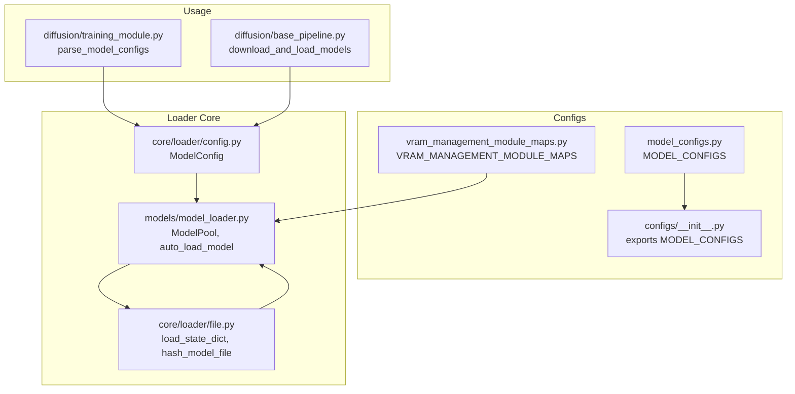
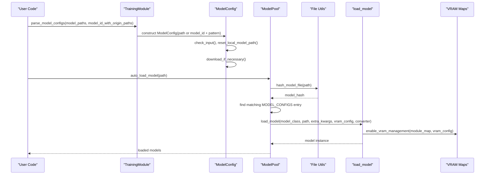
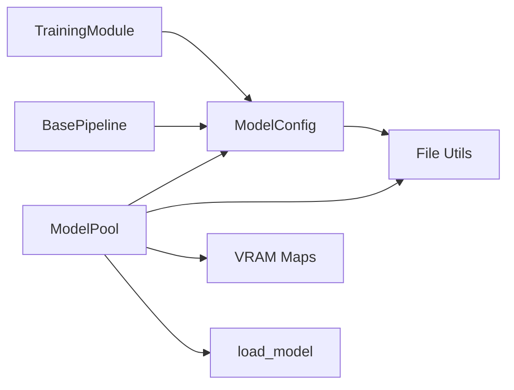

# Configuration Management

<cite>
**Referenced Files in This Document**
- [model_configs.py](file://diffsynth/configs/model_configs.py)
- [config.py](file://diffsynth/core/loader/config.py)
- [model_loader.py](file://diffsynth/models/model_loader.py)
- [file.py](file://diffsynth/core/loader/file.py)
- [vram_management_module_maps.py](file://diffsynth/configs/vram_management_module_maps.py)
- [training_module.py](file://diffsynth/diffusion/training_module.py)
- [base_pipeline.py](file://diffsynth/diffusion/base_pipeline.py)
- [__init__.py](file://diffsynth/configs/__init__.py)
</cite>

## Table of Contents
1. [Introduction](#introduction)
2. [Project Structure](#project-structure)
3. [Core Components](#core-components)
4. [Architecture Overview](#architecture-overview)
5. [Detailed Component Analysis](#detailed-component-analysis)
6. [Dependency Analysis](#dependency-analysis)
7. [Performance Considerations](#performance-considerations)
8. [Troubleshooting Guide](#troubleshooting-guide)
9. [Conclusion](#conclusion)
10. [Appendices](#appendices)

## Introduction
This document explains the configuration management system used to define, validate, and load model configurations across different architectures. It covers:
- How model parameters are defined and validated
- Configuration inheritance and override mechanisms
- Architecture-specific configuration schemas
- Examples of configuration entries for various model types
- Parameter validation rules
- Configuration merging strategies and default value handling
- Guidance for creating custom configurations for new model variants

The system is centered around a registry of model configurations that map file hashes to concrete model classes and optional parameter overrides, combined with a flexible ModelConfig dataclass that controls downloading, device placement, and dtype behavior.

## Project Structure
Configuration-related code is organized into:
- Centralized model registry and series definitions
- A dataclass-based configuration object for loading and VRAM control
- A loader that matches files to configurations via hashing and instantiates models
- Utilities for state dict loading and hashing
- VRAM module mapping tables for memory-efficient execution

**Diagram sources**
- [model_configs.py:919-920](file://diffsynth/configs/model_configs.py#L919-L920)
- [vram_management_module_maps.py:1-312](file://diffsynth/configs/vram_management_module_maps.py#L1-L312)
- [__init__.py:1-3](file://diffsynth/configs/__init__.py#L1-L3)
- [config.py:1-120](file://diffsynth/core/loader/config.py#L1-L120)
- [file.py:1-131](file://diffsynth/core/loader/file.py#L1-L131)
- [model_loader.py:1-114](file://diffsynth/models/model_loader.py#L1-L114)
- [training_module.py:138-174](file://diffsynth/diffusion/training_module.py#L138-L174)
- [base_pipeline.py:296-313](file://diffsynth/diffusion/base_pipeline.py#L296-L313)

**Section sources**
- [model_configs.py:1-920](file://diffsynth/configs/model_configs.py#L1-L920)
- [config.py:1-120](file://diffsynth/core/loader/config.py#L1-L120)
- [model_loader.py:1-114](file://diffsynth/models/model_loader.py#L1-L114)
- [file.py:1-131](file://diffsynth/core/loader/file.py#L1-L131)
- [vram_management_module_maps.py:1-312](file://diffsynth/configs/vram_management_module_maps.py#L1-L312)
- [training_module.py:138-174](file://diffsynth/diffusion/training_module.py#L138-L174)
- [base_pipeline.py:296-313](file://diffsynth/diffusion/base_pipeline.py#L296-L313)
- [__init__.py:1-3](file://diffsynth/configs/__init__.py#L1-L3)

## Core Components
- ModelConfig: A dataclass that encapsulates how to locate, download, and prepare model files, as well as device/dtype settings for offloading/onloading/preparing/computation phases.
- MODEL_CONFIGS: A consolidated list of model configuration entries grouped by series (e.g., qwen_image_series, wan_series, flux_series). Each entry defines model_hash, model_name, model_class, and optional extra_kwargs and state_dict_converter.
- ModelPool: Orchestrates automatic model detection by hashing input files and matching against MODEL_CONFIGS, then instantiating models with appropriate converters and VRAM mappings.
- File utilities: Provide state dict loading from safetensors/bin formats and compute stable hashes over keys (and optionally shapes) to identify model types.
- VRAM module maps: Define which modules should be wrapped for VRAM-aware execution per model class.

Key responsibilities:
- Validation: ModelConfig.check_input ensures either path or model_id is provided; parse_download_source and parse_skip_download honor environment variables.
- Downloading: ModelConfig.download supports ModelScope and HuggingFace hubs based on environment or explicit setting.
- Loading: ModelPool.auto_load_model uses hash_model_file to match MODEL_CONFIGS and calls load_model with converter and VRAM config.

**Section sources**
- [config.py:1-120](file://diffsynth/core/loader/config.py#L1-L120)
- [model_configs.py:1-920](file://diffsynth/configs/model_configs.py#L1-L920)
- [model_loader.py:1-114](file://diffsynth/models/model_loader.py#L1-L114)
- [file.py:1-131](file://diffsynth/core/loader/file.py#L1-L131)
- [vram_management_module_maps.py:1-312](file://diffsynth/configs/vram_management_module_maps.py#L1-L312)

## Architecture Overview
The configuration system follows a clear pipeline:
1. User provides either local paths or model IDs with origin file patterns.
2. ModelConfig normalizes inputs, resolves download source, and downloads if necessary.
3. ModelPool computes a stable hash of the file(s) and finds a matching MODEL_CONFIGS entry.
4. The corresponding model class is instantiated with extra_kwargs; an optional state_dict_converter adapts weights.
5. VRAM management is enabled using module maps when configured.

**Diagram sources**
- [training_module.py:138-174](file://diffsynth/diffusion/training_module.py#L138-L174)
- [config.py:28-108](file://diffsynth/core/loader/config.py#L28-L108)
- [model_loader.py:64-83](file://diffsynth/models/model_loader.py#L64-L83)
- [file.py:126-131](file://diffsynth/core/loader/file.py#L126-L131)
- [vram_management_module_maps.py:1-312](file://diffsynth/configs/vram_management_module_maps.py#L1-L312)

## Detailed Component Analysis

### ModelConfig Dataclass
ModelConfig centralizes all aspects of locating and preparing model files and controlling device/dtype behavior across stages:
- Input validation: Ensures at least one of path or model_id is set.
- Pattern parsing: Normalizes origin_file_pattern to support directory globs.
- Download source: Defaults to ModelScope unless overridden by environment or explicit field.
- Skip download: Controlled by environment variable or explicit field.
- Local path resolution: Uses environment variable or defaults to "./models".
- Download orchestration: Supports ModelScope and HuggingFace hubs with allow/ignore patterns.
- Path finalization: Resolves to absolute path(s), collapsing single-element lists.
- VRAM config export: Provides a dictionary for downstream VRAM management.

Validation rules:
- If both path and model_id are None, raises ValueError.
- download_source must be "modelscope" or "huggingface".
- skip_download respects boolean values parsed from environment.

Default value handling:
- Many fields default to None and are resolved lazily during download_if_necessary.
- local_model_path defaults to "./models" if not set via environment.

**Section sources**
- [config.py:1-120](file://diffsynth/core/loader/config.py#L1-L120)

### MODEL_CONFIGS Registry and Series
MODEL_CONFIGS is a concatenation of series arrays, each defining multiple model entries:
- Fields per entry:
  - model_hash: Stable identifier derived from file keys/shapes.
  - model_name: Human-readable name used for logging and fetching.
  - model_class: Fully qualified Python class path for instantiation.
  - extra_kwargs: Optional dictionary of constructor arguments for the model class.
  - state_dict_converter: Optional fully qualified converter class path to adapt weight keys.

Examples across series:
- qwen_image_series: DiT, text encoders, VAEs, ControlNet variants, image encoders, LoRA adapters.
- wan_series: Video DiTs, text encoders, VAEs, motion controllers, audio encoders, adapters.
- flux_series: DiT, text encoders (CLIP/T5), VAE encoder/decoder, ControlNet, IP-Adapter, LoRA components.
- flux2_series: Text encoder, DiT, VAE, and variant configurations.
- ernie_image_series: DiT and text encoder.
- z_image_series: DiT, text encoder, VAE encoder/decoder, ControlNet, LoRA-style adapters.
- ltx2_series: DiT, video/audio VAEs, vocoder, text encoder post-modules, upsampler.

Inheritance and override mechanism:
- There is no runtime inheritance between entries. Instead, each entry is self-contained.
- Overrides are achieved by providing extra_kwargs specific to a model_hash entry.
- Different entries can share the same model_class but differ in extra_kwargs and/or state_dict_converter.

Merging strategy:
- No merging occurs at runtime; the correct entry is selected by exact model_hash match.
- Default values come from the model class constructor; extra_kwargs provide targeted overrides.

**Section sources**
- [model_configs.py:1-920](file://diffsynth/configs/model_configs.py#L1-L920)
- [__init__.py:1-3](file://diffsynth/configs/__init__.py#L1-L3)

### ModelPool and Auto-Loading
ModelPool coordinates model discovery and instantiation:
- import_model_class: Dynamically imports model classes from strings.
- need_to_enable_vram_management: Determines whether VRAM wrapping is needed based on vram_config.
- fetch_module_map: Builds a mapping from original modules to VRAM-wrapped modules per model class, with version-aware updates.
- load_model_file: Instantiates model with extra_kwargs, applies state_dict_converter if present, and enables VRAM management.
- default_vram_config: Provides sensible defaults for offload/onload/preparing/computation devices and dtypes.
- auto_load_model: Hashes input files, matches MODEL_CONFIGS, loads the model, logs metadata, and appends to internal lists.

Error handling:
- If no matching MODEL_CONFIGS entry is found, raises ValueError with details about the file and hash.

**Section sources**
- [model_loader.py:1-114](file://diffsynth/models/model_loader.py#L1-L114)

### File Utilities and Hashing
File utilities handle robust state dict loading and stable hashing:
- load_state_dict: Supports safetensors and bin formats, merges multi-file dicts, and optionally pins memory.
- load_state_dict_from_safetensors: Streams tensors safely and converts dtype if specified.
- load_state_dict_from_bin: Handles common wrapper keys ("state_dict", "module", "model_state") and dtype conversion.
- hash_model_file: Computes MD5 over sorted key strings (optionally including shapes) to uniquely identify model structure.

Complexity considerations:
- Hashing scales with number of keys and their shapes; typically fast due to lightweight string operations.
- State dict loading is I/O bound; pin_memory can accelerate subsequent GPU transfers.

**Section sources**
- [file.py:1-131](file://diffsynth/core/loader/file.py#L1-L131)

### VRAM Module Mapping
VRAM module maps specify which modules should be wrapped for memory-efficient execution:
- Per-model-class mappings target specific layers (Linear, Conv, Embedding, Norm, etc.).
- Some mappings use generic templates (e.g., flux_general_vram_config).
- Version-aware updater adjusts mappings for library changes (e.g., Qwen RMSNorm renaming).

Behavior:
- When VRAM management is enabled, modules are replaced with wrappers that manage offload/onload cycles.
- Non-recurse wrappers exist for complex blocks where recursion would cause issues.

**Section sources**
- [vram_management_module_maps.py:1-312](file://diffsynth/configs/vram_management_module_maps.py#L1-L312)

### Integration Points and Usage
- TrainingModule.parse_model_configs constructs ModelConfig instances from CLI args or JSON, applying FP8/offload flags and device settings.
- BasePipeline.download_and_load_models consumes ModelConfig lists to orchestrate downloads and model loading through ModelPool.

These integration points ensure consistent configuration handling across training and inference workflows.

**Section sources**
- [training_module.py:138-174](file://diffsynth/diffusion/training_module.py#L138-L174)
- [base_pipeline.py:296-313](file://diffsynth/diffusion/base_pipeline.py#L296-L313)

## Dependency Analysis
The configuration system exhibits low coupling and high cohesion:
- MODEL_CONFIGS depends only on series arrays and is exported centrally.
- ModelConfig is self-contained and relies on standard libraries and hub clients.
- ModelPool depends on file utilities for hashing and on VRAM maps for memory management.
- Usage modules depend on ModelConfig and ModelPool but do not directly manipulate internals.

Potential circular dependencies:
- None observed; imports are directional from usage to core loader and configs.

External dependencies:
- Hub clients (ModelScope, HuggingFace) for downloading.
- Transformers for DeepSpeed ZeRO integration and certain model classes.

**Diagram sources**
- [config.py:1-120](file://diffsynth/core/loader/config.py#L1-L120)
- [file.py:1-131](file://diffsynth/core/loader/file.py#L1-L131)
- [model_loader.py:1-114](file://diffsynth/models/model_loader.py#L1-L114)
- [vram_management_module_maps.py:1-312](file://diffsynth/configs/vram_management_module_maps.py#L1-L312)
- [training_module.py:138-174](file://diffsynth/diffusion/training_module.py#L138-L174)
- [base_pipeline.py:296-313](file://diffsynth/diffusion/base_pipeline.py#L296-L313)

**Section sources**
- [model_loader.py:1-114](file://diffsynth/models/model_loader.py#L1-L114)
- [config.py:1-120](file://diffsynth/core/loader/config.py#L1-L120)
- [file.py:1-131](file://diffsynth/core/loader/file.py#L1-L131)
- [vram_management_module_maps.py:1-312](file://diffsynth/configs/vram_management_module_maps.py#L1-L312)
- [training_module.py:138-174](file://diffsynth/diffusion/training_module.py#L138-L174)
- [base_pipeline.py:296-313](file://diffsynth/diffusion/base_pipeline.py#L296-L313)

## Performance Considerations
- DiskMap usage: Enables lazy loading of only required parameters, reducing peak memory.
- Pin memory: Accelerates CPU-to-GPU transfers when loading state dicts into CPU memory first.
- VRAM wrapping: Minimizes active memory by offloading non-computation modules to disk/CPU.
- Hashing efficiency: Stable hashing avoids unnecessary re-downloads and mis-detections.
- DeepSpeed ZeRO: Special handling prevents excessive memory consumption during initialization.

[No sources needed since this section provides general guidance]

## Troubleshooting Guide
Common issues and resolutions:
- Invalid ModelConfig input: Ensure either path or model_id is provided; otherwise, check_input raises ValueError.
- Unsupported download_source: Must be "modelscope" or "huggingface"; verify environment variable or explicit field.
- Missing model type detection: If hash does not match any MODEL_CONFIGS entry, auto_load_model raises ValueError; confirm file integrity and registry coverage.
- VRAM configuration errors: Verify offload_device and offload_dtype are set consistently; ensure module maps exist for the model class.
- State dict format mismatches: Use appropriate state_dict_converter if the checkpoint has non-standard key layouts.

**Section sources**
- [config.py:28-83](file://diffsynth/core/loader/config.py#L28-L83)
- [model_loader.py:64-83](file://diffsynth/models/model_loader.py#L64-L83)
- [file.py:126-131](file://diffsynth/core/loader/file.py#L126-L131)

## Conclusion
The configuration management system provides a robust, extensible framework for defining and loading model configurations across diverse architectures. By combining a centralized registry with flexible ModelConfig semantics and VRAM-aware loading, it supports efficient inference and training workflows. Extending the system involves adding new series entries with appropriate hashes, classes, and optional converters, while leveraging existing VRAM maps for memory optimization.

[No sources needed since this section summarizes without analyzing specific files]

## Appendices

### Creating Custom Configurations for New Model Variants
Steps to add a new model variant:
1. Determine the model class and constructor parameters.
2. Prepare a state_dict_converter if the checkpoint format differs from the expected layout.
3. Compute the model_hash using hash_model_file on representative checkpoints.
4. Add a new entry to the appropriate series array in MODEL_CONFIGS with:
   - model_hash: computed hash
   - model_name: descriptive name
   - model_class: fully qualified class path
   - extra_kwargs: constructor overrides
   - state_dict_converter: optional converter path
5. If VRAM management is desired, add module mappings in VRAM_MANAGEMENT_MODULE_MAPS for the model class.
6. Validate by running auto_load_model on sample files and ensuring successful instantiation.

Best practices:
- Keep extra_kwargs minimal and focused on architecture differences.
- Prefer separate entries for distinct checkpoints rather than complex runtime branching.
- Test VRAM wrapping thoroughly to avoid recursion or performance regressions.

[No sources needed since this section provides general guidance]