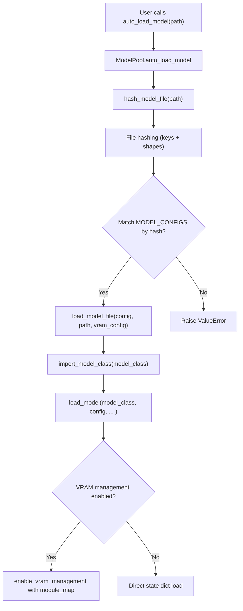
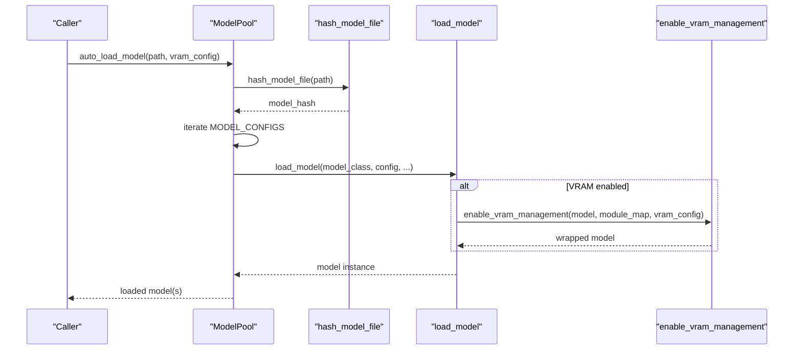
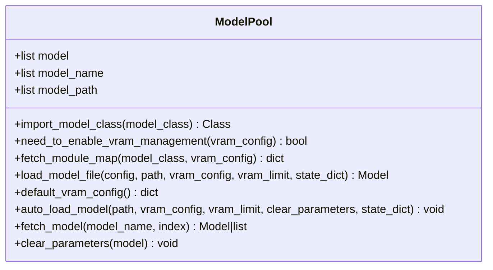
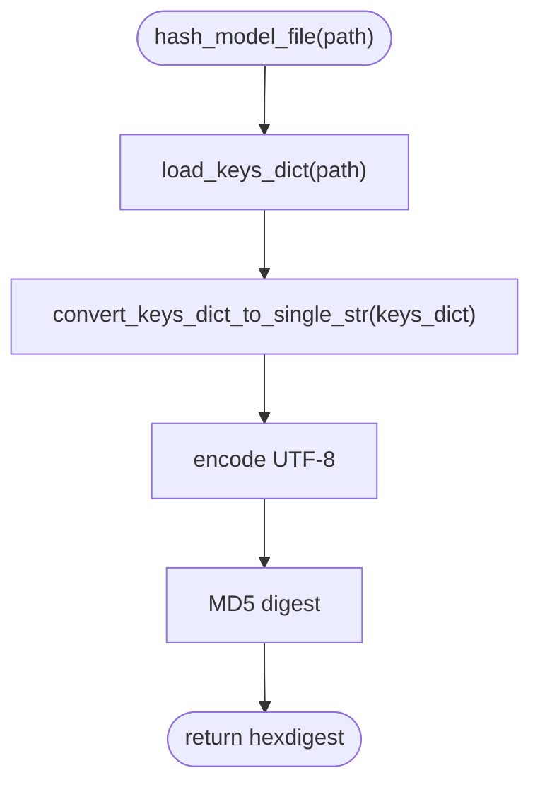
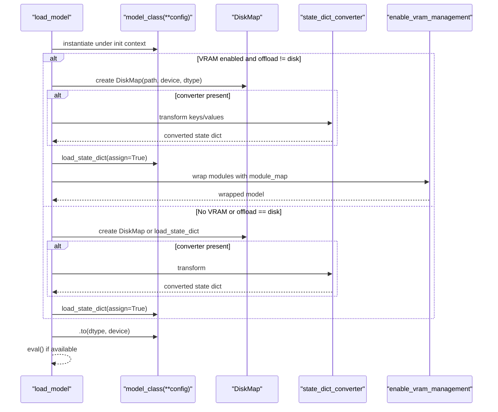
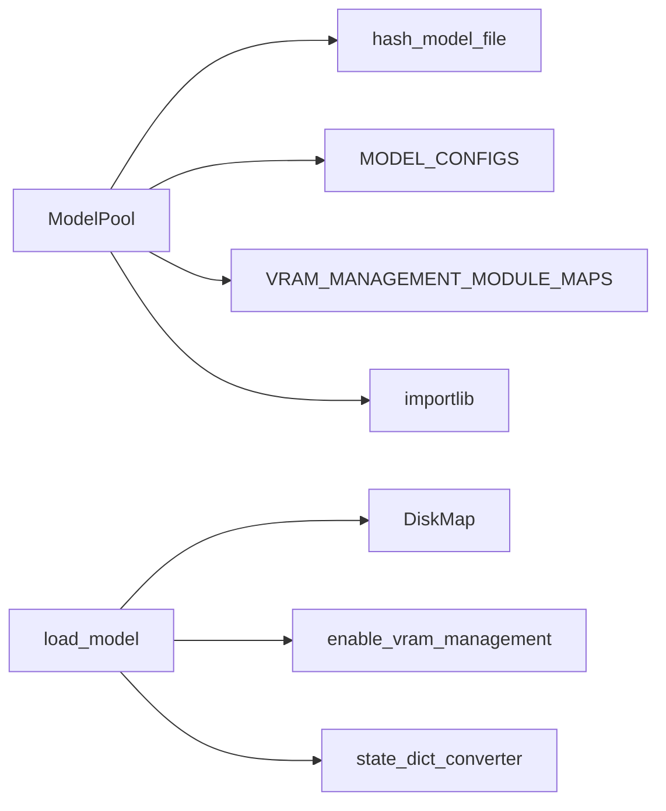

# Dynamic Module Loading

<cite>
**Referenced Files in This Document**
- [model_loader.py](file://diffsynth/models/model_loader.py)
- [model.py](file://diffsynth/core/loader/model.py)
- [file.py](file://diffsynth/core/loader/file.py)
- [model_configs.py](file://diffsynth/configs/model_configs.py)
- [vram_management_module_maps.py](file://diffsynth/configs/vram_management_module_maps.py)
- [__init__.py](file://diffsynth/configs/__init__.py)
</cite>

## Table of Contents
1. [Introduction](#introduction)
2. [Project Structure](#project-structure)
3. [Core Components](#core-components)
4. [Architecture Overview](#architecture-overview)
5. [Detailed Component Analysis](#detailed-component-analysis)
6. [Dependency Analysis](#dependency-analysis)
7. [Performance Considerations](#performance-considerations)
8. [Troubleshooting Guide](#troubleshooting-guide)
9. [Conclusion](#conclusion)

## Introduction
This document explains the dynamic module loading system used to automatically discover and load model classes based on configuration and file hash matching. It covers how new model implementations are detected, how import errors are handled, fallback mechanisms, performance considerations, and best practices for organizing custom model modules and ensuring proper registration.

## Project Structure
The dynamic loading system spans several layers:
- Configuration registry that maps model files to Python classes via stable hashes
- Hash computation utilities that identify models without loading full parameters
- Model loader that dynamically imports classes and constructs instances
- VRAM management mapping that wraps specific modules for memory optimization

**Diagram sources**
- [model_loader.py:64-82](file://diffsynth/models/model_loader.py#L64-L82)
- [file.py:126-130](file://diffsynth/core/loader/file.py#L126-L130)
- [model.py:11-65](file://diffsynth/core/loader/model.py#L11-L65)

**Section sources**
- [model_loader.py:1-114](file://diffsynth/models/model_loader.py#L1-L114)
- [model.py:1-106](file://diffsynth/core/loader/model.py#L1-L106)
- [file.py:1-131](file://diffsynth/core/loader/file.py#L1-L131)
- [model_configs.py:1-920](file://diffsynth/configs/model_configs.py#L1-L920)
- [vram_management_module_maps.py:1-312](file://diffsynth/configs/vram_management_module_maps.py#L1-L312)
- [__init__.py:1-3](file://diffsynth/configs/__init__.py#L1-L3)

## Core Components
- ModelPool: Orchestrates discovery, dynamic import, and instantiation of models; manages VRAM wrapping and retrieval.
- Hashing utilities: Compute a stable identifier from state dict keys and shapes to match against registered configurations.
- Loader: Instantiates model classes, applies optional state dict converters, and optionally enables VRAM management.
- Config registry: Centralized list of model configurations mapping hashes to class paths and optional converters.
- VRAM module maps: Maps specific model classes to wrapper classes for automatic VRAM-aware layer replacement.

Key responsibilities:
- Discover model type via hash matching
- Dynamically import model classes from string paths
- Construct models with extra kwargs and optional state dict converters
- Optionally wrap modules for VRAM management

**Section sources**
- [model_loader.py:7-114](file://diffsynth/models/model_loader.py#L7-L114)
- [file.py:126-130](file://diffsynth/core/loader/file.py#L126-L130)
- [model.py:11-65](file://diffsynth/core/loader/model.py#L11-L65)
- [model_configs.py:919-920](file://diffsynth/configs/model_configs.py#L919-L920)
- [vram_management_module_maps.py:12-312](file://diffsynth/configs/vram_management_module_maps.py#L12-L312)

## Architecture Overview
The system follows a configuration-driven, hash-based discovery pattern:
- The user provides one or more model file paths.
- The system computes a hash from the file’s state dict keys and shapes.
- The hash is matched against MODEL_CONFIGS entries.
- On match, the corresponding model class path is imported and instantiated.
- Optional state dict converters adapt checkpoint formats.
- Optional VRAM management wraps targeted layers for efficient memory usage.

**Diagram sources**
- [model_loader.py:64-82](file://diffsynth/models/model_loader.py#L64-L82)
- [file.py:126-130](file://diffsynth/core/loader/file.py#L126-L130)
- [model.py:11-65](file://diffsynth/core/loader/model.py#L11-L65)

## Detailed Component Analysis

### ModelPool: Discovery, Import, and Instantiation
- Dynamic import: Splits a fully qualified class path into module and class name, then uses importlib to fetch the class at runtime.
- Hash matching: Computes the model hash and scans MODEL_CONFIGS to find a matching entry.
- Construction: Builds the model using the matched config’s model_class and extra_kwargs.
- VRAM mapping: If VRAM management is enabled, builds a module_map from VRAM_MANAGEMENT_MODULE_MAPS or defaults to AutoWrappedModule.
- Retrieval: Stores loaded models and supports fetching by model_name with index selection.

Error handling:
- If no config matches the computed hash, raises a clear error indicating inability to detect model type.

**Diagram sources**
- [model_loader.py:7-114](file://diffsynth/models/model_loader.py#L7-L114)

**Section sources**
- [model_loader.py:13-17](file://diffsynth/models/model_loader.py#L13-L17)
- [model_loader.py:22-31](file://diffsynth/models/model_loader.py#L22-L31)
- [model_loader.py:33-49](file://diffsynth/models/model_loader.py#L33-L49)
- [model_loader.py:64-82](file://diffsynth/models/model_loader.py#L64-L82)
- [model_loader.py:84-107](file://diffsynth/models/model_loader.py#L84-L107)

### Hashing and File Utilities
- Hash computation: Uses state dict keys and tensor shapes to generate a stable MD5 hash. For safetensors, this avoids reading parameter values.
- Key extraction: Supports both safetensors and binary formats, normalizing nested structures and sorting keys deterministically.

Performance implications:
- Safetensors hashing is near-instant because it reads only metadata.
- Binary formats require full parameter read, which is slower and discouraged for frequent hashing.

**Diagram sources**
- [file.py:126-130](file://diffsynth/core/loader/file.py#L126-L130)
- [file.py:74-107](file://diffsynth/core/loader/file.py#L74-L107)

**Section sources**
- [file.py:126-130](file://diffsynth/core/loader/file.py#L126-L130)
- [file.py:5-23](file://diffsynth/core/loader/file.py#L5-L23)
- [file.py:36-49](file://diffsynth/core/loader/file.py#L36-L49)

### Model Loader: Instantiation and VRAM Management
- Instantiation: Creates the model class with provided config and context managers to skip unnecessary initialization when possible.
- State dict handling:
  - If VRAM management is enabled and offload device is not disk, loads parameters via DiskMap and applies optional state dict converter before assignment.
  - Otherwise, uses DiskMap or direct state dict loading depending on flags.
  - Handles DeepSpeed ZeRO Stage 3 specially to avoid excessive GPU memory consumption.
- VRAM management: Wraps selected modules according to module_map and vram_config, enabling lazy loading/offloading strategies.

**Diagram sources**
- [model.py:11-65](file://diffsynth/core/loader/model.py#L11-L65)
- [model.py:68-88](file://diffsynth/core/loader/model.py#L68-L88)

**Section sources**
- [model.py:11-65](file://diffsynth/core/loader/model.py#L11-L65)
- [model.py:91-106](file://diffsynth/core/loader/model.py#L91-L106)

### Configuration Registry: MODEL_CONFIGS
- Aggregates multiple series lists (e.g., qwen_image_series, wan_series, flux_series, etc.) into a single MODEL_CONFIGS.
- Each entry includes:
  - model_hash: Stable identifier derived from state dict keys/shapes
  - model_name: Human-readable identifier used for retrieval
  - model_class: Fully qualified Python class path
  - extra_kwargs: Optional constructor arguments
  - state_dict_converter: Optional function to adapt checkpoint formats

Discovery process:
- When a new model is added, compute its hash and append an entry to the appropriate series list.
- Ensure the model_class path resolves correctly and any required converters are implemented.

**Section sources**
- [model_configs.py:1-920](file://diffsynth/configs/model_configs.py#L1-L920)
- [model_configs.py:919-920](file://diffsynth/configs/model_configs.py#L919-L920)

### VRAM Management Module Maps
- Maps specific model classes to wrapper classes for layers/modules that should be managed for VRAM efficiency.
- Supports version-specific updates via VERSION_CHECKER_MAPS functions that adjust mappings based on library versions.
- Default fallback: If a model class is not explicitly mapped, it is wrapped with AutoWrappedModule.

Benefits:
- Automatic layer wrapping reduces peak memory usage during inference/training.
- Flexible per-model customization ensures compatibility across diverse architectures.

**Section sources**
- [vram_management_module_maps.py:12-312](file://diffsynth/configs/vram_management_module_maps.py#L12-L312)

## Dependency Analysis
- ModelPool depends on:
  - hash_model_file for identification
  - MODEL_CONFIGS for mapping
  - VRAM_MANAGEMENT_MODULE_MAPS and VERSION_CHECKER_MAPS for VRAM wrapping
  - importlib for dynamic class resolution
- load_model depends on:
  - DiskMap for lazy/optimized parameter access
  - enable_vram_management for VRAM-aware wrapping
  - Optional state_dict_converter for format adaptation
- Config aggregation centralizes all supported models, making extension straightforward.

**Diagram sources**
- [model_loader.py:1-49](file://diffsynth/models/model_loader.py#L1-L49)
- [model.py:11-65](file://diffsynth/core/loader/model.py#L11-L65)
- [file.py:126-130](file://diffsynth/core/loader/file.py#L126-L130)

**Section sources**
- [model_loader.py:1-49](file://diffsynth/models/model_loader.py#L1-L49)
- [model.py:11-65](file://diffsynth/core/loader/model.py#L11-L65)
- [file.py:126-130](file://diffsynth/core/loader/file.py#L126-L130)

## Performance Considerations
- Prefer safetensors for faster hashing and reduced memory overhead.
- Use DiskMap to avoid loading entire checkpoints into memory when not needed.
- Enable VRAM management selectively via module_map to minimize overhead while maximizing memory savings.
- Avoid repeated hashing of large binary files; cache results if necessary.
- Leverage skip_model_initialization contexts to speed up model construction.

[No sources needed since this section provides general guidance]

## Troubleshooting Guide
Common issues and resolutions:
- Cannot detect model type:
  - Ensure the model file’s hash matches an entry in MODEL_CONFIGS.
  - Verify state dict keys and shapes are consistent with expected formats.
- Import errors for model_class:
  - Confirm the fully qualified path exists and the module is importable.
  - Check that dependencies are installed and accessible.
- State dict conversion failures:
  - Implement or update state_dict_converter to handle the checkpoint format.
  - Validate key renaming logic and tensor shape transformations.
- VRAM management not applied:
  - Ensure vram_config has valid offload_dtype and offload_device.
  - Add explicit mappings in VRAM_MANAGEMENT_MODULE_MAPS if needed.

**Section sources**
- [model_loader.py:81-82](file://diffsynth/models/model_loader.py#L81-L82)
- [model_loader.py:13-17](file://diffsynth/models/model_loader.py#L13-L17)
- [model.py:47-48](file://diffsynth/core/loader/model.py#L47-L48)

## Conclusion
The dynamic module loading system provides a robust, configuration-driven mechanism for discovering and instantiating model classes. By leveraging stable hashes, dynamic imports, and optional VRAM management, it supports seamless integration of new models with minimal boilerplate. Proper organization of model modules, accurate configuration entries, and well-implemented state dict converters ensure reliable detection and efficient loading.

[No sources needed since this section summarizes without analyzing specific files]