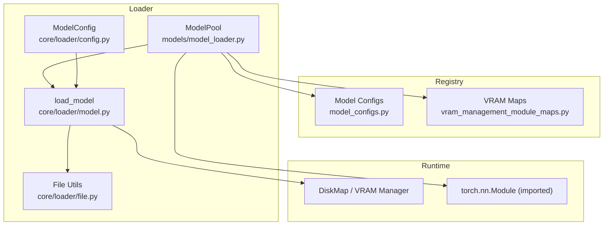
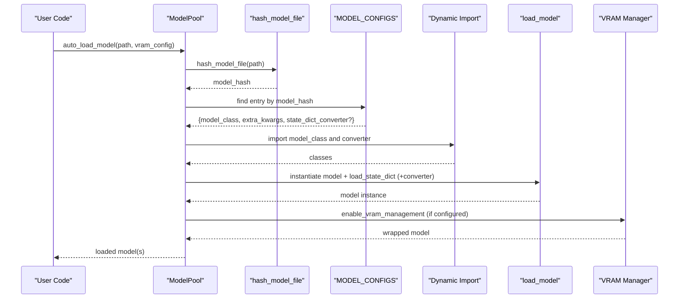
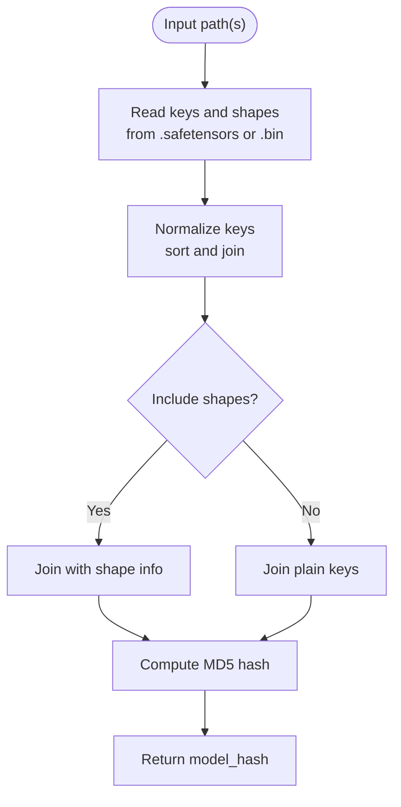
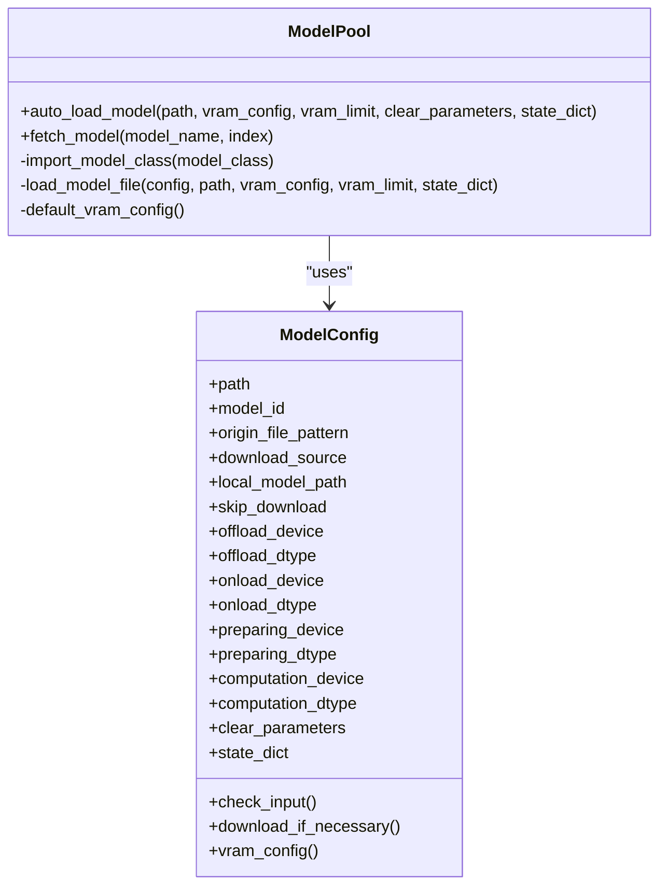
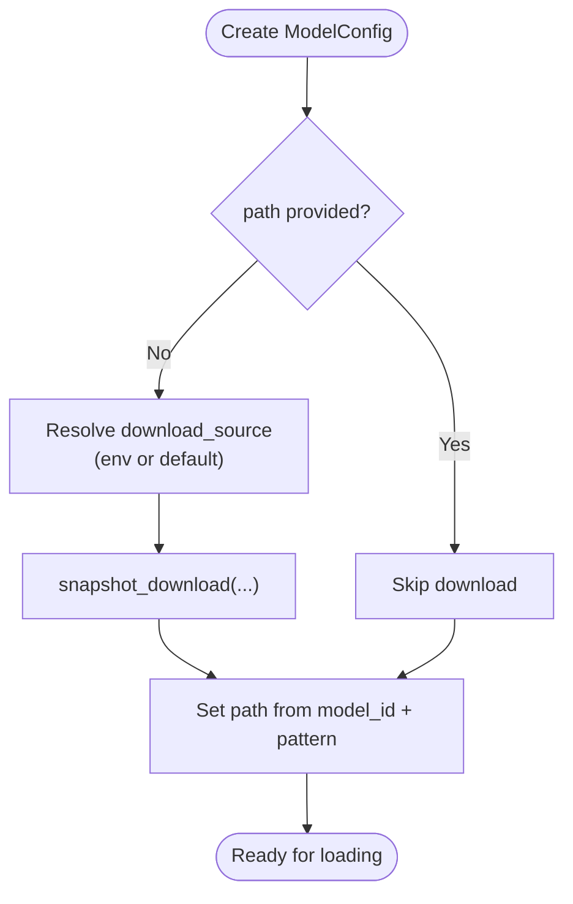
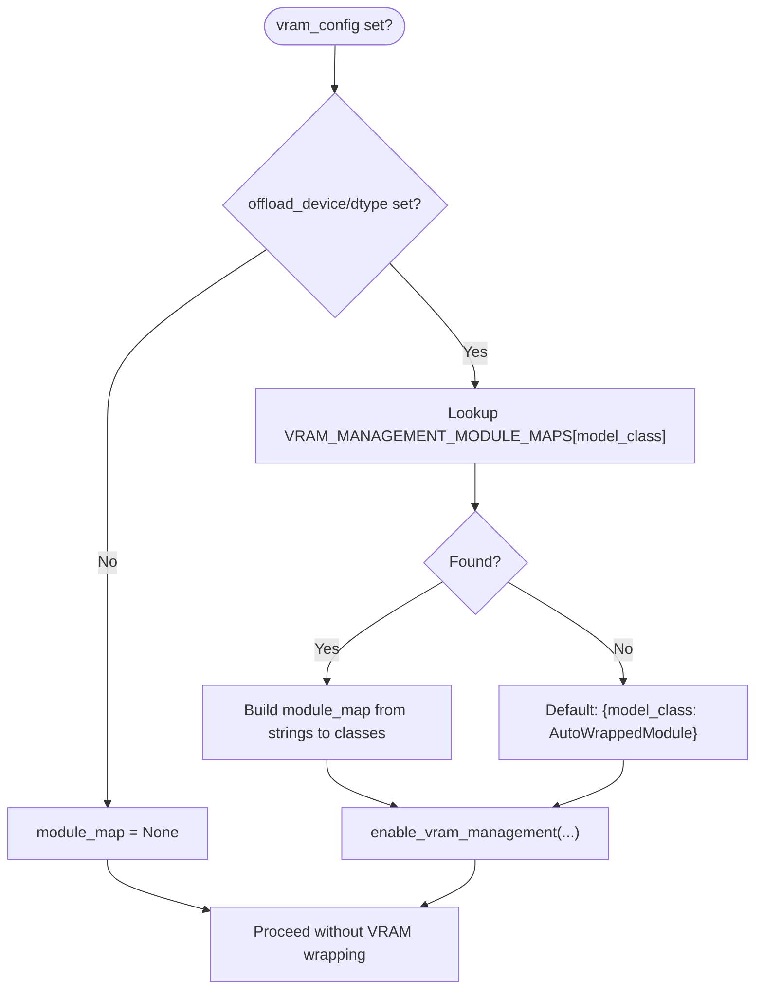
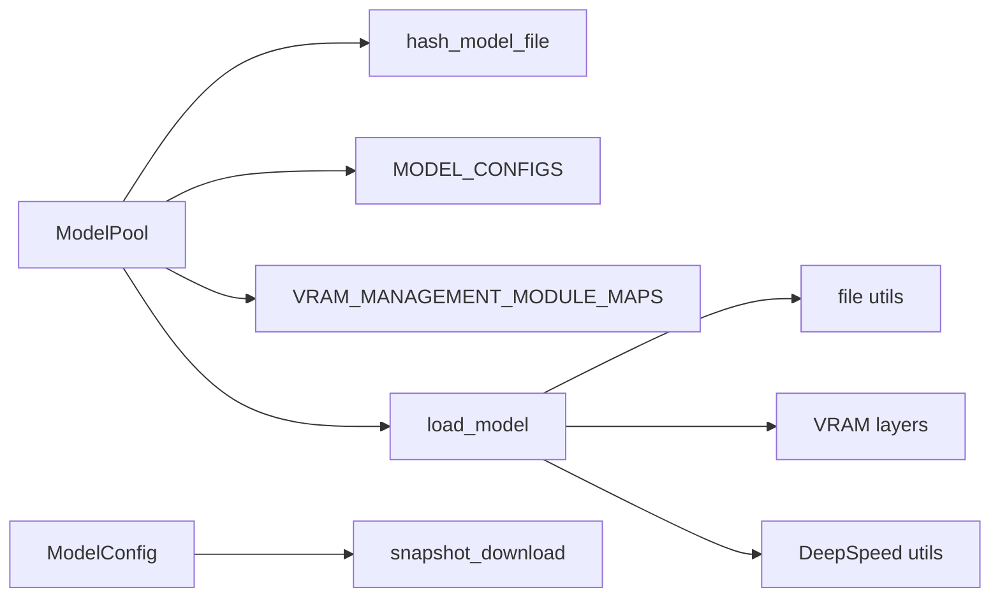

# Model Loading System

<cite>
**Referenced Files in This Document**
- [model_loader.py](file://diffsynth/models/model_loader.py)
- [model.py](file://diffsynth/core/loader/model.py)
- [config.py](file://diffsynth/core/loader/config.py)
- [file.py](file://diffsynth/core/loader/file.py)
- [model_configs.py](file://diffsynth/configs/model_configs.py)
- [vram_management_module_maps.py](file://diffsynth/configs/vram_management_module_maps.py)
- [__init__.py](file://diffsynth/configs/__init__.py)
- [__init__.py](file://diffsynth/core/loader/__init__.py)
</cite>

## Table of Contents
1. [Introduction](#introduction)
2. [Project Structure](#project-structure)
3. [Core Components](#core-components)
4. [Architecture Overview](#architecture-overview)
5. [Detailed Component Analysis](#detailed-component-analysis)
6. [Dependency Analysis](#dependency-analysis)
7. [Performance Considerations](#performance-considerations)
8. [Troubleshooting Guide](#troubleshooting-guide)
9. [Conclusion](#conclusion)
10. [Appendices](#appendices)

## Introduction
This document explains the model loading system that automatically identifies and loads models based on a hash-based identification mechanism. It covers:
- Hash-based model identification from state dictionary keys
- The model registry and dynamic module importing
- Configuration file parsing and download handling
- State dictionary conversion for compatibility across formats
- VRAM management integration and disk offloading
- Error handling for missing dependencies and version compatibility
- Guidance to integrate custom models into the loader

## Project Structure
The model loading system is composed of:
- A registry of model configurations with hashes, class paths, and optional converters
- A loader that computes a hash from model files, matches it to a configuration, imports the model class dynamically, and constructs the model with appropriate VRAM settings
- Utilities to load state dictionaries from safetensors or binary formats, compute hashes, and convert keys
- VRAM management maps that wrap specific modules for memory optimization

**Diagram sources**
- [model_loader.py:1-114](file://diffsynth/models/model_loader.py#L1-L114)
- [model.py:1-106](file://diffsynth/core/loader/model.py#L1-L106)
- [config.py:1-120](file://diffsynth/core/loader/config.py#L1-L120)
- [file.py:1-131](file://diffsynth/core/loader/file.py#L1-L131)
- [model_configs.py:1-920](file://diffsynth/configs/model_configs.py#L1-L920)
- [vram_management_module_maps.py:1-312](file://diffsynth/configs/vram_management_module_maps.py#L1-L312)

**Section sources**
- [model_loader.py:1-114](file://diffsynth/models/model_loader.py#L1-L114)
- [model.py:1-106](file://diffsynth/core/loader/model.py#L1-L106)
- [config.py:1-120](file://diffsynth/core/loader/config.py#L1-L120)
- [file.py:1-131](file://diffsynth/core/loader/file.py#L1-L131)
- [model_configs.py:1-920](file://diffsynth/configs/model_configs.py#L1-L920)
- [vram_management_module_maps.py:1-312](file://diffsynth/configs/vram_management_module_maps.py#L1-L312)

## Core Components
- ModelPool: Orchestrates auto-loading by hashing input files, matching against registered configs, importing model classes dynamically, and constructing models with VRAM settings.
- load_model: Instantiates a model under an initialization context, loads state dict (with optional DiskMap), applies optional state_dict_converter, handles DeepSpeed ZeRO Stage 3, and moves to target dtype/device.
- ModelConfig: Encapsulates path/model_id, download source, local base path, skip-download behavior, and VRAM config generation.
- File utilities: Load state dicts from safetensors/bin, compute key-only hashes, and support multi-file aggregation.
- VRAM maps: Map original modules to wrapped versions for automatic VRAM management; include version-aware updaters.

Key responsibilities:
- Hash-based identification ensures the correct implementation is selected regardless of repository layout changes.
- Dynamic import allows adding new models without modifying core loader logic.
- State dict converters bridge different checkpoint formats to internal expectations.
- VRAM maps enable fine-grained memory control per model type.

**Section sources**
- [model_loader.py:1-114](file://diffsynth/models/model_loader.py#L1-L114)
- [model.py:1-106](file://diffsynth/core/loader/model.py#L1-L106)
- [config.py:1-120](file://diffsynth/core/loader/config.py#L1-L120)
- [file.py:1-131](file://diffsynth/core/loader/file.py#L1-L131)
- [vram_management_module_maps.py:1-312](file://diffsynth/configs/vram_management_module_maps.py#L1-L312)

## Architecture Overview
The auto-loading pipeline:
1. Compute a hash from the provided file(s) using only keys and shapes.
2. Match the hash against MODEL_CONFIGS entries.
3. Import the model class and optional state_dict_converter via dynamic import.
4. Build the model with extra_kwargs from the config.
5. Optionally enable VRAM management using module maps and vram_config.
6. Load state dict (full or lazy via DiskMap), apply converter if present, and move to device/dtype.

**Diagram sources**
- [model_loader.py:64-83](file://diffsynth/models/model_loader.py#L64-L83)
- [file.py:126-131](file://diffsynth/core/loader/file.py#L126-L131)
- [model.py:11-65](file://diffsynth/core/loader/model.py#L11-L65)

**Section sources**
- [model_loader.py:64-83](file://diffsynth/models/model_loader.py#L64-L83)
- [file.py:126-131](file://diffsynth/core/loader/file.py#L126-L131)
- [model.py:11-65](file://diffsynth/core/loader/model.py#L11-L65)

## Detailed Component Analysis

### Hash-Based Model Identification
- Keys are extracted from safetensors or bin files without loading tensors.
- Keys are normalized and sorted, optionally including tensor shapes.
- MD5 hash is computed over the serialized key string.
- Multi-file inputs are aggregated before hashing.

**Diagram sources**
- [file.py:52-71](file://diffsynth/core/loader/file.py#L52-L71)
- [file.py:110-131](file://diffsynth/core/loader/file.py#L110-L131)

**Section sources**
- [file.py:52-71](file://diffsynth/core/loader/file.py#L52-L71)
- [file.py:110-131](file://diffsynth/core/loader/file.py#L110-L131)

### Model Registry and Dynamic Import
- MODEL_CONFIGS aggregates multiple series (e.g., qwen_image_series, wan_series, flux_series, etc.).
- Each entry contains:
  - model_hash: unique fingerprint of the checkpoint
  - model_name: human-readable identifier
  - model_class: fully-qualified Python path to the torch.nn.Module subclass
  - state_dict_converter: optional fully-qualified path to a function that transforms state dict keys/values
  - extra_kwargs: optional constructor arguments for the model class
- ModelPool.import_model_class uses importlib to resolve the class at runtime.

**Diagram sources**
- [model_loader.py:7-50](file://diffsynth/models/model_loader.py#L7-L50)
- [config.py:9-120](file://diffsynth/core/loader/config.py#L9-L120)

**Section sources**
- [model_loader.py:7-50](file://diffsynth/models/model_loader.py#L7-L50)
- [model_configs.py:1-920](file://diffsynth/configs/model_configs.py#L1-L920)
- [config.py:9-120](file://diffsynth/core/loader/config.py#L9-L120)

### Dynamic Module Importing
- ModelPool.import_model_class splits the fully-qualified class path into module and class name, then imports the module and retrieves the attribute.
- This enables zero-code changes when adding new model implementations, as long as their fully-qualified path is added to MODEL_CONFIGS.

**Section sources**
- [model_loader.py:13-17](file://diffsynth/models/model_loader.py#L13-L17)

### Configuration File Parsing and Download Handling
- ModelConfig supports specifying either direct local paths or remote model_id with origin_file_pattern.
- Supports downloading from ModelsScope or HuggingFace Hub based on environment variable or explicit setting.
- Allows skipping downloads when files are already present locally.
- Normalizes path resolution and supports glob patterns for multi-file checkpoints.

**Diagram sources**
- [config.py:28-108](file://diffsynth/core/loader/config.py#L28-L108)

**Section sources**
- [config.py:28-108](file://diffsynth/core/loader/config.py#L28-L108)

### State Dictionary Conversion
- Some checkpoints use non-standard naming or nested structures.
- state_dict_converter functions transform raw state dicts into the format expected by the model’s load_state_dict.
- Converters can rename keys, concatenate tensors, strip prefixes, or restructure nested dicts.

Examples of converter usage:
- FluxDiTStateDictConverter and FluxDiTStateDictConverterFromDiffusers handle different upstream formats.
- Many series define converters for text encoders, VAEs, and adapters.

**Section sources**
- [model_loader.py:33-49](file://diffsynth/models/model_loader.py#L33-L49)
- [model_configs.py:1-920](file://diffsynth/configs/model_configs.py#L1-L920)
- [flux_dit.py:1-197](file://diffsynth/utils/state_dict_converters/flux_dit.py#L1-L197)

### Relationship Between Model Configs and Implementations
- Each MODEL_CONFIGS entry binds:
  - model_hash -> model_class (implementation)
  - Optional state_dict_converter -> checkpoint format adapter
  - Optional extra_kwargs -> model constructor overrides
- This decouples checkpoint identity from implementation details and allows multiple variants of the same architecture to share a single class.

**Section sources**
- [model_configs.py:1-920](file://diffsynth/configs/model_configs.py#L1-L920)
- [model_loader.py:33-49](file://diffsynth/models/model_loader.py#L33-L49)

### VRAM Management Integration
- When vram_config indicates offloading/onloading devices/dtypes, ModelPool.fetch_module_map selects a module map for the model class.
- If no specific map exists, a default mapping wraps the main model class to AutoWrappedModule.
- load_model enables VRAM management via enable_vram_management, optionally using DiskMap for lazy loading.

**Diagram sources**
- [model_loader.py:19-31](file://diffsynth/models/model_loader.py#L19-L31)
- [model.py:17-32](file://diffsynth/core/loader/model.py#L17-L32)
- [vram_management_module_maps.py:1-312](file://diffsynth/configs/vram_management_module_maps.py#L1-L312)

**Section sources**
- [model_loader.py:19-31](file://diffsynth/models/model_loader.py#L19-L31)
- [model.py:17-32](file://diffsynth/core/loader/model.py#L17-L32)
- [vram_management_module_maps.py:1-312](file://diffsynth/configs/vram_management_module_maps.py#L1-L312)

### DeepSpeed ZeRO Stage 3 Handling
- When DeepSpeed ZeRO Stage 3 is enabled, parameters are partitioned across GPUs.
- load_model uses a specialized loader to avoid excessive GPU memory consumption during weight assignment.

**Section sources**
- [model.py:54-58](file://diffsynth/core/loader/model.py#L54-L58)

### Disk Offloading Path
- load_model_with_disk_offload provides a convenience path to construct a model and enable VRAM management with all stages pointing to disk except preparing/computation phases.

**Section sources**
- [model.py:68-88](file://diffsynth/core/loader/model.py#L68-L88)

## Dependency Analysis
- ModelPool depends on:
  - hash_model_file for fingerprinting
  - MODEL_CONFIGS for registry
  - VRAM_MANAGEMENT_MODULE_MAPS and VERSION_CHECKER_MAPS for VRAM wrapping
  - load_model for instantiation and weight loading
- load_model depends on:
  - file utilities for state dict loading
  - VRAM layers for enabling memory management
  - DeepSpeed integrations when applicable
- Config parsing depends on environment variables and external downloaders (ModelScope/HuggingFace).

**Diagram sources**
- [model_loader.py:1-114](file://diffsynth/models/model_loader.py#L1-L114)
- [model.py:1-106](file://diffsynth/core/loader/model.py#L1-L106)
- [config.py:1-120](file://diffsynth/core/loader/config.py#L1-L120)
- [file.py:1-131](file://diffsynth/core/loader/file.py#L1-L131)

**Section sources**
- [model_loader.py:1-114](file://diffsynth/models/model_loader.py#L1-L114)
- [model.py:1-106](file://diffsynth/core/loader/model.py#L1-L106)
- [config.py:1-120](file://diffsynth/core/loader/config.py#L1-L120)
- [file.py:1-131](file://diffsynth/core/loader/file.py#L1-L131)

## Performance Considerations
- Use DiskMap for large checkpoints to avoid loading entire files into memory.
- Pin memory for CPU-loaded tensors to accelerate subsequent GPU transfers.
- Prefer bfloat16 computation dtype where supported to reduce memory footprint.
- Avoid unnecessary full state dict loads by leveraging key-only hashing and selective loading.
- Configure VRAM maps precisely to minimize overhead while ensuring safe offloading.

[No sources needed since this section provides general guidance]

## Troubleshooting Guide
Common issues and resolutions:
- Cannot detect model type: Ensure the model_hash in MODEL_CONFIGS matches your checkpoint’s key structure. Update or add a new entry if necessary.
- Missing dependencies: Verify that the model_class and state_dict_converter paths exist and are importable.
- Version incompatibility: Some VRAM maps depend on library versions (e.g., transformers). VERSION_CHECKER_MAPS provide dynamic updates; ensure compatible versions are installed.
- Download failures: Check DIFFSYNTH_DOWNLOAD_SOURCE and network access; consider setting DIFFSYNTH_SKIP_DOWNLOAD=true if files are already present.
- DeepSpeed conflicts: When using ZeRO Stage 3, rely on the specialized loader path in load_model.

**Section sources**
- [model_loader.py:81-82](file://diffsynth/models/model_loader.py#L81-L82)
- [config.py:28-82](file://diffsynth/core/loader/config.py#L28-L82)
- [vram_management_module_maps.py:300-312](file://diffsynth/configs/vram_management_module_maps.py#L300-L312)

## Conclusion
The model loading system combines robust hash-based identification, a flexible registry, dynamic imports, and configurable VRAM management to support a wide variety of models and checkpoint formats. By extending MODEL_CONFIGS and providing state_dict_converters when needed, users can seamlessly integrate new models without altering core loader logic.

[No sources needed since this section summarizes without analyzing specific files]

## Appendices

### How to Integrate a Custom Model
Steps:
1. Implement the model class as a torch.nn.Module subclass.
2. Add an entry to MODEL_CONFIGS with:
   - model_hash: compute using hash_model_file on representative checkpoint(s)
   - model_name: descriptive name
   - model_class: fully-qualified path to your class
   - state_dict_converter: optional path to a converter function
   - extra_kwargs: optional constructor overrides
3. If VRAM management is desired, add a module map entry in VRAM_MANAGEMENT_MODULE_MAPS or rely on defaults.
4. Test with ModelPool.auto_load_model to verify detection and loading.

**Section sources**
- [model_loader.py:64-83](file://diffsynth/models/model_loader.py#L64-L83)
- [model_configs.py:1-920](file://diffsynth/configs/model_configs.py#L1-L920)
- [vram_management_module_maps.py:1-312](file://diffsynth/configs/vram_management_module_maps.py#L1-L312)

### Example Model Configuration Formats
- Minimal entry:
  - model_hash: "..."
  - model_name: "your_model"
  - model_class: "your.package.YourModelClass"
- With converter and kwargs:
  - model_hash: "..."
  - model_name: "your_model_variant"
  - model_class: "your.package.YourModelClass"
  - state_dict_converter: "your.converters.YourConverter"
  - extra_kwargs: {"key": "value"}

**Section sources**
- [model_configs.py:1-920](file://diffsynth/configs/model_configs.py#L1-L920)

### State Dictionary Conversion Examples
- Renaming keys and stripping prefixes
- Concatenating tensors to match expected shapes
- Handling nested structures and framework-specific prefixes

**Section sources**
- [flux_dit.py:1-197](file://diffsynth/utils/state_dict_converters/flux_dit.py#L1-L197)