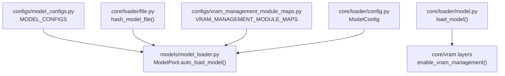
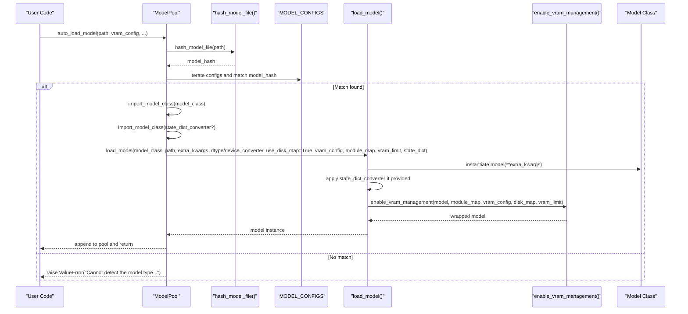
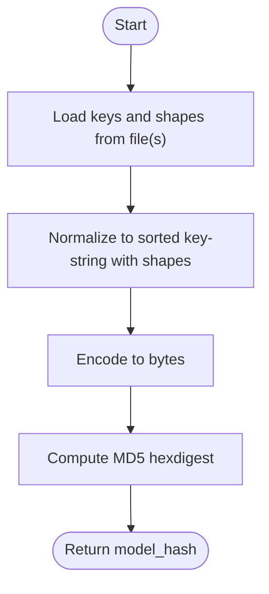
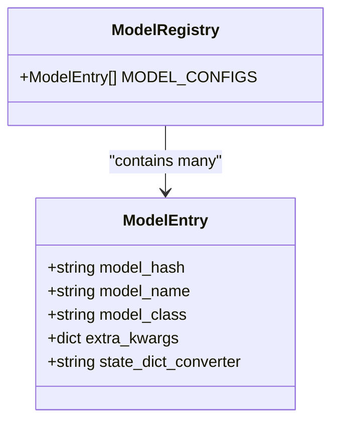
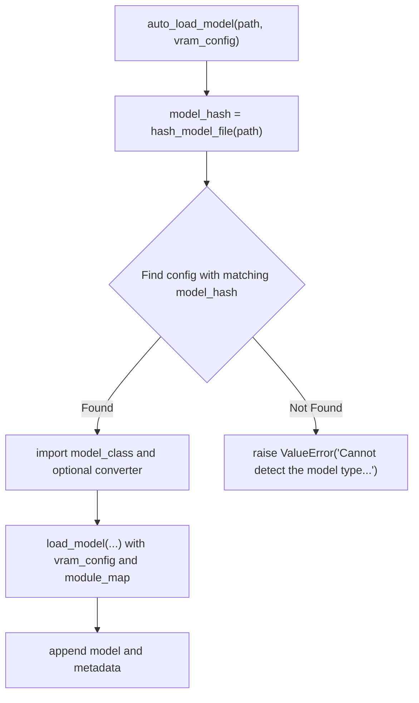
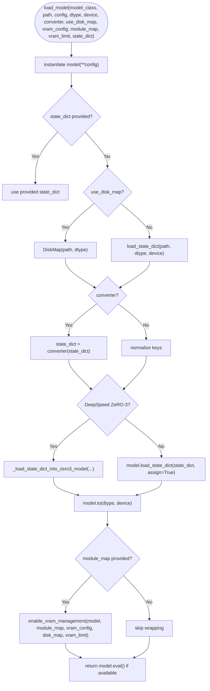
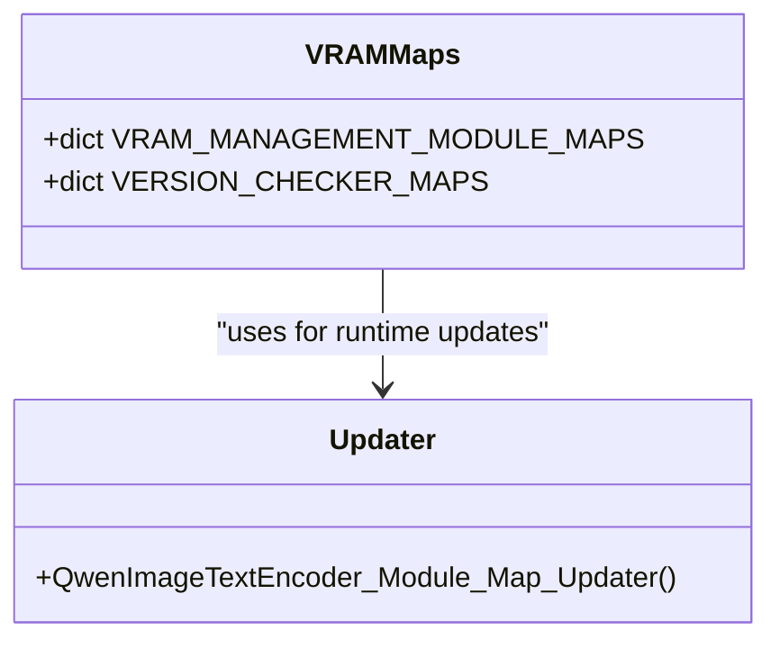
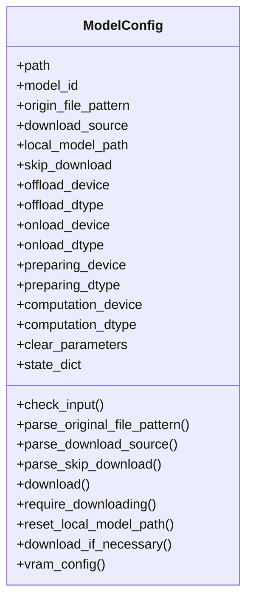
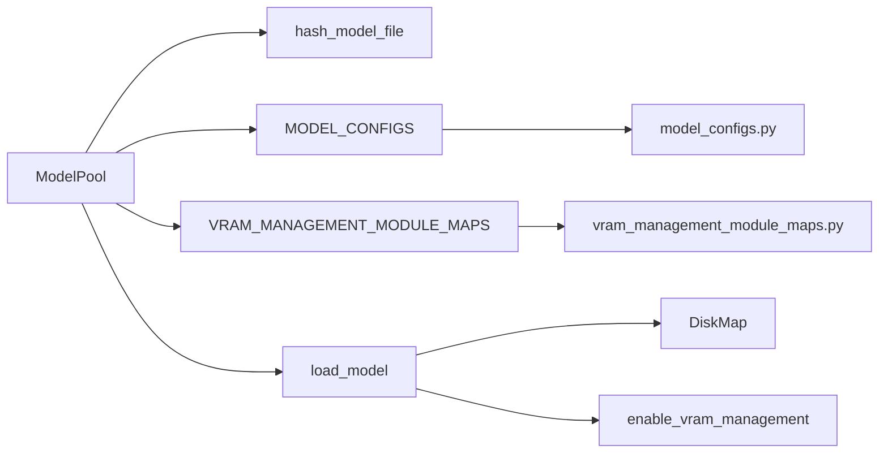

# Model Registration and Registry

<cite>
**Referenced Files in This Document**
- [model_loader.py](file://diffsynth/models/model_loader.py)
- [file.py](file://diffsynth/core/loader/file.py)
- [model.py](file://diffsynth/core/loader/model.py)
- [config.py](file://diffsynth/core/loader/config.py)
- [model_configs.py](file://diffsynth/configs/model_configs.py)
- [__init__.py](file://diffsynth/configs/__init__.py)
- [vram_management_module_maps.py](file://diffsynth/configs/vram_management_module_maps.py)
</cite>

## Table of Contents
1. [Introduction](#introduction)
2. [Project Structure](#project-structure)
3. [Core Components](#core-components)
4. [Architecture Overview](#architecture-overview)
5. [Detailed Component Analysis](#detailed-component-analysis)
6. [Dependency Analysis](#dependency-analysis)
7. [Performance Considerations](#performance-considerations)
8. [Troubleshooting Guide](#troubleshooting-guide)
9. [Conclusion](#conclusion)
10. [Appendices](#appendices)

## Introduction
This document explains the model registration and registry system used to automatically discover and load models by their content hash. It details how model files are hashed, how hashes map to configuration entries, and how those configurations resolve to concrete Python classes. It also covers the model configuration format, how different model families (FLUX, WanVideo, Qwen-Image, etc.) are registered, how to extend the registry with custom models, and how version compatibility and validation are handled.

## Project Structure
The registry is implemented across a small set of focused modules:
- Configuration registry: lists all supported model variants with their hashes and class mappings.
- Hashing utilities: compute stable hashes from model file keys and shapes.
- Loader orchestration: matches a file’s hash to a config entry, imports the target class, and loads weights.
- VRAM management maps: optional module-level wrappers for memory-efficient execution.
- ModelConfig dataclass: declarative specification for downloading, locating, and loading models.

**Diagram sources**
- [model_configs.py](file://diffsynth/configs/model_configs.py)
- [model_loader.py](file://diffsynth/models/model_loader.py)
- [file.py](file://diffsynth/core/loader/file.py)
- [model.py](file://diffsynth/core/loader/model.py)
- [vram_management_module_maps.py](file://diffsynth/configs/vram_management_module_maps.py)
- [config.py](file://diffsynth/core/loader/config.py)

**Section sources**
- [model_loader.py:1-114](file://diffsynth/models/model_loader.py#L1-L114)
- [file.py:1-131](file://diffsynth/core/loader/file.py#L1-L131)
- [model.py:1-106](file://diffsynth/core/loader/model.py#L1-L106)
- [config.py:1-120](file://diffsynth/core/loader/config.py#L1-L120)
- [model_configs.py:1-920](file://diffsynth/configs/model_configs.py#L1-L920)
- [__init__.py:1-3](file://diffsynth/configs/__init__.py#L1-L3)
- [vram_management_module_maps.py:1-312](file://diffsynth/configs/vram_management_module_maps.py#L1-L312)

## Core Components
- Model registry (MODEL_CONFIGS): a flat list of dictionaries describing each supported model variant. Each entry includes:
  - model_hash: MD5 hash derived from the file’s keys and shapes
  - model_name: human-readable identifier used for fetching
  - model_class: fully qualified Python class path
  - extra_kwargs: optional constructor arguments passed to the model class
  - state_dict_converter: optional converter class path to adapt checkpoint formats
- Hash-based identification:
  - hash_model_file computes a stable hash from the ordered keys and tensor shapes in the checkpoint
  - The loader compares this hash against MODEL_CONFIGS to select the correct implementation
- Loader orchestration:
  - ModelPool.auto_load_model discovers the matching config by hash
  - ModelPool.load_model_file dynamically imports the model class and optional converter
  - core.loader.model.load_model instantiates the model, applies converters, and optionally enables VRAM-aware wrapping
- VRAM management maps:
  - VRAM_MANAGEMENT_MODULE_MAPS maps specific model submodules to wrapper classes for efficient memory usage
  - VERSION_CHECKER_MAPS provides dynamic updates based on library versions

**Section sources**
- [model_loader.py:1-114](file://diffsynth/models/model_loader.py#L1-L114)
- [file.py:1-131](file://diffsynth/core/loader/file.py#L1-L131)
- [model.py:1-106](file://diffsynth/core/loader/model.py#L1-L106)
- [vram_management_module_maps.py:1-312](file://diffsynth/configs/vram_management_module_maps.py#L1-L312)
- [model_configs.py:1-920](file://diffsynth/configs/model_configs.py#L1-L920)

## Architecture Overview
The end-to-end flow from a model file to an instantiated model:

**Diagram sources**
- [model_loader.py:64-82](file://diffsynth/models/model_loader.py#L64-L82)
- [file.py:126-131](file://diffsynth/core/loader/file.py#L126-L131)
- [model.py:11-65](file://diffsynth/core/loader/model.py#L11-L65)
- [vram_management_module_maps.py:12-298](file://diffsynth/configs/vram_management_module_maps.py#L12-L298)

## Detailed Component Analysis

### Hash-Based Model Identification
- Key extraction and hashing:
  - Keys and shapes are extracted from safetensors or bin checkpoints
  - Keys are normalized into a deterministic string and hashed with MD5
- Stability guarantees:
  - Sorting of keys ensures order-independence
  - Including shapes ensures structural changes produce different hashes

**Diagram sources**
- [file.py:74-107](file://diffsynth/core/loader/file.py#L74-L107)
- [file.py:110-131](file://diffsynth/core/loader/file.py#L110-L131)

**Section sources**
- [file.py:1-131](file://diffsynth/core/loader/file.py#L1-L131)

### Model Registry Format and Entries
Each registry entry is a dictionary with these fields:
- model_hash: MD5 string matching the file’s hash
- model_name: label used for retrieval via fetch_model
- model_class: dotted path to the Python class implementing the model
- extra_kwargs: optional dict of keyword arguments passed to the model constructor
- state_dict_converter: optional dotted path to a converter class that transforms checkpoint keys/values

Examples of registered families include qwen_image_series, wan_series, flux_series, flux2_series, ernie_image_series, z_image_series, ltx2_series, and others. These series are concatenated into MODEL_CONFIGS at module load time.

**Diagram sources**
- [model_configs.py:1-920](file://diffsynth/configs/model_configs.py#L1-L920)
- [__init__.py:1-3](file://diffsynth/configs/__init__.py#L1-L3)

**Section sources**
- [model_configs.py:1-920](file://diffsynth/configs/model_configs.py#L1-L920)
- [__init__.py:1-3](file://diffsynth/configs/__init__.py#L1-L3)

### Auto-Loading Orchestration
- ModelPool.auto_load_model:
  - Computes model_hash from the input path(s)
  - Iterates MODEL_CONFIGS to find a matching entry
  - On match, calls load_model_file which imports the model class and optional converter
  - Invokes core.loader.model.load_model with appropriate dtype/device and VRAM settings
  - Appends the loaded model to internal lists and records metadata
- Error handling:
  - If no match is found, raises a ValueError including the file path and computed hash

**Diagram sources**
- [model_loader.py:64-82](file://diffsynth/models/model_loader.py#L64-L82)

**Section sources**
- [model_loader.py:1-114](file://diffsynth/models/model_loader.py#L1-L114)

### Model Instantiation and Weight Loading
- load_model:
  - Instantiates the model class under an initialization context (skips random init unless DeepSpeed ZeRO-3 requires otherwise)
  - Loads state dict either directly or via DiskMap for lazy/disk-backed access
  - Applies state_dict_converter when present
  - Handles DeepSpeed ZeRO-3 partitioned loading
  - Moves model to target dtype/device and sets eval mode if applicable
  - Optionally wraps model with enable_vram_management using module_map and vram_config

**Diagram sources**
- [model.py:11-65](file://diffsynth/core/loader/model.py#L11-L65)

**Section sources**
- [model.py:1-106](file://diffsynth/core/loader/model.py#L1-L106)

### VRAM Management Module Maps
- VRAM_MANAGEMENT_MODULE_MAPS maps specific model submodules to wrapper classes (e.g., AutoWrappedLinear, AutoWrappedModule) to enable memory-aware loading and computation.
- Some entries are updated dynamically via VERSION_CHECKER_MAPS to handle upstream library changes (e.g., renamed classes in transformers).

**Diagram sources**
- [vram_management_module_maps.py:12-298](file://diffsynth/configs/vram_management_module_maps.py#L12-L298)
- [vram_management_module_maps.py:300-312](file://diffsynth/configs/vram_management_module_maps.py#L300-L312)

**Section sources**
- [vram_management_module_maps.py:1-312](file://diffsynth/configs/vram_management_module_maps.py#L1-L312)

### ModelConfig Dataclass
ModelConfig encapsulates:
- Path resolution: local path or remote model_id with origin_file_pattern
- Download source selection: environment variable or default to modelscope/huggingface
- VRAM configuration: offload/onload/preparing/computation devices and dtypes
- Convenience methods: download_if_necessary, vram_config

**Diagram sources**
- [config.py:10-120](file://diffsynth/core/loader/config.py#L10-L120)

**Section sources**
- [config.py:1-120](file://diffsynth/core/loader/config.py#L1-L120)

## Dependency Analysis
- ModelPool depends on:
  - hash_model_file for identification
  - MODEL_CONFIGS for mapping
  - VRAM_MANAGEMENT_MODULE_MAPS and VERSION_CHECKER_MAPS for memory optimization
  - load_model for instantiation and weight loading
- load_model depends on:
  - DiskMap for lazy/disk-backed state dicts
  - enable_vram_management for memory-aware wrapping
  - Optional DeepSpeed ZeRO-3 integration
- Configs are aggregated in __init__.py and consumed by the loader

**Diagram sources**
- [model_loader.py:1-114](file://diffsynth/models/model_loader.py#L1-L114)
- [file.py:126-131](file://diffsynth/core/loader/file.py#L126-L131)
- [model.py:11-65](file://diffsynth/core/loader/model.py#L11-L65)
- [model_configs.py:1-920](file://diffsynth/configs/model_configs.py#L1-L920)
- [vram_management_module_maps.py:1-312](file://diffsynth/configs/vram_management_module_maps.py#L1-L312)

**Section sources**
- [model_loader.py:1-114](file://diffsynth/models/model_loader.py#L1-L114)
- [model.py:1-106](file://diffsynth/core/loader/model.py#L1-L106)
- [model_configs.py:1-920](file://diffsynth/configs/model_configs.py#L1-L920)
- [vram_management_module_maps.py:1-312](file://diffsynth/configs/vram_management_module_maps.py#L1-L312)

## Performance Considerations
- Use DiskMap for large checkpoints to avoid loading entire files into memory; only needed parameters are materialized.
- Enable VRAM management via module maps to wrap heavy submodules and control device placement and dtype transitions.
- Prefer bfloat16 for computation where supported to reduce memory footprint.
- When using DeepSpeed ZeRO-3, rely on specialized loaders to avoid excessive GPU memory spikes.

[No sources needed since this section provides general guidance]

## Troubleshooting Guide
- Cannot detect the model type:
  - Occurs when no MODEL_CONFIGS entry matches the computed hash
  - Check that the file contains expected keys/shapes and that the corresponding entry exists in MODEL_CONFIGS
- State dict conversion issues:
  - Ensure the state_dict_converter path is correct and returns a compatible dict
- VRAM errors:
  - Verify VRAM_MANAGEMENT_MODULE_MAPS includes necessary submodule mappings
  - Adjust vram_config devices/dtypes appropriately
- Download failures:
  - Confirm download_source and origin_file_pattern are valid
  - Check network and repository permissions

**Section sources**
- [model_loader.py:64-82](file://diffsynth/models/model_loader.py#L64-L82)
- [config.py:61-83](file://diffsynth/core/loader/config.py#L61-L83)
- [vram_management_module_maps.py:300-312](file://diffsynth/configs/vram_management_module_maps.py#L300-L312)

## Conclusion
The registry system uses a robust hash-based mechanism to identify model files and map them to concrete implementations through a centralized configuration. By combining stable hashing, flexible configuration entries, and optional state dict converters, it supports a wide variety of model families while enabling memory-efficient execution through VRAM-aware wrappers. Extending the system involves adding new entries to MODEL_CONFIGS and, when needed, updating VRAM module maps and converters.

[No sources needed since this section summarizes without analyzing specific files]

## Appendices

### How to Register a Custom Model
- Add a new entry to the appropriate series in model_configs.py with:
  - model_hash: compute via hash_model_file for your checkpoint
  - model_name: descriptive label
  - model_class: fully qualified Python class path
  - extra_kwargs: constructor arguments required by your model
  - state_dict_converter: optional converter class path if checkpoint keys differ
- Ensure the model class is importable and compatible with load_model expectations
- If VRAM optimization is desired, add submodule mappings in VRAM_MANAGEMENT_MODULE_MAPS

**Section sources**
- [model_configs.py:1-920](file://diffsynth/configs/model_configs.py#L1-L920)
- [vram_management_module_maps.py:1-312](file://diffsynth/configs/vram_management_module_maps.py#L1-L312)
- [model_loader.py:33-49](file://diffsynth/models/model_loader.py#L33-L49)

### Relationship Between Hashes, Configurations, and Classes
- hash_model_file produces a stable identifier from checkpoint structure
- MODEL_CONFIGS entries associate that identifier with a model_name and model_class
- ModelPool.auto_load_model matches the hash to a config entry and instantiates the class via load_model

**Section sources**
- [file.py:126-131](file://diffsynth/core/loader/file.py#L126-L131)
- [model_loader.py:64-82](file://diffsynth/models/model_loader.py#L64-L82)
- [model.py:11-65](file://diffsynth/core/loader/model.py#L11-L65)

### Version Compatibility Handling
- VERSION_CHECKER_MAPS provides functions to update VRAM module maps based on installed library versions
- Example: QwenImageTextEncoder mapping is adjusted when transformers versions change class names

**Section sources**
- [vram_management_module_maps.py:300-312](file://diffsynth/configs/vram_management_module_maps.py#L300-L312)