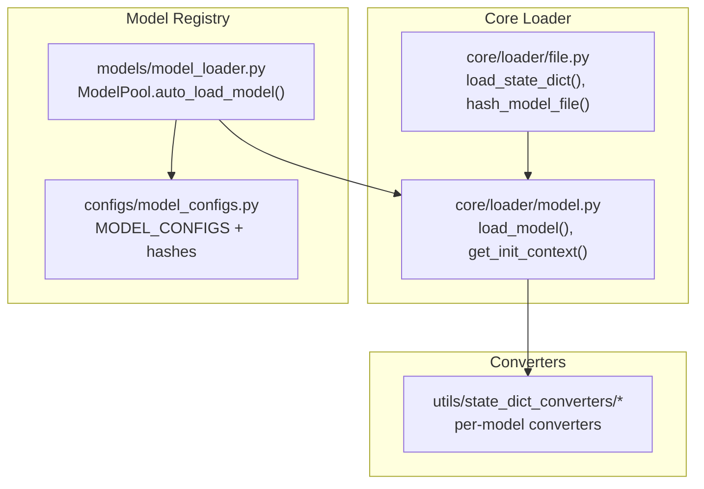
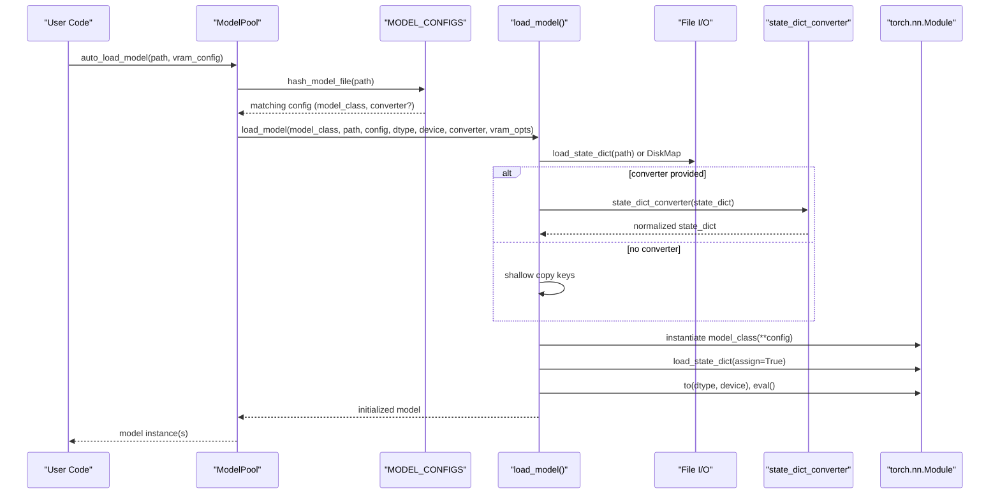
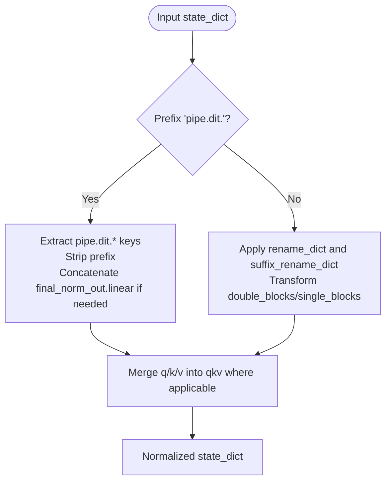
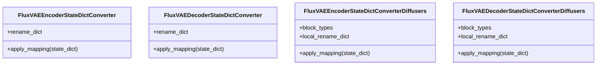
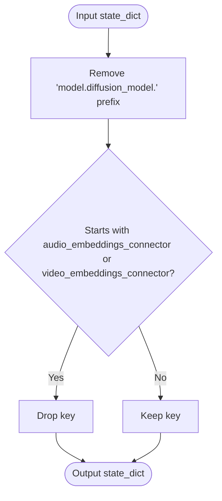
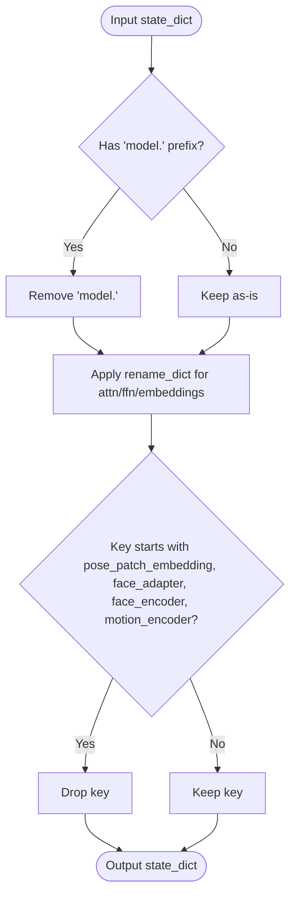
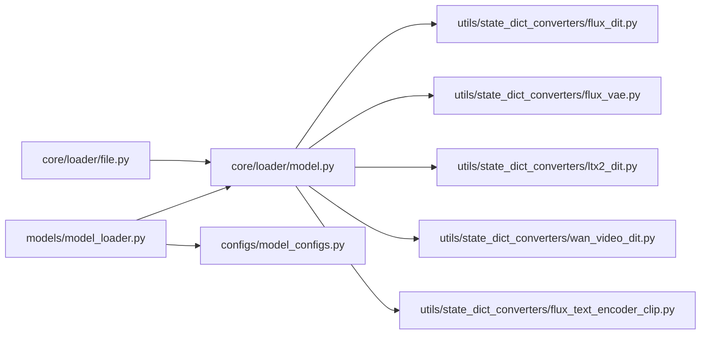

# State Dictionary Handling

<cite>
**Referenced Files in This Document**
- [model.py](file://diffsynth/core/loader/model.py)
- [file.py](file://diffsynth/core/loader/file.py)
- [__init__.py](file://diffsynth/core/loader/__init__.py)
- [model_loader.py](file://diffsynth/models/model_loader.py)
- [model_configs.py](file://diffsynth/configs/model_configs.py)
- [flux_dit.py](file://diffsynth/utils/state_dict_converters/flux_dit.py)
- [flux_vae.py](file://diffsynth/utils/state_dict_converters/flux_vae.py)
- [ltx2_dit.py](file://diffsynth/utils/state_dict_converters/ltx2_dit.py)
- [wan_video_dit.py](file://diffsynth/utils/state_dict_converters/wan_video_dit.py)
- [flux_text_encoder_clip.py](file://diffsynth/utils/state_dict_converters/flux_text_encoder_clip.py)
</cite>

## Table of Contents
1. Introduction
2. Project Structure
3. Core Components
4. Architecture Overview
5. Detailed Component Analysis
6. Dependency Analysis
7. Performance Considerations
8. Troubleshooting Guide
9. Conclusion

## Introduction
This document explains how model weights are loaded from various formats and converted into the framework’s expected state dictionary format. It covers automatic model format detection, conversion strategies per architecture, partial loading and filtering, compatibility handling across versions, and the relationship between state dictionaries and model initialization. The system supports both safetensors and binary checkpoints, integrates with VRAM management and disk offloading, and provides a flexible converter registry to handle diverse model families (FLUX, LTX-2, Wan Video, etc.).

## Project Structure
The state dictionary handling spans three layers:
- File I/O and hashing utilities for reading and fingerprinting checkpoints
- Model loader that orchestrates instantiation, conversion, and device placement
- Converter modules that map external weight naming conventions to internal module keys

**Diagram sources**
- [file.py:1-131](file://diffsynth/core/loader/file.py#L1-L131)
- [model.py:1-106](file://diffsynth/core/loader/model.py#L1-L106)
- [model_loader.py:1-114](file://diffsynth/models/model_loader.py#L1-L114)
- [model_configs.py:1-800](file://diffsynth/configs/model_configs.py#L1-L800)

**Section sources**
- [file.py:1-131](file://diffsynth/core/loader/file.py#L1-L131)
- [model.py:1-106](file://diffsynth/core/loader/model.py#L1-L106)
- [model_loader.py:1-114](file://diffsynth/models/model_loader.py#L1-L114)
- [model_configs.py:1-800](file://diffsynth/configs/model_configs.py#L1-L800)

## Core Components
- File-level utilities
  - load_state_dict: reads .safetensors or .bin files, normalizes nested containers, and optionally pins memory for faster GPU transfers
  - hash_model_file: computes a stable MD5 over key names and shapes to identify model variants
- Model loader
  - load_model: instantiates a model class under an appropriate initialization context, applies optional state_dict_converter, loads weights, moves to target dtype/device, and sets eval mode
  - get_init_context: selects DeepSpeed ZeRO-3 compatible initialization when enabled; otherwise skips random initialization to speed up loading
- Model pool and auto-detection
  - ModelPool.auto_load_model: hashes input paths, matches against MODEL_CONFIGS, imports the correct model class and optional state_dict_converter, then delegates to load_model
- Converters
  - Per-model functions that rename keys, concatenate projections, drop unused branches, and reshape tensors to match the target architecture

**Section sources**
- [file.py:1-131](file://diffsynth/core/loader/file.py#L1-L131)
- [model.py:1-106](file://diffsynth/core/loader/model.py#L1-L106)
- [model_loader.py:1-114](file://diffsynth/models/model_loader.py#L1-L114)
- [model_configs.py:1-800](file://diffsynth/configs/model_configs.py#L1-L800)

## Architecture Overview
The end-to-end flow from checkpoint file to initialized model:

**Diagram sources**
- [model_loader.py:1-114](file://diffsynth/models/model_loader.py#L1-L114)
- [model.py:1-106](file://diffsynth/core/loader/model.py#L1-L106)
- [file.py:1-131](file://diffsynth/core/loader/file.py#L1-L131)
- [model_configs.py:1-800](file://diffsynth/configs/model_configs.py#L1-L800)

## Detailed Component Analysis

### File I/O and Hashing
- load_state_dict
  - Supports list of files and single file
  - Dispatches to safetensors reader or torch.load for .bin
  - Normalizes common container wrappers (state_dict, module, model_state)
  - Optional pin_memory for faster CUDA transfers
- hash_model_file
  - Reads only keys and shapes without loading full tensors
  - Produces a deterministic MD5 used by ModelPool to select configs

Key behaviors:
- Safe handling of nested containers
- Efficient key-only inspection for hashing
- Dtype casting during load when requested

**Section sources**
- [file.py:1-131](file://diffsynth/core/loader/file.py#L1-L131)

### Model Loading and Initialization Context
- load_model
  - Instantiates model under skip_model_initialization or DeepSpeed ZeRO-3 init context
  - Chooses between DiskMap (lazy/partial) and eager load based on VRAM settings
  - Applies state_dict_converter if present; otherwise performs a safe key pass-through
  - Loads via model.load_state_dict(assign=True)
  - Moves model to target dtype/device and calls eval()
- get_init_context
  - Uses deepspeed.zero.Init and set_zero3_state when ZeRO-3 is active
  - Otherwise uses skip_model_initialization to avoid unnecessary parameter allocation

VRAM-aware loading:
- When offload_device != "disk", creates a DiskMap-backed state dict and enables VRAM management with a module_map
- When offload_device == "disk", wraps the model with enable_vram_management using a DiskMap for lazy loading

**Section sources**
- [model.py:1-106](file://diffsynth/core/loader/model.py#L1-L106)

### Automatic Model Detection and Configuration
- ModelPool.auto_load_model
  - Computes hash_model_file(path)
  - Iterates MODEL_CONFIGS to find a matching entry
  - Imports model_class and optional state_dict_converter dynamically
  - Calls load_model with computed vram_config and module_map
- MODEL_CONFIGS
  - Each entry defines model_hash, model_name, model_class, optional extra_kwargs, and optional state_dict_converter
  - Enables multiple variants of the same architecture (e.g., FLUX DiT from different origins)

Benefits:
- Zero-code wiring for new models: add a config entry and converter
- Stable identification via content hash avoids fragile filename checks

**Section sources**
- [model_loader.py:1-114](file://diffsynth/models/model_loader.py#L1-L114)
- [model_configs.py:1-800](file://diffsynth/configs/model_configs.py#L1-L800)

### State Dictionary Converters: Patterns and Examples
Converters implement consistent patterns:
- Key renaming via explicit maps
- Structural changes (concatenating projections, merging Q/K/V)
- Filtering out unused branches or prefixes
- Reshaping tensors where necessary

#### FLUX DiT Converter
- Handles two sources: native DiffSynth-style and Diffusers-style
- Renames time/guidance/text embedders and attention blocks
- Concatenates final_norm_out linear weights when needed
- Merges separate q/k/v projections into unified qkv matrices

**Diagram sources**
- [flux_dit.py:1-197](file://diffsynth/utils/state_dict_converters/flux_dit.py#L1-L197)

**Section sources**
- [flux_dit.py:1-197](file://diffsynth/utils/state_dict_converters/flux_dit.py#L1-L197)

#### FLUX VAE Converters
- Encoder and decoder converters map block-by-block parameters
- Separate implementations for native and Diffusers origins
- Maintain precise mapping for convolutions, norms, and transformer blocks

**Diagram sources**
- [flux_vae.py:1-382](file://diffsynth/utils/state_dict_converters/flux_vae.py#L1-L382)

**Section sources**
- [flux_vae.py:1-382](file://diffsynth/utils/state_dict_converters/flux_vae.py#L1-L382)

#### LTX-2 DiT Converter
- Strips common prefix and filters out audio/video embedding connectors not required by the core DiT

**Diagram sources**
- [ltx2_dit.py:1-10](file://diffsynth/utils/state_dict_converters/ltx2_dit.py#L1-L10)

**Section sources**
- [ltx2_dit.py:1-10](file://diffsynth/utils/state_dict_converters/ltx2_dit.py#L1-L10)

#### Wan Video DiT Converters
- From-Diffusers variant remaps attention and FFN layers, including image cross-attention projections
- Native variant strips prefixes and excludes auxiliary encoders (pose, face, motion)

**Diagram sources**
- [wan_video_dit.py:1-84](file://diffsynth/utils/state_dict_converters/wan_video_dit.py#L1-L84)

**Section sources**
- [wan_video_dit.py:1-84](file://diffsynth/utils/state_dict_converters/wan_video_dit.py#L1-L84)

#### Text Encoder Converters (CLIP example)
- Maps token embeddings, position embeddings, and layer-wise attention components
- Reshapes position embeddings to expected shape

**Section sources**
- [flux_text_encoder_clip.py:1-32](file://diffsynth/utils/state_dict_converters/flux_text_encoder_clip.py#L1-L32)

### Partial Loading, Weight Filtering, and Compatibility
- Partial loading
  - DiskMap enables lazy, selective loading of parameters from large files containing multiple models
  - VRAM management can keep most parameters on disk and load only what is needed at runtime
- Weight filtering
  - Converters drop irrelevant branches (e.g., audio/video connectors, auxiliary encoders)
  - Prefix stripping and key exclusion reduce mismatched keys
- Compatibility handling
  - Multiple converters per model family support different origins (native vs Diffusers)
  - Config entries specify exact converter per model hash to ensure version correctness

**Section sources**
- [model.py:1-106](file://diffsynth/core/loader/model.py#L1-L106)
- [flux_dit.py:1-197](file://diffsynth/utils/state_dict_converters/flux_dit.py#L1-L197)
- [ltx2_dit.py:1-10](file://diffsynth/utils/state_dict_converters/ltx2_dit.py#L1-L10)
- [wan_video_dit.py:1-84](file://diffsynth/utils/state_dict_converters/wan_video_dit.py#L1-L84)
- [model_configs.py:1-800](file://diffsynth/configs/model_configs.py#L1-L800)

### Relationship Between State Dictionaries and Model Initialization
- Initialization context
  - Skips random initialization unless DeepSpeed ZeRO-3 requires it
- Assignment strategy
  - load_state_dict(assign=True) allows partial assignment when keys differ slightly
- Device and dtype
  - After loading, model is moved to computation_dtype and computation_device
- Eval mode
  - Models are set to eval() after loading for inference readiness

**Section sources**
- [model.py:1-106](file://diffsynth/core/loader/model.py#L1-L106)

## Dependency Analysis

**Diagram sources**
- [file.py:1-131](file://diffsynth/core/loader/file.py#L1-L131)
- [model.py:1-106](file://diffsynth/core/loader/model.py#L1-L106)
- [model_loader.py:1-114](file://diffsynth/models/model_loader.py#L1-L114)
- [model_configs.py:1-800](file://diffsynth/configs/model_configs.py#L1-L800)
- [flux_dit.py:1-197](file://diffsynth/utils/state_dict_converters/flux_dit.py#L1-L197)
- [flux_vae.py:1-382](file://diffsynth/utils/state_dict_converters/flux_vae.py#L1-L382)
- [ltx2_dit.py:1-10](file://diffsynth/utils/state_dict_converters/ltx2_dit.py#L1-L10)
- [wan_video_dit.py:1-84](file://diffsynth/utils/state_dict_converters/wan_video_dit.py#L1-L84)
- [flux_text_encoder_clip.py:1-32](file://diffsynth/utils/state_dict_converters/flux_text_encoder_clip.py#L1-L32)

**Section sources**
- [model_loader.py:1-114](file://diffsynth/models/model_loader.py#L1-L114)
- [model.py:1-106](file://diffsynth/core/loader/model.py#L1-L106)
- [file.py:1-131](file://diffsynth/core/loader/file.py#L1-L131)
- [model_configs.py:1-800](file://diffsynth/configs/model_configs.py#L1-L800)

## Performance Considerations
- Use DiskMap for large multi-model checkpoints to avoid loading all parameters into memory
- Prefer safetensors for faster, safer loading and streaming access
- Enable pin_memory when loading to CPU to accelerate subsequent GPU transfers
- Avoid unnecessary conversions by selecting the correct converter via MODEL_CONFIGS
- For DeepSpeed ZeRO-3, rely on built-in contexts to prevent excessive GPU memory usage

[No sources needed since this section provides general guidance]

## Troubleshooting Guide
Common issues and resolutions:
- Cannot detect model type
  - Ensure the checkpoint hash matches one of the entries in MODEL_CONFIGS
  - Verify file paths and that the file contains the expected keys/shapes
- Missing keys after loading
  - Confirm the correct state_dict_converter is specified for the model hash
  - Check for prefix stripping or branch filtering in the converter
- Shape mismatches
  - Some converters reshape tensors (e.g., position embeddings); ensure your model expects those shapes
- VRAM exhaustion
  - Use load_model_with_disk_offload or enable VRAM management via module_map
  - Reduce computation_dtype precision if acceptable

**Section sources**
- [model_loader.py:1-114](file://diffsynth/models/model_loader.py#L1-L114)
- [model.py:1-106](file://diffsynth/core/loader/model.py#L1-L106)
- [file.py:1-131](file://diffsynth/core/loader/file.py#L1-L131)

## Conclusion
The state dictionary handling system combines robust file I/O, content-based model detection, and modular converters to support a wide range of architectures and checkpoint formats. By leveraging DiskMap and VRAM management, it achieves efficient partial loading and low-memory operation. Adding support for new models typically involves defining a config entry and implementing a converter that maps external keys to the internal model structure.

[No sources needed since this section summarizes without analyzing specific files]