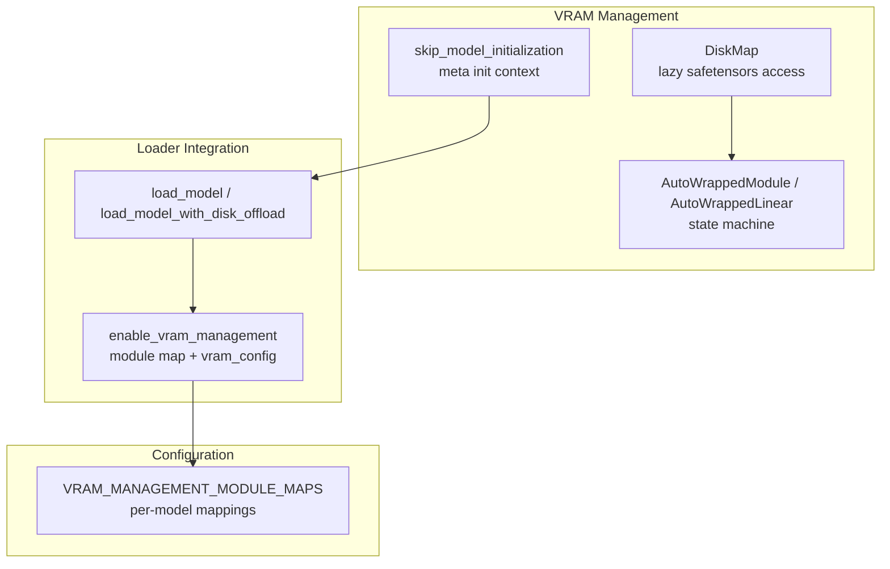
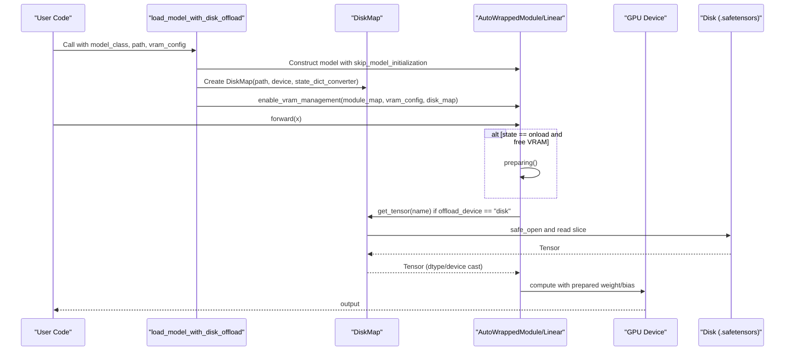
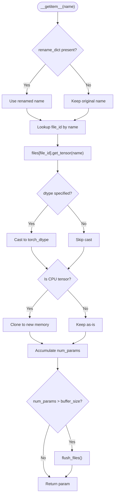
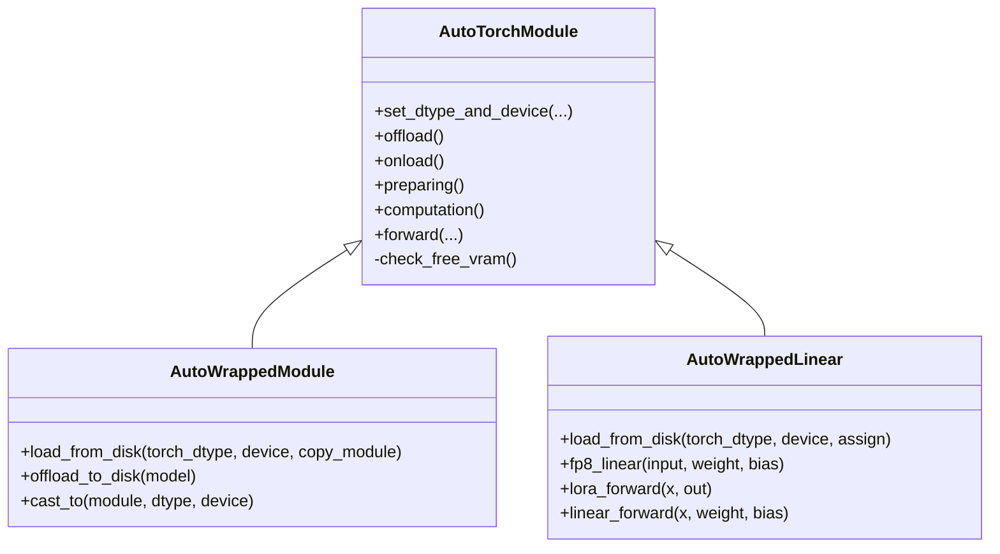
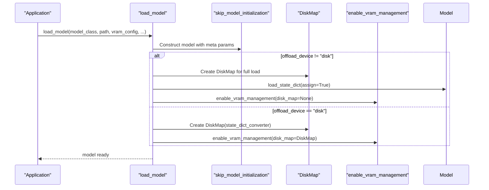
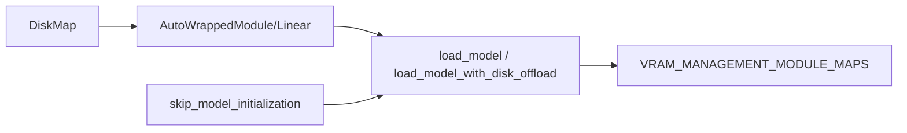

# Disk Offloading and Memory Mapping

<cite>
**Referenced Files in This Document**
- [disk_map.py](file://diffsynth/core/vram/disk_map.py)
- [layers.py](file://diffsynth/core/vram/layers.py)
- [initialization.py](file://diffsynth/core/vram/initialization.py)
- [model.py](file://diffsynth/core/loader/model.py)
- [vram_management_module_maps.py](file://diffsynth/configs/vram_management_module_maps.py)
- [VRAM_management.md](file://docs/en/Pipeline_Usage/VRAM_management.md)
- [Enabling_VRAM_management.md](file://docs/en/Developer_Guide/Enabling_VRAM_management.md)
- [Qwen-Image.py](file://examples/qwen_image/model_inference_low_vram/Qwen-Image.py)
</cite>

## Table of Contents
1. [Introduction](#introduction)
2. [Project Structure](#project-structure)
3. [Core Components](#core-components)
4. [Architecture Overview](#architecture-overview)
5. [Detailed Component Analysis](#detailed-component-analysis)
6. [Dependency Analysis](#dependency-analysis)
7. [Performance Considerations](#performance-considerations)
8. [Troubleshooting Guide](#troubleshooting-guide)
9. [Conclusion](#conclusion)
10. [Appendices](#appendices)

## Introduction
This document explains the disk offloading and memory mapping system used to run large models when VRAM is insufficient. It covers how model weights are split between GPU VRAM, CPU memory, and disk storage; how parameters are lazily loaded from disk using a safetensors-based mapping layer; and how wrapped modules manage state transitions (offload/onload/preparing/computation) to minimize memory usage while maintaining inference correctness. It also provides configuration examples for different model sizes and hardware constraints, performance guidance for I/O-bound scenarios, and troubleshooting tips for disk space and bottlenecks.

## Project Structure
The disk offloading and memory mapping functionality is implemented under the VRAM management subsystem and integrated into the model loader:
- Disk mapping and lazy loading: diffsynth/core/vram/disk_map.py
- Module wrappers and state machine: diffsynth/core/vram/layers.py
- Initialization helpers to skip parameter initialization: diffsynth/core/vram/initialization.py
- Model loader integration with disk offloading: diffsynth/core/loader/model.py
- Per-model module maps for fine-grained VRAM control: diffsynth/configs/vram_management_module_maps.py
- Usage documentation and examples: docs/en/Pipeline_Usage/VRAM_management.md, docs/en/Developer_Guide/Enabling_VRAM_management.md, examples/qwen_image/model_inference_low_vram/Qwen-Image.py

**Diagram sources**
- [disk_map.py:28-94](file://diffsynth/core/vram/disk_map.py#L28-L94)
- [layers.py:8-199](file://diffsynth/core/vram/layers.py#L8-L199)
- [initialization.py:5-22](file://diffsynth/core/vram/initialization.py#L5-L22)
- [model.py:11-88](file://diffsynth/core/loader/model.py#L11-L88)
- [vram_management_module_maps.py:12-298](file://diffsynth/configs/vram_management_module_maps.py#L12-L298)

**Section sources**
- [disk_map.py:28-94](file://diffsynth/core/vram/disk_map.py#L28-L94)
- [layers.py:8-199](file://diffsynth/core/vram/layers.py#L8-L199)
- [initialization.py:5-22](file://diffsynth/core/vram/initialization.py#L5-L22)
- [model.py:11-88](file://diffsynth/core/loader/model.py#L11-L88)
- [vram_management_module_maps.py:12-298](file://diffsynth/configs/vram_management_module_maps.py#L12-L298)

## Core Components
- DiskMap: Provides lazy, on-demand access to tensor parameters stored in one or more .safetensors files. It tracks accessed elements and periodically flushes file handles to avoid excessive open descriptors.
- AutoWrappedModule and AutoWrappedLinear: Wrap original layers to manage four states (offload, onload, preparing, computation), enabling dynamic movement between devices and dtypes, including disk-backed offload.
- skip_model_initialization: Context manager that registers meta-initialized parameters during model construction to avoid unnecessary memory allocation.
- Loader integration: load_model and load_model_with_disk_offload construct models, apply module maps, and enable VRAM management with optional disk offloading.

Key responsibilities:
- Lazy parameter retrieval from disk via safetensors without full model load
- Stateful device/dtype transitions per layer
- Optional FP8 preparation and BF16 computation
- Configurable VRAM limits to dynamically split model parts across VRAM/CPU/disk

**Section sources**
- [disk_map.py:28-94](file://diffsynth/core/vram/disk_map.py#L28-L94)
- [layers.py:8-199](file://diffsynth/core/vram/layers.py#L8-L199)
- [initialization.py:5-22](file://diffsynth/core/vram/initialization.py#L5-L22)
- [model.py:11-88](file://diffsynth/core/loader/model.py#L11-L88)

## Architecture Overview
The system composes three layers:
- Storage layer (DiskMap): Opens safetensors files and returns tensors on demand, optionally converting dtype and cloning CPU tensors.
- Control layer (wrapped modules): Each layer is wrapped to track its state and perform device/dtype casting or disk-backed loading as needed.
- Orchestration layer (loader + module maps): The loader constructs the model, applies module maps to wrap relevant layers, and sets up vram_config and vram_limit.

**Diagram sources**
- [model.py:68-88](file://diffsynth/core/loader/model.py#L68-L88)
- [disk_map.py:28-94](file://diffsynth/core/vram/disk_map.py#L28-L94)
- [layers.py:150-199](file://diffsynth/core/vram/layers.py#L150-L199)

## Detailed Component Analysis

### DiskMap: Lazy Safetensors Access
DiskMap opens one or multiple .safetensors files and exposes a dict-like interface over parameter names. It:
- Supports both safetensors and non-safetensors loaders (with warnings for slower loading).
- Tracks accessed element counts and flushes file handles when a buffer threshold is exceeded.
- Applies dtype conversion and ensures CPU tensors are cloned before returning.
- Optionally renames keys via a state_dict_converter.

**Diagram sources**
- [disk_map.py:59-71](file://diffsynth/core/vram/disk_map.py#L59-L71)
- [disk_map.py:30-38](file://diffsynth/core/vram/disk_map.py#L30-L38)

**Section sources**
- [disk_map.py:28-94](file://diffsynth/core/vram/disk_map.py#L28-L94)

### AutoWrappedModule and AutoWrappedLinear: State Machine and Disk Offload
These wrappers implement a four-state lifecycle:
- Offload: Parameters reside at offload_device/offload_dtype (can be "disk")
- Onload: Parameters moved to onload_device/onload_dtype
- Preparing: Temporary state for intermediate computations when VRAM allows
- Computation: Actual forward pass uses computation_device/computation_dtype

For disk offload:
- offload_device/onload_device set to "disk" triggers lazy loading from DiskMap
- preparing_device/computation_device typically point to GPU with desired dtypes (e.g., FP8 preparing, BF16 computation)
- AutoWrappedLinear supports FP8 linear paths and LoRA composition

**Diagram sources**
- [layers.py:8-199](file://diffsynth/core/vram/layers.py#L8-L199)
- [layers.py:271-437](file://diffsynth/core/vram/layers.py#L271-L437)

**Section sources**
- [layers.py:8-199](file://diffsynth/core/vram/layers.py#L8-L199)
- [layers.py:271-437](file://diffsynth/core/vram/layers.py#L271-L437)

### Loader Integration and Disk Offload Entry Points
Two primary entry points:
- load_model: General-purpose loader supporting both in-memory and disk-backed modes based on vram_config.offload_device
- load_model_with_disk_offload: Convenience function to enable disk offloading with sensible defaults (FP8 preparing, BF16 computation)

Key behaviors:
- When offload_device != "disk", parameters are fully loaded into memory first, then VRAM management wraps layers
- When offload_device == "disk", DiskMap is created and passed to enable_vram_management to enable lazy loading
- DeepSpeed ZeRO Stage 3 is handled specially to avoid excessive memory usage during load

**Diagram sources**
- [model.py:11-65](file://diffsynth/core/loader/model.py#L11-L65)
- [model.py:68-88](file://diffsynth/core/loader/model.py#L68-L88)

**Section sources**
- [model.py:11-88](file://diffsynth/core/loader/model.py#L11-L88)

### Module Maps and Fine-Grained Control
VRAM_MANAGEMENT_MODULE_MAPS defines which layers in each model should be wrapped and how. For example:
- Linear layers often use AutoWrappedLinear for optimized FP8 and LoRA support
- Other parameterized layers use AutoWrappedModule
- Some blocks use AutoWrappedNonRecurseModule for specialized handling

This enables per-model tuning of granularity and behavior.

**Section sources**
- [vram_management_module_maps.py:12-298](file://diffsynth/configs/vram_management_module_maps.py#L12-L298)

## Dependency Analysis
- DiskMap depends on safetensors and PyTorch for tensor operations
- Wrapped modules depend on DiskMap when offload_device is "disk"
- Loader integrates DiskMap and enable_vram_management based on vram_config
- Module maps provide explicit wiring between model classes and wrapper types

**Diagram sources**
- [disk_map.py:28-94](file://diffsynth/core/vram/disk_map.py#L28-L94)
- [layers.py:8-199](file://diffsynth/core/vram/layers.py#L8-L199)
- [model.py:11-88](file://diffsynth/core/loader/model.py#L11-L88)
- [vram_management_module_maps.py:12-298](file://diffsynth/configs/vram_management_module_maps.py#L12-L298)

**Section sources**
- [disk_map.py:28-94](file://diffsynth/core/vram/disk_map.py#L28-L94)
- [layers.py:8-199](file://diffsynth/core/vram/layers.py#L8-L199)
- [model.py:11-88](file://diffsynth/core/loader/model.py#L11-L88)
- [vram_management_module_maps.py:12-298](file://diffsynth/configs/vram_management_module_maps.py#L12-L298)

## Performance Considerations
- I/O throughput: Disk offloading is I/O bound; use high-speed SSDs to reduce latency
- Buffer size: DiskMap flushes file handles after a configurable number of accessed elements; tune DIFFSYNTH_DISK_MAP_BUFFER_SIZE to balance open handle count vs. repeated opens
- Dtype strategy: Using FP8 for storing/preparing and BF16 for computation reduces VRAM while keeping numerical stability
- VRAM limit: Setting vram_limit controls dynamic splitting; smaller values reduce peak VRAM but increase transfers
- Quantization caveats: FP8 quantization currently reduces VRAM but does not speed up computation on most GPUs; native FP8 compute is limited to specific architectures

[No sources needed since this section provides general guidance]

## Troubleshooting Guide
Common issues and resolutions:
- Insufficient disk space: Ensure adequate free space on the drive hosting .safetensors files; monitor usage during long runs
- Slow loading times: Verify SSD performance; consider increasing buffer size via environment variable to reduce frequent file handle flushes
- Non-safetensors formats: Disk offloading only supports .safetensors; convert binary formats (pth, bin, ckpt) to safetensors
- State dict converter limitations: Disk offloading does not support converters that reshape tensors; ensure compatible conversion logic
- Excessive VRAM spikes: Adjust vram_limit slightly below available VRAM; monitor with torch.cuda.mem_get_info
- DeepSpeed interactions: When using ZeRO Stage 3, rely on loader’s special handling to avoid memory spikes

**Section sources**
- [disk_map.py:30-38](file://diffsynth/core/vram/disk_map.py#L30-L38)
- [VRAM_management.md:139-173](file://docs/en/Pipeline_Usage/VRAM_management.md#L139-L173)
- [Enabling_VRAM_management.md:172-217](file://docs/en/Developer_Guide/Enabling_VRAM_management.md#L172-L217)

## Conclusion
The disk offloading and memory mapping system enables running very large models on constrained hardware by combining lazy safetensors access, layer-level state management, and flexible dtype/device configurations. With proper configuration and I/O optimization, it achieves feasible VRAM footprints while preserving inference correctness. Users can tailor behavior through module maps, vram_config, and vram_limit to match their hardware and workload characteristics.

[No sources needed since this section summarizes without analyzing specific files]

## Appendices

### Configuration Examples
- Basic disk offload with FP8 preparing and BF16 computation:
  - See example script demonstrating pipeline setup with vram_config and vram_limit
- Minimal disk offload without FP8:
  - Set preparing_dtype and computation_dtype to bfloat16

**Section sources**
- [Qwen-Image.py:5-14](file://examples/qwen_image/model_inference_low_vram/Qwen-Image.py#L5-L14)
- [VRAM_management.md:179-190](file://docs/en/Pipeline_Usage/VRAM_management.md#L179-L190)