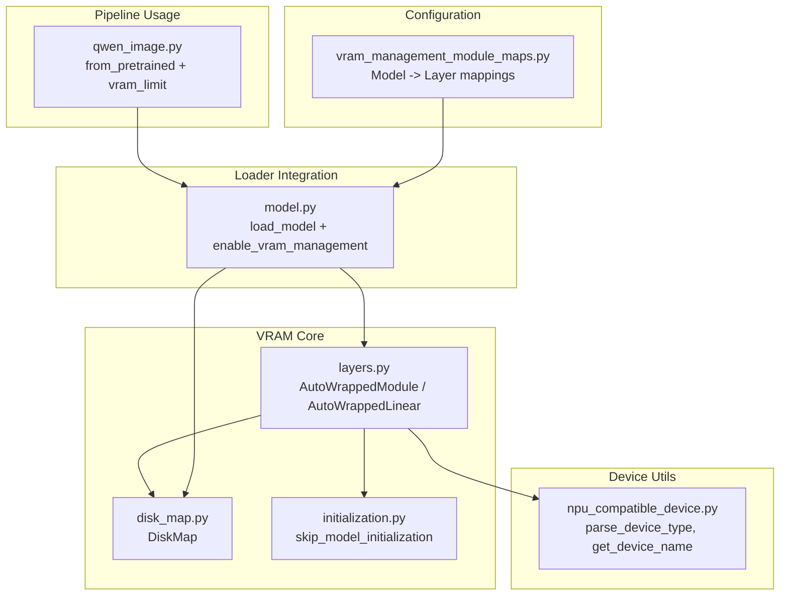
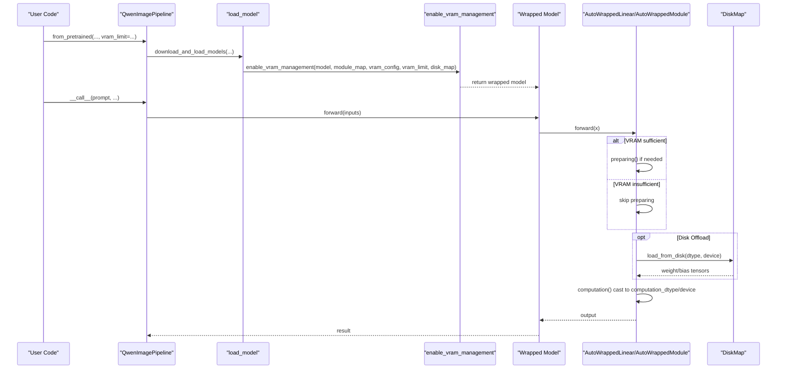
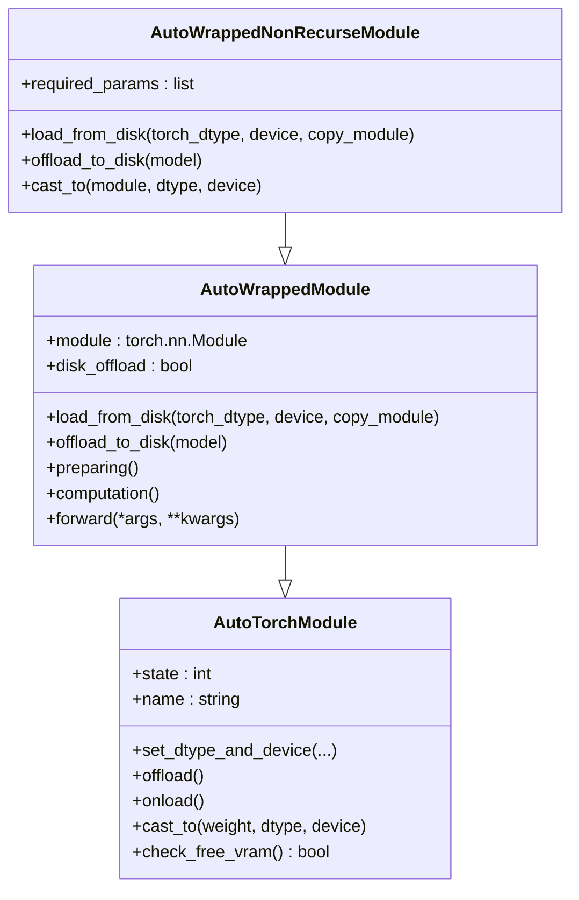
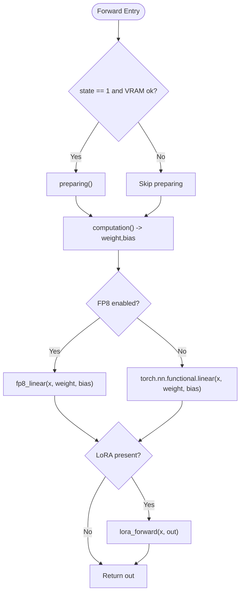
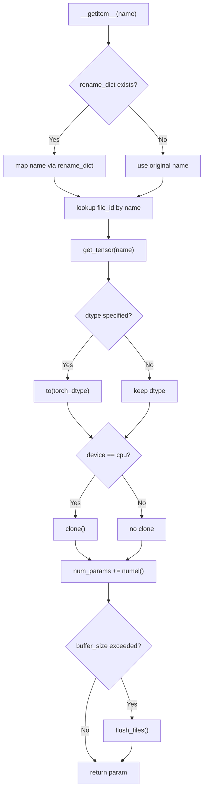
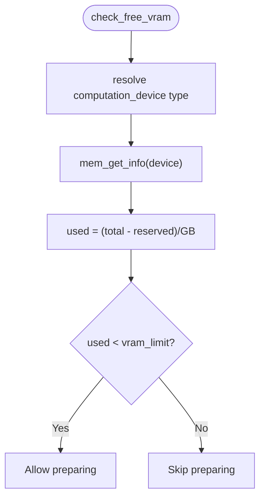
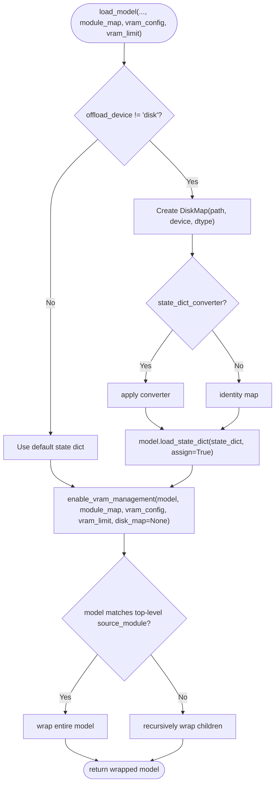
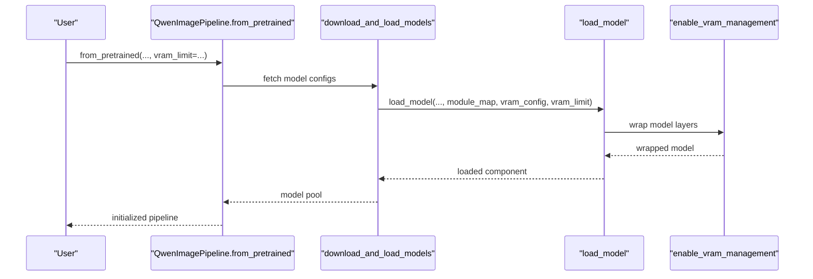
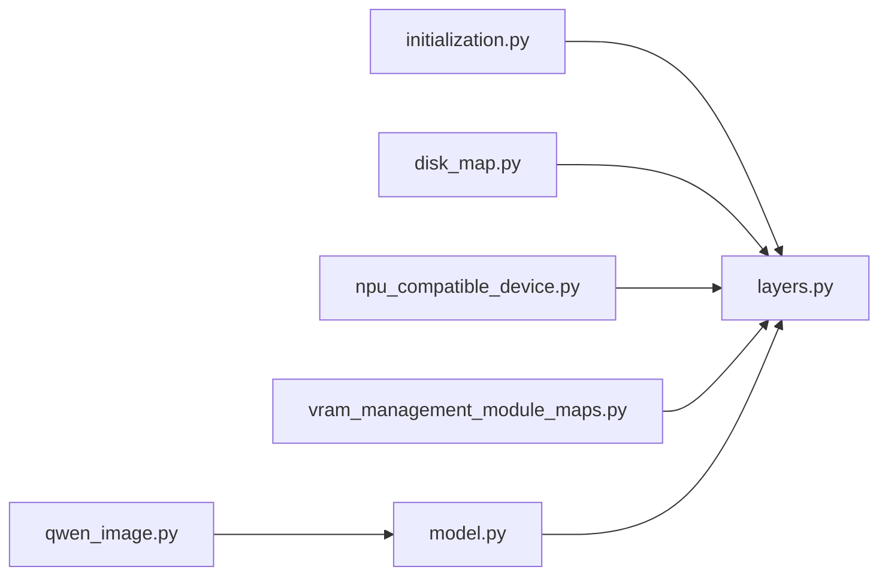

# Layer-level VRAM Optimization

<cite>
**Referenced Files in This Document**
- [layers.py](file://diffsynth/core/vram/layers.py)
- [disk_map.py](file://diffsynth/core/vram/disk_map.py)
- [initialization.py](file://diffsynth/core/vram/initialization.py)
- [vram_management_module_maps.py](file://diffsynth/configs/vram_management_module_maps.py)
- [npu_compatible_device.py](file://diffsynth/core/device/npu_compatible_device.py)
- [model.py](file://diffsynth/core/loader/model.py)
- [qwen_image.py](file://diffsynth/pipelines/qwen_image.py)
- [VRAM_management.md](file://docs/en/Pipeline_Usage/VRAM_management.md)
- [Enabling_VRAM_management.md](file://docs/en/Developer_Guide/Enabling_VRAM_management.md)
</cite>

## Table of Contents
1. [Introduction](#introduction)
2. [Project Structure](#project-structure)
3. [Core Components](#core-components)
4. [Architecture Overview](#architecture-overview)
5. [Detailed Component Analysis](#detailed-component-analysis)
6. [Dependency Analysis](#dependency-analysis)
7. [Performance Considerations](#performance-considerations)
8. [Troubleshooting Guide](#troubleshooting-guide)
9. [Conclusion](#conclusion)
10. [Appendices](#appendices)

## Introduction
This document explains layer-level VRAM optimization techniques implemented in the codebase. It focuses on how individual neural network layers are managed for optimal memory usage, including dynamic loading/unloading strategies, wrapper implementations that enable memory-efficient execution, automatic device placement logic between GPU/CPU (and NPU), and examples of custom layer integrations. It also covers performance implications of layer swapping and provides guidelines to optimize custom layers for memory-constrained environments.

## Project Structure
The VRAM management system is centered around a small set of core modules:
- Wrapper classes that intercept forward passes and manage dtype/device states per layer
- A disk-backed parameter loader for extreme memory constraints
- Device utilities for cross-platform device detection and memory queries
- Module maps that declaratively specify which layers to wrap for each model
- Loader integration that applies wrapping during model load

**Diagram sources**
- [layers.py:8-205](file://diffsynth/core/vram/layers.py#L8-L205)
- [disk_map.py:28-94](file://diffsynth/core/vram/disk_map.py#L28-L94)
- [initialization.py:5-22](file://diffsynth/core/vram/initialization.py#L5-L22)
- [npu_compatible_device.py:85-108](file://diffsynth/core/device/npu_compatible_device.py#L85-L108)
- [vram_management_module_maps.py:12-298](file://diffsynth/configs/vram_management_module_maps.py#L12-L298)
- [model.py:11-30](file://diffsynth/core/loader/model.py#L11-L30)
- [qwen_image.py:64-97](file://diffsynth/pipelines/qwen_image.py#L64-L97)

**Section sources**
- [layers.py:8-205](file://diffsynth/core/vram/layers.py#L8-L205)
- [disk_map.py:28-94](file://diffsynth/core/vram/disk_map.py#L28-L94)
- [initialization.py:5-22](file://diffsynth/core/vram/initialization.py#L5-L22)
- [vram_management_module_maps.py:12-298](file://diffsynth/configs/vram_management_module_maps.py#L12-L298)
- [model.py:11-30](file://diffsynth/core/loader/model.py#L11-L30)
- [qwen_image.py:64-97](file://diffsynth/pipelines/qwen_image.py#L64-L97)

## Core Components
- AutoTorchModule: Base class providing dtype/device state configuration and VRAM checks.
- AutoWrappedModule: Wraps arbitrary torch.nn.Module with offload/onload/preparing/computation states; supports disk offload via DiskMap.
- AutoWrappedNonRecurseModule: Variant that only manages top-level parameters (useful for modules with internal recursion).
- AutoWrappedLinear: Specialized wrapper for Linear layers with optional FP8 path and LoRA support.
- DiskMap: Lazy, streaming access to safetensors or compatible binary files with buffer-based flushing.
- Device utilities: parse_device_type, get_device_name, and availability flags for CUDA/NPU/CPU.
- Module maps: Declarative mapping from model classes to target wrapper types for automatic wrapping.
- Loader integration: Applies module maps and vram_config during model loading; sets up DiskMap when needed.

Key responsibilities:
- State machine per layer: Offload → Onload → Preparing → Computation
- Dynamic VRAM sensing to decide whether to enter preparing state
- Optional disk-backed lazy loading for extreme memory constraints
- Automatic device placement based on configured devices and runtime availability

**Section sources**
- [layers.py:8-205](file://diffsynth/core/vram/layers.py#L8-L205)
- [layers.py:207-269](file://diffsynth/core/vram/layers.py#L207-L269)
- [layers.py:271-437](file://diffsynth/core/vram/layers.py#L271-L437)
- [disk_map.py:28-94](file://diffsynth/core/vram/disk_map.py#L28-L94)
- [npu_compatible_device.py:85-108](file://diffsynth/core/device/npu_compatible_device.py#L85-L108)
- [vram_management_module_maps.py:12-298](file://diffsynth/configs/vram_management_module_maps.py#L12-L298)
- [model.py:11-30](file://diffsynth/core/loader/model.py#L11-L30)

## Architecture Overview
At runtime, the pipeline loads models through a loader that can apply VRAM management. Layers are wrapped according to module maps. During forward, wrappers decide whether to move parameters to computation device, optionally pass through a preparing state if VRAM allows, and execute the underlying layer. Disk offload bypasses RAM entirely by reading directly from disk into computation device as needed.

**Diagram sources**
- [qwen_image.py:64-97](file://diffsynth/pipelines/qwen_image.py#L64-L97)
- [model.py:11-30](file://diffsynth/core/loader/model.py#L11-L30)
- [layers.py:439-479](file://diffsynth/core/vram/layers.py#L439-L479)
- [layers.py:194-198](file://diffsynth/core/vram/layers.py#L194-L198)
- [layers.py:395-408](file://diffsynth/core/vram/layers.py#L395-L408)
- [disk_map.py:59-71](file://diffsynth/core/vram/disk_map.py#L59-L71)

## Detailed Component Analysis

### AutoWrappedModule and AutoWrappedNonRecurseModule
These wrappers implement a four-state lifecycle:
- Offload: Parameters reside in offload_device (CPU or disk)
- Onload: Parameters moved to onload_device (typically CPU or GPU)
- Preparing: Temporary higher-fidelity staging on preparing_device (often GPU) when VRAM permits
- Computation: Temporary casting to computation_dtype/device for forward pass

Key behaviors:
- Forward triggers preparing automatically when VRAM allows
- Disk offload path uses DiskMap to stream parameters directly to computation device
- Non-recursive variant restricts parameter scanning to top-level buffers/params

**Diagram sources**
- [layers.py:8-86](file://diffsynth/core/vram/layers.py#L8-L86)
- [layers.py:88-205](file://diffsynth/core/vram/layers.py#L88-L205)
- [layers.py:207-269](file://diffsynth/core/vram/layers.py#L207-L269)

**Section sources**
- [layers.py:88-205](file://diffsynth/core/vram/layers.py#L88-L205)
- [layers.py:207-269](file://diffsynth/core/vram/layers.py#L207-L269)

### AutoWrappedLinear
Specialized wrapper for linear layers with:
- Optional FP8 path using scaled matmul kernels
- LoRA augmentation support via accumulated weights and merger
- Efficient computation() returning weight/bias views or casts
- Seamless integration with disk offload for Linear parameters

**Diagram sources**
- [layers.py:271-437](file://diffsynth/core/vram/layers.py#L271-L437)

**Section sources**
- [layers.py:271-437](file://diffsynth/core/vram/layers.py#L271-L437)

### DiskMap
Provides efficient, streaming access to model parameters stored on disk:
- Supports safetensors natively and a compatibility loader for other formats
- Maintains an internal buffer threshold; flushes file handles after a configurable number of elements
- Optional rename mapping for state dict conversion
- Returns tensors already cast to requested dtype and cloned when necessary

**Diagram sources**
- [disk_map.py:28-94](file://diffsynth/core/vram/disk_map.py#L28-L94)

**Section sources**
- [disk_map.py:28-94](file://diffsynth/core/vram/disk_map.py#L28-L94)

### Device Placement Logic
Automatic device placement relies on:
- parse_device_type to normalize device strings/tensors
- get_device_name to resolve current device identifier
- check_free_vram to query available VRAM before entering preparing state
- Support for both CUDA and NPU backends

**Diagram sources**
- [layers.py:65-69](file://diffsynth/core/vram/layers.py#L65-L69)
- [npu_compatible_device.py:85-108](file://diffsynth/core/device/npu_compatible_device.py#L85-L108)

**Section sources**
- [layers.py:65-69](file://diffsynth/core/vram/layers.py#L65-L69)
- [npu_compatible_device.py:85-108](file://diffsynth/core/device/npu_compatible_device.py#L85-L108)

### Module Maps and Automatic Wrapping
Module maps define which layers to wrap per model class. The loader integrates these maps to automatically replace matching layers with AutoWrapped variants.

**Diagram sources**
- [model.py:11-30](file://diffsynth/core/loader/model.py#L11-L30)
- [layers.py:439-479](file://diffsynth/core/vram/layers.py#L439-L479)
- [vram_management_module_maps.py:12-298](file://diffsynth/configs/vram_management_module_maps.py#L12-L298)

**Section sources**
- [model.py:11-30](file://diffsynth/core/loader/model.py#L11-L30)
- [layers.py:439-479](file://diffsynth/core/vram/layers.py#L439-L479)
- [vram_management_module_maps.py:12-298](file://diffsynth/configs/vram_management_module_maps.py#L12-L298)

### Pipeline Integration Example
The Qwen-Image pipeline demonstrates how vram_limit is passed through from_pretrained and used to control dynamic VRAM behavior across components.

**Diagram sources**
- [qwen_image.py:64-97](file://diffsynth/pipelines/qwen_image.py#L64-L97)
- [model.py:11-30](file://diffsynth/core/loader/model.py#L11-L30)
- [layers.py:439-479](file://diffsynth/core/vram/layers.py#L439-L479)

**Section sources**
- [qwen_image.py:64-97](file://diffsynth/pipelines/qwen_image.py#L64-L97)
- [model.py:11-30](file://diffsynth/core/loader/model.py#L11-L30)

## Dependency Analysis
- layers.py depends on:
  - initialization.py for safe meta-initialization during wrapper construction
  - disk_map.py for disk-backed parameter streaming
  - device utilities for device parsing and memory queries
- model.py orchestrates DiskMap creation and calls enable_vram_management
- vram_management_module_maps.py supplies declarative mappings consumed by enable_vram_management
- qwen_image.py consumes the loader and passes vram_limit to control dynamic behavior

**Diagram sources**
- [layers.py:1-6](file://diffsynth/core/vram/layers.py#L1-L6)
- [model.py:1-5](file://diffsynth/core/loader/model.py#L1-L5)
- [vram_management_module_maps.py:12-298](file://diffsynth/configs/vram_management_module_maps.py#L12-L298)
- [qwen_image.py:1-22](file://diffsynth/pipelines/qwen_image.py#L1-L22)

**Section sources**
- [layers.py:1-6](file://diffsynth/core/vram/layers.py#L1-L6)
- [model.py:1-5](file://diffsynth/core/loader/model.py#L1-L5)
- [vram_management_module_maps.py:12-298](file://diffsynth/configs/vram_management_module_maps.py#L12-L298)
- [qwen_image.py:1-22](file://diffsynth/pipelines/qwen_image.py#L1-L22)

## Performance Considerations
- Layer swapping overhead: Each forward may trigger dtype/device casts and potential disk reads. Minimize frequent transitions by:
  - Using preparing state to keep frequently used layers resident on GPU temporarily
  - Setting vram_limit slightly below actual free VRAM to reduce unnecessary swaps
- Disk offload latency: Prefer high-speed SSDs; avoid random heavy IO bursts
- FP8 path: Only beneficial for supported hardware; otherwise standard linear ops are used
- Buffering strategy: DiskMap’s buffer_size controls memory vs. IO trade-off; tune via environment variable
- Avoid excessive recursion: Use AutoWrappedNonRecurseModule where appropriate to limit parameter scanning

[No sources needed since this section provides general guidance]

## Troubleshooting Guide
Common issues and resolutions:
- Unexpected VRAM spikes: Ensure vram_limit is set appropriately; verify check_free_vram thresholds
- Disk offload failures: Confirm safetensors format and absence of unsupported state dict converters
- Slow inference with many small layers: Batch operations or use preparing state to reduce repeated casts
- NPU/CUDA mismatch: Verify parse_device_type and get_device_name resolve correctly on your platform

**Section sources**
- [layers.py:65-69](file://diffsynth/core/vram/layers.py#L65-L69)
- [disk_map.py:28-94](file://diffsynth/core/vram/disk_map.py#L28-L94)
- [npu_compatible_device.py:85-108](file://diffsynth/core/device/npu_compatible_device.py#L85-L108)

## Conclusion
The layer-level VRAM optimization system enables running large models on constrained hardware by dynamically managing layer lifecycles, supporting CPU/GPU/NPU device placement, and offering disk-backed lazy loading. By configuring module maps and vram_config, developers can tailor memory behavior per model while maintaining performance through careful preparation and casting strategies.

[No sources needed since this section summarizes without analyzing specific files]

## Appendices

### Best Practices for Custom Layers
- Identify parameter-bearing layers and map them to AutoWrappedModule or AutoWrappedLinear
- Provide vram_config with distinct offload/onload/preparing/computation dtypes/devices as needed
- For extremely constrained environments, enable disk offload with safetensors
- Use AutoWrappedNonRecurseModule for modules with internal recursion to avoid redundant wrapping

**Section sources**
- [Enabling_VRAM_management.md:118-127](file://docs/en/Developer_Guide/Enabling_VRAM_management.md#L118-L127)
- [vram_management_module_maps.py:12-298](file://diffsynth/configs/vram_management_module_maps.py#L12-L298)

### Example Configurations
- CPU offload: offload_device="cpu", onload_device="cuda", preparing_device="cuda", computation_device="cuda"
- FP8 quantization: offload_dtype=float8_e4m3fn, computation_dtype=bfloat16
- Disk offload: offload_device="disk", onload_device="disk", preparing_device="cuda", computation_device="cuda"

**Section sources**
- [VRAM_management.md:28-92](file://docs/en/Pipeline_Usage/VRAM_management.md#L28-L92)
- [VRAM_management.md:139-173](file://docs/en/Pipeline_Usage/VRAM_management.md#L139-L173)