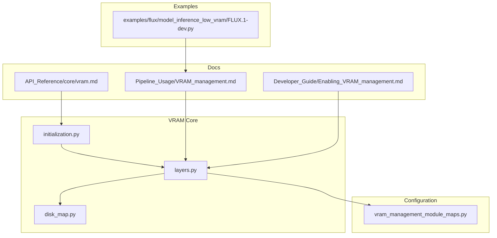
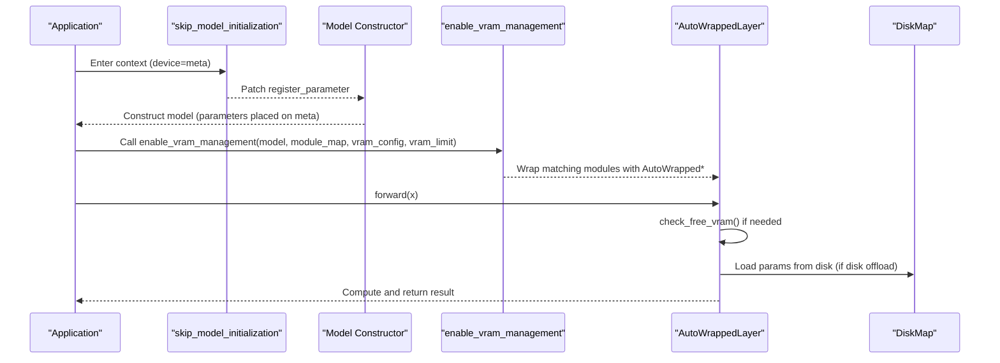
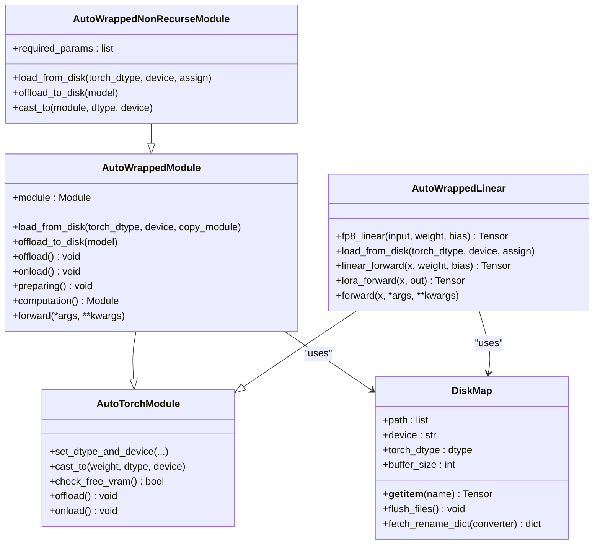
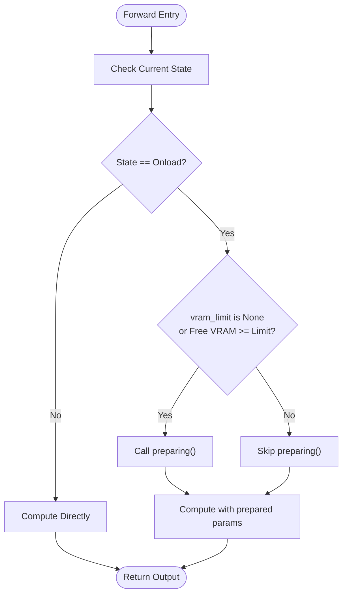
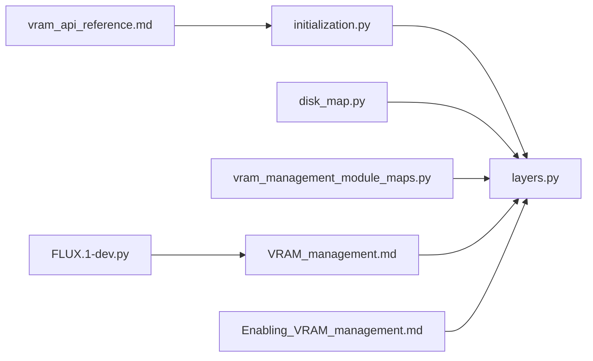

# VRAM Initialization and Configuration

<cite>
**Referenced Files in This Document**
- [initialization.py](file://diffsynth/core/vram/initialization.py)
- [layers.py](file://diffsynth/core/vram/layers.py)
- [disk_map.py](file://diffsynth/core/vram/disk_map.py)
- [vram_management_module_maps.py](file://diffsynth/configs/vram_management_module_maps.py)
- [VRAM_management.md](file://docs/en/Pipeline_Usage/VRAM_management.md)
- [Enabling_VRAM_management.md](file://docs/en/Developer_Guide/Enabling_VRAM_management.md)
- [vram_api_reference.md](file://docs/en/API_Reference/core/vram.md)
- [FLUX.1-dev.py](file://examples/flux/model_inference_low_vram/FLUX.1-dev.py)
</cite>

## Table of Contents
1. [Introduction](#introduction)
2. [Project Structure](#project-structure)
3. [Core Components](#core-components)
4. [Architecture Overview](#architecture-overview)
5. [Detailed Component Analysis](#detailed-component-analysis)
6. [Dependency Analysis](#dependency-analysis)
7. [Performance Considerations](#performance-considerations)
8. [Troubleshooting Guide](#troubleshooting-guide)
9. [Conclusion](#conclusion)
10. [Appendices](#appendices)

## Introduction
This document explains the VRAM initialization system used to optimize memory usage during model loading and inference. It focuses on:
- The skip_model_initialization function and how it avoids redundant parameter initialization.
- The initialization process that sets up VRAM management strategies, including device placement policies and memory allocation patterns.
- Configuration options for different hardware constraints and memory limits.
- Examples of custom initialization configurations for specific deployment scenarios.
- The relationship between initialization parameters and runtime performance.
- Troubleshooting guidance for initialization failures and memory allocation issues.

## Project Structure
The VRAM initialization and management system is implemented under diffsynth.core.vram with supporting configuration and documentation:
- Core implementation: initialization.py, layers.py, disk_map.py
- Module maps for automatic wrapping: vram_management_module_maps.py
- Usage and developer guides: docs/en/Pipeline_Usage/VRAM_management.md, docs/en/Developer_Guide/Enabling_VRAM_management.md
- API reference for skipping initialization: docs/en/API_Reference/core/vram.md
- Example low-VRAM pipeline script: examples/flux/model_inference_low_vram/FLUX.1-dev.py



**Diagram sources**
- [initialization.py:1-22](file://diffsynth/core/vram/initialization.py#L1-L22)
- [layers.py:1-480](file://diffsynth/core/vram/layers.py#L1-L480)
- [disk_map.py:1-94](file://diffsynth/core/vram/disk_map.py#L1-L94)
- [vram_management_module_maps.py:1-312](file://diffsynth/configs/vram_management_module_maps.py#L1-L312)
- [VRAM_management.md:1-206](file://docs/en/Pipeline_Usage/VRAM_management.md#L1-L206)
- [Enabling_VRAM_management.md:1-455](file://docs/en/Developer_Guide/Enabling_VRAM_management.md#L1-L455)
- [vram_api_reference.md:1-34](file://docs/en/API_Reference/core/vram.md#L1-L34)
- [FLUX.1-dev.py:1-38](file://examples/flux/model_inference_low_vram/FLUX.1-dev.py#L1-L38)

**Section sources**
- [initialization.py:1-22](file://diffsynth/core/vram/initialization.py#L1-L22)
- [layers.py:1-480](file://diffsynth/core/vram/layers.py#L1-L480)
- [disk_map.py:1-94](file://diffsynth/core/vram/disk_map.py#L1-L94)
- [vram_management_module_maps.py:1-312](file://diffsynth/configs/vram_management_module_maps.py#L1-L312)
- [VRAM_management.md:1-206](file://docs/en/Pipeline_Usage/VRAM_management.md#L1-L206)
- [Enabling_VRAM_management.md:1-455](file://docs/en/Developer_Guide/Enabling_VRAM_management.md#L1-L455)
- [vram_api_reference.md:1-34](file://docs/en/API_Reference/core/vram.md#L1-L34)
- [FLUX.1-dev.py:1-38](file://examples/flux/model_inference_low_vram/FLUX.1-dev.py#L1-L38)

## Core Components
- skip_model_initialization: A context manager that temporarily replaces PyTorch’s register_parameter to move newly registered parameters to a specified device (default meta), avoiding expensive initialization when weights will be overwritten by load_state_dict.
- AutoWrappedModule and AutoWrappedLinear: Wrappers around torch.nn.Module and torch.nn.Linear that manage four states (offload, onload, preparing, computation) and handle dtype/device casting, optional FP8 linear path, and dynamic VRAM checks.
- DiskMap: Lazy loader for safetensors or compatible binary files with buffer-based flushing and optional state dict renaming.
- enable_vram_management and enable_vram_management_recursively: Entry points to wrap modules according to module maps and vram_config, optionally enabling per-layer dynamic VRAM control via vram_limit.
- fill_vram_config: Normalizes vram_config defaults for onload/preparing/computation stages.

Key responsibilities:
- Skip redundant parameter initialization during model construction.
- Provide fine-grained control over where and how parameters are stored and cast at runtime.
- Support CPU offload, FP8 storage, and disk offload strategies.
- Dynamically decide whether to prepare parameters based on available VRAM.

**Section sources**
- [initialization.py:1-22](file://diffsynth/core/vram/initialization.py#L1-L22)
- [layers.py:8-480](file://diffsynth/core/vram/layers.py#L8-L480)
- [disk_map.py:1-94](file://diffsynth/core/vram/disk_map.py#L1-L94)
- [vram_management_module_maps.py:1-312](file://diffsynth/configs/vram_management_module_maps.py#L1-L312)

## Architecture Overview
The VRAM initialization and management architecture consists of:
- Initialization phase: skip_model_initialization avoids initializing parameters; models are constructed with minimal memory footprint.
- Wrapping phase: enable_vram_management selects target wrappers based on module types and applies vram_config and vram_limit.
- Runtime phase: each wrapped layer manages its own state transitions and casts parameters as needed, optionally using FP8 or disk-backed tensors.



**Diagram sources**
- [initialization.py:1-22](file://diffsynth/core/vram/initialization.py#L1-L22)
- [layers.py:439-479](file://diffsynth/core/vram/layers.py#L439-L479)
- [disk_map.py:1-94](file://diffsynth/core/vram/disk_map.py#L1-L94)

## Detailed Component Analysis

### skip_model_initialization
Purpose:
- Avoids redundant parameter initialization by moving parameters to meta device immediately upon registration.
- Preserves requires_grad flags and other parameter attributes.

Behavior:
- Temporarily patches torch.nn.Module.register_parameter.
- Moves non-None parameters to the specified device (default meta).
- Restores original register_parameter after the context exits.

Impact:
- Reduces initialization time and memory spikes during model construction.
- Ensures subsequent load_state_dict operations overwrite parameters without extra work.

**Section sources**
- [initialization.py:1-22](file://diffsynth/core/vram/initialization.py#L1-L22)
- [vram_api_reference.md:1-34](file://docs/en/API_Reference/core/vram.md#L1-L34)

### AutoWrappedModule and AutoWrappedLinear
Responsibilities:
- Maintain four states: offload, onload, preparing, computation.
- Cast parameters to appropriate dtype/device for each stage.
- Check free VRAM before entering preparing state.
- Support FP8 linear path for reduced VRAM storage.
- Optional disk offload via DiskMap.

Key methods:
- set_dtype_and_device: Configures dtype/device for each stage.
- offload/onload/preparing/computation: State transitions and casting logic.
- forward: Orchestrates state transitions and execution.
- check_free_vram: Uses device memory APIs to determine if preparing is safe.

Complexity considerations:
- Casting and copying occur only when dtype/device differ from current computation settings.
- Disk offload adds I/O overhead but minimizes RAM/VRAM usage.

**Section sources**
- [layers.py:8-205](file://diffsynth/core/vram/layers.py#L8-L205)
- [layers.py:271-437](file://diffsynth/core/vram/layers.py#L271-L437)

### DiskMap
Responsibilities:
- Lazy loading of tensors from safetensors or compatible binary loaders.
- Buffer-based flushing to avoid keeping too many files open.
- Optional rename mapping for state dict converters.

Key behaviors:
- __getitem__ returns tensors with requested dtype and device.
- flush_files reopens file handles when buffer threshold is exceeded.
- Supports iteration and containment checks for keys.

Constraints:
- Disk offload works best with .safetensors files.
- Non-safetensors formats use a slower fallback loader.

**Section sources**
- [disk_map.py:1-94](file://diffsynth/core/vram/disk_map.py#L1-L94)

### enable_vram_management and enable_vram_management_recursively
Responsibilities:
- Select wrapper type based on module_map entries.
- Apply vram_config uniformly or recursively across model hierarchy.
- Mark model with vram_management_enabled flag.

Flow:
- If model matches a top-level source_module, wrap entire model with target_module.
- Otherwise, traverse children and wrap matching modules recursively.
- Normalize vram_config via fill_vram_config.

**Section sources**
- [layers.py:439-479](file://diffsynth/core/vram/layers.py#L439-L479)

### fill_vram_config
Responsibilities:
- Ensure onload and preparing stages default to computation dtype/device unless explicitly overridden.
- Emit informational message when fine-grained configuration is not provided.

**Section sources**
- [layers.py:455-465](file://diffsynth/core/vram/layers.py#L455-L465)

### Class Diagram


**Diagram sources**
- [layers.py:8-480](file://diffsynth/core/vram/layers.py#L8-L480)
- [disk_map.py:1-94](file://diffsynth/core/vram/disk_map.py#L1-L94)

### Sequence Diagram: Forward with Dynamic VRAM Control
```mermaid
sequenceDiagram
participant Caller as "Caller"
participant Layer as "AutoWrappedLinear"
participant Device as "Device Memory"
participant Disk as "DiskMap"
Caller->>Layer : forward(x)
Layer->>Layer : check_free_vram()
alt VRAM allows preparing
Layer->>Layer : preparing()
opt Disk Offload
Layer->>Disk : load_from_disk(preparing_dtype, preparing_device)
Disk-->>Layer : weight, bias
end
else VRAM insufficient
Layer->>Layer : skip preparing
end
Layer->>Layer : computation()
opt FP8 enabled
Layer->>Layer : fp8_linear(x, weight, bias)
else Standard Linear
Layer->>Layer : functional.linear(x, weight, bias)
end
Layer-->>Caller : output
```

**Diagram sources**
- [layers.py:271-437](file://diffsynth/core/vram/layers.py#L271-L437)

### Flowchart: Preparing Decision Logic


**Diagram sources**
- [layers.py:429-437](file://diffsynth/core/vram/layers.py#L429-L437)

## Dependency Analysis
- initialization.py depends on torch.nn.Module.register_parameter patching.
- layers.py depends on initialization.py for skipping initialization and on disk_map.py for lazy loading.
- vram_management_module_maps.py provides mappings from model classes to wrapper types and module types.
- Documentation and examples guide users on configuring vram_config and vram_limit.



**Diagram sources**
- [initialization.py:1-22](file://diffsynth/core/vram/initialization.py#L1-L22)
- [layers.py:1-480](file://diffsynth/core/vram/layers.py#L1-L480)
- [disk_map.py:1-94](file://diffsynth/core/vram/disk_map.py#L1-L94)
- [vram_management_module_maps.py:1-312](file://diffsynth/configs/vram_management_module_maps.py#L1-L312)
- [VRAM_management.md:1-206](file://docs/en/Pipeline_Usage/VRAM_management.md#L1-L206)
- [Enabling_VRAM_management.md:1-455](file://docs/en/Developer_Guide/Enabling_VRAM_management.md#L1-L455)
- [vram_api_reference.md:1-34](file://docs/en/API_Reference/core/vram.md#L1-L34)
- [FLUX.1-dev.py:1-38](file://examples/flux/model_inference_low_vram/FLUX.1-dev.py#L1-L38)

**Section sources**
- [layers.py:439-479](file://diffsynth/core/vram/layers.py#L439-L479)
- [vram_management_module_maps.py:1-312](file://diffsynth/configs/vram_management_module_maps.py#L1-L312)

## Performance Considerations
- skip_model_initialization reduces initialization time and peak memory during model construction.
- FP8 storage significantly lowers VRAM usage; computation remains BF16 for numerical stability.
- Disk offload minimizes RAM/VRAM requirements but introduces I/O latency; prefer fast SSDs.
- vram_limit controls dynamic preparation; setting it slightly below actual VRAM ensures stable operation.
- Overuse of preparing can increase overhead; balance vram_limit with workload characteristics.

[No sources needed since this section provides general guidance]

## Troubleshooting Guide
Common issues and resolutions:
- Initialization failures due to unexpected parameter shapes: ensure load_state_dict uses assign=True and matches model structure.
- Disk offload errors: verify model files are .safetensors; non-safetensors formats fall back to slower loaders and may have limitations.
- Excessive VRAM usage: reduce vram_limit or disable preparing by ensuring free VRAM checks fail; consider CPU offload or FP8 storage.
- Slow inference with disk offload: use high-speed SSD and minimize frequent parameter reloads by batching or reducing step count.
- Incompatible transformers versions: update module maps accordingly (see VERSION_CHECKER_MAPS).

**Section sources**
- [disk_map.py:13-26](file://diffsynth/core/vram/disk_map.py#L13-L26)
- [vram_management_module_maps.py:300-312](file://diffsynth/configs/vram_management_module_maps.py#L300-L312)
- [VRAM_management.md:139-174](file://docs/en/Pipeline_Usage/VRAM_management.md#L139-L174)

## Conclusion
The VRAM initialization system combines efficient model construction with flexible runtime memory management. By skipping unnecessary parameter initialization and providing layered control over dtype/device placement, it enables large models to run on constrained hardware. Proper configuration of vram_config and vram_limit, along with understanding of disk offload and FP8 strategies, allows tailoring performance and memory usage to deployment needs.

[No sources needed since this section summarizes without analyzing specific files]

## Appendices

### Configuration Options Summary
- vram_config keys:
  - offload_dtype/offload_device: Storage dtype/device when not needed.
  - onload_dtype/onload_device: Dtype/device for immediate future use.
  - preparing_dtype/preparing_device: Temporary dtype/device before computation.
  - computation_dtype/computation_device: Dtype/device for actual computation.
- vram_limit: Threshold for dynamic preparing; None disables dynamic control.

**Section sources**
- [VRAM_management.md:175-206](file://docs/en/Pipeline_Usage/VRAM_management.md#L175-L206)

### Example: Low-VRAM FLUX Pipeline
- Demonstrates FP8 storage with CPU offload and dynamic VRAM limit.
- Shows practical usage of vram_config and vram_limit in a real pipeline.

**Section sources**
- [FLUX.1-dev.py:1-38](file://examples/flux/model_inference_low_vram/FLUX.1-dev.py#L1-L38)