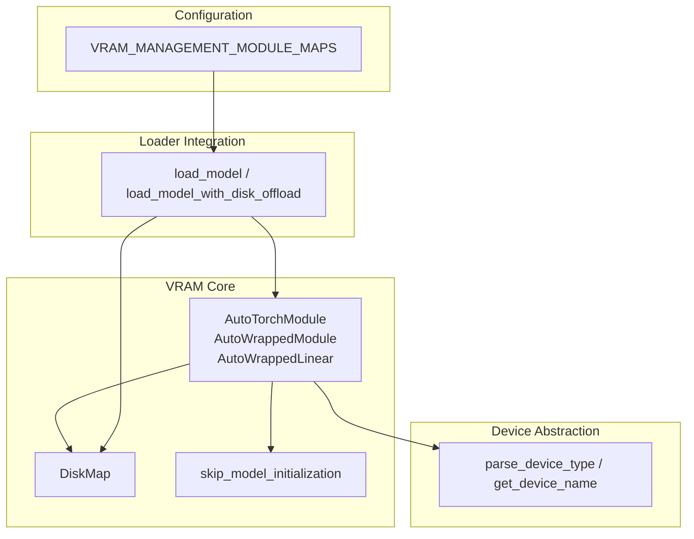
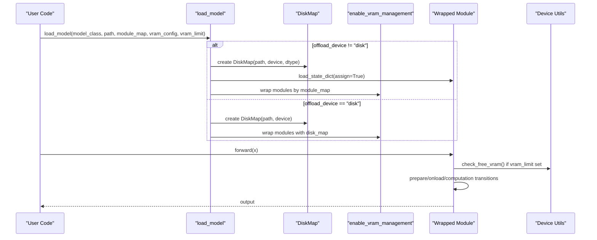
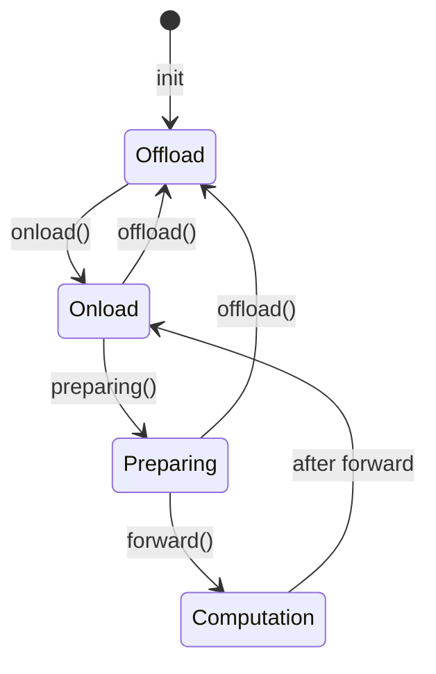
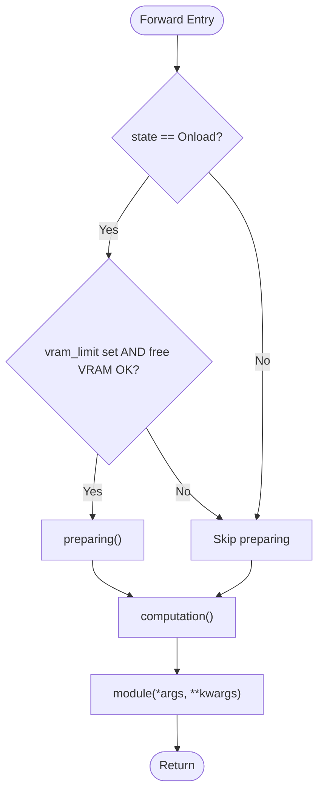
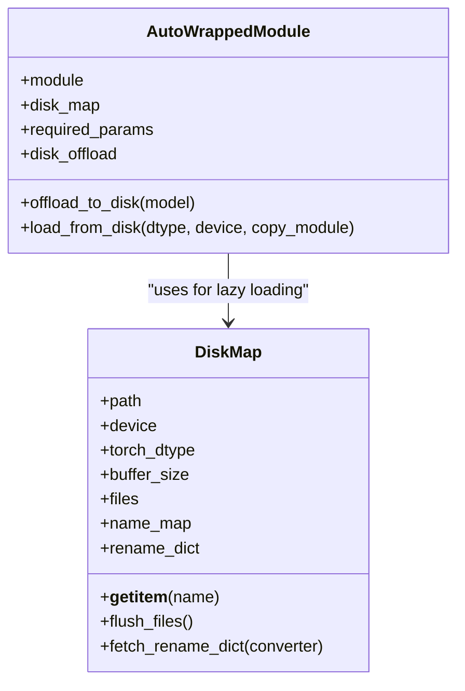
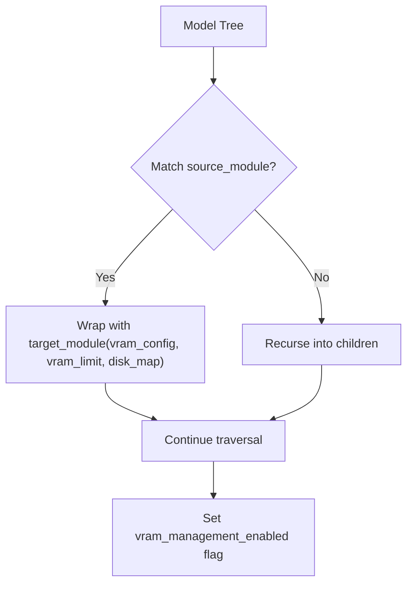
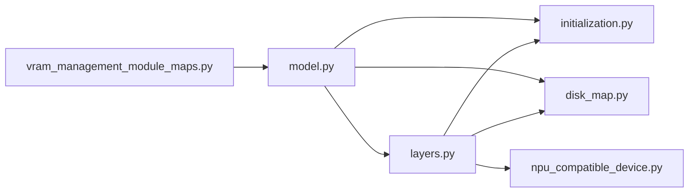

# VRAM Management Core

<cite>
**Referenced Files in This Document**
- [layers.py](file://diffsynth/core/vram/layers.py)
- [initialization.py](file://diffsynth/core/vram/initialization.py)
- [disk_map.py](file://diffsynth/core/vram/disk_map.py)
- [vram_management_module_maps.py](file://diffsynth/configs/vram_management_module_maps.py)
- [model.py](file://diffsynth/core/loader/model.py)
- [npu_compatible_device.py](file://diffsynth/core/device/npu_compatible_device.py)
- [VRAM_management.md](file://docs/en/Pipeline_Usage/VRAM_management.md)
- [Enabling_VRAM_management.md](file://docs/en/Developer_Guide/Enabling_VRAM_management.md)
- [Qwen-Image.py (low vram example)](file://examples/qwen_image/model_inference_low_vram/Qwen-Image.py)
</cite>

## Table of Contents
1. [Introduction](#introduction)
2. [Project Structure](#project-structure)
3. [Core Components](#core-components)
4. [Architecture Overview](#architecture-overview)
5. [Detailed Component Analysis](#detailed-component-analysis)
6. [Dependency Analysis](#dependency-analysis)
7. [Performance Considerations](#performance-considerations)
8. [Troubleshooting Guide](#troubleshooting-guide)
9. [Conclusion](#conclusion)
10. [Appendices](#appendices)

## Introduction
This document explains the VRAM management core system that enables dynamic device placement, disk offloading, and layer-level memory optimization for large models. It covers how the framework decides where to keep parameters (GPU, CPU, or disk), how it transitions between states during inference, and how to configure these behaviors for different hardware constraints. It also provides examples of VRAM-aware model loading and inference patterns, performance trade-offs, and troubleshooting guidance.

## Project Structure
The VRAM management core is implemented under diffsynth/core/vram with supporting configuration and loader integration:
- Core classes and state machine live in layers.py
- Initialization helpers are in initialization.py
- Disk-based parameter mapping is in disk_map.py
- Module maps for automatic wrapping are in configs/vram_management_module_maps.py
- Loader integration and disk-offload entry points are in core/loader/model.py
- Device abstraction utilities are in core/device/npu_compatible_device.py
- Usage documentation and developer guides are in docs/en

**Diagram sources**
- [layers.py:8-479](file://diffsynth/core/vram/layers.py#L8-L479)
- [disk_map.py:28-94](file://diffsynth/core/vram/disk_map.py#L28-L94)
- [initialization.py:5-22](file://diffsynth/core/vram/initialization.py#L5-L22)
- [vram_management_module_maps.py:12-312](file://diffsynth/configs/vram_management_module_maps.py#L12-L312)
- [model.py:11-88](file://diffsynth/core/loader/model.py#L11-L88)
- [npu_compatible_device.py:85-108](file://diffsynth/core/device/npu_compatible_device.py#L85-L108)

**Section sources**
- [layers.py:8-479](file://diffsynth/core/vram/layers.py#L8-L479)
- [disk_map.py:28-94](file://diffsynth/core/vram/disk_map.py#L28-L94)
- [initialization.py:5-22](file://diffsynth/core/vram/initialization.py#L5-L22)
- [vram_management_module_maps.py:12-312](file://diffsynth/configs/vram_management_module_maps.py#L12-L312)
- [model.py:11-88](file://diffsynth/core/loader/model.py#L11-L88)
- [npu_compatible_device.py:85-108](file://diffsynth/core/device/npu_compatible_device.py#L85-L108)

## Core Components
- AutoTorchModule: Base class defining dtype/device settings per stage (offload, onload, preparing, computation) and a simple VRAM check helper.
- AutoWrappedModule: Wraps arbitrary torch.nn.Module with stateful lifecycle and optional disk offloading.
- AutoWrappedNonRecurseModule: Variant that only manages top-level parameters (useful for modules with internal recursion).
- AutoWrappedLinear: Specialized wrapper for Linear layers with FP8 path and LoRA support hooks.
- DiskMap: Lazy, safetensors-compatible loader with rename mapping and buffer flushing to control memory pressure.
- enable_vram_management / enable_vram_management_recursively: Automatically replace target layers based on module maps and apply vram_config.
- skip_model_initialization: Context manager to avoid random weight initialization during meta/cpu loading.

Key capabilities:
- Dynamic device placement across CPU/GPU/NPU with explicit dtypes per stage
- Layer-level granularity via module maps
- Disk offloading for extreme memory constraints
- Optional VRAM limit enforcement with runtime checks

**Section sources**
- [layers.py:8-479](file://diffsynth/core/vram/layers.py#L8-L479)
- [disk_map.py:28-94](file://diffsynth/core/vram/disk_map.py#L28-L94)
- [initialization.py:5-22](file://diffsynth/core/vram/initialization.py#L5-L22)

## Architecture Overview
The VRAM management system integrates at two levels:
- Model loading: The loader chooses whether to use a DiskMap or standard state dict, then applies enable_vram_management to wrap target layers according to module maps.
- Inference-time execution: Wrapped modules manage their own state transitions (Offload → Onload → Preparing → Computation) and perform casting/movement as needed.

**Diagram sources**
- [model.py:11-88](file://diffsynth/core/loader/model.py#L11-L88)
- [layers.py:439-479](file://diffsynth/core/vram/layers.py#L439-L479)
- [disk_map.py:28-94](file://diffsynth/core/vram/disk_map.py#L28-L94)
- [npu_compatible_device.py:85-108](file://diffsynth/core/device/npu_compatible_device.py#L85-L108)

## Detailed Component Analysis

### State Machine and Lifecycle
Each wrapped module tracks a state:
- Offload (0): Parameters reside in offload_dtype/offload_device
- Onload (1): Parameters moved to onload_dtype/onload_device
- Preparing (2): Temporary staging before computation
- Computation: Temporary execution context; returns to previous state after forward

Transitions:
- offload(): move to offload state
- onload(): move to onload state
- preparing(): move to preparing state when VRAM allows
- computation(): return a version of the module ready for compute (may cast or copy)

**Diagram sources**
- [layers.py:71-198](file://diffsynth/core/vram/layers.py#L71-L198)

**Section sources**
- [layers.py:71-198](file://diffsynth/core/vram/layers.py#L71-L198)

### Dynamic Device Placement Strategy
- Each stage has independent dtype and device settings: offload, onload, preparing, computation.
- AutoWrappedModule.forward checks free VRAM when vram_limit is set and may promote from Onload to Preparing if resources allow.
- AutoWrappedLinear.forward additionally supports FP8 linear path and LoRA accumulation.

**Diagram sources**
- [layers.py:194-198](file://diffsynth/core/vram/layers.py#L194-L198)
- [layers.py:429-436](file://diffsynth/core/vram/layers.py#L429-L436)

**Section sources**
- [layers.py:65-69](file://diffsynth/core/vram/layers.py#L65-L69)
- [layers.py:194-198](file://diffsynth/core/vram/layers.py#L194-L198)
- [layers.py:429-436](file://diffsynth/core/vram/layers.py#L429-L436)

### Disk Offloading Mechanism
- When offload_device/onload_device is set to "disk", modules do not keep parameters in RAM; instead they lazily read tensors from safetensors files through DiskMap.
- DiskMap opens files with safe_open and exposes a __getitem__ interface keyed by parameter name, with optional rename mapping and buffer flush to control memory footprint.
- AutoWrappedModule.offload_to_disk moves buffers to meta and defers actual data to disk reads.

**Diagram sources**
- [disk_map.py:28-94](file://diffsynth/core/vram/disk_map.py#L28-L94)
- [layers.py:140-176](file://diffsynth/core/vram/layers.py#L140-L176)

**Section sources**
- [disk_map.py:28-94](file://diffsynth/core/vram/disk_map.py#L28-L94)
- [layers.py:140-176](file://diffsynth/core/vram/layers.py#L140-L176)

### Layer-Level VRAM Optimization and Mapping
- enable_vram_management recursively replaces matching layers based on module_map entries.
- For each matched source type, a target wrapper is instantiated with vram_config and optional vram_limit and disk_map.
- Module maps define which layers should be wrapped per model architecture.

**Diagram sources**
- [layers.py:439-479](file://diffsynth/core/vram/layers.py#L439-L479)
- [vram_management_module_maps.py:12-312](file://diffsynth/configs/vram_management_module_maps.py#L12-L312)

**Section sources**
- [layers.py:439-479](file://diffsynth/core/vram/layers.py#L439-L479)
- [vram_management_module_maps.py:12-312](file://diffsynth/configs/vram_management_module_maps.py#L12-L312)

### Memory Mapping Strategies
- Non-disk mode: parameters are loaded into RAM (via DiskMap or direct state dict) and moved between CPU/GPU as configured.
- Disk mode: parameters remain on disk; only the required tensors are read and cast to the computation dtype/device on demand.
- Buffering: DiskMap tracks cumulative tensor elements and flushes file handles when exceeding buffer_size to avoid holding too many open handles or cached tensors.

**Section sources**
- [disk_map.py:28-94](file://diffsynth/core/vram/disk_map.py#L28-L94)
- [model.py:11-88](file://diffsynth/core/loader/model.py#L11-L88)

### Examples of VRAM-Aware Loading and Inference
- Basic CPU offload: set offload/onload/preparing/computation devices and dtypes to move components between CPU and GPU.
- FP8 quantization: store weights in float8_e4m3fn on CPU/GPU and convert to bfloat16 for computation.
- Dynamic VRAM management: set vram_limit to constrain peak VRAM usage; the framework will dynamically move layers between memory and GPU.
- Disk offload: set offload/onload to "disk" and use safetensors; requires fast SSD for acceptable latency.

Reference examples:
- Pipeline usage and best practices: [VRAM_management.md](file://docs/en/Pipeline_Usage/VRAM_management.md)
- Developer guide for fine-grained configuration: [Enabling_VRAM_management.md](file://docs/en/Developer_Guide/Enabling_VRAM_management.md)
- Low VRAM example script: [Qwen-Image.py (low vram example)](file://examples/qwen_image/model_inference_low_vram/Qwen-Image.py)

**Section sources**
- [VRAM_management.md:1-206](file://docs/en/Pipeline_Usage/VRAM_management.md#L1-L206)
- [Enabling_VRAM_management.md:1-455](file://docs/en/Developer_Guide/Enabling_VRAM_management.md#L1-L455)
- [Qwen-Image.py (low vram example):1-29](file://examples/qwen_image/model_inference_low_vram/Qwen-Image.py#L1-L29)

## Dependency Analysis
- layers.py depends on:
  - initialization.skip_model_initialization
  - disk_map.DiskMap
  - device.parse_device_type, get_device_name, IS_NPU_AVAILABLE
- model.py depends on:
  - vram.initialization.skip_model_initialization
  - vram.disk_map.DiskMap
  - vram.layers.enable_vram_management
  - file.load_state_dict
- Configuration maps in vram_management_module_maps.py drive automatic wrapping for supported models.

**Diagram sources**
- [layers.py:1-6](file://diffsynth/core/vram/layers.py#L1-L6)
- [model.py:1-8](file://diffsynth/core/loader/model.py#L1-L8)
- [vram_management_module_maps.py:12-312](file://diffsynth/configs/vram_management_module_maps.py#L12-L312)

**Section sources**
- [layers.py:1-6](file://diffsynth/core/vram/layers.py#L1-L6)
- [model.py:1-8](file://diffsynth/core/loader/model.py#L1-L8)
- [vram_management_module_maps.py:12-312](file://diffsynth/configs/vram_management_module_maps.py#L12-L312)

## Performance Considerations
- VRAM vs speed trade-offs:
  - Smaller vram_limit reduces peak VRAM but increases data movement overhead, slowing inference.
  - Disk offload minimizes memory footprint but introduces I/O latency; prefer high-speed SSDs.
  - FP8 storage reduces memory but does not accelerate computation unless native FP8 matmul is used (currently disabled for accuracy reasons).
- Device selection:
  - Using CPU for offload/onload can reduce VRAM but adds PCIe transfer costs.
  - Keeping frequently used layers in GPU improves throughput.
- Precision:
  - Storing weights in lower precision (e.g., float8) saves memory; conversion to bfloat16 occurs at compute time.
- Buffering:
  - DiskMap’s buffer_size controls how many tensors are kept in memory before flushing file handles; tune for your workload.

[No sources needed since this section provides general guidance]

## Troubleshooting Guide
Common issues and resolutions:
- Out-of-memory errors despite vram_limit:
  - Set vram_limit slightly below available VRAM (e.g., total - 0.5 GB) to leave headroom for activations and temporary buffers.
  - Use disk offload for extreme cases.
- Slow inference with disk offload:
  - Ensure safetensors files are used and stored on an SSD.
  - Reduce unnecessary conversions; align preparing_dtype with computation_dtype when possible.
- Incorrect module wrapping:
  - Verify module_map entries match the model’s actual layer types.
  - Use print(model) to inspect structure and confirm which layers contain parameters.
- NPU/CUDA device detection:
  - Confirm parse_device_type and get_device_name resolve correctly for your environment.
- DeepSpeed ZeRO Stage 3:
  - The loader includes special handling; ensure proper initialization contexts are applied.

**Section sources**
- [VRAM_management.md:98-137](file://docs/en/Pipeline_Usage/VRAM_management.md#L98-L137)
- [Enabling_VRAM_management.md:356-397](file://docs/en/Developer_Guide/Enabling_VRAM_management.md#L356-L397)
- [npu_compatible_device.py:85-108](file://diffsynth/core/device/npu_compatible_device.py#L85-L108)
- [model.py:91-106](file://diffsynth/core/loader/model.py#L91-L106)

## Conclusion
The VRAM management core provides a flexible, layer-aware strategy to run large models on constrained hardware. By combining dynamic device placement, optional disk offloading, and configurable precision, it balances memory usage and speed. Users can select appropriate modes (CPU offload, FP8 storage, dynamic limits, or disk offload) based on available resources, while developers can extend support to new models via module maps and wrappers.

[No sources needed since this section summarizes without analyzing specific files]

## Appendices

### API Quick Reference
- enable_vram_management(model, module_map, vram_config, vram_limit=None, disk_map=None)
- enable_vram_management_recursively(model, module_map, vram_config, vram_limit=None, disk_map=None)
- DiskMap(path, device, torch_dtype=None, state_dict_converter=None, buffer_size=10**9)
- skip_model_initialization(device="meta")

**Section sources**
- [layers.py:439-479](file://diffsynth/core/vram/layers.py#L439-L479)
- [disk_map.py:28-94](file://diffsynth/core/vram/disk_map.py#L28-L94)
- [initialization.py:5-22](file://diffsynth/core/vram/initialization.py#L5-L22)