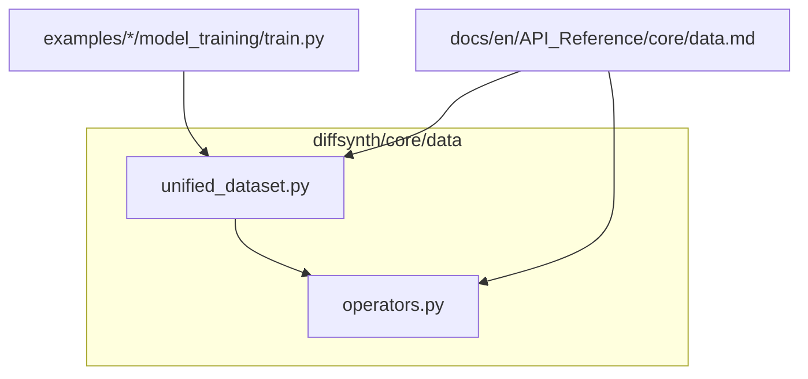
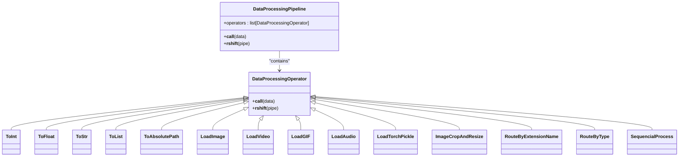
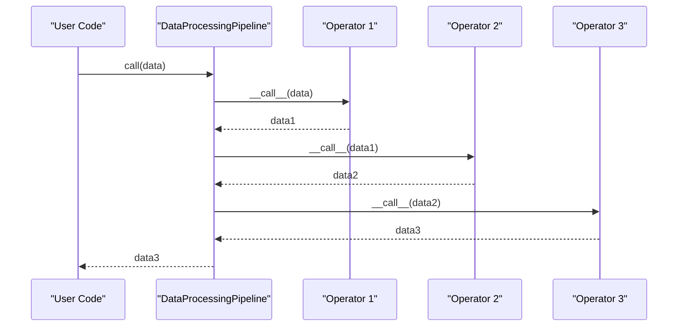
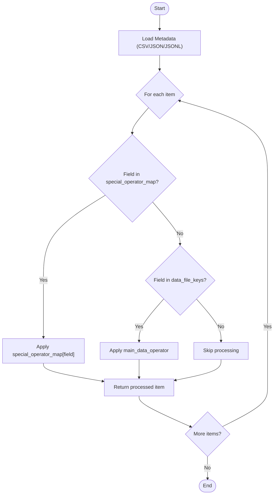
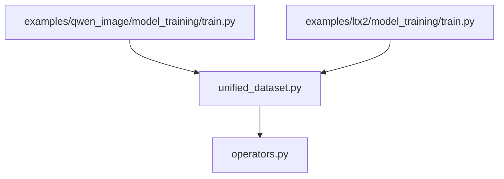

# Data Operators

<cite>
**Referenced Files in This Document**
- [operators.py](file://diffsynth/core/data/operators.py)
- [unified_dataset.py](file://diffsynth/core/data/unified_dataset.py)
- [data.md](file://docs/en/API_Reference/core/data.md)
- [train.py (Qwen Image)](file://examples/qwen_image/model_training/train.py)
- [train.py (LTX2)](file://examples/ltx2/model_training/train.py)
</cite>

## Table of Contents
1. [Introduction](#introduction)
2. [Project Structure](#project-structure)
3. [Core Components](#core-components)
4. [Architecture Overview](#architecture-overview)
5. [Detailed Component Analysis](#detailed-component-analysis)
6. [Dependency Analysis](#dependency-analysis)
7. [Performance Considerations](#performance-considerations)
8. [Troubleshooting Guide](#troubleshooting-guide)
9. [Conclusion](#conclusion)
10. [Appendices](#appendices)

## Introduction
This document explains the data operators system used in ODTSR-edit for building robust, composable data processing pipelines. It covers:
- The base operator and pipeline abstractions
- Built-in operators for loading and transforming images, videos, audio, and types
- How to chain operations using the >> operator via DataProcessingPipeline
- Practical examples from training scripts
- Error handling, validation, and debugging techniques
- Guidance for creating custom operators and optimizing pipelines

## Project Structure
The data operators system is implemented under diffsynth.core.data with two primary modules:
- operators.py: Defines the base classes, built-in operators, and the pipeline mechanism
- unified_dataset.py: Provides a dataset wrapper that applies operators to metadata-driven fields

**Diagram sources**
- [operators.py:1-279](file://diffsynth/core/data/operators.py#L1-L279)
- [unified_dataset.py:1-119](file://diffsynth/core/data/unified_dataset.py#L1-L119)
- [data.md:1-151](file://docs/en/API_Reference/core/data.md#L1-L151)
- [train.py (Qwen Image):120-175](file://examples/qwen_image/model_training/train.py#L120-L175)
- [train.py (LTX2):135-180](file://examples/ltx2/model_training/train.py#L135-L180)

**Section sources**
- [operators.py:1-279](file://diffsynth/core/data/operators.py#L1-L279)
- [unified_dataset.py:1-119](file://diffsynth/core/data/unified_dataset.py#L1-L119)
- [data.md:1-151](file://docs/en/API_Reference/core/data.md#L1-L151)

## Core Components
- DataProcessingOperator: Base class defining the operator interface and chaining behavior via >>
- DataProcessingPipeline: Container that executes a sequence of operators; supports composition with >>
- Built-in operators:
  - Type conversion: ToInt, ToFloat, ToStr, ToList
  - Path utilities: ToAbsolutePath
  - File loaders: LoadImage, LoadVideo, LoadGIF, LoadAudio, LoadTorchPickle
  - Media processors: ImageCropAndResize
  - Routing and sequencing: RouteByExtensionName, RouteByType, SequencialProcess
- UnifiedDataset: Applies main_data_operator or special_operator_map to selected keys from metadata

Key behaviors:
- Pipelines are created by chaining operators with >>
- Each operator implements __call__(data) and returns transformed data
- Routing operators dispatch based on file extension or Python type

**Section sources**
- [operators.py:8-31](file://diffsynth/core/data/operators.py#L8-L31)
- [operators.py:33-107](file://diffsynth/core/data/operators.py#L33-L107)
- [operators.py:149-206](file://diffsynth/core/data/operators.py#L149-L206)
- [operators.py:209-230](file://diffsynth/core/data/operators.py#L209-L230)
- [operators.py:232-279](file://diffsynth/core/data/operators.py#L232-L279)
- [unified_dataset.py:5-26](file://diffsynth/core/data/unified_dataset.py#L5-L26)

## Architecture Overview
The system follows a functional pipeline architecture where data flows through a chain of operators. UnifiedDataset orchestrates field-specific pipelines based on metadata keys.

**Diagram sources**
- [operators.py:8-31](file://diffsynth/core/data/operators.py#L8-L31)
- [operators.py:33-107](file://diffsynth/core/data/operators.py#L33-L107)
- [operators.py:149-206](file://diffsynth/core/data/operators.py#L149-L206)
- [operators.py:209-230](file://diffsynth/core/data/operators.py#L209-L230)
- [operators.py:232-279](file://diffsynth/core/data/operators.py#L232-L279)

## Detailed Component Analysis

### DataProcessingOperator and DataProcessingPipeline
- DataProcessingOperator defines the minimal interface for callable transformations and supports chaining via >> to build pipelines automatically.
- DataProcessingPipeline stores an ordered list of operators and executes them sequentially when called. It also supports composing with other operators or pipelines via >>.

**Diagram sources**
- [operators.py:8-21](file://diffsynth/core/data/operators.py#L8-L21)
- [operators.py:23-31](file://diffsynth/core/data/operators.py#L23-L31)

**Section sources**
- [operators.py:8-31](file://diffsynth/core/data/operators.py#L8-L31)

### Built-in Operators

#### Type Conversion Operators
- ToInt, ToFloat, ToStr, ToList: Simple conversions applied element-wise. ToStr supports a none_value fallback.

Use cases:
- Converting numeric strings to integers/floats
- Wrapping single items into lists for uniform downstream processing

**Section sources**
- [operators.py:38-55](file://diffsynth/core/data/operators.py#L38-L55)
- [operators.py:105-107](file://diffsynth/core/data/operators.py#L105-L107)

#### Path Utilities
- ToAbsolutePath: Resolves relative paths against a base path.

Use cases:
- Ensuring consistent absolute paths before loading files

**Section sources**
- [operators.py:240-246](file://diffsynth/core/data/operators.py#L240-L246)

#### File Loading Operators
- LoadImage: Opens image files and optionally converts to RGB or RGBA.
- LoadVideo: Reads video frames with configurable frame sampling and optional per-frame processing.
- LoadGIF: Loads GIF frames with frame count constraints and per-frame processing.
- LoadAudio: Loads audio waveform at a specified sample rate.
- LoadTorchPickle: Loads torch.save artifacts with map_location control.

Notes:
- LoadVideo and LoadGIF support time-based sampling parameters to align frames with model expectations.
- LoadAudioWithTorchaudio provides torchaudio-based loading with duration alignment and padding.

**Section sources**
- [operators.py:57-67](file://diffsynth/core/data/operators.py#L57-L67)
- [operators.py:149-168](file://diffsynth/core/data/operators.py#L149-L168)
- [operators.py:179-206](file://diffsynth/core/data/operators.py#L179-L206)
- [operators.py:248-255](file://diffsynth/core/data/operators.py#L248-L255)
- [operators.py:232-238](file://diffsynth/core/data/operators.py#L232-L238)
- [operators.py:257-279](file://diffsynth/core/data/operators.py#L257-L279)

#### Media Processing Operators
- ImageCropAndResize: Centers and resizes images to target dimensions while respecting max_pixels and division factors for model compatibility.

Behavior highlights:
- Computes scale based on target width/height
- Applies center crop after resize
- Enforces divisibility by height_division_factor and width_division_factor

**Section sources**
- [operators.py:69-103](file://diffsynth/core/data/operators.py#L69-L103)

#### Meta Operators
- RouteByExtensionName: Dispatches to different operators based on file extension.
- RouteByType: Dispatches to different operators based on Python type.
- SequencialProcess: Applies an operator to each element in a sequence.

These enable flexible routing and batched processing within pipelines.

**Section sources**
- [operators.py:209-230](file://diffsynth/core/data/operators.py#L209-L230)
- [operators.py:171-177](file://diffsynth/core/data/operators.py#L171-L177)

### UnifiedDataset Integration
UnifiedDataset loads metadata and applies either a main_data_operator or a special_operator_map per key. It supports:
- CSV, JSON, JSONL metadata formats
- Cached data loading via .pth pickles
- Repeat factor for epoch length control

Default operators:
- default_image_operator: Routes string/list inputs to image loading and resizing pipelines
- default_video_operator: Routes string/list inputs to image/GIF/video loaders with resizing

Usage patterns in training scripts:
- Qwen Image: Uses default_image_operator and specialized routes for layer/context images
- LTX2: Uses a custom video_processor and audio loader for input_audio

**Section sources**
- [unified_dataset.py:5-26](file://diffsynth/core/data/unified_dataset.py#L5-L26)
- [unified_dataset.py:28-61](file://diffsynth/core/data/unified_dataset.py#L28-L61)
- [unified_dataset.py:70-110](file://diffsynth/core/data/unified_dataset.py#L70-L110)
- [train.py (Qwen Image):120-175](file://examples/qwen_image/model_training/train.py#L120-L175)
- [train.py (LTX2):135-180](file://examples/ltx2/model_training/train.py#L135-L180)

## Architecture Overview
The data flow combines metadata-driven selection with operator pipelines:

**Diagram sources**
- [unified_dataset.py:70-110](file://diffsynth/core/data/unified_dataset.py#L70-L110)

## Dependency Analysis
Operators depend on common libraries:
- PIL.Image for image I/O
- torchvision.transforms for resizing/cropping
- imageio for video/GIF reading
- torchaudio/librosa for audio loading
- torch for tensor operations and pickle loading

Routing and sequencing operators provide decoupling between file type/type-based dispatch and actual processing logic.

**Diagram sources**
- [operators.py:1-279](file://diffsynth/core/data/operators.py#L1-L279)
- [unified_dataset.py:1-119](file://diffsynth/core/data/unified_dataset.py#L1-L119)
- [train.py (Qwen Image):120-175](file://examples/qwen_image/model_training/train.py#L120-L175)
- [train.py (LTX2):135-180](file://examples/ltx2/model_training/train.py#L135-L180)

**Section sources**
- [operators.py:1-279](file://diffsynth/core/data/operators.py#L1-L279)
- [unified_dataset.py:1-119](file://diffsynth/core/data/unified_dataset.py#L1-L119)

## Performance Considerations
- Frame sampling: Use time_division_factor and fix_frame_rate to align frames with model requirements and reduce unnecessary reads.
- Memory usage: Prefer jsonl or csv for large datasets to avoid high memory overhead associated with json parsing.
- Repeated epochs: Adjust repeat to balance training steps without excessive dataset size.
- Pipeline composition: Keep pipelines linear and avoid redundant operations; reuse shared operators where possible.
- Audio duration alignment: Pad or truncate waveforms to match expected durations to prevent shape mismatches.

[No sources needed since this section provides general guidance]

## Troubleshooting Guide
Common issues and strategies:
- Unsupported file types: RouteByExtensionName raises ValueError if no matching extension mapping exists. Ensure correct extensions and mappings.
- Unsupported data types: RouteByType raises ValueError if no matching type mapping exists. Provide appropriate type handlers or None fallback.
- Audio loading failures: LoadAudioWithTorchaudio warns and returns None on failure. Validate paths and codecs; consider fallbacks.
- Base path resolution: Always use ToAbsolutePath to resolve relative paths consistently.
- Debugging pipelines: Use check_data_equal in UnifiedDataset to compare outputs across runs; print intermediate shapes and types.

Error locations:
- RouteByExtensionName error path
- RouteByType error path
- LoadAudioWithTorchaudio exception handling

**Section sources**
- [operators.py:209-230](file://diffsynth/core/data/operators.py#L209-L230)
- [operators.py:257-279](file://diffsynth/core/data/operators.py#L257-L279)
- [unified_dataset.py:111-119](file://diffsynth/core/data/unified_dataset.py#L111-L119)

## Conclusion
The data operators system provides a modular, composable framework for building robust data pipelines. By leveraging the base operator abstraction, built-in loaders and processors, and routing mechanisms, users can construct efficient workflows tailored to their models. UnifiedDataset integrates these pipelines seamlessly with metadata-driven configuration, enabling scalable and maintainable data processing for training and inference.

[No sources needed since this section summarizes without analyzing specific files]

## Appendices

### Creating Custom Operators
Steps:
- Subclass DataProcessingOperator
- Implement __call__(self, data) to transform input and return output
- Optionally implement __rshift__ behavior if you need custom chaining semantics
- Compose with existing operators using >> to form pipelines

Example pattern:
- Define a custom transformation operator
- Chain it with LoadImage and ImageCropAndResize
- Integrate into UnifiedDataset via main_data_operator or special_operator_map

**Section sources**
- [operators.py:23-31](file://diffsynth/core/data/operators.py#L23-L31)

### Examples of Complex Transformations
- Multi-modal inputs: Combine image and audio loaders with routing by type and extension
- Conditional processing: Use RouteByType to handle both single values and lists uniformly
- Fixed-resolution preprocessing: Apply ImageCropAndResize with division factors aligned to model grid sizes

Real-world references:
- Qwen Image training script demonstrates layered and context image processing with RGBA support
- LTX2 training script shows audio-video synchronization with torchaudio-based loaders

**Section sources**
- [train.py (Qwen Image):120-175](file://examples/qwen_image/model_training/train.py#L120-L175)
- [train.py (LTX2):135-180](file://examples/ltx2/model_training/train.py#L135-L180)

### Optimizing Processing Pipelines
- Minimize redundant conversions (e.g., avoid repeated type casts)
- Use SequencialProcess for batched operations over lists
- Leverage default_image_operator and default_video_operator as starting points
- Tune frame sampling parameters to match model expectations and reduce I/O

[No sources needed since this section provides general guidance]