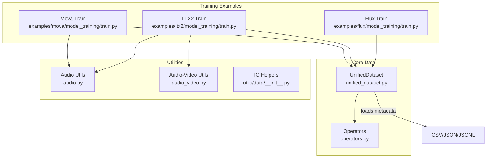
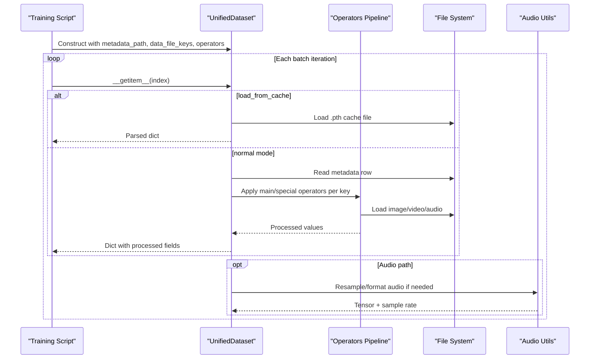
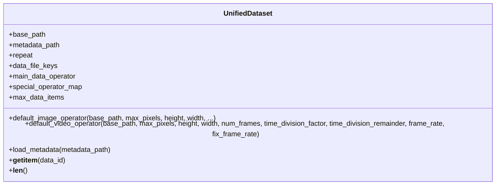
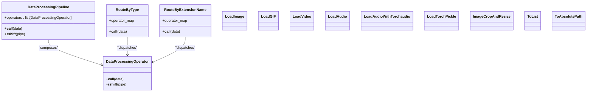
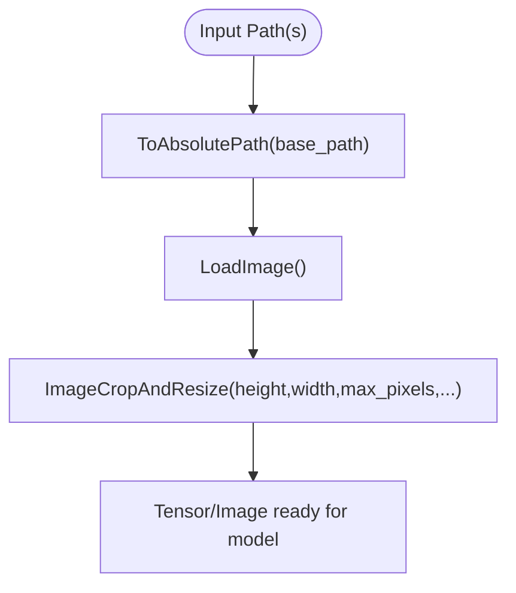
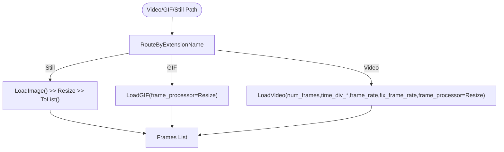
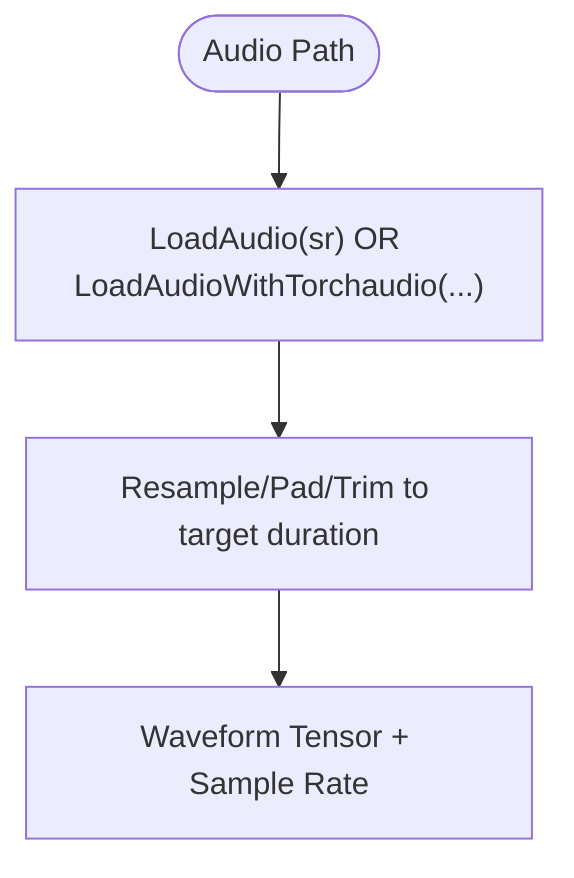
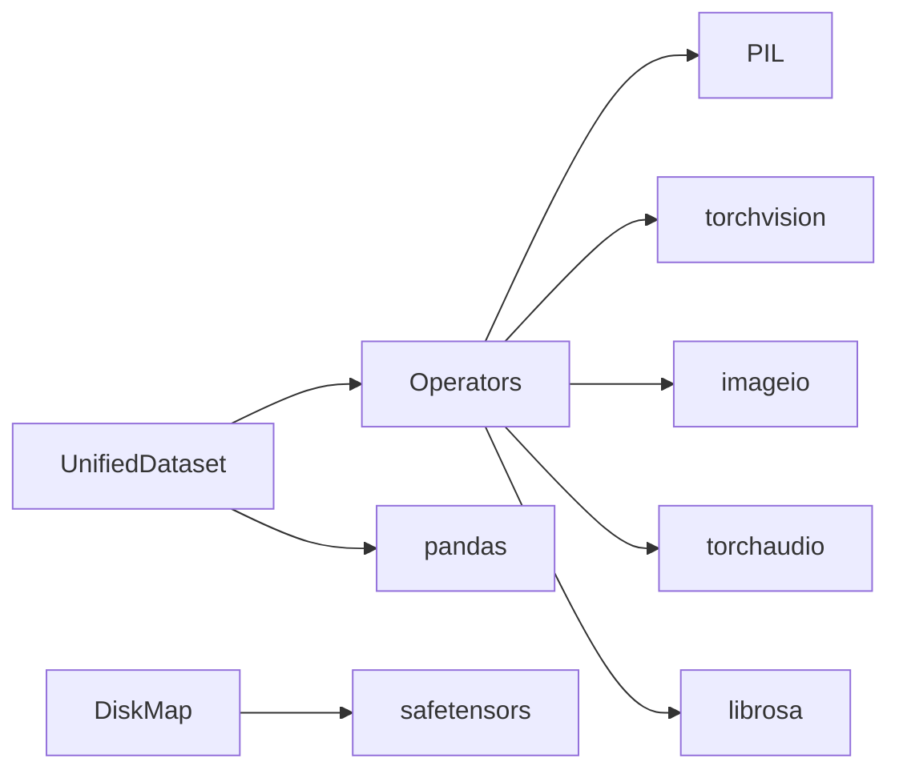

# Data Processing

<cite>
**Referenced Files in This Document**
- [unified_dataset.py](file://diffsynth/core/data/unified_dataset.py)
- [operators.py](file://diffsynth/core/data/operators.py)
- [__init__.py (core/data)](file://diffsynth/core/data/__init__.py)
- [data.md](file://docs/en/API_Reference/core/data.md)
- [train.py (flux)](file://examples/flux/model_training/train.py)
- [train.py (ltx2)](file://examples/ltx2/model_training/train.py)
- [train.py (mova)](file://examples/mova/model_training/train.py)
- [audio.py](file://diffsynth/utils/data/audio.py)
- [audio_video.py](file://diffsynth/utils/data/audio_video.py)
- [__init__.py (utils/data)](file://diffsynth/utils/data/__init__.py)
- [disk_map.py](file://diffsynth/core/vram/disk_map.py)
</cite>

## Table of Contents
1. [Introduction](#introduction)
2. [Project Structure](#project-structure)
3. [Core Components](#core-components)
4. [Architecture Overview](#architecture-overview)
5. [Detailed Component Analysis](#detailed-component-analysis)
6. [Dependency Analysis](#dependency-analysis)
7. [Performance Considerations](#performance-considerations)
8. [Troubleshooting Guide](#troubleshooting-guide)
9. [Conclusion](#conclusion)
10. [Appendices](#appendices)

## Introduction
This document explains the data processing capabilities in ODTSR-edit, focusing on the unified dataset interface and operator-based pipelines for consistent access to different data formats. It covers multi-modal handling (text, images, audio, video), examples of creating custom datasets and pipelines, batch processing strategies, memory management for large datasets, and performance optimization techniques used across training scripts.

## Project Structure
The data processing subsystem is centered around a unified dataset class and a composable set of operators. Training scripts demonstrate how to wire these components into end-to-end pipelines for image-only, video-only, and audio-video tasks.

**Diagram sources**
- [unified_dataset.py:1-119](file://diffsynth/core/data/unified_dataset.py#L1-L119)
- [operators.py:1-279](file://diffsynth/core/data/operators.py#L1-L279)
- [train.py (flux):146-159](file://examples/flux/model_training/train.py#L146-L159)
- [train.py (ltx2):121-147](file://examples/ltx2/model_training/train.py#L121-L147)
- [train.py (mova):146-179](file://examples/mova/model_training/train.py#L146-L179)

**Section sources**
- [unified_dataset.py:1-119](file://diffsynth/core/data/unified_dataset.py#L1-L119)
- [operators.py:1-279](file://diffsynth/core/data/operators.py#L1-L279)
- [data.md:1-151](file://docs/en/API_Reference/core/data.md#L1-L151)

## Core Components
- UnifiedDataset: A PyTorch Dataset that loads metadata (CSV/JSON/JSONL or cached .pth files) and applies per-field operators to produce standardized tensors or objects for training.
- Operators: A modular pipeline system using a base operator class and composition via the right-shift operator to chain transformations like loading, resizing, sampling, and routing by type or extension.
- Audio utilities: Functions for reading, resampling, converting channel layouts, and saving audio with torchcodec; also helpers to write video with synchronized audio streams.
- Low-memory IO helpers: Lightweight wrappers for videos and image folders to reduce memory pressure during preprocessing or export.

Key responsibilities:
- UnifiedDataset centralizes metadata parsing, caching behavior, and field-wise processing.
- Operators encapsulate single-step transformations and can be composed into complex pipelines.
- Utilities provide efficient I/O and format conversions for audio/video.

**Section sources**
- [unified_dataset.py:5-26](file://diffsynth/core/data/unified_dataset.py#L5-L26)
- [operators.py:8-31](file://diffsynth/core/data/operators.py#L8-L31)
- [audio.py:55-87](file://diffsynth/utils/data/audio.py#L55-L87)
- [audio_video.py:79-135](file://diffsynth/utils/data/audio_video.py#L79-L135)
- [__init__.py (utils/data):9-131](file://diffsynth/utils/data/__init__.py#L9-L131)

## Architecture Overview
At runtime, a training script constructs a UnifiedDataset with a main_data_operator and optional special_operator_map. The dataset’s __getitem__ resolves paths, applies operators, and returns a dict ready for the model. For audio-video tasks, specialized operators handle frame-rate alignment and tensor formatting.

**Diagram sources**
- [unified_dataset.py:89-110](file://diffsynth/core/data/unified_dataset.py#L89-L110)
- [operators.py:149-168](file://diffsynth/core/data/operators.py#L149-L168)
- [audio.py:55-87](file://diffsynth/utils/data/audio.py#L55-L87)

## Detailed Component Analysis

### UnifiedDataset
Responsibilities:
- Parse metadata from CSV/JSON/JSONL or discover cached .pth files when no metadata is provided.
- Repeat samples to control epoch length.
- Apply per-key operators: either a main_data_operator or a special_operator_map entry.
- Provide default image and video operators for common use cases.

Key behaviors:
- Default image operator supports both single images and lists of images, applying absolute path resolution, loading, and crop/resize with divisibility constraints.
- Default video operator routes by file extension (still frames, GIFs, or video containers) and applies frame sampling and per-frame processing.

**Diagram sources**
- [unified_dataset.py:5-119](file://diffsynth/core/data/unified_dataset.py#L5-L119)

**Section sources**
- [unified_dataset.py:28-61](file://diffsynth/core/data/unified_dataset.py#L28-L61)
- [unified_dataset.py:70-88](file://diffsynth/core/data/unified_dataset.py#L70-L88)
- [unified_dataset.py:89-110](file://diffsynth/core/data/unified_dataset.py#L89-L110)

### Operators and Pipelines
Design:
- Base operator defines a callable interface and supports chaining via >>.
- DataProcessingPipeline executes a sequence of operators.
- Routing operators enable conditional processing based on data type or file extension.
- Media loaders include LoadImage, LoadGIF, LoadVideo, LoadAudio, LoadAudioWithTorchaudio, and LoadTorchPickle.
- ImageCropAndResize enforces target dimensions and divisibility factors.

**Diagram sources**
- [operators.py:8-31](file://diffsynth/core/data/operators.py#L8-L31)
- [operators.py:209-229](file://diffsynth/core/data/operators.py#L209-L229)
- [operators.py:57-102](file://diffsynth/core/data/operators.py#L57-L102)
- [operators.py:149-168](file://diffsynth/core/data/operators.py#L149-L168)
- [operators.py:179-206](file://diffsynth/core/data/operators.py#L179-L206)
- [operators.py:248-279](file://diffsynth/core/data/operators.py#L248-L279)

**Section sources**
- [operators.py:8-31](file://diffsynth/core/data/operators.py#L8-L31)
- [operators.py:57-102](file://diffsynth/core/data/operators.py#L57-L102)
- [operators.py:149-168](file://diffsynth/core/data/operators.py#L149-L168)
- [operators.py:179-206](file://diffsynth/core/data/operators.py#L179-L206)
- [operators.py:209-229](file://diffsynth/core/data/operators.py#L209-L229)
- [operators.py:248-279](file://diffsynth/core/data/operators.py#L248-L279)

### Multi-modal Data Handling

#### Images
- Default image operator handles single images and lists of images, applying absolute path resolution, loading, and crop/resize with divisibility constraints.
- Suitable for text-to-image and image editing tasks.

**Diagram sources**
- [unified_dataset.py:28-37](file://diffsynth/core/data/unified_dataset.py#L28-L37)
- [operators.py:57-102](file://diffsynth/core/data/operators.py#L57-L102)

#### Videos
- Default video operator routes by extension: still images treated as single-frame sequences, GIFs loaded frame-by-frame, and video containers sampled according to time_division parameters and optional fixed frame rate.
- Frame processor applies per-frame resize/crop.

**Diagram sources**
- [unified_dataset.py:40-61](file://diffsynth/core/data/unified_dataset.py#L40-L61)
- [operators.py:149-168](file://diffsynth/core/data/operators.py#L149-L168)
- [operators.py:179-206](file://diffsynth/core/data/operators.py#L179-L206)

#### Audio
- LoadAudio uses librosa to read and resample to a target sample rate.
- LoadAudioWithTorchaudio integrates frame-rate aligned sampling similar to video, returning waveform tensors padded/truncated to match desired duration.
- Additional utilities support reading/resampling with torchcodec and writing synchronized audio-video files.

**Diagram sources**
- [operators.py:248-279](file://diffsynth/core/data/operators.py#L248-L279)
- [audio.py:55-87](file://diffsynth/utils/data/audio.py#L55-L87)
- [audio_video.py:79-135](file://diffsynth/utils/data/audio_video.py#L79-L135)

**Section sources**
- [unified_dataset.py:40-61](file://diffsynth/core/data/unified_dataset.py#L40-L61)
- [operators.py:149-168](file://diffsynth/core/data/operators.py#L149-L168)
- [operators.py:248-279](file://diffsynth/core/data/operators.py#L248-L279)
- [audio.py:55-87](file://diffsynth/utils/data/audio.py#L55-L87)
- [audio_video.py:79-135](file://diffsynth/utils/data/audio_video.py#L79-L135)

### Creating Custom Datasets and Pipelines
- Define a main_data_operator using the >> syntax to chain operators for your primary modality.
- Use special_operator_map to override processing for specific keys (e.g., input_audio, in_context_videos).
- Configure repeat and max_data_items to control dataset length and epoch behavior.

Examples:
- Image-only training: construct UnifiedDataset with default_image_operator and data_file_keys=["image"].
- Video+audio training: combine default_video_operator with LoadAudioWithTorchaudio for synchronized modalities.

**Section sources**
- [train.py (flux):146-159](file://examples/flux/model_training/train.py#L146-L159)
- [train.py (ltx2):121-147](file://examples/ltx2/model_training/train.py#L121-L147)
- [train.py (mova):146-179](file://examples/mova/model_training/train.py#L146-L179)

### Batch Processing and Memory Management
- UnifiedDataset yields one sample per call; batching is handled by DataLoader outside this module.
- For very large datasets, consider:
  - Using JSONL or CSV metadata to avoid loading entire JSON into memory.
  - Enabling cache mode (no metadata_path) to iterate over precomputed .pth files via LoadTorchPickle.
  - Adjusting repeat to balance epoch length without inflating dataset size excessively.
- VRAM management for models is separate but complements data throughput; DiskMap buffers and flushes state dicts to avoid excessive memory usage.

**Section sources**
- [unified_dataset.py:70-88](file://diffsynth/core/data/unified_dataset.py#L70-L88)
- [unified_dataset.py:89-110](file://diffsynth/core/data/unified_dataset.py#L89-L110)
- [disk_map.py:28-71](file://diffsynth/core/vram/disk_map.py#L28-L71)

## Dependency Analysis
The core data module depends on standard libraries and media backends:
- PIL, torchvision for images.
- imageio for video/GIF reading.
- torchaudio/librosa/torchcodec for audio.
- pandas for CSV parsing.
- safetensors for efficient model weight loading (in VRAM utilities).

**Diagram sources**
- [operators.py:1-5](file://diffsynth/core/data/operators.py#L1-L5)
- [unified_dataset.py:1-3](file://diffsynth/core/data/unified_dataset.py#L1-L3)
- [disk_map.py:1-2](file://diffsynth/core/vram/disk_map.py#L1-L2)

**Section sources**
- [operators.py:1-5](file://diffsynth/core/data/operators.py#L1-L5)
- [unified_dataset.py:1-3](file://diffsynth/core/data/unified_dataset.py#L1-L3)
- [disk_map.py:1-2](file://diffsynth/core/vram/disk_map.py#L1-L2)

## Performance Considerations
- Metadata format selection:
  - Prefer CSV or JSONL for large datasets to minimize memory overhead.
  - Use JSON only when list fields are required and dataset size is manageable.
- Caching:
  - When metadata_path is None, the dataset scans for .pth cache files and loads them via LoadTorchPickle, reducing I/O and parsing costs.
- Frame sampling:
  - tune num_frames, time_division_factor, and time_division_remainder to align with model patchifier requirements and avoid unnecessary decoding.
- Image sizing:
  - Set height_division_factor and width_division_factor to match model stride constraints (commonly 16 or 32).
- Audio synchronization:
  - Use fix_frame_rate and matching time_division parameters to ensure audio duration aligns with video frames.
- Large dataset scaling:
  - Avoid extremely large repeat values; beyond ~10^9 total items, dataset speed may degrade due to framework-level issues.

**Section sources**
- [data.md:124-151](file://docs/en/API_Reference/core/data.md#L124-L151)
- [unified_dataset.py:70-88](file://diffsynth/core/data/unified_dataset.py#L70-L88)
- [operators.py:110-147](file://diffsynth/core/data/operators.py#L110-L147)

## Troubleshooting Guide
Common issues and resolutions:
- Unsupported file extension:
  - Ensure RouteByExtensionName includes all relevant extensions or add new mappings.
- Audio loading failures:
  - LoadAudioWithTorchaudio warns and returns None on failure; verify file integrity and backend availability.
- Memory spikes:
  - Switch to JSONL metadata, enable cache mode, or reduce repeat.
- Slow dataset at scale:
  - Keep total items under ~10^9; consider sharding datasets or precomputing caches.

**Section sources**
- [operators.py:209-218](file://diffsynth/core/data/operators.py#L209-L218)
- [operators.py:276-279](file://diffsynth/core/data/operators.py#L276-L279)
- [data.md:124-151](file://docs/en/API_Reference/core/data.md#L124-L151)

## Conclusion
ODTSR-edit provides a flexible, operator-driven data processing system built around a unified dataset interface. By composing simple operators into robust pipelines, users can handle images, videos, and audio consistently across modalities. With careful configuration of metadata formats, frame sampling, and caching, it achieves efficient data loading and scalable training workflows.

## Appendices

### Example Usage Patterns
- Image-only training:
  - Use default_image_operator and set data_file_keys=["image"].
- Video+audio training:
  - Combine default_video_operator with LoadAudioWithTorchaudio; align time_division and frame_rate.
- Specialized fields:
  - Override via special_operator_map for keys requiring distinct processing (e.g., fixed-resolution face videos).

**Section sources**
- [train.py (flux):146-159](file://examples/flux/model_training/train.py#L146-L159)
- [train.py (ltx2):121-147](file://examples/ltx2/model_training/train.py#L121-L147)
- [train.py (mova):146-179](file://examples/mova/model_training/train.py#L146-L179)