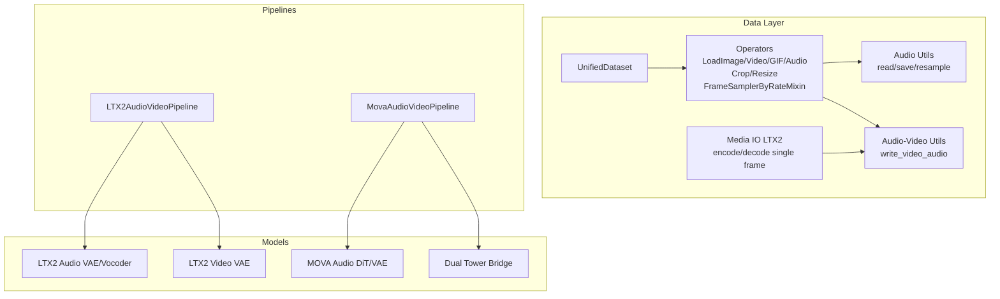
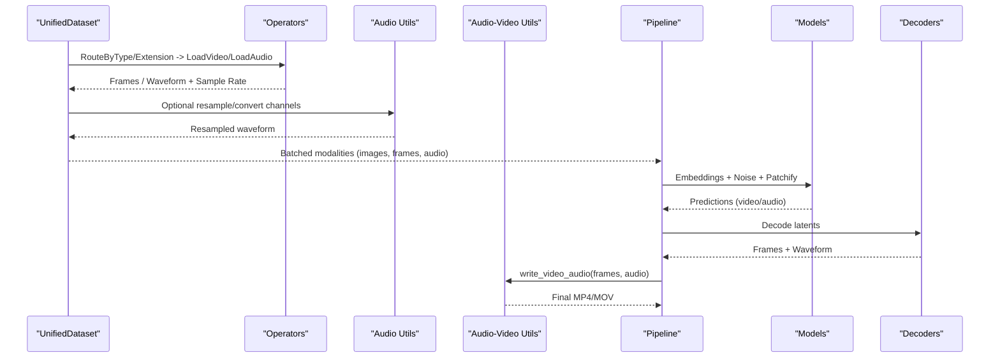
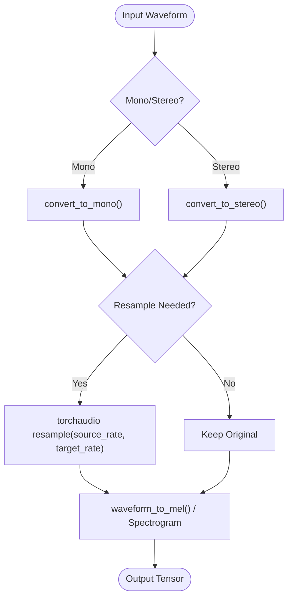
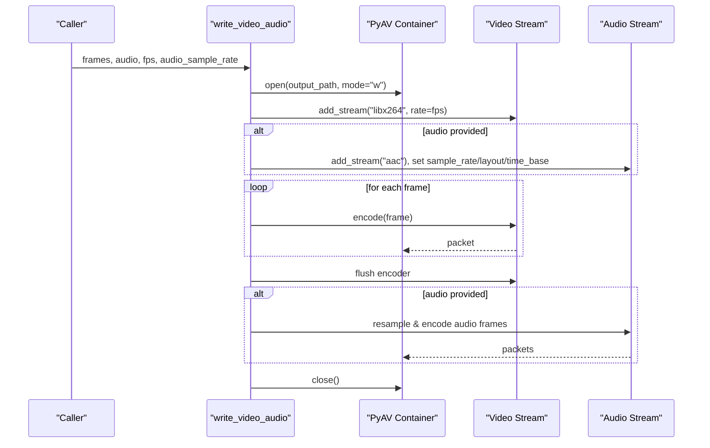
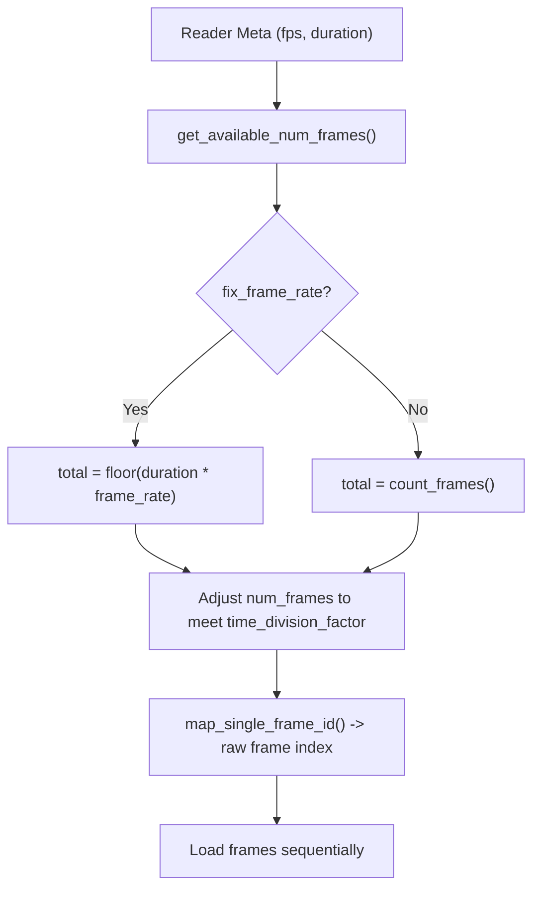
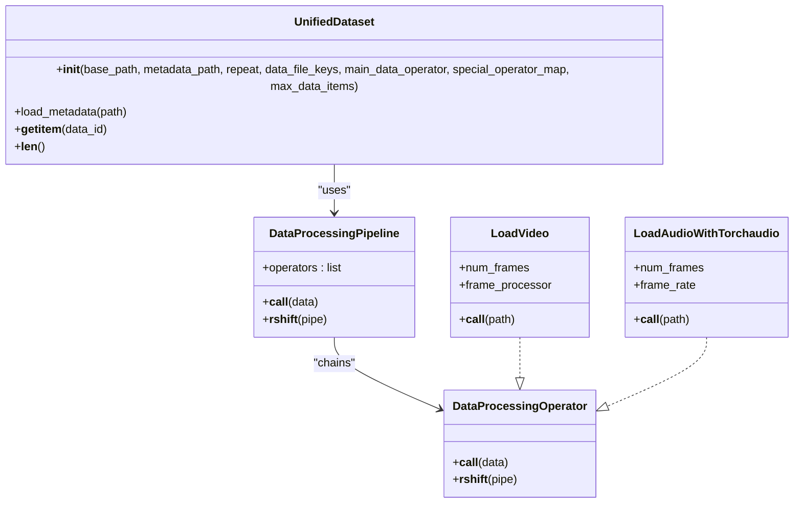
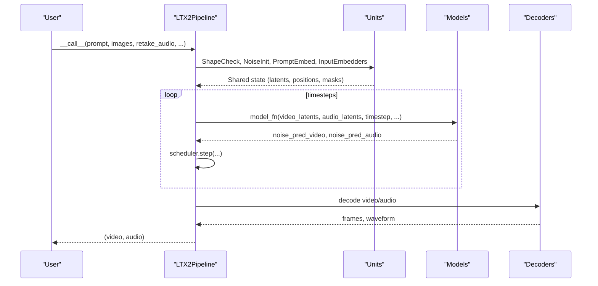
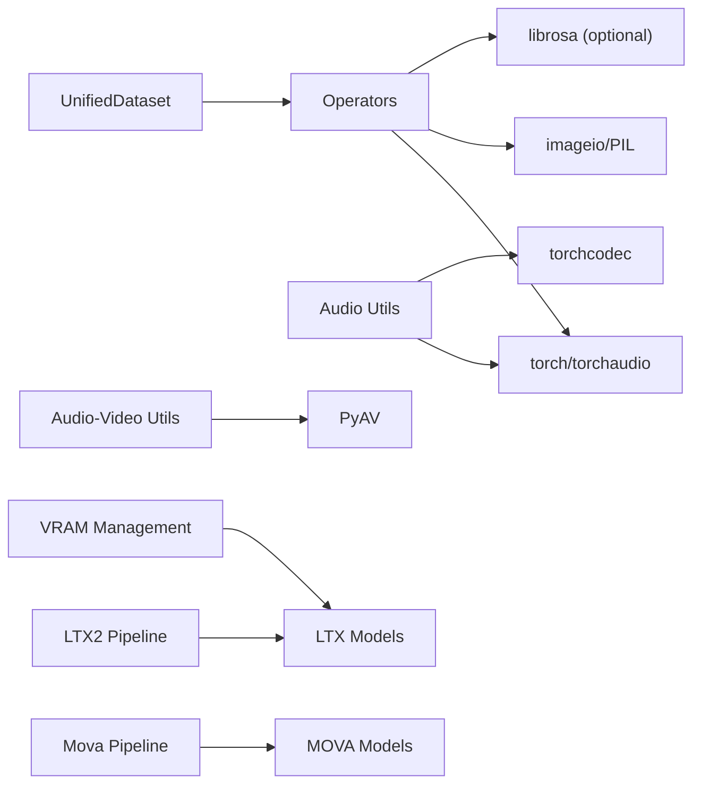

# Multi-modal Data Handling

<cite>
**Referenced Files in This Document**
- [audio.py](file://diffsynth/utils/data/audio.py)
- [audio_video.py](file://diffsynth/utils/data/audio_video.py)
- [operators.py](file://diffsynth/core/data/operators.py)
- [unified_dataset.py](file://diffsynth/core/data/unified_dataset.py)
- [media_io_ltx2.py](file://diffsynth/utils/data/media_io_ltx2.py)
- [ltx2_audio_vae.py](file://diffsynth/models/ltx2_audio_vae.py)
- [ltx2_audio_video.py](file://diffsynth/pipelines/ltx2_audio_video.py)
- [mova_audio_video.py](file://diffsynth/pipelines/mova_audio_video.py)
- [layers.py](file://diffsynth/core/vram/layers.py)
</cite>

## Table of Contents
1. Introduction
2. Project Structure
3. Core Components
4. Architecture Overview
5. Detailed Component Analysis
6. Dependency Analysis
7. Performance Considerations
8. Troubleshooting Guide
9. Conclusion

## Introduction
This document explains how ODTSR-edit handles multi-modal data (text, images, audio, video) through unified interfaces and pipelines. It focuses on:
- Unified data loading and processing for text, images, audio, and video
- Audio utilities: waveform manipulation, sample rate conversion, and feature extraction
- Audio-video synchronization, frame sampling strategies, and temporal alignment
- Building multi-modal data pipelines, handling different file formats, and optimizing I/O for large datasets
- Memory management and performance considerations for real-time processing

## Project Structure
The multi-modal stack is organized into:
- Data operators and dataset abstractions for unified loading and preprocessing
- Audio and audio-video utilities for reading/writing media and resampling
- Pipelines that orchestrate models for text, image, audio, and video with consistent interfaces
- VRAM management utilities to control memory usage during inference/training

**Diagram sources**
- [unified_dataset.py:1-119](file://diffsynth/core/data/unified_dataset.py#L1-L119)
- [operators.py:1-279](file://diffsynth/core/data/operators.py#L1-L279)
- [audio.py:1-109](file://diffsynth/utils/data/audio.py#L1-L109)
- [audio_video.py:1-135](file://diffsynth/utils/data/audio_video.py#L1-L135)
- [media_io_ltx2.py:1-44](file://diffsynth/utils/data/media_io_ltx2.py#L1-L44)
- [ltx2_audio_video.py:1-732](file://diffsynth/pipelines/ltx2_audio_video.py#L1-L732)
- [mova_audio_video.py:1-462](file://diffsynth/pipelines/mova_audio_video.py#L1-L462)
- [ltx2_audio_vae.py:40-64](file://diffsynth/models/ltx2_audio_vae.py#L40-L64)

**Section sources**
- [unified_dataset.py:1-119](file://diffsynth/core/data/unified_dataset.py#L1-L119)
- [operators.py:1-279](file://diffsynth/core/data/operators.py#L1-L279)
- [audio.py:1-109](file://diffsynth/utils/data/audio.py#L1-L109)
- [audio_video.py:1-135](file://diffsynth/utils/data/audio_video.py#L1-L135)
- [media_io_ltx2.py:1-44](file://diffsynth/utils/data/media_io_ltx2.py#L1-L44)

## Core Components
- UnifiedDataset: A PyTorch Dataset that composes a main operator pipeline and optional special operators per key, supporting metadata-driven or cached data loading.
- Operators: A functional pipeline framework using the >> operator to chain transformations like LoadImage, LoadVideo, LoadGIF, LoadAudioWithTorchaudio, ImageCropAndResize, FrameSamplerByRateMixin, and routing by type/extension.
- Audio Utilities: High-performance read/write via torchcodec, resampling, mono/stereo conversion, and saving back to files.
- Audio-Video Utilities: Writing synchronized audio and video streams using PyAV, including resampling and muxing AAC audio.
- Media IO LTX2: Single-frame encode/decode helpers for normalization-like operations.
- Pipelines: LTX2AudioVideoPipeline and MovaAudioVideoPipeline provide unified APIs for multi-modal generation with consistent shape checks, noise initialization, embedders, and denoising stages.

**Section sources**
- [unified_dataset.py:1-119](file://diffsynth/core/data/unified_dataset.py#L1-L119)
- [operators.py:1-279](file://diffsynth/core/data/operators.py#L1-L279)
- [audio.py:1-109](file://diffsynth/utils/data/audio.py#L1-L109)
- [audio_video.py:1-135](file://diffsynth/utils/data/audio_video.py#L1-L135)
- [media_io_ltx2.py:1-44](file://diffsynth/utils/data/media_io_ltx2.py#L1-L44)

## Architecture Overview
Multi-modal data flows from disk to model-ready tensors through a layered architecture:
- Data layer: UnifiedDataset routes inputs to typed operators; videos are sampled at fixed rates; audio is loaded and optionally resampled.
- Processing layer: Pipelines perform shape checks, prompt embedding, noise initialization, and modality-specific embedders (video/audio/image).
- Model layer: Diffusion models process aligned video and audio latents with cross-modal bridges when needed.
- Output layer: Decoders reconstruct frames and waveforms; audio-video muxing produces final media.

**Diagram sources**
- [unified_dataset.py:1-119](file://diffsynth/core/data/unified_dataset.py#L1-L119)
- [operators.py:1-279](file://diffsynth/core/data/operators.py#L1-L279)
- [audio.py:1-109](file://diffsynth/utils/data/audio.py#L1-L109)
- [audio_video.py:1-135](file://diffsynth/utils/data/audio_video.py#L1-L135)
- [ltx2_audio_video.py:1-732](file://diffsynth/pipelines/ltx2_audio_video.py#L1-L732)
- [mova_audio_video.py:1-462](file://diffsynth/pipelines/mova_audio_video.py#L1-L462)

## Detailed Component Analysis

### Audio Processing Utilities
- Channel conversion:
  - Mono/stereo conversion functions support both [C, T] and [B, C, T] shapes.
- Resampling:
  - Uses torchaudio.functional.resample to convert between sample rates efficiently.
- Reading/Writing:
  - read_audio uses torchcodec backend for fast decoding with start_time/duration slicing.
  - save_audio encodes back to file via torchcodec encoder.
- Feature extraction:
  - LTX2 audio processor converts waveform to log-mel spectrogram after resampling to target sample rate.
  - Magnitude and phase spectrograms can be computed with causal padding for real-time compatibility.

**Diagram sources**
- [audio.py:5-28](file://diffsynth/utils/data/audio.py#L5-L28)
- [audio.py:31-87](file://diffsynth/utils/data/audio.py#L31-L87)
- [ltx2_audio_vae.py:40-64](file://diffsynth/models/ltx2_audio_vae.py#L40-L64)

**Section sources**
- [audio.py:1-109](file://diffsynth/utils/data/audio.py#L1-L109)
- [ltx2_audio_vae.py:40-64](file://diffsynth/models/ltx2_audio_vae.py#L40-L64)

### Audio-Video Synchronization and Writing
- write_video_audio:
  - Accepts list of PIL frames and an audio tensor; infers or requires audio_sample_rate.
  - Creates video stream (libx264) and audio stream (AAC), resamples audio to encoder format/layout/rate, and muxes packets.
- _resample_audio:
  - Uses av.audio.resampler to match target format/layout/rate; flushes encoder properly.
- _prepare_audio_stream:
  - Selects best supported sample rate if necessary; sets stereo layout and time_base.

**Diagram sources**
- [audio_video.py:79-135](file://diffsynth/utils/data/audio_video.py#L79-L135)

**Section sources**
- [audio_video.py:1-135](file://diffsynth/utils/data/audio_video.py#L1-L135)

### Frame Sampling Strategies and Temporal Alignment
- FrameSamplerByRateMixin:
  - Computes available frames based on duration and target frame_rate; adjusts num_frames to satisfy time_division_factor constraints.
  - Maps logical frame indices to raw frame IDs ensuring temporal alignment across varying source frame rates.
- LoadVideo:
  - Uses the mixin to select frames consistently according to desired frame_rate and total duration.
- LTX2 and MOVA pipelines:
  - Generate positions normalized by frame_rate for temporal consistency; patchifiers align audio and video tokens temporally.

**Diagram sources**
- [operators.py:110-168](file://diffsynth/core/data/operators.py#L110-L168)

**Section sources**
- [operators.py:110-168](file://diffsynth/core/data/operators.py#L110-L168)
- [ltx2_audio_video.py:330-361](file://diffsynth/pipelines/ltx2_audio_video.py#L330-L361)
- [mova_audio_video.py:212-227](file://diffsynth/pipelines/mova_audio_video.py#L212-L227)

### Unified Dataset and Operator Pipelines
- UnifiedDataset:
  - Loads metadata (JSON/JSONL/CSV) or discovers cached .pth files.
  - Applies main_data_operator to specified keys; supports special_operator_map for custom loaders (e.g., audio).
- Operators:
  - RouteByType and RouteByExtensionName dispatch to appropriate loaders.
  - LoadVideo and LoadGIF handle frame selection and resizing; LoadAudioWithTorchaudio aligns durations to target frames.

**Diagram sources**
- [unified_dataset.py:1-119](file://diffsynth/core/data/unified_dataset.py#L1-L119)
- [operators.py:1-279](file://diffsynth/core/data/operators.py#L1-L279)

**Section sources**
- [unified_dataset.py:1-119](file://diffsynth/core/data/unified_dataset.py#L1-L119)
- [operators.py:1-279](file://diffsynth/core/data/operators.py#L1-L279)

### Pipeline Examples: LTX2 and MOVA
- LTX2AudioVideoPipeline:
  - Units include shape checking, noise initialization, prompt embedding, input video/audio embedders, reference/in-context conditioning, stage switching, and latent upsampling.
  - Denoising iterates over timesteps, updating both video and audio latents; decodes to frames and waveform.
- MovaAudioVideoPipeline:
  - Two-stage DiTs for video; audio DiT and dual-tower bridge align modalities; optional unified sequence parallelism.
  - Input audio is converted to mono and resampled to VAE sample rate before encoding.

**Diagram sources**
- [ltx2_audio_video.py:149-249](file://diffsynth/pipelines/ltx2_audio_video.py#L149-L249)
- [mova_audio_video.py:114-197](file://diffsynth/pipelines/mova_audio_video.py#L114-L197)

**Section sources**
- [ltx2_audio_video.py:1-732](file://diffsynth/pipelines/ltx2_audio_video.py#L1-L732)
- [mova_audio_video.py:1-462](file://diffsynth/pipelines/mova_audio_video.py#L1-L462)

## Dependency Analysis
Key dependencies and relationships:
- UnifiedDataset depends on operators for data transformation and routing.
- Pipelines depend on model components (VAEs, DiTs, text encoders) and utilities for audio/video processing.
- Audio utilities rely on torchaudio and torchcodec; audio-video writing relies on PyAV.
- VRAM management wraps modules to enable lazy loading and disk offloading.

**Diagram sources**
- [unified_dataset.py:1-119](file://diffsynth/core/data/unified_dataset.py#L1-L119)
- [operators.py:1-279](file://diffsynth/core/data/operators.py#L1-L279)
- [audio.py:1-109](file://diffsynth/utils/data/audio.py#L1-L109)
- [audio_video.py:1-135](file://diffsynth/utils/data/audio_video.py#L1-L135)
- [ltx2_audio_video.py:1-732](file://diffsynth/pipelines/ltx2_audio_video.py#L1-L732)
- [mova_audio_video.py:1-462](file://diffsynth/pipelines/mova_audio_video.py#L1-L462)
- [layers.py:439-479](file://diffsynth/core/vram/layers.py#L439-L479)

**Section sources**
- [layers.py:439-479](file://diffsynth/core/vram/layers.py#L439-L479)

## Performance Considerations
- I/O Optimization:
  - Use torchcodec for high-speed audio decoding with seek-based slicing (start_time/duration).
  - Prefer batched reads and avoid unnecessary conversions; keep tensors on device where possible.
- Frame Sampling:
  - Fix frame_rate to ensure consistent temporal alignment; adjust num_frames to satisfy time_division_factor constraints.
- Memory Management:
  - VRAM management enables lazy loading of parameters and disk offloading for layers; use SSDs for disk offload.
  - Enable gradient checkpointing in pipelines to reduce peak memory during training/inference.
- Real-Time Processing:
  - Causal spectrogram computation avoids lookahead; choose efficient resampling and minimal intermediate allocations.
  - For large datasets, cache processed items as .pth and load via LoadTorchPickle to reduce repeated I/O.

[No sources needed since this section provides general guidance]

## Troubleshooting Guide
Common issues and resolutions:
- Unsupported audio backend:
  - Ensure backend is "torchcodec"; other backends raise errors.
- Missing audio_sample_rate:
  - When providing audio to write_video_audio, either pass audio_sample_rate explicitly or ensure it can be inferred from audio length and video duration.
- Inconsistent frame counts:
  - If fix_frame_rate=True, ensure num_frames satisfies time_division_factor; otherwise, adjust target frame_rate or disable fixing.
- VRAM exhaustion:
  - Enable VRAM management; consider disk offload and gradient checkpointing; reduce tile sizes and batch sizes.

**Section sources**
- [audio.py:78-87](file://diffsynth/utils/data/audio.py#L78-L87)
- [audio_video.py:106-135](file://diffsynth/utils/data/audio_video.py#L106-L135)
- [operators.py:130-146](file://diffsynth/core/data/operators.py#L130-L146)
- [layers.py:439-479](file://diffsynth/core/vram/layers.py#L439-L479)

## Conclusion
ODTSR-edit provides a robust, modular framework for multi-modal data handling:
- UnifiedDataset and operators create flexible, composable pipelines for text, images, audio, and video.
- Audio utilities offer efficient waveform manipulation, resampling, and feature extraction.
- Pipelines integrate modalities with precise temporal alignment and synchronized audio-video output.
- VRAM management and caching strategies enable scalable processing for large datasets and real-time scenarios.

[No sources needed since this section summarizes without analyzing specific files]