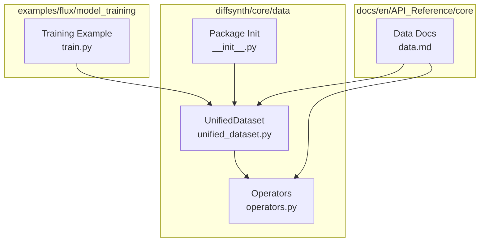
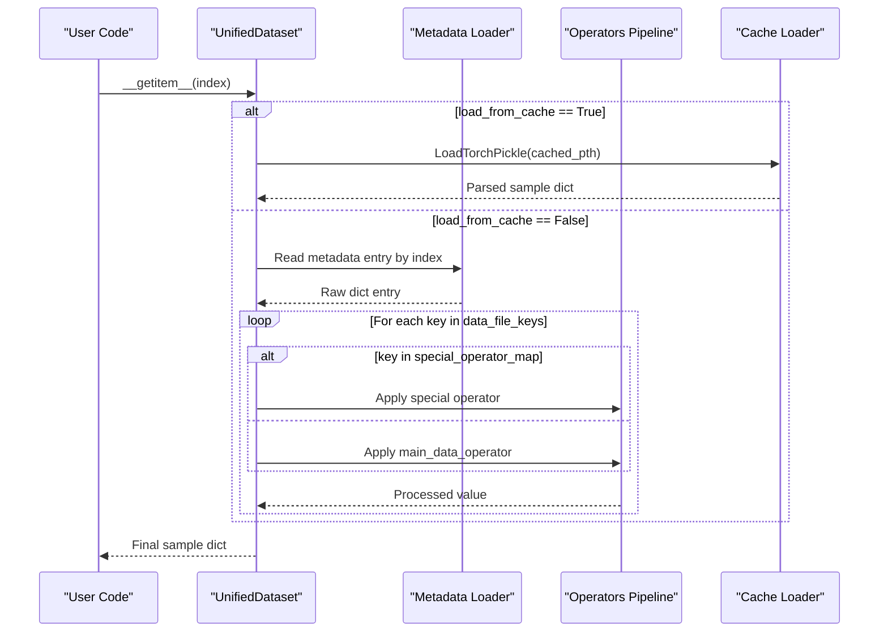
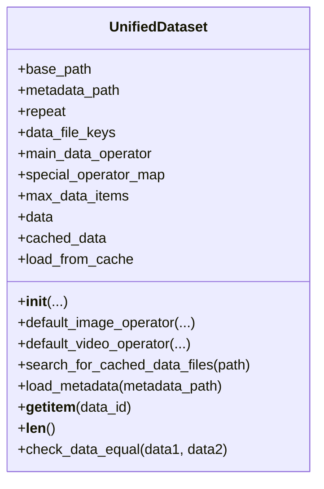
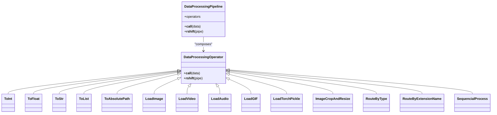
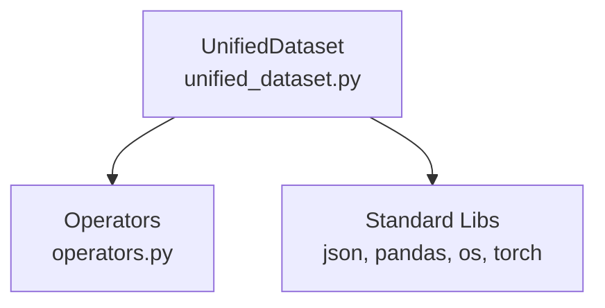

# Unified Dataset Interface

<cite>
**Referenced Files in This Document**
- [unified_dataset.py](file://diffsynth/core/data/unified_dataset.py)
- [operators.py](file://diffsynth/core/data/operators.py)
- [__init__.py](file://diffsynth/core/data/__init__.py)
- [data.md](file://docs/en/API_Reference/core/data.md)
- [train.py](file://examples/flux/model_training/train.py)
- [audio.py](file://diffsynth/utils/data/audio.py)
- [utils_data_init.py](file://diffsynth/utils/data/__init__.py)
</cite>

## Table of Contents
1. [Introduction](#introduction)
2. [Project Structure](#project-structure)
3. [Core Components](#core-components)
4. [Architecture Overview](#architecture-overview)
5. [Detailed Component Analysis](#detailed-component-analysis)
6. [Dependency Analysis](#dependency-analysis)
7. [Performance Considerations](#performance-considerations)
8. [Troubleshooting Guide](#troubleshooting-guide)
9. [Conclusion](#conclusion)
10. [Appendices](#appendices)

## Introduction
This document explains the unified dataset interface in ODTSR-edit, centered on the UnifiedDataset class and its operator-based data pipeline system. It covers how a consistent API abstracts different data formats and sources, how metadata is loaded, how data loading and processing pipelines are composed, and how to integrate with PyTorch DataLoader for batched training. It also provides guidance on memory management, caching strategies, performance optimization, dataset composition, augmentation patterns, and multi-modal handling.

## Project Structure
The unified dataset functionality lives under diffsynth.core.data:
- UnifiedDataset implementation and default operators
- A rich set of DataProcessingOperator classes for composing pipelines
- A convenience export of UnifiedDataset from the package init
- Documentation describing usage and metadata formats
- Example training script demonstrating instantiation and integration

**Diagram sources**
- [unified_dataset.py:1-119](file://diffsynth/core/data/unified_dataset.py#L1-L119)
- [operators.py:1-279](file://diffsynth/core/data/operators.py#L1-L279)
- [__init__.py:1-2](file://diffsynth/core/data/__init__.py#L1-L2)
- [data.md:1-151](file://docs/en/API_Reference/core/data.md#L1-L151)
- [train.py:146-159](file://examples/flux/model_training/train.py#L146-L159)

**Section sources**
- [unified_dataset.py:1-119](file://diffsynth/core/data/unified_dataset.py#L1-L119)
- [operators.py:1-279](file://diffsynth/core/data/operators.py#L1-L279)
- [__init__.py:1-2](file://diffsynth/core/data/__init__.py#L1-L2)
- [data.md:1-151](file://docs/en/API_Reference/core/data.md#L1-L151)
- [train.py:146-159](file://examples/flux/model_training/train.py#L146-L159)

## Core Components
- UnifiedDataset: A torch.utils.data.Dataset that loads metadata (CSV/JSON/JSONL), applies per-field operators, supports cached .pth files, and exposes __getitem__/__len__.
- Operators: Composable building blocks for data transformations, including file loaders (image/video/audio/GIF), routing by type or extension, resizing/cropping, and sequence processing.
- Default operators: UnifiedDataset.default_image_operator and default_video_operator provide ready-to-use pipelines for common media types.

Key responsibilities:
- Metadata parsing and selection (CSV/JSON/JSONL)
- Field-specific processing via main_data_operator and special_operator_map
- Optional cache mode scanning for .pth files and loading via LoadTorchPickle
- Length control via repeat and max_data_items

**Section sources**
- [unified_dataset.py:5-119](file://diffsynth/core/data/unified_dataset.py#L5-L119)
- [operators.py:8-279](file://diffsynth/core/data/operators.py#L8-L279)
- [data.md:79-151](file://docs/en/API_Reference/core/data.md#L79-L151)

## Architecture Overview
UnifiedDataset composes a flexible data pipeline using operators. The flow is:
- Initialize with base_path, metadata_path, repeat, data_file_keys, main_data_operator, optional special_operator_map, and max_data_items.
- On __getitem__, either load from cached .pth files or read metadata entries.
- For each key in data_file_keys, apply main_data_operator unless overridden by special_operator_map.
- Return a dict-like sample suitable for downstream model input.

**Diagram sources**
- [unified_dataset.py:62-119](file://diffsynth/core/data/unified_dataset.py#L62-L119)
- [operators.py:8-279](file://diffsynth/core/data/operators.py#L8-L279)

**Section sources**
- [unified_dataset.py:62-119](file://diffsynth/core/data/unified_dataset.py#L62-L119)

## Detailed Component Analysis

### UnifiedDataset Class
- Initialization parameters:
  - base_path: Root directory for resolving relative paths
  - metadata_path: Path to CSV/JSON/JSONL metadata; if None, scans base_path for .pth cache files
  - repeat: Multiplies dataset length for epoch control
  - data_file_keys: Keys to process through main_data_operator
  - main_data_operator: Primary operator pipeline applied to keys in data_file_keys
  - special_operator_map: Per-key overrides for custom processing
  - max_data_items: Optional cap on dataset length
- Caching behavior:
  - When metadata_path is None, recursively searches base_path for .pth files and uses LoadTorchPickle to deserialize samples
- __getitem__ logic:
  - If loading from cache: pick cached .pth path and load via LoadTorchPickle
  - Else: copy metadata entry and apply operators per key
- __len__ logic:
  - Returns min(max_data_items, len(data)*repeat) or cached count * repeat when applicable

**Diagram sources**
- [unified_dataset.py:5-119](file://diffsynth/core/data/unified_dataset.py#L5-L119)

**Section sources**
- [unified_dataset.py:5-119](file://diffsynth/core/data/unified_dataset.py#L5-L119)

### Data Processing Operators
Operators form composable pipelines using the >> operator. Key categories:
- Format conversion: ToInt, ToFloat, ToStr, ToList, ToAbsolutePath
- File loaders: LoadImage, LoadVideo, LoadAudio, LoadGIF, LoadTorchPickle
- Media processing: ImageCropAndResize
- Routing and sequencing: RouteByType, RouteByExtensionName, SequencialProcess

Default image/video operators demonstrate typical compositions:
- default_image_operator: Handles str and list inputs, resolves absolute paths, loads images, resizes/crops, and optionally wraps into lists
- default_video_operator: Routes by file extension to appropriate loaders, applies frame-level processors, and normalizes frame counts

**Diagram sources**
- [operators.py:8-279](file://diffsynth/core/data/operators.py#L8-L279)

**Section sources**
- [operators.py:8-279](file://diffsynth/core/data/operators.py#L8-L279)

### Metadata Loading and Formats
Supported formats:
- CSV: High readability, no list support, low memory footprint
- JSON: High readability, supports lists, higher memory usage
- JSONL: Lower readability, supports lists, streaming-friendly

Selection guidance:
- Use CSV/JSONL for very large datasets to reduce memory overhead
- Use JSON/JSONL when list fields are required (e.g., multiple images per sample)

**Section sources**
- [data.md:90-128](file://docs/en/API_Reference/core/data.md#L90-L128)

### Integration with PyTorch DataLoader
UnifiedDataset implements torch.utils.data.Dataset, so it integrates directly with DataLoader for batching, shuffling, and parallel loading.

Example usage pattern:
- Instantiate UnifiedDataset with base_path, metadata_path, repeat, data_file_keys, and a main_data_operator (often default_image_operator)
- Wrap with DataLoader for batched iteration during training

Reference example:
- See training script where UnifiedDataset is constructed and passed to training launchers

**Section sources**
- [train.py:146-159](file://examples/flux/model_training/train.py#L146-L159)

### Creating Custom Datasets and Operators
To create a custom dataset:
- Define a new DataProcessingOperator subclass implementing __call__
- Compose pipelines using >> to build complex transformations
- Provide a main_data_operator or special_operator_map mapping for specific keys

For audio handling:
- Use LoadAudio or LoadAudioWithTorchaudio for waveform loading and sampling rate handling
- Optionally use torchaudio-based utilities for resampling and channel conversions

**Section sources**
- [operators.py:248-279](file://diffsynth/core/data/operators.py#L248-L279)
- [audio.py:1-109](file://diffsynth/utils/data/audio.py#L1-L109)

### Dataset Composition and Augmentation Pipelines
- Use RouteByType to branch processing based on input type (e.g., string vs list)
- Use RouteByExtensionName to select loaders by file extension
- Chain ImageCropAndResize for normalization and dimension constraints
- Use SequencialProcess to apply an operator across sequences (e.g., frames)

Typical composition:
- Resolve paths -> load media -> resize/crop -> convert to tensors/lists -> augment

**Section sources**
- [operators.py:209-230](file://diffsynth/core/data/operators.py#L209-L230)
- [operators.py:69-103](file://diffsynth/core/data/operators.py#L69-L103)

### Multi-modal Data Handling Patterns
- Images: default_image_operator handles single images and lists of images
- Videos: default_video_operator routes by extension and processes frames uniformly
- Audio: LoadAudio and LoadAudioWithTorchaudio provide waveform loading and sampling rate control
- Mixed modalities: Combine separate keys in metadata and assign specialized operators via special_operator_map

**Section sources**
- [unified_dataset.py:28-61](file://diffsynth/core/data/unified_dataset.py#L28-L61)
- [operators.py:149-207](file://diffsynth/core/data/operators.py#L149-L207)
- [operators.py:248-279](file://diffsynth/core/data/operators.py#L248-L279)

## Dependency Analysis
UnifiedDataset depends on:
- Operators for data transformation and loading
- Standard libraries for JSON/CSV parsing and OS operations
- PyTorch for dataset interface and tensor operations

**Diagram sources**
- [unified_dataset.py:1-3](file://diffsynth/core/data/unified_dataset.py#L1-L3)
- [operators.py:1-6](file://diffsynth/core/data/operators.py#L1-L6)

**Section sources**
- [unified_dataset.py:1-3](file://diffsynth/core/data/unified_dataset.py#L1-L3)
- [operators.py:1-6](file://diffsynth/core/data/operators.py#L1-L6)

## Performance Considerations
- Metadata format choice:
  - Prefer CSV/JSONL for very large datasets to minimize memory overhead
- Repeat parameter:
  - Increase repeat to extend epoch duration for small datasets
- Large dataset size warning:
  - Very large effective sizes (dataset_size * repeat > 10^9) can degrade performance due to known PyTorch issues
- Caching strategy:
  - Use cached .pth files to avoid repeated decoding and processing; ensure safe loading practices
- Operator efficiency:
  - Use frame_processor within video loaders to avoid redundant work
  - Prefer direct loaders over generic ones when possible

[No sources needed since this section provides general guidance]

## Troubleshooting Guide
Common issues and resolutions:
- Unsupported file type or extension:
  - Ensure RouteByExtensionName includes all relevant extensions
- Memory errors during loading:
  - Switch to CSV/JSONL metadata; enable caching with .pth files; reduce image/video resolution
- Slow iteration at scale:
  - Reduce repeat or dataset size; consider pre-caching samples
- Audio loading failures:
  - Handle exceptions gracefully; fallback to None or alternative backends

**Section sources**
- [operators.py:218-219](file://diffsynth/core/data/operators.py#L218-L219)
- [operators.py:276-279](file://diffsynth/core/data/operators.py#L276-L279)
- [data.md:124-151](file://docs/en/API_Reference/core/data.md#L124-L151)

## Conclusion
UnifiedDataset provides a robust, extensible framework for unified access to diverse data sources and formats. By leveraging composable operators, users can build efficient, modular pipelines tailored to their needs. Combined with DataLoader, it enables scalable training workflows with careful attention to memory and performance.

[No sources needed since this section summarizes without analyzing specific files]

## Appendices

### Best Practices for Custom Datasets
- Implement clear, single-responsibility operators
- Use RouteByType and RouteByExtensionName to handle heterogeneous inputs
- Validate inputs and handle edge cases (missing files, unsupported formats)
- Profile and benchmark pipelines for bottlenecks

[No sources needed since this section provides general guidance]

### Example: Integrating with DataLoader
- Construct UnifiedDataset with appropriate parameters
- Wrap with DataLoader(batch_size, num_workers, shuffle=True)
- Iterate in training loops; transfer outputs to device as needed

**Section sources**
- [train.py:146-159](file://examples/flux/model_training/train.py#L146-L159)