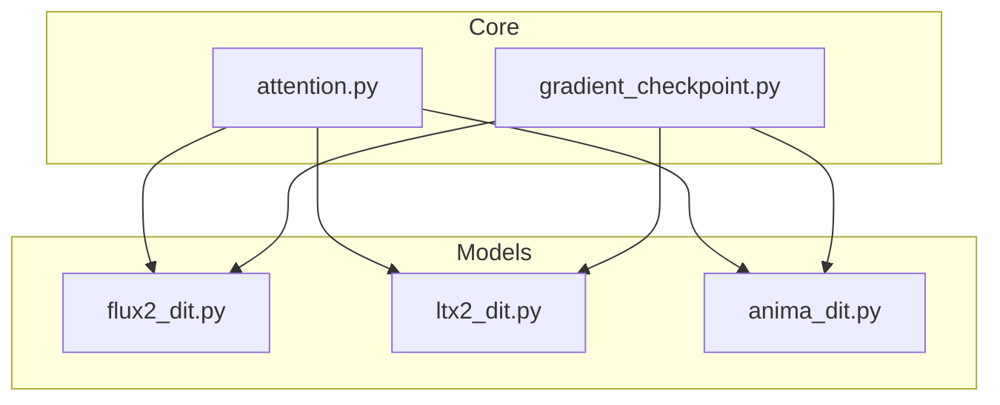
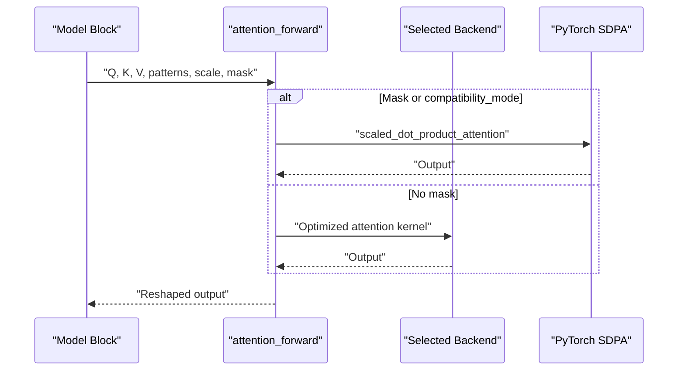
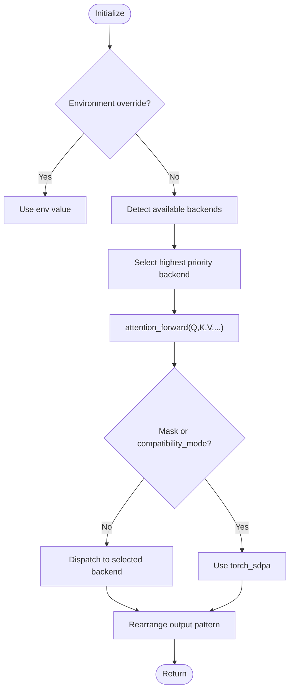
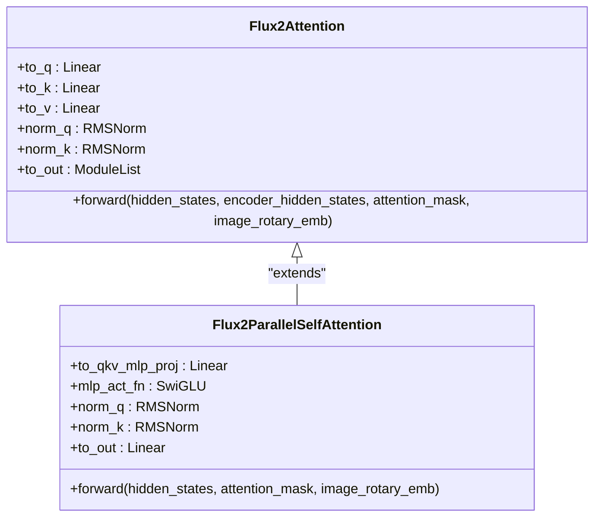
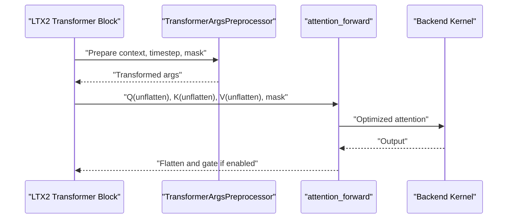
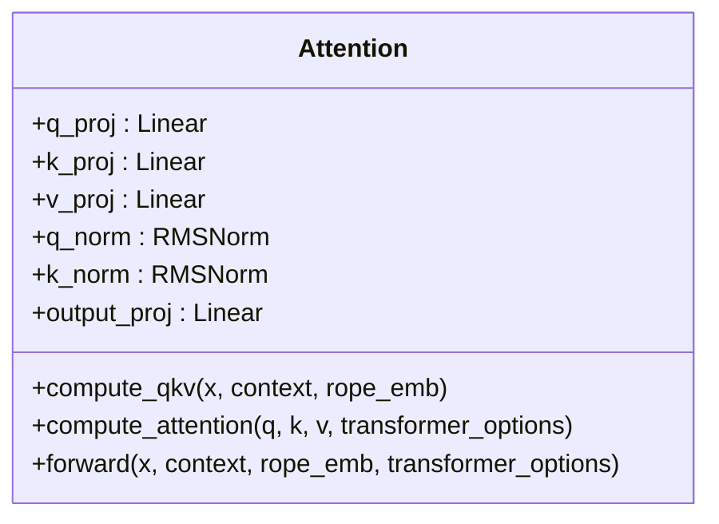
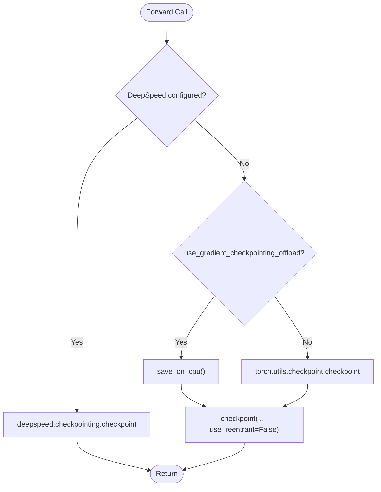
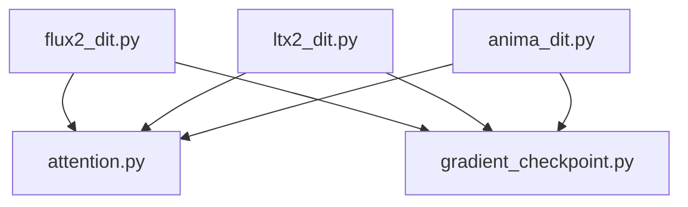

# Attention Mechanisms and Optimizations

<cite>
**Referenced Files in This Document**
- [attention.py](file://diffsynth/core/attention/attention.py)
- [gradient_checkpoint.py](file://diffsynth/core/gradient/gradient_checkpoint.py)
- [flux2_dit.py](file://diffsynth/models/flux2_dit.py)
- [ltx2_dit.py](file://diffsynth/models/ltx2_dit.py)
- [anima_dit.py](file://diffsynth/models/anima_dit.py)
</cite>

## Table of Contents
1. [Introduction](#introduction)
2. [Project Structure](#project-structure)
3. [Core Components](#core-components)
4. [Architecture Overview](#architecture-overview)
5. [Detailed Component Analysis](#detailed-component-analysis)
6. [Dependency Analysis](#dependency-analysis)
7. [Performance Considerations](#performance-considerations)
8. [Troubleshooting Guide](#troubleshooting-guide)
9. [Conclusion](#conclusion)
10. [Appendices](#appendices)

## Introduction
This document explains the attention mechanism implementations and optimizations in ODTSR-edit, focusing on memory efficiency and performance across hardware backends. It covers:
- Custom attention modules that select among multiple optimized backends (FlashAttention 2/3, SageAttention, xFormers, or PyTorch SDPA).
- Cross-attention variants used in diffusion models.
- Scaled dot-product attention patterns and how they are integrated into transformer blocks.
- Gradient checkpointing integration to reduce training memory usage.
- Practical configuration, parameter tuning, profiling guidance, and debugging strategies for attention-related memory issues.

## Project Structure
The attention subsystem is centralized under core/attention and consumed by model components via a unified entry point. Gradient checkpointing is provided under core/gradient and used throughout models to reduce activation memory during training.

**Diagram sources**
- [attention.py](file://diffsynth/core/attention/attention.py)
- [gradient_checkpoint.py](file://diffsynth/core/gradient/gradient_checkpoint.py)
- [flux2_dit.py](file://diffsynth/models/flux2_dit.py)
- [ltx2_dit.py](file://diffsynth/models/ltx2_dit.py)
- [anima_dit.py](file://diffsynth/models/anima_dit.py)

**Section sources**
- [attention.py](file://diffsynth/core/attention/attention.py)
- [gradient_checkpoint.py](file://diffsynth/core/gradient/gradient_checkpoint.py)
- [flux2_dit.py](file://diffsynth/models/flux2_dit.py)
- [ltx2_dit.py](file://diffsynth/models/ltx2_dit.py)
- [anima_dit.py](file://diffsynth/models/anima_dit.py)

## Core Components
- Backend selection and dispatch:
  - The attention module detects available backends and selects an implementation automatically unless overridden by an environment variable.
  - Supported backends include FlashAttention 3, FlashAttention 2, SageAttention, xFormers, and PyTorch scaled dot-product attention.
- Unified forward interface:
  - A single attention_forward function accepts Q/K/V tensors with flexible layout patterns and returns outputs in the desired pattern.
  - It handles rearrangement to backend-specific layouts and optional scaling/masking where supported.
- Gradient checkpointing:
  - A helper wraps model forward calls to selectively recompute activations during backward pass, optionally offloading to CPU when enabled.

Key behaviors:
- Pattern-aware rearranging ensures compatibility with different backends’ expected tensor shapes.
- Compatibility mode falls back to PyTorch SDPA when masks are present or when explicitly requested.
- Gradient checkpointing integrates with DeepSpeed when configured; otherwise uses PyTorch’s checkpoint utility.

**Section sources**
- [attention.py](file://diffsynth/core/attention/attention.py)
- [gradient_checkpoint.py](file://diffsynth/core/gradient/gradient_checkpoint.py)

## Architecture Overview
The attention architecture follows a layered design:
- Models compute Q/K/V and normalize them as needed.
- They call the unified attention_forward to perform the actual attention computation using the best available backend.
- Outputs are reshaped back to model expectations and passed through subsequent layers.

**Diagram sources**
- [attention.py](file://diffsynth/core/attention/attention.py)
- [flux2_dit.py](file://diffsynth/models/flux2_dit.py)
- [ltx2_dit.py](file://diffsynth/models/ltx2_dit.py)

## Detailed Component Analysis

### Attention Backend Selection and Dispatch
- Backend detection order:
  - Environment override takes precedence.
  - Otherwise, prefer FlashAttention 3, then FlashAttention 2, SageAttention, xFormers, and finally PyTorch SDPA.
- Layout handling:
  - Different backends expect different Q/K/V layouts; the module rearranges inputs and outputs accordingly.
- Scaling and masking:
  - Scale can be passed directly to backends that support it.
  - When attn_mask is provided or compatibility_mode is True, the system falls back to PyTorch SDPA to ensure correctness.

**Diagram sources**
- [attention.py](file://diffsynth/core/attention/attention.py)

**Section sources**
- [attention.py](file://diffsynth/core/attention/attention.py)

### Flux2 Attention Integration
- Self-attention and cross-attention:
  - Flux2 blocks concatenate encoder and decoder sequences for joint attention when applicable.
  - Rotary embeddings are applied to Q/K before attention.
- Parallel attention block:
  - QKV projections are fused with MLP input projections to reduce memory traffic.
  - Output projections are fused with MLP output projections.
- Backend usage:
  - attention_forward is called with explicit q/k/v/out patterns matching backend expectations.

**Diagram sources**
- [flux2_dit.py](file://diffsynth/models/flux2_dit.py)

**Section sources**
- [flux2_dit.py](file://diffsynth/models/flux2_dit.py)

### LTX2 Attention Usage
- Reshape strategy:
  - Q/K/V are unflattened to (B, S, H, D) before calling attention_forward.
- Mask handling:
  - Supports additive log-space self-attention bias prepared by a preprocessor.
- Gating:
  - Optional per-head gating modulates attention outputs.

**Diagram sources**
- [ltx2_dit.py](file://diffsynth/models/ltx2_dit.py)
- [attention.py](file://diffsynth/core/attention/attention.py)

**Section sources**
- [ltx2_dit.py](file://diffsynth/models/ltx2_dit.py)

### Anima Attention Patterns
- Multi-head attention:
  - Supports both self-attention and cross-attention modes.
  - Uses RMS normalization and optional rotary positional embeddings for self-attention.
- Backend integration:
  - Calls attention_forward with appropriate patterns to leverage optimized kernels.

**Diagram sources**
- [anima_dit.py](file://diffsynth/models/anima_dit.py)

**Section sources**
- [anima_dit.py](file://diffsynth/models/anima_dit.py)

### Gradient Checkpointing Integration
- Modes:
  - If DeepSpeed is configured, use its checkpointing path.
  - Otherwise, use PyTorch’s checkpoint utility.
- Offload option:
  - Optionally save activations on CPU to further reduce GPU memory.
- Usage:
  - Models wrap forward calls to selectively recompute heavy submodules during backward.

**Diagram sources**
- [gradient_checkpoint.py](file://diffsynth/core/gradient/gradient_checkpoint.py)

**Section sources**
- [gradient_checkpoint.py](file://diffsynth/core/gradient/gradient_checkpoint.py)

## Dependency Analysis
- Models depend on the unified attention_forward for all attention computations.
- Gradient checkpointing is used widely across models to reduce memory during training.
- Backend availability determines runtime behavior; fallback paths ensure robustness.

**Diagram sources**
- [flux2_dit.py](file://diffsynth/models/flux2_dit.py)
- [ltx2_dit.py](file://diffsynth/models/ltx2_dit.py)
- [anima_dit.py](file://diffsynth/models/anima_dit.py)
- [attention.py](file://diffsynth/core/attention/attention.py)
- [gradient_checkpoint.py](file://diffsynth/core/gradient/gradient_checkpoint.py)

**Section sources**
- [flux2_dit.py](file://diffsynth/models/flux2_dit.py)
- [ltx2_dit.py](file://diffsynth/models/ltx2_dit.py)
- [anima_dit.py](file://diffsynth/models/anima_dit.py)
- [attention.py](file://diffsynth/core/attention/attention.py)
- [gradient_checkpoint.py](file://diffsynth/core/gradient/gradient_checkpoint.py)

## Performance Considerations
- Backend selection:
  - Prefer FlashAttention 3/2 for speed and memory efficiency when available.
  - SageAttention and xFormers provide strong alternatives depending on hardware/driver support.
  - PyTorch SDPA is a reliable fallback, especially when masks are required.
- Tensor layouts:
  - Ensure Q/K/V patterns match backend expectations to avoid unnecessary copies.
- Fusion opportunities:
  - Parallel attention blocks fuse QKV and MLP projections to reduce memory bandwidth.
- Gradient checkpointing:
  - Enable during training to significantly reduce peak memory at modest compute overhead.
- Profiling tips:
  - Use framework profilers to identify attention hotspots and verify backend utilization.
  - Monitor memory peaks and throughput across different backends and batch sizes.

[No sources needed since this section provides general guidance]

## Troubleshooting Guide
Common issues and resolutions:
- Out-of-memory during training:
  - Enable gradient checkpointing; consider offloading activations to CPU.
  - Reduce batch size or sequence length; use lower precision if supported.
- Incorrect attention results with masks:
  - Masks force fallback to PyTorch SDPA; verify mask shapes and dtypes.
  - Ensure compatibility_mode is set when necessary.
- Slow performance:
  - Confirm the intended backend is detected and used; check environment variables and library availability.
  - Validate tensor layouts and avoid excessive rearrangements.
- Debugging attention memory:
  - Profile attention calls and intermediate tensor sizes.
  - Inspect whether fusion is active in parallel attention blocks.

**Section sources**
- [attention.py](file://diffsynth/core/attention/attention.py)
- [gradient_checkpoint.py](file://diffsynth/core/gradient/gradient_checkpoint.py)

## Conclusion
ODTSR-edit implements a flexible, high-performance attention subsystem that dynamically selects the best available backend while maintaining compatibility across diverse hardware configurations. By combining efficient attention kernels, pattern-aware rearrangements, and gradient checkpointing, the system achieves strong memory and speed characteristics for both training and inference. Models integrate seamlessly through a unified attention interface, enabling consistent optimization across self-attention and cross-attention scenarios.

[No sources needed since this section summarizes without analyzing specific files]

## Appendices

### Configuration and Parameter Tuning
- Backend override:
  - Set an environment variable to force a specific attention implementation.
- Scaling:
  - Pass softmax_scale to backends that accept it; otherwise rely on internal scaling.
- Masks:
  - Provide attn_mask when needed; the system will fall back to PyTorch SDPA for correctness.
- Gradient checkpointing:
  - Toggle flags to enable checkpointing and optional CPU offloading in model training loops.

**Section sources**
- [attention.py](file://diffsynth/core/attention/attention.py)
- [gradient_checkpoint.py](file://diffsynth/core/gradient/gradient_checkpoint.py)

### Hardware-Specific Guidance
- NVIDIA GPUs:
  - FlashAttention 2/3 typically offer the best performance; ensure drivers and libraries are installed.
- Alternative accelerators:
  - SageAttention and xFormers may provide good performance depending on platform support.
- CPU fallback:
  - PyTorch SDPA works universally but may be slower; useful for debugging and compatibility.

[No sources needed since this section provides general guidance]