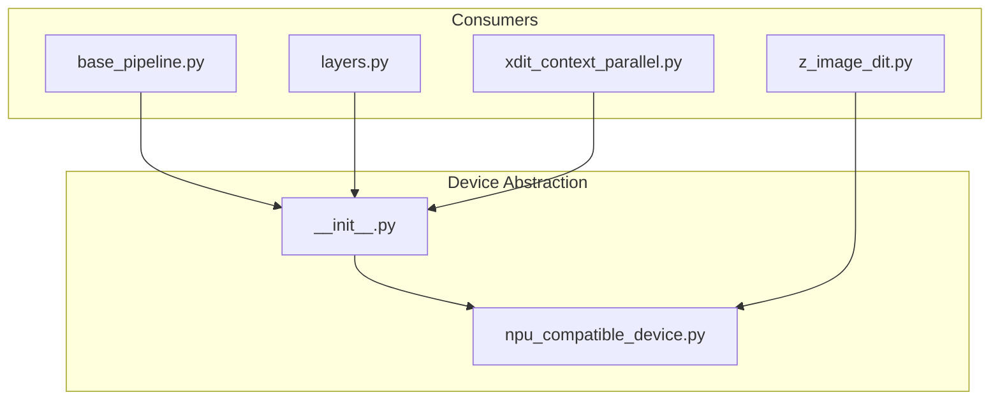
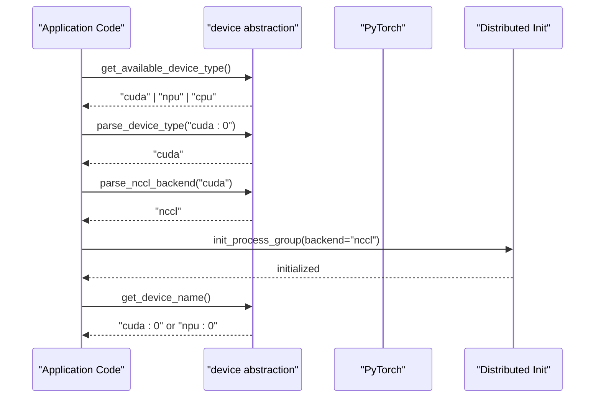
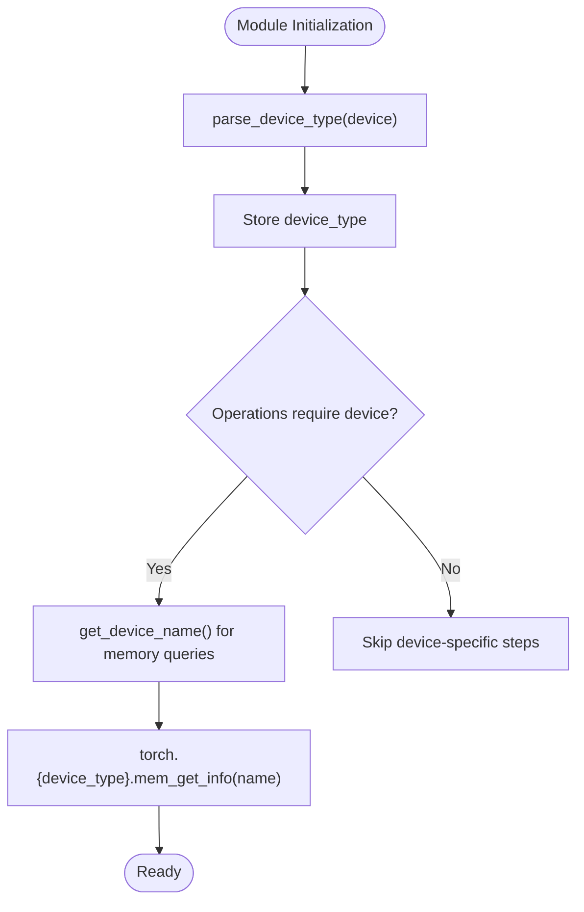
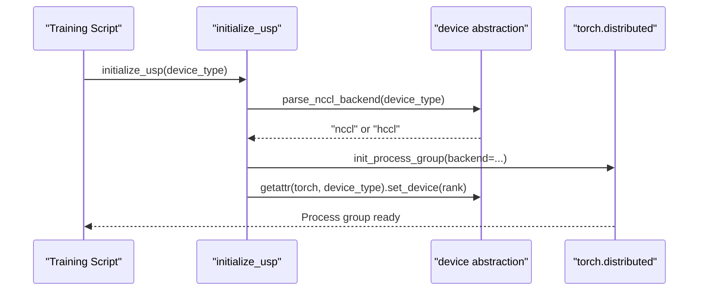
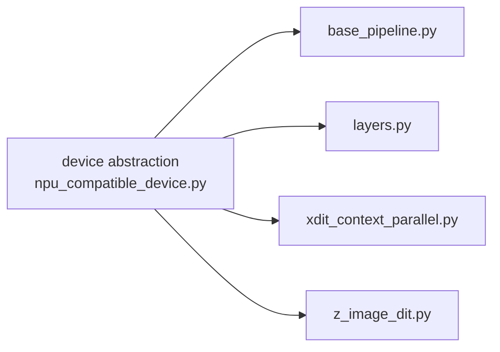

# Device Abstraction Layer

<cite>
**Referenced Files in This Document**
- [npu_compatible_device.py](file://diffsynth/core/device/npu_compatible_device.py)
- [__init__.py](file://diffsynth/core/device/__init__.py)
- [base_pipeline.py](file://diffsynth/diffusion/base_pipeline.py)
- [layers.py](file://diffsynth/core/vram/layers.py)
- [xdit_context_parallel.py](file://diffsynth/utils/xfuser/xdit_context_parallel.py)
- [z_image_dit.py](file://diffsynth/models/z_image_dit.py)
</cite>

## Table of Contents
1. [Introduction](#introduction)
2. [Project Structure](#project-structure)
3. [Core Components](#core-components)
4. [Architecture Overview](#architecture-overview)
5. [Detailed Component Analysis](#detailed-component-analysis)
6. [Dependency Analysis](#dependency-analysis)
7. [Performance Considerations](#performance-considerations)
8. [Troubleshooting Guide](#troubleshooting-guide)
9. [Conclusion](#conclusion)

## Introduction
This document explains the device abstraction layer that provides a unified interface for different hardware backends, including CUDA GPUs and NPU devices. It focuses on configuration parsing utilities, hardware detection helpers, and how higher-level components use these abstractions to initialize devices, select backends, and handle errors consistently across platforms.

## Project Structure
The device abstraction is implemented under diffsynth/core/device and exposed via a small public API. The key implementation resides in a single module that detects available backends and exposes helper functions used throughout the codebase (pipelines, VRAM management, and distributed training utilities).

**Diagram sources**
- [npu_compatible_device.py:1-108](file://diffsynth/core/device/npu_compatible_device.py#L1-L108)
- [__init__.py:1-3](file://diffsynth/core/device/__init__.py#L1-L3)
- [base_pipeline.py:1-200](file://diffsynth/diffusion/base_pipeline.py#L1-L200)
- [layers.py:1-200](file://diffsynth/core/vram/layers.py#L1-L200)
- [xdit_context_parallel.py:1-207](file://diffsynth/utils/xfuser/xdit_context_parallel.py#L1-L207)
- [z_image_dit.py:310-509](file://diffsynth/models/z_image_dit.py#L310-L509)

**Section sources**
- [npu_compatible_device.py:1-108](file://diffsynth/core/device/npu_compatible_device.py#L1-L108)
- [__init__.py:1-3](file://diffsynth/core/device/__init__.py#L1-L3)

## Core Components
The device abstraction layer exposes:
- Backend availability flags: IS_CUDA_AVAILABLE, IS_NPU_AVAILABLE
- Device type resolution: get_device_type(), get_available_device_type()
- Device naming and identification: get_device_name(), get_device_id()
- Distributed backend selection: parse_nccl_backend(device_type), get_nccl_backend()
- Parsing utilities: parse_device_type(device)
- Synchronization and cache utilities: synchronize(), empty_cache()
- Precision helpers: enable_high_precision_for_bf16()

These functions are re-exported from the device package’s __init__.py for convenient imports across modules.

Key responsibilities:
- Abstract away differences between torch.cuda and torch.npu
- Provide consistent device strings and names for memory queries and logging
- Select appropriate distributed communication backends (nccl vs hccl)
- Offer safe fallbacks when device namespaces are missing

**Section sources**
- [npu_compatible_device.py:10-108](file://diffsynth/core/device/npu_compatible_device.py#L10-L108)
- [__init__.py:1-3](file://diffsynth/core/device/__init__.py#L1-L3)

## Architecture Overview
At runtime, consumers query the device abstraction to determine the best available backend and obtain device identifiers. Pipelines and VRAM wrappers use these utilities to move tensors and models, while distributed utilities choose the correct backend for process groups.

**Diagram sources**
- [npu_compatible_device.py:19-108](file://diffsynth/core/device/npu_compatible_device.py#L19-L108)
- [xdit_context_parallel.py:15-25](file://diffsynth/utils/xfuser/xdit_context_parallel.py#L15-L25)

## Detailed Component Analysis

### Device Type Resolution and Naming
- get_device_type(): Returns the preferred device type based on availability order: CUDA > NPU > CPU.
- get_available_device_type(): Alias to get_device_type() for explicit intent.
- get_device_name(): Combines device type and current device id into a string like "cuda:0" or "npu:0".
- get_device_id(): Retrieves the current device id using the active torch namespace.

These functions centralize device selection logic and ensure consistent behavior across the codebase.

**Section sources**
- [npu_compatible_device.py:19-50](file://diffsynth/core/device/npu_compatible_device.py#L19-L50)

### Backend Selection Utilities
- parse_device_type(device): Normalizes input device specifications (string or torch.device) to a canonical device type ("cuda", "npu", or "cpu").
- parse_nccl_backend(device_type): Maps device types to distributed backends: "cuda" -> "nccl", "npu" -> "hccl". Raises an error if no backend is available for the given device type.
- get_nccl_backend(): Runtime version that selects the backend based on actual availability flags.

Usage examples:
- Pipeline initialization uses parse_device_type to store a stable device type.
- Distributed initialization calls parse_nccl_backend to configure process groups.

**Section sources**
- [npu_compatible_device.py:85-104](file://diffsynth/core/device/npu_compatible_device.py#L85-L104)
- [xdit_context_parallel.py:15-25](file://diffsynth/utils/xfuser/xdit_context_parallel.py#L15-L25)
- [base_pipeline.py:61-74](file://diffsynth/diffusion/base_pipeline.py#L61-L74)

### Hardware Detection Flags
- IS_CUDA_AVAILABLE: True if torch.cuda.is_available().
- IS_NPU_AVAILABLE: True if torch_npu is importable and torch.npu.is_available().

These flags control conditional behavior such as:
- Selecting distributed backends
- Using NPU-specific indexing or attention kernels
- Adjusting precision settings and autocast contexts

**Section sources**
- [npu_compatible_device.py:6-17](file://diffsynth/core/device/npu_compatible_device.py#L6-L17)

### Usage in Pipelines and VRAM Management
- BasePipeline stores device_type via parse_device_type and uses it for operations like empty_cache and memory queries.
- VRAM wrappers check free memory and cast modules to computation devices; they also adapt device name formatting for NPU compatibility.

**Diagram sources**
- [base_pipeline.py:61-94](file://diffsynth/diffusion/base_pipeline.py#L61-L94)
- [layers.py:36-70](file://diffsynth/core/vram/layers.py#L36-L70)

**Section sources**
- [base_pipeline.py:61-94](file://diffsynth/diffusion/base_pipeline.py#L61-L94)
- [layers.py:36-70](file://diffsynth/core/vram/layers.py#L36-L70)

### Distributed Training Integration
- xdit_context_parallel.initialize_usp uses parse_nccl_backend to set the distributed backend and sets the per-rank device via getattr(torch, device_type).set_device(rank).
- Attention paths switch to NPU-specific kernels when IS_NPU_AVAILABLE is true.

**Diagram sources**
- [xdit_context_parallel.py:15-25](file://diffsynth/utils/xfuser/xdit_context_parallel.py#L15-L25)
- [npu_compatible_device.py:97-104](file://diffsynth/core/device/npu_compatible_device.py#L97-L104)

**Section sources**
- [xdit_context_parallel.py:15-25](file://diffsynth/utils/xfuser/xdit_context_parallel.py#L15-L25)

### Model-Level NPU Compatibility
- Some models conditionally use NPU-specific tensor operations when IS_NPU_AVAILABLE is true (e.g., index_select path).
- Autocast contexts may be configured with get_device_type() to ensure correct precision behavior.

**Section sources**
- [z_image_dit.py:310-324](file://diffsynth/models/z_image_dit.py#L310-L324)

## Dependency Analysis
The device abstraction is consumed by multiple layers:
- base_pipeline.py: Uses parse_device_type and get_device_name for pipeline device handling and memory queries.
- layers.py: Uses parse_device_type and get_device_name for VRAM-aware casting and memory checks.
- xdit_context_parallel.py: Uses parse_nccl_backend and parse_device_type for distributed initialization and device setting.
- z_image_dit.py: Uses IS_NPU_AVAILABLE for NPU-specific code paths.

**Diagram sources**
- [npu_compatible_device.py:1-108](file://diffsynth/core/device/npu_compatible_device.py#L1-L108)
- [base_pipeline.py:1-200](file://diffsynth/diffusion/base_pipeline.py#L1-L200)
- [layers.py:1-200](file://diffsynth/core/vram/layers.py#L1-L200)
- [xdit_context_parallel.py:1-207](file://diffsynth/utils/xfuser/xdit_context_parallel.py#L1-L207)
- [z_image_dit.py:310-509](file://diffsynth/models/z_image_dit.py#L310-L509)

**Section sources**
- [npu_compatible_device.py:1-108](file://diffsynth/core/device/npu_compatible_device.py#L1-L108)
- [base_pipeline.py:1-200](file://diffsynth/diffusion/base_pipeline.py#L1-L200)
- [layers.py:1-200](file://diffsynth/core/vram/layers.py#L1-L200)
- [xdit_context_parallel.py:1-207](file://diffsynth/utils/xfuser/xdit_context_parallel.py#L1-L207)
- [z_image_dit.py:310-509](file://diffsynth/models/z_image_dit.py#L310-L509)

## Performance Considerations
- Prefer get_device_type() for autocast contexts to leverage hardware-specific optimizations.
- Use parse_device_type() to normalize device inputs before passing to PyTorch APIs.
- For multi-device setups, ensure each rank sets its device via getattr(torch, device_type).set_device(rank).
- When querying memory on NPU, use get_device_name() to avoid attribute mismatches.

[No sources needed since this section provides general guidance]

## Troubleshooting Guide
Common issues and resolutions:
- No available distributed backend: parse_nccl_backend raises a RuntimeError when neither CUDA nor NPU is available. Ensure at least one backend is installed and detected.
- Device namespace not found: get_torch_device attempts to access the device namespace dynamically and falls back to torch.cuda if necessary. Verify your PyTorch build includes the expected backend.
- Memory queries failing on NPU: Use get_device_name() instead of raw device objects for mem_get_info calls.
- Inconsistent device types: Always pass normalized device types from parse_device_type to downstream functions.

**Section sources**
- [npu_compatible_device.py:62-70](file://diffsynth/core/device/npu_compatible_device.py#L62-L70)
- [npu_compatible_device.py:31-40](file://diffsynth/core/device/npu_compatible_device.py#L31-L40)
- [layers.py:65-70](file://diffsynth/core/vram/layers.py#L65-L70)

## Conclusion
The device abstraction layer centralizes hardware detection, device naming, and backend selection, enabling consistent behavior across CUDA and NPU environments. By using parse_device_type, parse_nccl_backend, get_available_device_type, and get_device_name, consumers can reliably initialize devices, configure distributed training, and manage memory without hardcoding backend-specific logic.

[No sources needed since this section summarizes without analyzing specific files]