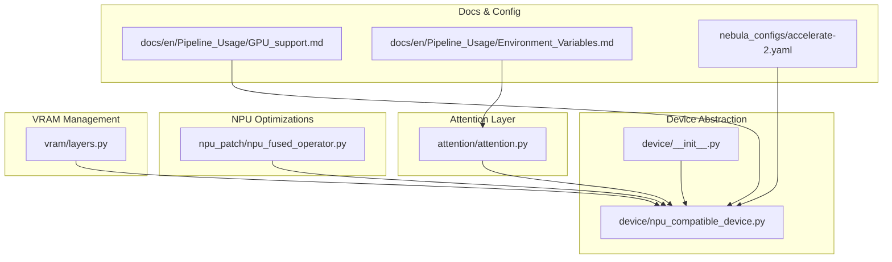
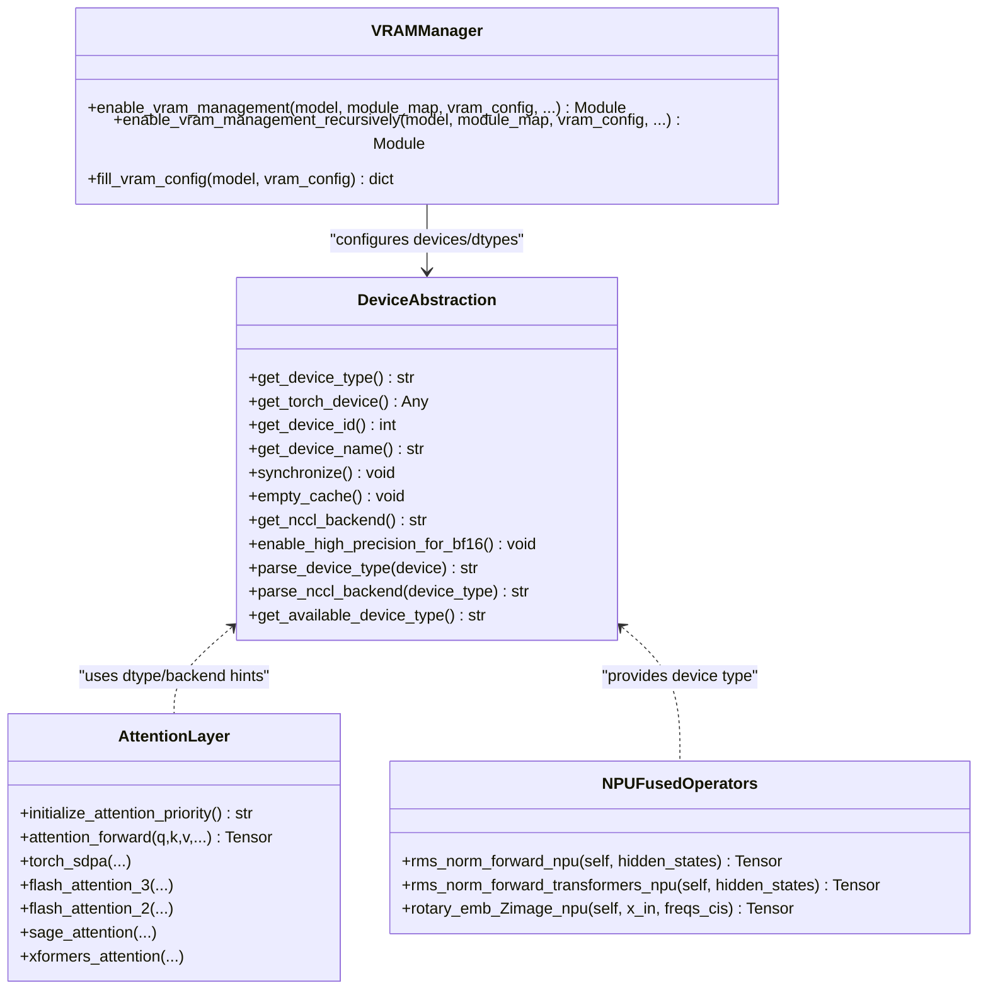
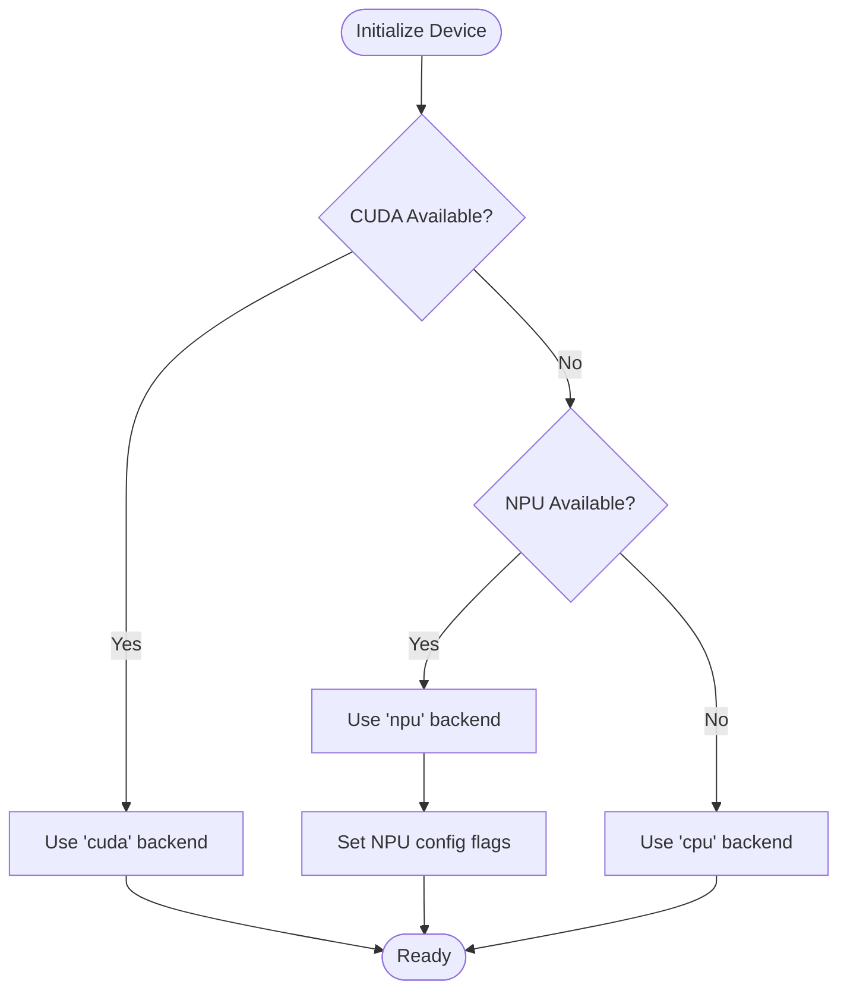
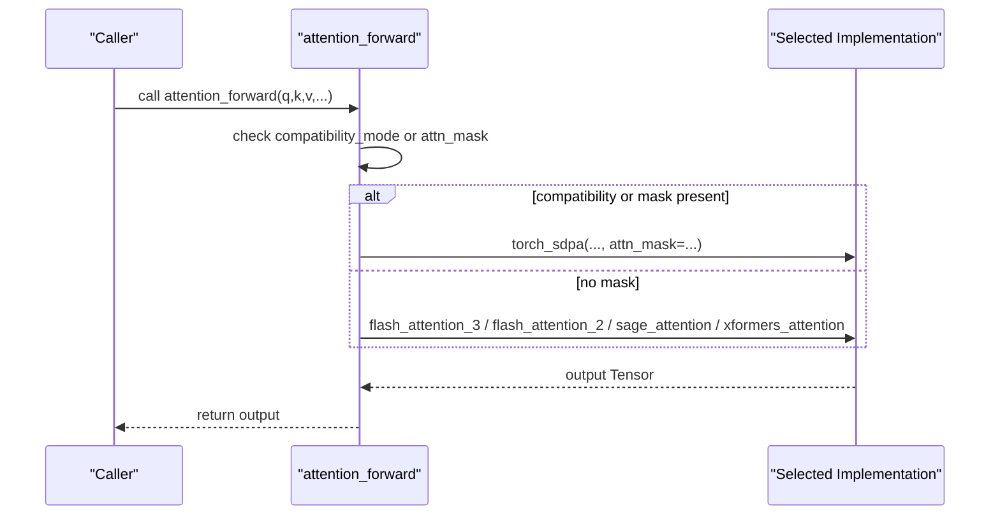
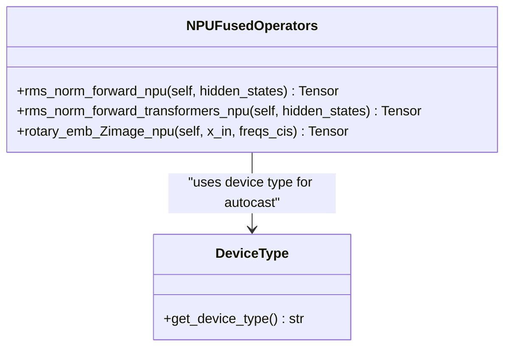
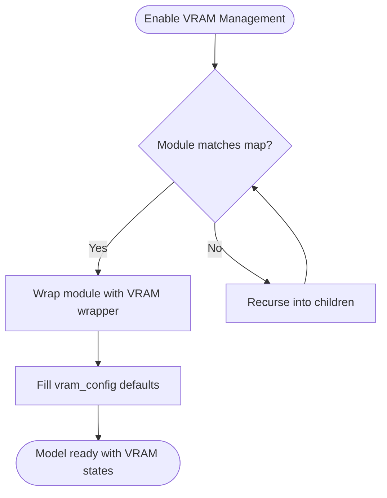
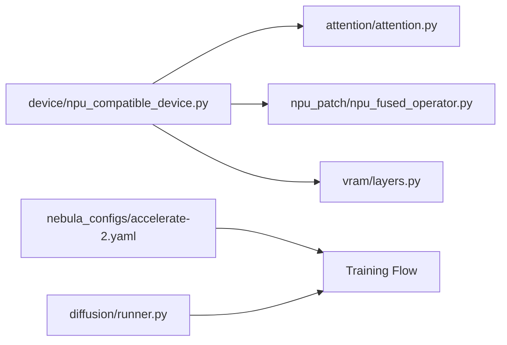

# Device and Hardware Support

<cite>
**Referenced Files in This Document**
- [npu_compatible_device.py](file://diffsynth/core/device/npu_compatible_device.py)
- [__init__.py (device)](file://diffsynth/core/device/__init__.py)
- [attention.py](file://diffsynth/core/attention/attention.py)
- [npu_fused_operator.py](file://diffsynth/core/npu_patch/npu_fused_operator.py)
- [GPU_support.md](file://docs/en/Pipeline_Usage/GPU_support.md)
- [Environment_Variables.md](file://docs/en/Pipeline_Usage/Environment_Variables.md)
- [layers.py](file://diffsynth/core/vram/layers.py)
- [accelerate-2.yaml](file://nebula_configs/accelerate-2.yaml)
- [runner.py](file://diffsynth/diffusion/runner.py)
</cite>

## Table of Contents
1. [Introduction](#introduction)
2. [Project Structure](#project-structure)
3. [Core Components](#core-components)
4. [Architecture Overview](#architecture-overview)
5. [Detailed Component Analysis](#detailed-component-analysis)
6. [Dependency Analysis](#dependency-analysis)
7. [Performance Considerations](#performance-considerations)
8. [Troubleshooting Guide](#troubleshooting-guide)
9. [Conclusion](#conclusion)
10. [Appendices](#appendices)

## Introduction
This document explains how ODTSR-edit abstracts devices and hardware backends to support GPUs and NPUs uniformly, with a focus on Ascend NPU compatibility and optimizations. It also details attention mechanism implementations, including memory-efficient variants and cross-attention considerations, and provides guidance for configuring devices, switching backends, optimizing performance per hardware, and enabling multi-GPU/distributed training.

## Project Structure
The device abstraction and hardware-specific features are primarily implemented under the core modules:
- Device abstraction and backend selection live in the device module.
- Attention mechanisms are centralized in the attention module.
- NPU-specific fused operators are provided in the npu_patch module.
- VRAM management utilities enable fine-grained control over memory states across devices.
- Documentation and configuration examples demonstrate GPU/NPU usage and distributed setups.

**Diagram sources**
- [__init__.py (device):1-3](file://diffsynth/core/device/__init__.py#L1-L3)
- [npu_compatible_device.py:1-108](file://diffsynth/core/device/npu_compatible_device.py#L1-L108)
- [attention.py:1-122](file://diffsynth/core/attention/attention.py#L1-L122)
- [npu_fused_operator.py:1-30](file://diffsynth/core/npu_patch/npu_fused_operator.py#L1-L30)
- [layers.py:439-479](file://diffsynth/core/vram/layers.py#L439-L479)
- [GPU_support.md:1-94](file://docs/en/Pipeline_Usage/GPU_support.md#L1-L94)
- [Environment_Variables.md:1-39](file://docs/en/Pipeline_Usage/Environment_Variables.md#L1-L39)
- [accelerate-2.yaml:1-16](file://nebula_configs/accelerate-2.yaml#L1-L16)

**Section sources**
- [npu_compatible_device.py:1-108](file://diffsynth/core/device/npu_compatible_device.py#L1-L108)
- [attention.py:1-122](file://diffsynth/core/attention/attention.py#L1-L122)
- [npu_fused_operator.py:1-30](file://diffsynth/core/npu_patch/npu_fused_operator.py#L1-L30)
- [GPU_support.md:1-94](file://docs/en/Pipeline_Usage/GPU_support.md#L1-L94)
- [Environment_Variables.md:1-39](file://docs/en/Pipeline_Usage/Environment_Variables.md#L1-L39)
- [layers.py:439-479](file://diffsynth/core/vram/layers.py#L439-L479)
- [accelerate-2.yaml:1-16](file://nebula_configs/accelerate-2.yaml#L1-L16)

## Core Components
- Device abstraction layer:
  - Detects available backends (CUDA, NPU, CPU).
  - Provides unified APIs for device queries, synchronization, cache management, and distributed communication backend selection.
  - Enables high-precision BF16 accumulation settings for both CUDA and NPU.
- Attention mechanism:
  - Selects optimal implementation based on environment or availability (Flash Attention v3/v2, SageAttention, xFormers, or PyTorch SDPA).
  - Supports compatibility mode for masks and flexible tensor layouts.
- NPU compatibility and optimizations:
  - Fused RMSNorm and rotary embedding operators for Ascend NPU.
  - Backend-aware NCCL/HCCl selection for distributed training.
- VRAM management:
  - Wraps model layers into stateful wrappers with configurable offload/onload/preparing/computation dtypes and devices.
  - Supports disk offloading and dynamic memory limits.

**Section sources**
- [npu_compatible_device.py:1-108](file://diffsynth/core/device/npu_compatible_device.py#L1-L108)
- [attention.py:1-122](file://diffsynth/core/attention/attention.py#L1-L122)
- [npu_fused_operator.py:1-30](file://diffsynth/core/npu_patch/npu_fused_operator.py#L1-L30)
- [layers.py:439-479](file://diffsynth/core/vram/layers.py#L439-L479)

## Architecture Overview
The device abstraction sits between application code and hardware backends, routing operations to the correct torch namespace (cuda/npu/cpu) and selecting optimized kernels where available. Attention is decoupled from device logic but benefits from backend-specific accelerators. VRAM management wraps model components to control memory placement and precision dynamically.

**Diagram sources**
- [npu_compatible_device.py:1-108](file://diffsynth/core/device/npu_compatible_device.py#L1-L108)
- [attention.py:1-122](file://diffsynth/core/attention/attention.py#L1-L122)
- [npu_fused_operator.py:1-30](file://diffsynth/core/npu_patch/npu_fused_operator.py#L1-L30)
- [layers.py:439-479](file://diffsynth/core/vram/layers.py#L439-L479)

## Detailed Component Analysis

### Device Abstraction Layer
- Backend detection:
  - Determines whether CUDA or NPU is available; falls back to CPU otherwise.
  - Exposes flags for availability checks.
- Unified device API:
  - Retrieves current device id and name string.
  - Synchronizes and clears caches via the appropriate torch namespace.
- Distributed communication:
  - Returns the correct backend ("nccl" for CUDA, "hccl" for NPU).
- Precision tuning:
  - Disables TF32 and reduced-precision reductions for BF16 matmul/reduction on both CUDA and NPU when enabled.

**Diagram sources**
- [npu_compatible_device.py:10-28](file://diffsynth/core/device/npu_compatible_device.py#L10-L28)

**Section sources**
- [npu_compatible_device.py:1-108](file://diffsynth/core/device/npu_compatible_device.py#L1-L108)

### Attention Mechanism Implementations
- Implementation priority:
  - Environment variable can force a specific implementation; otherwise, selects based on availability: Flash Attention v3 > v2 > SageAttention > xFormers > PyTorch SDPA.
- Memory-efficient variants:
  - xFormers uses memory-efficient attention.
  - Flash Attention variants provide kernel-level optimizations.
  - Compatibility mode supports attention masks and fallback to SDPA.
- Cross-attention considerations:
  - The same dispatcher applies to cross-attention calls by passing q/k/v tensors through the selected backend.
  - For mask-based cross-attention, use compatibility mode to ensure correctness.

**Diagram sources**
- [attention.py:30-45](file://diffsynth/core/attention/attention.py#L30-L45)
- [attention.py:108-122](file://diffsynth/core/attention/attention.py#L108-L122)

**Section sources**
- [attention.py:1-122](file://diffsynth/core/attention/attention.py#L1-L122)
- [Environment_Variables.md:29-31](file://docs/en/Pipeline_Usage/Environment_Variables.md#L29-L31)

### NPU Compatibility and Optimizations (Ascend)
- Fused operators:
  - RMSNorm fused forward for general modules and transformers.
  - Rotary embedding fused operator tailored for Z-image models.
- Backend integration:
  - Uses device type to manage autocast context and select fused ops.
- Training scripts and parameters:
  - Example NPU training scripts exist per model family.
  - Model-specific flags like initializing on CPU or enabling NPU patches improve stability/performance.

**Diagram sources**
- [npu_fused_operator.py:1-30](file://diffsynth/core/npu_patch/npu_fused_operator.py#L1-L30)
- [npu_compatible_device.py:19-28](file://diffsynth/core/device/npu_compatible_device.py#L19-L28)

**Section sources**
- [npu_fused_operator.py:1-30](file://diffsynth/core/npu_patch/npu_fused_operator.py#L1-L30)
- [GPU_support.md:15-94](file://docs/en/Pipeline_Usage/GPU_support.md#L15-L94)

### VRAM Management and Offloading
- State machine:
  - Layers transition among Offload, Onload, Preparing, Computation states.
- Configuration:
  - vram_config controls dtype and device for each state; defaults align onload/preparing/computation to computation settings if not specified.
- Recursive wrapping:
  - Automatically wraps matching modules using a mapping table; supports nested structures.

**Diagram sources**
- [layers.py:439-479](file://diffsynth/core/vram/layers.py#L439-L479)

**Section sources**
- [layers.py:439-479](file://diffsynth/core/vram/layers.py#L439-L479)
- [GPU_support.md:175-206](file://docs/en/Pipeline_Usage/GPU_support.md#L175-L206)

## Dependency Analysis
- Device abstraction is central:
  - Used by attention dispatching for dtype/backend hints.
  - Consumed by NPU fused operators to set autocast contexts.
  - Referenced by VRAM management for device/dtype configuration.
- Attention depends on optional libraries:
  - Flash Attention v2/v3, SageAttention, xFormers; falls back to PyTorch SDPA.
- Distributed training:
  - Accelerator configurations define multi-GPU processes and mixed precision.
  - DeepSpeed gradient checkpointing initialization is supported.

**Diagram sources**
- [npu_compatible_device.py:1-108](file://diffsynth/core/device/npu_compatible_device.py#L1-L108)
- [attention.py:1-122](file://diffsynth/core/attention/attention.py#L1-L122)
- [npu_fused_operator.py:1-30](file://diffsynth/core/npu_patch/npu_fused_operator.py#L1-L30)
- [layers.py:439-479](file://diffsynth/core/vram/layers.py#L439-L479)
- [accelerate-2.yaml:1-16](file://nebula_configs/accelerate-2.yaml#L1-L16)
- [runner.py:75-88](file://diffsynth/diffusion/runner.py#L75-L88)

**Section sources**
- [accelerate-2.yaml:1-16](file://nebula_configs/accelerate-2.yaml#L1-L16)
- [runner.py:75-88](file://diffsynth/diffusion/runner.py#L75-L88)

## Performance Considerations
- Choose attention implementation:
  - Prefer Flash Attention v3/v2 or SageAttention when available; fall back to xFormers or SDPA.
  - Use environment variable to force a specific implementation for benchmarking or debugging.
- NPU optimizations:
  - Enable fused RMSNorm and rotary operators for Ascend NPU.
  - Use expandable segments and CPU affinity variables for better memory and scheduling behavior.
- Precision settings:
  - Disable TF32 and reduced-precision reductions for BF16 matmul/reduction to improve numerical stability.
- VRAM management:
  - Use disk offloading for large models; tune buffer size for disk mapping to balance memory vs speed.
  - Align onload/preparing/computation dtypes/devices to reduce unnecessary transfers.

[No sources needed since this section provides general guidance]

## Troubleshooting Guide
- No available distributed backend:
  - Ensure CUDA or NPU is detected; otherwise, distributed initialization will fail.
- Attention mask issues:
  - Use compatibility mode to route to SDPA when masks are required.
- NPU runtime errors:
  - Verify torch_npu installation and availability flags; confirm device names and memory queries use NPU APIs.
- VRAM out-of-memory:
  - Enable VRAM management and consider disk offloading; adjust vram_limit and buffer sizes.

**Section sources**
- [npu_compatible_device.py:62-70](file://diffsynth/core/device/npu_compatible_device.py#L62-L70)
- [attention.py:108-122](file://diffsynth/core/attention/attention.py#L108-L122)
- [GPU_support.md:15-94](file://docs/en/Pipeline_Usage/GPU_support.md#L15-L94)
- [layers.py:439-479](file://diffsynth/core/vram/layers.py#L439-L479)

## Conclusion
ODTSR-edit’s device abstraction cleanly separates hardware concerns from model logic, enabling seamless operation across CUDA and Ascend NPU backends. Attention mechanisms are optimized via multiple backends, while NPU-specific fused operators and VRAM management provide robust performance and memory efficiency. Distributed training is supported through accelerator configurations and DeepSpeed integration.

[No sources needed since this section summarizes without analyzing specific files]

## Appendices

### Configuring Devices and Switching Backends
- Automatic detection:
  - Use get_device_type() to choose backend automatically.
- Explicit device selection:
  - Pass device="cuda" or device="npu" to pipelines/models; update VRAM config accordingly.
- Distributed setup:
  - Configure accelerate YAML for multi-GPU; ensure num_processes and gpu_ids match your hardware.

**Section sources**
- [npu_compatible_device.py:19-28](file://diffsynth/core/device/npu_compatible_device.py#L19-L28)
- [GPU_support.md:15-94](file://docs/en/Pipeline_Usage/GPU_support.md#L15-L94)
- [accelerate-2.yaml:1-16](file://nebula_configs/accelerate-2.yaml#L1-L16)

### Multi-GPU and Distributed Computing
- Accelerate configuration:
  - Set distributed_type, num_processes, gpu_ids, and mixed_precision.
- DeepSpeed gradient checkpointing:
  - Initialize DeepSpeed activation checkpointing when configured.

**Section sources**
- [accelerate-2.yaml:1-16](file://nebula_configs/accelerate-2.yaml#L1-L16)
- [runner.py:75-88](file://diffsynth/diffusion/runner.py#L75-L88)

### Attention Optimization Tips
- Force implementation:
  - Set DIFFSYNTH_ATTENTION_IMPLEMENTATION to prioritize a specific backend.
- Masks and compatibility:
  - Use compatibility mode for masked attention paths.

**Section sources**
- [Environment_Variables.md:29-31](file://docs/en/Pipeline_Usage/Environment_Variables.md#L29-L31)
- [attention.py:108-122](file://diffsynth/core/attention/attention.py#L108-L122)