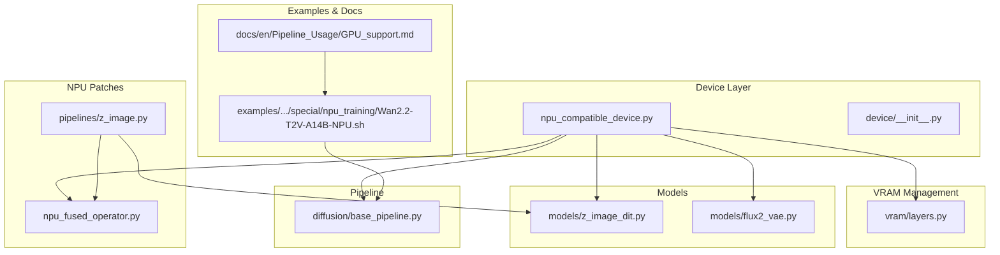
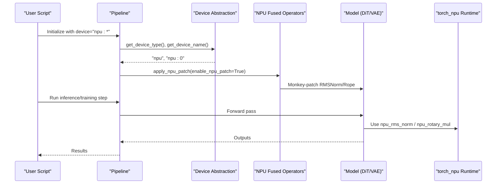
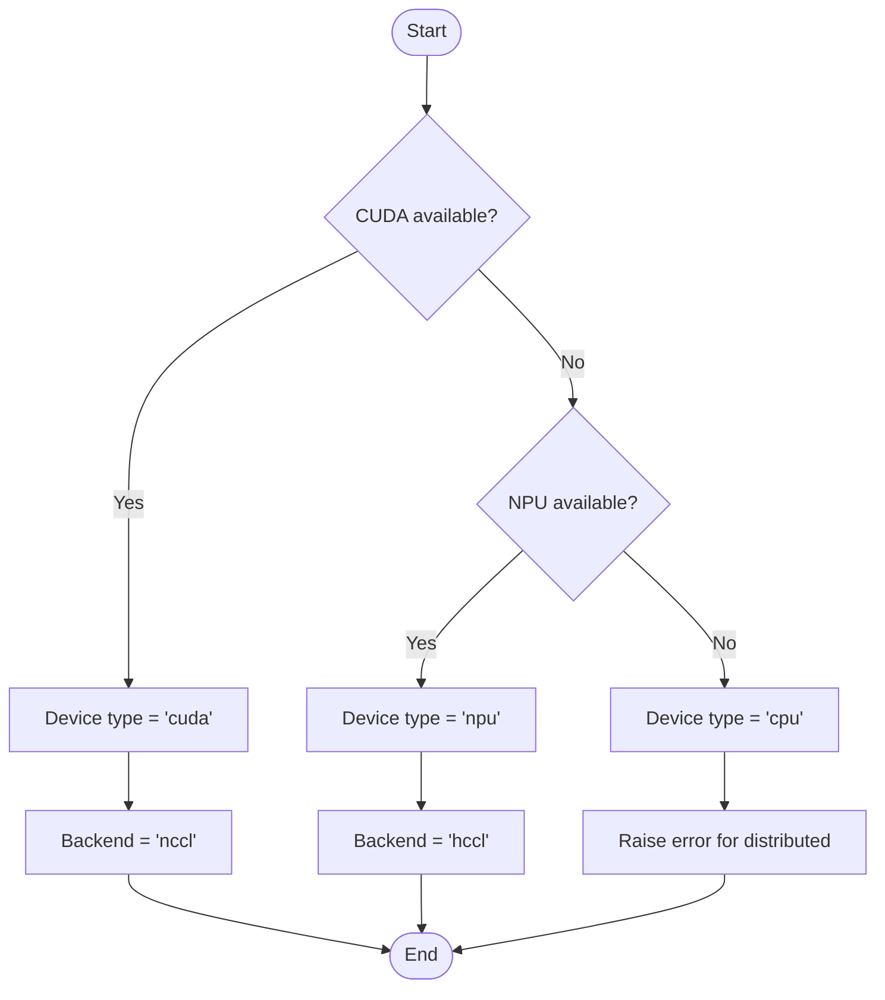
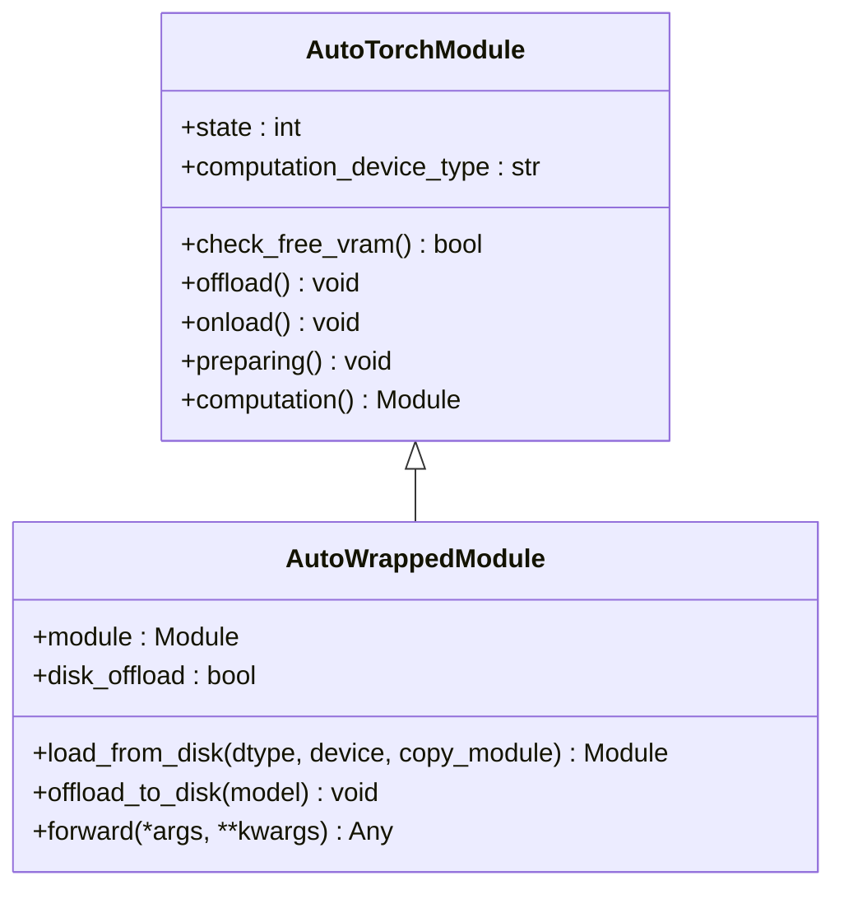
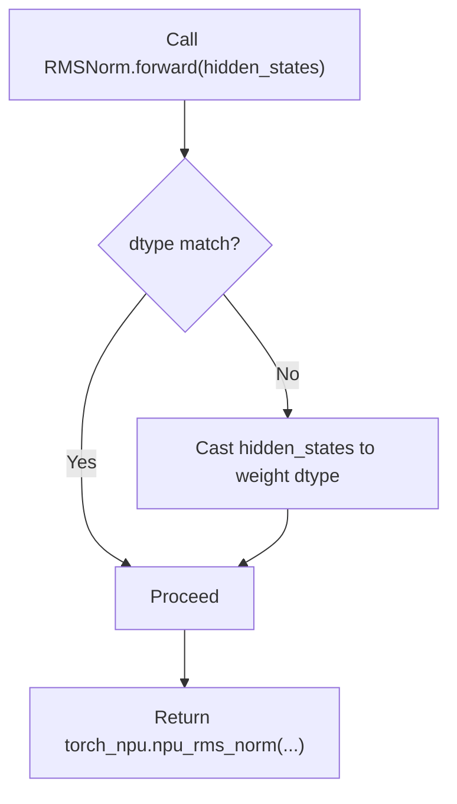
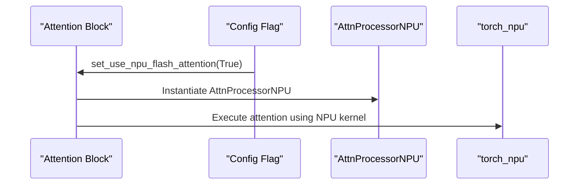
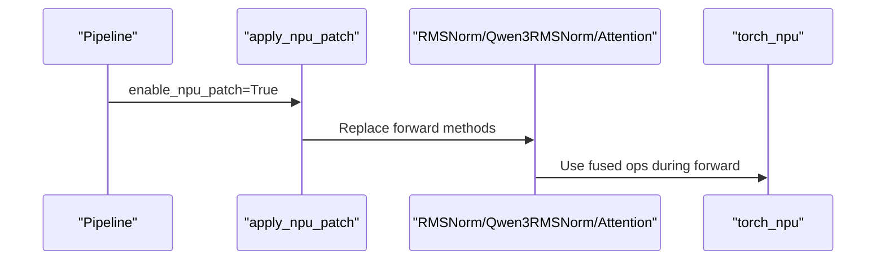
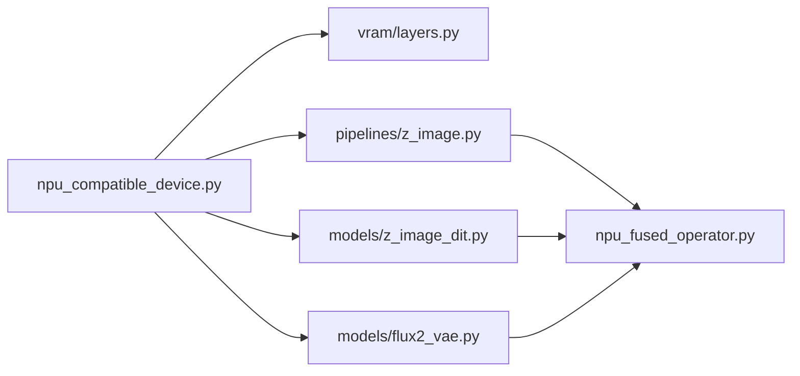

# NPU Compatibility and Optimization

<cite>
**Referenced Files in This Document**
- [npu_compatible_device.py](file://diffsynth/core/device/npu_compatible_device.py)
- [__init__.py](file://diffsynth/core/device/__init__.py)
- [npu_fused_operator.py](file://diffsynth/core/npu_patch/npu_fused_operator.py)
- [layers.py](file://diffsynth/core/vram/layers.py)
- [z_image.py](file://diffsynth/pipelines/z_image.py)
- [z_image_dit.py](file://diffsynth/models/z_image_dit.py)
- [flux2_vae.py](file://diffsynth/models/flux2_vae.py)
- [base_pipeline.py](file://diffsynth/diffusion/base_pipeline.py)
- [Wan2.2-T2V-A14B-NPU.sh](file://examples/wanvideo/model_training/special/npu_training/Wan2.2-T2V-A14B-NPU.sh)
- [GPU_support.md](file://docs/en/Pipeline_Usage/GPU_support.md)
</cite>

## Table of Contents
1. [Introduction](#introduction)
2. [Project Structure](#project-structure)
3. [Core Components](#core-components)
4. [Architecture Overview](#architecture-overview)
5. [Detailed Component Analysis](#detailed-component-analysis)
6. [Dependency Analysis](#dependency-analysis)
7. [Performance Considerations](#performance-considerations)
8. [Troubleshooting Guide](#troubleshooting-guide)
9. [Conclusion](#conclusion)
10. [Appendices](#appendices)

## Introduction
This document explains how ODTSR-edit enables running diffusion models on Huawei Ascend NPUs with optimized performance. It covers device parsing, backend configuration, memory management strategies, fused operator patches for NPU acceleration, setup instructions, environment variables, common configuration options, examples of optimizations, debugging techniques, known limitations, and workarounds.

## Project Structure
NPU compatibility is implemented across a small set of core modules:
- Device abstraction and detection utilities
- VRAM management wrappers that adapt to NPU memory APIs
- NPU-specific fused operator patches applied at runtime
- Model-level hooks for attention processors and rope operations
- Pipeline entry points to enable NPU patches
- Example training scripts demonstrating NPU environment variables and flags

**Diagram sources**
- [npu_compatible_device.py:1-108](file://diffsynth/core/device/npu_compatible_device.py#L1-L108)
- [__init__.py:1-3](file://diffsynth/core/device/__init__.py#L1-L3)
- [layers.py:1-36](file://diffsynth/core/vram/layers.py#L1-L36)
- [npu_fused_operator.py:1-30](file://diffsynth/core/npu_patch/npu_fused_operator.py#L1-L30)
- [z_image.py:670-690](file://diffsynth/pipelines/z_image.py#L670-L690)
- [z_image_dit.py:315-325](file://diffsynth/models/z_image_dit.py#L315-L325)
- [flux2_vae.py:720-742](file://diffsynth/models/flux2_vae.py#L720-L742)
- [base_pipeline.py:191-191](file://diffsynth/diffusion/base_pipeline.py#L191-L191)
- [Wan2.2-T2V-A14B-NPU.sh:1-40](file://examples/wanvideo/model_training/special/npu_training/Wan2.2-T2V-A14B-NPU.sh#L1-L40)
- [GPU_support.md:61-94](file://docs/en/Pipeline_Usage/GPU_support.md#L61-L94)

**Section sources**
- [npu_compatible_device.py:1-108](file://diffsynth/core/device/npu_compatible_device.py#L1-L108)
- [__init__.py:1-3](file://diffsynth/core/device/__init__.py#L1-L3)
- [layers.py:1-36](file://diffsynth/core/vram/layers.py#L1-L36)
- [npu_fused_operator.py:1-30](file://diffsynth/core/npu_patch/npu_fused_operator.py#L1-L30)
- [z_image.py:670-690](file://diffsynth/pipelines/z_image.py#L670-L690)
- [z_image_dit.py:315-325](file://diffsynth/models/z_image_dit.py#L315-L325)
- [flux2_vae.py:720-742](file://diffsynth/models/flux2_vae.py#L720-L742)
- [base_pipeline.py:191-191](file://diffsynth/diffusion/base_pipeline.py#L191-L191)
- [Wan2.2-T2V-A14B-NPU.sh:1-40](file://examples/wanvideo/model_training/special/npu_training/Wan2.2-T2V-A14B-NPU.sh#L1-L40)
- [GPU_support.md:61-94](file://docs/en/Pipeline_Usage/GPU_support.md#L61-L94)

## Core Components
- Device abstraction and detection:
  - Detects CUDA vs NPU availability and returns the appropriate torch namespace (torch.cuda or torch.npu).
  - Provides helpers to get device type, id, name, synchronization, cache clearing, and distributed backend selection (nccl for CUDA, hccl for NPU).
  - Enables high-precision accumulation settings for bf16 matmul/reduction on both CUDA and NPU.
  - Parses device strings and maps them to canonical types.

- VRAM management:
  - Wraps modules with offload/onload/preparing/computation states.
  - Uses NPU memory query API when available to check free memory before transitioning states.

- NPU fused operators:
  - Replaces RMSNorm forward with torch_npu.npu_rms_norm for both custom and transformers implementations.
  - Replaces rotary embedding with torch_npu.npu_rotary_mul for Z-image models.

- Model-level hooks:
  - Attention processor can be switched to an NPU flash attention variant where supported.
  - Rope indexing uses torch.index_select on NPU for compatibility.

- Pipeline integration:
  - A helper function applies NPU patches by monkey-patching model components when NPU is available and the flag is enabled.

**Section sources**
- [npu_compatible_device.py:19-108](file://diffsynth/core/device/npu_compatible_device.py#L19-L108)
- [layers.py:60-70](file://diffsynth/core/vram/layers.py#L60-L70)
- [npu_fused_operator.py:9-30](file://diffsynth/core/npu_patch/npu_fused_operator.py#L9-L30)
- [z_image.py:676-690](file://diffsynth/pipelines/z_image.py#L676-L690)
- [z_image_dit.py:315-325](file://diffsynth/models/z_image_dit.py#L315-L325)
- [flux2_vae.py:726-742](file://diffsynth/models/flux2_vae.py#L726-L742)

## Architecture Overview
The NPU compatibility layer sits beneath model execution and VRAM management, providing unified device access, backend selection, and optional operator fusion. The pipeline optionally activates fused operators to accelerate key kernels.

**Diagram sources**
- [z_image.py:676-690](file://diffsynth/pipelines/z_image.py#L676-L690)
- [npu_fused_operator.py:9-30](file://diffsynth/core/npu_patch/npu_fused_operator.py#L9-L30)
- [npu_compatible_device.py:19-50](file://diffsynth/core/device/npu_compatible_device.py#L19-L50)

## Detailed Component Analysis

### Device Parsing and Backend Configuration
- Device type detection prioritizes CUDA; if unavailable, falls back to NPU; otherwise CPU.
- Device string parsing accepts "cuda:*" and "npu:*" prefixes and normalizes to canonical types.
- Distributed backend selection returns "nccl" for CUDA and "hccl" for NPU.
- High-precision accumulation toggles are provided for bf16 matmul/reduction on both backends.

**Diagram sources**
- [npu_compatible_device.py:19-70](file://diffsynth/core/device/npu_compatible_device.py#L19-L70)
- [npu_compatible_device.py:85-104](file://diffsynth/core/device/npu_compatible_device.py#L85-L104)

**Section sources**
- [npu_compatible_device.py:19-104](file://diffsynth/core/device/npu_compatible_device.py#L19-L104)

### Memory Management Strategies on NPU
- AutoWrappedModule tracks module states (offload/onload/preparing/computation).
- When NPU is available, memory queries use torch.npu.mem_get_info via the device name returned by get_device_name().
- Dynamic VRAM control checks used memory against a configured limit before transitioning to preparing state.

**Diagram sources**
- [layers.py:8-36](file://diffsynth/core/vram/layers.py#L8-L36)
- [layers.py:60-70](file://diffsynth/core/vram/layers.py#L60-L70)
- [layers.py:150-198](file://diffsynth/core/vram/layers.py#L150-L198)

**Section sources**
- [layers.py:60-70](file://diffsynth/core/vram/layers.py#L60-L70)
- [layers.py:150-198](file://diffsynth/core/vram/layers.py#L150-L198)

### NPU-Fused Operator Implementations
- RMSNorm forward is replaced with torch_npu.npu_rms_norm for both custom and transformers variants.
- Rotary embedding for Z-image models is replaced with torch_npu.npu_rotary_mul using interleaved mode.
- These patches are applied conditionally when NPU is available and the patch flag is enabled.

**Diagram sources**
- [npu_fused_operator.py:9-14](file://diffsynth/core/npu_patch/npu_fused_operator.py#L9-L14)
- [npu_fused_operator.py:16-21](file://diffsynth/core/npu_patch/npu_fused_operator.py#L16-L21)

**Section sources**
- [npu_fused_operator.py:9-30](file://diffsynth/core/npu_patch/npu_fused_operator.py#L9-L30)

### Model-Level NPU Optimizations
- Attention processor can be switched to an NPU flash attention variant via set_use_npu_flash_attention.
- Rope indexing uses torch.index_select on NPU to ensure compatibility.

**Diagram sources**
- [flux2_vae.py:726-742](file://diffsynth/models/flux2_vae.py#L726-L742)
- [z_image_dit.py:315-325](file://diffsynth/models/z_image_dit.py#L315-L325)

**Section sources**
- [flux2_vae.py:726-742](file://diffsynth/models/flux2_vae.py#L726-L742)
- [z_image_dit.py:315-325](file://diffsynth/models/z_image_dit.py#L315-L325)

### Pipeline Integration and Activation
- The pipeline provides a helper to apply NPU patches by monkey-patching model classes when NPU is available and the flag is enabled.
- Base pipeline resolves device names consistently for NPU.

**Diagram sources**
- [z_image.py:676-690](file://diffsynth/pipelines/z_image.py#L676-L690)
- [base_pipeline.py:191-191](file://diffsynth/diffusion/base_pipeline.py#L191-L191)

**Section sources**
- [z_image.py:676-690](file://diffsynth/pipelines/z_image.py#L676-L690)
- [base_pipeline.py:191-191](file://diffsynth/diffusion/base_pipeline.py#L191-L191)

## Dependency Analysis
- Device abstraction is central and consumed by VRAM layers, pipelines, and models.
- NPU fused operators depend on torch_npu and are activated through pipeline-level patching.
- Model-level optimizations (attention processor, rope indexing) rely on device availability flags.

**Diagram sources**
- [npu_compatible_device.py:1-108](file://diffsynth/core/device/npu_compatible_device.py#L1-L108)
- [layers.py:1-36](file://diffsynth/core/vram/layers.py#L1-L36)
- [z_image.py:676-690](file://diffsynth/pipelines/z_image.py#L676-L690)
- [z_image_dit.py:315-325](file://diffsynth/models/z_image_dit.py#L315-L325)
- [flux2_vae.py:726-742](file://diffsynth/models/flux2_vae.py#L726-L742)
- [npu_fused_operator.py:1-30](file://diffsynth/core/npu_patch/npu_fused_operator.py#L1-L30)

**Section sources**
- [npu_compatible_device.py:1-108](file://diffsynth/core/device/npu_compatible_device.py#L1-L108)
- [layers.py:1-36](file://diffsynth/core/vram/layers.py#L1-L36)
- [z_image.py:676-690](file://diffsynth/pipelines/z_image.py#L676-L690)
- [z_image_dit.py:315-325](file://diffsynth/models/z_image_dit.py#L315-L325)
- [flux2_vae.py:726-742](file://diffsynth/models/flux2_vae.py#L726-L742)
- [npu_fused_operator.py:1-30](file://diffsynth/core/npu_patch/npu_fused_operator.py#L1-L30)

## Performance Considerations
- Enable NPU fused operators for RMSNorm and rotary embeddings to reduce overhead and improve throughput.
- Use NPU flash attention where supported to minimize memory usage and latency in attention-heavy stages.
- Configure BF16 high-precision accumulation to avoid reduced precision artifacts in matmul/reduction.
- Set PYTORCH_NPU_ALLOC_CONF=expandable_segments:True to enable virtual memory features and improve memory fragmentation handling.
- Adjust vram_limit in VRAM management to balance memory footprint and speed based on available NPU memory.

[No sources needed since this section provides general guidance]

## Troubleshooting Guide
- Device not detected:
  - Ensure torch_npu is installed and torch.npu.is_available() returns True.
  - Verify device strings like "npu:0" are correctly parsed.

- Distributed initialization fails:
  - Confirm backend selection returns "hccl" for NPU; ensure proper HCCL environment is set.

- Out-of-memory during training/inference:
  - Reduce batch size or sequence length.
  - Enable dynamic VRAM management with a suitable vram_limit.
  - Consider disk offload for very large models.

- Slow performance:
  - Activate NPU fused operators via the pipeline patch function.
  - Switch to NPU flash attention where applicable.
  - Validate BF16 accumulation settings.

- Model-specific issues:
  - Some large models require CPU initialization (--initialize_model_on_cpu) before moving to NPU.

**Section sources**
- [npu_compatible_device.py:19-70](file://diffsynth/core/device/npu_compatible_device.py#L19-L70)
- [layers.py:60-70](file://diffsynth/core/vram/layers.py#L60-L70)
- [z_image.py:676-690](file://diffsynth/pipelines/z_image.py#L676-L690)
- [GPU_support.md:61-94](file://docs/en/Pipeline_Usage/GPU_support.md#L61-L94)

## Conclusion
ODTSR-edit integrates NPU compatibility through a robust device abstraction, flexible VRAM management, and targeted fused operator patches. By enabling NPU-specific configurations and optimizations, users can run diffusion models efficiently on Huawei Ascend NPUs while maintaining compatibility with existing CUDA workflows.

[No sources needed since this section summarizes without analyzing specific files]

## Appendices

### Setup Instructions for NPU Environments
- Install torch_npu and ensure torch.npu.is_available() is True.
- Set environment variables:
  - PYTORCH_NPU_ALLOC_CONF=expandable_segments:True
  - CPU_AFFINITY_CONF=1 (optional, for coarse-grained binding)
- For large models, initialize on CPU first (--initialize_model_on_cpu), then move to NPU.
- For Z-Image models, enable NPU patching (--enable_npu_patch) to activate fused operators.

**Section sources**
- [Wan2.2-T2V-A14B-NPU.sh:1-40](file://examples/wanvideo/model_training/special/npu_training/Wan2.2-T2V-A14B-NPU.sh#L1-L40)
- [GPU_support.md:61-94](file://docs/en/Pipeline_Usage/GPU_support.md#L61-L94)

### Common Configuration Options
- Device parsing:
  - Accepts "cuda:*" and "npu:*" strings; returns canonical types.
- Backend selection:
  - nccl for CUDA, hccl for NPU.
- Precision settings:
  - Disable TF32 and bf16 reduced precision reduction for higher accuracy.
- VRAM management:
  - vram_limit controls dynamic offloading thresholds.

**Section sources**
- [npu_compatible_device.py:85-104](file://diffsynth/core/device/npu_compatible_device.py#L85-L104)
- [npu_compatible_device.py:72-83](file://diffsynth/core/device/npu_compatible_device.py#L72-L83)
- [layers.py:60-70](file://diffsynth/core/vram/layers.py#L60-L70)

### Examples of NPU-Specific Optimizations
- Apply NPU fused operators:
  - Call the pipeline’s apply_npu_patch function to replace RMSNorm and rotary embeddings.
- Use NPU flash attention:
  - Set attention processor to AttnProcessorNPU where supported.
- Optimize memory:
  - Configure vram_limit and consider disk offload for extremely large models.

**Section sources**
- [z_image.py:676-690](file://diffsynth/pipelines/z_image.py#L676-L690)
- [flux2_vae.py:726-742](file://diffsynth/models/flux2_vae.py#L726-L742)
- [layers.py:150-198](file://diffsynth/core/vram/layers.py#L150-L198)

### Known Limitations and Workarounds
- xformers-based memory-efficient attention is GPU-only; use NPU alternatives on Ascend.
- FP8 native computation is limited to specific GPU architectures; not recommended for NPU.
- Some models require CPU initialization before NPU migration due to memory constraints.

**Section sources**
- [flux2_vae.py:743-810](file://diffsynth/models/flux2_vae.py#L743-L810)
- [GPU_support.md:93-94](file://docs/en/Pipeline_Usage/GPU_support.md#L93-L94)