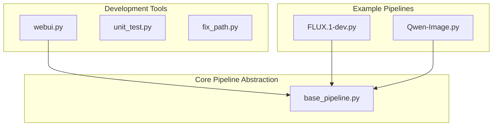
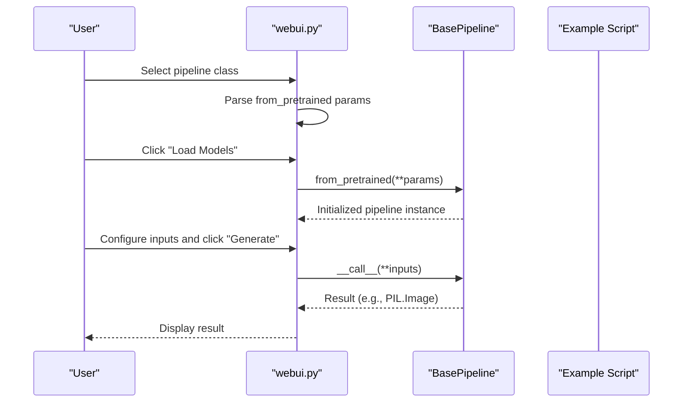
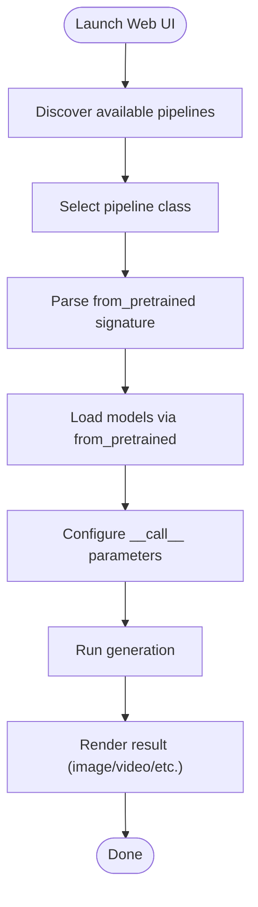
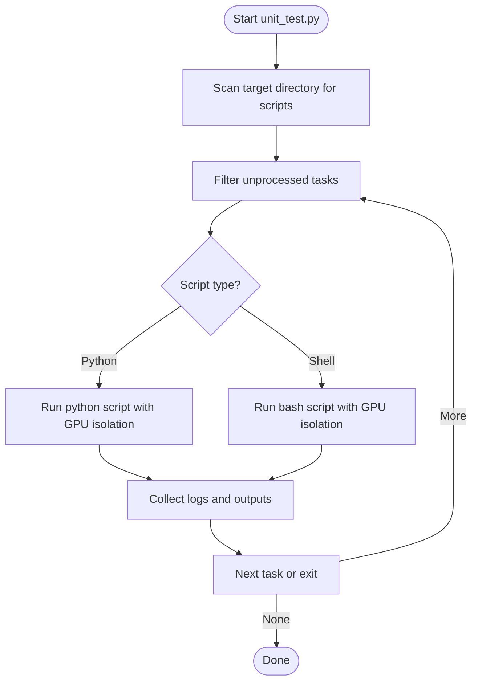
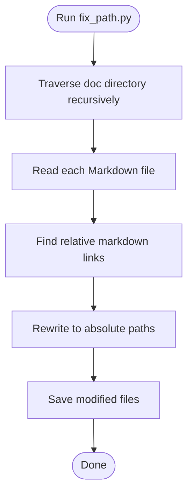
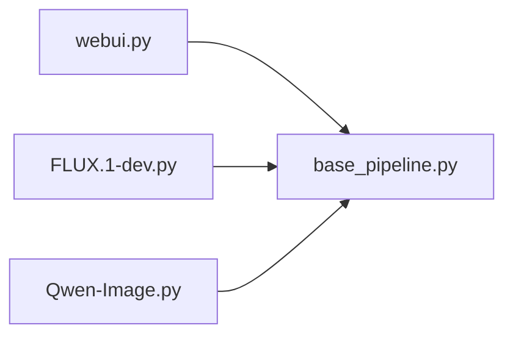

# Development Tools and Utilities

<cite>
**Referenced Files in This Document**
- [webui.py](file://examples/dev_tools/webui.py)
- [unit_test.py](file://examples/dev_tools/unit_test.py)
- [fix_path.py](file://examples/dev_tools/fix_path.py)
- [base_pipeline.py](file://diffsynth/diffusion/base_pipeline.py)
- [FLUX.1-dev.py](file://examples/flux/model_inference/FLUX.1-dev.py)
- [Qwen-Image.py](file://examples/qwen_image/model_inference/Qwen-Image.py)
</cite>

## Table of Contents
1. [Introduction](#introduction)
2. [Project Structure](#project-structure)
3. [Core Components](#core-components)
4. [Architecture Overview](#architecture-overview)
5. [Detailed Component Analysis](#detailed-component-analysis)
6. [Dependency Analysis](#dependency-analysis)
7. [Performance Considerations](#performance-considerations)
8. [Troubleshooting Guide](#troubleshooting-guide)
9. [Conclusion](#conclusion)
10. [Appendices](#appendices)

## Introduction
This document explains the development tools and utilities provided by the ODTSR-edit framework to streamline debugging, testing, and development workflows:
- Web UI for interactive model testing via Streamlit
- Unit testing harness for automated validation of inference and training scripts
- Path fixing utility for documentation links

These tools help you quickly validate new model integrations, iterate on prompts and parameters, and maintain consistent documentation paths across environments.

## Project Structure
The development tools are located under examples/dev_tools and integrate with the core pipeline abstractions in diffsynth.

**Diagram sources**
- [webui.py:1-332](file://examples/dev_tools/webui.py#L1-L332)
- [unit_test.py:1-122](file://examples/dev_tools/unit_test.py#L1-L122)
- [fix_path.py:1-43](file://examples/dev_tools/fix_path.py#L1-L43)
- [base_pipeline.py:1-200](file://diffsynth/diffusion/base_pipeline.py#L1-L200)
- [FLUX.1-dev.py:1-27](file://examples/flux/model_inference/FLUX.1-dev.py#L1-L27)
- [Qwen-Image.py:1-18](file://examples/qwen_image/model_inference/Qwen-Image.py#L1-L18)

**Section sources**
- [webui.py:1-332](file://examples/dev_tools/webui.py#L1-L332)
- [unit_test.py:1-122](file://examples/dev_tools/unit_test.py#L1-L122)
- [fix_path.py:1-43](file://examples/dev_tools/fix_path.py#L1-L43)
- [base_pipeline.py:1-200](file://diffsynth/diffusion/base_pipeline.py#L1-L200)
- [FLUX.1-dev.py:1-27](file://examples/flux/model_inference/FLUX.1-dev.py#L1-L27)
- [Qwen-Image.py:1-18](file://examples/qwen_image/model_inference/Qwen-Image.py#L1-L18)

## Core Components
- Web UI (Streamlit): Interactive interface to discover pipelines, parse parameters from type hints, load models, and run generation with live progress feedback.
- Unit Test Harness: Orchestrates running example scripts across GPUs, collects logs and outputs, and supports both single-GPU and multi-GPU scenarios.
- Path Fixer: Scans Markdown files and rewrites relative links to absolute paths for consistent documentation rendering.

Key capabilities:
- Automatic discovery of available pipelines and their parameters
- Dynamic UI generation based on function signatures
- GPU-aware execution and output collection
- Documentation link normalization

**Section sources**
- [webui.py:1-332](file://examples/dev_tools/webui.py#L1-L332)
- [unit_test.py:1-122](file://examples/dev_tools/unit_test.py#L1-L122)
- [fix_path.py:1-43](file://examples/dev_tools/fix_path.py#L1-L43)

## Architecture Overview
The Web UI leverages the base pipeline abstraction to dynamically introspect and instantiate pipelines. The unit test harness executes example scripts and aggregates results. The path fixer operates independently on documentation content.

**Diagram sources**
- [webui.py:266-332](file://examples/dev_tools/webui.py#L266-L332)
- [base_pipeline.py:61-120](file://diffsynth/diffusion/base_pipeline.py#L61-L120)
- [FLUX.1-dev.py:1-27](file://examples/flux/model_inference/FLUX.1-dev.py#L1-L27)
- [Qwen-Image.py:1-18](file://examples/qwen_image/model_inference/Qwen-Image.py#L1-L18)

## Detailed Component Analysis

### Web UI for Interactive Model Testing
- Discovers all pipeline classes that inherit from the base pipeline abstraction.
- Parses function signatures to generate dynamic UI elements for parameters such as strings, numbers, booleans, images, videos, and model configurations.
- Supports optional parsing of model configs from example scripts to prefill configuration fields.
- Integrates a Streamlit progress wrapper for long-running operations.

Usage workflow:
1. Choose a pipeline class and optionally select an example script to auto-parse model configs.
2. Configure parameters exposed by from_pretrained and click “Load Models”.
3. Configure call-time parameters and click “Generate” to produce outputs.

Extending the Web UI:
- Add support for additional parameter types by extending the type-detection logic and corresponding UI generators.
- Integrate custom input validators or default value providers.
- Add new output renderers for non-image results.

**Diagram sources**
- [webui.py:67-100](file://examples/dev_tools/webui.py#L67-L100)
- [webui.py:266-332](file://examples/dev_tools/webui.py#L266-L332)

**Section sources**
- [webui.py:1-332](file://examples/dev_tools/webui.py#L1-L332)

### Unit Testing Framework for Validating Implementations
- Scans directories for .py and .sh scripts and runs them sequentially or distributed across GPUs.
- Captures logs and moves generated media files into per-script output folders.
- Provides functions to run inference, single-GPU training, and multi-GPU training tasks.
- Includes predefined test suites for several model families.

Typical usage:
- Run inference tests across multiple example scripts.
- Execute training scripts with GPU isolation using CUDA_VISIBLE_DEVICES.
- Aggregate outputs and logs under data/<script_path>/<script>/log.txt.

Extending the unit test harness:
- Add new test functions that orchestrate relevant example directories.
- Customize filtering rules for unprocessed tasks.
- Integrate with CI systems by invoking specific test functions.

**Diagram sources**
- [unit_test.py:1-122](file://examples/dev_tools/unit_test.py#L1-L122)

**Section sources**
- [unit_test.py:1-122](file://examples/dev_tools/unit_test.py#L1-L122)

### Path Fixing Utilities for Development Environments
- Recursively scans Markdown files in specified directories.
- Rewrites relative links to absolute paths to ensure consistent rendering across environments.
- Useful for local documentation builds and cross-platform consistency.

Usage:
- Run the script pointing to your documentation root to normalize links.

Extending the path fixer:
- Adjust file extensions beyond .md if needed.
- Modify regex patterns to handle different link formats.
- Add dry-run mode for previewing changes.

**Diagram sources**
- [fix_path.py:1-43](file://examples/dev_tools/fix_path.py#L1-L43)

**Section sources**
- [fix_path.py:1-43](file://examples/dev_tools/fix_path.py#L1-L43)

## Dependency Analysis
The Web UI depends on the base pipeline abstraction to introspect and instantiate pipelines. Example scripts demonstrate typical usage patterns.

**Diagram sources**
- [webui.py:1-332](file://examples/dev_tools/webui.py#L1-L332)
- [base_pipeline.py:1-200](file://diffsynth/diffusion/base_pipeline.py#L1-L200)
- [FLUX.1-dev.py:1-27](file://examples/flux/model_inference/FLUX.1-dev.py#L1-L27)
- [Qwen-Image.py:1-18](file://examples/qwen_image/model_inference/Qwen-Image.py#L1-L18)

**Section sources**
- [webui.py:1-332](file://examples/dev_tools/webui.py#L1-L332)
- [base_pipeline.py:1-200](file://diffsynth/diffusion/base_pipeline.py#L1-L200)
- [FLUX.1-dev.py:1-27](file://examples/flux/model_inference/FLUX.1-dev.py#L1-L27)
- [Qwen-Image.py:1-18](file://examples/qwen_image/model_inference/Qwen-Image.py#L1-L18)

## Performance Considerations
- Use appropriate torch_dtype and device settings when loading models to balance speed and memory usage.
- Leverage VRAM management features in the base pipeline to offload and onload models during generation.
- For unit testing, distribute tasks across GPUs to maximize throughput while avoiding contention.
- In the Web UI, clear cached models between runs to prevent memory leaks.

[No sources needed since this section provides general guidance]

## Troubleshooting Guide
Common issues and resolutions:
- Pipeline not discovered: Ensure the pipeline class inherits from the base pipeline and is importable from the pipelines package.
- Parameter UI missing: Some complex types may not be supported; extend the Web UI’s type detection logic accordingly.
- GPU errors during unit tests: Verify CUDA_VISIBLE_DEVICES is set correctly and that scripts do not conflict over GPU resources.
- Documentation links broken: Run the path fixer against your documentation root to normalize links.

**Section sources**
- [webui.py:180-263](file://examples/dev_tools/webui.py#L180-L263)
- [unit_test.py:36-72](file://examples/dev_tools/unit_test.py#L36-L72)
- [fix_path.py:16-41](file://examples/dev_tools/fix_path.py#L16-L41)

## Conclusion
The ODTSR-edit framework provides practical development tools to accelerate model integration and validation:
- The Web UI enables rapid iteration over prompts and parameters with live feedback.
- The unit test harness automates validation across inference and training scripts with GPU awareness.
- The path fixer ensures consistent documentation rendering across environments.

By extending these tools, you can tailor them to your project’s needs and integrate them into custom development pipelines.

[No sources needed since this section summarizes without analyzing specific files]

## Appendices

### How to Use the Web UI for Debugging New Model Integrations
- Create or update an example script that constructs a pipeline using from_pretrained with ModelConfig entries.
- Launch the Web UI, select your pipeline class, and optionally parse model configs from your example script.
- Adjust parameters and run generation to verify behavior and performance.

**Section sources**
- [FLUX.1-dev.py:1-27](file://examples/flux/model_inference/FLUX.1-dev.py#L1-L27)
- [Qwen-Image.py:1-18](file://examples/qwen_image/model_inference/Qwen-Image.py#L1-L18)
- [webui.py:266-332](file://examples/dev_tools/webui.py#L266-L332)

### Extending the Unit Test Harness
- Add a new test function that calls run_inference or run_train_single_GPU/run_train_multi_GPU with your target directories.
- Customize filtering rules to include or exclude specific scripts.
- Integrate with CI by invoking the test function programmatically.

**Section sources**
- [unit_test.py:1-122](file://examples/dev_tools/unit_test.py#L1-L122)

### Integrating Tools into Custom Pipelines
- Wrap your custom training or inference scripts to emit structured logs and artifacts for easy aggregation.
- Use the Web UI’s parameter introspection pattern to build custom dashboards for your models.
- Apply the path fixer in pre-commit hooks to keep documentation links consistent.

[No sources needed since this section provides general guidance]