# Examples and Tutorials

<cite>
**Referenced Files in This Document**
- [FLUX.1-dev.py](file://examples/flux/model_inference/FLUX.1-dev.py)
- [FLUX.1-dev (low VRAM).py](file://examples/flux/model_inference_low_vram/FLUX.1-dev.py)
- [train.py (FLUX)](file://examples/flux/model_training/train.py)
- [FLUX.1-dev.sh](file://examples/flux/model_training/full/FLUX.1-dev.sh)
- [Qwen-Image.py](file://examples/qwen_image/model_inference/Qwen-Image.py)
- [LTX-2-T2AV-OneStage.py](file://examples/ltx2/model_inference/LTX-2-T2AV-OneStage.py)
- [LTX-2-T2AV-OneStage (low VRAM).py](file://examples/ltx2/model_inference_low_vram/LTX-2-T2AV-OneStage.py)
- [Wan2.1-T2V-14B.py](file://examples/wanvideo/model_inference/Wan2.1-T2V-14B.py)
- [Wan2.1-T2V-14B (low VRAM).py](file://examples/wanvideo/model_inference_low_vram/Wan2.1-T2V-14B.py)
- [Model_Inference.md](file://docs/en/Pipeline_Usage/Model_Inference.md)
</cite>

## Table of Contents
1. Introduction
2. Project Structure
3. Core Components
4. Architecture Overview
5. Detailed Component Analysis
6. Dependency Analysis
7. Performance Considerations
8. Troubleshooting Guide
9. Conclusion
10. Appendices

## Introduction
This document provides comprehensive examples and tutorials for ODTSR-edit, focusing on practical usage across major model families: FLUX (image), Qwen-Image (image), LTX-2 (audio-video), and Wan Video (text-to-video). You will find step-by-step guides for inference, training, low-memory inference, and advanced usage patterns. The goal is to help you run the included example scripts, adapt them for custom datasets and tasks, and optimize performance for research and production environments.

## Project Structure
The examples are organized by model family under the examples directory. Each family typically includes:
- model_inference: standard inference scripts
- model_inference_low_vram: memory-efficient inference variants
- model_training: full and LoRA training scripts with configuration files

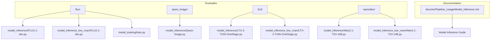

**Section sources**
- [FLUX.1-dev.py](file://examples/flux/model_inference/FLUX.1-dev.py)
- [FLUX.1-dev (low VRAM).py](file://examples/flux/model_inference_low_vram/FLUX.1-dev.py)
- [train.py (FLUX)](file://examples/flux/model_training/train.py)
- [Qwen-Image.py](file://examples/qwen_image/model_inference/Qwen-Image.py)
- [LTX-2-T2AV-OneStage.py](file://examples/ltx2/model_inference/LTX-2-T2AV-OneStage.py)
- [LTX-2-T2AV-OneStage (low VRAM).py](file://examples/ltx2/model_inference_low_vram/LTX-2-T2AV-OneStage.py)
- [Wan2.1-T2V-14B.py](file://examples/wanvideo/model_inference/Wan2.1-T2V-14B.py)
- [Wan2.1-T2V-14B (low VRAM).py](file://examples/wanvideo/model_inference_low_vram/Wan2.1-T2V-14B.py)
- [Model_Inference.md](file://docs/en/Pipeline_Usage/Model_Inference.md)

## Core Components
- Pipelines: High-level interfaces for each model family that encapsulate model loading, tokenization, diffusion steps, and output handling.
- ModelConfig: Declarative specification of model components, file patterns, and optional VRAM management settings.
- TrainingModule: Encapsulates dataset loading, pipeline wiring, loss selection, and training orchestration for SFT or distillation tasks.
- Data utilities: Image/video/audio I/O helpers and dataset operators used by both inference and training.

Key responsibilities:
- Pipeline.from_pretrained(configs): loads models and optionally applies VRAM strategies.
- Pipe callables: accept prompts, seeds, sizes, and other generation parameters; return images or video+audio.
- TrainingModule: prepares inputs, runs units, computes losses, and integrates with Accelerate.

**Section sources**
- [Model_Inference.md](file://docs/en/Pipeline_Usage/Model_Inference.md)
- [train.py (FLUX)](file://examples/flux/model_training/train.py)

## Architecture Overview
The typical flow for inference and training is consistent across model families:
- Load a pipeline with ModelConfig entries for each component (e.g., transformer, text encoders, VAE, audio vocoder).
- For inference, call the pipeline with prompt and generation parameters.
- For training, wrap the pipeline in a TrainingModule, define dataset inputs, and launch via Accelerate.

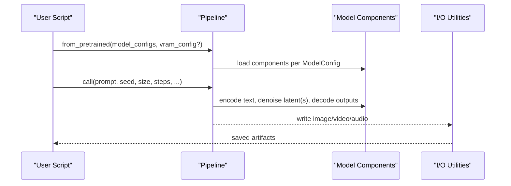

**Diagram sources**
- [FLUX.1-dev.py](file://examples/flux/model_inference/FLUX.1-dev.py)
- [Qwen-Image.py](file://examples/qwen_image/model_inference/Qwen-Image.py)
- [LTX-2-T2AV-OneStage.py](file://examples/ltx2/model_inference/LTX-2-T2AV-OneStage.py)
- [Wan2.1-T2V-14B.py](file://examples/wanvideo/model_inference/Wan2.1-T2V-14B.py)

## Detailed Component Analysis

### FLUX Image Generation (Inference)
- Purpose: Generate high-quality images from text prompts using the FLUX pipeline.
- Key steps:
  - Initialize FluxImagePipeline with ModelConfig entries for transformer, text encoders, and VAE.
  - Call the pipeline with prompt and optional negative_prompt, seed, cfg_scale, num_inference_steps.
  - Save the resulting image.

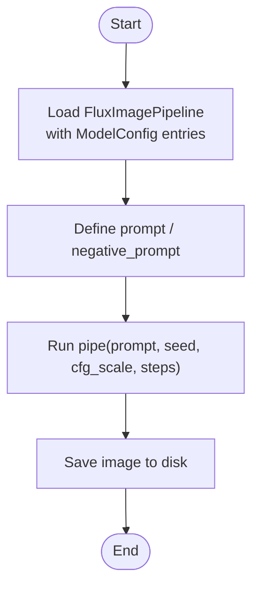

**Diagram sources**
- [FLUX.1-dev.py](file://examples/flux/model_inference/FLUX.1-dev.py)

**Section sources**
- [FLUX.1-dev.py](file://examples/flux/model_inference/FLUX.1-dev.py)

### FLUX Low-Memory Inference
- Purpose: Run FLUX inference when GPU memory is limited.
- Key techniques:
  - Configure vram_config with offload/onload/preparing/computation dtypes and devices.
  - Use float8 offload types where supported to reduce memory footprint.
  - Optionally set vram_limit to constrain peak memory usage.

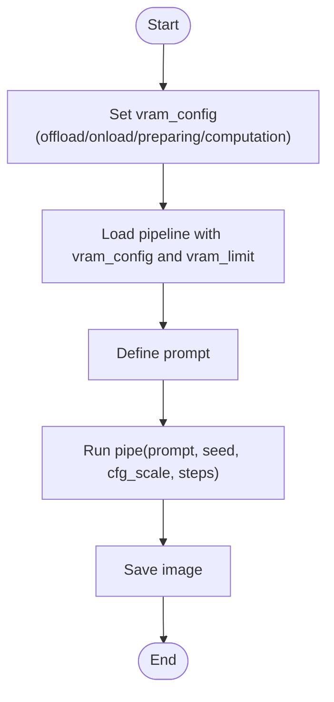

**Diagram sources**
- [FLUX.1-dev (low VRAM).py](file://examples/flux/model_inference_low_vram/FLUX.1-dev.py)

**Section sources**
- [FLUX.1-dev (low VRAM).py](file://examples/flux/model_inference_low_vram/FLUX.1-dev.py)

### FLUX Training (Full Fine-Tuning)
- Purpose: Train the DiT backbone (or other trainable modules) using supervised fine-tuning or direct distillation.
- Key steps:
  - Define FluxTrainingModule subclassing DiffusionTrainingModule.
  - Provide dataset paths and metadata; configure image operators and sizes.
  - Choose task (e.g., sft, direct_distill) and set gradient checkpointing/offload.
  - Launch with Accelerate and save checkpoints with optional LoRA format conversion.

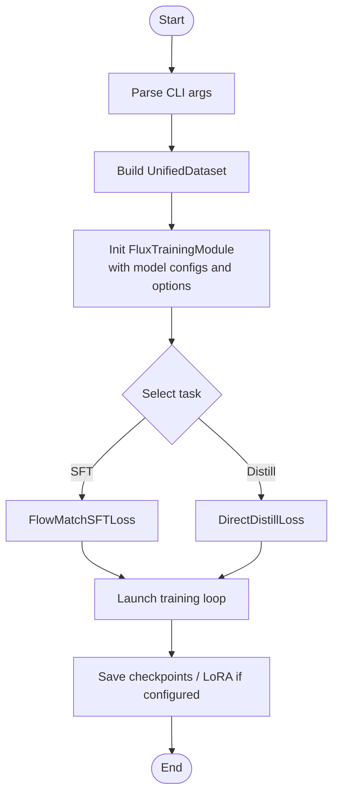

**Diagram sources**
- [train.py (FLUX)](file://examples/flux/model_training/train.py)

**Section sources**
- [train.py (FLUX)](file://examples/flux/model_training/train.py)
- [FLUX.1-dev.sh](file://examples/flux/model_training/full/FLUX.1-dev.sh)

### Qwen-Image Inference
- Purpose: Generate images using the Qwen-Image pipeline.
- Key steps:
  - Initialize QwenImagePipeline with ModelConfig entries for transformer, text encoder, and VAE.
  - Call the pipeline with a prompt and generation parameters.
  - Save the generated image.

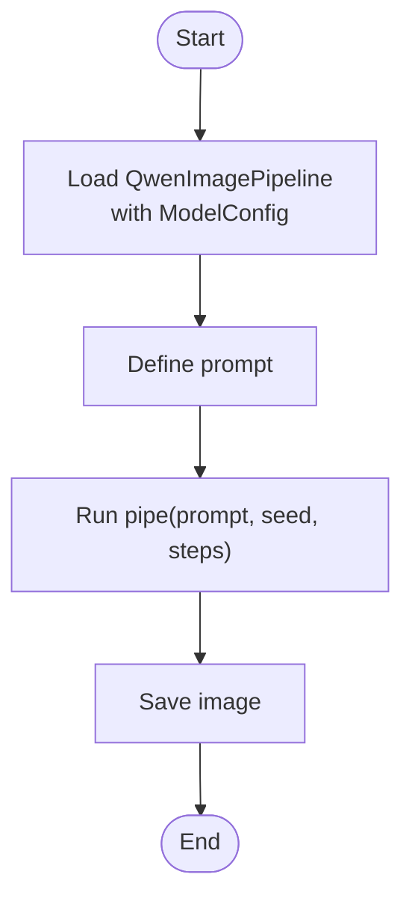

**Diagram sources**
- [Qwen-Image.py](file://examples/qwen_image/model_inference/Qwen-Image.py)

**Section sources**
- [Qwen-Image.py](file://examples/qwen_image/model_inference/Qwen-Image.py)

### LTX-2 Audio-Video Generation (One-Stage)
- Purpose: Generate synchronized video and audio from text prompts using LTX-2.
- Key steps:
  - Initialize LTX2AudioVideoPipeline with ModelConfig entries for text encoder, transformer, video VAE decoder, audio VAE decoder, and audio vocoder.
  - Call the pipeline with prompt, dimensions, number of frames, and tiled mode.
  - Write video and audio to an MP4 file using media I/O utilities.

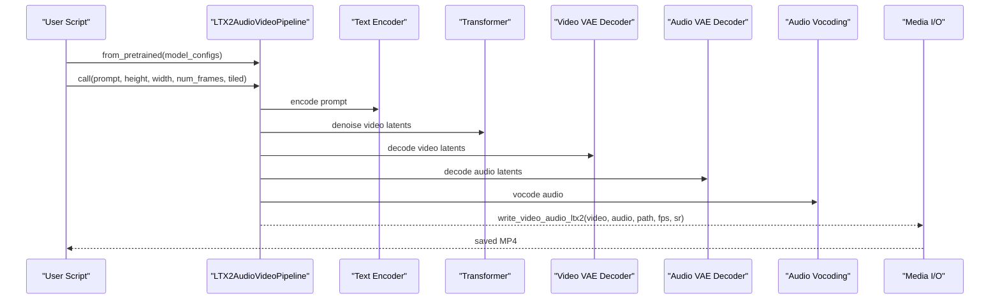

**Diagram sources**
- [LTX-2-T2AV-OneStage.py](file://examples/ltx2/model_inference/LTX-2-T2AV-OneStage.py)

**Section sources**
- [LTX-2-T2AV-OneStage.py](file://examples/ltx2/model_inference/LTX-2-T2AV-OneStage.py)

### LTX-2 Low-Memory Inference
- Purpose: Reduce VRAM usage during LTX-2 generation.
- Key techniques:
  - Configure vram_config with appropriate offload/onload dtypes (e.g., float8_e5m2) and devices.
  - Set vram_limit to cap memory usage.
  - Keep tiled=True to process large frames efficiently.

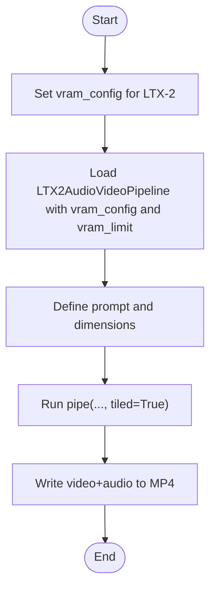

**Diagram sources**
- [LTX-2-T2AV-OneStage (low VRAM).py](file://examples/ltx2/model_inference_low_vram/LTX-2-T2AV-OneStage.py)

**Section sources**
- [LTX-2-T2AV-OneStage (low VRAM).py](file://examples/ltx2/model_inference_low_vram/LTX-2-T2AV-OneStage.py)

### Wan Video Text-to-Video
- Purpose: Generate videos from text prompts using Wan2.1 pipelines.
- Key steps:
  - Initialize WanVideoPipeline with ModelConfig entries for diffusion model, text encoder, and VAE.
  - Call the pipeline with prompt and generation parameters; use tiled=True for efficiency.
  - Save the video using utility functions.

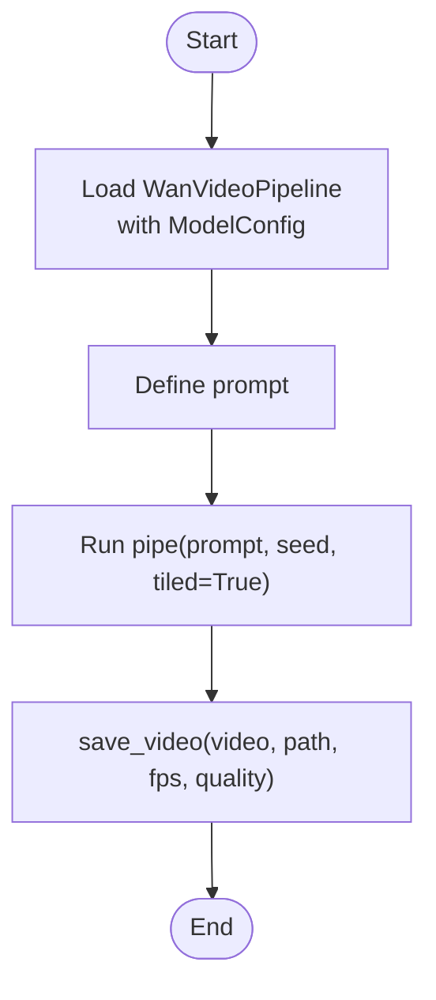

**Diagram sources**
- [Wan2.1-T2V-14B.py](file://examples/wanvideo/model_inference/Wan2.1-T2V-14B.py)

**Section sources**
- [Wan2.1-T2V-14B.py](file://examples/wanvideo/model_inference/Wan2.1-T2V-14B.py)

### Wan Video Low-Memory Inference
- Purpose: Run Wan Video inference under tight memory constraints.
- Key techniques:
  - Configure vram_config with offload_device="disk" and appropriate dtypes.
  - Set vram_limit to reserve headroom.
  - Use tiled=True to reduce peak memory during generation.

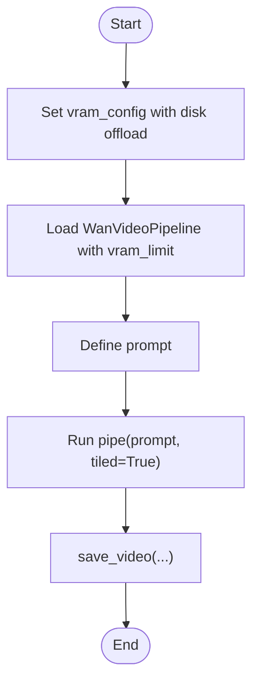

**Diagram sources**
- [Wan2.1-T2V-14B (low VRAM).py](file://examples/wanvideo/model_inference_low_vram/Wan2.1-T2V-14B.py)

**Section sources**
- [Wan2.1-T2V-14B (low VRAM).py](file://examples/wanvideo/model_inference_low_vram/Wan2.1-T2V-14B.py)

### Conceptual Overview
The following conceptual diagram summarizes how pipelines, model components, and utilities interact across tasks:

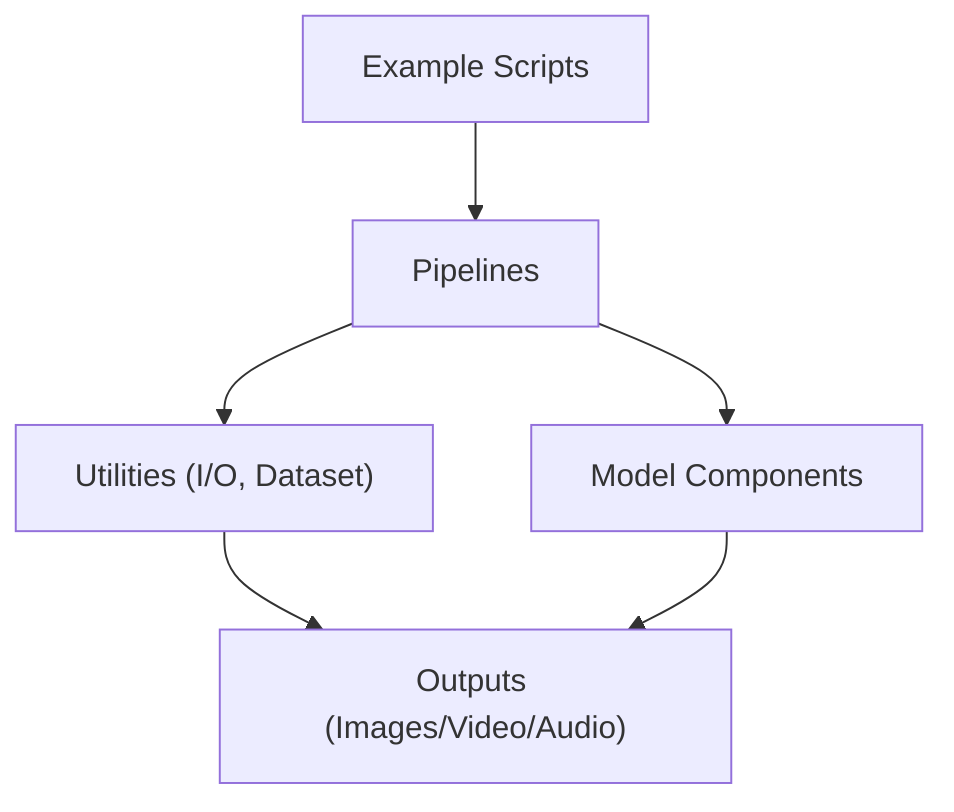

[No sources needed since this diagram shows conceptual workflow, not actual code structure]

## Dependency Analysis
- Pipelines depend on ModelConfig to locate and load model weights and tokenizers.
- Training scripts depend on DiffusionTrainingModule base classes and Accelerate for distributed execution.
- I/O utilities handle saving images/videos and writing audio alongside video.

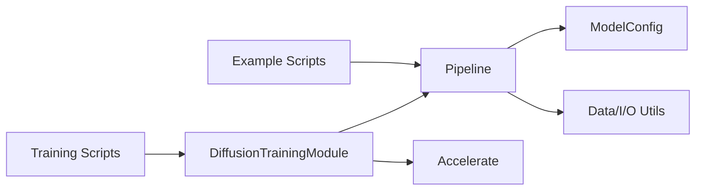

**Diagram sources**
- [Model_Inference.md](file://docs/en/Pipeline_Usage/Model_Inference.md)
- [train.py (FLUX)](file://examples/flux/model_training/train.py)

**Section sources**
- [Model_Inference.md](file://docs/en/Pipeline_Usage/Model_Inference.md)
- [train.py (FLUX)](file://examples/flux/model_training/train.py)

## Performance Considerations
- Precision: Prefer bfloat16 for computation; use float8 for offloaded tensors where supported to reduce memory.
- Memory management:
  - Use vram_config to control offload/onload/preparing dtypes and devices.
  - Set vram_limit to cap memory usage and avoid OOM.
- Tiling: Enable tiled mode for large images/videos to reduce peak memory.
- Gradient checkpointing: Enable during training to trade compute for memory.
- Tokenizer and encoder reuse: Avoid redundant loading by using repackaged checkpoints when available.

[No sources needed since this section provides general guidance]

## Troubleshooting Guide
Common issues and resolutions:
- Insufficient VRAM:
  - Switch to low-vram scripts and enable vram_config with float8 offload.
  - Reduce resolution, frame count, or disable unnecessary components.
- Slow inference:
  - Disable VRAM offloading for cold-load scenarios if possible.
  - Use fewer inference steps or distilled pipelines where available.
- Missing model files:
  - Ensure correct origin_file_pattern and model_id.
  - Check environment variables for download source and skip-download flags.
- Training errors:
  - Verify dataset metadata and paths.
  - Confirm tokenizer paths and model_ids match expected formats.
  - Use gradient checkpointing and lower batch sizes if OOM occurs.

**Section sources**
- [Model_Inference.md](file://docs/en/Pipeline_Usage/Model_Inference.md)
- [FLUX.1-dev (low VRAM).py](file://examples/flux/model_inference_low_vram/FLUX.1-dev.py)
- [LTX-2-T2AV-OneStage (low VRAM).py](file://examples/ltx2/model_inference_low_vram/LTX-2-T2AV-OneStage.py)
- [Wan2.1-T2V-14B (low VRAM).py](file://examples/wanvideo/model_inference_low_vram/Wan2.1-T2V-14B.py)
- [train.py (FLUX)](file://examples/flux/model_training/train.py)

## Conclusion
You now have complete working examples for image and audio-video generation, along with training workflows for FLUX. The provided low-memory inference patterns and performance tips should help you adapt these examples to your own datasets and deployment constraints. Use the documented structures to extend pipelines, integrate new models, and scale training and inference reliably.

[No sources needed since this section summarizes without analyzing specific files]

## Appendices

### Step-by-Step Tutorials

#### Tutorial 1: Image Generation with FLUX
- Steps:
  - Install dependencies and ensure CUDA availability.
  - Run the FLUX inference script to generate an image from a prompt.
  - Adjust seed, cfg_scale, and steps to control quality and speed.
- Adaptation:
  - Replace model_id and origin_file_pattern to point to your local or remote checkpoints.
  - Add negative_prompt for style control.

**Section sources**
- [FLUX.1-dev.py](file://examples/flux/model_inference/FLUX.1-dev.py)

#### Tutorial 2: Low-Memory FLUX Inference
- Steps:
  - Use the low-vram script with vram_config and vram_limit.
  - Run inference and verify memory usage remains within limits.
- Adaptation:
  - Tune offload_dtype and computation_dtype based on hardware capabilities.
  - Combine with smaller resolutions or fewer steps for constrained environments.

**Section sources**
- [FLUX.1-dev (low VRAM).py](file://examples/flux/model_inference_low_vram/FLUX.1-dev.py)

#### Tutorial 3: Training FLUX (Full Fine-Tuning)
- Steps:
  - Prepare dataset and metadata CSV.
  - Run the training shell script with accelerate config.
  - Monitor logs and checkpoints; evaluate results periodically.
- Adaptation:
  - Modify dataset_base_path and metadata_path.
  - Adjust learning_rate, num_epochs, and max_pixels for your data.

**Section sources**
- [FLUX.1-dev.sh](file://examples/flux/model_training/full/FLUX.1-dev.sh)
- [train.py (FLUX)](file://examples/flux/model_training/train.py)

#### Tutorial 4: Image Generation with Qwen-Image
- Steps:
  - Initialize QwenImagePipeline with ModelConfig entries.
  - Call the pipeline with a prompt and save the result.
- Adaptation:
  - Swap model_id and origin_file_pattern for alternative checkpoints.
  - Experiment with different seeds and steps.

**Section sources**
- [Qwen-Image.py](file://examples/qwen_image/model_inference/Qwen-Image.py)

#### Tutorial 5: Audio-Video Generation with LTX-2
- Steps:
  - Initialize LTX2AudioVideoPipeline with required components.
  - Generate video and audio from a prompt; write to MP4.
- Adaptation:
  - Change height, width, and num_frames to target desired resolution and length.
  - Use tiled=True for larger outputs.

**Section sources**
- [LTX-2-T2AV-OneStage.py](file://examples/ltx2/model_inference/LTX-2-T2AV-OneStage.py)

#### Tutorial 6: Low-Memory LTX-2 Inference
- Steps:
  - Apply vram_config with float8 offload and set vram_limit.
  - Generate video+audio while monitoring memory.
- Adaptation:
  - Reduce frame count or resolution if necessary.
  - Optimize dtype choices based on device support.

**Section sources**
- [LTX-2-T2AV-OneStage (low VRAM).py](file://examples/ltx2/model_inference_low_vram/LTX-2-T2AV-OneStage.py)

#### Tutorial 7: Text-to-Video with Wan2.1
- Steps:
  - Initialize WanVideoPipeline with ModelConfig entries.
  - Generate video from a prompt and save it.
- Adaptation:
  - Modify prompt and negative_prompt for content control.
  - Adjust fps and quality when saving.

**Section sources**
- [Wan2.1-T2V-14B.py](file://examples/wanvideo/model_inference/Wan2.1-T2V-14B.py)

#### Tutorial 8: Low-Memory Wan Video Inference
- Steps:
  - Use vram_config with disk offload and set vram_limit.
  - Generate video with tiled mode enabled.
- Adaptation:
  - Lower resolution or frame count for very constrained setups.
  - Balance offload dtype vs. computation dtype for speed/memory trade-offs.

**Section sources**
- [Wan2.1-T2V-14B (low VRAM).py](file://examples/wanvideo/model_inference_low_vram/Wan2.1-T2V-14B.py)

### Extending Examples for Research and Production
- Custom datasets:
  - Implement UnifiedDataset operators to preprocess images/videos according to your domain.
  - Ensure metadata CSV aligns with expected keys (prompt, image paths, etc.).
- New models:
  - Create a new Pipeline class and corresponding ModelConfig entries.
  - Integrate with DiffusionTrainingModule for training support.
- Production optimization:
  - Pre-warm models and reuse pipelines across requests.
  - Cache tokenized prompts and intermediate features where safe.
  - Profile memory and throughput; adjust vram_config and tiled modes accordingly.

[No sources needed since this section provides general guidance]