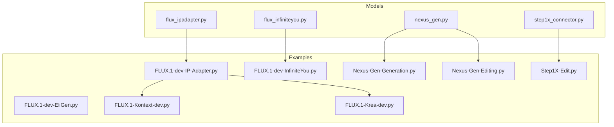
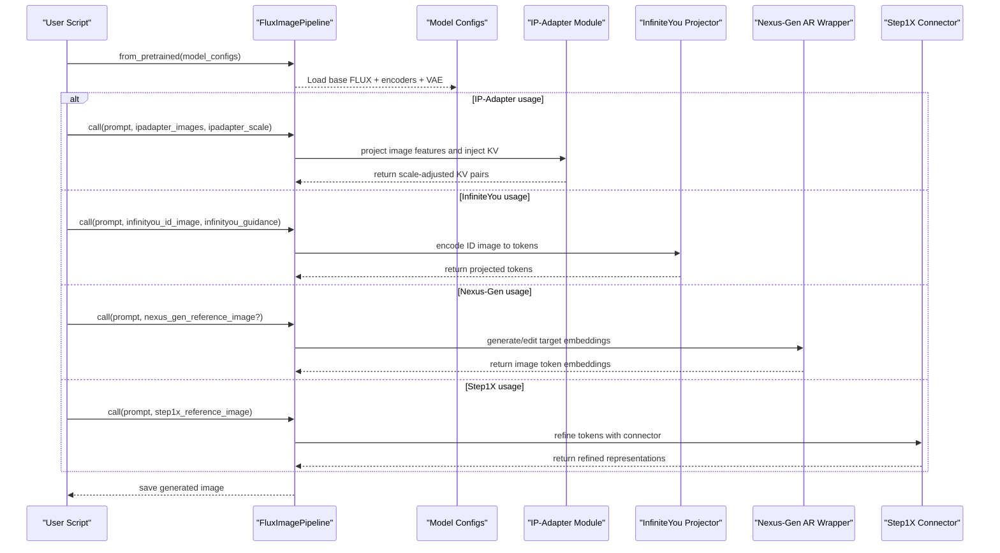
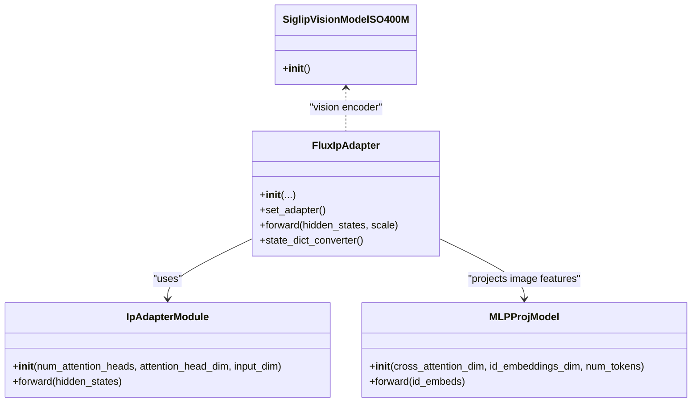
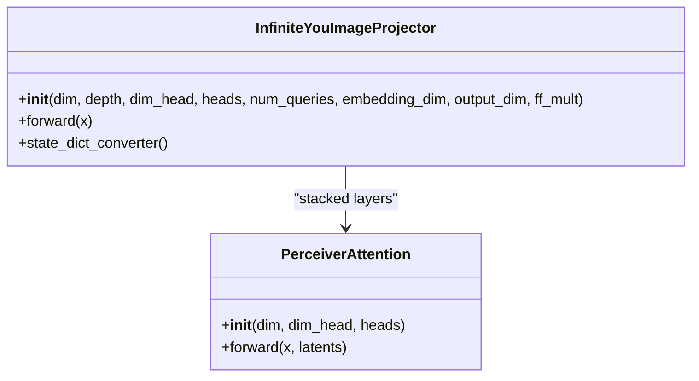
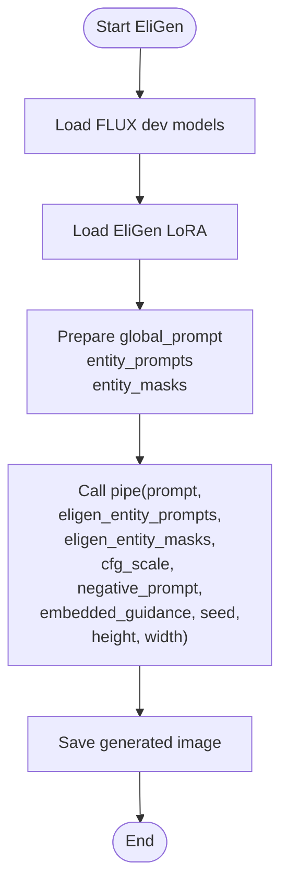
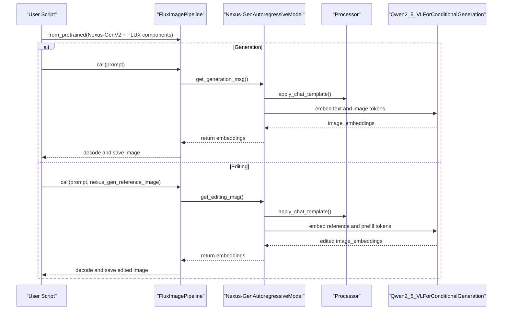
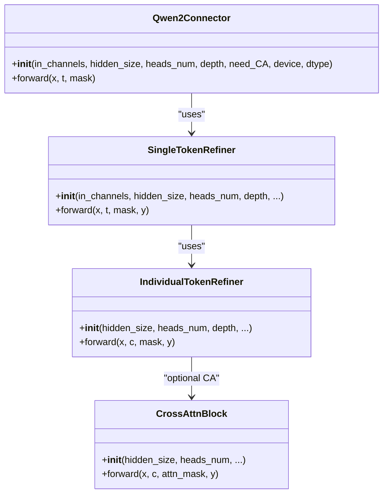
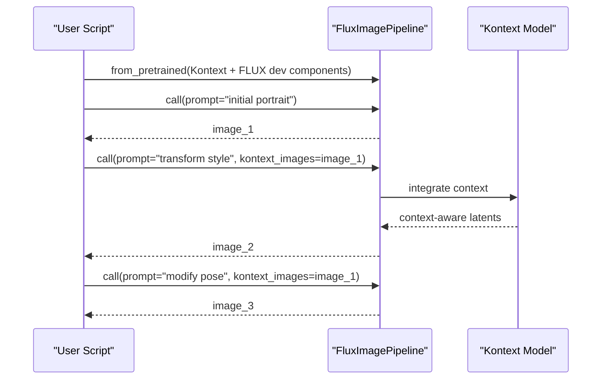
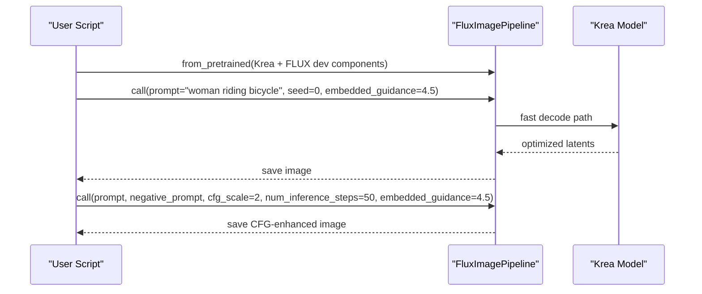
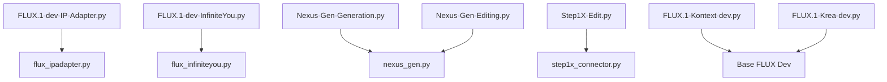

# Advanced FLUX Features

<cite>
**Referenced Files in This Document**
- [flux_ipadapter.py](file://diffsynth/models/flux_ipadapter.py)
- [flux_infiniteyou.py](file://diffsynth/models/flux_infiniteyou.py)
- [nexus_gen.py](file://diffsynth/models/nexus_gen.py)
- [step1x_connector.py](file://diffsynth/models/step1x_connector.py)
- [FLUX.1-dev-IP-Adapter.py](file://examples/flux/model_inference/FLUX.1-dev-IP-Adapter.py)
- [FLUX.1-dev-InfiniteYou.py](file://examples/flux/model_inference/FLUX.1-dev-InfiniteYou.py)
- [FLUX.1-dev-EliGen.py](file://examples/flux/model_inference/FLUX.1-dev-EliGen.py)
- [Nexus-Gen-Generation.py](file://examples/flux/model_inference/Nexus-Gen-Generation.py)
- [Nexus-Gen-Editing.py](file://examples/flux/model_inference/Nexus-Gen-Editing.py)
- [Step1X-Edit.py](file://examples/flux/model_inference/Step1X-Edit.py)
- [FLUX.1-Kontext-dev.py](file://examples/flux/model_inference/FLUX.1-Kontext-dev.py)
- [FLUX.1-Krea-dev.py](file://examples/flux/model_inference/FLUX.1-Krea-dev.py)
</cite>

## Table of Contents
1. [Introduction](#introduction)
2. [Project Structure](#project-structure)
3. [Core Components](#core-components)
4. [Architecture Overview](#architecture-overview)
5. [Detailed Component Analysis](#detailed-component-analysis)
6. [Dependency Analysis](#dependency-analysis)
7. [Performance Considerations](#performance-considerations)
8. [Troubleshooting Guide](#troubleshooting-guide)
9. [Conclusion](#conclusion)
10. [Appendices](#appendices)

## Introduction
This document explains advanced FLUX model features for image generation and editing: IP-Adapter for style transfer and image conditioning, InfiniteYou for consistent character generation, EliGen for creative entity-controlled generation, Nexus-Gen for text-to-image and editing workflows, Step1X for editing pipelines, Kontext for context-aware generation, and Krea for real-time generation. For each feature, we describe purpose, use cases, setup, parameter configuration, and practical examples grounded in the repository’s example scripts and model modules.

## Project Structure
The relevant code is organized into:
- Model implementations under diffsynth/models for specialized adapters and connectors (e.g., IP-Adapter, InfiniteYou projector, Nexus-Gen AR model wrapper, Step1X connector).
- Example inference scripts under examples/flux/model_inference demonstrating how to load models via FluxImagePipeline and configure parameters.

**Diagram sources**
- [flux_ipadapter.py:1-111](file://diffsynth/models/flux_ipadapter.py#L1-L111)
- [flux_infiniteyou.py:1-130](file://diffsynth/models/flux_infiniteyou.py#L1-L130)
- [nexus_gen.py:1-162](file://diffsynth/models/nexus_gen.py#L1-L162)
- [step1x_connector.py:1-664](file://diffsynth/models/step1x_connector.py#L1-L664)
- [FLUX.1-dev-IP-Adapter.py:1-25](file://examples/flux/model_inference/FLUX.1-dev-IP-Adapter.py#L1-L25)
- [FLUX.1-dev-InfiniteYou.py:1-61](file://examples/flux/model_inference/FLUX.1-dev-InfiniteYou.py#L1-L61)
- [FLUX.1-dev-EliGen.py:1-134](file://examples/flux/model_inference/FLUX.1-dev-EliGen.py#L1-L134)
- [Nexus-Gen-Generation.py:1-33](file://examples/flux/model_inference/Nexus-Gen-Generation.py#L1-L33)
- [Nexus-Gen-Editing.py:1-38](file://examples/flux/model_inference/Nexus-Gen-Editing.py#L1-L38)
- [Step1X-Edit.py:1-33](file://examples/flux/model_inference/Step1X-Edit.py#L1-L33)
- [FLUX.1-Kontext-dev.py:1-54](file://examples/flux/model_inference/FLUX.1-Kontext-dev.py#L1-L54)
- [FLUX.1-Krea-dev.py:1-28](file://examples/flux/model_inference/FLUX.1-Krea-dev.py#L1-L28)

**Section sources**
- [flux_ipadapter.py:1-111](file://diffsynth/models/flux_ipadapter.py#L1-L111)
- [flux_infiniteyou.py:1-130](file://diffsynth/models/flux_infiniteyou.py#L1-L130)
- [nexus_gen.py:1-162](file://diffsynth/models/nexus_gen.py#L1-L162)
- [step1x_connector.py:1-664](file://diffsynth/models/step1x_connector.py#L1-L664)
- [FLUX.1-dev-IP-Adapter.py:1-25](file://examples/flux/model_inference/FLUX.1-dev-IP-Adapter.py#L1-L25)
- [FLUX.1-dev-InfiniteYou.py:1-61](file://examples/flux/model_inference/FLUX.1-dev-InfiniteYou.py#L1-L61)
- [FLUX.1-dev-EliGen.py:1-134](file://examples/flux/model_inference/FLUX.1-dev-EliGen.py#L1-L134)
- [Nexus-Gen-Generation.py:1-33](file://examples/flux/model_inference/Nexus-Gen-Generation.py#L1-L33)
- [Nexus-Gen-Editing.py:1-38](file://examples/flux/model_inference/Nexus-Gen-Editing.py#L1-L38)
- [Step1X-Edit.py:1-33](file://examples/flux/model_inference/Step1X-Edit.py#L1-L33)
- [FLUX.1-Kontext-dev.py:1-54](file://examples/flux/model_inference/FLUX.1-Kontext-dev.py#L1-L54)
- [FLUX.1-Krea-dev.py:1-28](file://examples/flux/model_inference/FLUX.1-Krea-dev.py#L1-L28)

## Core Components
- IP-Adapter: Adds image-conditioning branches that inject visual features into attention blocks via learned projections and per-block key/value adapters.
- InfiniteYou: Provides a Perceiver-style image projector that converts identity embeddings into high-dimensional tokens for consistent character generation.
- Nexus-Gen: Wraps an autoregressive vision-language model to produce image token embeddings conditioned on text and optional reference images; supports both generation and editing modes.
- Step1X Connector: Supplies a connector module with timestep/context embedders and refiner blocks used by the Step1X editing pipeline.

Key responsibilities:
- Feature extraction and projection (SigLIP for IP-Adapter, Perceiver for InfiniteYou).
- Token embedding generation and masking for autoregressive decoding (Nexus-Gen).
- Contextual modulation and refinement for editing (Step1X connector).

**Section sources**
- [flux_ipadapter.py:1-111](file://diffsynth/models/flux_ipadapter.py#L1-L111)
- [flux_infiniteyou.py:1-130](file://diffsynth/models/flux_infiniteyou.py#L1-L130)
- [nexus_gen.py:1-162](file://diffsynth/models/nexus_gen.py#L1-L162)
- [step1x_connector.py:1-664](file://diffsynth/models/step1x_connector.py#L1-L664)

## Architecture Overview
The pipeline integrates multiple specialized components through a unified inference interface. The following diagram shows how example scripts instantiate the pipeline and connect model components.

**Diagram sources**
- [FLUX.1-dev-IP-Adapter.py:1-25](file://examples/flux/model_inference/FLUX.1-dev-IP-Adapter.py#L1-L25)
- [FLUX.1-dev-InfiniteYou.py:1-61](file://examples/flux/model_inference/FLUX.1-dev-InfiniteYou.py#L1-L61)
- [Nexus-Gen-Generation.py:1-33](file://examples/flux/model_inference/Nexus-Gen-Generation.py#L1-L33)
- [Nexus-Gen-Editing.py:1-38](file://examples/flux/model_inference/Nexus-Gen-Editing.py#L1-L38)
- [Step1X-Edit.py:1-33](file://examples/flux/model_inference/Step1X-Edit.py#L1-L33)
- [flux_ipadapter.py:1-111](file://diffsynth/models/flux_ipadapter.py#L1-L111)
- [flux_infiniteyou.py:1-130](file://diffsynth/models/flux_infiniteyou.py#L1-L130)
- [nexus_gen.py:1-162](file://diffsynth/models/nexus_gen.py#L1-L162)
- [step1x_connector.py:1-664](file://diffsynth/models/step1x_connector.py#L1-L664)

## Detailed Component Analysis

### IP-Adapter for Style Transfer and Image Conditioning
Purpose:
- Inject visual style or content from a reference image into FLUX generation via cross-attention adapters.

Use cases:
- Style transfer from a generated or external image.
- Content conditioning where a reference image influences composition or palette.

Setup:
- Load base FLUX dev models plus IP-Adapter weights and SigLIP vision encoder via ModelConfig list.
- Provide ipadapter_images and ipadapter_scale at inference time.

Parameter configuration:
- ipadapter_images: reference image(s) to condition on.
- ipadapter_scale: strength of adapter influence.

Practical example:
- Generate a style image first, then reuse it as ipadapter_images to steer subsequent prompts.

**Diagram sources**
- [flux_ipadapter.py:1-111](file://diffsynth/models/flux_ipadapter.py#L1-L111)

**Section sources**
- [flux_ipadapter.py:1-111](file://diffsynth/models/flux_ipadapter.py#L1-L111)
- [FLUX.1-dev-IP-Adapter.py:1-25](file://examples/flux/model_inference/FLUX.1-dev-IP-Adapter.py#L1-L25)

### InfiniteYou for Consistent Character Generation
Purpose:
- Encode identity information from an ID image into tokens that guide FLUX to maintain consistent character appearance across generations.

Use cases:
- Portrait generation with consistent faces.
- Multi-shot character consistency across scenes.

Setup:
- Install additional dependencies (facexlib, insightface, onnxruntime) as indicated in the example script.
- Download required support files and model weights via snapshot_download.
- Load base FLUX dev models plus InfiniteYou image_proj and InfuseNetModel weights.

Parameter configuration:
- infinityou_id_image: input ID image.
- infinityou_guidance: strength of identity guidance.
- controlnet_inputs: can be provided (example uses empty placeholder).

Practical example:
- Provide different prompts while keeping the same ID image to generate consistent characters.

**Diagram sources**
- [flux_infiniteyou.py:1-130](file://diffsynth/models/flux_infiniteyou.py#L1-L130)

**Section sources**
- [flux_infiniteyou.py:1-130](file://diffsynth/models/flux_infiniteyou.py#L1-L130)
- [FLUX.1-dev-InfiniteYou.py:1-61](file://examples/flux/model_inference/FLUX.1-dev-InfiniteYou.py#L1-L61)

### EliGen for Creative Entity-Controlled Generation
Purpose:
- Enable entity-level control within a global prompt using masks and entity prompts to direct specific regions or objects.

Use cases:
- Complex compositions where multiple entities need precise placement and description.
- Artistic generation with controlled elements (e.g., characters, objects, backgrounds).

Setup:
- Load base FLUX dev models.
- Load EliGen LoRA weights via pipe.load_lora.

Parameter configuration:
- eligen_entity_prompts: list of entity descriptions.
- eligen_entity_masks: corresponding binary masks for each entity.
- Standard FLUX parameters (prompt, cfg_scale, negative_prompt, embedded_guidance, seed, height, width).

Practical example:
- Define global scene prompt and provide masks/prompts for cliff, sea, moon, boat, woman, dress to control composition.

**Diagram sources**
- [FLUX.1-dev-EliGen.py:1-134](file://examples/flux/model_inference/FLUX.1-dev-EliGen.py#L1-L134)

**Section sources**
- [FLUX.1-dev-EliGen.py:1-134](file://examples/flux/model_inference/FLUX.1-dev-EliGen.py#L1-L134)

### Nexus-Gen for Text-to-Image and Editing
Purpose:
- Autoregressive vision-language model wrapper that generates or edits images based on text instructions and optional reference images.

Use cases:
- Direct text-to-image generation with strong instruction following.
- Instruction-based editing by providing a reference image and edit prompt.

Setup:
- Ensure transformers==4.49.0 is installed.
- Load Nexus-GenV2 model weights and processor config alongside base FLUX components.

Parameter configuration:
- Generation mode: prompt only; optionally negative_prompt, cfg_scale, num_inference_steps, height, width.
- Editing mode: add nexus_gen_reference_image and edit prompt.

Practical examples:
- Generate an image from a Chinese prompt.
- Edit a cat image by adding a crown using edit_decoder.bin.

**Diagram sources**
- [nexus_gen.py:1-162](file://diffsynth/models/nexus_gen.py#L1-L162)
- [Nexus-Gen-Generation.py:1-33](file://examples/flux/model_inference/Nexus-Gen-Generation.py#L1-L33)
- [Nexus-Gen-Editing.py:1-38](file://examples/flux/model_inference/Nexus-Gen-Editing.py#L1-L38)

**Section sources**
- [nexus_gen.py:1-162](file://diffsynth/models/nexus_gen.py#L1-L162)
- [Nexus-Gen-Generation.py:1-33](file://examples/flux/model_inference/Nexus-Gen-Generation.py#L1-L33)
- [Nexus-Gen-Editing.py:1-38](file://examples/flux/model_inference/Nexus-Gen-Editing.py#L1-L38)

### Step1X for Editing Workflows
Purpose:
- Provide a connector module that refines token representations using timestep and context embeddings, enabling iterative editing workflows.

Use cases:
- Iterative edits guided by prompts and reference images.
- Style-consistent modifications over multiple steps.

Setup:
- Load Qwen2.5-VL text encoder and Step1X-Edit model weights (including VAE).

Parameter configuration:
- step1x_reference_image: initial image to edit.
- Standard CFG and sampling parameters (cfg_scale, seed, rand_device).

Practical example:
- Draw red flowers in Chinese ink painting style, then iteratively add more flowers.

**Diagram sources**
- [step1x_connector.py:1-664](file://diffsynth/models/step1x_connector.py#L1-L664)

**Section sources**
- [step1x_connector.py:1-664](file://diffsynth/models/step1x_connector.py#L1-L664)
- [Step1X-Edit.py:1-33](file://examples/flux/model_inference/Step1X-Edit.py#L1-L33)

### Kontext for Context-Aware Generation
Purpose:
- Use a previously generated image as context to guide subsequent edits or transformations while preserving core subject attributes.

Use cases:
- Style transformation while retaining identity.
- Pose or action changes while maintaining character consistency.

Setup:
- Load FLUX.1-Kontext-dev model along with base FLUX dev text encoders and VAE.

Parameter configuration:
- kontext_images: previous image to serve as context.
- embedded_guidance: guidance strength for context integration.

Practical example:
- Generate an initial portrait, then transform style or modify actions using the original image as context.

**Diagram sources**
- [FLUX.1-Kontext-dev.py:1-54](file://examples/flux/model_inference/FLUX.1-Kontext-dev.py#L1-L54)

**Section sources**
- [FLUX.1-Kontext-dev.py:1-54](file://examples/flux/model_inference/FLUX.1-Kontext-dev.py#L1-L54)

### Krea for Real-Time Generation
Purpose:
- Optimize FLUX for faster, near real-time generation suitable for interactive applications.

Use cases:
- Live previews, rapid iteration, and user-facing interfaces requiring low latency.

Setup:
- Load FLUX.1-Krea-dev model along with base FLUX dev text encoders and VAE.

Parameter configuration:
- Standard CFG and sampling parameters; example demonstrates both default and CFG-guided runs.

Practical example:
- Generate an image from a descriptive prompt and optionally apply negative prompts and CFG scaling.

**Diagram sources**
- [FLUX.1-Krea-dev.py:1-28](file://examples/flux/model_inference/FLUX.1-Krea-dev.py#L1-L28)

**Section sources**
- [FLUX.1-Krea-dev.py:1-28](file://examples/flux/model_inference/FLUX.1-Krea-dev.py#L1-L28)

## Dependency Analysis
The following dependency graph highlights relationships between example scripts and model modules.

**Diagram sources**
- [FLUX.1-dev-IP-Adapter.py:1-25](file://examples/flux/model_inference/FLUX.1-dev-IP-Adapter.py#L1-L25)
- [flux_ipadapter.py:1-111](file://diffsynth/models/flux_ipadapter.py#L1-L111)
- [FLUX.1-dev-InfiniteYou.py:1-61](file://examples/flux/model_inference/FLUX.1-dev-InfiniteYou.py#L1-L61)
- [flux_infiniteyou.py:1-130](file://diffsynth/models/flux_infiniteyou.py#L1-L130)
- [Nexus-Gen-Generation.py:1-33](file://examples/flux/model_inference/Nexus-Gen-Generation.py#L1-L33)
- [Nexus-Gen-Editing.py:1-38](file://examples/flux/model_inference/Nexus-Gen-Editing.py#L1-L38)
- [nexus_gen.py:1-162](file://diffsynth/models/nexus_gen.py#L1-L162)
- [Step1X-Edit.py:1-33](file://examples/flux/model_inference/Step1X-Edit.py#L1-L33)
- [step1x_connector.py:1-664](file://diffsynth/models/step1x_connector.py#L1-L664)
- [FLUX.1-Kontext-dev.py:1-54](file://examples/flux/model_inference/FLUX.1-Kontext-dev.py#L1-L54)
- [FLUX.1-Krea-dev.py:1-28](file://examples/flux/model_inference/FLUX.1-Krea-dev.py#L1-L28)

**Section sources**
- [FLUX.1-dev-IP-Adapter.py:1-25](file://examples/flux/model_inference/FLUX.1-dev-IP-Adapter.py#L1-L25)
- [flux_ipadapter.py:1-111](file://diffsynth/models/flux_ipadapter.py#L1-L111)
- [FLUX.1-dev-InfiniteYou.py:1-61](file://examples/flux/model_inference/FLUX.1-dev-InfiniteYou.py#L1-L61)
- [flux_infiniteyou.py:1-130](file://diffsynth/models/flux_infiniteyou.py#L1-L130)
- [Nexus-Gen-Generation.py:1-33](file://examples/flux/model_inference/Nexus-Gen-Generation.py#L1-L33)
- [Nexus-Gen-Editing.py:1-38](file://examples/flux/model_inference/Nexus-Gen-Editing.py#L1-L38)
- [nexus_gen.py:1-162](file://diffsynth/models/nexus_gen.py#L1-L162)
- [Step1X-Edit.py:1-33](file://examples/flux/model_inference/Step1X-Edit.py#L1-L33)
- [step1x_connector.py:1-664](file://diffsynth/models/step1x_connector.py#L1-L664)
- [FLUX.1-Kontext-dev.py:1-54](file://examples/flux/model_inference/FLUX.1-Kontext-dev.py#L1-L54)
- [FLUX.1-Krea-dev.py:1-28](file://examples/flux/model_inference/FLUX.1-Krea-dev.py#L1-L28)

## Performance Considerations
- IP-Adapter adds minimal overhead via lightweight projections and per-block KV adapters; tune ipadapter_scale to balance fidelity and speed.
- InfiniteYou requires additional dependencies and face processing; ensure GPU memory availability for ID encoding and InfuseNetModel weights.
- Nexus-Gen depends on transformers and a large vision-language model; consider batching and caching processor outputs for repeated edits.
- Step1X connector introduces refiner blocks; iterative editing may increase compute; adjust cfg_scale and number of steps accordingly.
- Kontext and Krea are optimized for context-aware and real-time paths respectively; prefer fewer inference steps and appropriate embedded_guidance for latency-sensitive scenarios.

[No sources needed since this section provides general guidance]

## Troubleshooting Guide
- Transformers version mismatch for Nexus-Gen: Ensure transformers==4.49.0 is installed as enforced by the example scripts.
- Missing dependencies for InfiniteYou: Install facexlib, insightface, onnxruntime before running the example.
- Model loading errors: Verify all ModelConfig entries match the expected origin_file_pattern for each component (base FLUX, text encoders, VAE, adapters).
- Memory issues: Reduce height/width, lower num_inference_steps, or enable low-vram variants if available.

**Section sources**
- [Nexus-Gen-Generation.py:1-33](file://examples/flux/model_inference/Nexus-Gen-Generation.py#L1-L33)
- [Nexus-Gen-Editing.py:1-38](file://examples/flux/model_inference/Nexus-Gen-Editing.py#L1-L38)
- [FLUX.1-dev-InfiniteYou.py:1-61](file://examples/flux/model_inference/FLUX.1-dev-InfiniteYou.py#L1-L61)

## Conclusion
These advanced FLUX features extend generation and editing capabilities significantly:
- IP-Adapter enables flexible image conditioning and style transfer.
- InfiniteYou ensures consistent character identity across prompts.
- EliGen offers precise entity control for complex compositions.
- Nexus-Gen provides robust text-to-image and instruction-driven editing.
- Step1X supports iterative editing workflows with contextual refinement.
- Kontext leverages prior images for coherent transformations.
- Krea accelerates generation for interactive use.

By combining these components through FluxImagePipeline, users can build powerful, customizable image generation and editing systems tailored to diverse applications.

[No sources needed since this section summarizes without analyzing specific files]

## Appendices
- Practical tips:
  - Start with baseline FLUX dev settings, then gradually introduce adapters (IP-Adapter, InfiniteYou) and fine-tune their scales.
  - For Nexus-Gen, test generation first, then switch to editing mode with a reference image.
  - For Kontext, keep the original image as context to preserve identity while changing style or pose.
  - For Krea, reduce steps and adjust CFG for speed while maintaining acceptable quality.

[No sources needed since this section provides general guidance]