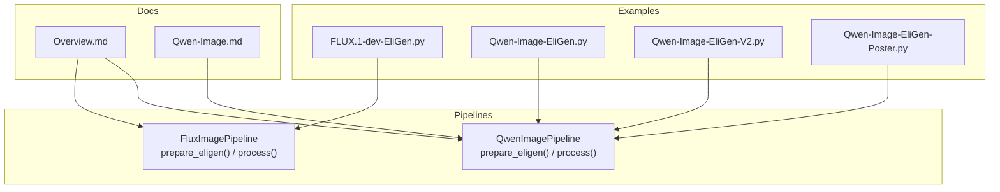
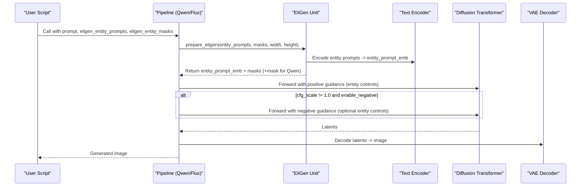
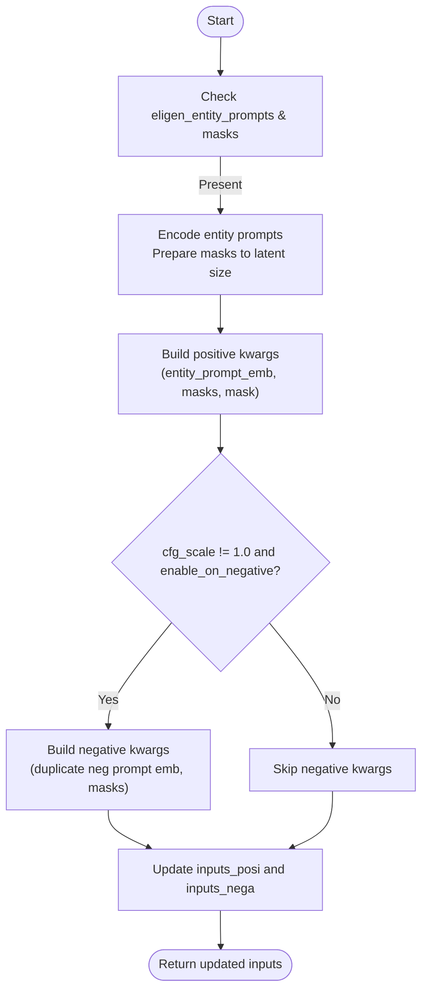
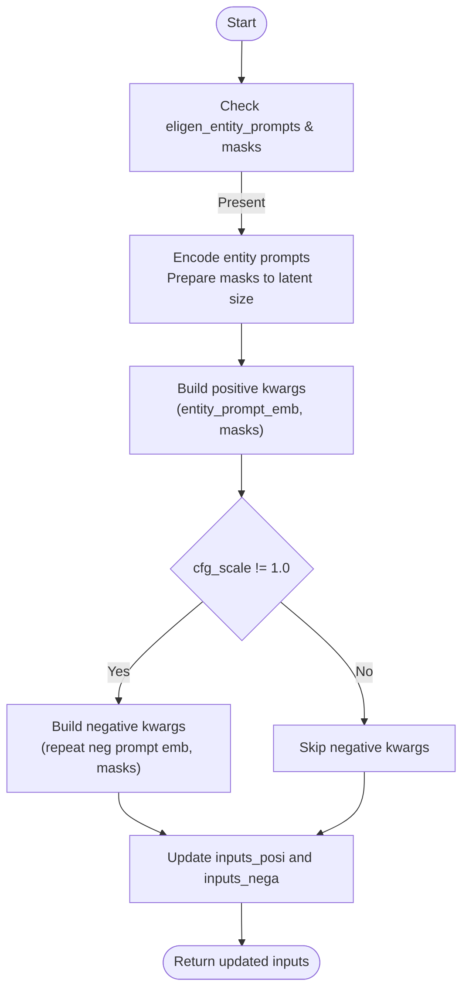
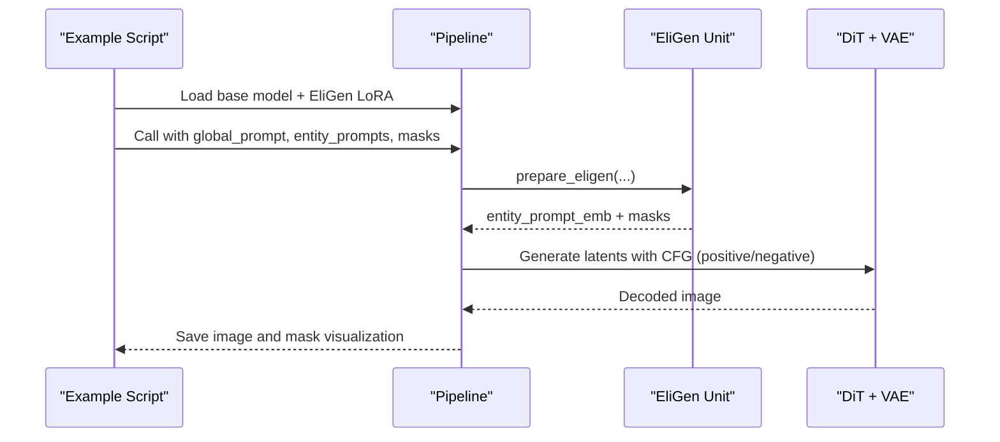
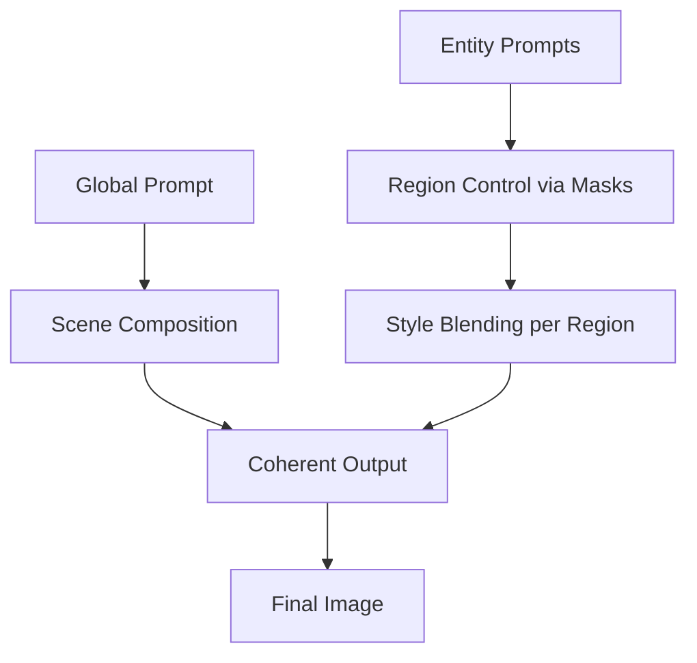
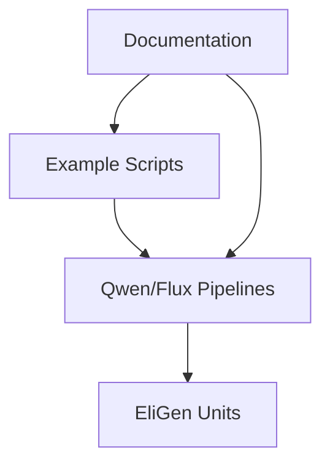

# EliGen for Creative Image Generation

<cite>
**Referenced Files in This Document**
- [FLUX.1-dev-EliGen.py](file://examples/flux/model_inference/FLUX.1-dev-EliGen.py)
- [Qwen-Image-EliGen.py](file://examples/qwen_image/model_inference/Qwen-Image-EliGen.py)
- [Qwen-Image-EliGen-V2.py](file://examples/qwen_image/model_inference/Qwen-Image-EliGen-V2.py)
- [Qwen-Image-EliGen-Poster.py](file://examples/qwen_image/model_inference/Qwen-Image-EliGen-Poster.py)
- [qwen_image.py](file://diffsynth/pipelines/qwen_image.py)
- [flux_image.py](file://diffsynth/pipelines/flux_image.py)
- [Overview.md](file://docs/en/Model_Details/Overview.md)
- [Qwen-Image.md](file://docs/en/Model_Details/Qwen-Image.md)
</cite>

## Table of Contents
1. Introduction
2. Project Structure
3. Core Components
4. Architecture Overview
5. Detailed Component Analysis
6. Dependency Analysis
7. Performance Considerations
8. Troubleshooting Guide
9. Conclusion
10. Appendices

## Introduction
EliGen is a creative image generation capability that enhances control and expressiveness through advanced prompting techniques and style modulation. It enables precise entity-level control by combining global prompts with per-entity prompts and masks, allowing users to blend artistic styles, refine details, and iteratively improve outputs while maintaining coherence across the entire image. EliGen integrates seamlessly into DiffSynth pipelines for both Qwen-Image and FLUX models, offering flexible parameters to balance creativity and fidelity.

## Project Structure
EliGen is implemented as pipeline units within DiffSynth’s image pipelines and exposed via example scripts for quick usage. The key elements include:
- Pipeline unit logic for preparing entity inputs and integrating them into positive/negative CFG branches
- Example inference scripts demonstrating setup, parameter configuration, and workflows
- Documentation outlining model lineage and available EliGen variants

**Diagram sources**
- [FLUX.1-dev-EliGen.py:1-134](file://examples/flux/model_inference/FLUX.1-dev-EliGen.py#L1-L134)
- [Qwen-Image-EliGen.py:1-108](file://examples/qwen_image/model_inference/Qwen-Image-EliGen.py#L1-L108)
- [Qwen-Image-EliGen-V2.py:1-107](file://examples/qwen_image/model_inference/Qwen-Image-EliGen-V2.py#L1-L107)
- [Qwen-Image-EliGen-Poster.py:1-115](file://examples/qwen_image/model_inference/Qwen-Image-EliGen-Poster.py#L1-L115)
- [qwen_image.py:490-520](file://diffsynth/pipelines/qwen_image.py#L490-L520)
- [flux_image.py:570-610](file://diffsynth/pipelines/flux_image.py#L570-L610)
- [Overview.md:1-292](file://docs/en/Model_Details/Overview.md#L1-L292)
- [Qwen-Image.md:1-206](file://docs/en/Model_Details/Qwen-Image.md#L1-L206)

**Section sources**
- [FLUX.1-dev-EliGen.py:1-134](file://examples/flux/model_inference/FLUX.1-dev-EliGen.py#L1-L134)
- [Qwen-Image-EliGen.py:1-108](file://examples/qwen_image/model_inference/Qwen-Image-EliGen.py#L1-L108)
- [Qwen-Image-EliGen-V2.py:1-107](file://examples/qwen_image/model_inference/Qwen-Image-EliGen-V2.py#L1-L107)
- [Qwen-Image-EliGen-Poster.py:1-115](file://examples/qwen_image/model_inference/Qwen-Image-EliGen-Poster.py#L1-L115)
- [qwen_image.py:490-520](file://diffsynth/pipelines/qwen_image.py#L490-L520)
- [flux_image.py:570-610](file://diffsynth/pipelines/flux_image.py#L570-L610)
- [Overview.md:1-292](file://docs/en/Model_Details/Overview.md#L1-L292)
- [Qwen-Image.md:1-206](file://docs/en/Model_Details/Qwen-Image.md#L1-L206)

## Core Components
EliGen introduces two primary components in each pipeline:
- Entity input preparation: Encodes per-entity prompts and prepares corresponding masks aligned to latent resolution
- CFG integration: Injects entity controls into positive and optionally negative branches based on cfg_scale and flags

Key behaviors:
- For Qwen-Image, entity prompt embeddings and masks are prepared and passed along with an optional mask for text embeddings
- For FLUX, entity prompt embeddings and masks are prepared; negative branch can be enabled conditionally
- The process method updates shared inputs and selectively applies negative-side controls when cfg_scale differs from 1.0

**Section sources**
- [qwen_image.py:490-520](file://diffsynth/pipelines/qwen_image.py#L490-L520)
- [flux_image.py:570-610](file://diffsynth/pipelines/flux_image.py#L570-L610)

## Architecture Overview
The EliGen workflow integrates at the pipeline level, bridging user prompts and masks with the diffusion model’s conditioning.

**Diagram sources**
- [qwen_image.py:490-520](file://diffsynth/pipelines/qwen_image.py#L490-L520)
- [flux_image.py:570-610](file://diffsynth/pipelines/flux_image.py#L570-L610)

## Detailed Component Analysis

### Qwen-Image EliGen Integration
- Entity input preparation encodes per-entity prompts and aligns masks to latent grid dimensions
- Negative-side injection is controlled by cfg_scale and flag; masks and embeddings are duplicated or set to None accordingly
- Process updates positive inputs unconditionally and negative inputs only when cfg_scale differs from 1.0

**Diagram sources**
- [qwen_image.py:490-520](file://diffsynth/pipelines/qwen_image.py#L490-L520)

**Section sources**
- [qwen_image.py:490-520](file://diffsynth/pipelines/qwen_image.py#L490-L520)

### FLUX EliGen Integration
- Entity input preparation encodes entity prompts using dual text encoders and prepares masks
- Negative-side injection mirrors Qwen behavior but without an extra mask field for text embeddings
- Process updates positive inputs and conditionally updates negative inputs based on cfg_scale

**Diagram sources**
- [flux_image.py:570-610](file://diffsynth/pipelines/flux_image.py#L570-L610)

**Section sources**
- [flux_image.py:570-610](file://diffsynth/pipelines/flux_image.py#L570-L610)

### Example Workflows and Usage Patterns
- Basic entity control: Provide global prompt and per-entity prompts with corresponding masks; adjust cfg_scale and steps for desired creativity
- Poster-style generation: Use non-square resolutions and tailored negative prompts to emphasize layout and typography
- Iterative refinement: Change seeds, tweak entity prompts, and adjust masks to explore variations while preserving overall coherence

**Diagram sources**
- [FLUX.1-dev-EliGen.py:65-84](file://examples/flux/model_inference/FLUX.1-dev-EliGen.py#L65-L84)
- [Qwen-Image-EliGen.py:65-83](file://examples/qwen_image/model_inference/Qwen-Image-EliGen.py#L65-L83)
- [Qwen-Image-EliGen-V2.py:64-82](file://examples/qwen_image/model_inference/Qwen-Image-EliGen-V2.py#L64-L82)
- [Qwen-Image-EliGen-Poster.py:66-92](file://examples/qwen_image/model_inference/Qwen-Image-EliGen-Poster.py#L66-L92)

**Section sources**
- [FLUX.1-dev-EliGen.py:65-84](file://examples/flux/model_inference/FLUX.1-dev-EliGen.py#L65-L84)
- [Qwen-Image-EliGen.py:65-83](file://examples/qwen_image/model_inference/Qwen-Image-EliGen.py#L65-L83)
- [Qwen-Image-EliGen-V2.py:64-82](file://examples/qwen_image/model_inference/Qwen-Image-EliGen-V2.py#L64-L82)
- [Qwen-Image-EliGen-Poster.py:66-92](file://examples/qwen_image/model_inference/Qwen-Image-EliGen-Poster.py#L66-L92)

### Conceptual Overview
EliGen enhances creative control by decoupling global scene composition from entity-specific styling and content. Users can:
- Fuse multiple artistic styles by assigning distinct entity prompts to different regions
- Enhance prompt-based creativity by refining entity descriptions and masks
- Iterate quickly by varying seeds and adjusting entity prompts while keeping the global context stable

[No sources needed since this diagram shows conceptual workflow, not actual code structure]

## Dependency Analysis
EliGen depends on:
- Pipeline implementations for Qwen-Image and FLUX
- Example scripts that demonstrate loading base models and EliGen LoRAs
- Documentation that outlines model lineage and available EliGen variants

**Diagram sources**
- [Overview.md:1-292](file://docs/en/Model_Details/Overview.md#L1-L292)
- [Qwen-Image.md:1-206](file://docs/en/Model_Details/Qwen-Image.md#L1-L206)

**Section sources**
- [Overview.md:1-292](file://docs/en/Model_Details/Overview.md#L1-L292)
- [Qwen-Image.md:1-206](file://docs/en/Model_Details/Qwen-Image.md#L1-L206)

## Performance Considerations
- VRAM management: Enable low-VRAM configurations in examples to reduce memory footprint during VAE encoding/decoding
- Tiled inference: Use tiled mode to significantly reduce VRAM usage at the cost of slight quality differences and longer inference time
- Step count and guidance: Adjust num_inference_steps and cfg_scale to balance speed and detail; higher steps generally yield finer results
- Mask resolution: Ensure masks are resized appropriately to latent grid dimensions to avoid artifacts

[No sources needed since this section provides general guidance]

## Troubleshooting Guide
Common issues and resolutions:
- No entity control applied: Verify eligen_entity_prompts and eligen_entity_masks are provided and non-empty
- Negative side not active: Ensure cfg_scale differs from 1.0 and enable_eligen_on_negative is set if required
- Quality degradation: Reduce cfg_scale or increase steps; check mask alignment and resolution
- Memory errors: Enable tiled inference and low-VRAM settings in example scripts

**Section sources**
- [qwen_image.py:490-520](file://diffsynth/pipelines/qwen_image.py#L490-L520)
- [flux_image.py:570-610](file://diffsynth/pipelines/flux_image.py#L570-L610)

## Conclusion
EliGen provides powerful creative control through entity-level prompting and masking, enabling artists to blend styles, refine details, and iterate efficiently. By leveraging pipeline-integrated units and example-driven workflows, users can achieve high-quality, coherent images while balancing creativity and fidelity.

[No sources needed since this section summarizes without analyzing specific files]

## Appendices
- Setup instructions and environment variables are available in documentation
- Model lineage and variant availability are outlined in overview documents
- Example scripts provide ready-to-run demonstrations for various use cases

**Section sources**
- [Qwen-Image.md:1-206](file://docs/en/Model_Details/Qwen-Image.md#L1-L206)
- [Overview.md:1-292](file://docs/en/Model_Details/Overview.md#L1-L292)