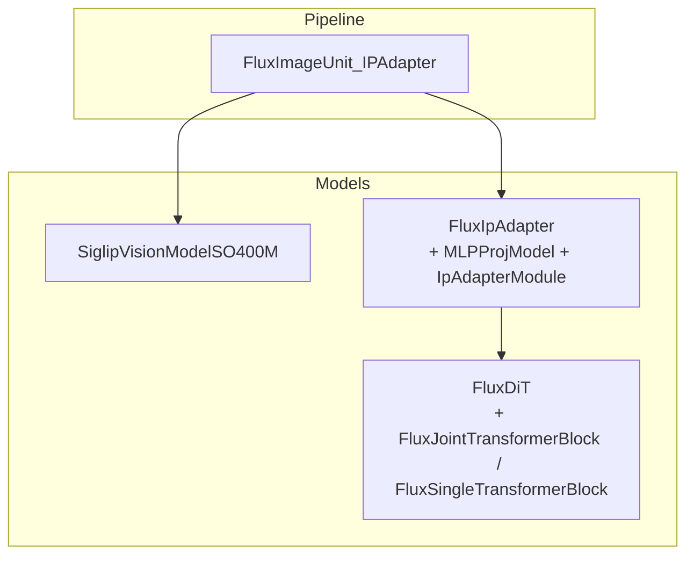
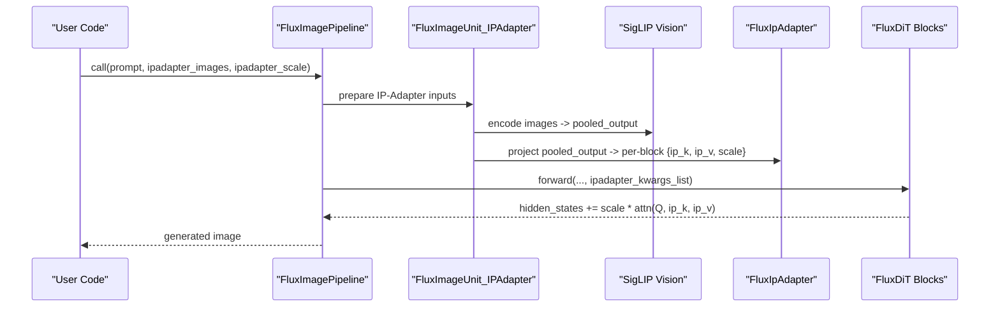
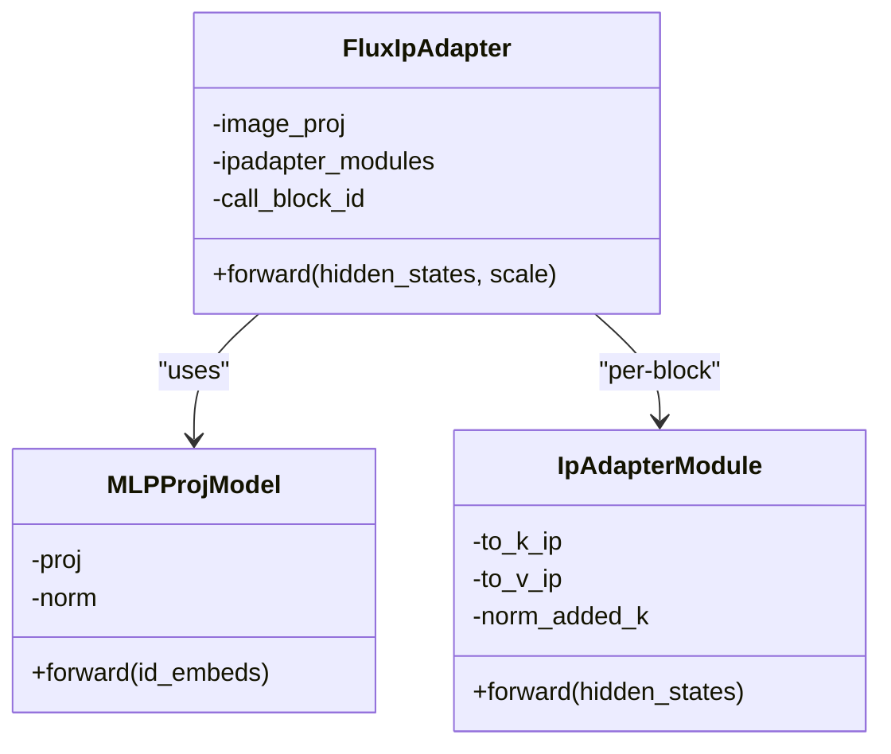
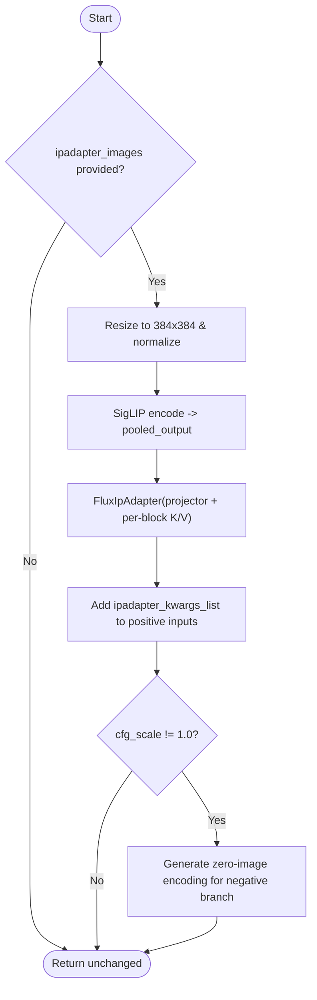
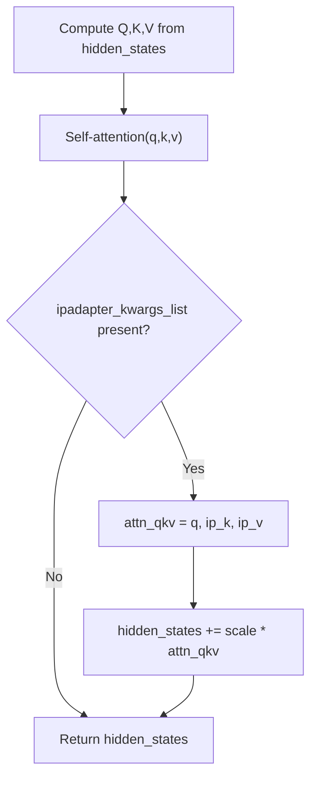
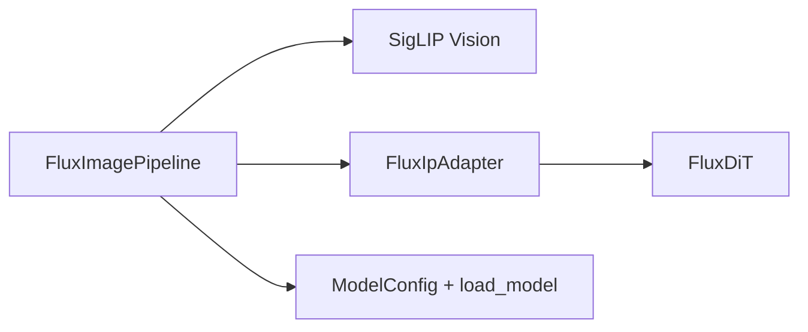

# IP-Adapter for Style Transfer and Image Conditioning

<cite>
**Referenced Files in This Document**
- [flux_ipadapter.py](file://diffsynth/models/flux_ipadapter.py)
- [flux_dit.py](file://diffsynth/models/flux_dit.py)
- [flux_image.py](file://diffsynth/pipelines/flux_image.py)
- [FLUX.1-dev-IP-Adapter.py](file://examples/flux/model_inference/FLUX.1-dev-IP-Adapter.py)
- [FLUX.1-dev-IP-Adapter.py (low VRAM)](file://examples/flux/model_inference_low_vram/FLUX.1-dev-IP-Adapter.py)
- [flux_ipadapter.py (state dict converter)](file://diffsynth/utils/state_dict_converters/flux_ipadapter.py)
- [config.py](file://diffsynth/core/loader/config.py)
- [model.py](file://diffsynth/core/loader/model.py)
</cite>

## Table of Contents
1. Introduction
2. Project Structure
3. Core Components
4. Architecture Overview
5. Detailed Component Analysis
6. Dependency Analysis
7. Performance Considerations
8. Troubleshooting Guide
9. Conclusion
10. Appendices

## Introduction
This document explains how IP-Adapter is implemented and used within the FLUX image pipeline to enable style transfer and image conditioning. IP-Adapter injects visual information from one or more reference images into the diffusion process by generating cross-attention keys and values that are fused with the model’s internal queries during attention computation. The result is a controllable blend between text-driven generation and image-derived style/content cues, governed by an adapter scale parameter.

## Project Structure
The IP-Adapter feature spans three main layers:
- Pipeline integration: prepares reference images, encodes them, and passes adapter outputs into the DiT blocks.
- Adapter module: transforms image embeddings into per-block key/value pairs with a learnable projection and normalization.
- DiT integration: applies the adapter’s K/V to the query via scaled dot-product attention and adds the result to hidden states.

**Diagram sources**
- [flux_image.py:490-515](file://diffsynth/pipelines/flux_image.py#L490-L515)
- [flux_ipadapter.py:6-41](file://diffsynth/models/flux_ipadapter.py#L6-L41)
- [flux_dit.py:6-11](file://diffsynth/models/flux_dit.py#L6-L11)

**Section sources**
- [flux_image.py:490-515](file://diffsynth/pipelines/flux_image.py#L490-L515)
- [flux_ipadapter.py:6-88](file://diffsynth/models/flux_ipadapter.py#L6-L88)
- [flux_dit.py:6-11](file://diffsynth/models/flux_dit.py#L6-L11)

## Core Components
- SigLIP vision encoder: Resizes and preprocesses reference images, then extracts pooled image embeddings.
- IP-Adapter projector: Maps image embeddings to token sequences compatible with DiT cross-attention dimensions.
- Per-block IP-Adapter modules: Produce K/V tensors for each transformer block; include RMSNorm on K.
- DiT attention fusion: Computes attention with the model’s Q against IP-Adapter’s K/V and adds the output back to hidden states, scaled by ipadapter_scale.

Key parameters exposed at inference time:
- ipadapter_images: One or more reference images (list or single).
- ipadapter_scale: Strength of IP-Adapter influence (default 1.0).

**Section sources**
- [flux_image.py:490-515](file://diffsynth/pipelines/flux_image.py#L490-L515)
- [flux_ipadapter.py:23-88](file://diffsynth/models/flux_ipadapter.py#L23-L88)
- [flux_dit.py:6-11](file://diffsynth/models/flux_dit.py#L6-L11)

## Architecture Overview
The end-to-end flow for IP-Adapter conditioning is:
1. Reference images are resized to 384x384 and normalized.
2. A SigLIP vision model produces pooled embeddings.
3. The IP-Adapter projects these embeddings into per-block K/V tokens.
4. During DiT forward passes, the adapter’s K/V are used to compute additional attention contributions, added to the original hidden states with scaling.

**Diagram sources**
- [flux_image.py:490-515](file://diffsynth/pipelines/flux_image.py#L490-L515)
- [flux_ipadapter.py:66-88](file://diffsynth/models/flux_ipadapter.py#L66-L88)
- [flux_dit.py:6-11](file://diffsynth/models/flux_dit.py#L6-L11)

## Detailed Component Analysis

### IP-Adapter Module Design
- MLPProjModel: Two-layer MLP with GELU followed by LayerNorm, mapping image embedding dimension to cross_attention_dim × num_tokens.
- IpAdapterModule: Linear projections to K and V, with RMSNorm applied to K before attention.
- FluxIpAdapter: Holds multiple IpAdapterModules (one per DiT block), plus the image projector; returns a dictionary of per-block K/V and scale.

**Diagram sources**
- [flux_ipadapter.py:23-88](file://diffsynth/models/flux_ipadapter.py#L23-L88)

**Section sources**
- [flux_ipadapter.py:23-88](file://diffsynth/models/flux_ipadapter.py#L23-L88)

### Pipeline Integration (FluxImageUnit_IPAdapter)
- Accepts ipadapter_images and ipadapter_scale.
- Resizes images to 384x384, normalizes, concatenates batch, and encodes via SigLIP.
- Produces ipadapter_kwargs_list for positive branch; if CFG > 1, also generates zero-image encoding for negative branch.

**Diagram sources**
- [flux_image.py:490-515](file://diffsynth/pipelines/flux_image.py#L490-L515)

**Section sources**
- [flux_image.py:490-515](file://diffsynth/pipelines/flux_image.py#L490-L515)

### DiT Attention Fusion
- In both joint and single transformer blocks, after standard self-attention, the code optionally computes attention with IP-Adapter K/V using the same Q and adds the result scaled by ipadapter_scale to hidden states.

**Diagram sources**
- [flux_dit.py:6-11](file://diffsynth/models/flux_dit.py#L6-L11)
- [flux_dit.py:228-242](file://diffsynth/models/flux_dit.py#L228-L242)

**Section sources**
- [flux_dit.py:6-11](file://diffsynth/models/flux_dit.py#L6-L11)
- [flux_dit.py:228-242](file://diffsynth/models/flux_dit.py#L228-L242)

### State Dict Conversion
- Converters map external formats (e.g., diffusers/CivitAI) into the internal naming scheme expected by FluxIpAdapter.

**Section sources**
- [flux_ipadapter.py:95-110](file://diffsynth/models/flux_ipadapter.py#L95-L110)
- [flux_ipadapter.py (state dict converter):1-32](file://diffsynth/utils/state_dict_converters/flux_ipadapter.py#L1-L32)

## Dependency Analysis
- Pipeline depends on:
  - SigLIP vision model for image encoding.
  - FluxIpAdapter for projecting image embeddings into per-block K/V.
  - FluxDiT blocks for integrating K/V into attention.
- Model loading uses ModelConfig and load_model utilities to handle downloading, VRAM management, and state dict conversion.

**Diagram sources**
- [flux_image.py:120-177](file://diffsynth/pipelines/flux_image.py#L120-L177)
- [config.py:10-120](file://diffsynth/core/loader/config.py#L10-L120)
- [model.py:11-65](file://diffsynth/core/loader/model.py#L11-L65)

**Section sources**
- [flux_image.py:120-177](file://diffsynth/pipelines/flux_image.py#L120-L177)
- [config.py:10-120](file://diffsynth/core/loader/config.py#L10-L120)
- [model.py:11-65](file://diffsynth/core/loader/model.py#L11-L65)

## Performance Considerations
- VRAM Management:
  - Use low-VRAM example configurations to offload/preload models with float8/e4m3fn where supported.
  - Set vram_limit to constrain GPU memory usage.
- Batched Reference Images:
  - Multiple reference images are concatenated before encoding; keep the number reasonable to avoid excessive memory.
- Scale Tuning:
  - Higher ipadapter_scale increases style/content influence but may reduce prompt adherence; lower values preserve content more.

[No sources needed since this section provides general guidance]

## Troubleshooting Guide
Common issues and remedies:
- Style overpowering the prompt:
  - Reduce ipadapter_scale gradually (e.g., 0.5–0.8).
  - Increase CFG scale to strengthen prompt guidance relative to image conditioning.
- Insufficient conditioning effect:
  - Increase ipadapter_scale (e.g., up to 1.0 or slightly above if stable).
  - Ensure reference images are high quality and representative of desired style/content.
- Multi-image blending not working as expected:
  - Verify all images are correctly passed as a list and properly preprocessed (RGB, 384x384).
  - Consider using a single strong reference image first, then add others incrementally.
- Memory errors:
  - Use the low-VRAM configuration and set appropriate vram_limit.
  - Reduce image resolution or number of reference images.

**Section sources**
- [FLUX.1-dev-IP-Adapter.py:1-25](file://examples/flux/model_inference/FLUX.1-dev-IP-Adapter.py#L1-L25)
- [FLUX.1-dev-IP-Adapter.py (low VRAM):1-36](file://examples/flux/model_inference_low_vram/FLUX.1-dev-IP-Adapter.py#L1-L36)
- [flux_image.py:490-515](file://diffsynth/pipelines/flux_image.py#L490-L515)

## Conclusion
IP-Adapter in FLUX enables flexible image conditioning by injecting learned K/V representations derived from reference images into the DiT attention mechanism. With clear control over ipadapter_images and ipadapter_scale, users can achieve style transfer, content preservation, and multi-image conditioning. Proper setup and tuning ensure balanced results between textual prompts and visual references.

## Appendices

### Setup and Usage Examples
- Basic usage:
  - Load pipeline with FLUX.1-dev components and IP-Adapter weights.
  - Generate a base image, then condition a new prompt with the base image as reference.
- Low VRAM usage:
  - Configure offload/onload/preparing/computation dtypes and devices.
  - Pass vram_limit to constrain memory.

**Section sources**
- [FLUX.1-dev-IP-Adapter.py:1-25](file://examples/flux/model_inference/FLUX.1-dev-IP-Adapter.py#L1-L25)
- [FLUX.1-dev-IP-Adapter.py (low VRAM):1-36](file://examples/flux/model_inference_low_vram/FLUX.1-dev-IP-Adapter.py#L1-L36)

### Parameter Reference
- ipadapter_images: Union[list[Image.Image], Image.Image]
- ipadapter_scale: float (default 1.0)
- cfg_scale: float (controls prompt vs. unconditional balance)
- num_inference_steps: int (affects stability and detail)

**Section sources**
- [flux_image.py:180-291](file://diffsynth/pipelines/flux_image.py#L180-L291)