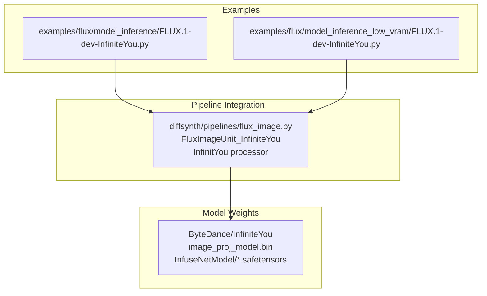
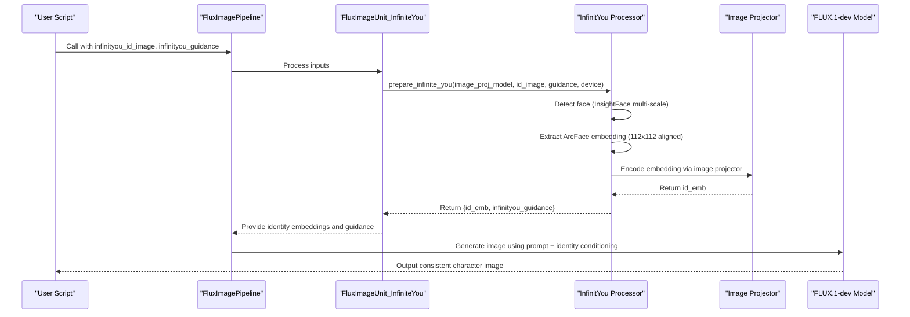
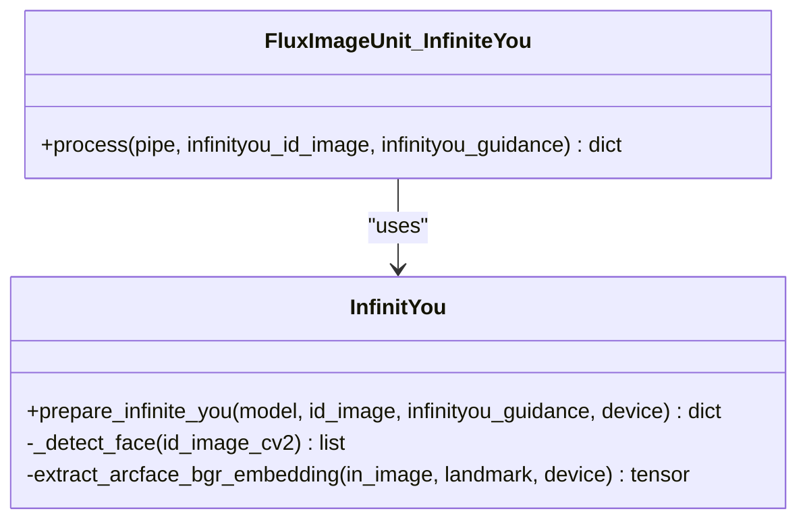
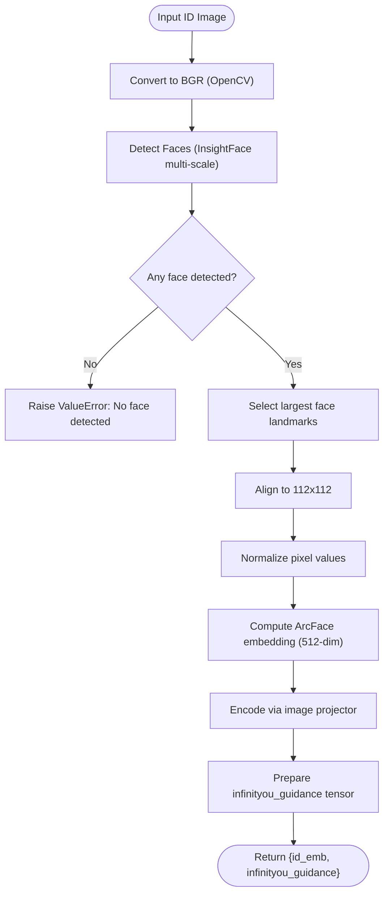
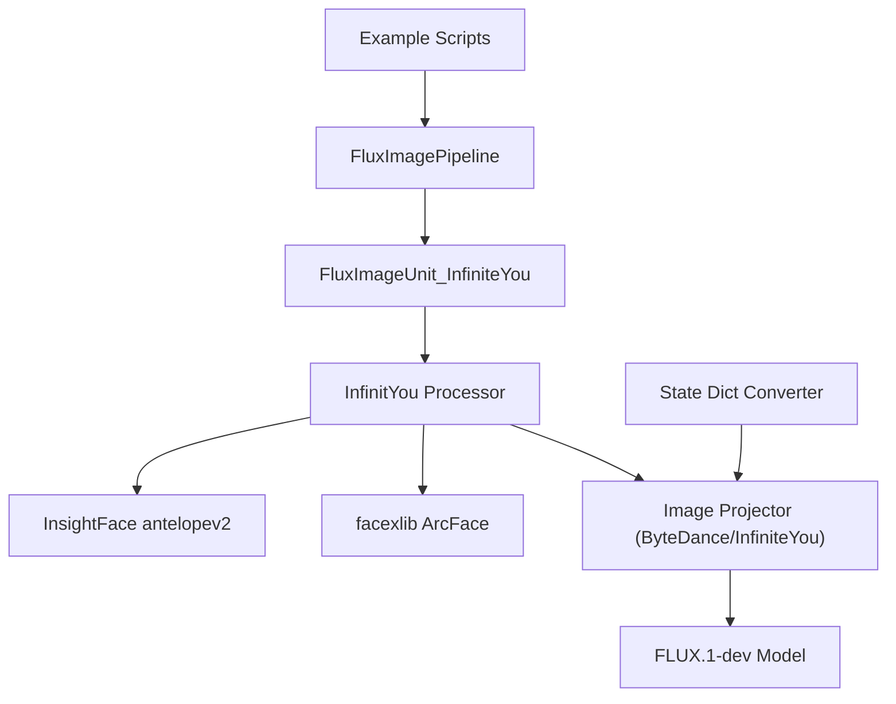

# InfiniteYou for Consistent Character Generation

<cite>
**Referenced Files in This Document**
- [FLUX.1-dev-InfiniteYou.py](file://examples/flux/model_inference/FLUX.1-dev-InfiniteYou.py)
- [FLUX.1-dev-InfiniteYou-low-vram.py](file://examples/flux/model_inference_low_vram/FLUX.1-dev-InfiniteYou.py)
- [flux_image.py](file://diffsynth/pipelines/flux_image.py)
- [flux_infiniteyou.py (state dict converter)](file://diffsynth/utils/state_dict_converters/flux_infiniteyou.py)
</cite>

## Table of Contents
1. [Introduction](#introduction)
2. [Project Structure](#project-structure)
3. [Core Components](#core-components)
4. [Architecture Overview](#architecture-overview)
5. [Detailed Component Analysis](#detailed-component-analysis)
6. [Dependency Analysis](#dependency-analysis)
7. [Performance Considerations](#performance-considerations)
8. [Troubleshooting Guide](#troubleshooting-guide)
9. [Conclusion](#conclusion)
10. [Appendices](#appendices)

## Introduction
InfiniteYou is a feature that enables consistent character generation across multiple images by injecting identity information from a reference image into the diffusion pipeline. It leverages face detection and recognition to extract a compact identity embedding, which is then encoded through an image projector and used to guide the FLUX.1-dev model during inference. The result is a series of images that preserve the same character identity while allowing diverse poses, styles, and scenes.

This document explains how InfiniteYou works under the hood, how to set it up with character reference images, key parameters such as consistency strength and encoding methods, and practical workflows like character sheets, consistent portrait series, and character-driven storytelling. It also includes best practices and common pitfalls to avoid.

## Project Structure
The InfiniteYou feature is integrated into the FLUX image pipeline and exposed via example scripts for both standard and low-VRAM environments. The core logic resides in the pipeline module, while the examples demonstrate setup, model loading, and inference calls.

**Diagram sources**
- [FLUX.1-dev-InfiniteYou.py:1-27](file://examples/flux/model_inference/FLUX.1-dev-InfiniteYou.py#L1-L27)
- [FLUX.1-dev-InfiniteYou-low-vram.py:1-39](file://examples/flux/model_inference_low_vram/FLUX.1-dev-InfiniteYou.py#L1-L39)
- [flux_image.py:744-757](file://diffsynth/pipelines/flux_image.py#L744-L757)

**Section sources**
- [FLUX.1-dev-InfiniteYou.py:1-27](file://examples/flux/model_inference/FLUX.1-dev-InfiniteYou.py#L1-L27)
- [FLUX.1-dev-InfiniteYou-low-vram.py:1-39](file://examples/flux/model_inference_low_vram/FLUX.1-dev-InfiniteYou.py#L1-L39)
- [flux_image.py:744-757](file://diffsynth/pipelines/flux_image.py#L744-L757)

## Core Components
- FluxImageUnit_InfiniteYou: A pipeline unit that takes an ID image and guidance parameter, loads the InfinityYou processor, and prepares identity embeddings and guidance tensors for use during inference.
- InfinitYou processor: Implements face detection using InsightFace at multiple scales, extracts ArcFace embeddings, normalizes and projects them via the image projector, and returns identity embeddings and guidance values.
- Example scripts: Demonstrate model configuration, dataset snapshot download, controlnet placeholder usage, and inference calls with InfinityYou parameters.

Key responsibilities:
- Face detection and landmark selection
- ArcFace embedding extraction
- Image projector encoding
- Guidance tensor preparation
- Pipeline integration via FluxImageUnit_InfiniteYou

**Section sources**
- [flux_image.py:744-757](file://diffsynth/pipelines/flux_image.py#L744-L757)
- [flux_image.py:792-839](file://diffsynth/pipelines/flux_image.py#L792-L839)
- [FLUX.1-dev-InfiniteYou.py:16-27](file://examples/flux/model_inference/FLUX.1-dev-InfiniteYou.py#L16-L27)
- [FLUX.1-dev-InfiniteYou-low-vram.py:27-39](file://examples/flux/model_inference_low_vram/FLUX.1-dev-InfiniteYou.py#L27-L39)

## Architecture Overview
The InfinityYou workflow integrates face recognition and projection into the FLUX pipeline to inject identity information consistently across generations.

**Diagram sources**
- [flux_image.py:744-757](file://diffsynth/pipelines/flux_image.py#L744-L757)
- [flux_image.py:792-839](file://diffsynth/pipelines/flux_image.py#L792-L839)
- [FLUX.1-dev-InfiniteYou.py:42-48](file://examples/flux/model_inference/FLUX.1-dev-InfiniteYou.py#L42-L48)

## Detailed Component Analysis

### FluxImageUnit_InfiniteYou
- Inputs: infinityou_id_image (PIL Image), infinityou_guidance (float)
- Outputs: id_emb (tensor), infinityou_guidance (tensor)
- Behavior: Loads the InfinityYou processor, validates input, and delegates embedding preparation to the processor.

**Diagram sources**
- [flux_image.py:744-757](file://diffsynth/pipelines/flux_image.py#L744-L757)
- [flux_image.py:792-839](file://diffsynth/pipelines/flux_image.py#L792-L839)

**Section sources**
- [flux_image.py:744-757](file://diffsynth/pipelines/flux_image.py#L744-L757)

### InfinitYou Processor
- Face detection: Uses InsightFace’s antelopev2 model at three detection sizes (640, 320, 160) to robustly find faces.
- Landmark selection: Chooses the largest detected face based on bounding box area.
- Embedding extraction: Aligns the face to 112x112 and computes a normalized ArcFace embedding.
- Projection: Feeds the embedding into the image projector to obtain id_emb used by the diffusion model.
- Guidance: Produces a scalar guidance tensor controlling consistency strength.

**Diagram sources**
- [flux_image.py:792-839](file://diffsynth/pipelines/flux_image.py#L792-L839)

**Section sources**
- [flux_image.py:792-839](file://diffsynth/pipelines/flux_image.py#L792-L839)

### Example Scripts and Usage
- Standard inference script configures models, downloads required datasets and support files, sets controlnet placeholders, and runs inference with InfinityYou parameters.
- Low-VRAM variant adds VRAM management configurations and limits to fit within constrained GPU memory.

Key parameters demonstrated:
- infinityou_id_image: Reference image containing the character’s face
- infinityou_guidance: Controls the strength of identity influence
- embedded_guidance: General guidance for the diffusion process
- num_inference_steps: Number of denoising steps
- height, width: Output resolution

**Section sources**
- [FLUX.1-dev-InfiniteYou.py:16-27](file://examples/flux/model_inference/FLUX.1-dev-InfiniteYou.py#L16-L27)
- [FLUX.1-dev-InfiniteYou.py:42-48](file://examples/flux/model_inference/FLUX.1-dev-InfiniteYou.py#L42-L48)
- [FLUX.1-dev-InfiniteYou-low-vram.py:27-39](file://examples/flux/model_inference_low_vram/FLUX.1-dev-InfiniteYou.py#L27-L39)
- [FLUX.1-dev-InfiniteYou-low-vram.py:54-60](file://examples/flux/model_inference_low_vram/FLUX.1-dev-InfiniteYou.py#L54-L60)

## Dependency Analysis
InfiniteYou depends on external libraries and model weights:
- InsightFace antelopev2 models for face detection
- facexlib for ArcFace recognition
- ONNX runtime providers for execution backends
- ByteDance/InfiniteYou weights including image projector and InfuseNet components

State dictionary conversion:
- A dedicated converter handles mapping of the image projector state dict.

**Diagram sources**
- [FLUX.1-dev-InfiniteYou.py:11-15](file://examples/flux/model_inference/FLUX.1-dev-InfiniteYou.py#L11-L15)
- [FLUX.1-dev-InfiniteYou-low-vram.py:22-26](file://examples/flux/model_inference_low_vram/FLUX.1-dev-InfiniteYou.py#L22-L26)
- [flux_image.py:792-806](file://diffsynth/pipelines/flux_image.py#L792-L806)
- [flux_infiniteyou.py (state dict converter):1-2](file://diffsynth/utils/state_dict_converters/flux_infiniteyou.py#L1-L2)

**Section sources**
- [FLUX.1-dev-InfiniteYou.py:11-15](file://examples/flux/model_inference/FLUX.1-dev-InfiniteYou.py#L11-L15)
- [FLUX.1-dev-InfiniteYou-low-vram.py:22-26](file://examples/flux/model_inference_low_vram/FLUX.1-dev-InfiniteYou.py#L22-L26)
- [flux_image.py:792-806](file://diffsynth/pipelines/flux_image.py#L792-L806)
- [flux_infiniteyou.py (state dict converter):1-2](file://diffsynth/utils/state_dict_converters/flux_infiniteyou.py#L1-L2)

## Performance Considerations
- Multi-scale face detection increases robustness but adds overhead; ensure GPU acceleration is enabled for InsightFace providers.
- Low-VRAM mode uses float8 offloading and computation dtype tuning to reduce memory footprint; adjust vram_limit appropriately for your hardware.
- Using tiled VAE encoding can help when processing large resolutions or batched inputs.
- Keep the number of inference steps balanced: higher steps improve quality but increase time; typical values around 50 are shown in examples.

[No sources needed since this section provides general guidance]

## Troubleshooting Guide
Common issues and resolutions:
- No face detected: Ensure the ID image contains a clear, front-facing face. The processor raises a ValueError if no face is found.
- Incorrect face alignment: Verify that the largest face is selected and landmarks are correctly computed; poor lighting or occlusions can degrade detection.
- Memory errors: Use the low-VRAM script configuration and tune vram_limit; consider reducing resolution or steps.
- Missing dependencies: Install facexlib, insightface, and onnxruntime as indicated in the example scripts.

**Section sources**
- [flux_image.py:827-839](file://diffsynth/pipelines/flux_image.py#L827-L839)
- [FLUX.1-dev-InfiniteYou.py:8-15](file://examples/flux/model_inference/FLUX.1-dev-InfiniteYou.py#L8-L15)
- [FLUX.1-dev-InfiniteYou-low-vram.py:12-21](file://examples/flux/model_inference_low_vram/FLUX.1-dev-InfiniteYou.py#L12-L21)

## Conclusion
InfiniteYou provides a robust mechanism for maintaining character identity across generated images by combining face detection, ArcFace embeddings, and an image projector integrated into the FLUX pipeline. With proper setup of reference images and careful tuning of guidance parameters, users can achieve consistent character generation suitable for character sheets, portrait series, and narrative-driven workflows. Adhering to best practices and avoiding common pitfalls ensures reliable results across diverse prompts and styles.

[No sources needed since this section summarizes without analyzing specific files]

## Appendices

### Setup Instructions for Character Reference Images
- Prepare a clear, well-lit portrait of the character with minimal occlusions.
- Run the example script to automatically download required support files and datasets.
- Configure model paths for FLUX.1-dev and ByteDance/InfiniteYou components.
- For constrained environments, use the low-VRAM configuration with appropriate dtype and device settings.

**Section sources**
- [FLUX.1-dev-InfiniteYou.py:11-15](file://examples/flux/model_inference/FLUX.1-dev-InfiniteYou.py#L11-L15)
- [FLUX.1-dev-InfiniteYou.py:16-27](file://examples/flux/model_inference/FLUX.1-dev-InfiniteYou.py#L16-L27)
- [FLUX.1-dev-InfiniteYou-low-vram.py:12-21](file://examples/flux/model_inference_low_vram/FLUX.1-dev-InfiniteYou.py#L12-L21)
- [FLUX.1-dev-InfiniteYou-low-vram.py:27-39](file://examples/flux/model_inference_low_vram/FLUX.1-dev-InfiniteYou.py#L27-L39)

### Key Parameters
- infinityou_id_image: PIL Image containing the character’s face
- infinityou_guidance: Float controlling identity strength
- embedded_guidance: General guidance for the diffusion process
- num_inference_steps: Denoising steps (e.g., 50)
- height, width: Output resolution (e.g., 1024x1024)

**Section sources**
- [FLUX.1-dev-InfiniteYou.py:42-48](file://examples/flux/model_inference/FLUX.1-dev-InfiniteYou.py#L42-L48)
- [FLUX.1-dev-InfiniteYou-low-vram.py:54-60](file://examples/flux/model_inference_low_vram/FLUX.1-dev-InfiniteYou.py#L54-L60)

### Practical Applications
- Character sheet generation: Use consistent prompts with varied poses and outfits while keeping infinityou_id_image constant.
- Consistent portrait series: Maintain identity across different backgrounds and lighting conditions by adjusting embedded_guidance and steps.
- Character-driven storytelling: Chain multiple generations with the same ID image to create coherent narratives featuring the same character.

[No sources needed since this section provides general guidance]

### Best Practices
- Use high-quality, front-facing reference images for reliable face detection.
- Start with moderate infinityou_guidance values and adjust based on visual fidelity.
- Leverage low-VRAM configurations when necessary to avoid out-of-memory errors.
- Validate outputs iteratively and refine prompts to balance identity preservation with creative variation.

[No sources needed since this section provides general guidance]

### Common Pitfalls to Avoid
- Providing images without clear faces leads to failures; always verify face presence.
- Overly aggressive guidance may distort style or context; tune carefully.
- Ignoring dependency installation will cause runtime errors; follow the example instructions.

**Section sources**
- [flux_image.py:827-839](file://diffsynth/pipelines/flux_image.py#L827-L839)
- [FLUX.1-dev-InfiniteYou.py:8-15](file://examples/flux/model_inference/FLUX.1-dev-InfiniteYou.py#L8-L15)