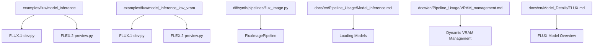
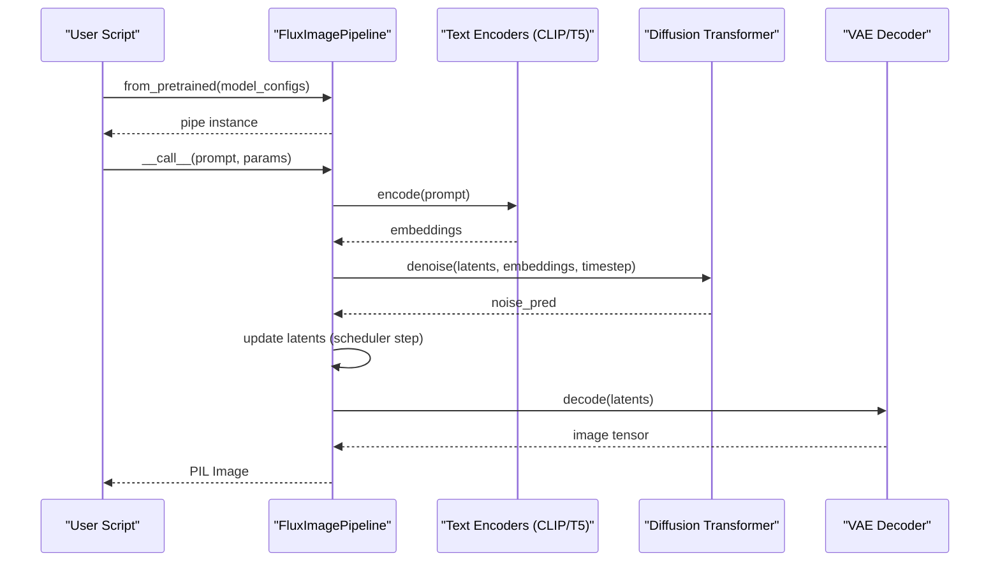
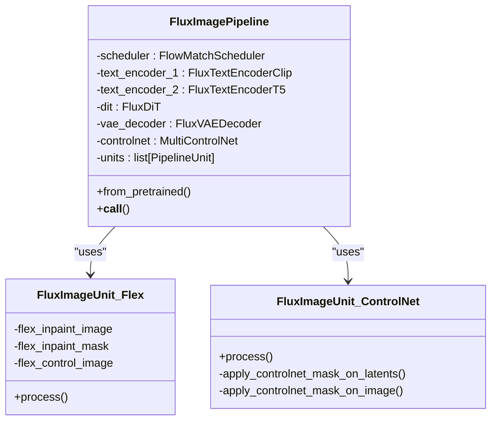
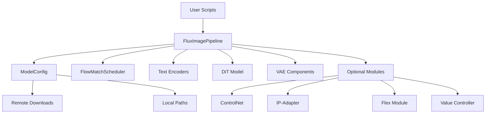

# Basic FLUX Inference Examples

<cite>
**Referenced Files in This Document**
- [FLUX.1-dev.py](file://examples/flux/model_inference/FLUX.1-dev.py)
- [FLEX.2-preview.py](file://examples/flux/model_inference/FLEX.2-preview.py)
- [FLUX.1-dev_low_vram.py](file://examples/flux/model_inference_low_vram/FLUX.1-dev.py)
- [FLEX.2-preview_low_vram.py](file://examples/flux/model_inference_low_vram/FLEX.2-preview.py)
- [flux_image.py](file://diffsynth/pipelines/flux_image.py)
- [Model_Inference.md](file://docs/en/Pipeline_Usage/Model_Inference.md)
- [VRAM_management.md](file://docs/en/Pipeline_Usage/VRAM_management.md)
- [FLUX.md](file://docs/en/Model_Details/FLUX.md)
</cite>

## Table of Contents
1. [Introduction](#introduction)
2. [Project Structure](#project-structure)
3. [Core Components](#core-components)
4. [Architecture Overview](#architecture-overview)
5. [Detailed Component Analysis](#detailed-component-analysis)
6. [Dependency Analysis](#dependency-analysis)
7. [Performance Considerations](#performance-considerations)
8. [Troubleshooting Guide](#troubleshooting-guide)
9. [Conclusion](#conclusion)
10. [Appendices](#appendices)

## Introduction
This document provides step-by-step guidance for running basic FLUX inference using the provided examples, covering both standard and low VRAM modes. It focuses on:
- FLUX.1-dev text-to-image generation
- FLEX.2-preview with inpainting and control features
- Environment setup and model loading
- Generation parameters (prompt, negative prompt, seed, steps, guidance scale)
- Saving output images
- Memory optimization techniques for low VRAM scenarios
- Troubleshooting common issues such as CUDA errors or memory limitations

## Project Structure
The relevant example scripts are organized under the examples directory:
- Standard inference scripts: examples/flux/model_inference
- Low VRAM inference scripts: examples/flux/model_inference_low_vram
- Core pipeline implementation: diffsynth/pipelines/flux_image.py
- Documentation references: docs/en/Pipeline_Usage and docs/en/Model_Details



**Diagram sources**
- [FLUX.1-dev.py:1-27](file://examples/flux/model_inference/FLUX.1-dev.py#L1-L27)
- [FLEX.2-preview.py:1-51](file://examples/flux/model_inference/FLEX.2-preview.py#L1-L51)
- [FLUX.1-dev_low_vram.py:1-38](file://examples/flux/model_inference_low_vram/FLUX.1-dev.py#L1-L38)
- [FLEX.2-preview_low_vram.py:1-62](file://examples/flux/model_inference_low_vram/FLEX.2-preview.py#L1-L62)
- [flux_image.py:1-120](file://diffsynth/pipelines/flux_image.py#L1-L120)
- [Model_Inference.md:1-167](file://docs/en/Pipeline_Usage/Model_Inference.md#L1-L167)
- [VRAM_management.md:1-206](file://docs/en/Pipeline_Usage/VRAM_management.md#L1-L206)
- [FLUX.md:1-202](file://docs/en/Model_Details/FLUX.md#L1-L202)

**Section sources**
- [FLUX.1-dev.py:1-27](file://examples/flux/model_inference/FLUX.1-dev.py#L1-L27)
- [FLEX.2-preview.py:1-51](file://examples/flux/model_inference/FLEX.2-preview.py#L1-L51)
- [FLUX.1-dev_low_vram.py:1-38](file://examples/flux/model_inference_low_vram/FLUX.1-dev.py#L1-L38)
- [FLEX.2-preview_low_vram.py:1-62](file://examples/flux/model_inference_low_vram/FLEX.2-preview.py#L1-L62)
- [flux_image.py:1-120](file://diffsynth/pipelines/flux_image.py#L1-L120)
- [Model_Inference.md:1-167](file://docs/en/Pipeline_Usage/Model_Inference.md#L1-L167)
- [VRAM_management.md:1-206](file://docs/en/Pipeline_Usage/VRAM_management.md#L1-L206)
- [FLUX.md:1-202](file://docs/en/Model_Details/FLUX.md#L1-L202)

## Core Components
- FluxImagePipeline: The main entry point for FLUX inference, handling model loading, tokenization, denoising, and decoding.
- ModelConfig: Used to specify model IDs and file patterns for downloading/loading components (DiT, text encoders, VAE).
- VRAM management configuration: Enables CPU offload, FP8 quantization, and dynamic layer-level offloading to reduce VRAM usage.

Key responsibilities:
- Downloading and loading models from remote sources or local paths
- Tokenizing prompts via CLIP and T5 encoders
- Running the diffusion process with configurable scheduler and CFG
- Decoding latents to images via VAE decoder
- Supporting advanced features like ControlNet, IP-Adapter, Flex inpainting/control, and more

**Section sources**
- [flux_image.py:57-177](file://diffsynth/pipelines/flux_image.py#L57-L177)
- [Model_Inference.md:1-167](file://docs/en/Pipeline_Usage/Model_Inference.md#L1-L167)

## Architecture Overview
The FLUX inference pipeline follows a modular design:
- Model loading via from_pretrained with ModelConfig entries
- Prompt embedding through dual text encoders (CLIP + T5)
- Denoising loop using FlowMatchScheduler
- Optional conditioning modules (ControlNet, IP-Adapter, Flex)
- VAE decoding to produce final images



**Diagram sources**
- [flux_image.py:180-291](file://diffsynth/pipelines/flux_image.py#L180-L291)
- [Model_Inference.md:80-103](file://docs/en/Pipeline_Usage/Model_Inference.md#L80-L103)

## Detailed Component Analysis

### FLUX.1-dev Standard Inference
The FLUX.1-dev script demonstrates basic text-to-image generation with optional classifier-free guidance (CFG).

Key parameters:
- prompt: Descriptive text for image content
- negative_prompt: Text describing unwanted elements
- seed: Random seed for reproducibility
- cfg_scale: Guidance strength (default 1.0, higher values increase adherence to prompt)
- num_inference_steps: Number of denoising iterations (default 30)

Output:
- Saves generated images to files (e.g., flux.jpg, flux_cfg.jpg)

**Section sources**
- [FLUX.1-dev.py:1-27](file://examples/flux/model_inference/FLUX.1-dev.py#L1-L27)

### FLEX.2-preview Standard Inference
The FLEX.2-preview script showcases advanced features including inpainting and control-based generation.

Key features:
- Basic text-to-image generation
- Inpainting with mask-guided editing
- Control-based generation using edge detection (Canny)
- embedded_guidance parameter for fine-tuned control

Parameters:
- flex_inpaint_image: Base image for inpainting
- flex_inpaint_mask: Mask defining regions to edit
- flex_control_image: Control image for structural guidance
- flex_control_strength: Strength of control influence
- flex_control_stop: Timestep when control stops

**Section sources**
- [FLEX.2-preview.py:1-51](file://examples/flux/model_inference/FLEX.2-preview.py#L1-L51)

### Low VRAM Configuration
Both FLUX.1-dev and FLEX.2-preview have dedicated low VRAM versions that implement memory optimization techniques.

Memory optimization strategies:
- FP8 quantization for reduced memory footprint
- CPU offloading for unused model components
- Dynamic VRAM management with automatic layer splitting
- vram_limit parameter for controlling maximum VRAM usage

Configuration structure:
- offload_dtype/onload_device: Storage precision and device for offloaded layers
- preparing_dtype/preparing_device: Temporary computation state
- computation_dtype/computation_device: Active computation settings

**Section sources**
- [FLUX.1-dev_low_vram.py:1-38](file://examples/flux/model_inference_low_vram/FLUX.1-dev.py#L1-L38)
- [FLEX.2-preview_low_vram.py:1-62](file://examples/flux/model_inference_low_vram/FLEX.2-preview.py#L1-L62)
- [VRAM_management.md:98-137](file://docs/en/Pipeline_Usage/VRAM_management.md#L98-L137)

### Pipeline Implementation Details
The FluxImagePipeline implements a sophisticated architecture with multiple processing units:



**Diagram sources**
- [flux_image.py:57-107](file://diffsynth/pipelines/flux_image.py#L57-L107)
- [flux_image.py:705-741](file://diffsynth/pipelines/flux_image.py#L705-L741)
- [flux_image.py:447-486](file://diffsynth/pipelines/flux_image.py#L447-L486)

**Section sources**
- [flux_image.py:57-177](file://diffsynth/pipelines/flux_image.py#L57-L177)

## Dependency Analysis
The FLUX inference system has clear dependency relationships:



**Diagram sources**
- [flux_image.py:120-177](file://diffsynth/pipelines/flux_image.py#L120-L177)
- [Model_Inference.md:5-25](file://docs/en/Pipeline_Usage/Model_Inference.md#L5-L25)

**Section sources**
- [flux_image.py:120-177](file://diffsynth/pipelines/flux_image.py#L120-L177)
- [Model_Inference.md:5-25](file://docs/en/Pipeline_Usage/Model_Inference.md#L5-L25)

## Performance Considerations
For optimal performance and memory efficiency:

### Standard Mode (High VRAM)
- Use full precision (bfloat16) for best quality
- Disable tiling for faster processing
- Optimal for GPUs with 24GB+ VRAM

### Low VRAM Mode
- Enable FP8 quantization for significant memory reduction
- Use CPU offloading for unused components
- Implement dynamic VRAM management with appropriate limits
- Consider disk offloading for extremely constrained environments

### Memory Optimization Techniques
- **FP8 Quantization**: Reduces VRAM usage by ~50% with minimal quality loss
- **CPU Offloading**: Moves inactive model parts to system memory
- **Layer-level Offloading**: Splits models across VRAM and memory dynamically
- **VAE Tiling**: Processes large images in smaller chunks during encoding/decoding

**Section sources**
- [VRAM_management.md:61-97](file://docs/en/Pipeline_Usage/VRAM_management.md#L61-L97)
- [FLUX.md:21-51](file://docs/en/Model_Details/FLUX.md#L21-L51)

## Troubleshooting Guide

### Common CUDA Errors
- **CUDA Out of Memory**: Reduce batch size, enable VRAM management, or use lower precision
- **CUDA Kernel Launch Failed**: Check GPU compatibility and driver versions
- **Invalid Device Pointer**: Ensure proper device placement for tensors

### Memory Limitations
- **Insufficient VRAM**: Enable low VRAM mode with FP8 quantization
- **System Memory Exhaustion**: Increase swap space or reduce model complexity
- **Disk I/O Bottlenecks**: Use SSD storage for disk offloading

### Model Loading Issues
- **Network Connectivity**: Configure download source (ModelScope/HuggingFace)
- **File Permissions**: Ensure proper read/write access to model directories
- **Incomplete Downloads**: Verify model file integrity and re-download if necessary

### Parameter Validation
- **Invalid Resolution**: Ensure height/width are multiples of 16
- **Out-of-range Parameters**: Validate seed values, step counts, and guidance scales
- **Missing Dependencies**: Install required packages for specific features

**Section sources**
- [VRAM_management.md:139-173](file://docs/en/Pipeline_Usage/VRAM_management.md#L139-L173)
- [Model_Inference.md:64-78](file://docs/en/Pipeline_Usage/Model_Inference.md#L64-L78)

## Conclusion
The FLUX inference examples provide comprehensive solutions for both standard and memory-constrained environments. The modular architecture allows users to choose appropriate configurations based on their hardware capabilities while maintaining high-quality image generation. Key benefits include:

- Flexible model loading from various sources
- Comprehensive VRAM management options
- Support for advanced features like inpainting and control
- Extensive parameter customization
- Robust error handling and troubleshooting support

Users can start with the standard examples and progressively adopt low VRAM techniques as needed, ensuring optimal performance across different hardware configurations.

## Appendices

### Quick Start Commands
```bash
# Install dependencies
pip install -e .

# Run standard FLUX.1-dev inference
python examples/flux/model_inference/FLUX.1-dev.py

# Run low VRAM FLEX.2-preview inference  
python examples/flux/model_inference_low_vram/FLEX.2-preview.py
```

### Environment Variables
- DIFFSYNTH_MODEL_BASE_PATH: Custom model storage location
- DIFFSYNTH_SKIP_DOWNLOAD: Disable remote downloads
- DIFFSYNTH_DOWNLOAD_SOURCE: Choose between ModelScope and HuggingFace

**Section sources**
- [Model_Inference.md:29-78](file://docs/en/Pipeline_Usage/Model_Inference.md#L29-L78)
- [FLUX.md:7-17](file://docs/en/Model_Details/FLUX.md#L7-L17)