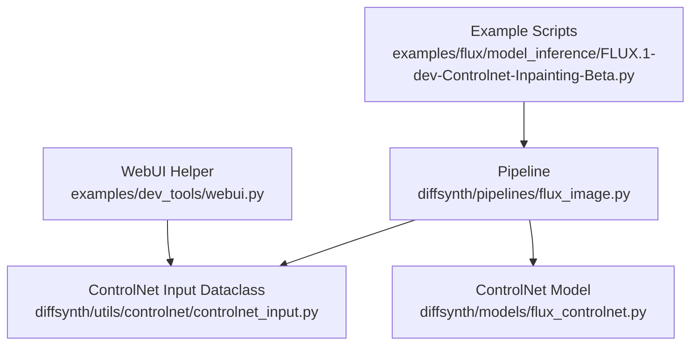
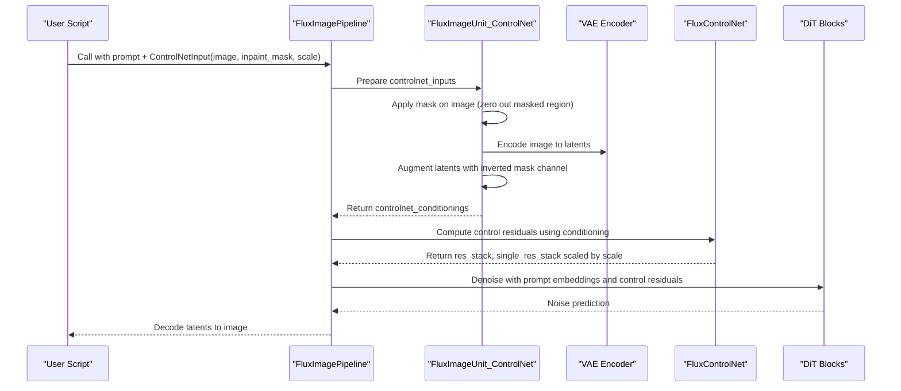
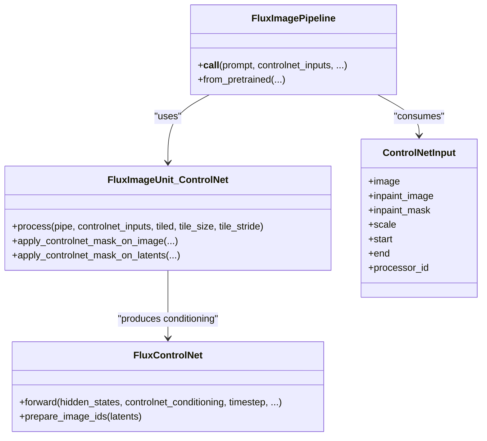

# FLUX ControlNet Inpainting Beta

<cite>
**Referenced Files in This Document**
- [FLUX.1-dev-Controlnet-Inpainting-Beta.py](file://examples/flux/model_inference/FLUX.1-dev-Controlnet-Inpainting-Beta.py)
- [FLUX.1-dev-Controlnet-Inpainting-Beta.py (low VRAM)](file://examples/flux/model_inference_low_vram/FLUX.1-dev-Controlnet-Inpainting-Beta.py)
- [controlnet_input.py](file://diffsynth/utils/controlnet/controlnet_input.py)
- [flux_image.py](file://diffsynth/pipelines/flux_image.py)
- [flux_controlnet.py](file://diffsynth/models/flux_controlnet.py)
- [webui.py](file://examples/dev_tools/webui.py)
</cite>

## Table of Contents
1. [Introduction](#introduction)
2. [Project Structure](#project-structure)
3. [Core Components](#core-components)
4. [Architecture Overview](#architecture-overview)
5. [Detailed Component Analysis](#detailed-component-analysis)
6. [Dependency Analysis](#dependency-analysis)
7. [Performance Considerations](#performance-considerations)
8. [Troubleshooting Guide](#troubleshooting-guide)
9. [Conclusion](#conclusion)
10. [Appendices](#appendices)

## Introduction
This document explains how to use the FLUX ControlNet Inpainting Beta feature for precise image editing and content replacement using masks. It covers:
- How to prepare masks (binary, gradient-based, and complex region selections)
- Using ControlNetInput with inpaint_mask and scale
- Integrating text prompts for guided inpainting
- Practical scenarios: object removal, content addition, and style transfer within masked regions

The implementation is built on a pipeline that encodes images into latent space, applies ControlNet conditioning derived from the input image and mask, and decodes the result back to an image.

## Project Structure
Key files involved in FLUX ControlNet Inpainting Beta:
- Example scripts demonstrating usage and low-VRAM configuration
- ControlNetInput dataclass defining parameters like inpaint_mask and scale
- Pipeline units handling mask application and latent conditioning
- ControlNet model definition for generating control signals

**Diagram sources**
- [FLUX.1-dev-Controlnet-Inpainting-Beta.py:1-37](file://examples/flux/model_inference/FLUX.1-dev-Controlnet-Inpainting-Beta.py#L1-L37)
- [flux_image.py:447-486](file://diffsynth/pipelines/flux_image.py#L447-L486)
- [controlnet_input.py:1-15](file://diffsynth/utils/controlnet/controlnet_input.py#L1-L15)
- [flux_controlnet.py:61-155](file://diffsynth/models/flux_controlnet.py#L61-L155)
- [webui.py:160-177](file://examples/dev_tools/webui.py#L160-L177)

**Section sources**
- [FLUX.1-dev-Controlnet-Inpainting-Beta.py:1-37](file://examples/flux/model_inference/FLUX.1-dev-Controlnet-Inpainting-Beta.py#L1-L37)
- [FLUX.1-dev-Controlnet-Inpainting-Beta.py (low VRAM):1-48](file://examples/flux/model_inference_low_vram/FLUX.1-dev-Controlnet-Inpainting-Beta.py#L1-L48)
- [controlnet_input.py:1-15](file://diffsynth/utils/controlnet/controlnet_input.py#L1-L15)
- [flux_image.py:447-486](file://diffsynth/pipelines/flux_image.py#L447-L486)
- [flux_controlnet.py:61-155](file://diffsynth/models/flux_controlnet.py#L61-L155)
- [webui.py:160-177](file://examples/dev_tools/webui.py#L160-L177)

## Core Components
- ControlNetInput: Defines inputs for ControlNet including image, inpaint_image, inpaint_mask, processor_id, and scale. The inpaint_mask parameter controls which pixels are eligible for inpainting.
- FluxImageUnit_ControlNet: Applies the mask to the input image and augments latents with a mask channel; computes control conditionings used by the ControlNet model.
- FluxControlNet: Generates control signals (residual stacks) that modulate the DiT blocks during denoising.

Practical usage patterns:
- Binary masks: Create a white region where inpainting should occur.
- Gradient masks: Use edge detection or texture analysis to derive soft or binary masks.
- Complex region selection: Combine multiple masks or thresholds to target specific areas.

**Section sources**
- [controlnet_input.py:1-15](file://diffsynth/utils/controlnet/controlnet_input.py#L1-L15)
- [flux_image.py:447-486](file://diffsynth/pipelines/flux_image.py#L447-L486)
- [flux_controlnet.py:61-155](file://diffsynth/models/flux_controlnet.py#L61-L155)

## Architecture Overview
The inpainting workflow integrates prompt encoding, image encoding, ControlNet conditioning, and denoising steps. Masks influence both the input image processing and latent augmentation.

**Diagram sources**
- [flux_image.py:447-486](file://diffsynth/pipelines/flux_image.py#L447-L486)
- [flux_controlnet.py:112-155](file://diffsynth/models/flux_controlnet.py#L112-L155)

## Detailed Component Analysis

### ControlNetInput Usage
- Fields:
  - image: Base image to edit
  - inpaint_image: Optional replacement image content (used in some pipelines)
  - inpaint_mask: Mask indicating where inpainting occurs
  - scale: Controls the strength of ControlNet conditioning
  - start/end: Temporal scheduling for when ControlNet applies during inference
  - processor_id: Optional identifier for multi-processor setups

In the FLUX example, a binary mask is created and passed via ControlNetInput along with the base image and scale.

**Section sources**
- [controlnet_input.py:1-15](file://diffsynth/utils/controlnet/controlnet_input.py#L1-L15)
- [FLUX.1-dev-Controlnet-Inpainting-Beta.py:26-37](file://examples/flux/model_inference/FLUX.1-dev-Controlnet-Inpainting-Beta.py#L26-L37)
- [FLUX.1-dev-Controlnet-Inpainting-Beta.py (low VRAM):37-48](file://examples/flux/model_inference_low_vram/FLUX.1-dev-Controlnet-Inpainting-Beta.py#L37-L48)

### Mask Preparation Techniques
- Binary masks:
  - Create a zero-filled array and set desired regions to white (e.g., 255).
  - Save as PIL Image and pass via inpaint_mask.
- Gradient masks:
  - Compute gradients (Sobel/Laplacian), threshold locally or globally, and binarize.
  - Morphological operations can refine edges and fill gaps.
- Complex region selections:
  - Combine multiple masks (union/intersection).
  - Use connected component analysis to filter small regions and select top candidates by intensity.

These techniques are demonstrated in other parts of the repository for texture region detection and adaptive masking.

**Section sources**
- [detect_texture_regions.py:139-201](file://detect_texture_regions.py#L139-L201)
- [analyze_residual_regions.py:212-381](file://examples/qwen_image/analyze_residual_regions.py#L212-L381)

### ControlNet Conditioning and Scale Tuning
- FluxImageUnit_ControlNet:
  - If inpaint_mask is provided, it zeros out the masked region in the input image before encoding.
  - Latents are augmented with an inverted mask channel to guide inpainting.
- FluxControlNet:
  - Produces residual stacks aligned to DiT blocks.
  - MultiControlNet scales each ControlNet’s contributions by ControlNetInput.scale.

Scale tuning guidelines:
- Lower scale (e.g., 0.7–0.9): Gentle edits, preserves more original structure.
- Higher scale (e.g., >1.0): Stronger edits, may introduce artifacts if too aggressive.

**Section sources**
- [flux_image.py:447-486](file://diffsynth/pipelines/flux_image.py#L447-L486)
- [flux_controlnet.py:61-155](file://diffsynth/models/flux_controlnet.py#L61-L155)

### Integration with Text Prompts
- Prompts are encoded via CLIP and T5 text encoders.
- ControlNet residuals modulate the DiT denoising process alongside prompt embeddings.
- For guided inpainting, describe the desired content in the prompt while the mask restricts changes to specific regions.

**Section sources**
- [flux_image.py:336-395](file://diffsynth/pipelines/flux_image.py#L336-L395)

### Practical Scenarios
- Object removal:
  - Mask the object to remove.
  - Prompt describes the background or scene without the object.
  - Use moderate scale to blend seamlessly.
- Content addition:
  - Mask the region where new content should appear.
  - Prompt specifies the added content details.
  - Adjust scale to balance fidelity and creativity.
- Style transfer within masked regions:
  - Mask the area to stylize.
  - Prompt includes style descriptors.
  - Tune scale to avoid over-stylization.

Examples are shown in the FLUX inpainting scripts where a base image is generated first, then edited with a mask and updated prompt.

**Section sources**
- [FLUX.1-dev-Controlnet-Inpainting-Beta.py:19-37](file://examples/flux/model_inference/FLUX.1-dev-Controlnet-Inpainting-Beta.py#L19-L37)
- [FLUX.1-dev-Controlnet-Inpainting-Beta.py (low VRAM):30-48](file://examples/flux/model_inference_low_vram/FLUX.1-dev-Controlnet-Inpainting-Beta.py#L30-L48)

## Dependency Analysis
The following diagram shows how components depend on each other during inpainting:

**Diagram sources**
- [flux_image.py:447-486](file://diffsynth/pipelines/flux_image.py#L447-L486)
- [flux_controlnet.py:61-155](file://diffsynth/models/flux_controlnet.py#L61-L155)
- [controlnet_input.py:1-15](file://diffsynth/utils/controlnet/controlnet_input.py#L1-L15)

**Section sources**
- [flux_image.py:447-486](file://diffsynth/pipelines/flux_image.py#L447-L486)
- [flux_controlnet.py:61-155](file://diffsynth/models/flux_controlnet.py#L61-L155)
- [controlnet_input.py:1-15](file://diffsynth/utils/controlnet/controlnet_input.py#L1-L15)

## Performance Considerations
- Low VRAM mode:
  - Offload/onload strategies reduce memory footprint.
  - Use float8_e4m3fn for offload and computation dtype bfloat16 for accuracy.
- Tiled decoding:
  - Enables large image generation with limited memory by processing tiles.
- Scheduler and steps:
  - FlowMatchScheduler manages timesteps; fewer steps speed up inference but may reduce quality.

**Section sources**
- [FLUX.1-dev-Controlnet-Inpainting-Beta.py (low VRAM):7-28](file://examples/flux/model_inference_low_vram/FLUX.1-dev-Controlnet-Inpainting-Beta.py#L7-L28)
- [flux_image.py:273-291](file://diffsynth/pipelines/flux_image.py#L273-L291)

## Troubleshooting Guide
Common issues and resolutions:
- Mask not applied:
  - Ensure inpaint_mask is provided and matches image dimensions.
  - Verify mask values are in expected range (white for masked regions).
- Over-editing or artifacts:
  - Reduce ControlNetInput.scale to soften edits.
  - Refine mask boundaries to avoid harsh transitions.
- Memory errors:
  - Enable low VRAM configuration and use tiled decoding.
  - Reduce resolution or number of inference steps.

**Section sources**
- [flux_image.py:447-486](file://diffsynth/pipelines/flux_image.py#L447-L486)
- [FLUX.1-dev-Controlnet-Inpainting-Beta.py (low VRAM):7-28](file://examples/flux/model_inference_low_vram/FLUX.1-dev-Controlnet-Inpainting-Beta.py#L7-L28)

## Conclusion
FLUX ControlNet Inpainting Beta enables precise, prompt-guided image editing through masks. By preparing appropriate masks and tuning ControlNetInput.scale, users can perform object removal, content addition, and localized style transfer effectively. The pipeline integrates text prompts and ControlNet conditioning to achieve high-quality results while offering low-VRAM options for resource-constrained environments.

## Appendices
- Example usage paths:
  - Standard inference: [FLUX.1-dev-Controlnet-Inpainting-Beta.py:1-37](file://examples/flux/model_inference/FLUX.1-dev-Controlnet-Inpainting-Beta.py#L1-L37)
  - Low VRAM inference: [FLUX.1-dev-Controlnet-Inpainting-Beta.py (low VRAM):1-48](file://examples/flux/model_inference_low_vram/FLUX.1-dev-Controlnet-Inpainting-Beta.py#L1-L48)
- WebUI helper for ControlNetInput creation: [webui.py:160-177](file://examples/dev_tools/webui.py#L160-L177)