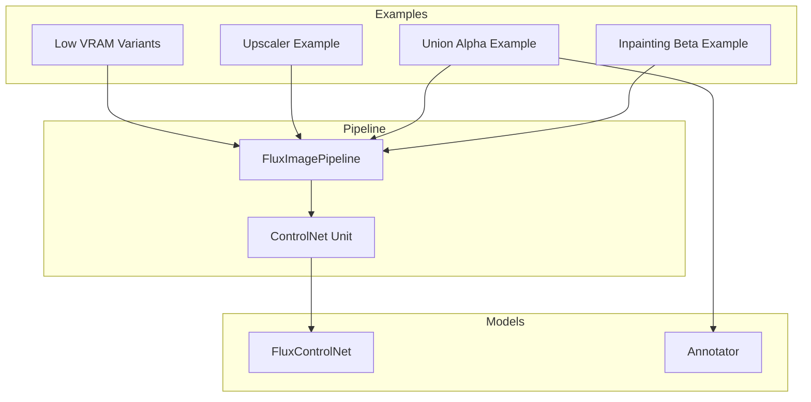
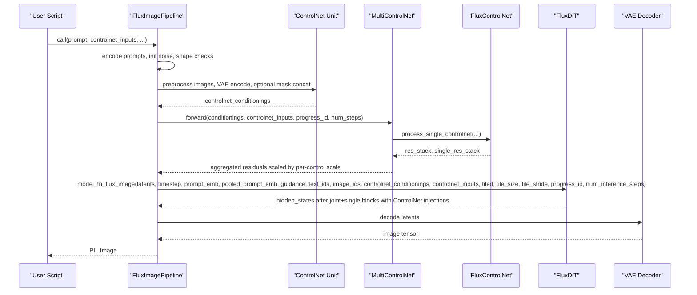
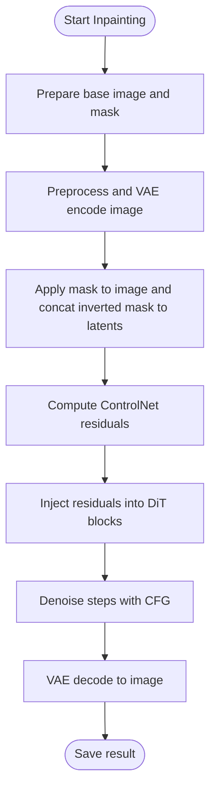
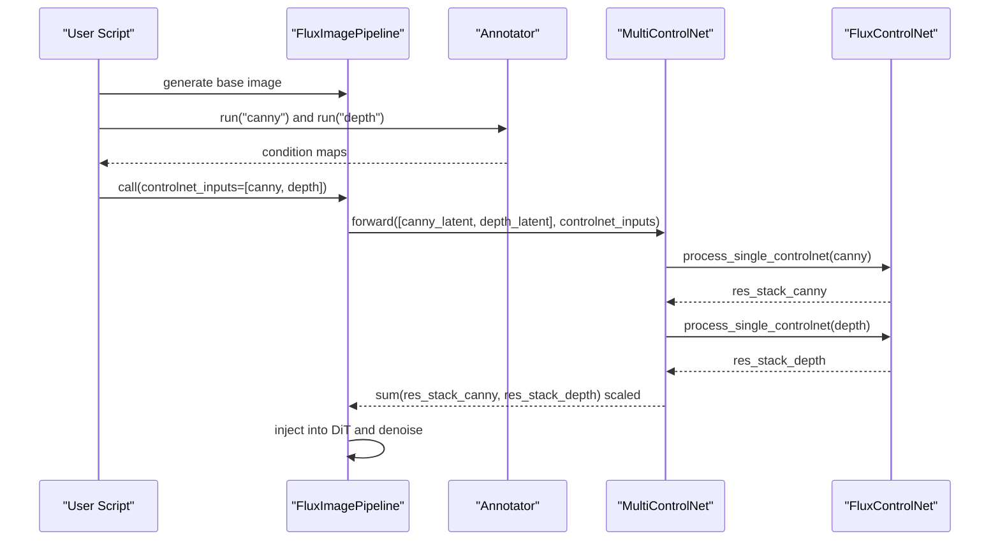
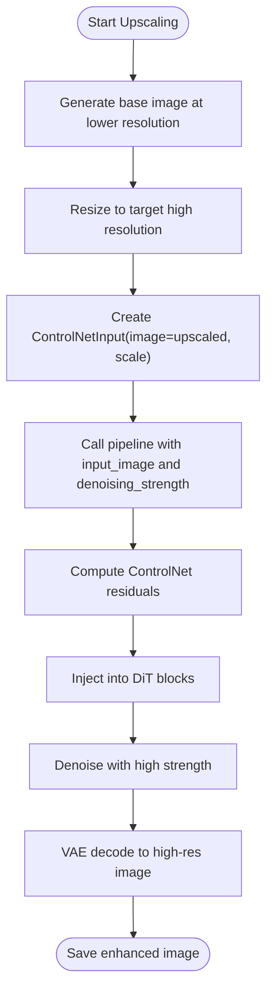
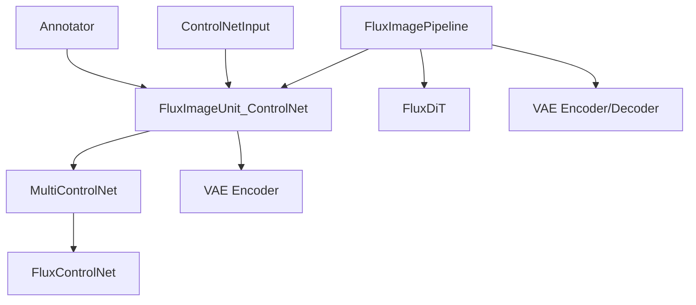

# FLUX ControlNet Integration Examples

<cite>
**Referenced Files in This Document**
- [FLUX.1-dev-Controlnet-Inpainting-Beta.py](file://examples/flux/model_inference/FLUX.1-dev-Controlnet-Inpainting-Beta.py)
- [FLUX.1-dev-Controlnet-Union-alpha.py](file://examples/flux/model_inference/FLUX.1-dev-Controlnet-Union-alpha.py)
- [FLUX.1-dev-Controlnet-Upscaler.py](file://examples/flux/model_inference/FLUX.1-dev-Controlnet-Upscaler.py)
- [FLUX.1-dev-Controlnet-Inpainting-Beta (low VRAM).py](file://examples/flux/model_inference_low_vram/FLUX.1-dev-Controlnet-Inpainting-Beta.py)
- [FLUX.1-dev-Controlnet-Union-alpha (low VRAM).py](file://examples/flux/model_inference_low_vram/FLUX.1-dev-Controlnet-Union-alpha.py)
- [FLUX.1-dev-Controlnet-Upscaler (low VRAM).py](file://examples/flux/model_inference_low_vram/FLUX.1-dev-Controlnet-Upscaler.py)
- [flux_controlnet.py](file://diffsynth/models/flux_controlnet.py)
- [annotator.py](file://diffsynth/utils/controlnet/annotator.py)
- [controlnet_input.py](file://diffsynth/utils/controlnet/controlnet_input.py)
- [flux_image.py](file://diffsynth/pipelines/flux_image.py)
- [base_pipeline.py](file://diffsynth/diffusion/base_pipeline.py)
</cite>

## Table of Contents
1. [Introduction](#introduction)
2. [Project Structure](#project-structure)
3. [Core Components](#core-components)
4. [Architecture Overview](#architecture-overview)
5. [Detailed Component Analysis](#detailed-component-analysis)
6. [Dependency Analysis](#dependency-analysis)
7. [Performance Considerations](#performance-considerations)
8. [Troubleshooting Guide](#troubleshooting-guide)
9. [Conclusion](#conclusion)

## Introduction
This document provides comprehensive, practical guidance for integrating and using three FLUX ControlNet variants:
- Inpainting Beta: image inpainting and editing with masks
- Union Alpha: multi-condition control combining depth, canny, pose, etc.
- Upscaler: high-resolution image enhancement via ControlNet-guided upscaling

You will learn how to prepare input conditions, configure ControlNet weights and schedules, combine multiple controls, and optimize for different use cases such as low VRAM environments or tiled inference. Each section includes concrete example references and code snippet paths to help you reproduce results quickly.

## Project Structure
The repository organizes FLUX ControlNet examples under examples/flux/model_inference and examples/flux/model_inference_low_vram. The core pipeline and ControlNet implementation live under diffsynth/pipelines and diffsynth/models. Utilities for annotators and ControlNet inputs are under diffsynth/utils/controlnet.

**Diagram sources**
- [FLUX.1-dev-Controlnet-Inpainting-Beta.py:1-37](file://examples/flux/model_inference/FLUX.1-dev-Controlnet-Inpainting-Beta.py#L1-L37)
- [FLUX.1-dev-Controlnet-Union-alpha.py:1-41](file://examples/flux/model_inference/FLUX.1-dev-Controlnet-Union-alpha.py#L1-L41)
- [FLUX.1-dev-Controlnet-Upscaler.py:1-33](file://examples/flux/model_inference/FLUX.1-dev-Controlnet-Upscaler.py#L1-L33)
- [flux_image.py:23-55](file://diffsynth/pipelines/flux_image.py#L23-L55)
- [flux_controlnet.py:61-156](file://diffsynth/models/flux_controlnet.py#L61-L156)
- [annotator.py:1-64](file://diffsynth/utils/controlnet/annotator.py#L1-L64)

**Section sources**
- [FLUX.1-dev-Controlnet-Inpainting-Beta.py:1-37](file://examples/flux/model_inference/FLUX.1-dev-Controlnet-Inpainting-Beta.py#L1-L37)
- [FLUX.1-dev-Controlnet-Union-alpha.py:1-41](file://examples/flux/model_inference/FLUX.1-dev-Controlnet-Union-alpha.py#L1-L41)
- [FLUX.1-dev-Controlnet-Upscaler.py:1-33](file://examples/flux/model_inference/FLUX.1-dev-Controlnet-Upscaler.py#L1-L33)
- [flux_image.py:57-106](file://diffsynth/pipelines/flux_image.py#L57-L106)

## Core Components
- FluxImagePipeline: orchestrates the full generation pipeline, including prompt encoding, noise initialization, ControlNet conditioning, denoising loop, and VAE decoding. It supports tiled inference and integrates ControlNet via a MultiControlNet wrapper.
- MultiControlNet: aggregates multiple ControlNet models and applies per-control scaling and temporal scheduling (start/end).
- FluxControlNet: implements the ControlNet architecture aligned with FLUX DiT blocks, producing residual stacks injected into joint and single transformer blocks.
- Annotator: prepares condition maps (canny, depth, softedge, lineart, openpose, normal, tile, none, inpaint) using controlnet-aux processors.
- ControlNetInput: dataclass specifying per-control parameters like image, inpaint mask, processor_id, scale, and temporal schedule (start/end).

Key responsibilities:
- Condition preparation: preprocess images, encode through VAE encoder, optionally concatenate masks for inpainting.
- ControlNet injection: compute residual stacks and add them to DiT hidden states at corresponding block indices.
- Scheduling: apply per-control start/end thresholds based on progress during denoising steps.

**Section sources**
- [flux_image.py:23-55](file://diffsynth/pipelines/flux_image.py#L23-L55)
- [flux_controlnet.py:61-156](file://diffsynth/models/flux_controlnet.py#L61-L156)
- [annotator.py:1-64](file://diffsynth/utils/controlnet/annotator.py#L1-L64)
- [controlnet_input.py:1-15](file://diffsynth/utils/controlnet/controlnet_input.py#L1-L15)

## Architecture Overview
The end-to-end flow for FLUX ControlNet integration involves preparing text and image embeddings, generating latents, computing ControlNet residuals from condition inputs, injecting them into the DiT forward pass, and decoding the final image.

**Diagram sources**
- [flux_image.py:180-291](file://diffsynth/pipelines/flux_image.py#L180-L291)
- [flux_image.py:447-487](file://diffsynth/pipelines/flux_image.py#L447-L487)
- [flux_image.py:1000-1203](file://diffsynth/pipelines/flux_image.py#L1000-L1203)
- [flux_controlnet.py:112-156](file://diffsynth/models/flux_controlnet.py#L112-L156)

## Detailed Component Analysis

### Inpainting Beta (image inpainting and editing)
Use case: edit specific regions by providing an original image and a binary mask indicating where to inpaint.

How it works:
- Prepare a base image and a mask (white region indicates area to inpaint).
- Create a ControlNetInput with image and inpaint_mask; set scale to control strength.
- The ControlNet unit masks the input image and concatenates the inverted mask channel into the latent conditioning before VAE encoding.
- During denoising, ControlNet residuals are added to DiT blocks according to the Inpainting Beta model configuration.

Practical example references:
- Full VRAM example: [FLUX.1-dev-Controlnet-Inpainting-Beta.py:1-37](file://examples/flux/model_inference/FLUX.1-dev-Controlnet-Inpainting-Beta.py#L1-L37)
- Low VRAM variant with vram_config: [FLUX.1-dev-Controlnet-Inpainting-Beta (low VRAM).py:1-48](file://examples/flux/model_inference_low_vram/FLUX.1-dev-Controlnet-Inpainting-Beta.py#L1-L48)

Parameter tuning tips:
- Increase scale to strengthen inpainting influence; typical range 0.7–1.0.
- Adjust seed and denoising_strength when blending with input_image for partial edits.
- Use tiled=True for large resolutions to reduce memory usage.

**Diagram sources**
- [flux_image.py:447-487](file://diffsynth/pipelines/flux_image.py#L447-L487)
- [flux_controlnet.py:112-156](file://diffsynth/models/flux_controlnet.py#L112-L156)

**Section sources**
- [FLUX.1-dev-Controlnet-Inpainting-Beta.py:1-37](file://examples/flux/model_inference/FLUX.1-dev-Controlnet-Inpainting-Beta.py#L1-L37)
- [FLUX.1-dev-Controlnet-Inpainting-Beta (low VRAM).py:1-48](file://examples/flux/model_inference_low_vram/FLUX.1-dev-Controlnet-Inpainting-Beta.py#L1-L48)
- [flux_image.py:447-487](file://diffsynth/pipelines/flux_image.py#L447-L487)

### Union Alpha (multi-condition control)
Use case: combine multiple control signals (e.g., canny edges, depth maps, pose skeletons) to guide generation precisely.

How it works:
- Generate or obtain a base image.
- Use Annotator to produce condition maps (e.g., canny, depth).
- Create multiple ControlNetInput entries, each with its own image and processor_id; set scales to balance contributions.
- MultiControlNet aggregates residuals across all controls and injects them into DiT blocks.

Practical example references:
- Full VRAM example: [FLUX.1-dev-Controlnet-Union-alpha.py:1-41](file://examples/flux/model_inference/FLUX.1-dev-Controlnet-Union-alpha.py#L1-L41)
- Low VRAM variant: [FLUX.1-dev-Controlnet-Union-alpha (low VRAM).py:1-51](file://examples/flux/model_inference_low_vram/FLUX.1-dev-Controlnet-Union-alpha.py#L1-L51)

Parameter tuning tips:
- Balance scales across controls (e.g., 0.3 each) to avoid dominance by one signal.
- Use processor_id to specify the correct annotator type for each control.
- For complex scenes, increase num_inference_steps and adjust CFG_scale for stability.

**Diagram sources**
- [annotator.py:1-64](file://diffsynth/utils/controlnet/annotator.py#L1-L64)
- [flux_image.py:23-55](file://diffsynth/pipelines/flux_image.py#L23-L55)
- [flux_controlnet.py:112-156](file://diffsynth/models/flux_controlnet.py#L112-L156)

**Section sources**
- [FLUX.1-dev-Controlnet-Union-alpha.py:1-41](file://examples/flux/model_inference/FLUX.1-dev-Controlnet-Union-alpha.py#L1-L41)
- [FLUX.1-dev-Controlnet-Union-alpha (low VRAM).py:1-51](file://examples/flux/model_inference_low_vram/FLUX.1-dev-Controlnet-Union-alpha.py#L1-L51)
- [annotator.py:1-64](file://diffsynth/utils/controlnet/annotator.py#L1-L64)
- [flux_image.py:23-55](file://diffsynth/pipelines/flux_image.py#L23-L55)

### Upscaler (high-resolution enhancement)
Use case: enhance resolution and detail while preserving content using ControlNet-guided upscaling.

How it works:
- Generate a base image at lower resolution.
- Resize to target high resolution.
- Provide the upscaled image as ControlNet input and set denoising_strength close to 1.0 to retain structure while adding detail.
- Enable tiled=True for large outputs to manage memory.

Practical example references:
- Full VRAM example: [FLUX.1-dev-Controlnet-Upscaler.py:1-33](file://examples/flux/model_inference/FLUX.1-dev-Controlnet-Upscaler.py#L1-L33)
- Low VRAM variant: [FLUX.1-dev-Controlnet-Upscaler (low VRAM).py:1-44](file://examples/flux/model_inference_low_vram/FLUX.1-dev-Controlnet-Upscaler.py#L1-L44)

Parameter tuning tips:
- Scale around 0.7–0.9 balances fidelity vs. enhancement.
- denoising_strength near 0.99 preserves most original structure.
- tiled=True with appropriate tile_size and tile_stride reduces VRAM pressure.

**Diagram sources**
- [flux_image.py:180-291](file://diffsynth/pipelines/flux_image.py#L180-L291)
- [flux_controlnet.py:112-156](file://diffsynth/models/flux_controlnet.py#L112-L156)

**Section sources**
- [FLUX.1-dev-Controlnet-Upscaler.py:1-33](file://examples/flux/model_inference/FLUX.1-dev-Controlnet-Upscaler.py#L1-L33)
- [FLUX.1-dev-Controlnet-Upscaler (low VRAM).py:1-44](file://examples/flux/model_inference_low_vram/FLUX.1-dev-Controlnet-Upscaler.py#L1-L44)
- [flux_image.py:180-291](file://diffsynth/pipelines/flux_image.py#L180-L291)

## Dependency Analysis
The ControlNet integration depends on several modules:
- FluxImagePipeline orchestrates units and calls model_fn_flux_image which handles ControlNet injection.
- MultiControlNet manages multiple ControlNet models and their residuals.
- FluxControlNet computes residuals aligned with DiT block counts and modes.
- Annotator produces condition maps using controlnet-aux processors.
- ControlNetInput defines per-control parameters.

**Diagram sources**
- [flux_image.py:23-55](file://diffsynth/pipelines/flux_image.py#L23-L55)
- [flux_image.py:447-487](file://diffsynth/pipelines/flux_image.py#L447-L487)
- [flux_controlnet.py:61-156](file://diffsynth/models/flux_controlnet.py#L61-L156)
- [annotator.py:1-64](file://diffsynth/utils/controlnet/annotator.py#L1-L64)
- [controlnet_input.py:1-15](file://diffsynth/utils/controlnet/controlnet_input.py#L1-L15)

**Section sources**
- [flux_image.py:1000-1203](file://diffsynth/pipelines/flux_image.py#L1000-L1203)
- [flux_controlnet.py:265-385](file://diffsynth/models/flux_controlnet.py#L265-L385)

## Performance Considerations
- Low VRAM mode: Use vram_config with offload/onload/preparing/computation dtypes and devices to minimize GPU memory usage. See low VRAM examples for patterns.
- Tiled inference: Enable tiled=True with tile_size and tile_stride to process large images in patches, reducing peak memory.
- ControlNet scheduling: Use start/end in ControlNetInput to activate controls only during certain phases of denoising, improving stability and quality.
- Batch and CFG: Adjust cfg_scale and num_inference_steps to balance speed and fidelity. Lower steps may suffice for upscaling tasks.
- Quantization: FluxControlNet includes quantize() methods for Linear/RMSNorm/Embedding layers to reduce memory footprint if needed.

[No sources needed since this section provides general guidance]

## Troubleshooting Guide
Common issues and remedies:
- Mask not applied correctly: Ensure inpaint_mask is binary (0/255) and matches image size. The ControlNet unit preprocesses and inverts the mask before concatenation.
- Multiple controls conflicting: Tune individual scales and consider activating controls at different stages via start/end thresholds.
- Out-of-memory errors: Switch to low VRAM mode, enable tiled inference, reduce resolution, or decrease batch size.
- Annotator model missing: Download required annotator models (e.g., dpt_hybrid-midas-501f0c75.pt) as shown in Union Alpha examples.

**Section sources**
- [flux_image.py:447-487](file://diffsynth/pipelines/flux_image.py#L447-L487)
- [annotator.py:1-64](file://diffsynth/utils/controlnet/annotator.py#L1-L64)
- [FLUX.1-dev-Controlnet-Union-alpha.py:1-41](file://examples/flux/model_inference/FLUX.1-dev-Controlnet-Union-alpha.py#L1-L41)

## Conclusion
FLUX ControlNet integration in this repository offers flexible and powerful control over image generation through three primary variants: Inpainting Beta for precise edits, Union Alpha for multi-condition guidance, and Upscaler for high-resolution enhancement. By leveraging the provided examples, understanding the pipeline architecture, and applying parameter tuning strategies, you can achieve robust results across diverse use cases. For constrained environments, adopt low VRAM configurations and tiled inference to maintain performance without sacrificing output quality.

[No sources needed since this section summarizes without analyzing specific files]