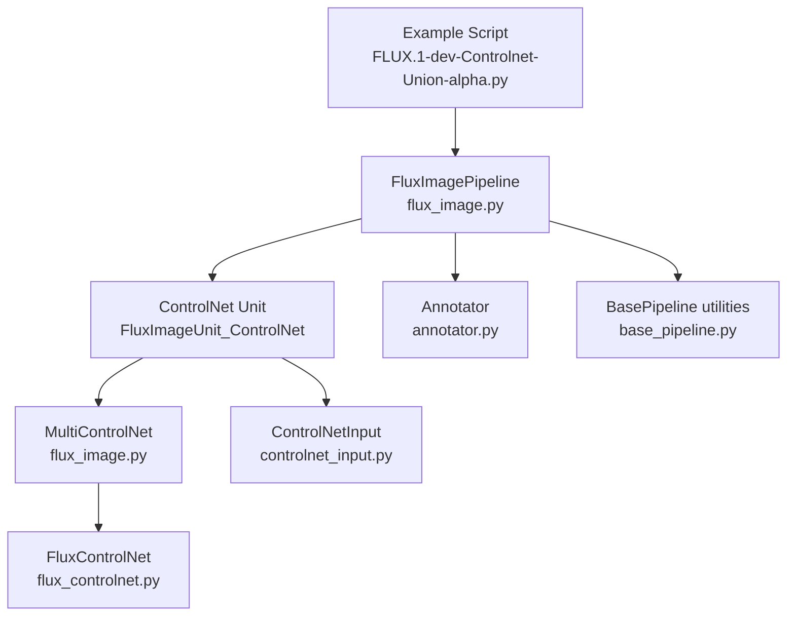
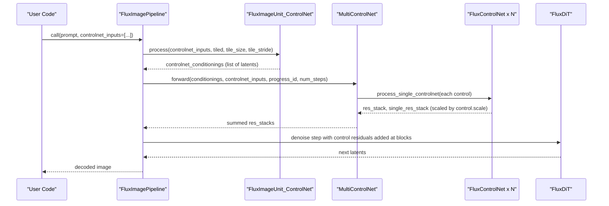
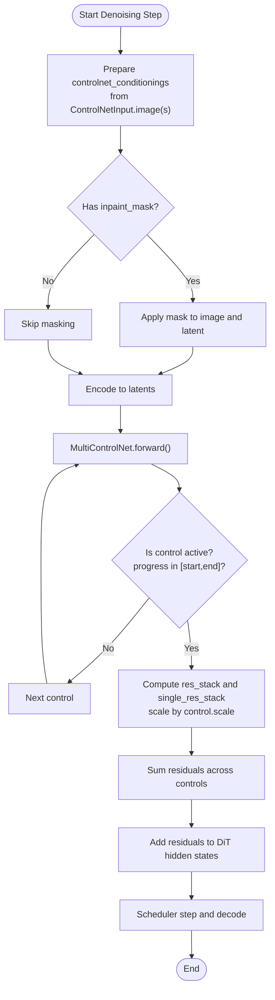
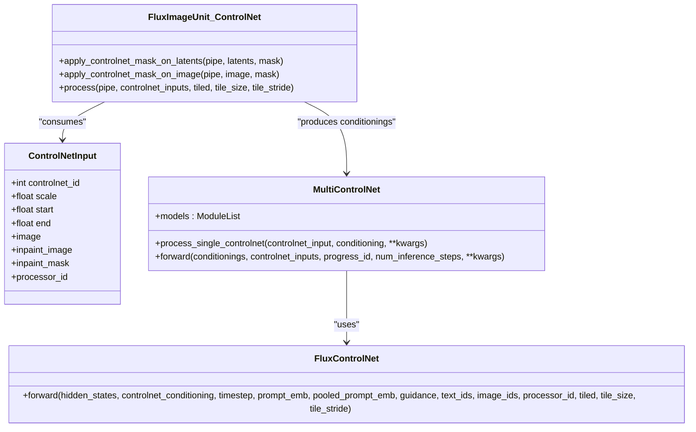
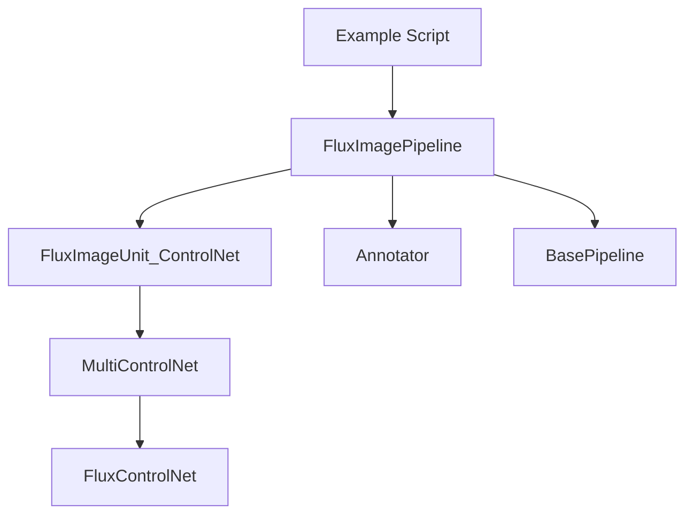

# FLUX ControlNet Union Alpha

<cite>
**Referenced Files in This Document**
- [FLUX.1-dev-Controlnet-Union-alpha.py](file://examples/flux/model_inference/FLUX.1-dev-Controlnet-Union-alpha.py)
- [flux_image.py](file://diffsynth/pipelines/flux_image.py)
- [controlnet_input.py](file://diffsynth/utils/controlnet/controlnet_input.py)
- [annotator.py](file://diffsynth/utils/controlnet/annotator.py)
- [flux_controlnet.py](file://diffsynth/models/flux_controlnet.py)
- [base_pipeline.py](file://diffsynth/diffusion/base_pipeline.py)
- [FLUX.1-dev-Controlnet-Union-alpha.sh](file://examples/flux/model_training/full/FLUX.1-dev-Controlnet-Union-alpha.sh)
</cite>

## Table of Contents
1. [Introduction](#introduction)
2. [Project Structure](#project-structure)
3. [Core Components](#core-components)
4. [Architecture Overview](#architecture-overview)
5. [Detailed Component Analysis](#detailed-component-analysis)
6. [Dependency Analysis](#dependency-analysis)
7. [Performance Considerations](#performance-considerations)
8. [Troubleshooting Guide](#troubleshooting-guide)
9. [Conclusion](#conclusion)
10. [Appendices](#appendices)

## Introduction
This document explains how to use the FLUX ControlNet Union Alpha multi-condition control system to combine multiple ControlNet inputs simultaneously (e.g., depth maps, canny edges, pose estimation, semantic segmentation) for enhanced image generation control. It covers:
- How to construct and pass multiple ControlNetInput objects with different processor_id types
- How weights are balanced across multiple controls via per-control scale and scheduling parameters
- How structural controls (depth, canny) and semantic controls (pose/openpose) are combined
- Practical parameter tuning strategies for optimal results

## Project Structure
The FLUX ControlNet Union Alpha feature is implemented across a few key modules:
- Pipeline orchestration and ControlNet unit processing
- ControlNet model wrapper and union logic
- ControlNet input dataclass
- Annotators for generating control signals from images
- Example inference script demonstrating multi-control usage

**Diagram sources**
- [FLUX.1-dev-Controlnet-Union-alpha.py:1-41](file://examples/flux/model_inference/FLUX.1-dev-Controlnet-Union-alpha.py#L1-L41)
- [flux_image.py:23-54](file://diffsynth/pipelines/flux_image.py#L23-L54)
- [flux_image.py:447-486](file://diffsynth/pipelines/flux_image.py#L447-L486)
- [flux_controlnet.py:61-155](file://diffsynth/models/flux_controlnet.py#L61-L155)
- [annotator.py:1-64](file://diffsynth/utils/controlnet/annotator.py#L1-L64)
- [base_pipeline.py:1-120](file://diffsynth/diffusion/base_pipeline.py#L1-L120)
- [controlnet_input.py:1-15](file://diffsynth/utils/controlnet/controlnet_input.py#L1-L15)

**Section sources**
- [FLUX.1-dev-Controlnet-Union-alpha.py:1-41](file://examples/flux/model_inference/FLUX.1-dev-Controlnet-Union-alpha.py#L1-L41)
- [flux_image.py:23-54](file://diffsynth/pipelines/flux_image.py#L23-L54)
- [flux_image.py:447-486](file://diffsynth/pipelines/flux_image.py#L447-L486)
- [flux_controlnet.py:61-155](file://diffsynth/models/flux_controlnet.py#L61-L155)
- [annotator.py:1-64](file://diffsynth/utils/controlnet/annotator.py#L1-L64)
- [base_pipeline.py:1-120](file://diffsynth/diffusion/base_pipeline.py#L1-L120)
- [controlnet_input.py:1-15](file://diffsynth/utils/controlnet/controlnet_input.py#L1-L15)

## Core Components
- ControlNetInput: Data structure that encapsulates each control signal, including its image, optional inpaint mask, per-control scale, and temporal scheduling (start/end).
- MultiControlNet: Aggregates one or more FluxControlNet models and sums their residual contributions, applying per-control scaling and scheduling.
- FluxImageUnit_ControlNet: Encodes control images into latent space and optionally applies inpaint masks before passing them to MultiControlNet.
- FluxControlNet: The underlying ControlNet architecture that produces residual stacks aligned to DiT blocks.
- Annotator: Generates control signals (canny, depth, openpose, etc.) from images using controlnet-aux detectors.

Key responsibilities:
- Prepare conditionings from PIL images and optional masks
- Apply per-control scale and schedule activation windows
- Sum residuals from multiple controls at corresponding DiT block levels

**Section sources**
- [controlnet_input.py:1-15](file://diffsynth/utils/controlnet/controlnet_input.py#L1-L15)
- [flux_image.py:23-54](file://diffsynth/pipelines/flux_image.py#L23-L54)
- [flux_image.py:447-486](file://diffsynth/pipelines/flux_image.py#L447-L486)
- [flux_controlnet.py:61-155](file://diffsynth/models/flux_controlnet.py#L61-L155)
- [annotator.py:1-64](file://diffsynth/utils/controlnet/annotator.py#L1-L64)

## Architecture Overview
The pipeline integrates multiple ControlNet branches into the main DiT denoising loop. Each ControlNet branch encodes a control image into latent space and outputs residual tensors that are added to the DiT hidden states at matching block indices.

**Diagram sources**
- [flux_image.py:180-291](file://diffsynth/pipelines/flux_image.py#L180-L291)
- [flux_image.py:447-486](file://diffsynth/pipelines/flux_image.py#L447-L486)
- [flux_image.py:23-54](file://diffsynth/pipelines/flux_image.py#L23-L54)
- [flux_controlnet.py:112-155](file://diffsynth/models/flux_controlnet.py#L112-L155)

## Detailed Component Analysis

### ControlNetInput Usage and Condition Types
- Fields:
  - image: PIL image used as the control signal
  - inpaint_image/inpaint_mask: optional inpainting guidance; mask is applied to zero out regions before encoding
  - processor_id: string indicating the annotator type (e.g., "canny", "depth", "openpose")
  - scale: float multiplier for the control’s residual contribution
  - start/end: floats in [0,1] defining when during inference the control is active (progress = (num_steps - 1 - progress_id)/max(...))

Supported processor_id values include canny, depth, softedge, lineart, lineart_anime, openpose, normal, tile, none, inpaint.

Usage pattern:
- Generate control images with Annotator(processor_id)
- Build a list of ControlNetInput objects, each with its own scale and scheduling
- Pass the list to the pipeline under controlnet_inputs

**Section sources**
- [controlnet_input.py:1-15](file://diffsynth/utils/controlnet/controlnet_input.py#L1-L15)
- [annotator.py:1-64](file://diffsynth/utils/controlnet/annotator.py#L1-L64)
- [FLUX.1-dev-Controlnet-Union-alpha.py:28-40](file://examples/flux/model_inference/FLUX.1-dev-Controlnet-Union-alpha.py#L28-L40)

### Weight Balancing Between Multiple Controls
- Per-control scale: Each ControlNetInput.scale multiplies the residuals produced by that control branch before summation.
- Scheduling window: ControlNetInput.start and .end define the fraction of steps where the control is active. If progress falls outside this window, the control is skipped.
- Summation strategy: Residuals from all active controls are summed element-wise at each DiT block level.

Practical tips:
- Start with equal scales (e.g., 0.3–0.5) for each control and adjust based on visual dominance
- Use start=1.0, end=0.0 to apply a control throughout the entire denoising process
- Reduce end value to let early steps be guided strongly while allowing later steps to refine details

**Section sources**
- [flux_image.py:23-54](file://diffsynth/pipelines/flux_image.py#L23-L54)
- [flux_image.py:447-486](file://diffsynth/pipelines/flux_image.py#L447-L486)

### Combining Structural and Semantic Controls
Structural controls (depth, canny) constrain geometry and edges; semantic controls (openpose) constrain high-level semantics like pose.

Recommended combinations:
- Depth + Canny: Strong geometric consistency; useful for architectural scenes or precise layouts
- Openpose + Depth: Pose-driven composition with accurate spatial layout
- Openpose + Canny: Pose-guided edge-aware generation

Parameter tuning guidelines:
- For structural controls, moderate scales (0.2–0.5) often suffice; increase if shapes drift
- For semantic controls, lower scales (0.1–0.3) prevent over-constraining textures while preserving pose
- Use shorter end values (e.g., 0.6–0.8) for semantic controls to allow texture refinement in later steps

**Section sources**
- [annotator.py:1-64](file://diffsynth/utils/controlnet/annotator.py#L1-L64)
- [flux_image.py:23-54](file://diffsynth/pipelines/flux_image.py#L23-L54)

### Inference Flow and Tiling Support
- Control images are encoded through the VAE encoder into latent space
- Optional inpaint masks are applied to both image and latent domains
- MultiControlNet computes per-control residuals and sums them
- The model_fn adds these residuals to DiT hidden states at corresponding block indices
- Tiled inference splits large latents into tiles to reduce memory usage

**Diagram sources**
- [flux_image.py:447-486](file://diffsynth/pipelines/flux_image.py#L447-L486)
- [flux_image.py:23-54](file://diffsynth/pipelines/flux_image.py#L23-L54)
- [flux_image.py:1000-1203](file://diffsynth/pipelines/flux_image.py#L1000-L1203)

**Section sources**
- [flux_image.py:447-486](file://diffsynth/pipelines/flux_image.py#L447-L486)
- [flux_image.py:23-54](file://diffsynth/pipelines/flux_image.py#L23-L54)
- [flux_image.py:1000-1203](file://diffsynth/pipelines/flux_image.py#L1000-L1203)

### Class Diagram of ControlNet Components

**Diagram sources**
- [controlnet_input.py:1-15](file://diffsynth/utils/controlnet/controlnet_input.py#L1-L15)
- [flux_image.py:23-54](file://diffsynth/pipelines/flux_image.py#L23-L54)
- [flux_image.py:447-486](file://diffsynth/pipelines/flux_image.py#L447-L486)
- [flux_controlnet.py:61-155](file://diffsynth/models/flux_controlnet.py#L61-L155)

## Dependency Analysis
- The example script imports FluxImagePipeline and ControlNetInput, and uses Annotator to generate control images
- The pipeline constructs units including FluxImageUnit_ControlNet which prepares control latents
- MultiControlNet aggregates multiple FluxControlNet instances and sums residuals
- BasePipeline provides common utilities and VRAM management hooks

**Diagram sources**
- [FLUX.1-dev-Controlnet-Union-alpha.py:1-41](file://examples/flux/model_inference/FLUX.1-dev-Controlnet-Union-alpha.py#L1-L41)
- [flux_image.py:180-291](file://diffsynth/pipelines/flux_image.py#L180-L291)
- [flux_image.py:447-486](file://diffsynth/pipelines/flux_image.py#L447-L486)
- [flux_controlnet.py:61-155](file://diffsynth/models/flux_controlnet.py#L61-L155)
- [base_pipeline.py:1-120](file://diffsynth/diffusion/base_pipeline.py#L1-L120)

**Section sources**
- [FLUX.1-dev-Controlnet-Union-alpha.py:1-41](file://examples/flux/model_inference/FLUX.1-dev-Controlnet-Union-alpha.py#L1-L41)
- [flux_image.py:180-291](file://diffsynth/pipelines/flux_image.py#L180-L291)
- [flux_image.py:447-486](file://diffsynth/pipelines/flux_image.py#L447-L486)
- [flux_controlnet.py:61-155](file://diffsynth/models/flux_controlnet.py#L61-L155)
- [base_pipeline.py:1-120](file://diffsynth/diffusion/base_pipeline.py#L1-L120)

## Performance Considerations
- Tiled inference: Enable tiled mode to split large latents into smaller tiles, reducing VRAM usage at the cost of additional overhead
- VRAM management: Models are loaded/unloaded dynamically; ensure only necessary components are active during inference
- Scheduler steps: More steps improve quality but increase compute time; balance with desired fidelity
- Control scheduling: Narrower windows (lower end) reduce computation by skipping controls in later steps

[No sources needed since this section provides general guidance]

## Troubleshooting Guide
Common issues and resolutions:
- Unsupported processor_id: Ensure processor_id is one of the supported types (canny, depth, openpose, etc.)
- Mask misalignment: Verify inpaint_mask dimensions match the control image; masks are resized to the control image size
- Over-constrained outputs: Reduce control.scale or shorten the active window (lower end) to avoid overly rigid results
- Memory errors: Enable tiled inference or reduce resolution/steps; leverage VRAM management features

**Section sources**
- [annotator.py:1-64](file://diffsynth/utils/controlnet/annotator.py#L1-L64)
- [flux_image.py:447-486](file://diffsynth/pipelines/flux_image.py#L447-L486)

## Conclusion
The FLUX ControlNet Union Alpha enables powerful multi-condition control by combining multiple ControlNet branches with independent scaling and scheduling. By carefully selecting processor_id types, balancing scales, and tuning scheduling windows, users can achieve precise control over geometry, edges, and semantics in generated images.

[No sources needed since this section summarizes without analyzing specific files]

## Appendices

### Example Usage Pattern
- Generate base image
- Create control images using Annotator("canny") and Annotator("depth")
- Construct ControlNetInput list with appropriate scales and scheduling
- Run pipeline with controlnet_inputs to produce final image

**Section sources**
- [FLUX.1-dev-Controlnet-Union-alpha.py:21-40](file://examples/flux/model_inference/FLUX.1-dev-Controlnet-Union-alpha.py#L21-L40)

### Training Configuration Reference
- Training script demonstrates loading ControlNet weights and specifying trainable models

**Section sources**
- [FLUX.1-dev-Controlnet-Union-alpha.sh:1-17](file://examples/flux/model_training/full/FLUX.1-dev-Controlnet-Union-alpha.sh#L1-L17)