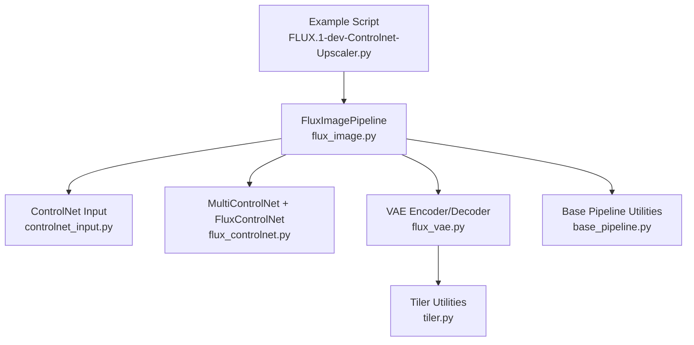
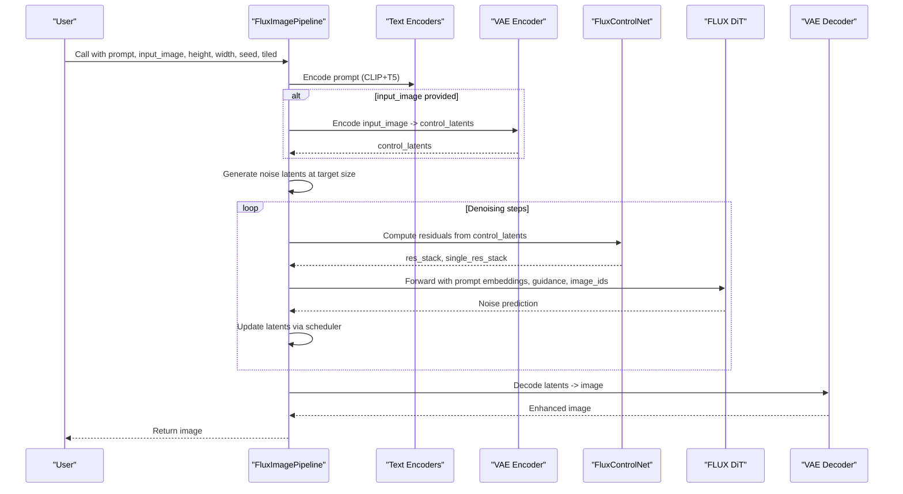
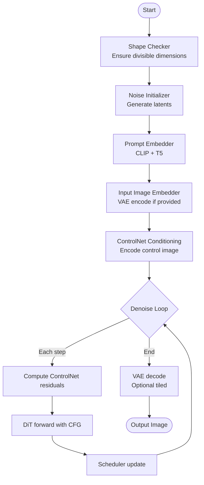
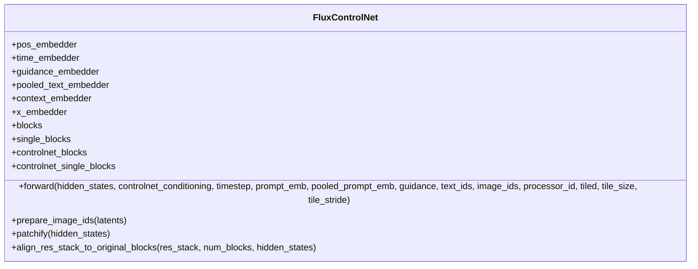
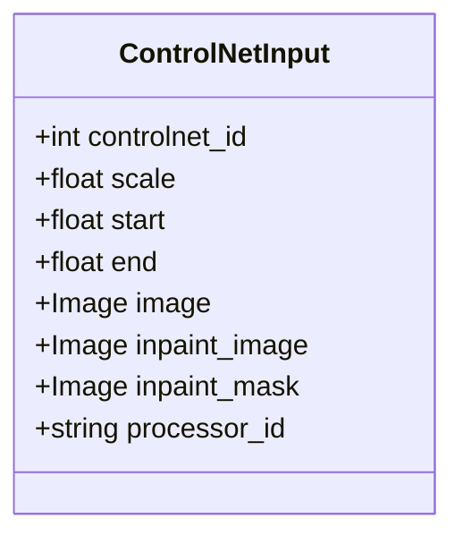
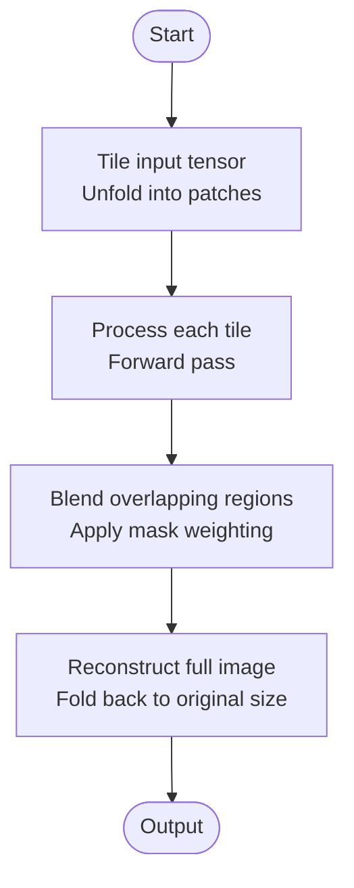
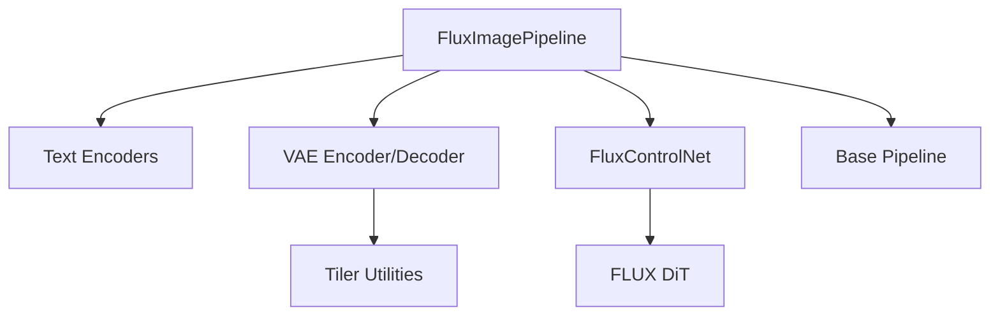

# FLUX ControlNet Upscaler

<cite>
**Referenced Files in This Document**
- [FLUX.1-dev-Controlnet-Upscaler.py](file://examples/flux/model_inference/FLUX.1-dev-Controlnet-Upscaler.py)
- [base_pipeline.py](file://diffsynth/diffusion/base_pipeline.py)
- [flux_image.py](file://diffsynth/pipelines/flux_image.py)
- [controlnet_input.py](file://diffsynth/utils/controlnet/controlnet_input.py)
- [flux_controlnet.py](file://diffsynth/models/flux_controlnet.py)
- [flux_vae.py](file://diffsynth/models/flux_vae.py)
- [tiler.py](file://diffsynth/models/tiler.py)
</cite>

## Table of Contents
1. [Introduction](#introduction)
2. [Project Structure](#project-structure)
3. [Core Components](#core-components)
4. [Architecture Overview](#architecture-overview)
5. [Detailed Component Analysis](#detailed-component-analysis)
6. [Dependency Analysis](#dependency-analysis)
7. [Performance Considerations](#performance-considerations)
8. [Troubleshooting Guide](#troubleshooting-guide)
9. [Conclusion](#conclusion)
10. [Appendices](#appendices)

## Introduction
This document explains how to use the FLUX ControlNet Upscaler for high-resolution image enhancement within DiffSynth-Studio. It covers:
- How to prepare input images and choose scaling factors
- How to integrate the upscaler ControlNet with base FLUX models
- Memory management techniques for large images (tiled inference)
- Quality optimization parameters during upscaling
- Post-processing steps for optimal output quality
- Practical scenarios from low-resolution enhancement to artistic style preservation

The FLUX ControlNet Upscaler augments the base FLUX.1-dev model by injecting learned residual features conditioned on an input image, enabling super-resolution while preserving or enhancing details guided by text prompts.

## Project Structure
Key files involved in FLUX ControlNet upscaling:
- Example usage script demonstrating the upscaler workflow
- Pipeline orchestration and ControlNet integration
- ControlNetInput data structure
- ControlNet model implementation
- VAE encoder/decoder with tiled support
- Tiling utilities for memory-efficient processing

**Diagram sources**
- [FLUX.1-dev-Controlnet-Upscaler.py:1-33](file://examples/flux/model_inference/FLUX.1-dev-Controlnet-Upscaler.py#L1-L33)
- [flux_image.py:1-1203](file://diffsynth/pipelines/flux_image.py#L1-L1203)
- [controlnet_input.py:1-14](file://diffsynth/utils/controlnet/controlnet_input.py#L1-L14)
- [flux_controlnet.py:1-385](file://diffsynth/models/flux_controlnet.py#L1-L385)
- [flux_vae.py:1-440](file://diffsynth/models/flux_vae.py#L1-L440)
- [tiler.py:1-94](file://diffsynth/models/tiler.py#L1-L94)
- [base_pipeline.py:1-200](file://diffsynth/diffusion/base_pipeline.py#L1-L200)

**Section sources**
- [FLUX.1-dev-Controlnet-Upscaler.py:1-33](file://examples/flux/model_inference/FLUX.1-dev-Controlnet-Upscaler.py#L1-L33)
- [flux_image.py:1-1203](file://diffsynth/pipelines/flux_image.py#L1-L1203)
- [controlnet_input.py:1-14](file://diffsynth/utils/controlnet/controlnet_input.py#L1-L14)
- [flux_controlnet.py:1-385](file://diffsynth/models/flux_controlnet.py#L1-L385)
- [flux_vae.py:1-440](file://diffsynth/models/flux_vae.py#L1-L440)
- [tiler.py:1-94](file://diffsynth/models/tiler.py#L1-L94)
- [base_pipeline.py:1-200](file://diffsynth/diffusion/base_pipeline.py#L1-L200)

## Core Components
- FluxImagePipeline: Orchestrates text encoding, latent initialization, ControlNet conditioning, DiT denoising, and VAE decoding. Supports tiled inference for memory efficiency.
- MultiControlNet: Aggregates multiple ControlNet modules, scales their residuals per ControlNetInput scale, and merges contributions across blocks.
- FluxControlNet: Implements the ControlNet architecture that produces residual stacks injected into the DiT joint and single transformer blocks.
- ControlNetInput: Dataclass specifying control image, scale, temporal range (start/end), inpainting masks, and processor_id for multi-mode ControlNets.
- VAE Encoder/Decoder: Encodes input images to latents and decodes final latents to images; supports tiled operations to handle large images without OOM.
- Tiler Utilities: Provide tile/untile operations and blending masks to avoid seams when processing large images in tiles.

**Section sources**
- [flux_image.py:1-1203](file://diffsynth/pipelines/flux_image.py#L1-L1203)
- [flux_controlnet.py:1-385](file://diffsynth/models/flux_controlnet.py#L1-L385)
- [controlnet_input.py:1-14](file://diffsynth/utils/controlnet/controlnet_input.py#L1-L14)
- [flux_vae.py:1-440](file://diffsynth/models/flux_vae.py#L1-L440)
- [tiler.py:1-94](file://diffsynth/models/tiler.py#L1-L94)

## Architecture Overview
The FLUX ControlNet Upscaler pipeline integrates a pre-trained FLUX.1-dev DiT with a ControlNet module trained for upscaling. The workflow:
1. Prepare prompt and optional input image.
2. Encode prompt via CLIP and T5 encoders.
3. Optionally encode input image through VAE encoder to get control conditionings.
4. Initialize noise latents at target resolution.
5. For each timestep, compute ControlNet residuals and inject them into DiT blocks.
6. Decode final latents via VAE decoder to produce the enhanced image.

**Diagram sources**
- [flux_image.py:180-291](file://diffsynth/pipelines/flux_image.py#L180-L291)
- [flux_image.py:1000-1203](file://diffsynth/pipelines/flux_image.py#L1000-L1203)
- [flux_controlnet.py:112-155](file://diffsynth/models/flux_controlnet.py#L112-L155)

## Detailed Component Analysis

### FluxImagePipeline and ControlNet Integration
- The pipeline defines units for shape checking, noise initialization, prompt embedding, input image embedding, ControlNet conditioning, and more.
- ControlNet conditioning is computed by encoding the input image through the VAE encoder and optionally applying inpainting masks.
- During denoising, ControlNet residuals are added to DiT hidden states at corresponding block indices.
- Tiled inference is supported for both VAE and DiT forward passes to reduce memory usage.

**Diagram sources**
- [flux_image.py:294-333](file://diffsynth/pipelines/flux_image.py#L294-L333)
- [flux_image.py:447-486](file://diffsynth/pipelines/flux_image.py#L447-L486)
- [flux_image.py:1000-1203](file://diffsynth/pipelines/flux_image.py#L1000-L1203)

**Section sources**
- [flux_image.py:180-291](file://diffsynth/pipelines/flux_image.py#L180-L291)
- [flux_image.py:447-486](file://diffsynth/pipelines/flux_image.py#L447-L486)
- [flux_image.py:1000-1203](file://diffsynth/pipelines/flux_image.py#L1000-L1203)

### FluxControlNet Model
- FluxControlNet takes control conditionings and produces residual stacks aligned with DiT blocks.
- It includes time, pooled text, and guidance embedders, and supports mode-specific processors via an embedding layer.
- Residual stacks are aligned to match the number of DiT blocks using interpolation-based alignment.

**Diagram sources**
- [flux_controlnet.py:61-155](file://diffsynth/models/flux_controlnet.py#L61-L155)

**Section sources**
- [flux_controlnet.py:61-155](file://diffsynth/models/flux_controlnet.py#L61-L155)

### ControlNetInput Data Structure
- ControlNetInput encapsulates the control image, scale factor, temporal range (start/end), inpainting masks, and processor_id for multi-mode ControlNets.
- Scale factor controls the strength of ControlNet residuals injection.

**Diagram sources**
- [controlnet_input.py:1-14](file://diffsynth/utils/controlnet/controlnet_input.py#L1-L14)

**Section sources**
- [controlnet_input.py:1-14](file://diffsynth/utils/controlnet/controlnet_input.py#L1-L14)

### VAE and Tiled Inference
- VAE encoder/decoder support tiled operations to process large images without exceeding VRAM limits.
- Tiling splits the image into overlapping tiles, processes each tile, and blends results to avoid seams.

**Diagram sources**
- [flux_vae.py:333-348](file://diffsynth/models/flux_vae.py#L333-L348)
- [tiler.py:1-94](file://diffsynth/models/tiler.py#L1-L94)

**Section sources**
- [flux_vae.py:333-348](file://diffsynth/models/flux_vae.py#L333-L348)
- [tiler.py:1-94](file://diffsynth/models/tiler.py#L1-L94)

## Dependency Analysis
The FLUX ControlNet Upscaler depends on several components:
- FluxImagePipeline orchestrates all modules and manages VRAM loading/offloading.
- FluxControlNet provides residual features conditioned on input images.
- VAE encoder/decoder handle image-to-latent and latent-to-image transformations.
- Tiler utilities enable memory-efficient processing for large images.

**Diagram sources**
- [flux_image.py:1-1203](file://diffsynth/pipelines/flux_image.py#L1-L1203)
- [flux_controlnet.py:1-385](file://diffsynth/models/flux_controlnet.py#L1-L385)
- [flux_vae.py:1-440](file://diffsynth/models/flux_vae.py#L1-L440)
- [tiler.py:1-94](file://diffsynth/models/tiler.py#L1-L94)
- [base_pipeline.py:1-200](file://diffsynth/diffusion/base_pipeline.py#L1-L200)

**Section sources**
- [flux_image.py:1-1203](file://diffsynth/pipelines/flux_image.py#L1-L1203)
- [flux_controlnet.py:1-385](file://diffsynth/models/flux_controlnet.py#L1-L385)
- [flux_vae.py:1-440](file://diffsynth/models/flux_vae.py#L1-L440)
- [tiler.py:1-94](file://diffsynth/models/tiler.py#L1-L94)
- [base_pipeline.py:1-200](file://diffsynth/diffusion/base_pipeline.py#L1-L200)

## Performance Considerations
- Use tiled inference (tiled=True) for large images to prevent out-of-memory errors.
- Adjust tile_size and tile_stride to balance memory usage and processing speed.
- Enable VRAM management in the pipeline to offload models when not in use.
- Reduce precision to bfloat16 or float16 for faster inference on compatible hardware.
- Optimize num_inference_steps based on desired quality vs. speed trade-off.

[No sources needed since this section provides general guidance]

## Troubleshooting Guide
- If encountering out-of-memory errors, enable tiled inference and reduce tile_size.
- Ensure input images are properly resized to target dimensions divisible by 16 (VAE requirement).
- Verify ControlNet model weights are correctly loaded and matched to the base FLUX model.
- Check that ControlNetInput.scale is set appropriately; too high values may cause artifacts.
- Use seed parameter for reproducibility and debug inconsistent outputs.

**Section sources**
- [flux_image.py:294-333](file://diffsynth/pipelines/flux_image.py#L294-L333)
- [controlnet_input.py:1-14](file://diffsynth/utils/controlnet/controlnet_input.py#L1-L14)

## Conclusion
The FLUX ControlNet Upscaler provides a powerful framework for high-resolution image enhancement by integrating ControlNet residuals with the base FLUX model. With proper input preparation, memory management, and parameter tuning, it can effectively upscale images while preserving or enhancing details according to textual prompts. The modular design allows flexibility in combining different ControlNet modes and optimizing for various use cases.

[No sources needed since this section summarizes without analyzing specific files]

## Appendices

### Usage Examples
- Basic upscaling: Load FLUX.1-dev and ControlNet Upscaler, generate initial image, resize, then upscale with ControlNet conditioning.
- Low-resolution enhancement: Use small input images and higher ControlNet scale for detail restoration.
- Artistic style preservation: Combine descriptive prompts with moderate ControlNet scale to maintain stylistic elements while enhancing resolution.

**Section sources**
- [FLUX.1-dev-Controlnet-Upscaler.py:1-33](file://examples/flux/model_inference/FLUX.1-dev-Controlnet-Upscaler.py#L1-L33)