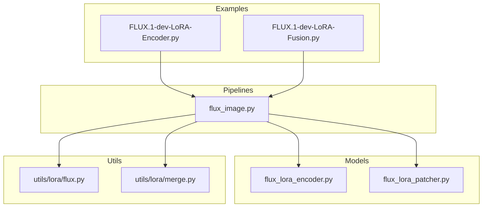
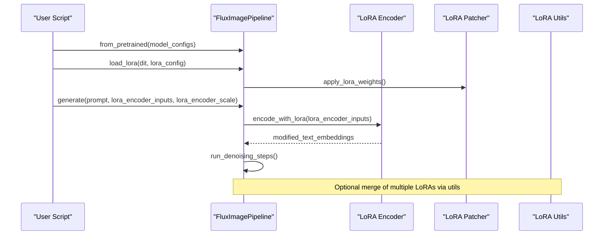
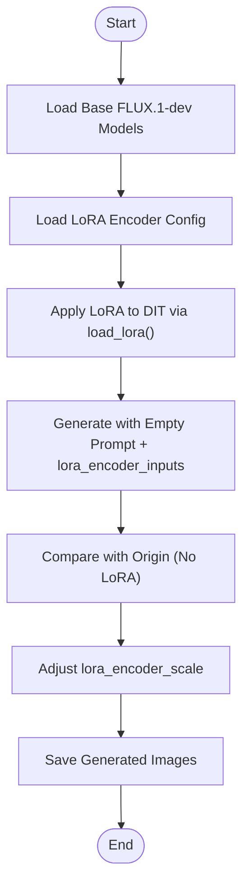
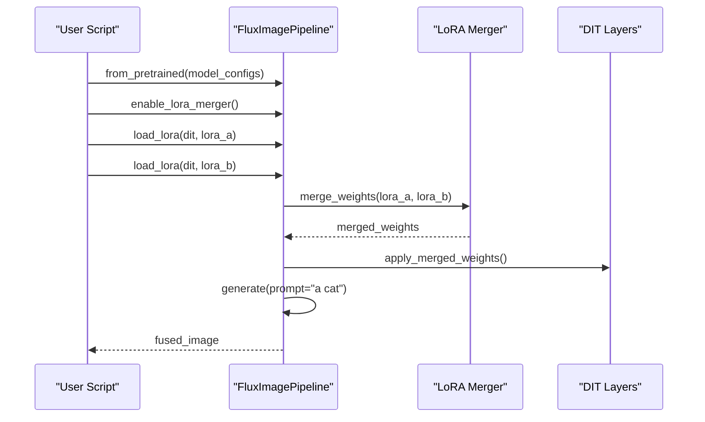
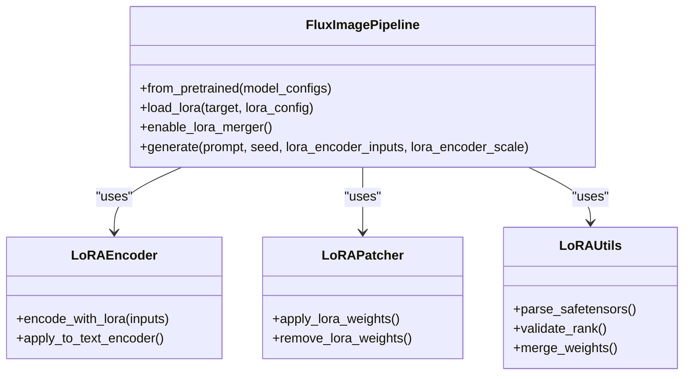

# FLUX LoRA Training and Usage

<cite>
**Referenced Files in This Document**
- [FLUX.1-dev-LoRA-Encoder.py](file://examples/flux/model_inference/FLUX.1-dev-LoRA-Encoder.py)
- [FLUX.1-dev-LoRA-Fusion.py](file://examples/flux/model_inference/FLUX.1-dev-LoRA-Fusion.py)
- [flux_lora_encoder.py](file://diffsynth/models/flux_lora_encoder.py)
- [flux_lora_patcher.py](file://diffsynth/models/flux_lora_patcher.py)
- [flux.py](file://diffsynth/utils/lora/flux.py)
- [merge.py](file://diffsynth/utils/lora/merge.py)
- [flux_image.py](file://diffsynth/pipelines/flux_image.py)
</cite>

## Table of Contents
1. [Introduction](#introduction)
2. [Project Structure](#project-structure)
3. [Core Components](#core-components)
4. [Architecture Overview](#architecture-overview)
5. [Detailed Component Analysis](#detailed-component-analysis)
6. [Dependency Analysis](#dependency-analysis)
7. [Performance Considerations](#performance-considerations)
8. [Troubleshooting Guide](#troubleshooting-guide)
9. [Conclusion](#conclusion)
10. [Appendices](#appendices)

## Introduction
This document explains how to use and integrate FLUX Low-Rank Adaptation (LoRA) within the DiffSynth framework, focusing on:
- Loading and applying pre-trained LoRA models via the LoRA encoder for FLUX.1-dev
- Combining multiple LoRA weights through runtime fusion
- Interpreting LoRA files and selecting appropriate LoRAs
- Tuning parameters such as scale and rank for optimal results
- Performance considerations including VRAM management and hot-loading

The content is grounded in the provided examples and core implementation modules that enable LoRA loading, patching, merging, and integration with FLUX pipelines.

## Project Structure
The repository organizes FLUX-related functionality across:
- Example inference scripts demonstrating LoRA usage patterns
- Core model components implementing LoRA encoder and patcher logic
- Utility modules for LoRA handling and weight merging
- Pipeline integration for FLUX image generation

**Diagram sources**
- [FLUX.1-dev-LoRA-Encoder.py:1-39](file://examples/flux/model_inference/FLUX.1-dev-LoRA-Encoder.py#L1-L39)
- [FLUX.1-dev-LoRA-Fusion.py:1-39](file://examples/flux/model_inference/FLUX.1-dev-LoRA-Fusion.py#L1-L39)
- [flux_image.py](file://diffsynth/pipelines/flux_image.py)
- [flux_lora_encoder.py](file://diffsynth/models/flux_lora_encoder.py)
- [flux_lora_patcher.py](file://diffsynth/models/flux_lora_patcher.py)
- [flux.py](file://diffsynth/utils/lora/flux.py)
- [merge.py](file://diffsynth/utils/lora/merge.py)

**Section sources**
- [FLUX.1-dev-LoRA-Encoder.py:1-39](file://examples/flux/model_inference/FLUX.1-dev-LoRA-Encoder.py#L1-L39)
- [FLUX.1-dev-LoRA-Fusion.py:1-39](file://examples/flux/model_inference/FLUX.1-dev-LoRA-Fusion.py#L1-L39)

## Core Components
- FluxImagePipeline: Orchestrates model loading, LoRA application, and generation. It exposes methods like load_lora and supports lora_encoder_inputs and lora_encoder_scale parameters.
- LoRA Encoder: Provides a mechanism to inject style or concept knowledge into the text encoding stage, enabling activation even without explicit trigger words.
- LoRA Patcher: Applies LoRA weights to diffusion transformer layers at runtime, supporting dynamic loading and unloading.
- LoRA Utilities: Handle parsing, validation, and merging of LoRA weights; includes tools for rank adjustment and safe combination of multiple LoRAs.

Key responsibilities:
- Load LoRA weights from safetensors files
- Apply LoRA to DIT (Diffusion Transformer) components
- Merge multiple LoRA weights either offline or at runtime
- Control activation intensity via scale parameters

**Section sources**
- [FLUX.1-dev-LoRA-Encoder.py:1-39](file://examples/flux/model_inference/FLUX.1-dev-LoRA-Encoder.py#L1-L39)
- [FLUX.1-dev-LoRA-Fusion.py:1-39](file://examples/flux/model_inference/FLUX.1-dev-LoRA-Fusion.py#L1-L39)
- [flux_lora_encoder.py](file://diffsynth/models/flux_lora_encoder.py)
- [flux_lora_patcher.py](file://diffsynth/models/flux_lora_patcher.py)
- [flux.py](file://diffsynth/utils/lora/flux.py)
- [merge.py](file://diffsynth/utils/lora/merge.py)

## Architecture Overview
The LoRA workflow integrates with the FLUX pipeline through ModelConfig objects and pipeline methods. The encoder-based LoRA influences text embeddings, while the patcher applies residual updates to transformer blocks. Fusion enables combining multiple LoRA effects by merging their weights before or during inference.

**Diagram sources**
- [FLUX.1-dev-LoRA-Encoder.py:1-39](file://examples/flux/model_inference/FLUX.1-dev-LoRA-Encoder.py#L1-L39)
- [FLUX.1-dev-LoRA-Fusion.py:1-39](file://examples/flux/model_inference/FLUX.1-dev-LoRA-Fusion.py#L1-L39)
- [flux_image.py](file://diffsynth/pipelines/flux_image.py)
- [flux_lora_encoder.py](file://diffsynth/models/flux_lora_encoder.py)
- [flux_lora_patcher.py](file://diffsynth/models/flux_lora_patcher.py)
- [flux.py](file://diffsynth/utils/lora/flux.py)
- [merge.py](file://diffsynth/utils/lora/merge.py)

## Detailed Component Analysis

### LoRA Encoder Usage
The LoRA encoder example demonstrates loading a FLUX.1-dev base model and an encoder-style LoRA. It shows:
- Using empty prompts to activate LoRA capabilities
- Adjusting activation intensity via lora_encoder_scale
- Comparing outputs with and without LoRA influence

**Diagram sources**
- [FLUX.1-dev-LoRA-Encoder.py:1-39](file://examples/flux/model_inference/FLUX.1-dev-LoRA-Encoder.py#L1-L39)

**Section sources**
- [FLUX.1-dev-LoRA-Encoder.py:1-39](file://examples/flux/model_inference/FLUX.1-dev-LoRA-Encoder.py#L1-L39)

### LoRA Fusion Workflow
Fusion allows combining multiple LoRA weights at runtime. The example enables a merger and loads two distinct LoRAs, then generates an image reflecting combined effects.

**Diagram sources**
- [FLUX.1-dev-LoRA-Fusion.py:1-39](file://examples/flux/model_inference/FLUX.1-dev-LoRA-Fusion.py#L1-L39)
- [flux_image.py](file://diffsynth/pipelines/flux_image.py)
- [merge.py](file://diffsynth/utils/lora/merge.py)

**Section sources**
- [FLUX.1-dev-LoRA-Fusion.py:1-39](file://examples/flux/model_inference/FLUX.1-dev-LoRA-Fusion.py#L1-L39)

### LoRA File Interpretation and Selection
LoRA files are typically stored as safetensors containing low-rank matrices intended to be added to existing model weights. Key aspects:
- Rank determines capacity and memory footprint
- Target modules indicate which layers receive adaptation
- Compatibility must match the base model architecture

Best practices:
- Verify rank and target module alignment with the base model
- Prefer LoRAs trained on similar data distributions
- Use small initial scales and increase gradually

[No sources needed since this section provides general guidance]

### Parameter Tuning for Optimal Results
- Scale: Controls strength of LoRA effect; start with 0.5–1.0 and adjust based on output quality
- Rank: Higher ranks capture more detail but require more VRAM; balance with available resources
- Trigger Words: Some LoRAs respond better with specific keywords; test both with and without triggers

[No sources needed since this section provides general guidance]

## Dependency Analysis
The LoRA system depends on several modules working together:

**Diagram sources**
- [flux_image.py](file://diffsynth/pipelines/flux_image.py)
- [flux_lora_encoder.py](file://diffsynth/models/flux_lora_encoder.py)
- [flux_lora_patcher.py](file://diffsynth/models/flux_lora_patcher.py)
- [flux.py](file://diffsynth/utils/lora/flux.py)
- [merge.py](file://diffsynth/utils/lora/merge.py)

**Section sources**
- [flux_image.py](file://diffsynth/pipelines/flux_image.py)
- [flux_lora_encoder.py](file://diffsynth/models/flux_lora_encoder.py)
- [flux_lora_patcher.py](file://diffsynth/models/flux_lora_patcher.py)
- [flux.py](file://diffsynth/utils/lora/flux.py)
- [merge.py](file://diffsynth/utils/lora/merge.py)

## Performance Considerations
- VRAM Management: Use offload_dtype and computation_dtype settings to control memory usage during LoRA operations
- Hot-loading: Enable dynamic LoRA loading to avoid reloading entire models when switching between LoRAs
- Batch Size: Reduce batch size when using high-rank LoRAs to prevent out-of-memory errors
- Precision: bfloat16 offers good balance between quality and memory efficiency

[No sources needed since this section provides general guidance]

## Troubleshooting Guide
Common issues and solutions:
- LoRA not activating: Ensure correct model_id and origin_file_pattern; verify compatibility with base model
- Poor quality output: Adjust lora_encoder_scale or try different LoRA ranks
- Memory errors: Reduce precision or disable certain features; use lower-rank LoRAs
- Fusion conflicts: Check for incompatible target modules between merged LoRAs

[No sources needed since this section provides general guidance]

## Conclusion
FLUX LoRA integration in DiffSynth provides flexible mechanisms for enhancing model outputs through lightweight adaptations. By understanding the encoder and patcher roles, interpreting LoRA files correctly, and tuning parameters appropriately, users can achieve significant improvements in style transfer, concept injection, and domain adaptation. Runtime fusion enables creative combinations of multiple LoRAs while maintaining efficient resource utilization.

[No sources needed since this section summarizes without analyzing specific files]

## Appendices

### Practical Examples Summary
- **LoRA Encoder**: Demonstrates loading encoder-style LoRA and controlling activation intensity
- **LoRA Fusion**: Shows combining multiple LoRA weights for composite effects
- **Integration Patterns**: Both examples use ModelConfig for consistent model specification

[No sources needed since this section summarizes practical examples]