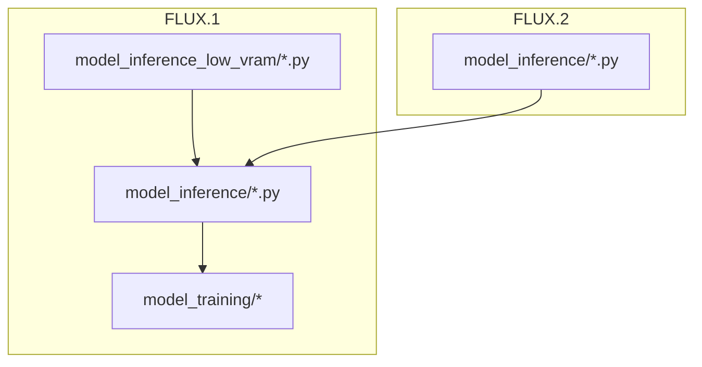
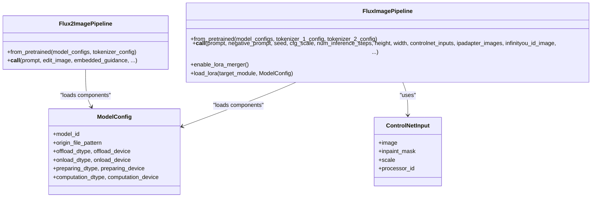
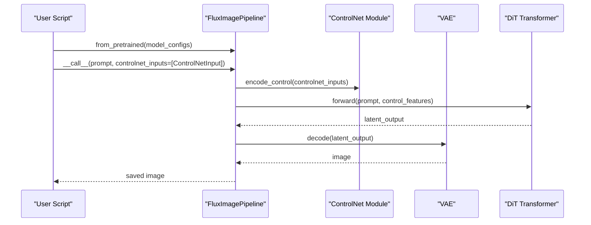
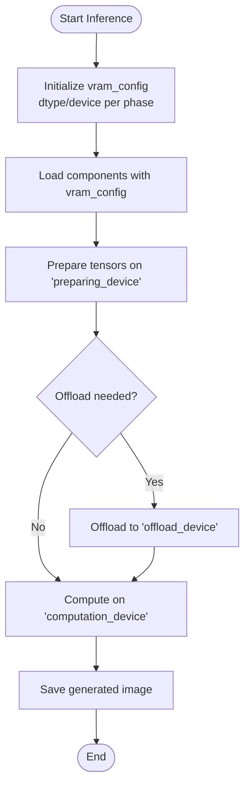
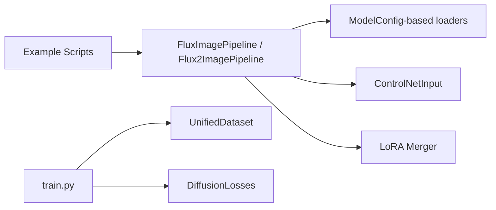

# FLUX Model Examples

<cite>
**Referenced Files in This Document**
- [examples/flux/README.md](file://examples/flux/README.md)
- [examples/flux2/README.md](file://examples/flux2/README.md)
- [examples/flux/model_inference/FLUX.1-dev.py](file://examples/flux/model_inference/FLUX.1-dev.py)
- [examples/flux/model_inference_low_vram/FLUX.1-dev.py](file://examples/flux/model_inference_low_vram/FLUX.1-dev.py)
- [examples/flux/model_inference/FLUX.1-dev-Controlnet-Inpainting-Beta.py](file://examples/flux/model_inference/FLUX.1-dev-Controlnet-Inpainting-Beta.py)
- [examples/flux/model_inference/FLUX.1-dev-IP-Adapter.py](file://examples/flux/model_inference/FLUX.1-dev-IP-Adapter.py)
- [examples/flux/model_inference/FLUX.1-dev-InfiniteYou.py](file://examples/flux/model_inference/FLUX.1-dev-InfiniteYou.py)
- [examples/flux/model_inference/FLUX.1-dev-LoRA-Fusion.py](file://examples/flux/model_inference/FLUX.1-dev-LoRA-Fusion.py)
- [examples/flux2/model_inference/FLUX.2-dev.py](file://examples/flux2/model_inference/FLUX.2-dev.py)
- [examples/flux/model_training/train.py](file://examples/flux/model_training/train.py)
- [examples/flux/model_training/full/FLUX.1-dev.sh](file://examples/flux/model_training/full/FLUX.1-dev.sh)
- [examples/flux/model_training/lora/FLUX.1-dev.sh](file://examples/flux/model_training/lora/FLUX.1-dev.sh)
</cite>

## Table of Contents
1. [Introduction](#introduction)
2. [Project Structure](#project-structure)
3. [Core Components](#core-components)
4. [Architecture Overview](#architecture-overview)
5. [Detailed Component Analysis](#detailed-component-analysis)
6. [Dependency Analysis](#dependency-analysis)
7. [Performance Considerations](#performance-considerations)
8. [Troubleshooting Guide](#troubleshooting-guide)
9. [Conclusion](#conclusion)
10. [Appendices](#appendices)

## Introduction
This document provides comprehensive, step-by-step examples for both FLUX.1 and FLUX.2 models. It covers basic inference, low VRAM techniques, ControlNet integration (Inpainting, Union, Upscaler), IP-Adapter usage, LoRA encoder and fusion workflows, and advanced features like InfiniteYou and EliGen. It also includes full fine-tuning and LoRA training with configuration files, parameter explanations, customization options, and troubleshooting tips.

## Project Structure
The repository organizes FLUX examples under dedicated directories:
- FLUX.1 examples: inference scripts, low VRAM variants, and training configurations
- FLUX.2 examples: inference scripts for the newer model family
- Training utilities: a unified training script and accelerate configs

**Section sources**
- [examples/flux/README.md](file://examples/flux/README.md)
- [examples/flux2/README.md](file://examples/flux2/README.md)

## Core Components
- FluxImagePipeline and Flux2ImagePipeline: High-level pipelines that load model components via ModelConfig and orchestrate inference or training tasks.
- ControlNetInput: Input wrapper to attach control signals such as masks for inpainting.
- UnifiedDataset and DiffusionTrainingModule: Data loading and training abstractions used by the training script.

Key responsibilities:
- Pipeline initialization from pretrained model IDs and file patterns
- Parameterized inference (prompt, negative_prompt, seed, cfg_scale, num_inference_steps, height/width)
- Low VRAM memory management via dtype/device strategies
- ControlNet integration through controlnet_inputs
- LoRA hotloading and merging

**Section sources**
- [examples/flux/model_inference/FLUX.1-dev.py](file://examples/flux/model_inference/FLUX.1-dev.py)
- [examples/flux/model_inference_low_vram/FLUX.1-dev.py](file://examples/flux/model_inference_low_vram/FLUX.1-dev.py)
- [examples/flux/model_inference/FLUX.1-dev-Controlnet-Inpainting-Beta.py](file://examples/flux/model_inference/FLUX.1-dev-Controlnet-Inpainting-Beta.py)
- [examples/flux/model_inference/FLUX.1-dev-IP-Adapter.py](file://examples/flux/model_inference/FLUX.1-dev-IP-Adapter.py)
- [examples/flux/model_inference/FLUX.1-dev-InfiniteYou.py](file://examples/flux/model_inference/FLUX.1-dev-InfiniteYou.py)
- [examples/flux/model_inference/FLUX.1-dev-LoRA-Fusion.py](file://examples/flux/model_inference/FLUX.1-dev-LoRA-Fusion.py)
- [examples/flux2/model_inference/FLUX.2-dev.py](file://examples/flux2/model_inference/FLUX.2-dev.py)
- [examples/flux/model_training/train.py](file://examples/flux/model_training/train.py)

## Architecture Overview
The FLUX pipeline architecture centers around a modular pipeline that loads text encoders, image encoders (optional), VAE, and DiT transformer components. ControlNet, IP-Adapter, and LoRA are integrated as additional modules loaded via ModelConfig and activated at runtime.

**Diagram sources**
- [examples/flux/model_inference/FLUX.1-dev.py](file://examples/flux/model_inference/FLUX.1-dev.py)
- [examples/flux/model_inference/FLUX.1-dev-Controlnet-Inpainting-Beta.py](file://examples/flux/model_inference/FLUX.1-dev-Controlnet-Inpainting-Beta.py)
- [examples/flux/model_inference/FLUX.1-dev-IP-Adapter.py](file://examples/flux/model_inference/FLUX.1-dev-IP-Adapter.py)
- [examples/flux/model_inference/FLUX.1-dev-LoRA-Fusion.py](file://examples/flux/model_inference/FLUX.1-dev-LoRA-Fusion.py)
- [examples/flux2/model_inference/FLUX.2-dev.py](file://examples/flux2/model_inference/FLUX.2-dev.py)

## Detailed Component Analysis

### Basic Inference (FLUX.1)
Steps:
1. Initialize FluxImagePipeline with ModelConfig entries for DiT, text encoders, and VAE.
2. Generate images using prompt and optional negative_prompt.
3. Adjust sampling parameters such as cfg_scale and num_inference_steps.

Customization:
- Seed for reproducibility
- Image dimensions (height, width)
- Sampling steps and guidance scale

Common pitfalls:
- Ensure all required model components are specified in model_configs
- Use appropriate torch_dtype (e.g., bfloat16) for performance

**Section sources**
- [examples/flux/model_inference/FLUX.1-dev.py](file://examples/flux/model_inference/FLUX.1-dev.py)

### Low VRAM Inference (FLUX.1)
Steps:
1. Define vram_config with dtype/device settings for offload/onload/preparing/computation phases.
2. Pass vram_config to each ModelConfig entry.
3. Optionally set vram_limit when constructing the pipeline.
4. Run inference as usual.

Customization:
- Choose float8_e4m3fn for offload/onload/preparing dtypes to reduce memory
- Set computation_dtype to bfloat16 for speed
- Tune vram_limit to reserve headroom for system processes

Common pitfalls:
- Mismatched devices between offload and computation can cause errors
- Insufficient VRAM limit may trigger OOM during preparation

**Section sources**
- [examples/flux/model_inference_low_vram/FLUX.1-dev.py](file://examples/flux/model_inference_low_vram/FLUX.1-dev.py)

### ControlNet Integration (Inpainting)
Steps:
1. Load base FLUX.1 pipeline plus ControlNet weights via ModelConfig.
2. Create an input image and corresponding mask.
3. Use ControlNetInput(image=image, inpaint_mask=mask, scale=...) in the pipeline call.

Customization:
- Mask shape must match image dimensions
- ControlNet scale controls influence strength

Common pitfalls:
- Incorrect mask format or size leads to runtime errors
- Ensure ControlNet model matches the base model variant

**Section sources**
- [examples/flux/model_inference/FLUX.1-dev-Controlnet-Inpainting-Beta.py](file://examples/flux/model_inference/FLUX.1-dev-Controlnet-Inpainting-Beta.py)

### IP-Adapter Usage
Steps:
1. Load base FLUX.1 pipeline plus IP-Adapter and image encoder (SigLIP) via ModelConfig.
2. Generate a style reference image or provide one externally.
3. Call the pipeline with ipadapter_images=[reference_image] and ipadapter_scale.

Customization:
- Adjust ipadapter_scale to balance style transfer strength
- Use consistent image sizes for stable results

Common pitfalls:
- Missing image encoder model causes failures
- Excessive ipadapter_scale may distort content

**Section sources**
- [examples/flux/model_inference/FLUX.1-dev-IP-Adapter.py](file://examples/flux/model_inference/FLUX.1-dev-IP-Adapter.py)

### Advanced Feature: InfiniteYou
Steps:
1. Install additional dependencies (facexlib, insightface, onnxruntime).
2. Download required support models and example data.
3. Load base FLUX.1 pipeline plus InfiniteYou components via ModelConfig.
4. Provide an ID image and use infinityou_id_image and infinityou_guidance parameters.
5. Optionally pass empty controlnet_inputs for baseline behavior.

Customization:
- infinityou_guidance controls identity preservation strength
- embedded_guidance influences text-image alignment

Common pitfalls:
- Missing dependency packages will block execution
- Incorrect dataset snapshot paths lead to missing inputs

**Section sources**
- [examples/flux/model_inference/FLUX.1-dev-InfiniteYou.py](file://examples/flux/model_inference/FLUX.1-dev-InfiniteYou.py)

### LoRA Encoder and Fusion
Steps:
1. Load base FLUX.1 pipeline with optional LoRA model via ModelConfig.
2. Enable LoRA merger with enable_lora_merger().
3. Load multiple LoRA weights into the DiT module sequentially.
4. Generate images; merged LoRA effects combine automatically.

Customization:
- Each load_lora call adds another LoRA effect
- Order of loading affects final blending

Common pitfalls:
- Ensure LoRA models target compatible modules
- Hotloading requires proper dtype/device configuration

**Section sources**
- [examples/flux/model_inference/FLUX.1-dev-LoRA-Fusion.py](file://examples/flux/model_inference/FLUX.1-dev-LoRA-Fusion.py)

### FLUX.2 Basic Inference
Steps:
1. Initialize Flux2ImagePipeline with ModelConfig entries for text encoder, transformer, and VAE.
2. Provide a tokenizer_config pointing to tokenizer directory.
3. Generate images with prompt and optional edit_image for editing mode.

Customization:
- embedded_guidance tunes text-image alignment
- edit_image enables image-to-image editing

Common pitfalls:
- Ensure tokenizer path is correct
- Edit mode requires valid edit_image list

**Section sources**
- [examples/flux2/model_inference/FLUX.2-dev.py](file://examples/flux2/model_inference/FLUX.2-dev.py)

### Full Fine-Tuning (FLUX.1)
Steps:
1. Prepare dataset and metadata following the expected structure.
2. Use accelerate launch with the provided shell script.
3. Configure model_id_with_origin_paths to point to base model components.
4. Select trainable_models (e.g., "dit") and enable gradient checkpointing.

Parameters:
- learning_rate, num_epochs, max_pixels, dataset_repeat
- remove_prefix_in_ckpt for checkpoint compatibility
- output_path for saving trained artifacts

Common pitfalls:
- Dataset format mismatch causes data loading errors
- Insufficient GPU memory without gradient checkpointing

**Section sources**
- [examples/flux/model_training/full/FLUX.1-dev.sh](file://examples/flux/model_training/full/FLUX.1-dev.sh)
- [examples/flux/model_training/train.py](file://examples/flux/model_training/train.py)

### LoRA Training (FLUX.1)
Steps:
1. Use the same training script with lora_base_model set to "dit".
2. Specify lora_target_modules to select which layers receive LoRA adapters.
3. Set lora_rank and optionally align to open-source format.
4. Launch via accelerate with appropriate config.

Parameters:
- lora_target_modules (comma-separated list)
- lora_rank (e.g., 32)
- align_to_opensource_format for interoperability

Common pitfalls:
- Incorrect target modules prevent effective adaptation
- Rank too high increases memory usage significantly

**Section sources**
- [examples/flux/model_training/lora/FLUX.1-dev.sh](file://examples/flux/model_training/lora/FLUX.1-dev.sh)
- [examples/flux/model_training/train.py](file://examples/flux/model_training/train.py)

### Sequence Flow: ControlNet Inpainting

**Diagram sources**
- [examples/flux/model_inference/FLUX.1-dev-Controlnet-Inpainting-Beta.py](file://examples/flux/model_inference/FLUX.1-dev-Controlnet-Inpainting-Beta.py)

### Flowchart: Low VRAM Memory Strategy

**Diagram sources**
- [examples/flux/model_inference_low_vram/FLUX.1-dev.py](file://examples/flux/model_inference_low_vram/FLUX.1-dev.py)

## Dependency Analysis
The FLUX examples rely on:
- diffsynth.pipelines.flux_image and flux2_image for pipeline orchestration
- diffsynth.core.UnifiedDataset for data handling
- diffsynth.diffusion modules for loss functions and training utilities
- External model repositories via model_id and origin_file_pattern

**Diagram sources**
- [examples/flux/model_inference/FLUX.1-dev.py](file://examples/flux/model_inference/FLUX.1-dev.py)
- [examples/flux/model_inference/FLUX.1-dev-Controlnet-Inpainting-Beta.py](file://examples/flux/model_inference/FLUX.1-dev-Controlnet-Inpainting-Beta.py)
- [examples/flux/model_inference/FLUX.1-dev-LoRA-Fusion.py](file://examples/flux/model_inference/FLUX.1-dev-LoRA-Fusion.py)
- [examples/flux/model_training/train.py](file://examples/flux/model_training/train.py)

**Section sources**
- [examples/flux/model_inference/FLUX.1-dev.py](file://examples/flux/model_inference/FLUX.1-dev.py)
- [examples/flux/model_training/train.py](file://examples/flux/model_training/train.py)

## Performance Considerations
- Use bfloat16 for computation to balance speed and quality
- Employ float8_e4m3fn for offload/onload/preparing phases to minimize VRAM
- Enable gradient checkpointing during training to reduce memory footprint
- Limit vram_limit to leave headroom for OS and other processes
- Prefer tiled inference for very large images if supported by the pipeline

[No sources needed since this section provides general guidance]

## Troubleshooting Guide
Common issues and resolutions:
- Missing dependencies for InfiniteYou: install facexlib, insightface, onnxruntime
- OOM during inference: lower resolution, reduce steps, enable low VRAM modes
- ControlNet mask mismatch: ensure mask dimensions match image size
- IP-Adapter style distortion: reduce ipadapter_scale
- LoRA fusion conflicts: verify target modules and ranks across LoRA files
- Training data errors: validate dataset format and metadata CSV structure

**Section sources**
- [examples/flux/model_inference/FLUX.1-dev-InfiniteYou.py](file://examples/flux/model_inference/FLUX.1-dev-InfiniteYou.py)
- [examples/flux/model_inference_low_vram/FLUX.1-dev.py](file://examples/flux/model_inference_low_vram/FLUX.1-dev.py)
- [examples/flux/model_inference/FLUX.1-dev-Controlnet-Inpainting-Beta.py](file://examples/flux/model_inference/FLUX.1-dev-Controlnet-Inpainting-Beta.py)
- [examples/flux/model_inference/FLUX.1-dev-IP-Adapter.py](file://examples/flux/model_inference/FLUX.1-dev-IP-Adapter.py)
- [examples/flux/model_inference/FLUX.1-dev-LoRA-Fusion.py](file://examples/flux/model_inference/FLUX.1-dev-LoRA-Fusion.py)
- [examples/flux/model_training/train.py](file://examples/flux/model_training/train.py)

## Conclusion
This guide consolidates practical examples for FLUX.1 and FLUX.2 across inference, low VRAM optimization, ControlNet, IP-Adapter, LoRA workflows, and advanced features like InfiniteYou. It also provides complete training recipes for full fine-tuning and LoRA adaptation. By following the step-by-step instructions and tuning the parameters outlined here, users can effectively customize and deploy FLUX models for diverse creative and production tasks.

[No sources needed since this section summarizes without analyzing specific files]

## Appendices
- For detailed model documentation, refer to:
  - FLUX.1: https://diffsynth-studio-doc.readthedocs.io/en/latest/Model_Details/FLUX.html
  - FLUX.2: https://diffsynth-studio-doc.readthedocs.io/en/latest/Model_Details/FLUX2.html

**Section sources**
- [examples/flux/README.md](file://examples/flux/README.md)
- [examples/flux2/README.md](file://examples/flux2/README.md)