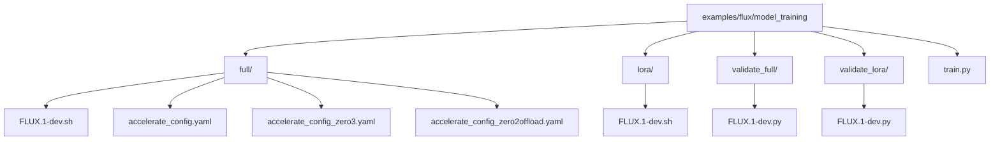
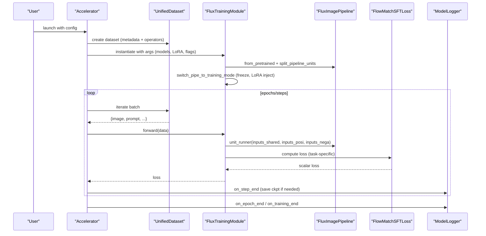
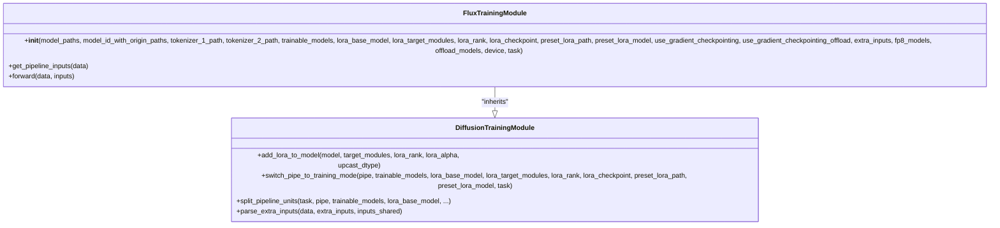
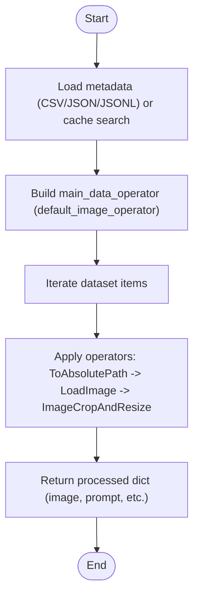
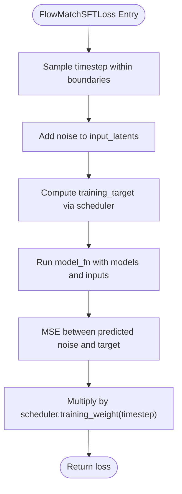
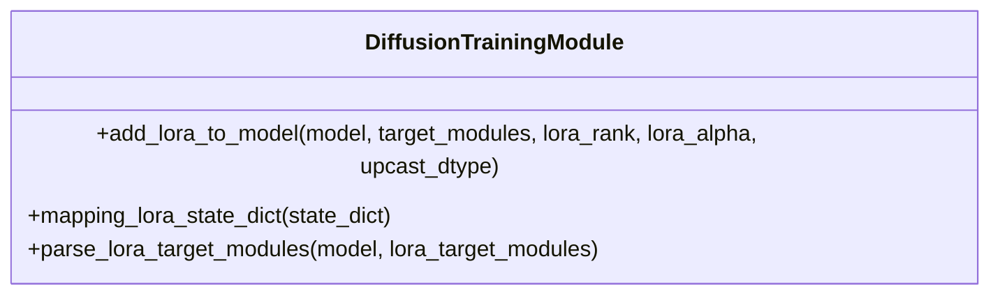
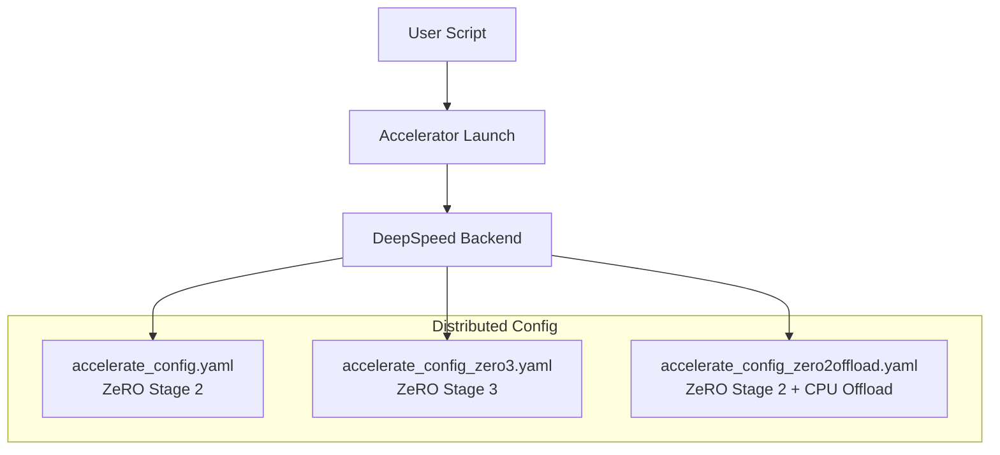
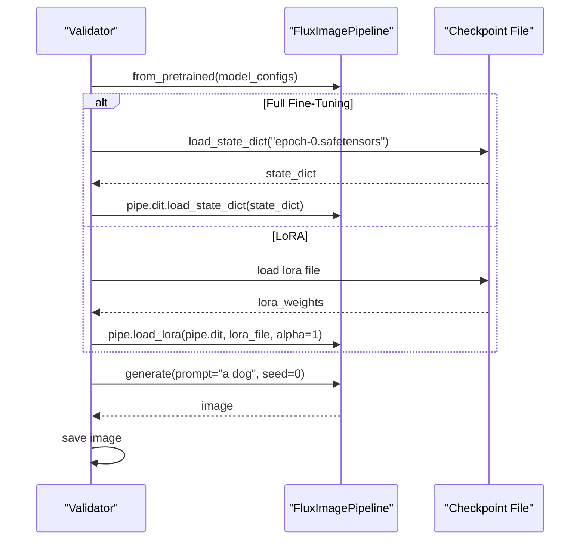
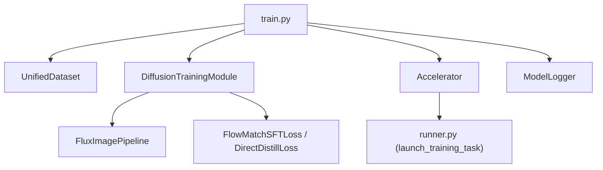

# FLUX Model Training Examples

<cite>
**Referenced Files in This Document**
- [train.py](file://examples/flux/model_training/train.py)
- [FLUX.1-dev.sh (full)](file://examples/flux/model_training/full/FLUX.1-dev.sh)
- [FLUX.1-dev.sh (lora)](file://examples/flux/model_training/lora/FLUX.1-dev.sh)
- [accelerate_config.yaml](file://examples/flux/model_training/full/accelerate_config.yaml)
- [accelerate_config_zero3.yaml](file://examples/flux/model_training/full/accelerate_config_zero3.yaml)
- [accelerate_config_zero2offload.yaml](file://examples/flux/model_training/full/accelerate_config_zero2offload.yaml)
- [validate_full/FLUX.1-dev.py](file://examples/flux/model_training/validate_full/FLUX.1-dev.py)
- [validate_lora/FLUX.1-dev.py](file://examples/flux/model_training/validate_lora/FLUX.1-dev.py)
- [training_module.py](file://diffsynth/diffusion/training_module.py)
- [unified_dataset.py](file://diffsynth/core/data/unified_dataset.py)
- [loss.py](file://diffsynth/diffusion/loss.py)
- [runner.py](file://diffsynth/diffusion/runner.py)
</cite>

## Table of Contents
1. Introduction
2. Project Structure
3. Core Components
4. Architecture Overview
5. Detailed Component Analysis
6. Dependency Analysis
7. Performance Considerations
8. Troubleshooting Guide
9. Conclusion
10. Appendices

## Introduction
This document explains how to train FLUX models using both full fine-tuning and LoRA workflows with the DiffSynth training framework. It covers dataset preparation, configuration structure, hyperparameter tuning, distributed training via Accelerate/DeepSpeed, validation procedures, and checkpoint management. It also compares full fine-tuning vs LoRA, including when to use each approach, resource requirements, and optimization strategies.

## Project Structure
The FLUX training examples are organized under examples/flux/model_training with separate directories for full fine-tuning and LoRA, plus validation scripts and shared training entry points.

**Diagram sources**
- [train.py:1-194](file://examples/flux/model_training/train.py#L1-L194)
- [FLUX.1-dev.sh (full):1-15](file://examples/flux/model_training/full/FLUX.1-dev.sh#L1-L15)
- [FLUX.1-dev.sh (lora):1-18](file://examples/flux/model_training/lora/FLUX.1-dev.sh#L1-L18)
- [accelerate_config.yaml:1-23](file://examples/flux/model_training/full/accelerate_config.yaml#L1-L23)
- [accelerate_config_zero3.yaml:1-24](file://examples/flux/model_training/full/accelerate_config_zero3.yaml#L1-L24)
- [accelerate_config_zero2offload.yaml:1-23](file://examples/flux/model_training/full/accelerate_config_zero2offload.yaml#L1-L23)
- [validate_full/FLUX.1-dev.py:1-21](file://examples/flux/model_training/validate_full/FLUX.1-dev.py#L1-L21)
- [validate_lora/FLUX.1-dev.py:1-19](file://examples/flux/model_training/validate_lora/FLUX.1-dev.py#L1-L19)

**Section sources**
- [train.py:1-194](file://examples/flux/model_training/train.py#L1-L194)
- [FLUX.1-dev.sh (full):1-15](file://examples/flux/model_training/full/FLUX.1-dev.sh#L1-L15)
- [FLUX.1-dev.sh (lora):1-18](file://examples/flux/model_training/lora/FLUX.1-dev.sh#L1-L18)

## Core Components
- FluxTrainingModule: Wraps the FluxImagePipeline, configures tokenizers, sets training mode, handles gradient checkpointing, extra inputs, FP8/offload flags, and selects loss functions based on task.
- UnifiedDataset: Loads metadata (CSV/JSON/JSONL), applies image operators (resize/crop), supports caching and repeat scaling.
- Loss functions: FlowMatchSFTLoss for standard SFT-style flow matching; DirectDistillLoss for direct distillation tasks.
- Accelerate/DeepSpeed integration: DistributedDataParallelKwargs, gradient accumulation, launcher mapping for data processing vs training.

Key responsibilities:
- Data pipeline setup and operator routing
- Model loading and splitting into trainable units
- LoRA injection and target module selection
- Task-based loss selection and forward pass
- Checkpoint logging and optional format alignment

**Section sources**
- [train.py:8-84](file://examples/flux/model_training/train.py#L8-L84)
- [unified_dataset.py:5-38](file://diffsynth/core/data/unified_dataset.py#L5-L38)
- [loss.py:5-28](file://diffsynth/diffusion/loss.py#L5-L28)
- [training_module.py:30-110](file://diffsynth/diffusion/training_module.py#L30-L110)

## Architecture Overview
The training workflow is orchestrated by a single entry script that constructs a dataset, initializes the training module, and launches either data preprocessing or training depending on the task flag. Validation scripts load the base model and apply either full checkpoints or LoRA adapters.

**Diagram sources**
- [train.py:139-194](file://examples/flux/model_training/train.py#L139-L194)
- [training_module.py:214-283](file://diffsynth/diffusion/training_module.py#L214-L283)
- [loss.py:5-28](file://diffsynth/diffusion/loss.py#L5-L28)
- [runner.py:38-72](file://diffsynth/diffusion/runner.py#L38-L72)

## Detailed Component Analysis

### FluxTrainingModule and Pipeline Setup
- Initializes tokenizer configs and loads the FluxImagePipeline with bfloat16 precision.
- Splits pipeline units based on trainable models and LoRA base model.
- Freezes non-trainable components and optionally injects LoRA adapters.
- Supports extra inputs (e.g., controlnet inputs) and gradient checkpointing toggles.
- Selects loss function based on task string (e.g., sft, sft:train, direct_distill).

**Diagram sources**
- [train.py:8-84](file://examples/flux/model_training/train.py#L8-L84)
- [training_module.py:30-110](file://diffsynth/diffusion/training_module.py#L30-L110)
- [training_module.py:214-283](file://diffsynth/diffusion/training_module.py#L214-L283)

**Section sources**
- [train.py:8-84](file://examples/flux/model_training/train.py#L8-L84)
- [training_module.py:214-283](file://diffsynth/diffusion/training_module.py#L214-L283)

### Dataset Preparation with UnifiedDataset
- Reads metadata from CSV/JSON/JSONL or discovers cached .pth files.
- Applies default_image_operator: absolute path resolution, image loading, crop/resize constrained by max_pixels and divisibility factors.
- Supports repeat scaling for effective dataset size augmentation.
- Optional special operators per key and caching behavior.

**Diagram sources**
- [unified_dataset.py:5-38](file://diffsynth/core/data/unified_dataset.py#L5-L38)
- [unified_dataset.py:70-110](file://diffsynth/core/data/unified_dataset.py#L70-L110)

**Section sources**
- [unified_dataset.py:5-38](file://diffsynth/core/data/unified_dataset.py#L5-L38)
- [unified_dataset.py:70-110](file://diffsynth/core/data/unified_dataset.py#L70-L110)

### Loss Functions and Training Tasks
- FlowMatchSFTLoss: Samples a timestep boundary, adds noise to latents, computes training target via scheduler, predicts noise, applies weighting, and returns MSE loss.
- DirectDistillLoss: Iterates through timesteps, steps latents, and minimizes distance to input latents.
- Task mapping in training module selects appropriate loss based on task string.

**Diagram sources**
- [loss.py:5-28](file://diffsynth/diffusion/loss.py#L5-L28)

**Section sources**
- [loss.py:5-28](file://diffsynth/diffusion/loss.py#L5-L28)
- [train.py:46-53](file://examples/flux/model_training/train.py#L46-L53)

### LoRA Injection and Target Modules
- LoRA is injected via PEFT’s LoraConfig and adapter injection.
- Target modules can be auto-detected or explicitly specified.
- Alpha defaults to rank unless provided; state dict mapping ensures compatibility with different formats.
- Optional alignment to open-source LoRA format for DiT-based models.

**Diagram sources**
- [training_module.py:52-75](file://diffsynth/diffusion/training_module.py#L52-L75)
- [training_module.py:204-211](file://diffsynth/diffusion/training_module.py#L204-L211)

**Section sources**
- [training_module.py:52-75](file://diffsynth/diffusion/training_module.py#L52-L75)
- [training_module.py:204-211](file://diffsynth/diffusion/training_module.py#L204-L211)

### Distributed Training with Accelerate and DeepSpeed
- Accelerator configured with gradient accumulation and DDP kwargs.
- DeepSpeed configurations available for ZeRO Stage 2, ZeRO Stage 3, and CPU offloading variants.
- Launcher map selects data processing or training tasks based on task argument.

**Diagram sources**
- [accelerate_config.yaml:1-23](file://examples/flux/model_training/full/accelerate_config.yaml#L1-L23)
- [accelerate_config_zero3.yaml:1-24](file://examples/flux/model_training/full/accelerate_config_zero3.yaml#L1-L24)
- [accelerate_config_zero2offload.yaml:1-23](file://examples/flux/model_training/full/accelerate_config_zero2offload.yaml#L1-L23)
- [train.py:139-194](file://examples/flux/model_training/train.py#L139-L194)

**Section sources**
- [train.py:139-194](file://examples/flux/model_training/train.py#L139-L194)
- [accelerate_config.yaml:1-23](file://examples/flux/model_training/full/accelerate_config.yaml#L1-L23)
- [accelerate_config_zero3.yaml:1-24](file://examples/flux/model_training/full/accelerate_config_zero3.yaml#L1-L24)
- [accelerate_config_zero2offload.yaml:1-23](file://examples/flux/model_training/full/accelerate_config_zero2offload.yaml#L1-L23)

### Validation Procedures
- Full fine-tuning validation: Load base pipeline, load full checkpoint into the DiT component, generate sample image.
- LoRA validation: Load base pipeline, apply LoRA weights to DiT with alpha scaling, generate sample image.

**Diagram sources**
- [validate_full/FLUX.1-dev.py:1-21](file://examples/flux/model_training/validate_full/FLUX.1-dev.py#L1-L21)
- [validate_lora/FLUX.1-dev.py:1-19](file://examples/flux/model_training/validate_lora/FLUX.1-dev.py#L1-L19)

**Section sources**
- [validate_full/FLUX.1-dev.py:1-21](file://examples/flux/model_training/validate_full/FLUX.1-dev.py#L1-L21)
- [validate_lora/FLUX.1-dev.py:1-19](file://examples/flux/model_training/validate_lora/FLUX.1-dev.py#L1-L19)

### Checkpoint Management
- ModelLogger saves checkpoints at step/epoch boundaries.
- Optional remove_prefix_in_ckpt strips prefixes (e.g., "pipe.dit.") for cleaner state dicts.
- For LoRA, an optional converter aligns keys to open-source format.

**Section sources**
- [train.py:180-194](file://examples/flux/model_training/train.py#L180-L194)

## Dependency Analysis
Core dependencies and relationships among training components:

**Diagram sources**
- [train.py:139-194](file://examples/flux/model_training/train.py#L139-L194)
- [unified_dataset.py:5-38](file://diffsynth/core/data/unified_dataset.py#L5-L38)
- [training_module.py:30-110](file://diffsynth/diffusion/training_module.py#L30-L110)
- [loss.py:5-28](file://diffsynth/diffusion/loss.py#L5-L28)
- [runner.py:38-72](file://diffsynth/diffusion/runner.py#L38-L72)

**Section sources**
- [train.py:139-194](file://examples/flux/model_training/train.py#L139-L194)
- [runner.py:38-72](file://diffsynth/diffusion/runner.py#L38-L72)

## Performance Considerations
- Mixed precision: bf16 is used across pipelines and accelerators for stability and speed.
- Gradient checkpointing: Reduces memory usage during backpropagation; toggle via arguments.
- DeepSpeed ZeRO:
  - Stage 2: Optimizer state partitioning; good balance of memory and speed.
  - Stage 3: Parameter partitioning; enables larger models but may increase communication overhead.
  - CPU offload: Offloads optimizer and parameters to CPU to fit larger workloads.
- FP8 support: Available via parse_vram_config; requires compatible hardware and backend.
- Dataset repeat: Increases effective iterations without changing dataset size; useful for small datasets.
- Max pixels and resizing: Constrains memory footprint; ensure divisibility by 16 for stable VAE operations.

[No sources needed since this section provides general guidance]

## Troubleshooting Guide
Common issues and resolutions:
- Missing metadata or incorrect paths: Ensure dataset_base_path and dataset_metadata_path point to valid locations; verify CSV columns include required keys (e.g., image, prompt).
- LoRA key mismatch: When loading LoRA checkpoints, unexpected keys indicate format differences; use align_to_opensource_format or adjust mapping logic.
- Out-of-memory errors: Reduce batch size, enable gradient checkpointing, switch to ZeRO Stage 3 or CPU offload, or lower image resolution/max_pixels.
- Slow training: Increase num_workers for DataLoader, reduce dataset_repeat, or optimize I/O by pre-caching data.
- Validation failures: Confirm checkpoint paths and filenames match saved outputs; ensure correct alpha for LoRA loading.

**Section sources**
- [unified_dataset.py:70-110](file://diffsynth/core/data/unified_dataset.py#L70-L110)
- [training_module.py:247-254](file://diffsynth/diffusion/training_module.py#L247-L254)
- [train.py:180-194](file://examples/flux/model_training/train.py#L180-L194)

## Conclusion
The FLUX training examples provide a robust, modular pipeline for both full fine-tuning and LoRA adaptation. By leveraging Accelerate/DeepSpeed, flexible dataset handling, and clear validation routines, users can efficiently experiment with hyperparameters and scale training across multiple GPUs. Choose full fine-tuning for maximum performance when resources allow; prefer LoRA for efficiency and rapid iteration on smaller datasets or limited hardware.

[No sources needed since this section summarizes without analyzing specific files]

## Appendices

### Step-by-Step Guides

#### Setting Up the Training Environment
- Install dependencies and set environment variables as per project instructions.
- Prepare GPU drivers and CUDA/ROCm toolchains compatible with your hardware.
- Configure Accelerate/DeepSpeed settings in YAML files according to your cluster topology.

#### Preparing Datasets
- Organize images and prompts; create metadata.csv with columns like image path and prompt.
- Use default_image_operator to automatically resize and crop images to target dimensions.
- Optionally cache processed data to accelerate repeated runs.

#### Running Training Jobs
- Full fine-tuning: Execute the full shell script with appropriate model IDs and paths.
- LoRA training: Execute the LoRA shell script specifying target modules and rank.
- Monitor logs and checkpoints in the output directory.

#### Monitoring Progress
- Inspect console logs for loss values and epoch summaries.
- Use TensorBoard or other logging tools integrated with ModelLogger if configured.

#### Evaluating Results
- Validate full checkpoints by loading into the DiT component and generating samples.
- Validate LoRA by applying adapters with appropriate alpha and generating samples.

**Section sources**
- [FLUX.1-dev.sh (full):1-15](file://examples/flux/model_training/full/FLUX.1-dev.sh#L1-L15)
- [FLUX.1-dev.sh (lora):1-18](file://examples/flux/model_training/lora/FLUX.1-dev.sh#L1-L18)
- [validate_full/FLUX.1-dev.py:1-21](file://examples/flux/model_training/validate_full/FLUX.1-dev.py#L1-L21)
- [validate_lora/FLUX.1-dev.py:1-19](file://examples/flux/model_training/validate_lora/FLUX.1-dev.py#L1-L19)