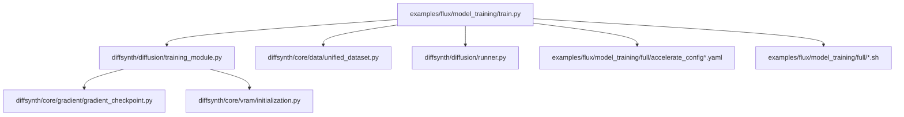
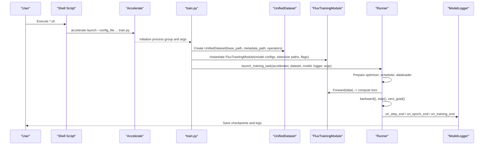
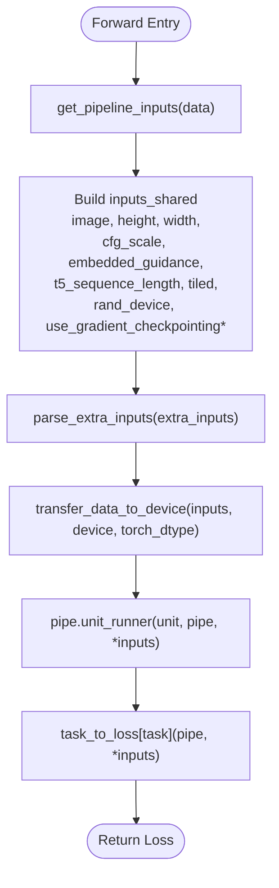
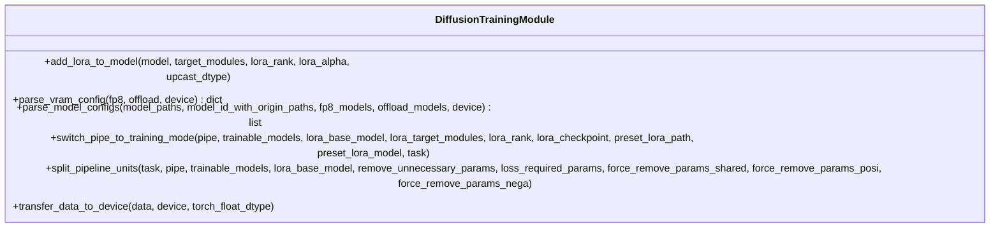
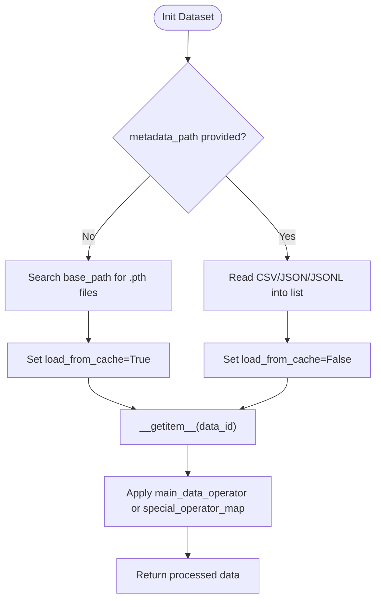
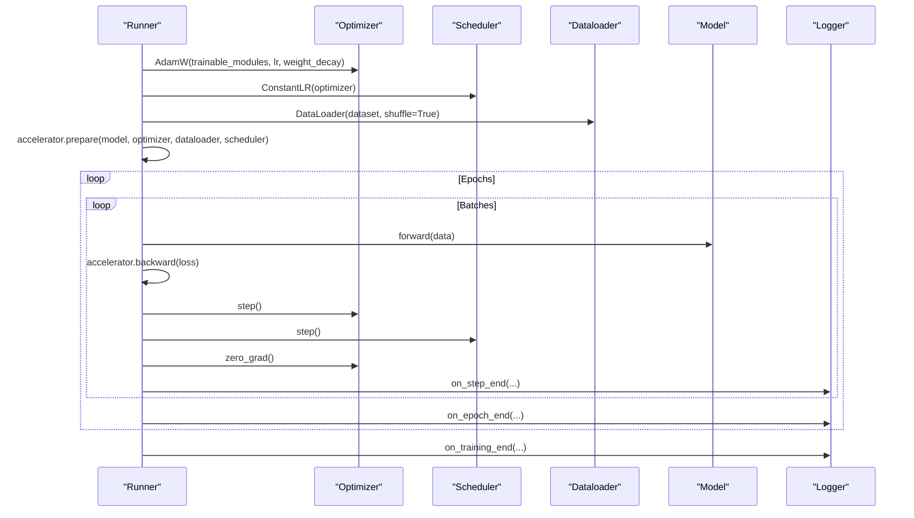
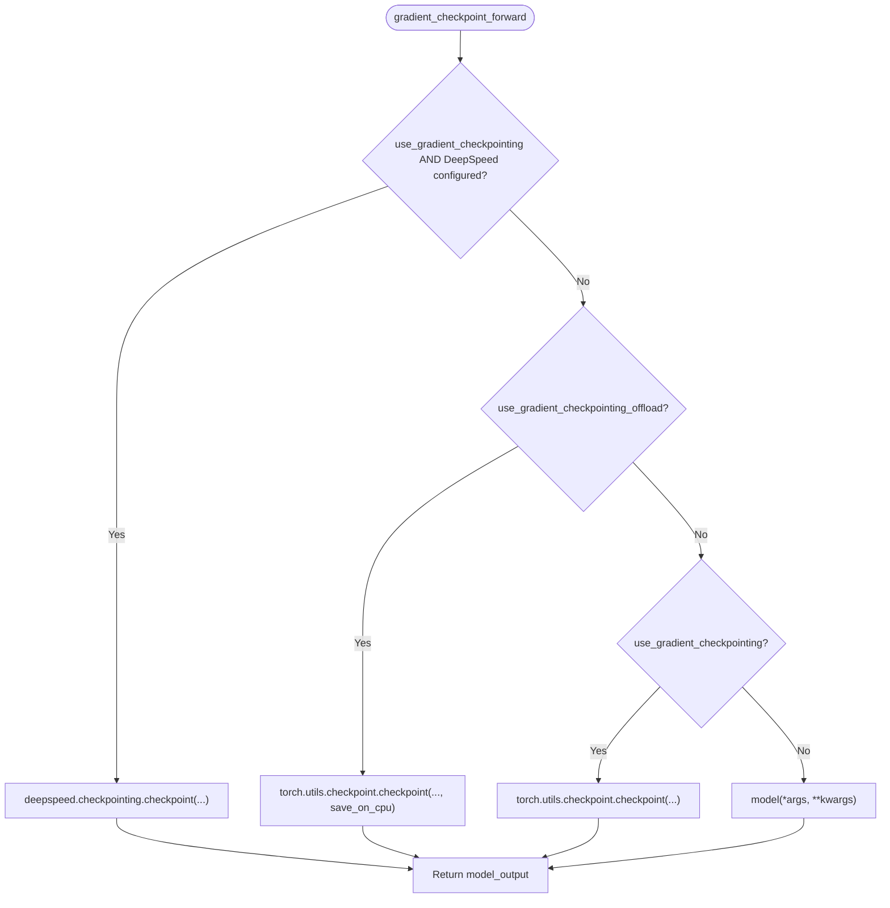
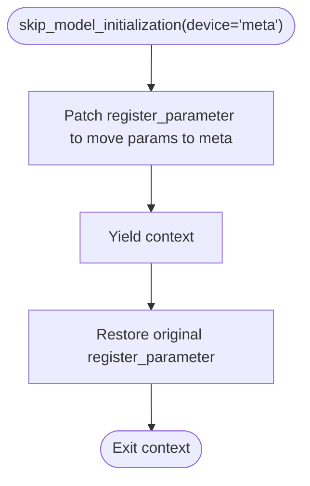
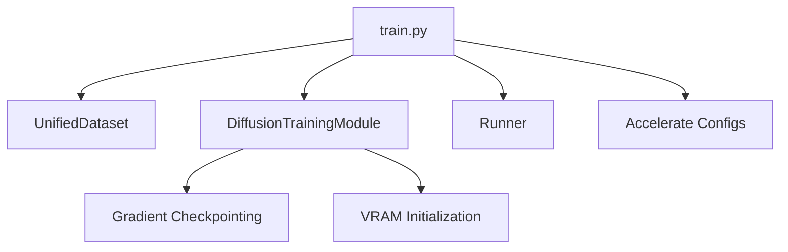

# Full Fine-tuning Training

<cite>
**Referenced Files in This Document**
- [train.py](file://examples/flux/model_training/train.py)
- [training_module.py](file://diffsynth/diffusion/training_module.py)
- [runner.py](file://diffsynth/diffusion/runner.py)
- [unified_dataset.py](file://diffsynth/core/data/unified_dataset.py)
- [gradient_checkpoint.py](file://diffsynth/core/gradient/gradient_checkpoint.py)
- [initialization.py](file://diffsynth/core/vram/initialization.py)
- [accelerate_config.yaml](file://examples/flux/model_training/full/accelerate_config.yaml)
- [accelerate_config_zero3.yaml](file://examples/flux/model_training/full/accelerate_config_zero3.yaml)
- [accelerate_config_zero2offload.yaml](file://examples/flux/model_training/full/accelerate_config_zero2offload.yaml)
- [FLUX.1-dev.sh](file://examples/flux/model_training/full/FLUX.1-dev.sh)
- [FLUX.1-dev-InfiniteYou.sh](file://examples/flux/model_training/full/FLUX.1-dev-InfiniteYou.sh)
</cite>

## Table of Contents
1. [Introduction](#introduction)
2. [Project Structure](#project-structure)
3. [Core Components](#core-components)
4. [Architecture Overview](#architecture-overview)
5. [Detailed Component Analysis](#detailed-component-analysis)
6. [Dependency Analysis](#dependency-analysis)
7. [Performance Considerations](#performance-considerations)
8. [Troubleshooting Guide](#troubleshooting-guide)
9. [Conclusion](#conclusion)
10. [Appendices](#appendices)

## Introduction
This document explains how to perform full fine-tuning training for FLUX models using the provided training framework. It covers the end-to-end pipeline: environment setup, dataset preparation, configuration files (including Accelerate and DeepSpeed settings), hyperparameter tuning strategies, memory optimization techniques (gradient checkpointing, mixed precision, offloading), running training jobs across different backends (single GPU, multi-GPU, ZeRO-2/ZeRO-3), monitoring progress, saving checkpoints, and resuming interrupted sessions.

## Project Structure
The FLUX full fine-tuning entry point is a Python script that constructs a training module, loads datasets, and launches training via Accelerate. Configuration files under the examples directory define distributed training scenarios with DeepSpeed.

**Diagram sources**
- [train.py:1-194](file://examples/flux/model_training/train.py#L1-L194)
- [training_module.py:1-303](file://diffsynth/diffusion/training_module.py#L1-L303)
- [unified_dataset.py:1-119](file://diffsynth/core/data/unified_dataset.py#L1-L119)
- [runner.py:1-89](file://diffsynth/diffusion/runner.py#L1-L89)
- [gradient_checkpoint.py:1-66](file://diffsynth/core/gradient/gradient_checkpoint.py#L1-L66)
- [initialization.py:1-22](file://diffsynth/core/vram/initialization.py#L1-L22)
- [accelerate_config.yaml:1-23](file://examples/flux/model_training/full/accelerate_config.yaml#L1-L23)
- [accelerate_config_zero3.yaml:1-24](file://examples/flux/model_training/full/accelerate_config_zero3.yaml#L1-L24)
- [accelerate_config_zero2offload.yaml:1-23](file://examples/flux/model_training/full/accelerate_config_zero2offload.yaml#L1-L23)
- [FLUX.1-dev.sh:1-15](file://examples/flux/model_training/full/FLUX.1-dev.sh#L1-L15)
- [FLUX.1-dev-InfiniteYou.sh:1-17](file://examples/flux/model_training/full/FLUX.1-dev-InfiniteYou.sh#L1-L17)

**Section sources**
- [train.py:1-194](file://examples/flux/model_training/train.py#L1-L194)
- [accelerate_config.yaml:1-23](file://examples/flux/model_training/full/accelerate_config.yaml#L1-L23)
- [accelerate_config_zero3.yaml:1-24](file://examples/flux/model_training/full/accelerate_config_zero3.yaml#L1-L24)
- [accelerate_config_zero2offload.yaml:1-23](file://examples/flux/model_training/full/accelerate_config_zero2offload.yaml#L1-L23)
- [FLUX.1-dev.sh:1-15](file://examples/flux/model_training/full/FLUX.1-dev.sh#L1-L15)
- [FLUX.1-dev-InfiniteYou.sh:1-17](file://examples/flux/model_training/full/FLUX.1-dev-InfiniteYou.sh#L1-L17)

## Core Components
- FluxTrainingModule: Wraps the FLUX pipeline, configures tokenizers, sets training mode, handles extra inputs, and computes losses based on task type.
- DiffusionTrainingModule: Base class providing LoRA injection, VRAM configuration parsing, model config parsing, parameter transfer utilities, and pipeline splitting for data processing vs training.
- UnifiedDataset: Loads metadata (CSV/JSON/JSONL) or cached .pth files, applies image/video operators, and supports repeat and caching modes.
- Runner: Launches training loops, prepares optimizer/scheduler/dataloader, integrates DeepSpeed gradient checkpointing initialization, and orchestrates logging and saving.
- Gradient Checkpointing: Provides both native PyTorch and DeepSpeed activation checkpointing paths, with optional CPU offloading.
- VRAM Initialization: Context manager to skip model initialization on meta device for efficient loading patterns.

Key responsibilities:
- Data pipeline: metadata-driven dataset with flexible operators and caching.
- Model pipeline: FLUX pipeline units, trainable selection, LoRA patching, and loss computation.
- Distributed training: Accelerate + DeepSpeed configurations for single/multi-GPU and ZeRO variants.
- Memory optimization: Mixed precision (bf16), gradient checkpointing, FP8/offload options, and disk offloading.

**Section sources**
- [train.py:8-84](file://examples/flux/model_training/train.py#L8-L84)
- [training_module.py:30-303](file://diffsynth/diffusion/training_module.py#L30-L303)
- [unified_dataset.py:5-119](file://diffsynth/core/data/unified_dataset.py#L5-L119)
- [runner.py:8-89](file://diffsynth/diffusion/runner.py#L8-L89)
- [gradient_checkpoint.py:1-66](file://diffsynth/core/gradient/gradient_checkpoint.py#L1-L66)
- [initialization.py:1-22](file://diffsynth/core/vram/initialization.py#L1-L22)

## Architecture Overview
The training flow starts from the shell scripts which invoke accelerate launch with a specific config file. The training script builds the dataset and training module, then delegates to the runner to execute the training loop.

**Diagram sources**
- [FLUX.1-dev.sh:1-15](file://examples/flux/model_training/full/FLUX.1-dev.sh#L1-L15)
- [train.py:139-194](file://examples/flux/model_training/train.py#L139-L194)
- [unified_dataset.py:5-119](file://diffsynth/core/data/unified_dataset.py#L5-L119)
- [training_module.py:214-283](file://diffsynth/diffusion/training_module.py#L214-L283)
- [runner.py:8-47](file://diffsynth/diffusion/runner.py#L8-L47)

## Detailed Component Analysis

### FluxTrainingModule and Pipeline Inputs
- Initializes the FLUX pipeline with bfloat16 dtype and tokenizer configurations.
- Splits pipeline units based on task (data processing vs training).
- Builds shared, positive, and negative inputs; supports extra inputs like controlnet images and IDs.
- Computes task-specific losses (e.g., FlowMatchSFTLoss).

**Diagram sources**
- [train.py:55-83](file://examples/flux/model_training/train.py#L55-L83)
- [training_module.py:285-303](file://diffsynth/diffusion/training_module.py#L285-L303)

**Section sources**
- [train.py:8-84](file://examples/flux/model_training/train.py#L8-L84)

### DiffusionTrainingModule: VRAM, LoRA, and Pipeline Splitting
- Parses VRAM configurations for FP8 or offloading per model path.
- Supports LoRA injection with automatic target detection and alpha handling.
- Freezes non-trainable modules and switches pipeline to training mode.
- Splits pipeline units for data processing or training tasks.

**Diagram sources**
- [training_module.py:52-160](file://diffsynth/diffusion/training_module.py#L52-L160)
- [training_module.py:214-283](file://diffsynth/diffusion/training_module.py#L214-L283)

**Section sources**
- [training_module.py:110-160](file://diffsynth/diffusion/training_module.py#L110-L160)
- [training_module.py:214-283](file://diffsynth/diffusion/training_module.py#L214-L283)

### UnifiedDataset: Metadata and Operators
- Accepts CSV/JSON/JSONL metadata or discovers cached .pth files when no metadata is provided.
- Applies default image operator with absolute path resolution, loading, and resizing/cropping to specified dimensions and max pixels.
- Supports repeat factor and optional special operators for custom keys.

**Diagram sources**
- [unified_dataset.py:5-119](file://diffsynth/core/data/unified_dataset.py#L5-L119)

**Section sources**
- [unified_dataset.py:28-38](file://diffsynth/core/data/unified_dataset.py#L28-L38)
- [unified_dataset.py:70-119](file://diffsynth/core/data/unified_dataset.py#L70-L119)

### Runner: Training Loop and DeepSpeed Integration
- Prepares optimizer (AdamW), constant scheduler, and dataloader.
- Integrates DeepSpeed activation checkpointing if configured.
- Iterates over epochs and batches, accumulates gradients, steps optimizer, and logs/save checkpoints.

**Diagram sources**
- [runner.py:8-47](file://diffsynth/diffusion/runner.py#L8-L47)
- [runner.py:75-89](file://diffsynth/diffusion/runner.py#L75-L89)

**Section sources**
- [runner.py:8-47](file://diffsynth/diffusion/runner.py#L8-L47)
- [runner.py:75-89](file://diffsynth/diffusion/runner.py#L75-L89)

### Gradient Checkpointing and Offloading
- Chooses between DeepSpeed activation checkpointing, PyTorch checkpointing, or standard forward depending on flags.
- Supports CPU offloading for activations when enabled.

**Diagram sources**
- [gradient_checkpoint.py:30-66](file://diffsynth/core/gradient/gradient_checkpoint.py#L30-L66)

**Section sources**
- [gradient_checkpoint.py:1-66](file://diffsynth/core/gradient/gradient_checkpoint.py#L1-L66)

### VRAM Initialization Context Manager
- Temporarily overrides parameter registration to place parameters on meta device during initialization, enabling efficient model loading patterns.

**Diagram sources**
- [initialization.py:5-22](file://diffsynth/core/vram/initialization.py#L5-L22)

**Section sources**
- [initialization.py:1-22](file://diffsynth/core/vram/initialization.py#L1-L22)

## Dependency Analysis
The training script depends on core components for dataset handling, model configuration, and training orchestration. Accelerate and DeepSpeed configurations determine distributed behavior.

**Diagram sources**
- [train.py:1-194](file://examples/flux/model_training/train.py#L1-L194)
- [unified_dataset.py:1-119](file://diffsynth/core/data/unified_dataset.py#L1-L119)
- [training_module.py:1-303](file://diffsynth/diffusion/training_module.py#L1-L303)
- [runner.py:1-89](file://diffsynth/diffusion/runner.py#L1-L89)
- [gradient_checkpoint.py:1-66](file://diffsynth/core/gradient/gradient_checkpoint.py#L1-L66)
- [initialization.py:1-22](file://diffsynth/core/vram/initialization.py#L1-L22)

**Section sources**
- [train.py:1-194](file://examples/flux/model_training/train.py#L1-L194)
- [accelerate_config.yaml:1-23](file://examples/flux/model_training/full/accelerate_config.yaml#L1-L23)
- [accelerate_config_zero3.yaml:1-24](file://examples/flux/model_training/full/accelerate_config_zero3.yaml#L1-L24)
- [accelerate_config_zero2offload.yaml:1-23](file://examples/flux/model_training/full/accelerate_config_zero2offload.yaml#L1-L23)

## Performance Considerations
- Mixed Precision: bf16 is used throughout training and model loading for efficiency and stability.
- Gradient Checkpointing: Enable via flags to reduce activation memory; DeepSpeed integration can partition activations and optimize memory.
- Offloading: Options include CPU offloading for optimizer/parameters (ZeRO-2 offload) and disk offloading for extreme memory constraints.
- FP8: Supported through VRAM configuration parsing; requires compatible hardware and backend support.
- Batch Size and Accumulation: Adjust gradient_accumulation_steps and dataset_repeat to balance throughput and memory.
- Image Size and Max Pixels: Control input resolution and pixel budget to manage memory usage.

[No sources needed since this section provides general guidance]

## Troubleshooting Guide
- Missing metadata: If metadata_path is not provided, the dataset searches for cached .pth files; ensure cache exists or supply metadata.
- Key mismatches: When loading LoRA checkpoints, unexpected keys may indicate format differences; use mapping utilities to align formats.
- DeepSpeed activation checkpointing: Ensure activation_checkpointing is configured in DeepSpeed config; otherwise, fallback to PyTorch checkpointing.
- VRAM errors: Reduce image size, max_pixels, or enable gradient checkpointing/offloading; consider ZeRO-3 for large models.
- Logging and checkpoints: Verify output_path permissions and ensure save_steps are set appropriately to avoid excessive I/O.

**Section sources**
- [unified_dataset.py:70-88](file://diffsynth/core/data/unified_dataset.py#L70-L88)
- [training_module.py:247-254](file://diffsynth/diffusion/training_module.py#L247-L254)
- [runner.py:75-89](file://diffsynth/diffusion/runner.py#L75-L89)

## Conclusion
The FLUX full fine-tuning pipeline integrates robust dataset handling, flexible model configuration, and advanced memory optimizations. With Accelerate and DeepSpeed, it supports diverse distributed setups from single GPU to multi-node ZeRO-3. By tuning hyperparameters and leveraging gradient checkpointing, mixed precision, and offloading, users can efficiently train large FLUX models while maintaining stability and performance.

[No sources needed since this section summarizes without analyzing specific files]

## Appendices

### Environment Setup and Running Training Jobs
- Single GPU: Use accelerate config with num_processes=1 and appropriate mixed precision.
- Multi-GPU: Configure num_processes equal to available GPUs; ensure same_network and rdzv_backend are set correctly.
- ZeRO-2 Offload: Enable offload_optimizer_device and offload_param_device to 'cpu' for reduced VRAM usage.
- ZeRO-3: Set zero_stage=3 and zero3_init_flag=true; optionally save 16-bit models for compatibility.

Example commands:
- Basic FLUX.1-dev full fine-tuning: see [FLUX.1-dev.sh:1-15](file://examples/flux/model_training/full/FLUX.1-dev.sh#L1-L15)
- Extended inputs (controlnet, ID images): see [FLUX.1-dev-InfiniteYou.sh:1-17](file://examples/flux/model_training/full/FLUX.1-dev-InfiniteYou.sh#L1-L17)

**Section sources**
- [accelerate_config.yaml:1-23](file://examples/flux/model_training/full/accelerate_config.yaml#L1-L23)
- [accelerate_config_zero2offload.yaml:1-23](file://examples/flux/model_training/full/accelerate_config_zero2offload.yaml#L1-L23)
- [accelerate_config_zero3.yaml:1-24](file://examples/flux/model_training/full/accelerate_config_zero3.yaml#L1-L24)
- [FLUX.1-dev.sh:1-15](file://examples/flux/model_training/full/FLUX.1-dev.sh#L1-L15)
- [FLUX.1-dev-InfiniteYou.sh:1-17](file://examples/flux/model_training/full/FLUX.1-dev-InfiniteYou.sh#L1-L17)

### Dataset Preparation Requirements
- Metadata: Provide a CSV/JSON/JSONL file with columns matching data_file_keys (e.g., image, prompt, negative_prompt).
- Paths: Use absolute paths or base_path to resolve relative paths automatically.
- Operators: Default image operator handles loading, cropping, and resizing; customize via special_operator_map if needed.
- Caching: For repeated runs, generate cached .pth files to speed up data loading.

**Section sources**
- [unified_dataset.py:28-38](file://diffsynth/core/data/unified_dataset.py#L28-L38)
- [unified_dataset.py:70-119](file://diffsynth/core/data/unified_dataset.py#L70-L119)

### Configuration File Structure
- Accelerate Config Keys:
  - compute_environment: LOCAL_MACHINE
  - distributed_type: DEEPSPEED
  - deepspeed_config: gradient_accumulation_steps, offload_optimizer_device, offload_param_device, zero_stage, zero3_init_flag, zero3_save_16bit_model
  - mixed_precision: bf16
  - num_processes: number of GPUs
  - other networking flags: same_network, rdzv_backend

**Section sources**
- [accelerate_config.yaml:1-23](file://examples/flux/model_training/full/accelerate_config.yaml#L1-L23)
- [accelerate_config_zero3.yaml:1-24](file://examples/flux/model_training/full/accelerate_config_zero3.yaml#L1-L24)
- [accelerate_config_zero2offload.yaml:1-23](file://examples/flux/model_training/full/accelerate_config_zero2offload.yaml#L1-L23)

### Hyperparameter Tuning Strategies
- Learning Rate: Start with 1e-5 for full fine-tuning; adjust based on convergence behavior.
- Weight Decay: Typical values around 1e-2; tune to prevent overfitting.
- Num Epochs: Begin with small values (e.g., 1) and increase gradually.
- Gradient Accumulation: Increase steps to simulate larger batch sizes within memory limits.
- Dataset Repeat: Scale repeat factor to extend effective training iterations.

**Section sources**
- [runner.py:8-47](file://diffsynth/diffusion/runner.py#L8-L47)
- [FLUX.1-dev.sh:1-15](file://examples/flux/model_training/full/FLUX.1-dev.sh#L1-L15)

### Monitoring and Saving Checkpoints
- Logging: ModelLogger handles step/epoch/training end events; configure output_path and save_steps.
- Checkpoint Prefix: Use remove_prefix_in_ckpt to strip unnecessary prefixes (e.g., "pipe.dit." or "pipe.").
- Resume: Re-run training with the same output_path and existing checkpoints; ensure consistent dataset and config.

**Section sources**
- [train.py:180-184](file://examples/flux/model_training/train.py#L180-L184)
- [runner.py:44-47](file://diffsynth/diffusion/runner.py#L44-L47)