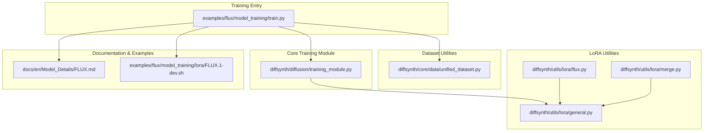
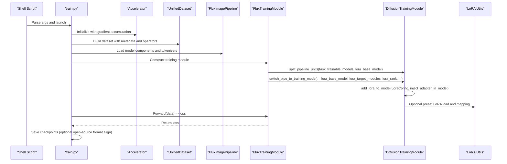
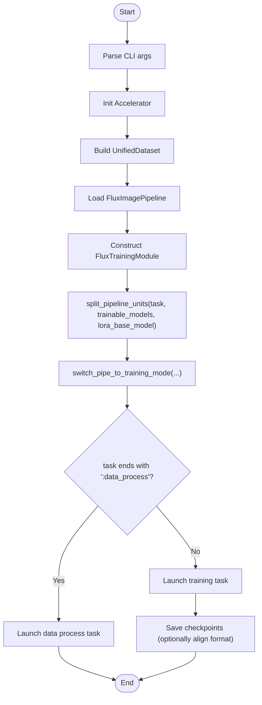
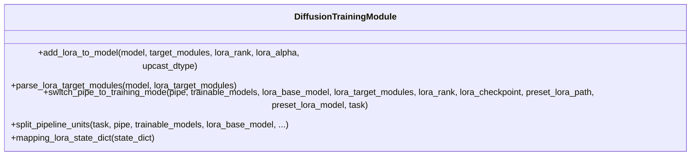
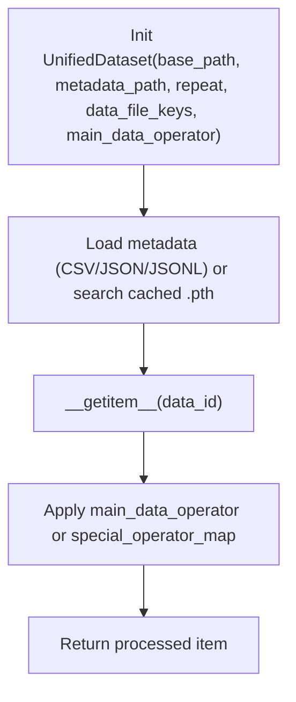
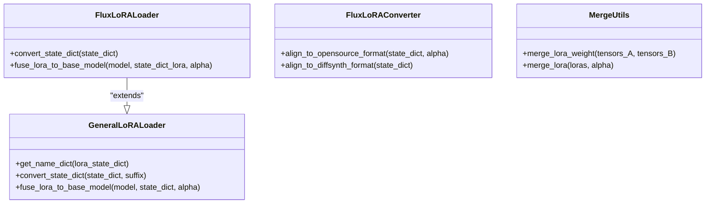
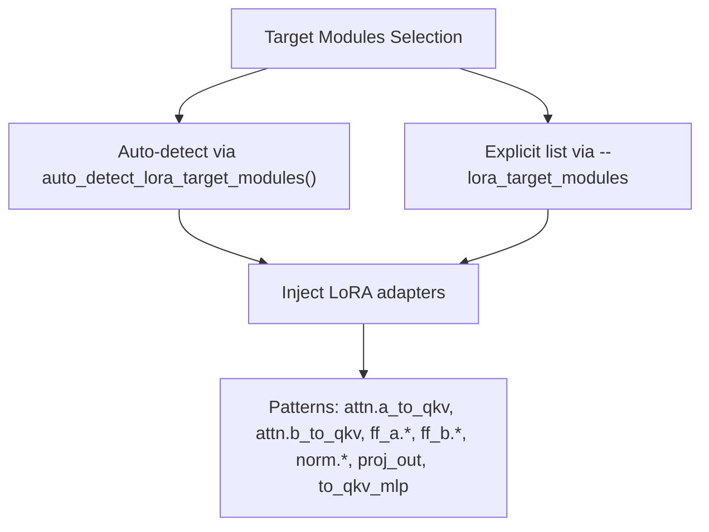
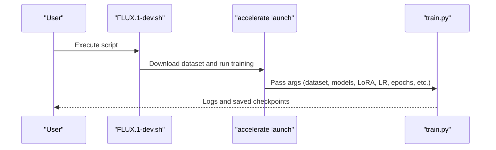
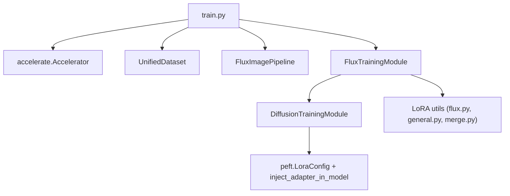

# LoRA Training

<cite>
**Referenced Files in This Document**
- [train.py](file://examples/flux/model_training/train.py)
- [training_module.py](file://diffsynth/diffusion/training_module.py)
- [unified_dataset.py](file://diffsynth/core/data/unified_dataset.py)
- [FLUX.md](file://docs/en/Model_Details/FLUX.md)
- [FLUX.1-dev.sh](file://examples/flux/model_training/lora/FLUX.1-dev.sh)
- [flux.py](file://diffsynth/utils/lora/flux.py)
- [general.py](file://diffsynth/utils/lora/general.py)
- [merge.py](file://diffsynth/utils/lora/merge.py)
- [flux_lora_encoder.py](file://diffsynth/models/flux_lora_encoder.py)
- [Model_Training.md](file://docs/en/Pipeline_Usage/Model_Training.md)
</cite>

## Table of Contents
1. [Introduction](#introduction)
2. [Project Structure](#project-structure)
3. [Core Components](#core-components)
4. [Architecture Overview](#architecture-overview)
5. [Detailed Component Analysis](#detailed-component-analysis)
6. [Dependency Analysis](#dependency-analysis)
7. [Performance Considerations](#performance-considerations)
8. [Troubleshooting Guide](#troubleshooting-guide)
9. [Conclusion](#conclusion)
10. [Appendices](#appendices)

## Introduction
This document provides a comprehensive guide to training FLUX models with Low-Rank Adaptation (LoRA). It covers the end-to-end workflow, parameter selection for rank and alpha, target modules configuration, memory efficiency benefits over full fine-tuning, dataset preparation, configuration structure, and practical usage of the training scripts. It also includes guidance on when to choose LoRA versus full fine-tuning, performance trade-offs, optimization strategies, validation procedures, and LoRA weight merging techniques.

## Project Structure
The repository organizes FLUX LoRA training around:
- A unified training script that sets up Accelerate, datasets, and the model pipeline.
- A shared training module that injects LoRA adapters and manages training mode.
- Dataset utilities for loading metadata and applying image operators.
- LoRA utilities for format conversion, merging, and compatibility across sources.
- Example shell scripts demonstrating typical LoRA training runs.

**Diagram sources**
- [train.py:1-194](file://examples/flux/model_training/train.py#L1-L194)
- [training_module.py:1-303](file://diffsynth/diffusion/training_module.py#L1-L303)
- [unified_dataset.py:1-119](file://diffsynth/core/data/unified_dataset.py#L1-L119)
- [flux.py:1-303](file://diffsynth/utils/lora/flux.py#L1-L303)
- [general.py:1-71](file://diffsynth/utils/lora/general.py#L1-L71)
- [merge.py:1-21](file://diffsynth/utils/lora/merge.py#L1-L21)
- [FLUX.md:148-202](file://docs/en/Model_Details/FLUX.md#L148-L202)
- [FLUX.1-dev.sh:1-18](file://examples/flux/model_training/lora/FLUX.1-dev.sh#L1-L18)

**Section sources**
- [train.py:1-194](file://examples/flux/model_training/train.py#L1-L194)
- [training_module.py:1-303](file://diffsynth/diffusion/training_module.py#L1-L303)
- [unified_dataset.py:1-119](file://diffsynth/core/data/unified_dataset.py#L1-L119)
- [FLUX.md:148-202](file://docs/en/Model_Details/FLUX.md#L148-L202)
- [FLUX.1-dev.sh:1-18](file://examples/flux/model_training/lora/FLUX.1-dev.sh#L1-L18)

## Core Components
- Training entrypoint: The FLUX training script configures Accelerate, builds a UnifiedDataset, constructs the FluxTrainingModule, and launches the appropriate task (data processing or training).
- DiffusionTrainingModule: Provides LoRA injection via PEFT’s LoraConfig, target module parsing (auto-detection or explicit), checkpoint mapping, and training-mode switching.
- UnifiedDataset: Loads metadata (CSV/JSON/JSONL), applies default image operators (load, resize/crop), and supports repeat and worker configurations.
- LoRA utilities: Convert between formats (DiffSynth, Civitai, Diffusers), fuse LoRA weights into base models, and merge multiple LoRAs.
- Documentation and examples: Parameter reference and example shell scripts demonstrate typical LoRA training commands.

Key responsibilities:
- Data pipeline setup and operator chaining.
- Model loading and freezing/unfreezing logic.
- LoRA adapter creation and optional preset LoRA merging.
- Loss function binding and forward pass orchestration.
- Checkpoint saving and optional open-source format alignment.

**Section sources**
- [train.py:1-194](file://examples/flux/model_training/train.py#L1-L194)
- [training_module.py:1-303](file://diffsynth/diffusion/training_module.py#L1-L303)
- [unified_dataset.py:1-119](file://diffsynth/core/data/unified_dataset.py#L1-L119)
- [flux.py:1-303](file://diffsynth/utils/lora/flux.py#L1-L303)
- [general.py:1-71](file://diffsynth/utils/lora/general.py#L1-L71)
- [merge.py:1-21](file://diffsynth/utils/lora/merge.py#L1-L21)
- [FLUX.md:148-202](file://docs/en/Model_Details/FLUX.md#L148-L202)

## Architecture Overview
The LoRA training flow integrates dataset loading, pipeline construction, LoRA injection, and training execution.

**Diagram sources**
- [train.py:139-194](file://examples/flux/model_training/train.py#L139-L194)
- [training_module.py:214-283](file://diffsynth/diffusion/training_module.py#L214-L283)
- [unified_dataset.py:1-119](file://diffsynth/core/data/unified_dataset.py#L1-L119)
- [flux.py:1-303](file://diffsynth/utils/lora/flux.py#L1-L303)

## Detailed Component Analysis

### Training Script (FLUX LoRA)
- Parses arguments for dataset, model IDs/paths, tokenizer paths, LoRA settings, gradient options, and output paths.
- Initializes Accelerate and builds a UnifiedDataset with default image operators.
- Constructs FluxTrainingModule with LoRA parameters and task-specific behavior.
- Launches either data processing or training tasks based on the task flag.

**Diagram sources**
- [train.py:139-194](file://examples/flux/model_training/train.py#L139-L194)

**Section sources**
- [train.py:1-194](file://examples/flux/model_training/train.py#L1-L194)
- [FLUX.md:148-202](file://docs/en/Model_Details/FLUX.md#L148-L202)

### DiffusionTrainingModule (LoRA Injection and Mode Switching)
- add_lora_to_model: Creates LoraConfig with r and lora_alpha, injects adapters into target modules, and optionally upcasts trainable parameters.
- parse_lora_target_modules: Auto-detects target modules if none specified; otherwise parses comma-separated list.
- switch_pipe_to_training_mode: Freezes non-trainable parts, loads preset LoRA if provided, adds LoRA to the base model, and loads an existing LoRA checkpoint if provided.
- split_pipeline_units: Splits pipeline units according to task type and required backward models.

**Diagram sources**
- [training_module.py:52-74](file://diffsynth/diffusion/training_module.py#L52-L74)
- [training_module.py:177-211](file://diffsynth/diffusion/training_module.py#L177-L211)
- [training_module.py:214-283](file://diffsynth/diffusion/training_module.py#L214-L283)

**Section sources**
- [training_module.py:1-303](file://diffsynth/diffusion/training_module.py#L1-L303)

### UnifiedDataset (Data Preparation)
- Supports CSV, JSON, JSONL metadata formats.
- Default image operator performs absolute path resolution, image loading, and crop/resize with dynamic resolution constraints.
- Repeat factor controls effective epoch length; workers control DataLoader parallelism.

**Diagram sources**
- [unified_dataset.py:1-119](file://diffsynth/core/data/unified_dataset.py#L1-L119)

**Section sources**
- [unified_dataset.py:1-119](file://diffsynth/core/data/unified_dataset.py#L1-L119)

### LoRA Utilities (Format Conversion, Fusing, Merging)
- GeneralLoRALoader: Converts various LoRA state dicts to internal naming, handles deprecated alpha keys, and fuses LoRA weights into base model layers.
- FluxLoRALoader: Maps Diffusers and Civitai LoRA formats to DiffSynth naming, infers alpha from stored values, and consolidates Q/K/V projections where needed.
- Merge utilities: Concatenate LoRA_A tensors along dimension 0 and LoRA_B tensors along dimension 1 to merge multiple LoRAs with scaling.

**Diagram sources**
- [general.py:1-71](file://diffsynth/utils/lora/general.py#L1-L71)
- [flux.py:1-303](file://diffsynth/utils/lora/flux.py#L1-L303)
- [merge.py:1-21](file://diffsynth/utils/lora/merge.py#L1-L21)

**Section sources**
- [general.py:1-71](file://diffsynth/utils/lora/general.py#L1-L71)
- [flux.py:1-303](file://diffsynth/utils/lora/flux.py#L1-L303)
- [merge.py:1-21](file://diffsynth/utils/lora/merge.py#L1-L21)

### LoRA Target Modules and Patterns
- For FLUX DiT, common target modules include attention projections, MLP layers, and normalization linear layers within double/single blocks.
- The framework can auto-detect suitable targets if none are specified, or accept a comma-separated list.
- An encoder-based LoRA embedding pattern is available for specialized workflows.

**Diagram sources**
- [training_module.py:177-211](file://diffsynth/diffusion/training_module.py#L177-L211)
- [FLUX.md:175-181](file://docs/en/Model_Details/FLUX.md#L175-L181)

**Section sources**
- [training_module.py:177-211](file://diffsynth/diffusion/training_module.py#L177-L211)
- [FLUX.md:175-181](file://docs/en/Model_Details/FLUX.md#L175-L181)

### Example Shell Script Usage
A typical LoRA training command downloads a sample dataset, sets model IDs with origin file patterns, configures LoRA targets/rank, enables gradient checkpointing, and outputs aligned LoRA format.

**Diagram sources**
- [FLUX.1-dev.sh:1-18](file://examples/flux/model_training/lora/FLUX.1-dev.sh#L1-L18)

**Section sources**
- [FLUX.1-dev.sh:1-18](file://examples/flux/model_training/lora/FLUX.1-dev.sh#L1-L18)

## Dependency Analysis
LoRA training depends on:
- Accelerate for distributed training and gradient accumulation.
- PEFT for LoRA adapter injection.
- UnifiedDataset for data loading and preprocessing.
- LoRA utilities for cross-format compatibility and merging.

**Diagram sources**
- [train.py:1-194](file://examples/flux/model_training/train.py#L1-L194)
- [training_module.py:1-303](file://diffsynth/diffusion/training_module.py#L1-L303)
- [unified_dataset.py:1-119](file://diffsynth/core/data/unified_dataset.py#L1-L119)
- [flux.py:1-303](file://diffsynth/utils/lora/flux.py#L1-L303)
- [general.py:1-71](file://diffsynth/utils/lora/general.py#L1-L71)
- [merge.py:1-21](file://diffsynth/utils/lora/merge.py#L1-L21)

**Section sources**
- [train.py:1-194](file://examples/flux/model_training/train.py#L1-L194)
- [training_module.py:1-303](file://diffsynth/diffusion/training_module.py#L1-L303)
- [unified_dataset.py:1-119](file://diffsynth/core/data/unified_dataset.py#L1-L119)
- [flux.py:1-303](file://diffsynth/utils/lora/flux.py#L1-L303)
- [general.py:1-71](file://diffsynth/utils/lora/general.py#L1-L71)
- [merge.py:1-21](file://diffsynth/utils/lora/merge.py#L1-L21)

## Performance Considerations
- Memory Efficiency: LoRA updates only low-rank matrices, significantly reducing VRAM compared to full fine-tuning. Gradient checkpointing further reduces activation memory.
- Precision: FP8 support is available for models whose parameters are not updated by gradients (e.g., frozen text encoders), while LoRA weights may be trained in higher precision.
- Batch Size: The training framework does not support batch size > 1; use gradient accumulation to simulate larger batches.
- Learning Rate: Recommended LoRA learning rate is typically around 1e-4; full fine-tuning often uses lower rates like 1e-5.
- Epoch vs Steps: Effectiveness correlates more strongly with steps than epochs; save at step intervals and monitor convergence visually.

[No sources needed since this section provides general guidance]

## Troubleshooting Guide
- Unused Parameters Error: Enable find_unused_parameters when models contain redundant parameters that do not participate in gradient computation.
- LoRA Key Mismatch: When loading a LoRA checkpoint, unexpected keys indicate mismatched naming; ensure correct format alignment or use converters.
- Slow Dataset Loading: Large dataset_repeat values can slow down PyTorch dataloaders; consider caching or reducing repeats.
- Loss Values: Diffusion loss values have limited interpretability; rely on visual validation rather than loss curves.
- FP8 Issues: If FP8 training degrades quality, revert to BF16 and report issues with details.

**Section sources**
- [FLUX.md:148-202](file://docs/en/Model_Details/FLUX.md#L148-L202)
- [Model_Training.md:223-232](file://docs/en/Pipeline_Usage/Model_Training.md#L223-L232)

## Conclusion
LoRA training for FLUX models offers a memory-efficient alternative to full fine-tuning by injecting low-rank adapters into targeted modules. The framework provides robust tools for dataset handling, LoRA injection, format compatibility, and merging. By selecting appropriate rank/alpha values, target modules, and leveraging gradient checkpointing and FP8 where applicable, users can achieve strong results with reduced resource requirements. Validation should focus on visual inspection and iterative tuning guided by training steps rather than loss alone.

[No sources needed since this section summarizes without analyzing specific files]

## Appendices

### Practical LoRA Training Workflow
- Prepare dataset metadata (CSV/JSON/JSONL) and images.
- Choose LoRA base model and target modules (explicit or auto-detected).
- Set rank and alpha (default alpha equals rank unless overridden).
- Configure learning rate, epochs, gradient accumulation, and checkpointing.
- Run training script and monitor outputs; save checkpoints at step intervals.
- Validate by generating samples and comparing against baselines.

**Section sources**
- [FLUX.md:148-202](file://docs/en/Model_Details/FLUX.md#L148-L202)
- [Model_Training.md:223-232](file://docs/en/Pipeline_Usage/Model_Training.md#L223-L232)

### Hyperparameter Tuning Guidelines
- Rank: Start with 16–32; increase if underfitting, decrease if overfitting or VRAM constrained.
- Alpha: Default equals rank; adjust to scale LoRA contribution relative to base weights.
- Learning Rate: 1e-4 for LoRA; tune ± one order of magnitude based on convergence speed.
- Gradient Accumulation: Increase to simulate larger effective batch sizes when VRAM is limited.
- Gradient Checkpointing: Enable to reduce activation memory at minor compute overhead.

**Section sources**
- [training_module.py:52-74](file://diffsynth/diffusion/training_module.py#L52-L74)
- [Model_Training.md:223-232](file://docs/en/Pipeline_Usage/Model_Training.md#L223-L232)

### Validation Procedures
- Generate samples at regular intervals using validation prompts.
- Compare visual fidelity, prompt adherence, and style consistency.
- Prefer step-based evaluation over epoch-based due to stronger correlation with steps.

[No sources needed since this section provides general guidance]

### LoRA Weight Merging Techniques
- Fuse LoRA into base model: Use GeneralLoRALoader.fuse_lora_to_base_model to add delta weights directly to base layers.
- Merge multiple LoRAs: Concatenate A matrices along input dimension and B matrices along output dimension; apply scaling factor alpha.
- Format alignment: Convert between Diffusers/Civitai/DiffSynth formats using FluxLoRALoader and FluxLoRAConverter utilities.

**Section sources**
- [general.py:52-71](file://diffsynth/utils/lora/general.py#L52-L71)
- [merge.py:1-21](file://diffsynth/utils/lora/merge.py#L1-L21)
- [flux.py:1-303](file://diffsynth/utils/lora/flux.py#L1-L303)