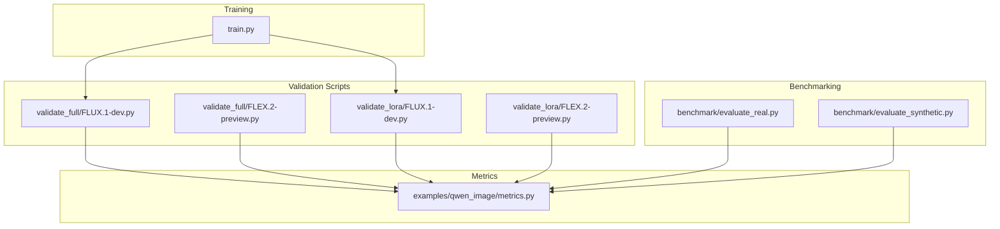
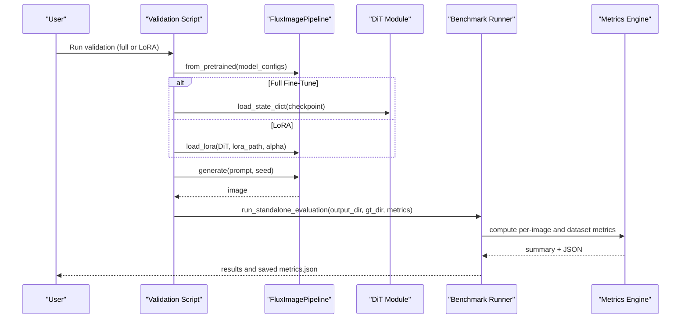
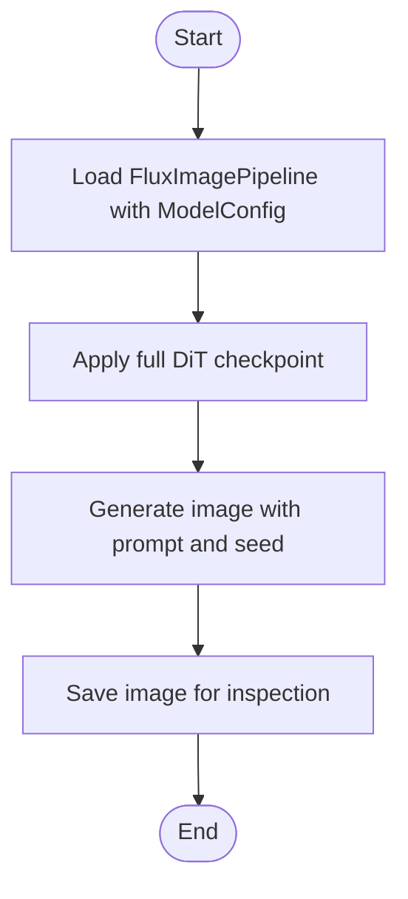
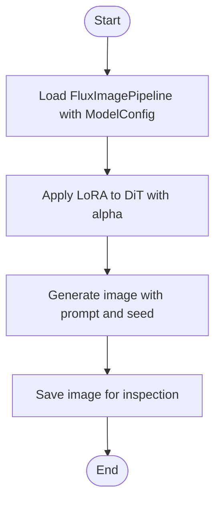
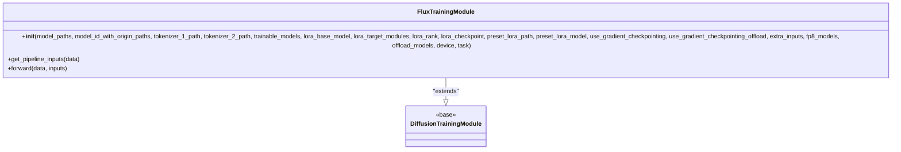
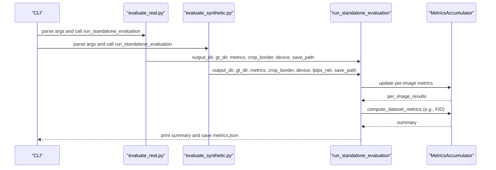
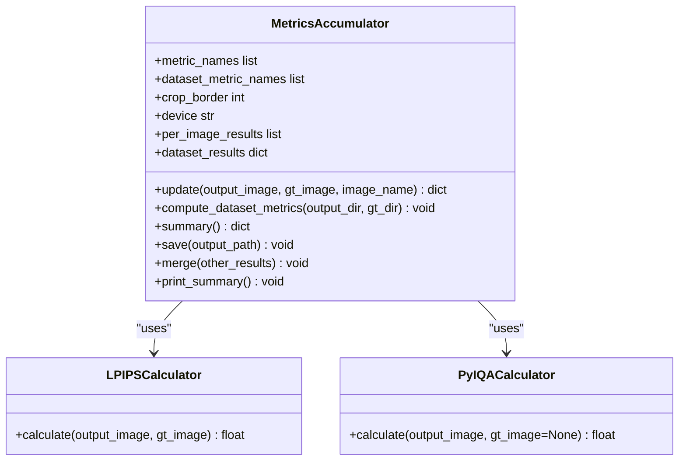
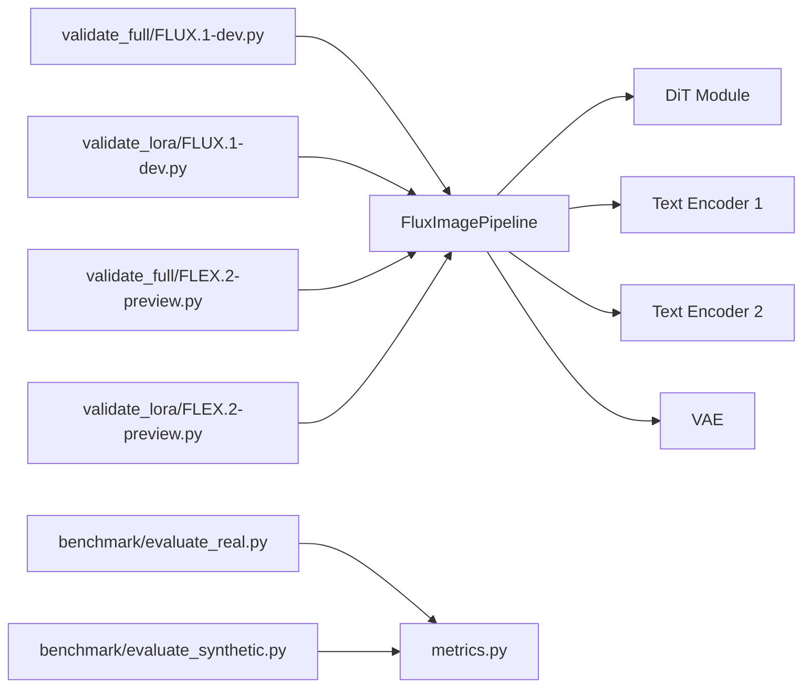

# Validation and Evaluation

<cite>
**Referenced Files in This Document**
- [FLUX.1-dev.py](file://examples/flux/model_training/validate_full/FLUX.1-dev.py)
- [FLEX.2-preview.py (full)](file://examples/flux/model_training/validate_full/FLEX.2-preview.py)
- [FLUX.1-dev.py (LoRA)](file://examples/flux/model_training/validate_lora/FLUX.1-dev.py)
- [FLEX.2-preview.py (LoRA)](file://examples/flux/model_training/validate_lora/FLEX.2-preview.py)
- [train.py](file://examples/flux/model_training/train.py)
- [evaluate_real.py](file://benchmark/evaluate_real.py)
- [evaluate_synthetic.py](file://benchmark/evaluate_synthetic.py)
- [metrics.py](file://examples/qwen_image/metrics.py)
</cite>

## Table of Contents
1. Introduction
2. Project Structure
3. Core Components
4. Architecture Overview
5. Detailed Component Analysis
6. Dependency Analysis
7. Performance Considerations
8. Troubleshooting Guide
9. Conclusion

## Introduction
This document explains how to validate and evaluate FLUX models trained with full fine-tuning or LoRA. It covers:
- Validation scripts for both full fine-tuned and LoRA checkpoints
- Quality metrics calculation and automated evaluation pipelines
- Visual inspection methods
- Dataset setup, result interpretation, performance comparison across configurations
- Overfitting/underfitting detection
- Creating custom evaluation metrics and integrating validation into training workflows

## Project Structure
The repository provides:
- FLUX validation scripts under examples/flux/model_training/validate_full and validate_lora
- A unified training script that configures the pipeline and training mode
- Benchmark utilities for real-world and synthetic image evaluation
- A comprehensive metrics module supporting reference-based, no-reference, and dataset-level metrics

**Diagram sources**
- [FLUX.1-dev.py:1-21](file://examples/flux/model_training/validate_full/FLUX.1-dev.py#L1-L21)
- [FLEX.2-preview.py (full):1-21](file://examples/flux/model_training/validate_full/FLEX.2-preview.py#L1-L21)
- [FLUX.1-dev.py (LoRA):1-19](file://examples/flux/model_training/validate_lora/FLUX.1-dev.py#L1-L19)
- [FLEX.2-preview.py (LoRA):1-19](file://examples/flux/model_training/validate_lora/FLEX.2-preview.py#L1-L19)
- [train.py:1-194](file://examples/flux/model_training/train.py#L1-L194)
- [evaluate_real.py:1-55](file://benchmark/evaluate_real.py#L1-L55)
- [evaluate_synthetic.py:1-75](file://benchmark/evaluate_synthetic.py#L1-L75)
- [metrics.py:1-572](file://examples/qwen_image/metrics.py#L1-L572)

**Section sources**
- [FLUX.1-dev.py:1-21](file://examples/flux/model_training/validate_full/FLUX.1-dev.py#L1-L21)
- [FLEX.2-preview.py (full):1-21](file://examples/flux/model_training/validate_full/FLEX.2-preview.py#L1-L21)
- [FLUX.1-dev.py (LoRA):1-19](file://examples/flux/model_training/validate_lora/FLUX.1-dev.py#L1-L19)
- [FLEX.2-preview.py (LoRA):1-19](file://examples/flux/model_training/validate_lora/FLEX.2-preview.py#L1-L19)
- [train.py:1-194](file://examples/flux/model_training/train.py#L1-L194)
- [evaluate_real.py:1-55](file://benchmark/evaluate_real.py#L1-L55)
- [evaluate_synthetic.py:1-75](file://benchmark/evaluate_synthetic.py#L1-L75)
- [metrics.py:1-572](file://examples/qwen_image/metrics.py#L1-L572)

## Core Components
- Full fine-tune validation: Loads a base FLUX pipeline and injects a DiT checkpoint from training artifacts.
- LoRA validation: Loads a base FLUX pipeline and applies a LoRA checkpoint to the DiT at inference time.
- Benchmark evaluation: Runs quality metrics on generated images against ground truth or without references.
- Metrics engine: Provides PSNR, SSIM, LPIPS, DISTS, NIQE, MUSIQ, CLIPIQA, MANIQA, and FID with per-image and dataset-level aggregation.

Key responsibilities:
- Pipeline construction and model loading
- Checkpoint application (full vs LoRA)
- Image generation for visual inspection
- Metric computation and reporting

**Section sources**
- [FLUX.1-dev.py:1-21](file://examples/flux/model_training/validate_full/FLUX.1-dev.py#L1-L21)
- [FLUX.1-dev.py (LoRA):1-19](file://examples/flux/model_training/validate_lora/FLUX.1-dev.py#L1-L19)
- [evaluate_real.py:1-55](file://benchmark/evaluate_real.py#L1-L55)
- [evaluate_synthetic.py:1-75](file://benchmark/evaluate_synthetic.py#L1-L75)
- [metrics.py:1-572](file://examples/qwen_image/metrics.py#L1-L572)

## Architecture Overview
The validation and evaluation flow consists of:
- Model loading via FluxImagePipeline with ModelConfig entries
- Applying either a full DiT state dict or a LoRA adapter
- Generating images for visual checks
- Running benchmark metrics to quantify quality

**Diagram sources**
- [FLUX.1-dev.py:1-21](file://examples/flux/model_training/validate_full/FLUX.1-dev.py#L1-L21)
- [FLUX.1-dev.py (LoRA):1-19](file://examples/flux/model_training/validate_lora/FLUX.1-dev.py#L1-L19)
- [evaluate_real.py:1-55](file://benchmark/evaluate_real.py#L1-L55)
- [evaluate_synthetic.py:1-75](file://benchmark/evaluate_synthetic.py#L1-L75)
- [metrics.py:427-517](file://examples/qwen_image/metrics.py#L427-L517)

## Detailed Component Analysis

### Full Fine-Tuned Validation
- Loads the base FLUX pipeline components (text encoders, AE, DiT).
- Applies a trained DiT checkpoint directly to the DiT module.
- Generates an image for quick visual inspection.

**Diagram sources**
- [FLUX.1-dev.py:1-21](file://examples/flux/model_training/validate_full/FLUX.1-dev.py#L1-L21)
- [FLEX.2-preview.py (full):1-21](file://examples/flux/model_training/validate_full/FLEX.2-preview.py#L1-L21)

**Section sources**
- [FLUX.1-dev.py:1-21](file://examples/flux/model_training/validate_full/FLUX.1-dev.py#L1-L21)
- [FLEX.2-preview.py (full):1-21](file://examples/flux/model_training/validate_full/FLEX.2-preview.py#L1-L21)

### LoRA Validation
- Loads the base FLUX pipeline components.
- Applies a LoRA checkpoint to the DiT at inference time using an alpha parameter.
- Generates an image for quick visual inspection.

**Diagram sources**
- [FLUX.1-dev.py (LoRA):1-19](file://examples/flux/model_training/validate_lora/FLUX.1-dev.py#L1-L19)
- [FLEX.2-preview.py (LoRA):1-19](file://examples/flux/model_training/validate_lora/FLEX.2-preview.py#L1-L19)

**Section sources**
- [FLUX.1-dev.py (LoRA):1-19](file://examples/flux/model_training/validate_lora/FLUX.1-dev.py#L1-L19)
- [FLEX.2-preview.py (LoRA):1-19](file://examples/flux/model_training/validate_lora/FLEX.2-preview.py#L1-L19)

### Training Configuration and Data Flow
- The training script constructs the FluxImagePipeline and splits units for training.
- It sets up task-specific losses and data processing inputs.
- It supports gradient checkpointing and optional offloading.

**Diagram sources**
- [train.py:8-84](file://examples/flux/model_training/train.py#L8-L84)

**Section sources**
- [train.py:1-194](file://examples/flux/model_training/train.py#L1-L194)

### Benchmark Evaluation Pipelines
Two entry points are provided:
- Real-world evaluation: Compares enhanced outputs against low-quality reference images.
- Synthetic evaluation: Compares enhanced outputs against high-quality ground truth.

Both scripts delegate metric computation to the shared metrics engine.

**Diagram sources**
- [evaluate_real.py:1-55](file://benchmark/evaluate_real.py#L1-L55)
- [evaluate_synthetic.py:1-75](file://benchmark/evaluate_synthetic.py#L1-L75)
- [metrics.py:427-517](file://examples/qwen_image/metrics.py#L427-L517)

**Section sources**
- [evaluate_real.py:1-55](file://benchmark/evaluate_real.py#L1-L55)
- [evaluate_synthetic.py:1-75](file://benchmark/evaluate_synthetic.py#L1-L75)
- [metrics.py:1-572](file://examples/qwen_image/metrics.py#L1-L572)

### Metrics Engine Deep Dive
The metrics engine supports:
- Full-reference metrics: PSNR, SSIM, LPIPS, DISTS
- No-reference metrics: NIQE, MUSIQ, CLIPIQA, MANIQA variants
- Dataset-level metrics: FID

It provides:
- Per-image accumulation and averaging
- Dataset-level computation after all images are processed
- Distributed gathering and merging across ranks
- JSON report saving with per-image and summary sections

**Diagram sources**
- [metrics.py:186-314](file://examples/qwen_image/metrics.py#L186-L314)
- [metrics.py:63-86](file://examples/qwen_image/metrics.py#L63-L86)
- [metrics.py:112-141](file://examples/qwen_image/metrics.py#L112-L141)

**Section sources**
- [metrics.py:1-572](file://examples/qwen_image/metrics.py#L1-L572)

## Dependency Analysis
- Validation scripts depend on FluxImagePipeline and ModelConfig to assemble the model.
- Full fine-tune validation depends on loading a DiT state dict; LoRA validation depends on applying a LoRA checkpoint.
- Benchmark scripts depend on the metrics engine for computing quality scores.
- The metrics engine depends on external libraries (basicsr, lpips, pyiqa, clean-fid) through lazy imports.

**Diagram sources**
- [FLUX.1-dev.py:1-21](file://examples/flux/model_training/validate_full/FLUX.1-dev.py#L1-L21)
- [FLUX.1-dev.py (LoRA):1-19](file://examples/flux/model_training/validate_lora/FLUX.1-dev.py#L1-L19)
- [FLEX.2-preview.py (full):1-21](file://examples/flux/model_training/validate_full/FLEX.2-preview.py#L1-L21)
- [FLEX.2-preview.py (LoRA):1-19](file://examples/flux/model_training/validate_lora/FLEX.2-preview.py#L1-L19)
- [evaluate_real.py:1-55](file://benchmark/evaluate_real.py#L1-L55)
- [evaluate_synthetic.py:1-75](file://benchmark/evaluate_synthetic.py#L1-L75)
- [metrics.py:1-572](file://examples/qwen_image/metrics.py#L1-L572)

**Section sources**
- [FLUX.1-dev.py:1-21](file://examples/flux/model_training/validate_full/FLUX.1-dev.py#L1-L21)
- [FLUX.1-dev.py (LoRA):1-19](file://examples/flux/model_training/validate_lora/FLUX.1-dev.py#L1-L19)
- [FLEX.2-preview.py (full):1-21](file://examples/flux/model_training/validate_full/FLEX.2-preview.py#L1-L21)
- [FLEX.2-preview.py (LoRA):1-19](file://examples/flux/model_training/validate_lora/FLEX.2-preview.py#L1-L19)
- [evaluate_real.py:1-55](file://benchmark/evaluate_real.py#L1-L55)
- [evaluate_synthetic.py:1-75](file://benchmark/evaluate_synthetic.py#L1-L75)
- [metrics.py:1-572](file://examples/qwen_image/metrics.py#L1-L572)

## Performance Considerations
- Use bfloat16 precision for faster inference and lower memory usage when validating.
- Prefer LoRA validation for quick iteration; full fine-tune validation is heavier but reflects final deployment behavior.
- For large datasets, leverage distributed gathering in the metrics engine to aggregate per-rank results efficiently.
- Choose appropriate LPIPS backbone (alex vs vgg) based on speed vs accuracy trade-offs.
- Crop borders for PSNR/SSIM/NIQE can reduce boundary effects; typical synthetic benchmarks use small crops.

[No sources needed since this section provides general guidance]

## Troubleshooting Guide
Common issues and resolutions:
- Missing GT pairing for full-reference metrics: Ensure filenames match between output and GT directories; otherwise FR metrics will be skipped.
- No images found in output directory: Verify the output path and ensure images are saved with supported extensions.
- FID requires GT directory: Provide gt_dir when requesting dataset-level metrics like FID.
- Device errors: Confirm GPU availability and set device accordingly; some metrics require CUDA.
- Library compatibility: The metrics module patches torchvision for basicsr compatibility; ensure environment matches expected versions.

Operational tips:
- Inspect per-image metrics in the generated JSON to identify outliers.
- Compare average metrics across different checkpoints or LoRA alphas to assess improvements.
- Use visual inspection alongside metrics to catch qualitative failures not captured by numbers.

**Section sources**
- [metrics.py:427-517](file://examples/qwen_image/metrics.py#L427-L517)
- [evaluate_real.py:1-55](file://benchmark/evaluate_real.py#L1-L55)
- [evaluate_synthetic.py:1-75](file://benchmark/evaluate_synthetic.py#L1-L75)

## Conclusion
The repository provides a robust validation and evaluation framework for FLUX models:
- Separate validation scripts for full fine-tuned and LoRA checkpoints streamline model checks.
- A comprehensive metrics engine supports multiple quality measures and produces detailed reports.
- Benchmark utilities enable consistent evaluation on real-world and synthetic datasets.
By following the procedures outlined here, you can set up validation datasets, interpret results, compare configurations, detect overfitting/underfitting, and integrate custom metrics into your workflow.

[No sources needed since this section summarizes without analyzing specific files]