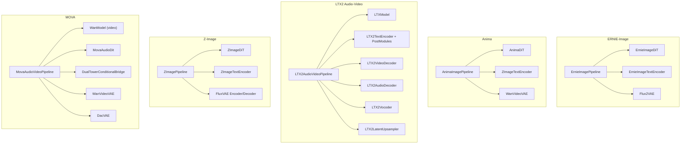
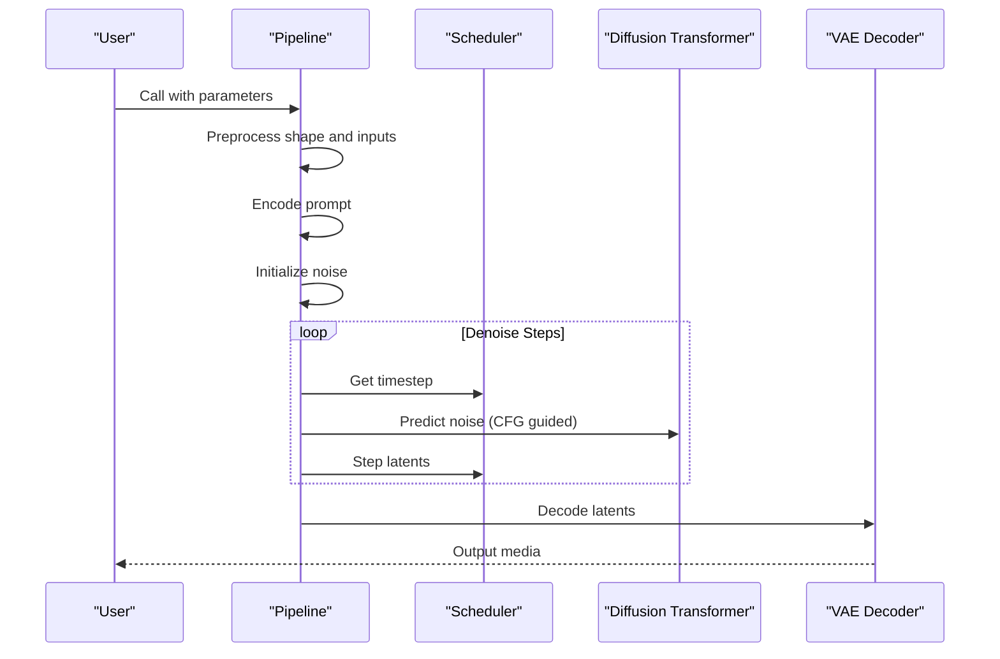
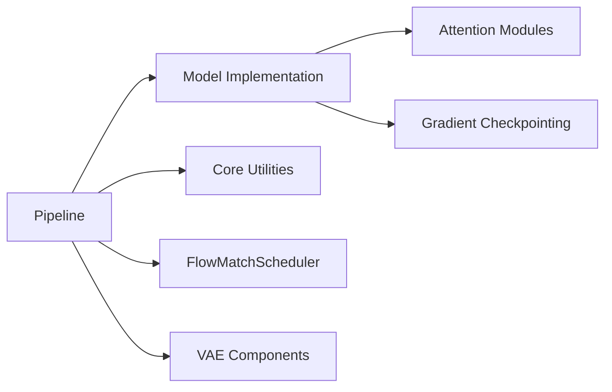

# Other Model Examples

<cite>
**Referenced Files in This Document**
- [ernie_image.py](file://diffsynth/pipelines/ernie_image.py)
- [anima_dit.py](file://diffsynth/models/anima_dit.py)
- [anima_image.py](file://diffsynth/pipelines/anima_image.py)
- [ltx2_audio_video.py](file://diffsynth/pipelines/ltx2_audio_video.py)
- [ltx2_common.py](file://diffsynth/models/ltx2_common.py)
- [z_image.py](file://diffsynth/pipelines/z_image.py)
- [z_image_dit.py](file://diffsynth/models/z_image_dit.py)
- [mova_audio_video.py](file://diffsynth/pipelines/mova_audio_video.py)
- [mova_audio_dit.py](file://diffsynth/models/mova_audio_dit.py)
- [README.md](file://examples/anima/README.md)
- [README.md](file://examples/ltx2/README.md)
- [README.md](file://examples/z_image/README.md)
- [README.md](file://examples/mova/README.md)
</cite>

## Table of Contents
1. Introduction
2. Project Structure
3. Core Components
4. Architecture Overview
5. Detailed Component Analysis
6. Dependency Analysis
7. Performance Considerations
8. Troubleshooting Guide
9. Conclusion
10. Appendices

## Introduction
This document provides practical examples and guidance for additional model types: ERNIE-Image, Anima, LTX2 audio-video models, Z-Image, and MOVA video models. It covers basic inference patterns, low VRAM techniques, model-specific features, and training examples where available. Special attention is given to audio-video generation with LTX2 and image-to-audio-video conversion with MOVA. The goal is to help users adapt these examples for custom use cases while maintaining clarity for non-experts.

## Project Structure
The repository organizes models under diffsynth/models and pipelines under diffsynth/pipelines. Each model type typically has:
- A DiT or transformer backbone implementation
- A pipeline that orchestrates text/image/audio encoders, VAEs, schedulers, and denoising steps
- Example scripts under examples/<model>/model_inference and model_inference_low_vram
- Training scripts under examples/<model>/model_training

**Diagram sources**
- [ernie_image.py:21-117](file://diffsynth/pipelines/ernie_image.py#L21-L117)
- [anima_image.py:21-133](file://diffsynth/pipelines/anima_image.py#L21-L133)
- [ltx2_audio_video.py:28-249](file://diffsynth/pipelines/ltx2_audio_video.py#L28-L249)
- [z_image.py:27-165](file://diffsynth/pipelines/z_image.py#L27-L165)
- [mova_audio_video.py:25-197](file://diffsynth/pipelines/mova_audio_video.py#L25-L197)

**Section sources**
- [ernie_image.py:21-117](file://diffsynth/pipelines/ernie_image.py#L21-L117)
- [anima_image.py:21-133](file://diffsynth/pipelines/anima_image.py#L21-L133)
- [ltx2_audio_video.py:28-249](file://diffsynth/pipelines/ltx2_audio_video.py#L28-L249)
- [z_image.py:27-165](file://diffsynth/pipelines/z_image.py#L27-L165)
- [mova_audio_video.py:25-197](file://diffsynth/pipelines/mova_audio_video.py#L25-L197)

## Core Components
- ERNIE-Image: Text-to-image using a shared AdaLN DiT with RoPE 3D and joint image-text attention; uses Flux2VAE for decoding.
- Anima: Image generation with a DiT designed for video-like processing; uses WanVideoVAE and dual tokenizers (Qwen and T5).
- LTX2 Audio-Video: Joint audio-video diffusion with separate patchifiers and VAEs; supports two-stage upscaling and distilled pipelines.
- Z-Image: Advanced image generation/editing with ControlNet, image-to-LoRA style transfer, and optional SigLIP/DINOv3 features.
- MOVA: Image-to-audio-video generation with dual-tower conditioning bridging video and audio DiTs.

Key capabilities:
- Low VRAM modes via offloading and gradient checkpointing
- Two-stage pipelines for high-resolution outputs
- Unified sequence parallelism for large models
- Flexible conditioning (text, images, retake inputs, in-context videos)

**Section sources**
- [ernie_image.py:21-117](file://diffsynth/pipelines/ernie_image.py#L21-L117)
- [anima_image.py:21-133](file://diffsynth/pipelines/anima_image.py#L21-L133)
- [ltx2_audio_video.py:28-249](file://diffsynth/pipelines/ltx2_audio_video.py#L28-L249)
- [z_image.py:27-165](file://diffsynth/pipelines/z_image.py#L27-L165)
- [mova_audio_video.py:25-197](file://diffsynth/pipelines/mova_audio_video.py#L25-L197)

## Architecture Overview
Each pipeline follows a consistent pattern:
- Shape and input preprocessing
- Prompt embedding
- Noise initialization
- Optional conditioning (images, retakes, in-context videos)
- Iterative denoising with CFG
- Decoding through VAE(s)

**Diagram sources**
- [ernie_image.py:66-117](file://diffsynth/pipelines/ernie_image.py#L66-L117)
- [anima_image.py:73-133](file://diffsynth/pipelines/anima_image.py#L73-L133)
- [ltx2_audio_video.py:168-249](file://diffsynth/pipelines/ltx2_audio_video.py#L168-L249)
- [z_image.py:94-165](file://diffsynth/pipelines/z_image.py#L94-L165)
- [mova_audio_video.py:114-197](file://diffsynth/pipelines/mova_audio_video.py#L114-L197)

## Detailed Component Analysis

### ERNIE-Image
- Pipeline: ErnieImagePipeline orchestrates text encoding, latent noise, optional input image embedding, and iterative denoising with FlowMatchScheduler.
- DiT: ErnieImageDiT implements shared AdaLN blocks, RoPE 3D embeddings, and joint attention between image and text tokens.
- VAE: Uses Flux2VAE for decoding latents to images.

Inference pattern:
- Set timesteps and run units for shape check, prompt embed, noise init, and input image embed.
- Iterate denoising steps with CFG-guided model function.
- Decode final latents to image.

Low VRAM techniques:
- Gradient checkpointing in DiT forward
- Offload non-iteration models when possible
- Use bfloat16 dtype

Training examples:
- See examples/ernie_image/model_training/train.py and shell scripts for full and LoRA training.

Adapting for custom use:
- Replace tokenizer config and text encoder path
- Adjust height/width division factors if needed
- Enable gradient checkpointing for memory-constrained environments

**Section sources**
- [ernie_image.py:21-117](file://diffsynth/pipelines/ernie_image.py#L21-L117)
- [ernie_image_dit.py:240-363](file://diffsynth/models/ernie_image_dit.py#L240-L363)

### Anima
- Pipeline: AnimaImagePipeline integrates ZImageTextEncoder and WanVideoVAE, supporting dual tokenizers (Qwen and T5).
- DiT: AnimaDiT supports 3D positional embeddings and flexible attention backends.

Inference pattern:
- Similar to other pipelines: preprocess, encode prompts, initialize noise, denoise, decode.
- Supports image-to-image by encoding input image into latents and adding noise.

Low VRAM techniques:
- Gradient checkpointing in DiT
- Offload models between stages
- Use efficient tokenization and truncation

Training examples:
- See examples/anima/model_training/train.py and scripts for full and LoRA training.

Adapting for custom use:
- Provide custom tokenizer configs for Qwen and T5
- Adjust denoising_strength for image editing tasks
- Use WanVideoVAE for single-frame decoding by squeezing temporal dimension

**Section sources**
- [anima_image.py:21-133](file://diffsynth/pipelines/anima_image.py#L21-L133)
- [anima_dit.py:756-800](file://diffsynth/models/anima_dit.py#L756-L800)

### LTX2 Audio-Video
- Pipeline: LTX2AudioVideoPipeline handles joint audio-video generation with separate patchifiers and VAEs.
- Supports one-stage and two-stage pipelines, including distilled variants.
- Conditioning includes text, images, retake audio/video, and in-context videos.

Inference pattern:
- Stage 1: Generate base latents for both modalities
- Stage 2 (optional): Upsample and refine with LoRA
- Decode video via LTX2VideoDecoder and audio via LTX2AudioDecoder + LTX2Vocoder

Low VRAM techniques:
- Tiled VAE decoding
- Gradient checkpointing
- Two-stage pipeline reduces peak memory by lowering initial resolution

Specialized capabilities:
- First-frame conditioning and reference frames
- In-context video control with downsampled sequences
- Region-based retaking for audio and video

Adapting for custom use:
- Configure stage2_lora_config and strength for refinement
- Adjust frame_rate and num_frames to match target duration
- Use distilled pipeline for faster inference at lower quality

**Section sources**
- [ltx2_audio_video.py:28-249](file://diffsynth/pipelines/ltx2_audio_video.py#L28-L249)
- [ltx2_common.py:8-158](file://diffsynth/models/ltx2_common.py#L8-L158)

### Z-Image
- Pipeline: ZImagePipeline supports text-to-image, editing, ControlNet, and image-to-LoRA style transfer.
- DiT: ZImageDiT features unified sequence handling, RoPE embeddings, and optional SigLIP/DINOv3 integration.

Inference pattern:
- Supports multiple modes: pure text-to-image, edit with mask, ControlNet conditioning, and image-to-LoRA.
- Handles different prompt encoding strategies based on model variant (Turbo vs Omni).

Low VRAM techniques:
- Gradient checkpointing
- NPU-compatible optimizations when available
- Efficient padding and attention masks

Specialized capabilities:
- ControlNet integration for structural guidance
- Image-to-LoRA for style transfer from reference images
- Multi-modal conditioning with SigLIP and DINOv3 features

Adapting for custom use:
- Choose appropriate tokenizer config for model variant
- Enable NPU patches for performance on compatible hardware
- Use ControlNet inputs for precise editing tasks

**Section sources**
- [z_image.py:27-165](file://diffsynth/pipelines/z_image.py#L27-L165)
- [z_image_dit.py:326-449](file://diffsynth/models/z_image_dit.py#L326-L449)

### MOVA
- Pipeline: MovaAudioVideoPipeline generates synchronized audio-video content from images and text.
- Dual-tower architecture bridges video and audio DiTs with conditional interactions.

Inference pattern:
- Input image encoded via VAE and combined with masks for first/last frame conditioning
- Parallel denoising of video and audio latents with cross-tower interactions
- Decode via WanVideoVAE and DacVAE

Low VRAM techniques:
- Unified Sequence Parallelism (USP) for distributed inference
- Gradient checkpointing across both towers
- Tiled VAE decoding for large resolutions

Specialized capabilities:
- First-last frame conditioning for controlled transitions
- Cross-modal frequency alignment via DualTowerConditionalBridge
- Support for mono audio resampling and format standardization

Adapting for custom use:
- Enable USP for multi-GPU setups
- Adjust switch_DiT_boundary for optimal quality-speed tradeoff
- Customize tile_size and stride for memory-constrained environments

**Section sources**
- [mova_audio_video.py:25-197](file://diffsynth/pipelines/mova_audio_video.py#L25-L197)
- [mova_audio_dit.py:11-50](file://diffsynth/models/mova_audio_dit.py#L11-L50)

## Dependency Analysis
The pipelines depend on their respective model implementations and utility modules. Key relationships:
- Pipelines orchestrate model loading, data preprocessing, and scheduling
- Models implement core architectures (DiT, VAE, text encoders)
- Utilities provide common functionality (attention, gradient checkpointing, device management)

**Diagram sources**
- [ernie_image.py:21-117](file://diffsynth/pipelines/ernie_image.py#L21-L117)
- [ltx2_audio_video.py:28-249](file://diffsynth/pipelines/ltx2_audio_video.py#L28-L249)
- [z_image.py:27-165](file://diffsynth/pipelines/z_image.py#L27-L165)
- [mova_audio_video.py:25-197](file://diffsynth/pipelines/mova_audio_video.py#L25-L197)

**Section sources**
- [ernie_image.py:21-117](file://diffsynth/pipelines/ernie_image.py#L21-L117)
- [ltx2_audio_video.py:28-249](file://diffsynth/pipelines/ltx2_audio_video.py#L28-L249)
- [z_image.py:27-165](file://diffsynth/pipelines/z_image.py#L27-L165)
- [mova_audio_video.py:25-197](file://diffsynth/pipelines/mova_audio_video.py#L25-L197)

## Performance Considerations
- Use bfloat16 precision for better performance and memory efficiency
- Enable gradient checkpointing for large models
- Utilize tiled decoding for VAEs to reduce memory peaks
- Leverage two-stage pipelines for high-resolution generation
- Apply Unified Sequence Parallelism for distributed inference
- Optimize batch sizes and sequence lengths based on available VRAM

[No sources needed since this section provides general guidance]

## Troubleshooting Guide
Common issues and solutions:
- Memory errors: Reduce batch size, enable gradient checkpointing, use tiled decoding
- Shape mismatches: Ensure proper dimension alignment for inputs and latents
- Tokenizer errors: Verify tokenizer configuration matches model requirements
- Quality issues: Adjust CFG scale, number of steps, and denoising strength

**Section sources**
- [ernie_image.py:66-117](file://diffsynth/pipelines/ernie_image.py#L66-L117)
- [ltx2_audio_video.py:252-272](file://diffsynth/pipelines/ltx2_audio_video.py#L252-L272)
- [z_image.py:407-444](file://diffsynth/pipelines/z_image.py#L407-L444)

## Conclusion
These model examples provide comprehensive solutions for various generative tasks. By understanding the pipeline structure, model architectures, and optimization techniques, users can effectively adapt these implementations for their specific needs. The modular design allows for easy customization and extension while maintaining performance and reliability.

[No sources needed since this section summarizes without analyzing specific files]

## Appendices

### Quick Start Examples
- ERNIE-Image: Text-to-image generation with configurable resolution and steps
- Anima: Image generation with dual tokenizer support and editing capabilities
- LTX2: Audio-video generation with conditioning options and two-stage refinement
- Z-Image: Advanced image editing with ControlNet and style transfer
- MOVA: Image-to-audio-video synthesis with synchronized output

### Training Resources
- Full model training scripts available for most model types
- LoRA fine-tuning examples for parameter-efficient adaptation
- Validation scripts for monitoring training progress

**Section sources**
- [README.md:1-4](file://examples/anima/README.md#L1-L4)
- [README.md:1-4](file://examples/ltx2/README.md#L1-L4)
- [README.md:1-4](file://examples/z_image/README.md#L1-L4)
- [README.md:1-4](file://examples/mova/README.md#L1-L4)