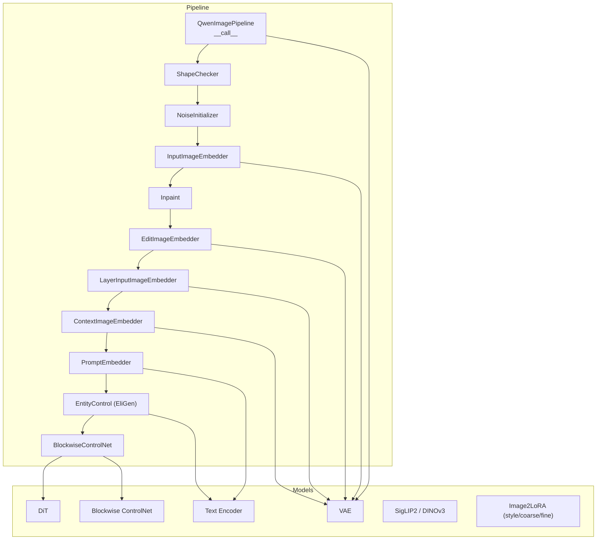
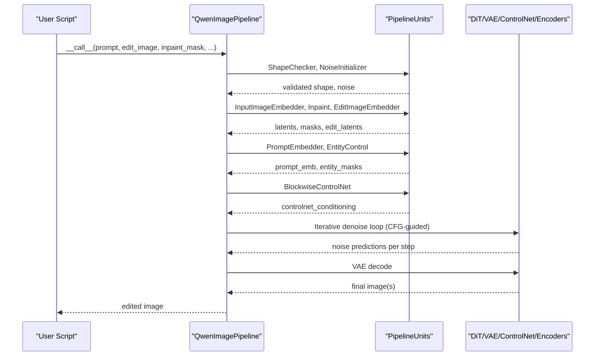

# Advanced Image Editing Features

<cite>
**Referenced Files in This Document**
- [Qwen-Image.md](file://docs/en/Model_Details/Qwen-Image.md)
- [qwen_image.py](file://diffsynth/pipelines/qwen_image.py)
- [qwen_image_dit.py](file://diffsynth/models/qwen_image_dit.py)
- [Qwen-Image-Edit.py](file://examples/qwen_image/model_inference/Qwen-Image-Edit.py)
- [Qwen-Image-Edit-Lowres-Fix.py](file://examples/qwen_image/model_inference/Qwen-Image-Edit-Lowres-Fix.py)
- [Qwen-Image-Blockwise-ControlNet-Inpaint.py](file://examples/qwen_image/model_inference/Qwen-Image-Blockwise-ControlNet-Inpaint.py)
- [Qwen-Image-Edit-2511.py](file://examples/qwen_image/model_inference/Qwen-Image-Edit-2511.py)
- [Qwen-Image-Layered-Control-V2.py](file://examples/qwen_image/model_inference/Qwen-Image-Layered-Control-V2.py)
- [adaptive_inference.py](file://examples/qwen_image/adaptive_inference.py)
- [pipeline_enhance.py](file://examples/qwen_image/pipeline_enhance.py)
</cite>

## Table of Contents
1. Introduction
2. Project Structure
3. Core Components
4. Architecture Overview
5. Detailed Component Analysis
6. Dependency Analysis
7. Performance Considerations
8. Troubleshooting Guide
9. Conclusion
10. Appendices

## Introduction
This document explains Qwen-Image advanced editing capabilities within the repository, focusing on semantic editing, style transfer, content manipulation, and low-resolution fixing. It covers editing workflows with masks and region selection, contextual understanding via control signals, parameter tuning for different scenarios, quality optimization techniques, and batch processing strategies. Practical examples include object removal, background replacement, and attribute modification.

## Project Structure
The Qwen-Image editing features are implemented through a modular pipeline that composes several units for conditioning, masking, control, and decoding. Example scripts demonstrate common editing tasks such as text-driven edits, inpainting with ControlNet, multi-image editing, layered control, and low-resolution fixes.

**Diagram sources**
- [qwen_image.py:25-197](file://diffsynth/pipelines/qwen_image.py#L25-L197)
- [qwen_image.py:229-563](file://diffsynth/pipelines/qwen_image.py#L229-L563)
- [qwen_image.py:609-716](file://diffsynth/pipelines/qwen_image.py#L609-L716)

**Section sources**
- [Qwen-Image.md:118-151](file://docs/en/Model_Details/Qwen-Image.md#L118-L151)
- [qwen_image.py:25-197](file://diffsynth/pipelines/qwen_image.py#L25-L197)

## Core Components
- QwenImagePipeline orchestrates inference with a sequence of PipelineUnits handling shape checks, noise initialization, input image embedding, inpainting mask preparation, edit image embedding, layer inputs, context images, prompt encoding, entity control (EliGen), and blockwise ControlNet conditioning.
- DiT is the core diffusion transformer; it supports RoPE embeddings and attention optimizations.
- VAE encodes/decodes images to/from latent space.
- Blockwise ControlNet provides spatially-aware guidance for tasks like inpainting and structural control.
- Image2LoRA modules encode reference images into LoRA-like adjustments using SigLIP2/DINOv3 and Qwen VL encoders.

Key parameters exposed by the pipeline include prompt/negative_prompt, cfg_scale, input_image, denoising_strength, inpaint_mask and blur controls, height/width, seed, num_inference_steps, blockwise_controlnet_inputs, EliGen prompts/masks, edit_image variants, context_image, tiled VAE options, and more.

**Section sources**
- [qwen_image.py:100-197](file://diffsynth/pipelines/qwen_image.py#L100-L197)
- [qwen_image.py:229-563](file://diffsynth/pipelines/qwen_image.py#L229-L563)
- [qwen_image.py:609-716](file://diffsynth/pipelines/qwen_image.py#L609-L716)
- [qwen_image_dit.py:14-39](file://diffsynth/models/qwen_image_dit.py#L14-L39)
- [Qwen-Image.md:122-151](file://docs/en/Model_Details/Qwen-Image.md#L122-L151)

## Architecture Overview
The editing workflow follows a structured sequence:
- Prepare shapes and noise
- Encode input images and edit images into latents
- Prepare inpainting masks and optional blurs
- Encode prompts and optional multi-image edit prompts
- Optionally apply EliGen entity control
- Apply blockwise ControlNet conditioning
- Run iterative denoising guided by CFG
- Decode latents to images

**Diagram sources**
- [qwen_image.py:100-197](file://diffsynth/pipelines/qwen_image.py#L100-L197)
- [qwen_image.py:229-563](file://diffsynth/pipelines/qwen_image.py#L229-L563)

## Detailed Component Analysis

### Semantic Editing with Text and Images
- Single-image editing: Provide an input image and a prompt describing desired changes. The pipeline encodes both image and text, then generates an edited output. Auto-resize can be enabled to match a target area while preserving aspect ratio.
- Multi-image editing: Pass a list of edit images to combine or modify multiple references in one generation. A special parameter zero_cond_t is supported by certain model versions.

Practical example paths:
- Single-image editing: [Qwen-Image-Edit.py](file://examples/qwen_image/model_inference/Qwen-Image-Edit.py)
- Multi-image editing: [Qwen-Image-Edit-2511.py](file://examples/qwen_image/model_inference/Qwen-Image-Edit-2511.py)

Parameter tuning tips:
- Use edit_image_auto_resize=True for consistent scaling across edits.
- Adjust num_inference_steps and cfg_scale to balance fidelity vs creativity.
- For subtle attribute changes, lower denoising_strength when using input_image.

**Section sources**
- [Qwen-Image-Edit.py:1-26](file://examples/qwen_image/model_inference/Qwen-Image-Edit.py#L1-L26)
- [Qwen-Image-Edit-2511.py:1-45](file://examples/qwen_image/model_inference/Qwen-Image-Edit-2511.py#L1-L45)
- [qwen_image.py:566-607](file://diffsynth/pipelines/qwen_image.py#L566-L607)
- [qwen_image.py:357-439](file://diffsynth/pipelines/qwen_image.py#L357-L439)

### Style Transfer via Image2LoRA
- Reference images are encoded using SigLIP2 and DINOv3, optionally combined with Qwen VL encoders to produce residual signals.
- These signals are converted into LoRA-like adjustments merged at inference time to inject style or texture from the reference.

Workflow highlights:
- Encode reference images into embeddings
- Generate coarse and fine residuals
- Merge into a unified LoRA applied during DiT steps

Example path:
- [qwen_image.py:609-716](file://diffsynth/pipelines/qwen_image.py#L609-L716)

Parameter tuning tips:
- Ensure reference images are high-quality and representative of the desired style.
- Combine multiple references to blend styles.

**Section sources**
- [qwen_image.py:609-716](file://diffsynth/pipelines/qwen_image.py#L609-L716)

### Content Manipulation with Masks and Region Selection
- Inpainting: Provide an inpaint_mask to specify regions to regenerate. Optional blur controls smooth edges for seamless blending.
- Blockwise ControlNet: Supply control conditions (e.g., edge maps, depth, or masked images) to guide structure and composition precisely.

Common tasks:
- Object removal: Mask the object and generate a plausible background.
- Background replacement: Mask the foreground subject and change the background via prompt and ControlNet.

Example path:
- [Qwen-Image-Blockwise-ControlNet-Inpaint.py](file://examples/qwen_image/model_inference/Qwen-Image-Blockwise-ControlNet-Inpaint.py)

Mask preprocessing details:
- Masks are resized to latent resolution and optionally blurred.
- ControlNet conditioning can incorporate masked images and latent-space masks.

**Section sources**
- [Qwen-Image-Blockwise-ControlNet-Inpaint.py:1-34](file://examples/qwen_image/model_inference/Qwen-Image-Blockwise-ControlNet-Inpaint.py#L1-L34)
- [qwen_image.py:338-355](file://diffsynth/pipelines/qwen_image.py#L338-L355)
- [qwen_image.py:523-563](file://diffsynth/pipelines/qwen_image.py#L523-L563)

### Contextual Understanding with Layered Control
- Layered control allows specifying layer_input_image and layer_num to manipulate specific layers or regions.
- Context images can act as masks or additional guidance for localized edits.

Example path:
- [Qwen-Image-Layered-Control-V2.py](file://examples/qwen_image/model_inference/Qwen-Image-Layered-Control-V2.py)

Use cases:
- Precise text rendering or logo placement with mask guidance.
- Localized attribute modifications without affecting the rest of the image.

**Section sources**
- [Qwen-Image-Layered-Control-V2.py:1-44](file://examples/qwen_image/model_inference/Qwen-Image-Layered-Control-V2.py#L1-L44)
- [qwen_image.py:321-336](file://diffsynth/pipelines/qwen_image.py#L321-L336)
- [qwen_image.py:719-736](file://diffsynth/pipelines/qwen_image.py#L719-L736)

### Low-Resolution Fixing and Adaptive Enhancement
- Low-resolution fix: Load a specialized LoRA to enhance low-resolution edits, enabling better detail recovery when editing downscaled images.
- Adaptive Resolution Inference (ARI): Compute an information density map combining reference texture complexity and LQ structural gradients, then warp the image so detail-rich regions receive more pixels during inference. After enhancement, unwarp back to original layout.

Example paths:
- Low-resolution fix: [Qwen-Image-Edit-Lowres-Fix.py](file://examples/qwen_image/model_inference/Qwen-Image-Edit-Lowres-Fix.py)
- ARI: [adaptive_inference.py](file://examples/qwen_image/adaptive_inference.py)

Quality optimization techniques:
- Use edit_rope_interpolation for improved consistency when editing low-resolution inputs.
- Enable tiled VAE decoding to reduce VRAM usage with minor quality trade-offs.

**Section sources**
- [Qwen-Image-Edit-Lowres-Fix.py:1-26](file://examples/qwen_image/model_inference/Qwen-Image-Edit-Lowres-Fix.py#L1-L26)
- [adaptive_inference.py:1-567](file://examples/qwen_image/adaptive_inference.py#L1-L567)
- [qwen_image.py:100-197](file://diffsynth/pipelines/qwen_image.py#L100-L197)

### Batch Processing Strategies
- Batch editing: Pass lists of edit images to process multiple references in one call.
- Product image enhancement pipeline: Integrate IQA scoring, VLM filtering, annotation, and inference to select optimal references and generate enhanced outputs at scale.

Example path:
- [pipeline_enhance.py](file://examples/qwen_image/pipeline_enhance.py)

Batch tips:
- Precompute IQA scores and cache them to speed up selection.
- Limit candidate reference images to a manageable number before VLM filtering.

**Section sources**
- [pipeline_enhance.py:123-800](file://examples/qwen_image/pipeline_enhance.py#L123-L800)

## Dependency Analysis
The pipeline composes multiple models and units with clear responsibilities:
- Text encoder processes prompts and optional image-text templates.
- DiT performs denoising with attention mechanisms and RoPE.
- VAE handles latent encoding/decoding.
- Blockwise ControlNet applies spatial guidance.
- Image2LoRA modules convert reference images into style/content adjustments.

```mermaid
classDiagram
class QwenImagePipeline {
+from_pretrained()
+__call__()
}
class QwenImageUnit_ShapeChecker
class QwenImageUnit_NoiseInitializer
class QwenImageUnit_InputImageEmbedder
class QwenImageUnit_Inpaint
class QwenImageUnit_EditImageEmbedder
class QwenImageUnit_LayerInputImageEmbedder
class QwenImageUnit_ContextImageEmbedder
class QwenImageUnit_PromptEmbedder
class QwenImageUnit_EntityControl
class QwenImageUnit_BlockwiseControlNet
class QwenImageDiT
class QwenImageVAE
class QwenImageBlockWiseControlNet
class Siglip2ImageEncoder
class Dinov3ImageEncoder
class QwenImageImage2LoRAModel
QwenImagePipeline --> QwenImageUnit_ShapeChecker
QwenImagePipeline --> QwenImageUnit_NoiseInitializer
QwenImagePipeline --> QwenImageUnit_InputImageEmbedder
QwenImagePipeline --> QwenImageUnit_Inpaint
QwenImagePipeline --> QwenImageUnit_EditImageEmbedder
QwenImagePipeline --> QwenImageUnit_LayerInputImageEmbedder
QwenImagePipeline --> QwenImageUnit_ContextImageEmbedder
QwenImagePipeline --> QwenImageUnit_PromptEmbedder
QwenImagePipeline --> QwenImageUnit_EntityControl
QwenImagePipeline --> QwenImageUnit_BlockwiseControlNet
QwenImagePipeline --> QwenImageDiT
QwenImagePipeline --> QwenImageVAE
QwenImageUnit_BlockwiseControlNet --> QwenImageBlockWiseControlNet
QwenImageUnit_PromptEmbedder --> Siglip2ImageEncoder
QwenImageUnit_PromptEmbedder --> Dinov3ImageEncoder
QwenImageUnit_PromptEmbedder --> QwenImageImage2LoRAModel
```

**Diagram sources**
- [qwen_image.py:25-197](file://diffsynth/pipelines/qwen_image.py#L25-L197)
- [qwen_image.py:229-563](file://diffsynth/pipelines/qwen_image.py#L229-L563)
- [qwen_image.py:609-716](file://diffsynth/pipelines/qwen_image.py#L609-L716)

**Section sources**
- [qwen_image.py:25-197](file://diffsynth/pipelines/qwen_image.py#L25-L197)
- [qwen_image.py:229-563](file://diffsynth/pipelines/qwen_image.py#L229-L563)
- [qwen_image.py:609-716](file://diffsynth/pipelines/qwen_image.py#L609-L716)

## Performance Considerations
- Tiled VAE decoding reduces VRAM usage with slight errors and longer inference time.
- Gradient checkpointing and offloading can be enabled during training or advanced inference modes.
- Flash attention optimizations are available in DiT when supported.
- Adaptive inference preserves total pixel budget while allocating more computation to complex regions.

Recommendations:
- Use tiled mode for large images under memory constraints.
- Tune num_inference_steps and cfg_scale based on desired quality and speed.
- Employ adaptive inference for texture-heavy or detail-critical images.

[No sources needed since this section provides general guidance]

## Troubleshooting Guide
Common issues and resolutions:
- Insufficient VRAM: Enable VRAM management and use low-vram configurations provided in examples.
- Mask artifacts: Adjust inpaint_blur_size and inpaint_blur_sigma for smoother transitions.
- Inconsistent edits: Lower denoising_strength for subtle changes; enable edit_image_auto_resize for consistent scaling.
- Slow inference: Reduce num_inference_steps; consider distilled or lightweight models where applicable.

Operational tips:
- Validate mask sizes and formats; ensure they match expected latent dimensions.
- Check prompt token length warnings; overly long prompts may lead to unpredictable behavior.

**Section sources**
- [Qwen-Image.md:118-151](file://docs/en/Model_Details/Qwen-Image.md#L118-L151)
- [qwen_image.py:338-355](file://diffsynth/pipelines/qwen_image.py#L338-L355)
- [qwen_image.py:357-439](file://diffsynth/pipelines/qwen_image.py#L357-L439)

## Conclusion
Qwen-Image offers a comprehensive suite of editing capabilities including semantic editing, style transfer, content manipulation with masks and ControlNet, layered control, and low-resolution fixing. The modular pipeline design enables flexible combinations of prompts, images, and control signals to achieve precise edits. With parameter tuning, quality optimization, and batch processing strategies, users can efficiently perform diverse editing tasks at scale.

[No sources needed since this section summarizes without analyzing specific files]

## Appendices

### Practical Examples Summary
- Object removal: Use inpaint_mask to cover the object; adjust blur settings; refine prompt to describe desired background.
- Background replacement: Mask the foreground subject; provide a prompt describing the new background; optionally use ControlNet for structural alignment.
- Attribute modification: Use edit_image with a prompt describing attribute changes; enable auto-resize for consistency; tune denoising_strength for subtlety.

Example paths:
- [Qwen-Image-Edit.py](file://examples/qwen_image/model_inference/Qwen-Image-Edit.py)
- [Qwen-Image-Blockwise-ControlNet-Inpaint.py](file://examples/qwen_image/model_inference/Qwen-Image-Blockwise-ControlNet-Inpaint.py)
- [Qwen-Image-Edit-Lowres-Fix.py](file://examples/qwen_image/model_inference/Qwen-Image-Edit-Lowres-Fix.py)

[No sources needed since this section aggregates previously referenced files]