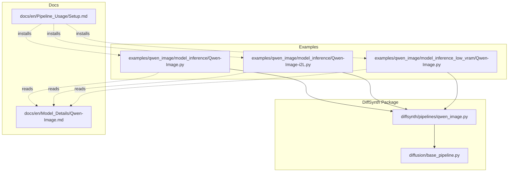
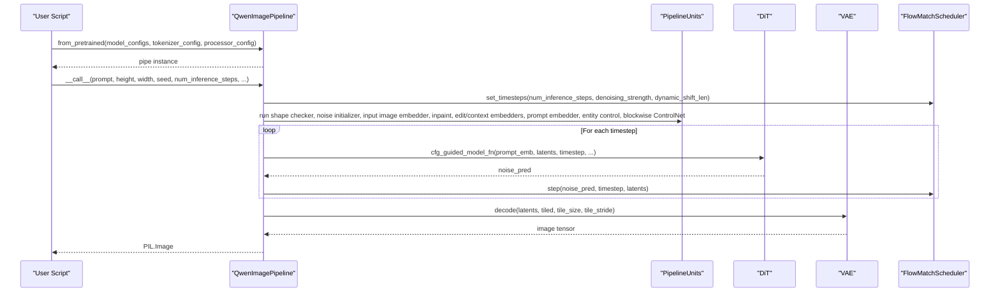
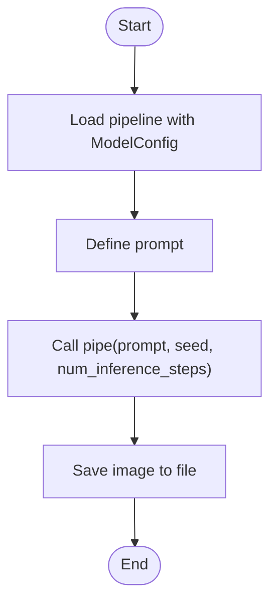
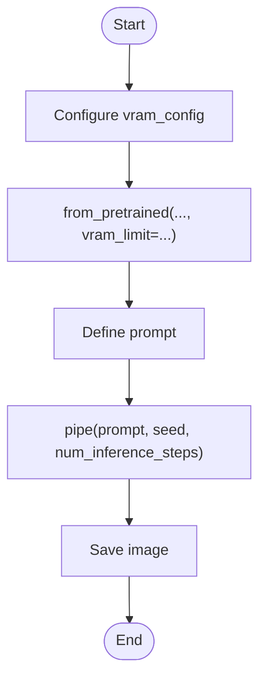
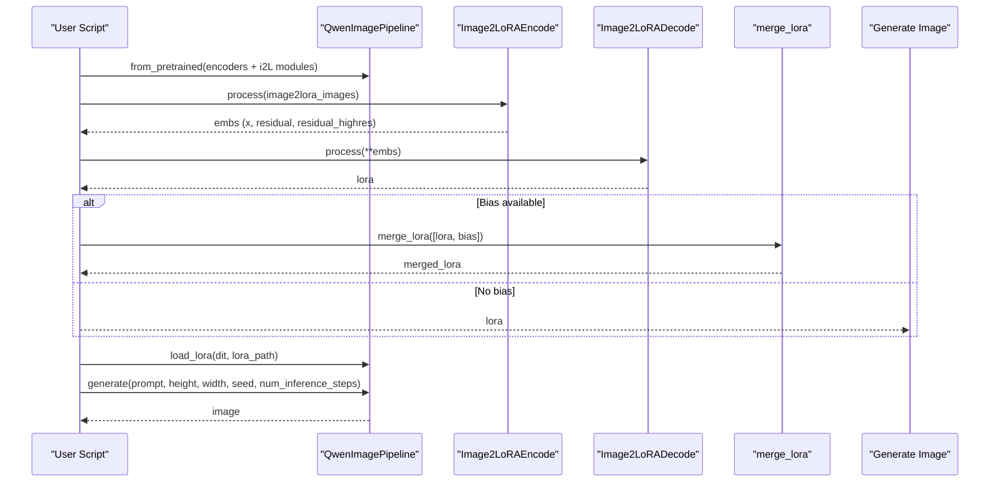
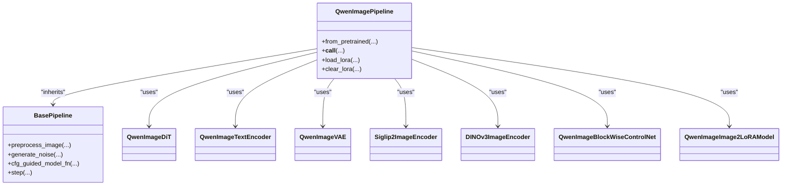

# Basic Usage and Image Generation

<cite>
**Referenced Files in This Document**
- [Qwen-Image.py](file://examples/qwen_image/model_inference/Qwen-Image.py)
- [Qwen-Image-i2L.py](file://examples/qwen_image/model_inference/Qwen-Image-i2L.py)
- [Qwen-Image (low VRAM).py](file://examples/qwen_image/model_inference_low_vram/Qwen-Image.py)
- [qwen_image.py](file://diffsynth/pipelines/qwen_image.py)
- [base_pipeline.py](file://diffusion/base_pipeline.py)
- [Qwen-Image.md](file://docs/en/Model_Details/Qwen-Image.md)
- [Setup.md](file://docs/en/Pipeline_Usage/Setup.md)
</cite>

## Table of Contents
1. Introduction
2. Project Structure
3. Core Components
4. Architecture Overview
5. Detailed Component Analysis
6. Dependency Analysis
7. Performance Considerations
8. Troubleshooting Guide
9. Conclusion
10. Appendices

## Introduction
This document provides a beginner-friendly guide to using Qwen-Image for basic image generation, text-to-image synthesis, and image-to-latent (i2L) operations. It covers environment setup, model loading, parameter configuration, inference workflows, prompt engineering tips, resolution and sampling settings, output customization, memory requirements, and common troubleshooting steps.

## Project Structure
The repository organizes Qwen-Image usage under examples and the diffsynth package:
- Example scripts demonstrate quick start and i2L workflows.
- The core pipeline implementation resides in the pipelines module.
- Documentation explains installation, parameters, and model details.

**Diagram sources**
- [Qwen-Image.py:1-18](file://examples/qwen_image/model_inference/Qwen-Image.py#L1-L18)
- [Qwen-Image-i2L.py:1-111](file://examples/qwen_image/model_inference/Qwen-Image-i2L.py#L1-L111)
- [Qwen-Image (low VRAM).py:1-29](file://examples/qwen_image/model_inference_low_vram/Qwen-Image.py#L1-L29)
- [qwen_image.py:1-120](file://diffsynth/pipelines/qwen_image.py#L1-L120)
- [base_pipeline.py:1-120](file://diffusion/base_pipeline.py#L1-L120)
- [Qwen-Image.md:1-60](file://docs/en/Model_Details/Qwen-Image.md#L1-L60)
- [Setup.md:1-54](file://docs/en/Pipeline_Usage/Setup.md#L1-L54)

**Section sources**
- [Qwen-Image.py:1-18](file://examples/qwen_image/model_inference/Qwen-Image.py#L1-L18)
- [Qwen-Image-i2L.py:1-111](file://examples/qwen_image/model_inference/Qwen-Image-i2L.py#L1-L111)
- [Qwen-Image (low VRAM).py:1-29](file://examples/qwen_image/model_inference_low_vram/Qwen-Image.py#L1-L29)
- [qwen_image.py:1-120](file://diffsynth/pipelines/qwen_image.py#L1-L120)
- [base_pipeline.py:1-120](file://diffusion/base_pipeline.py#L1-L120)
- [Qwen-Image.md:1-60](file://docs/en/Model_Details/Qwen-Image.md#L1-L60)
- [Setup.md:1-54](file://docs/en/Pipeline_Usage/Setup.md#L1-L54)

## Core Components
- QwenImagePipeline: High-level interface for text-to-image, image editing, layered control, context control, blockwise ControlNet, and i2L workflows.
- BasePipeline: Shared utilities for device/dtype handling, VRAM management, LoRA loading, CFG guidance, and unit runner orchestration.
- ModelConfig: Declarative specification for downloading and loading model weights from remote repositories.
- Scheduler: FlowMatchScheduler used by Qwen-Image with dynamic timestep scheduling based on resolution.

Key responsibilities:
- Pipeline initialization and model loading via from_pretrained.
- Inference loop with CFG-guided denoising and VAE decoding.
- Unit-based preprocessing (shape checks, noise init, prompt embedding, inpainting, edit/context images, blockwise ControlNet).
- Optional tiled inference to reduce VRAM usage.

**Section sources**
- [qwen_image.py:25-98](file://diffsynth/pipelines/qwen_image.py#L25-L98)
- [base_pipeline.py:61-120](file://diffusion/base_pipeline.py#L61-L120)
- [Qwen-Image.md:118-151](file://docs/en/Model_Details/Qwen-Image.md#L118-L151)

## Architecture Overview
The Qwen-Image pipeline composes multiple components orchestrated by a unit runner. The main flow is:
- Load models (text encoder, DiT, VAE, optional encoders and processors).
- Preprocess inputs through units (shape check, noise, input image embedder, inpaint mask, edit/context embedders, prompt embedder, entity control, blockwise ControlNet).
- Iteratively denoise using CFG-guided model_fn and scheduler.
- Decode latents to images via VAE.

**Diagram sources**
- [qwen_image.py:100-197](file://diffsynth/pipelines/qwen_image.py#L100-L197)
- [base_pipeline.py:321-341](file://diffusion/base_pipeline.py#L321-L341)

**Section sources**
- [qwen_image.py:100-197](file://diffsynth/pipelines/qwen_image.py#L100-L197)
- [base_pipeline.py:321-341](file://diffusion/base_pipeline.py#L321-L341)

## Detailed Component Analysis

### Text-to-Image Quick Start
A minimal script loads the base Qwen-Image model and generates an image from a prompt.

- Steps:
  - Import QwenImagePipeline and ModelConfig.
  - Configure model_configs for transformer, text_encoder, vae, and tokenizer.
  - Call pipe(prompt, seed, num_inference_steps) and save the result.

**Diagram sources**
- [Qwen-Image.py:1-18](file://examples/qwen_image/model_inference/Qwen-Image.py#L1-L18)

**Section sources**
- [Qwen-Image.py:1-18](file://examples/qwen_image/model_inference/Qwen-Image.py#L1-L18)
- [Qwen-Image.md:21-51](file://docs/en/Model_Details/Qwen-Image.md#L21-L51)

### Low VRAM Inference
For limited GPU memory, use the low VRAM example which configures offload/onload/preparing/computation dtypes and devices, and sets a VRAM limit.

- Key points:
  - Use vram_config dict to specify offload_dtype, offload_device, onload_dtype, onload_device, preparing_dtype, preparing_device, computation_dtype, computation_device.
  - Pass vram_limit to from_pretrained to enable automatic VRAM-aware loading.

**Diagram sources**
- [Qwen-Image (low VRAM).py:1-29](file://examples/qwen_image/model_inference_low_vram/Qwen-Image.py#L1-L29)

**Section sources**
- [Qwen-Image (low VRAM).py:1-29](file://examples/qwen_image/model_inference_low_vram/Qwen-Image.py#L1-L29)
- [Qwen-Image.md:21-51](file://docs/en/Model_Details/Qwen-Image.md#L21-L51)

### Image-to-Latent (i2L) Workflow
The i2L workflow extracts style or coarse/fine biases from reference images and merges them into a LoRA that can be applied to the DiT for generation.

- Steps:
  - Load encoders (SigLIP2, DINOv3) and i2L modules (style, coarse, fine).
  - Download example assets if needed.
  - Encode images to embeddings via QwenImageUnit_Image2LoRAEncode.
  - Decode embeddings to LoRA weights via QwenImageUnit_Image2LoRADecode.
  - Optionally merge bias LoRA.
  - Apply LoRA to DiT and generate images with desired prompts/resolution.

**Diagram sources**
- [Qwen-Image-i2L.py:1-111](file://examples/qwen_image/model_inference/Qwen-Image-i2L.py#L1-L111)
- [qwen_image.py:609-716](file://diffsynth/pipelines/qwen_image.py#L609-L716)
- [base_pipeline.py:242-294](file://diffusion/base_pipeline.py#L242-L294)

**Section sources**
- [Qwen-Image-i2L.py:1-111](file://examples/qwen_image/model_inference/Qwen-Image-i2L.py#L1-L111)
- [qwen_image.py:609-716](file://diffsynth/pipelines/qwen_image.py#L609-L716)
- [base_pipeline.py:242-294](file://diffusion/base_pipeline.py#L242-L294)

### Parameter Configuration and Inference API
The pipeline supports a comprehensive set of parameters for conditioning, inpainting, editing, layered control, context control, and tiling.

- Important parameters:
  - prompt, negative_prompt, cfg_scale
  - input_image, denoising_strength
  - inpaint_mask, inpaint_blur_size, inpaint_blur_sigma
  - height, width (must be multiples of 16)
  - seed, rand_device
  - num_inference_steps, exponential_shift_mu
  - blockwise_controlnet_inputs
  - eligen_entity_prompts, eligen_entity_masks, eligen_enable_on_negative
  - edit_image, edit_image_auto_resize, edit_rope_interpolation
  - layer_input_image, layer_num
  - context_image
  - tiled, tile_size, tile_stride
  - progress_bar_cmd

- Resolution and sampling:
  - Height/width are rounded up to multiples of 16.
  - Timesteps are scheduled dynamically based on image area; exponential_shift_mu can override default behavior.

**Section sources**
- [Qwen-Image.md:118-151](file://docs/en/Model_Details/Qwen-Image.md#L118-L151)
- [qwen_image.py:100-197](file://diffsynth/pipelines/qwen_image.py#L100-L197)
- [base_pipeline.py:97-114](file://diffusion/base_pipeline.py#L97-L114)

### Prompt Engineering Tips
- Use descriptive prompts detailing color, shape, size, texture, quantity, text, spatial relationships, and background.
- For editing tasks, describe key features of the input image and how the instruction should alter it.
- Keep prompts within token limits to avoid unpredictable behavior.

**Section sources**
- [qwen_image.py:386-438](file://diffsynth/pipelines/qwen_image.py#L386-L438)
- [Qwen-Image.md:118-151](file://docs/en/Model_Details/Qwen-Image.md#L118-L151)

### Output Customization
- Save images directly using PIL’s save method.
- Use tiled decoding to reduce VRAM at the cost of slight errors and longer time.
- Adjust tile_size and tile_stride when enabling tiled mode.

**Section sources**
- [Qwen-Image.py:15-18](file://examples/qwen_image/model_inference/Qwen-Image.py#L15-L18)
- [qwen_image.py:188-197](file://diffsynth/pipelines/qwen_image.py#L188-L197)

## Dependency Analysis
Qwen-Image depends on several internal modules and external libraries:
- Internal:
  - QwenImageDiT, QwenImageTextEncoder, QwenImageVAE
  - Siglip2ImageEncoder, DINOv3ImageEncoder
  - QwenImageBlockWiseControlNet
  - QwenImageImage2LoRAModel
- External:
  - transformers (Qwen2Tokenizer, Qwen2VLProcessor)
  - torch, einops, numpy, PIL, tqdm

**Diagram sources**
- [qwen_image.py:16-46](file://diffsynth/pipelines/qwen_image.py#L16-L46)
- [base_pipeline.py:61-120](file://diffusion/base_pipeline.py#L61-L120)

**Section sources**
- [qwen_image.py:16-46](file://diffsynth/pipelines/qwen_image.py#L16-L46)
- [base_pipeline.py:61-120](file://diffusion/base_pipeline.py#L61-L120)

## Performance Considerations
- VRAM Management:
  - Enable VRAM-aware loading by passing vram_limit and configuring vram_config per model.
  - Offload non-critical models during inference to reduce peak memory.
- Tiled Inference:
  - Set tiled=True to split VAE encoding/decoding into tiles; tune tile_size and tile_stride.
- Compilation:
  - Use compile_pipeline to optimize DiT execution where supported.
- Precision:
  - Choose appropriate torch_dtype (e.g., bfloat16) and consider float8 for offload/onload paths when supported.

[No sources needed since this section provides general guidance]

## Troubleshooting Guide
Common issues and resolutions:
- Insufficient VRAM:
  - Use low VRAM example configuration and set vram_limit.
  - Enable tiled decoding for VAE stages.
- OOM during prompt encoding:
  - Ensure prompts do not exceed token limits; shorten or simplify prompts.
- Shape errors:
  - Ensure height and width are multiples of 16; the pipeline rounds up automatically but explicit alignment avoids warnings.
- Device mismatches:
  - Confirm device="cuda" or "npu" matches your hardware; adjust code accordingly for NPU.
- Installation problems:
  - Follow Setup instructions for NVIDIA GPU, AMD ROCm, or Ascend NPU.

**Section sources**
- [Qwen-Image (low VRAM).py:1-29](file://examples/qwen_image/model_inference_low_vram/Qwen-Image.py#L1-L29)
- [Qwen-Image.md:118-151](file://docs/en/Model_Details/Qwen-Image.md#L118-L151)
- [Setup.md:1-54](file://docs/en/Pipeline_Usage/Setup.md#L1-L54)

## Conclusion
You can quickly generate high-quality images with Qwen-Image using the provided examples and pipeline. For constrained environments, leverage VRAM management and tiled inference. Extend capabilities with i2L to inject style or structural biases via LoRA. Adjust prompts, resolution, and sampling parameters to tailor outputs. Refer to the documentation for advanced features like ControlNet, layered control, and context control.

[No sources needed since this section summarizes without analyzing specific files]

## Appendices

### Environment Setup Checklist
- Install DiffSynth-Studio from source or PyPI.
- Ensure correct torch build for your GPU/NPU.
- Verify CUDA/NPU availability and drivers.
- Download required model weights (automatic via ModelConfig).

**Section sources**
- [Setup.md:1-54](file://docs/en/Pipeline_Usage/Setup.md#L1-L54)

### Recommended Parameters for Beginners
- prompt: concise, descriptive sentence.
- height/width: 1024x1024 or 1328x1328 for good quality.
- num_inference_steps: 30–50 for balanced speed/quality.
- cfg_scale: 4.0 by default; increase slightly for stronger adherence.
- seed: fixed for reproducibility.

**Section sources**
- [Qwen-Image.md:118-151](file://docs/en/Model_Details/Qwen-Image.md#L118-L151)
- [Qwen-Image.py:15-18](file://examples/qwen_image/model_inference/Qwen-Image.py#L15-L18)