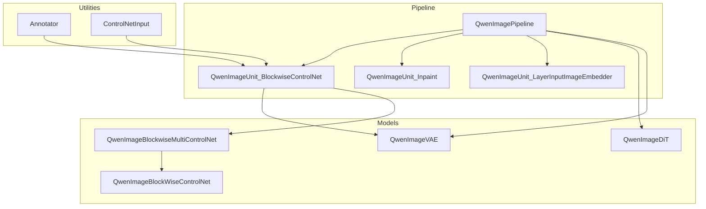
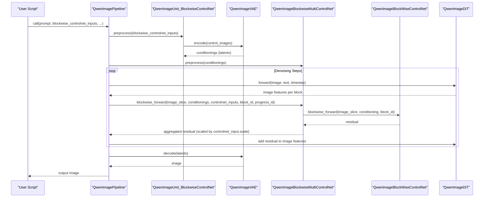
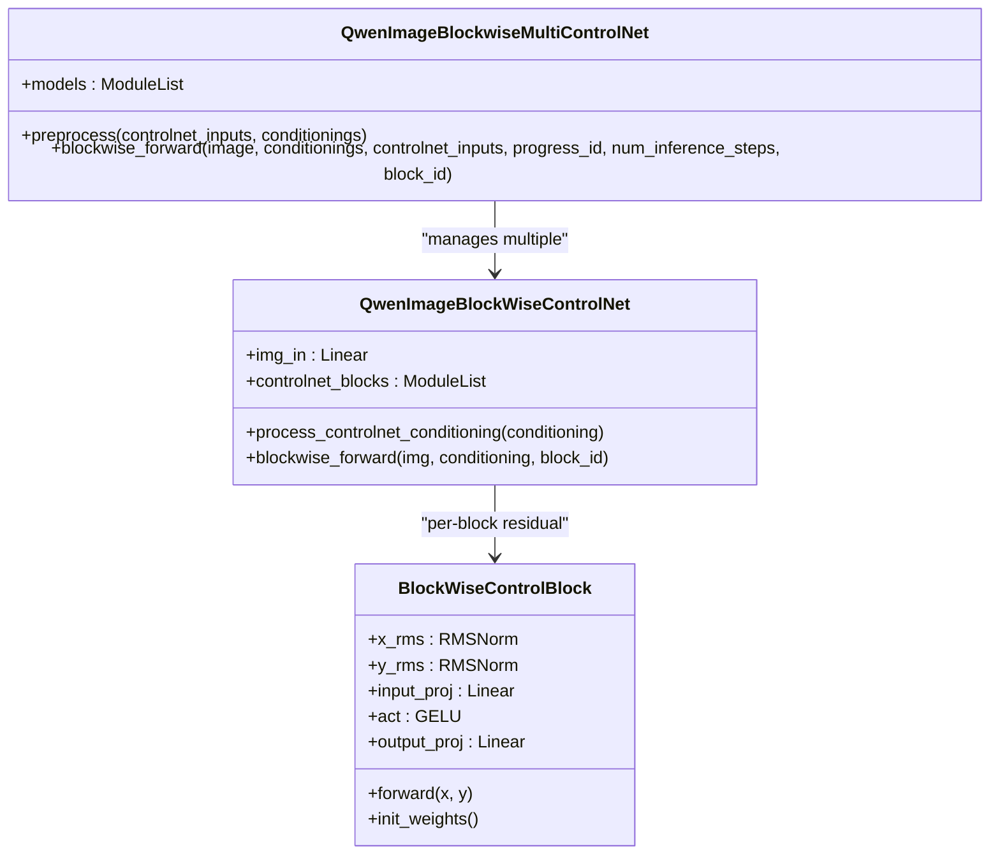
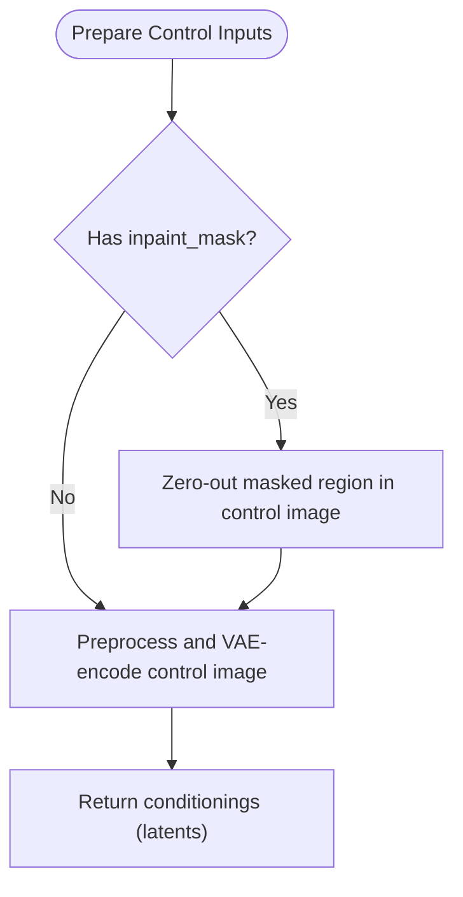
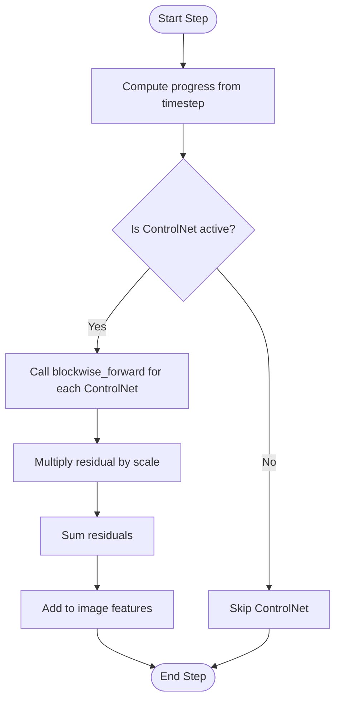
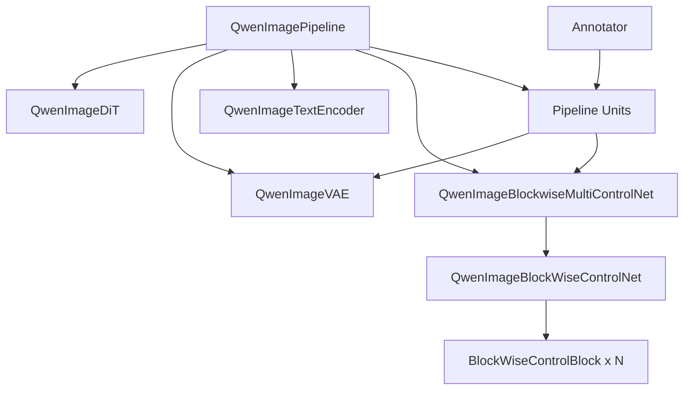

# ControlNet Integration and Control

<cite>
**Referenced Files in This Document**
- [qwen_image_controlnet.py](file://diffsynth/models/qwen_image_controlnet.py)
- [annotator.py](file://diffsynth/utils/controlnet/annotator.py)
- [controlnet_input.py](file://diffsynth/utils/controlnet/controlnet_input.py)
- [qwen_image.py](file://diffsynth/pipelines/qwen_image.py)
- [Qwen-Image-Blockwise-ControlNet-Canny.py](file://examples/qwen_image/model_inference/Qwen-Image-Blockwise-ControlNet-Canny.py)
- [Qwen-Image-Blockwise-ControlNet-Depth.py](file://examples/qwen_image/model_inference/Qwen-Image-Blockwise-ControlNet-Depth.py)
- [Qwen-Image-Blockwise-ControlNet-Inpaint.py](file://examples/qwen_image/model_inference/Qwen-Image-Blockwise-ControlNet-Inpaint.py)
- [Qwen-Image-Blockwise-ControlNet-InpaintCanny.py](file://examples/qwen_image/model_inference/Qwen-Image-Blockwise-ControlNet-InpaintCanny.py)
- [Qwen-Image-Layered-Control.py](file://examples/qwen_image/model_inference/Qwen-Image-Layered-Control.py)
</cite>

## Table of Contents
1. Introduction
2. Project Structure
3. Core Components
4. Architecture Overview
5. Detailed Component Analysis
6. Dependency Analysis
7. Performance Considerations
8. Troubleshooting Guide
9. Conclusion
10. Appendices

## Introduction
This document explains how ControlNet is integrated into Qwen-Image for precise image manipulation using structural constraints and semantic guidance. It covers blockwise ControlNet, multi-modal conditioning, layered control mechanisms, and practical usage patterns including Canny edge detection, depth estimation, inpainting control, and combining multiple control signals. You will learn how to prepare control inputs, tune control strength parameters, and combine multiple control signals to achieve fine-grained control over generation.

## Project Structure
The ControlNet integration spans model definitions, pipeline units, utility annotators, and example scripts:
- Model definition: Blockwise ControlNet modules that inject per-block residuals into the DiT transformer.
- Pipeline orchestration: Units that preprocess control images, encode them via VAE, and apply ControlNet residuals during denoising steps.
- Utilities: Annotator for generating control maps (e.g., Canny, depth), and a dataclass for ControlNet inputs with scale and scheduling.
- Examples: Scripts demonstrating Canny, depth, inpainting, combined inpainting+Canny, and layered control workflows.

**Diagram sources**
- [qwen_image.py:200-226](file://diffsynth/pipelines/qwen_image.py#L200-L226)
- [qwen_image_controlnet.py:29-56](file://diffsynth/models/qwen_image_controlnet.py#L29-L56)
- [annotator.py:9-62](file://diffsynth/utils/controlnet/annotator.py#L9-L62)
- [controlnet_input.py:5-15](file://diffsynth/utils/controlnet/controlnet_input.py#L5-L15)

**Section sources**
- [qwen_image.py:25-197](file://diffsynth/pipelines/qwen_image.py#L25-L197)
- [qwen_image_controlnet.py:1-56](file://diffsynth/models/qwen_image_controlnet.py#L1-L56)
- [annotator.py:1-64](file://diffsynth/utils/controlnet/annotator.py#L1-L64)
- [controlnet_input.py:1-15](file://diffsynth/utils/controlnet/controlnet_input.py#L1-L15)

## Core Components
- QwenImageBlockWiseControlNet: A lightweight module that projects control latents into the DiT feature space and provides per-block residual injection.
- QwenImageBlockwiseMultiControlNet: Manages multiple ControlNet models, processes conditionings, and aggregates scaled residuals across active ControlNets.
- QwenImageUnit_BlockwiseControlNet: Prepares control inputs by encoding images through the VAE and optionally applying inpaint masks; outputs conditionings for the MultiControlNet.
- ControlNetInput: Dataclass specifying which ControlNet model to use (controlnet_id), its influence (scale), and temporal activation window (start/end).
- Annotator: Generates control maps such as Canny edges or depth maps from input images.

Key responsibilities:
- Preprocessing: Resize, normalize, and VAE-encode control images to latent space.
- Conditioning projection: Map control latents to DiT dimensionality.
- Per-block injection: Add scaled residuals at each transformer block within the specified time window.
- Masking: Support inpaint masks to zero out regions in control images and append mask channels to latents.

**Section sources**
- [qwen_image_controlnet.py:6-56](file://diffsynth/models/qwen_image_controlnet.py#L6-L56)
- [qwen_image.py:200-226](file://diffsynth/pipelines/qwen_image.py#L200-L226)
- [qwen_image.py:523-563](file://diffsynth/pipelines/qwen_image.py#L523-L563)
- [controlnet_input.py:5-15](file://diffsynth/utils/controlnet/controlnet_input.py#L5-L15)
- [annotator.py:9-62](file://diffsynth/utils/controlnet/annotator.py#L9-L62)

## Architecture Overview
The ControlNet integration follows a modular pipeline where control signals are prepared once and applied throughout the diffusion process. The flow is:
- Prepare control images and optional masks.
- Encode control images via VAE to get conditionings.
- For each denoising step, compute progress and activate ControlNets within their start/end windows.
- At each transformer block, add scaled ControlNet residuals to the image features.
- Decode final latents to an image.

**Diagram sources**
- [qwen_image.py:100-197](file://diffsynth/pipelines/qwen_image.py#L100-L197)
- [qwen_image.py:523-563](file://diffsynth/pipelines/qwen_image.py#L523-L563)
- [qwen_image.py:200-226](file://diffsynth/pipelines/qwen_image.py#L200-L226)
- [qwen_image_controlnet.py:29-56](file://diffsynth/models/qwen_image_controlnet.py#L29-L56)

## Detailed Component Analysis

### Blockwise ControlNet Model
- QwenImageBlockWiseControlNet:
  - Projects control latents into DiT dimensionality via img_in.
  - Provides per-block residuals through a list of BlockWiseControlBlock instances.
  - Each block uses RMSNorm on both image and conditioning features, then applies linear-GELU-linear transformation.
  - Initialization zeros the output projections to ensure stable training/inference.

- QwenImageBlockwiseMultiControlNet:
  - Wraps multiple ControlNet models.
  - preprocess rearranges VAE-encoded conditionings and projects them via each ControlNet’s img_in.
  - blockwise_forward computes progress based on current timestep, activates ControlNets within start/end windows, and sums scaled residuals.

**Diagram sources**
- [qwen_image_controlnet.py:6-56](file://diffsynth/models/qwen_image_controlnet.py#L6-L56)
- [qwen_image.py:200-226](file://diffsynth/pipelines/qwen_image.py#L200-L226)

**Section sources**
- [qwen_image_controlnet.py:1-56](file://diffsynth/models/qwen_image_controlnet.py#L1-L56)
- [qwen_image.py:200-226](file://diffsynth/pipelines/qwen_image.py#L200-L226)

### ControlNet Input and Annotator
- ControlNetInput fields:
  - controlnet_id: selects which ControlNet model to use.
  - scale: multiplicative factor for the residual contribution.
  - start/end: fractional timestep window controlling when the ControlNet is active.
  - image: primary control image.
  - inpaint_image/inpaint_mask: optional inpainting support (mask applied to image and appended to latents).
  - processor_id: optional annotator type for generating control maps.

- Annotator:
  - Supports processors like canny, depth, softedge, lineart, openpose, normal, tile, none, inpaint.
  - Uses controlnet-aux detectors; resizes outputs back to original resolution.

**Diagram sources**
- [controlnet_input.py:5-15](file://diffsynth/utils/controlnet/controlnet_input.py#L5-L15)
- [annotator.py:9-62](file://diffsynth/utils/controlnet/annotator.py#L9-L62)
- [qwen_image.py:531-563](file://diffsynth/pipelines/qwen_image.py#L531-L563)

**Section sources**
- [controlnet_input.py:1-15](file://diffsynth/utils/controlnet/controlnet_input.py#L1-L15)
- [annotator.py:1-64](file://diffsynth/utils/controlnet/annotator.py#L1-L64)
- [qwen_image.py:531-563](file://diffsynth/pipelines/qwen_image.py#L531-L563)

### Inference Flow and Control Activation
- During denoising, the pipeline computes progress = (num_inference_steps - 1 - progress_id) / max(num_inference_steps - 1, 1).
- ControlNets are active when progress > start + epsilon or progress < end - epsilon.
- Residuals are summed across all active ControlNets, each weighted by its scale.

**Diagram sources**
- [qwen_image.py:218-226](file://diffsynth/pipelines/qwen_image.py#L218-L226)

**Section sources**
- [qwen_image.py:218-226](file://diffsynth/pipelines/qwen_image.py#L218-L226)

### Layered Control Mechanism
Layered control allows generating multiple layers or variants conditioned on a layer input image and a layer index. The pipeline supports:
- layer_input_image: RGBA image used as additional context.
- layer_num: selects which layer to generate or refine.
- Context embedding: encoded via VAE and passed alongside other conditions.

Usage pattern:
- Provide layer_input_image and layer_num to the pipeline.
- The pipeline encodes the layer image and integrates it into the generation process.

**Section sources**
- [qwen_image.py:321-335](file://diffsynth/pipelines/qwen_image.py#L321-L335)
- [Qwen-Image-Layered-Control.py:1-35](file://examples/qwen_image/model_inference/Qwen-Image-Layered-Control.py#L1-L35)

### Practical Usage Examples

#### Canny Edge Control
- Load pipeline with base Qwen-Image models and a Canny ControlNet.
- Provide a Canny edge map as controlnet_image.
- Generate an image guided by the edge structure.

**Section sources**
- [Qwen-Image-Blockwise-ControlNet-Canny.py:1-32](file://examples/qwen_image/model_inference/Qwen-Image-Blockwise-ControlNet-Canny.py#L1-L32)

#### Depth Estimation Control
- Load pipeline with base Qwen-Image models and a Depth ControlNet.
- Provide a depth map as controlnet_image.
- Generate an image respecting the depth structure.

**Section sources**
- [Qwen-Image-Blockwise-ControlNet-Depth.py:1-33](file://examples/qwen_image/model_inference/Qwen-Image-Blockwise-ControlNet-Depth.py#L1-L33)

#### Inpainting Control
- Provide input_image and inpaint_mask to the pipeline.
- Optionally pass the same image and mask as ControlNetInput to constrain the inpainted region.
- Generate the edited image.

**Section sources**
- [Qwen-Image-Blockwise-ControlNet-Inpaint.py:1-34](file://examples/qwen_image/model_inference/Qwen-Image-Blockwise-ControlNet-Inpaint.py#L1-L34)
- [qwen_image.py:338-354](file://diffsynth/pipelines/qwen_image.py#L338-L354)

#### Combined Inpainting + Canny Control
- Use two ControlNets simultaneously:
  - ControlNet 0: Inpainting with mask.
  - ControlNet 1: Canny edge guidance.
- Combine scales and activation windows to balance structural and semantic control.

**Section sources**
- [Qwen-Image-Blockwise-ControlNet-InpaintCanny.py:1-50](file://examples/qwen_image/model_inference/Qwen-Image-Blockwise-ControlNet-InpaintCanny.py#L1-L50)

#### Layered Control
- Provide a layered input image and specify layer_num to generate or refine a specific layer.
- Useful for compositing and multi-layer editing workflows.

**Section sources**
- [Qwen-Image-Layered-Control.py:1-35](file://examples/qwen_image/model_inference/Qwen-Image-Layered-Control.py#L1-L35)

## Dependency Analysis
- Pipeline depends on:
  - Text encoder, VAE, DiT, and optional image encoders (SigLIP2, DINOv3).
  - ControlNet models loaded via ModelConfig and managed by QwenImageBlockwiseMultiControlNet.
- ControlNet models depend on:
  - VAE for encoding control images into latent space.
  - DiT transformer blocks for residual injection.
- Annotator depends on controlnet-aux detectors for generating control maps.

**Diagram sources**
- [qwen_image.py:25-197](file://diffsynth/pipelines/qwen_image.py#L25-L197)
- [qwen_image_controlnet.py:29-56](file://diffsynth/models/qwen_image_controlnet.py#L29-L56)
- [annotator.py:9-62](file://diffsynth/utils/controlnet/annotator.py#L9-L62)

**Section sources**
- [qwen_image.py:25-197](file://diffsynth/pipelines/qwen_image.py#L25-L197)
- [qwen_image_controlnet.py:1-56](file://diffsynth/models/qwen_image_controlnet.py#L1-L56)
- [annotator.py:1-64](file://diffsynth/utils/controlnet/annotator.py#L1-L64)

## Performance Considerations
- Tiled decoding: Use tiled mode and appropriate tile_size/tile_stride to manage VRAM during VAE decode.
- Gradient checkpointing: Enabled in the model function to reduce memory usage during inference/training.
- ControlNet activation window: Narrower start/end windows reduce computation by limiting when ControlNets are active.
- Multiple ControlNets: Combining multiple ControlNets increases compute linearly with the number of active models; tune scales to balance quality and speed.
- Device placement: Ensure annotator models are moved to the correct device to avoid unnecessary transfers.

[No sources needed since this section provides general guidance]

## Troubleshooting Guide
- ControlNet not affecting output:
  - Verify controlnet_id matches the intended model.
  - Check scale values are non-zero and within reasonable ranges.
  - Ensure start/end windows include the current progress.
- Inpainting artifacts:
  - Confirm inpaint_mask is correctly sized and normalized.
  - Adjust blur parameters if blending is required.
- Memory issues:
  - Enable tiled VAE operations.
  - Reduce batch size or image resolution.
  - Use low-vram example scripts if available.
- Annotator errors:
  - Ensure model_path exists for controlnet-aux detectors.
  - Verify processor_id is supported.

**Section sources**
- [qwen_image.py:531-563](file://diffsynth/pipelines/qwen_image.py#L531-L563)
- [annotator.py:9-62](file://diffsynth/utils/controlnet/annotator.py#L9-L62)

## Conclusion
Qwen-Image’s ControlNet integration provides robust, blockwise control over image generation through structural constraints (edges, depth) and semantic guidance (inpainting, layered control). By preparing control inputs correctly, tuning scale and activation windows, and combining multiple ControlNets, users can achieve precise and flexible image manipulation. The modular design ensures scalability and performance, while examples demonstrate practical workflows for common tasks.

[No sources needed since this section summarizes without analyzing specific files]

## Appendices

### How to Prepare Control Inputs
- For Canny/Depth:
  - Generate control maps using Annotator or external tools.
  - Resize to target dimensions and pass as ControlNetInput.image.
- For Inpainting:
  - Provide inpaint_image and inpaint_mask.
  - Optionally pass the same pair as ControlNetInput for constrained generation.
- For Layered Control:
  - Provide layer_input_image and layer_num to select the desired layer.

**Section sources**
- [annotator.py:9-62](file://diffsynth/utils/controlnet/annotator.py#L9-L62)
- [qwen_image.py:531-563](file://diffsynth/pipelines/qwen_image.py#L531-L563)
- [Qwen-Image-Layered-Control.py:1-35](file://examples/qwen_image/model_inference/Qwen-Image-Layered-Control.py#L1-L35)

### Tuning Control Strength Parameters
- scale: Controls the magnitude of ControlNet residuals; typical range 0.5–1.5.
- start/end: Define the timestep window for activation; adjust to emphasize early or late stages.
- Multiple ControlNets: Balance contributions by adjusting individual scales; sum is computed across active ControlNets.

**Section sources**
- [controlnet_input.py:5-15](file://diffsynth/utils/controlnet/controlnet_input.py#L5-L15)
- [qwen_image.py:218-226](file://diffsynth/pipelines/qwen_image.py#L218-L226)

### Combining Multiple Control Signals
- Example: Inpainting + Canny
  - ControlNet 0: Inpainting with mask.
  - ControlNet 1: Canny edge guidance.
  - Tune scales to prioritize structural fidelity vs. content consistency.

**Section sources**
- [Qwen-Image-Blockwise-ControlNet-InpaintCanny.py:1-50](file://examples/qwen_image/model_inference/Qwen-Image-Blockwise-ControlNet-InpaintCanny.py#L1-L50)