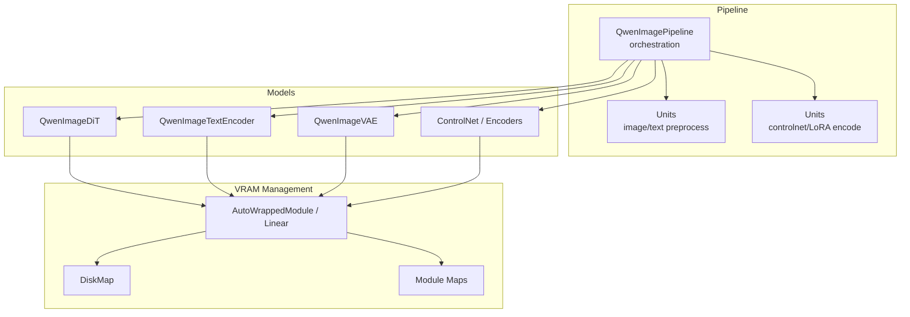
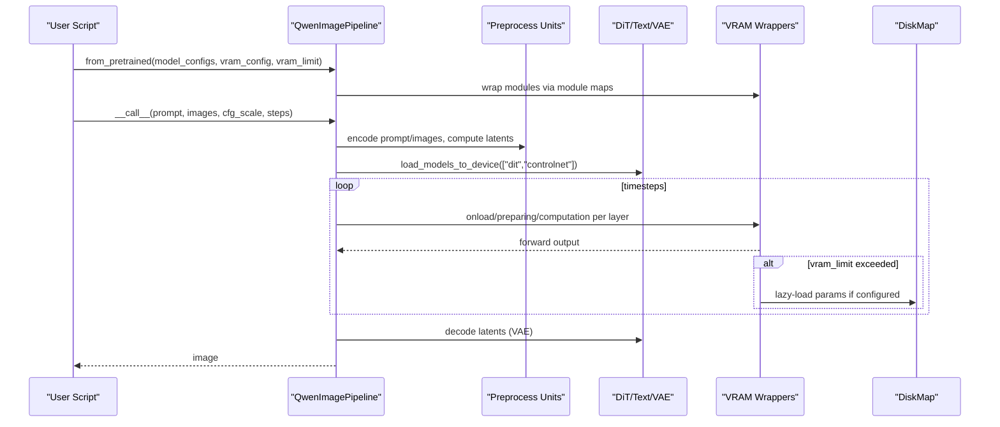
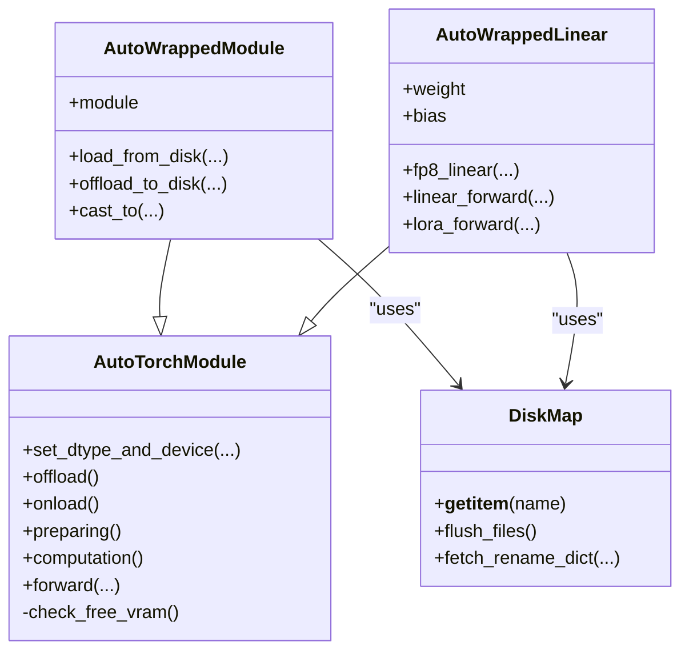
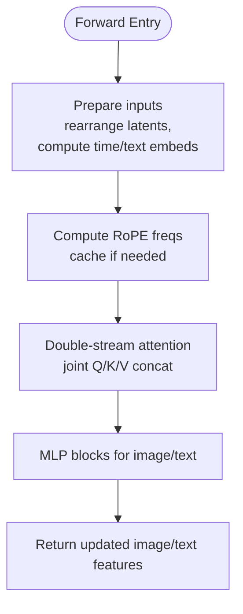
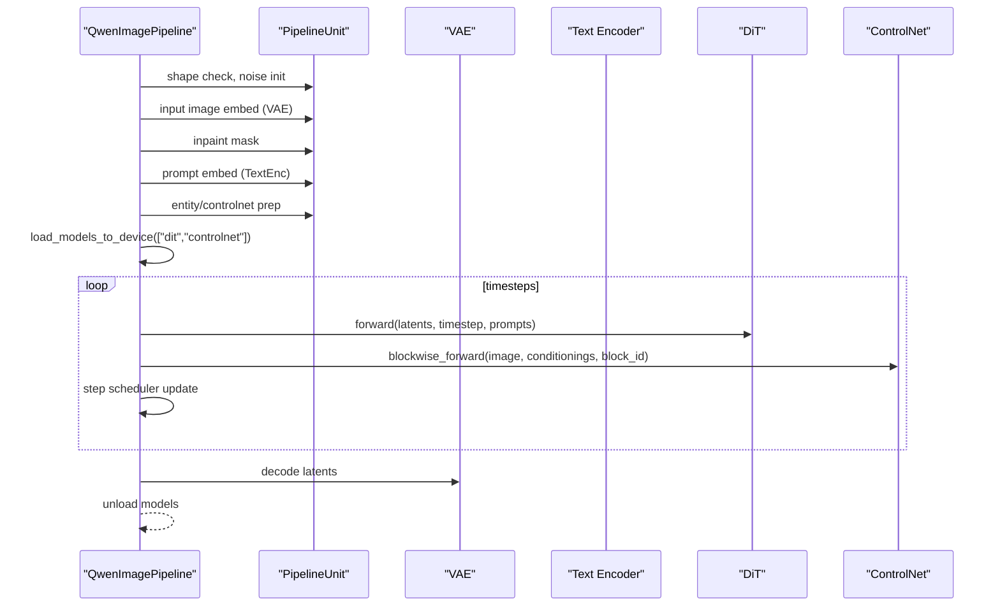
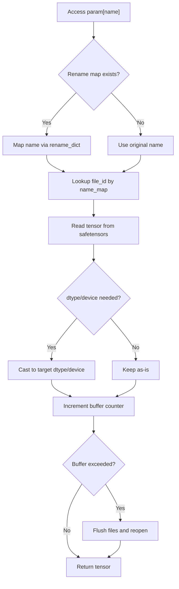
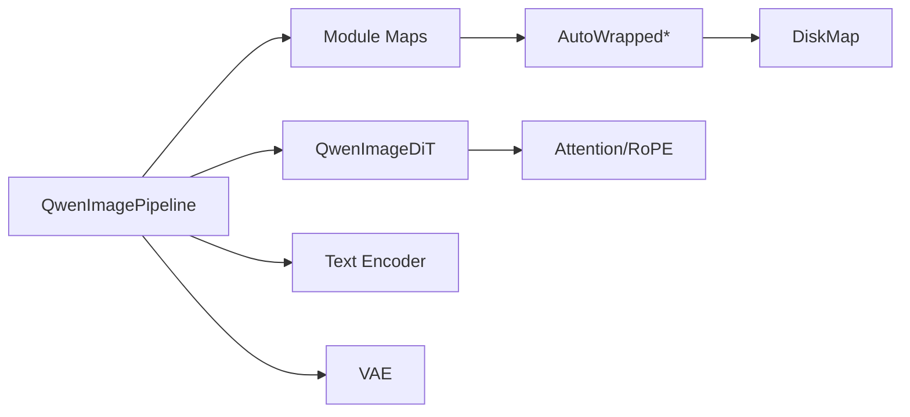

# Low VRAM Optimization

<cite>
**Referenced Files in This Document**
- [qwen_image.py](file://diffsynth/pipelines/qwen_image.py)
- [qwen_image_dit.py](file://diffsynth/models/qwen_image_dit.py)
- [vram_management_module_maps.py](file://diffsynth/configs/vram_management_module_maps.py)
- [layers.py](file://diffsynth/core/vram/layers.py)
- [disk_map.py](file://diffsynth/core/vram/disk_map.py)
- [initialization.py](file://diffsynth/core/vram/initialization.py)
- [VRAM_management.md](file://docs/en/Pipeline_Usage/VRAM_management.md)
- [Qwen-Image.py](file://examples/qwen_image/model_inference_low_vram/Qwen-Image.py)
- [Qwen-Image-Edit.py](file://examples/qwen_image/model_inference_low_vram/Qwen-Image-Edit.py)
</cite>

## Table of Contents
1. Introduction
2. Project Structure
3. Core Components
4. Architecture Overview
5. Detailed Component Analysis
6. Dependency Analysis
7. Performance Considerations
8. Troubleshooting Guide
9. Conclusion
10. Appendices

## Introduction
This document explains low VRAM optimization techniques for Qwen-Image inference, focusing on memory-efficient execution, adaptive loading strategies, and resource optimization. It covers VRAM management, model partitioning, disk offloading, streaming processing, configuration options for limited hardware, performance trade-offs, and troubleshooting memory issues. Practical examples demonstrate running large models on consumer-grade GPUs.

## Project Structure
The Qwen-Image pipeline integrates with a VRAM management framework that wraps model layers to control where parameters live (GPU, CPU, or disk), when they are loaded, and how precision is handled during computation. The key pieces include:
- Pipeline orchestration and unit-based preprocessing
- Model components (DiT, text encoder, VAE, controlnets, encoders)
- VRAM layer wrappers and disk mapping utilities
- Configuration maps that map model classes to VRAM-aware wrappers
- Example scripts demonstrating low VRAM configurations

**Diagram sources**
- [qwen_image.py:25-98](file://diffsynth/pipelines/qwen_image.py#L25-L98)
- [qwen_image_dit.py:590-728](file://diffsynth/models/qwen_image_dit.py#L590-L728)
- [vram_management_module_maps.py:12-31](file://diffsynth/configs/vram_management_module_maps.py#L12-L31)
- [layers.py:8-205](file://diffsynth/core/vram/layers.py#L8-L205)
- [disk_map.py:28-94](file://diffsynth/core/vram/disk_map.py#L28-L94)

**Section sources**
- [qwen_image.py:25-98](file://diffsynth/pipelines/qwen_image.py#L25-L98)
- [vram_management_module_maps.py:12-31](file://diffsynth/configs/vram_management_module_maps.py#L12-L31)

## Core Components
- QwenImagePipeline: Orchestrates units, loads models, runs denoising steps, and manages device placement for iterative models.
- QwenImageDiT: Transformer backbone with attention and feed-forward blocks; supports FP8 attention path and RoPE caching.
- VRAM Wrappers: AutoWrappedModule/AutoWrappedLinear provide stateful offload/onload/preparing/computation transitions and optional disk offloading.
- DiskMap: Lazy-loading tensor access from safetensors files with buffer management and dtype/device casting.
- Module Maps: Declarative mappings from model classes to VRAM-aware wrappers for fine-grained control.

Key responsibilities:
- Pipeline controls which models are resident vs. offloaded at each stage.
- VRAM wrappers manage per-layer states and dtype/device transitions.
- DiskMap enables parameter-level lazy loading from disk.
- Module maps enable automatic wrapping of specific layers across the model tree.

**Section sources**
- [qwen_image.py:25-98](file://diffsynth/pipelines/qwen_image.py#L25-L98)
- [qwen_image_dit.py:14-39](file://diffsynth/models/qwen_image_dit.py#L14-L39)
- [layers.py:8-205](file://diffsynth/core/vram/layers.py#L8-L205)
- [disk_map.py:28-94](file://diffsynth/core/vram/disk_map.py#L28-L94)
- [vram_management_module_maps.py:12-31](file://diffsynth/configs/vram_management_module_maps.py#L12-L31)

## Architecture Overview
The system uses layered VRAM management around model components. During inference:
- Non-iterative parts (tokenization, image encoding) run once and can be offloaded after use.
- Iterative parts (DiT, ControlNet) are kept ready or prepared based on VRAM availability.
- Parameters may reside on GPU, CPU, or disk depending on vram_config and vram_limit.
- Precision can be reduced (e.g., FP8 storage) while computation remains in BF16 for stability.

**Diagram sources**
- [qwen_image.py:100-197](file://diffsynth/pipelines/qwen_image.py#L100-L197)
- [layers.py:194-198](file://diffsynth/core/vram/layers.py#L194-L198)
- [disk_map.py:59-71](file://diffsynth/core/vram/disk_map.py#L59-L71)

## Detailed Component Analysis

### VRAM Layer Wrappers and State Machine
AutoWrappedModule and AutoWrappedLinear implement a four-state lifecycle:
- Offload: parameters not needed soon
- Onload: parameters will be used soon
- Preparing: temporary high-precision staging if VRAM allows
- Computation: active forward pass

They support:
- Per-layer dtype/device settings for offload/onload/preparing/computation
- Optional disk offloading by storing only metadata and lazily reading tensors
- Automatic VRAM checks to decide whether to prepare or stay offloaded

**Diagram sources**
- [layers.py:8-205](file://diffsynth/core/vram/layers.py#L8-L205)
- [layers.py:271-437](file://diffsynth/core/vram/layers.py#L271-L437)
- [disk_map.py:28-94](file://diffsynth/core/vram/disk_map.py#L28-L94)

**Section sources**
- [layers.py:8-205](file://diffsynth/core/vram/layers.py#L8-L205)
- [layers.py:271-437](file://diffsynth/core/vram/layers.py#L271-L437)
- [disk_map.py:28-94](file://diffsynth/core/vram/disk_map.py#L28-L94)

### Qwen-Image DiT and Attention Optimizations
- Double-stream attention merges image and text tokens and applies RoPE embeddings.
- Flash attention integration provides speedups; an FP8 path is available for attention when enabled.
- RoPE caches reduce recomputation across varying resolutions and sequence lengths.

**Diagram sources**
- [qwen_image_dit.py:362-431](file://diffsynth/models/qwen_image_dit.py#L362-L431)
- [qwen_image_dit.py:590-728](file://diffsynth/models/qwen_image_dit.py#L590-L728)

**Section sources**
- [qwen_image_dit.py:14-39](file://diffsynth/models/qwen_image_dit.py#L14-L39)
- [qwen_image_dit.py:362-431](file://diffsynth/models/qwen_image_dit.py#L362-L431)
- [qwen_image_dit.py:590-728](file://diffsynth/models/qwen_image_dit.py#L590-L728)

### Pipeline Orchestration and Unit-Based Processing
The pipeline divides work into units:
- Shape checking, noise initialization
- Input image embedding (VAE encode)
- Inpaint mask handling
- Prompt embedding (text encoder)
- Entity control and blockwise controlnet conditioning
- Image2LoRA encoding/decoding
- Context image embedding

It also manages model loading/unloading between stages and iteratively calls DiT/ControlNet with timestep scheduling.

**Diagram sources**
- [qwen_image.py:100-197](file://diffsynth/pipelines/qwen_image.py#L100-L197)
- [qwen_image.py:229-564](file://diffsynth/pipelines/qwen_image.py#L229-L564)

**Section sources**
- [qwen_image.py:25-98](file://diffsynth/pipelines/qwen_image.py#L25-L98)
- [qwen_image.py:100-197](file://diffsynth/pipelines/qwen_image.py#L100-L197)
- [qwen_image.py:229-564](file://diffsynth/pipelines/qwen_image.py#L229-L564)

### Module Maps and Fine-Grained VRAM Control
Module maps declaratively specify which layers should be wrapped with VRAM-aware modules. For Qwen-Image:
- DiT RMSNorm, Linear, Embedding
- Text encoder Linear, Embedding, RotaryEmbedding, RMSNorm, VisionPatchEmbed
- VAE Linear, Conv2d/Conv3d, RMSNorm variants
- ControlNet blocks and other encoders

These maps ensure consistent application of VRAM strategies across all relevant layers.

**Section sources**
- [vram_management_module_maps.py:12-31](file://diffsynth/configs/vram_management_module_maps.py#L12-L31)

### Disk Offloading and Streaming
DiskMap enables parameter-level lazy loading from safetensors:
- Opens safetensors files and exposes tensor access by name
- Buffers read tensors up to a configurable size before flushing file handles
- Supports dtype conversion and device placement on demand
- Integrates with AutoWrapped* to move parameters to meta/disk when offloaded

**Diagram sources**
- [disk_map.py:28-94](file://diffsynth/core/vram/disk_map.py#L28-L94)

**Section sources**
- [disk_map.py:28-94](file://diffsynth/core/vram/disk_map.py#L28-L94)

### Initialization Helpers
skip_model_initialization temporarily patches parameter registration to avoid allocating real tensors during meta-device construction, enabling safe model building without consuming memory.

**Section sources**
- [initialization.py:5-22](file://diffsynth/core/vram/initialization.py#L5-L22)

## Dependency Analysis
- QwenImagePipeline depends on model components and VRAM wrappers through module maps.
- VRAM wrappers depend on DiskMap for lazy loading and on device utilities for memory queries.
- QwenImageDiT uses attention primitives and RoPE caching; it does not directly depend on VRAM wrappers but benefits from them when wrapped.
- Module maps define the coupling between model classes and VRAM wrapper types.

**Diagram sources**
- [qwen_image.py:25-98](file://diffsynth/pipelines/qwen_image.py#L25-L98)
- [vram_management_module_maps.py:12-31](file://diffsynth/configs/vram_management_module_maps.py#L12-L31)
- [layers.py:8-205](file://diffsynth/core/vram/layers.py#L8-L205)
- [disk_map.py:28-94](file://diffsynth/core/vram/disk_map.py#L28-L94)
- [qwen_image_dit.py:14-39](file://diffsynth/models/qwen_image_dit.py#L14-L39)

**Section sources**
- [qwen_image.py:25-98](file://diffsynth/pipelines/qwen_image.py#L25-L98)
- [vram_management_module_maps.py:12-31](file://diffsynth/configs/vram_management_module_maps.py#L12-L31)
- [layers.py:8-205](file://diffsynth/core/vram/layers.py#L8-L205)
- [disk_map.py:28-94](file://diffsynth/core/vram/disk_map.py#L28-L94)
- [qwen_image_dit.py:14-39](file://diffsynth/models/qwen_image_dit.py#L14-L39)

## Performance Considerations
- Basic inference keeps all models in VRAM for maximum speed but requires high VRAM.
- CPU offload reduces VRAM usage by moving non-active components to CPU; slight overhead due to transfers.
- FP8 quantization stores parameters in lower precision to save VRAM; computation remains BF16 for numerical stability.
- Dynamic VRAM management splits models across VRAM/CPU based on vram_limit; smaller limits increase CPU transfers and slow down inference.
- Disk offload minimizes RAM/VRAM footprint at the cost of disk I/O; best with fast SSDs.
- Attention optimizations (flash attention, RoPE caching) improve speed and reduce memory churn.

[No sources needed since this section provides general guidance]

## Troubleshooting Guide
Common issues and remedies:
- Out-of-memory errors: Reduce vram_limit, enable CPU/Disk offload, or switch to FP8 storage.
- Slow inference with disk offload: Ensure SSD-backed storage and sufficient bandwidth; consider increasing vram_limit slightly to reduce disk reads.
- Quality degradation with FP8: Keep computation dtype BF16; FP8 is for storage only in current implementation.
- Unexpected behavior with long prompts: Be aware of token length limits and potential quality impacts beyond training context.
- VRAM limit not strictly enforced: The framework may exceed vram_limit temporarily to complete forward passes; set slightly below actual free VRAM.

Practical tips:
- Use example scripts under examples/qwen_image/model_inference_low_vram to validate configurations.
- Monitor GPU memory using torch.cuda.mem_get_info to choose appropriate vram_limit.
- Prefer safetensors for disk offload; binary formats may cause slower loading.

**Section sources**
- [VRAM_management.md:98-137](file://docs/en/Pipeline_Usage/VRAM_management.md#L98-L137)
- [VRAM_management.md:139-173](file://docs/en/Pipeline_Usage/VRAM_management.md#L139-L173)
- [Qwen-Image.py:5-24](file://examples/qwen_image/model_inference_low_vram/Qwen-Image.py#L5-L24)
- [Qwen-Image-Edit.py:5-24](file://examples/qwen_image/model_inference_low_vram/Qwen-Image-Edit.py#L5-L24)

## Conclusion
Low VRAM optimization for Qwen-Image combines pipeline-level orchestration, layer-wise VRAM wrappers, and disk offloading to run large models on consumer-grade GPUs. By tuning vram_config and vram_limit, users can balance memory usage and speed. FP8 storage and attention optimizations further reduce memory pressure while maintaining stable computation. The provided examples and documentation offer practical pathways to deploy Qwen-Image efficiently.

[No sources needed since this section summarizes without analyzing specific files]

## Appendices

### Configuration Options Summary
- offload_dtype/offload_device: Where and how to store parameters when not needed
- onload_dtype/onload_device: Where and how to load parameters for imminent use
- preparing_dtype/preparing_device: Temporary staging for computation if VRAM allows
- computation_dtype/computation_device: Active computation precision and device
- vram_limit: Threshold to trigger dynamic splitting between VRAM and CPU/disk

**Section sources**
- [VRAM_management.md:192-198](file://docs/en/Pipeline_Usage/VRAM_management.md#L192-L198)

### Practical Examples
- Basic low VRAM script demonstrates disk offload with FP8 storage and BF16 computation
- Edit variant shows processor config and auto-resize options for editing workflows

**Section sources**
- [Qwen-Image.py:5-24](file://examples/qwen_image/model_inference_low_vram/Qwen-Image.py#L5-L24)
- [Qwen-Image-Edit.py:5-24](file://examples/qwen_image/model_inference_low_vram/Qwen-Image-Edit.py#L5-L24)