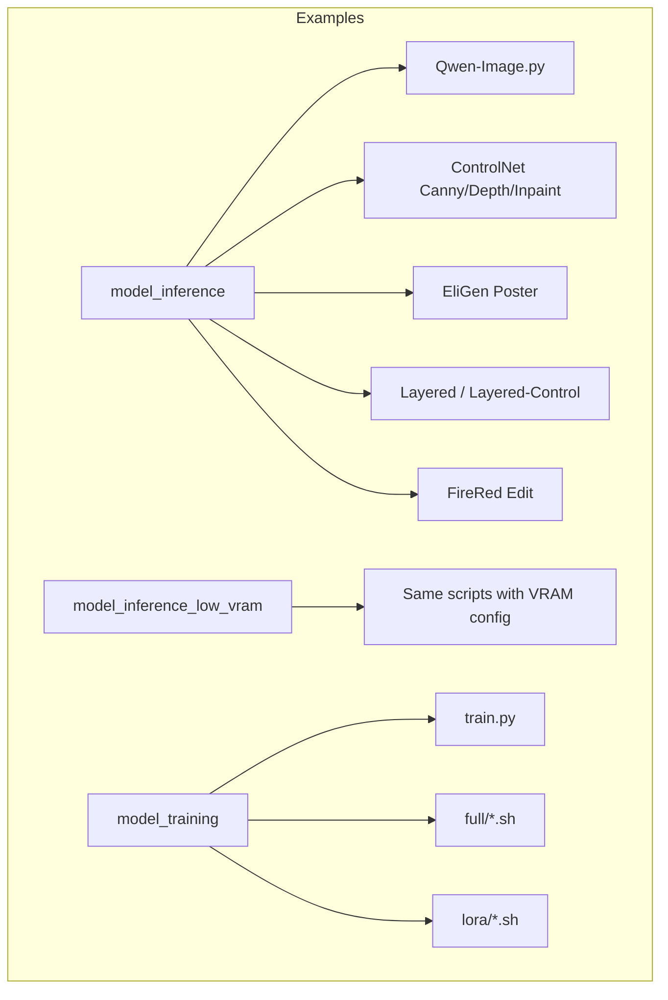
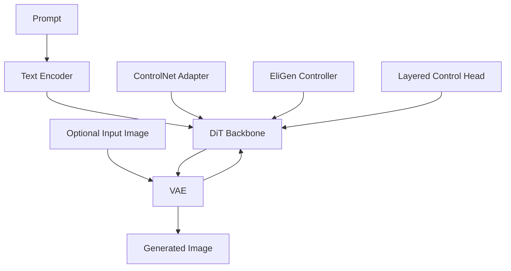
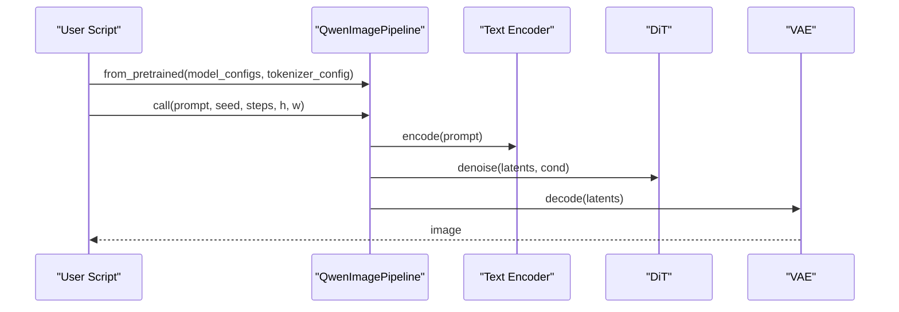
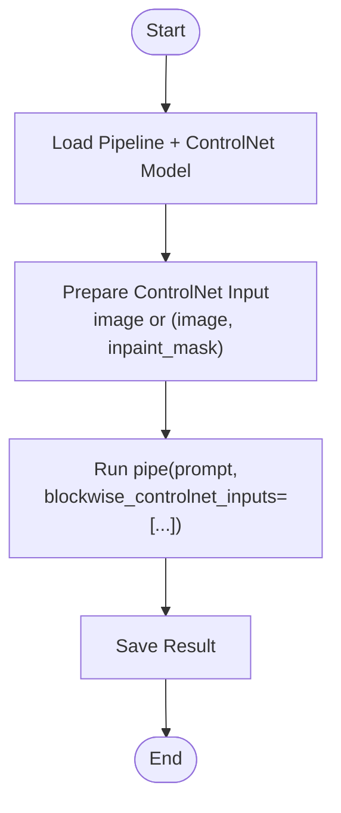
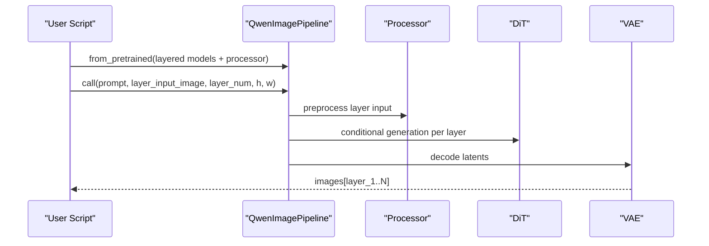
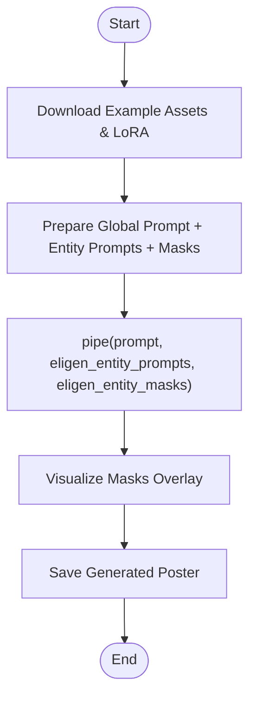
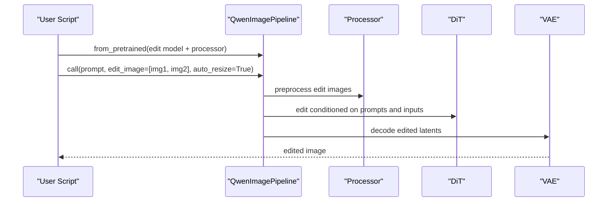
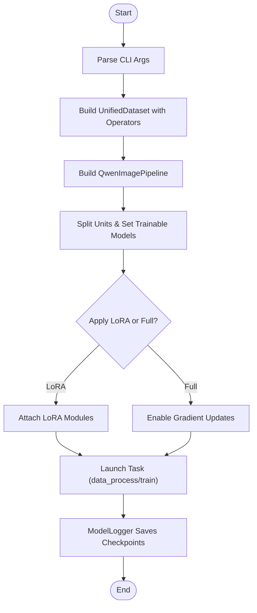
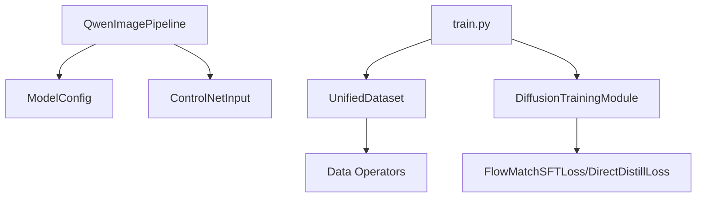

# Qwen-Image Model Examples

<cite>
**Referenced Files in This Document**
- [Qwen-Image.md](file://docs/en/Model_Details/Qwen-Image.md)
- [Qwen-Image.py](file://examples/qwen_image/model_inference/Qwen-Image.py)
- [Qwen-Image-EliGen-Poster.py](file://examples/qwen_image/model_inference/Qwen-Image-EliGen-Poster.py)
- [Qwen-Image-Layered-Control.py](file://examples/qwen_image/model_inference/Qwen-Image-Layered-Control.py)
- [Qwen-Image-Layered.py](file://examples/qwen_image/model_inference/Qwen-Image-Layered.py)
- [FireRed-Image-Edit-1.0.py](file://examples/qwen_image/model_inference/FireRed-Image-Edit-1.0.py)
- [Qwen-Image-Blockwise-ControlNet-Canny.py](file://examples/qwen_image/model_inference/Qwen-Image-Blockwise-ControlNet-Canny.py)
- [Qwen-Image-Blockwise-ControlNet-Depth.py](file://examples/qwen_image/model_inference/Qwen-Image-Blockwise-ControlNet-Depth.py)
- [Qwen-Image-Blockwise-ControlNet-Inpaint.py](file://examples/qwen_image/model_inference/Qwen-Image-Blockwise-ControlNet-Inpaint.py)
- [train.py](file://examples/qwen_image/model_training/train.py)
- [Qwen-Image.sh (full)](file://examples/qwen_image/model_training/full/Qwen-Image.sh)
- [Qwen-Image.sh (LoRA)](file://examples/qwen_image/model_training/lora/Qwen-Image.sh)
</cite>

## Table of Contents
1. Introduction
2. Project Structure
3. Core Components
4. Architecture Overview
5. Detailed Component Analysis
6. Dependency Analysis
7. Performance Considerations
8. Troubleshooting Guide
9. Conclusion

## Introduction
This document provides comprehensive, practical examples for the Qwen-Image model family within DiffSynth-Studio. It covers:
- Basic image generation and inference
- Editing workflows with ControlNet (Canny, Depth, Inpaint)
- Layered Control features and layered generation
- EliGen poster creation with region-wise prompts and masks
- FireRed image editing tools for multi-image editing
- LoRA training and full fine-tuning scripts
- Specialized tasks such as image enhancement, repair, and style transfer
- Dataset preparation, configuration management, and performance optimization across hardware setups

The content is grounded in the repository’s official documentation and example scripts to ensure accuracy and reproducibility.

## Project Structure
The Qwen-Image examples are organized under examples/qwen_image with clear separation between inference and training:
- model_inference: Ready-to-run Python scripts demonstrating various capabilities (text-to-image, editing, ControlNet, EliGen, Layered, FireRed).
- model_inference_low_vram: Low VRAM variants of the same scripts using VRAM management configurations.
- model_training: Unified training entry point and per-model shell scripts for full fine-tuning and LoRA training.
- configs: YAML files for dataset-specific or task-specific configurations used by training pipelines.

[No sources needed since this diagram shows conceptual workflow, not actual code structure]

## Core Components
- QwenImagePipeline: The central pipeline for loading models, tokenizers, processors, and running inference/training. Supports text-to-image, image editing, inpainting, ControlNet, EliGen, and layered control via specific parameters.
- ModelConfig: Declares model IDs and file patterns for transformer/text encoder/vae/tokenizer/processor components. Enables flexible remote/local loading.
- ControlNetInput: Encodes blockwise ControlNet inputs (e.g., edge maps, depth maps, inpaint masks) for precise spatial control.
- TrainingModule: Unified training entry that constructs the pipeline, sets trainable units, applies LoRA or full fine-tuning, and manages data operators and loss functions.

Key usage patterns:
- Text-to-image: Provide prompt, optional negative_prompt, cfg_scale, seed, steps, and resolution.
- Image editing: Provide edit_image list and optional auto-resize; supports multiple images.
- Inpainting: Provide input_image and inpaint_mask; optionally tune blur parameters.
- ControlNet: Provide blockwise_controlnet_inputs with ControlNetInput(image=..., inpaint_mask=...).
- EliGen: Provide eligen_entity_prompts and eligen_entity_masks for region-wise control.
- Layered Control: Provide layer_input_image and layer_num to generate per-layer outputs.

**Section sources**
- [Qwen-Image.md:118-151](file://docs/en/Model_Details/Qwen-Image.md#L118-L151)
- [train.py:9-56](file://examples/qwen_image/model_training/train.py#L9-L56)

## Architecture Overview
The Qwen-Image system composes several components orchestrated by the pipeline:
- Text Encoder: Converts prompts into embeddings.
- DiT (Diffusion Transformer): Core generative backbone.
- VAE: Encodes/decodes latent space.
- Optional modules: ControlNet adapters, EliGen partition controller, Layered Control heads, and processors for editing.

[No sources needed since this diagram shows conceptual architecture, not direct code mapping]

## Detailed Component Analysis

### Basic Image Generation
- Purpose: Generate images from text prompts with high fidelity.
- Key parameters: prompt, negative_prompt, cfg_scale, num_inference_steps, height, width, seed.
- Example script demonstrates minimal setup and saving output.

**Diagram sources**
- [Qwen-Image.py:1-18](file://examples/qwen_image/model_inference/Qwen-Image.py#L1-L18)

**Section sources**
- [Qwen-Image.py:1-18](file://examples/qwen_image/model_inference/Qwen-Image.py#L1-L18)
- [Qwen-Image.md:118-151](file://docs/en/Model_Details/Qwen-Image.md#L118-L151)

### ControlNet Workflows (Canny, Depth, Inpaint)
- Purpose: Spatially guide generation using edge maps, depth maps, or inpaint masks.
- Inputs: ControlNetInput(image=..., inpaint_mask=...) passed via blockwise_controlnet_inputs.
- Variants:
  - Canny: Edge-based control.
  - Depth: Depth-aware composition.
  - Inpaint: Region-aware editing with mask guidance.

**Diagram sources**
- [Qwen-Image-Blockwise-ControlNet-Canny.py:1-32](file://examples/qwen_image/model_inference/Qwen-Image-Blockwise-ControlNet-Canny.py#L1-L32)
- [Qwen-Image-Blockwise-ControlNet-Depth.py:1-33](file://examples/qwen_image/model_inference/Qwen-Image-Blockwise-ControlNet-Depth.py#L1-L33)
- [Qwen-Image-Blockwise-ControlNet-Inpaint.py:1-34](file://examples/qwen_image/model_inference/Qwen-Image-Blockwise-ControlNet-Inpaint.py#L1-L34)

**Section sources**
- [Qwen-Image-Blockwise-ControlNet-Canny.py:1-32](file://examples/qwen_image/model_inference/Qwen-Image-Blockwise-ControlNet-Canny.py#L1-L32)
- [Qwen-Image-Blockwise-ControlNet-Depth.py:1-33](file://examples/qwen_image/model_inference/Qwen-Image-Blockwise-ControlNet-Depth.py#L1-L33)
- [Qwen-Image-Blockwise-ControlNet-Inpaint.py:1-34](file://examples/qwen_image/model_inference/Qwen-Image-Blockwise-ControlNet-Inpaint.py#L1-L34)

### Layered Control and Layered Generation
- Purpose: Generate images with explicit layer-wise control or produce multiple layers from a single RGBA input.
- Parameters: layer_input_image (RGBA), layer_num to target a specific layer; returns a sequence of images.
- Use cases: Compositing, background/foreground separation, stylization per layer.

**Diagram sources**
- [Qwen-Image-Layered.py:1-37](file://examples/qwen_image/model_inference/Qwen-Image-Layered.py#L1-L37)
- [Qwen-Image-Layered-Control.py:1-35](file://examples/qwen_image/model_inference/Qwen-Image-Layered-Control.py#L1-L35)

**Section sources**
- [Qwen-Image-Layered.py:1-37](file://examples/qwen_image/model_inference/Qwen-Image-Layered.py#L1-L37)
- [Qwen-Image-Layered-Control.py:1-35](file://examples/qwen_image/model_inference/Qwen-Image-Layered-Control.py#L1-L35)

### EliGen Poster Creation
- Purpose: Partition-controlled generation where each region has its own prompt and mask.
- Inputs: global_prompt, eligen_entity_prompts (list), eligen_entity_masks (list of masks).
- Workflow: Download example assets, load base model, apply EliGen LoRA, run generation, visualize masks.

**Diagram sources**
- [Qwen-Image-EliGen-Poster.py:1-115](file://examples/qwen_image/model_inference/Qwen-Image-EliGen-Poster.py#L1-L115)

**Section sources**
- [Qwen-Image-EliGen-Poster.py:1-115](file://examples/qwen_image/model_inference/Qwen-Image-EliGen-Poster.py#L1-L115)

### FireRed Image Editing Tools
- Purpose: Multi-image editing model supporting composition and transformation across multiple inputs.
- Inputs: edit_image (list of PIL Images); supports automatic resizing.
- Notes: Always pass a list even for single image; do not pass raw image directly without wrapping in list.

**Diagram sources**
- [FireRed-Image-Edit-1.0.py:1-44](file://examples/qwen_image/model_inference/FireRed-Image-Edit-1.0.py#L1-L44)

**Section sources**
- [FireRed-Image-Edit-1.0.py:1-44](file://examples/qwen_image/model_inference/FireRed-Image-Edit-1.0.py#L1-L44)

### LoRA Training and Full Fine-Tuning
- Unified training entry: train.py builds the pipeline, selects trainable units, applies LoRA or full updates, and runs data processing/training tasks.
- Full fine-tuning: Shell scripts configure dataset paths, model IDs, learning rate, epochs, gradient checkpointing, and output directories.
- LoRA training: Specify lora_base_model, lora_target_modules, lora_rank, and optional preset LoRA for differential training.

**Diagram sources**
- [train.py:9-56](file://examples/qwen_image/model_training/train.py#L9-L56)
- [train.py:97-175](file://examples/qwen_image/model_training/train.py#L97-L175)

**Section sources**
- [train.py:9-56](file://examples/qwen_image/model_training/train.py#L9-L56)
- [train.py:97-175](file://examples/qwen_image/model_training/train.py#L97-L175)
- [Qwen-Image.sh (full):1-16](file://examples/qwen_image/model_training/full/Qwen-Image.sh#L1-L16)
- [Qwen-Image.sh (LoRA):1-19](file://examples/qwen_image/model_training/lora/Qwen-Image.sh#L1-L19)

## Dependency Analysis
- Pipeline dependencies:
  - QwenImagePipeline depends on ModelConfig for component discovery and loading.
  - ControlNetInput encapsulates spatial control signals for blockwise ControlNet adapters.
- Training dependencies:
  - UnifiedDataset orchestrates image operators and metadata parsing.
  - DiffusionTrainingModule provides common training utilities and loss selection.
- External integrations:
  - ModelScope for downloading datasets and model snapshots.
  - Accelerate for distributed training orchestration.

**Diagram sources**
- [Qwen-Image.py:1-18](file://examples/qwen_image/model_inference/Qwen-Image.py#L1-L18)
- [train.py:9-56](file://examples/qwen_image/model_training/train.py#L9-L56)

**Section sources**
- [Qwen-Image.md:118-151](file://docs/en/Model_Details/Qwen-Image.md#L118-L151)
- [train.py:9-56](file://examples/qwen_image/model_training/train.py#L9-L56)

## Performance Considerations
- VRAM Management:
  - Enable VRAM management for low-memory environments; use recommended low VRAM configurations provided in example scripts.
  - Tiled VAE decoding can reduce VRAM at the cost of slight quality/time trade-offs.
- Precision:
  - Use bfloat16 for computation; FP8 precision is supported for non-trainable models during training.
- Distributed Training:
  - DeepSpeed ZeRO Stage 3 supported; initialize models on CPU when required.
- Data Pipeline:
  - Tune dataset_num_workers and gradient_accumulation_steps to balance throughput and memory.
- Resolution and Steps:
  - Adjust height/width multiples of 16; reduce num_inference_steps for faster inference when acceptable.

[No sources needed since this section provides general guidance]

## Troubleshooting Guide
- Insufficient VRAM:
  - Enable VRAM management and tiled VAE decoding; verify offload/onload dtype/device settings.
- Shape Mismatch:
  - Ensure height/width are multiples of 16; confirm input image sizes match expected dimensions.
- ControlNet Inputs:
  - Verify ControlNetInput contains correct fields (image, inpaint_mask) and matches resolution.
- EliGen Masks:
  - Confirm masks align with entity prompts and have consistent size with generated images.
- Training Errors:
  - Check find_unused_parameters for models with redundant parameters; validate dataset metadata paths and keys.

**Section sources**
- [Qwen-Image.md:118-151](file://docs/en/Model_Details/Qwen-Image.md#L118-L151)
- [train.py:97-175](file://examples/qwen_image/model_training/train.py#L97-L175)

## Conclusion
The Qwen-Image ecosystem in DiffSynth-Studio offers a robust set of tools for image understanding, editing, and super-resolution-like enhancements through specialized pipelines and training scripts. By leveraging ControlNet, EliGen, Layered Control, and FireRed editing capabilities, users can achieve precise, controllable generation and editing. The unified training framework simplifies both full fine-tuning and LoRA adaptation, while VRAM management and distributed training options enable deployment across diverse hardware configurations.

[No sources needed since this section summarizes without analyzing specific files]