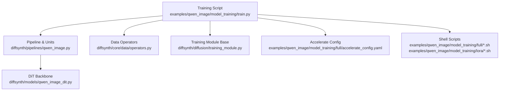
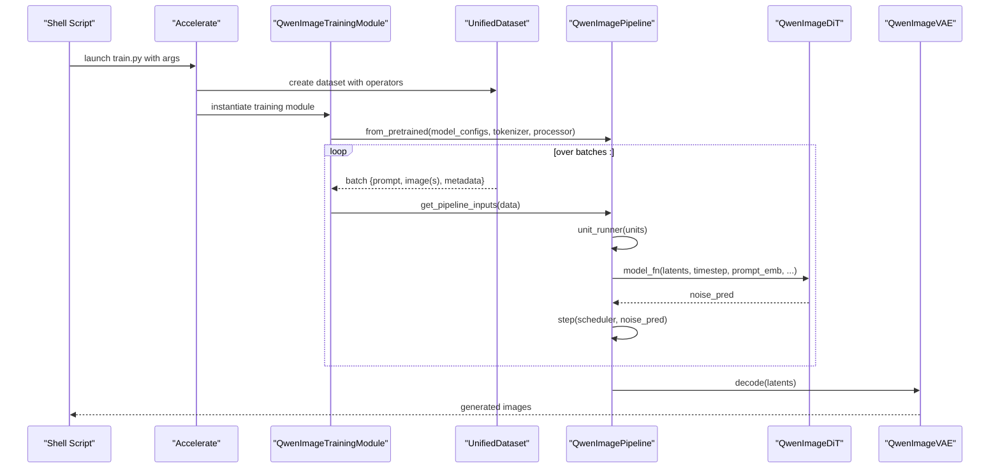
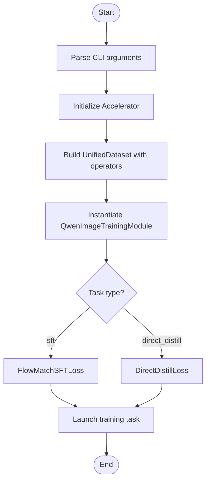
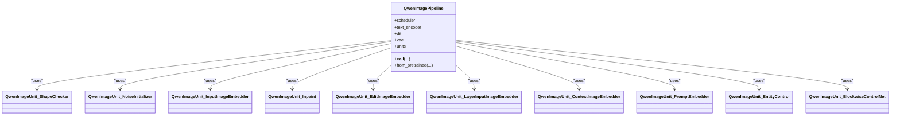
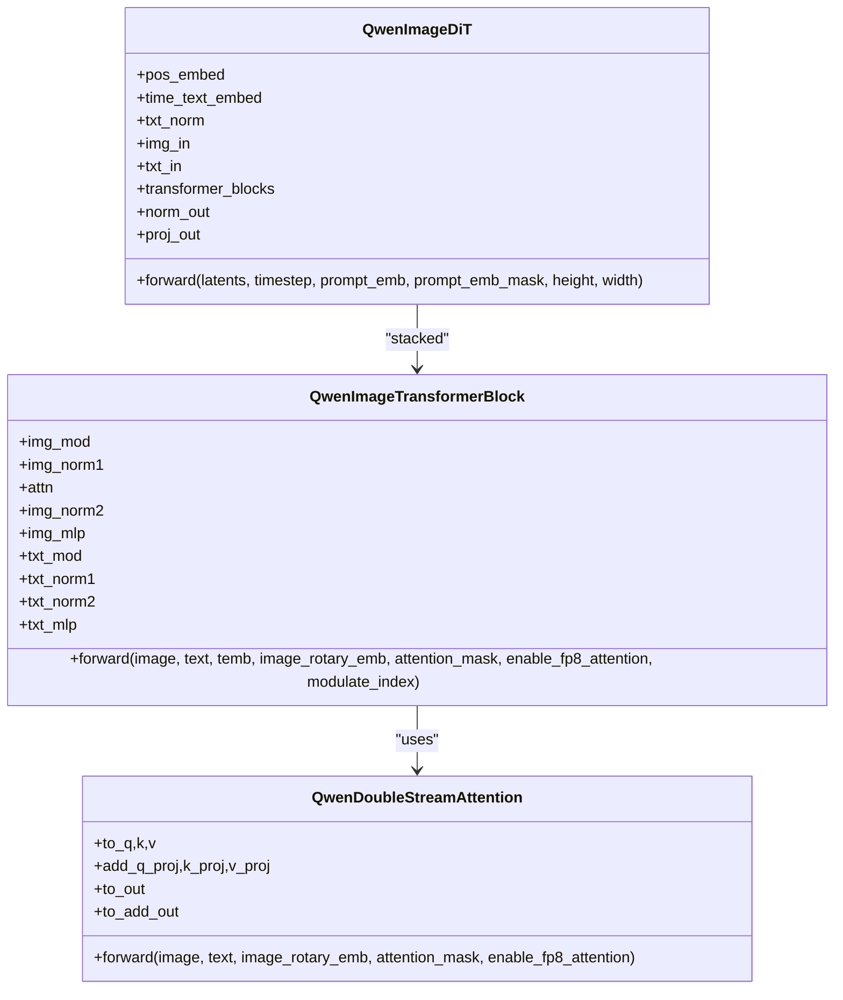
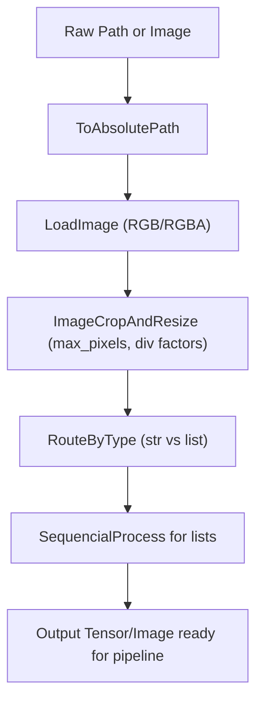
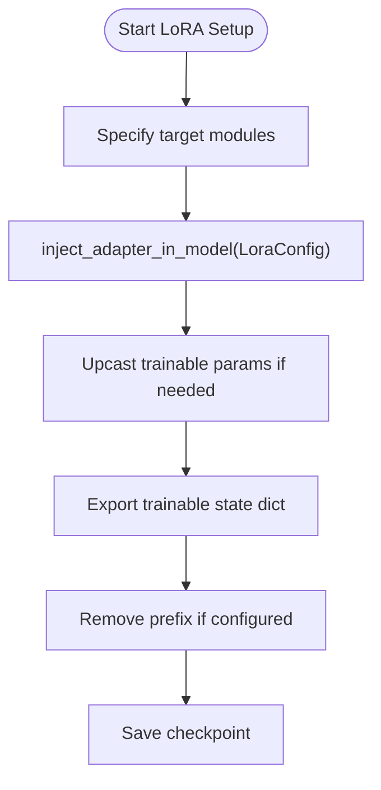
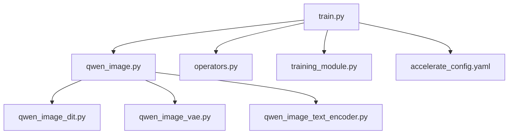

# Training and Fine-tuning

<cite>
**Referenced Files in This Document**
- [train.py](file://examples/qwen_image/model_training/train.py)
- [Qwen-Image.sh (full)](file://examples/qwen_image/model_training/full/Qwen-Image.sh)
- [Qwen-Image.sh (lora)](file://examples/qwen_image/model_training/lora/Qwen-Image.sh)
- [accelerate_config.yaml](file://examples/qwen_image/model_training/full/accelerate_config.yaml)
- [qwen_image.py](file://diffsynth/pipelines/qwen_image.py)
- [qwen_image_dit.py](file://diffsynth/models/qwen_image_dit.py)
- [operators.py](file://diffsynth/core/data/operators.py)
- [training_module.py](file://diffsynth/diffusion/training_module.py)
</cite>

## Table of Contents
1. [Introduction](#introduction)
2. [Project Structure](#project-structure)
3. [Core Components](#core-components)
4. [Architecture Overview](#architecture-overview)
5. [Detailed Component Analysis](#detailed-component-analysis)
6. [Dependency Analysis](#dependency-analysis)
7. [Performance Considerations](#performance-considerations)
8. [Troubleshooting Guide](#troubleshooting-guide)
9. [Conclusion](#conclusion)
10. [Appendices](#appendices)

## Introduction
This document provides comprehensive training and fine-tuning guidance for Qwen-Image models, covering full fine-tuning and LoRA-based training, dataset preparation, configuration management, distributed training setup, performance optimization, checkpointing, evaluation, and monitoring across hardware configurations. It is designed to be accessible to users with varying technical backgrounds while remaining precise and actionable.

## Project Structure
The Qwen-Image training workflow centers around a unified training script, pipeline abstractions, model components, data operators, and Accelerate configuration files. The key directories and files include:
- Training entrypoint and module definition: examples/qwen_image/model_training/train.py
- Example shell scripts for full and LoRA training: examples/qwen_image/model_training/full/*.sh, examples/qwen_image/model_training/lora/*.sh
- Accelerate distributed config: examples/qwen_image/model_training/full/accelerate_config.yaml
- Pipeline orchestration and units: diffsynth/pipelines/qwen_image.py
- DiT backbone and attention modules: diffsynth/models/qwen_image_dit.py
- Data processing operators: diffsynth/core/data/operators.py
- Base training utilities and LoRA injection: diffsynth/diffusion/training_module.py

**Diagram sources**
- [train.py:1-175](file://examples/qwen_image/model_training/train.py#L1-L175)
- [qwen_image.py:1-200](file://diffsynth/pipelines/qwen_image.py#L1-L200)
- [qwen_image_dit.py:1-120](file://diffsynth/models/qwen_image_dit.py#L1-L120)
- [operators.py:1-120](file://diffsynth/core/data/operators.py#L1-L120)
- [training_module.py:1-120](file://diffsynth/diffusion/training_module.py#L1-L120)
- [accelerate_config.yaml:1-23](file://examples/qwen_image/model_training/full/accelerate_config.yaml#L1-L23)
- [Qwen-Image.sh (full):1-16](file://examples/qwen_image/model_training/full/Qwen-Image.sh#L1-L16)
- [Qwen-Image.sh (lora):1-19](file://examples/qwen_image/model_training/lora/Qwen-Image.sh#L1-L19)

**Section sources**
- [train.py:1-175](file://examples/qwen_image/model_training/train.py#L1-L175)
- [qwen_image.py:1-200](file://diffsynth/pipelines/qwen_image.py#L1-L200)
- [qwen_image_dit.py:1-120](file://diffsynth/models/qwen_image_dit.py#L1-L120)
- [operators.py:1-120](file://diffsynth/core/data/operators.py#L1-L120)
- [training_module.py:1-120](file://diffsynth/diffusion/training_module.py#L1-L120)
- [accelerate_config.yaml:1-23](file://examples/qwen_image/model_training/full/accelerate_config.yaml#L1-L23)
- [Qwen-Image.sh (full):1-16](file://examples/qwen_image/model_training/full/Qwen-Image.sh#L1-L16)
- [Qwen-Image.sh (lora):1-19](file://examples/qwen_image/model_training/lora/Qwen-Image.sh#L1-L19)

## Core Components
- UnifiedDataset and data operators: Provide flexible image loading, resizing, cropping, and routing based on types. They support both single images and lists for multi-image inputs.
- QwenImagePipeline: Orchestrates preprocessing units (shape checks, noise initialization, input image embedding, inpaint mask handling, prompt embedding, entity control, blockwise ControlNet), scheduler-driven denoising loop, and VAE decoding.
- QwenImageTrainingModule: Wraps the pipeline for training, selects loss functions by task, handles gradient checkpointing, extra inputs parsing, and device/dtype transfers.
- DiffusionTrainingModule: Provides shared utilities for LoRA injection, state dict export, VRAM configuration parsing, and parameter name filtering.
- QwenImageDiT: Implements the transformer blocks, attention mechanisms, RoPE embeddings, and forward pass for latent denoising.

Key responsibilities:
- Dataset preparation and augmentation via operators
- Model loading and VRAM-aware configuration
- Task-specific loss selection (SFT vs direct distillation)
- Distributed training via Accelerate
- Checkpoint saving and prefix removal

**Section sources**
- [train.py:1-175](file://examples/qwen_image/model_training/train.py#L1-L175)
- [qwen_image.py:1-200](file://diffsynth/pipelines/qwen_image.py#L1-L200)
- [qwen_image_dit.py:1-120](file://diffsynth/models/qwen_image_dit.py#L1-L120)
- [operators.py:1-120](file://diffsynth/core/data/operators.py#L1-L120)
- [training_module.py:1-120](file://diffsynth/diffusion/training_module.py#L1-L120)

## Architecture Overview
The training architecture composes a pipeline of modular units that transform raw inputs into model-ready tensors, followed by a diffusion denoising loop driven by a FlowMatchScheduler. The DiT backbone processes concatenated text and image tokens with rotary position embeddings and optional blockwise ControlNet conditioning.

**Diagram sources**
- [train.py:97-175](file://examples/qwen_image/model_training/train.py#L97-L175)
- [qwen_image.py:100-198](file://diffsynth/pipelines/qwen_image.py#L100-L198)
- [qwen_image_dit.py:696-729](file://diffsynth/models/qwen_image_dit.py#L696-L729)

## Detailed Component Analysis

### Training Entry and Configuration
- The training script defines a custom training module subclassing the base DiffusionTrainingModule, sets up the pipeline with tokenizer and processor, and wires task-specific losses.
- Arguments include dataset paths, max pixels, repeat factor, model IDs with origin file patterns, learning rate, epochs, output path, trainable models, LoRA settings, gradient checkpointing flags, and special parameters like zero_cond_t.
- Accelerate is configured via YAML for deepspeed zero stages and mixed precision.

**Diagram sources**
- [train.py:97-175](file://examples/qwen_image/model_training/train.py#L97-L175)

**Section sources**
- [train.py:1-175](file://examples/qwen_image/model_training/train.py#L1-L175)
- [Qwen-Image.sh (full):1-16](file://examples/qwen_image/model_training/full/Qwen-Image.sh#L1-L16)
- [Qwen-Image.sh (lora):1-19](file://examples/qwen_image/model_training/lora/Qwen-Image.sh#L1-L19)
- [accelerate_config.yaml:1-23](file://examples/qwen_image/model_training/full/accelerate_config.yaml#L1-L23)

### Pipeline and Units
- The pipeline composes multiple units: shape checker, noise initializer, input image embedder, inpaint handler, edit image embedder, layer input embedder, context image embedder, prompt embedder, entity control, and blockwise ControlNet.
- Each unit encapsulates specific preprocessing logic and may load required submodels on demand.
- The denoising loop uses the scheduler’s timesteps and applies CFG-guided model function calls.

**Diagram sources**
- [qwen_image.py:25-198](file://diffsynth/pipelines/qwen_image.py#L25-L198)

**Section sources**
- [qwen_image.py:1-200](file://diffsynth/pipelines/qwen_image.py#L1-L200)

### DiT Backbone and Attention
- The DiT backbone includes time-text embeddings, image/text projections, stacked transformer blocks, and adaptive normalization.
- Double-stream attention jointly attends over text and image tokens with RoPE embeddings. Flash attention is used when available; otherwise, scaled dot-product attention is applied.
- Positional encodings are computed per image shape and text sequence length, with caching for efficiency.

**Diagram sources**
- [qwen_image_dit.py:590-729](file://diffsynth/models/qwen_image_dit.py#L590-L729)
- [qwen_image_dit.py:362-432](file://diffsynth/models/qwen_image_dit.py#L362-L432)

**Section sources**
- [qwen_image_dit.py:1-120](file://diffsynth/models/qwen_image_dit.py#L1-L120)
- [qwen_image_dit.py:362-432](file://diffsynth/models/qwen_image_dit.py#L362-L432)
- [qwen_image_dit.py:590-729](file://diffsynth/models/qwen_image_dit.py#L590-L729)

### Data Operators and Dataset Preparation
- Operators provide a composable pipeline for loading images, converting color spaces, cropping, resizing, and sampling frames for videos.
- UnifiedDataset supports main and special operators mapped by field names, enabling multi-image inputs and conditional routing.
- For Qwen-Image, typical operators include ToAbsolutePath, LoadImage, ImageCropAndResize, and SequencialProcess for list handling.

**Diagram sources**
- [operators.py:57-103](file://diffsynth/core/data/operators.py#L57-L103)
- [train.py:115-140](file://examples/qwen_image/model_training/train.py#L115-L140)

**Section sources**
- [operators.py:1-120](file://diffsynth/core/data/operators.py#L1-L120)
- [train.py:115-140](file://examples/qwen_image/model_training/train.py#L115-L140)

### LoRA Training Setup
- LoRA targets can be specified explicitly or auto-detected. The training module injects adapters using PEFT’s LoraConfig and manages dtype casting for trainable parameters.
- State dict export filters only trainable parameters and optionally removes prefixes for cleaner checkpoints.

**Diagram sources**
- [training_module.py:52-88](file://diffsynth/diffusion/training_module.py#L52-L88)
- [Qwen-Image.sh (lora):1-19](file://examples/qwen_image/model_training/lora/Qwen-Image.sh#L1-L19)

**Section sources**
- [training_module.py:52-88](file://diffsynth/diffusion/training_module.py#L52-L88)
- [Qwen-Image.sh (lora):1-19](file://examples/qwen_image/model_training/lora/Qwen-Image.sh#L1-L19)

### Validation and Evaluation
- Validation scripts exist under validate_full and validate_lora directories for each model variant. These typically load trained checkpoints and run inference pipelines to produce outputs and metrics.
- Metrics computation and logging are handled by separate tools and scripts within the repository.

[No sources needed since this section summarizes validation structure without analyzing specific files]

## Dependency Analysis
The training flow depends on several core modules:
- Training script orchestrates dataset creation, model instantiation, and launcher selection.
- Pipeline units depend on tokenizer, processor, text encoder, VAE, and DiT.
- DiT relies on attention implementations and positional encoding modules.
- Data operators are independent but consumed by UnifiedDataset.

**Diagram sources**
- [train.py:1-175](file://examples/qwen_image/model_training/train.py#L1-L175)
- [qwen_image.py:1-200](file://diffsynth/pipelines/qwen_image.py#L1-L200)
- [qwen_image_dit.py:1-120](file://diffsynth/models/qwen_image_dit.py#L1-L120)
- [operators.py:1-120](file://diffsynth/core/data/operators.py#L1-L120)
- [training_module.py:1-120](file://diffsynth/diffusion/training_module.py#L1-L120)
- [accelerate_config.yaml:1-23](file://examples/qwen_image/model_training/full/accelerate_config.yaml#L1-L23)

**Section sources**
- [train.py:1-175](file://examples/qwen_image/model_training/train.py#L1-L175)
- [qwen_image.py:1-200](file://diffsynth/pipelines/qwen_image.py#L1-L200)
- [qwen_image_dit.py:1-120](file://diffsynth/models/qwen_image_dit.py#L1-L120)
- [operators.py:1-120](file://diffsynth/core/data/operators.py#L1-L120)
- [training_module.py:1-120](file://diffsynth/diffusion/training_module.py#L1-L120)
- [accelerate_config.yaml:1-23](file://examples/qwen_image/model_training/full/accelerate_config.yaml#L1-L23)

## Performance Considerations
- Gradient checkpointing reduces memory usage during backpropagation at the cost of compute overhead.
- Mixed precision (bf16) accelerates training on compatible hardware.
- Flash attention improves throughput when available; otherwise, standard attention is used.
- VRAM management options include offloading to disk or FP8 precision modes parsed from configuration.
- Tiled encoding/decoding helps handle large images within memory constraints.

[No sources needed since this section provides general guidance]

## Troubleshooting Guide
Common issues and resolutions:
- Prompt length warnings: The text encoder was trained on limited token lengths; long prompts may cause unpredictable behavior.
- Device/dtype mismatches: Ensure tensors are transferred to the correct device and dtype before model calls.
- Unused parameters in DDP: Enable find_unused_parameters flag when necessary.
- LoRA target modules: Verify target modules match actual submodule names; use auto-detection if unsure.
- Accelerate configuration: Validate num_processes, zero stage, and mixed precision settings.

**Section sources**
- [qwen_image.py:386-396](file://diffsynth/pipelines/qwen_image.py#L386-L396)
- [training_module.py:90-109](file://diffsynth/diffusion/training_module.py#L90-L109)
- [train.py:111-114](file://examples/qwen_image/model_training/train.py#L111-L114)

## Conclusion
The Qwen-Image training framework offers a modular, extensible approach to full fine-tuning and LoRA-based adaptation. By leveraging unified datasets, pipeline units, and robust DiT backbones, users can efficiently prepare data, configure training, manage VRAM, and monitor progress across diverse hardware setups. The provided scripts and configurations serve as practical templates for scaling experiments and deploying customized models.

[No sources needed since this section summarizes without analyzing specific files]

## Appendices

### Dataset Preparation Checklist
- Organize images and metadata.csv under a base path.
- Define main_data_operator for common transformations (resize, crop).
- Map special_operator_map for additional fields (e.g., layer_input_image, context_image).
- Ensure consistent height/width division factors aligned with model requirements.

**Section sources**
- [train.py:115-140](file://examples/qwen_image/model_training/train.py#L115-L140)
- [operators.py:57-103](file://diffsynth/core/data/operators.py#L57-L103)

### Hyperparameter Tuning Guidelines
- Learning rate: Start with 1e-5 for full fine-tuning and 1e-4 for LoRA.
- Epochs: Begin with small values (2–5) and monitor loss curves.
- Gradient accumulation: Adjust based on GPU memory and desired effective batch size.
- Max pixels: Balance resolution and memory; ensure divisibility by 16.

**Section sources**
- [Qwen-Image.sh (full):1-16](file://examples/qwen_image/model_training/full/Qwen-Image.sh#L1-L16)
- [Qwen-Image.sh (lora):1-19](file://examples/qwen_image/model_training/lora/Qwen-Image.sh#L1-L19)

### Monitoring Training Progress
- Use Accelerate logs and built-in logging utilities to track loss, steps, and memory usage.
- Inspect saved checkpoints periodically to assess convergence.
- Validate outputs using provided validation scripts to measure qualitative and quantitative improvements.

[No sources needed since this section provides general guidance]