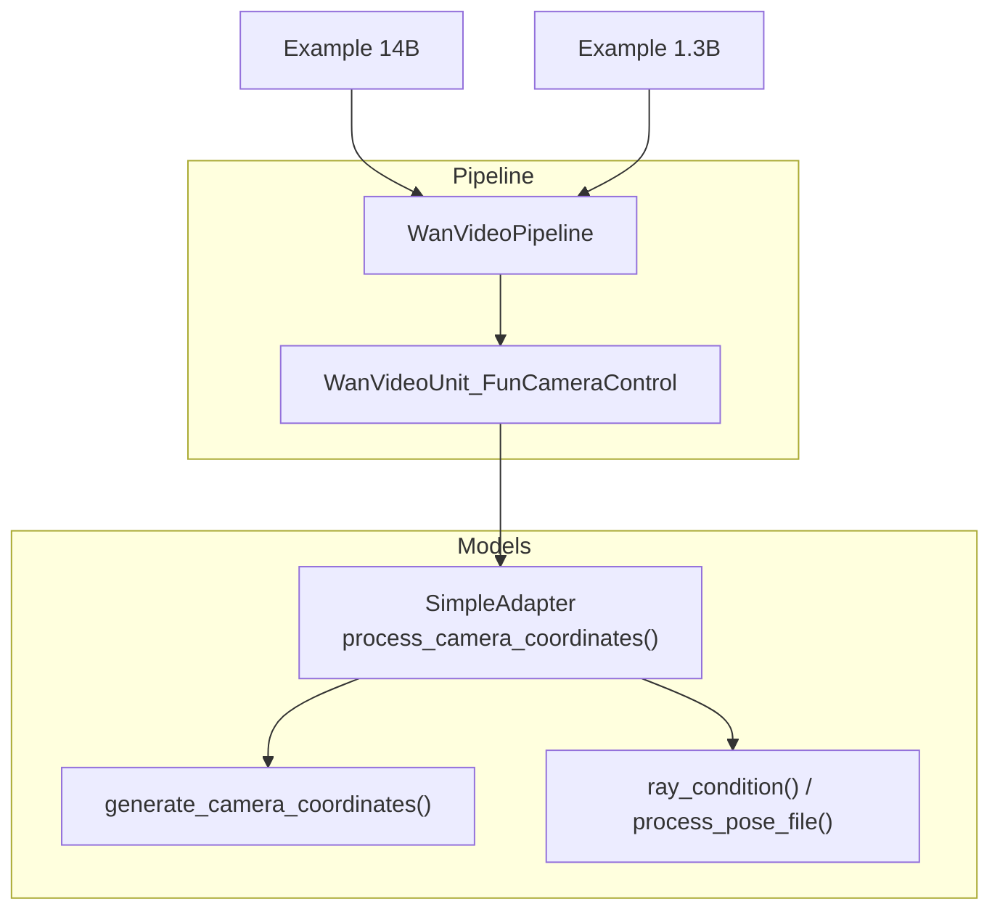
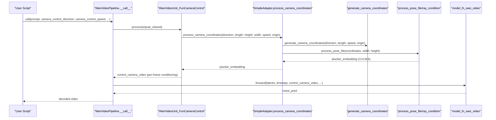
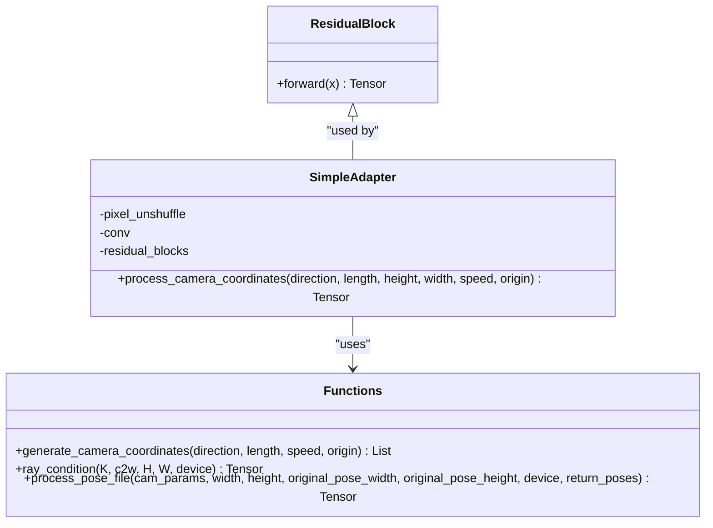
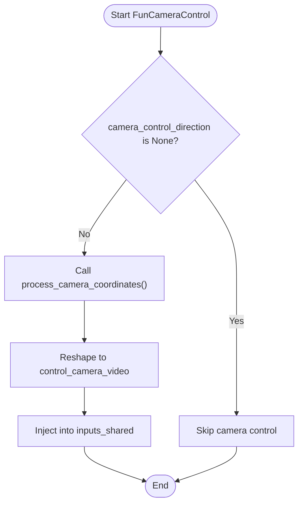
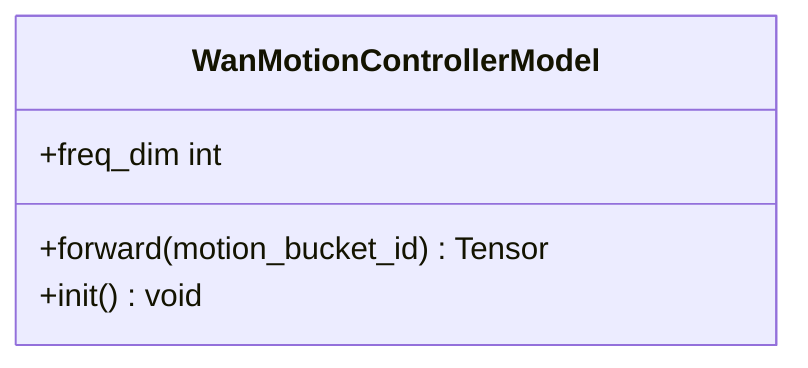
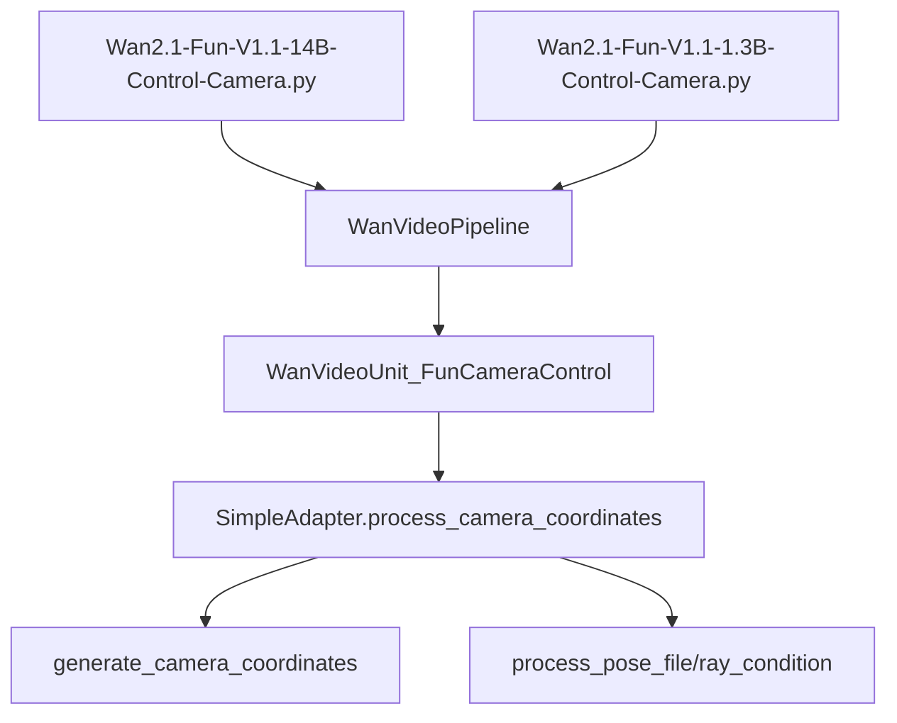

# Camera Control System

<cite>
**Referenced Files in This Document**
- [wan_video_camera_controller.py](file://diffsynth/models/wan_video_camera_controller.py)
- [wan_video_motion_controller.py](file://diffsynth/models/wan_video_motion_controller.py)
- [wan_video.py](file://diffsynth/pipelines/wan_video.py)
- [Wan2.1-Fun-V1.1-14B-Control-Camera.py](file://examples/wanvideo/model_inference/Wan2.1-Fun-V1.1-14B-Control-Camera.py)
- [Wan2.1-Fun-V1.1-1.3B-Control-Camera.py](file://examples/wanvideo/model_inference/Wan2.1-Fun-V1.1-1.3B-Control-Camera.py)
</cite>

## Table of Contents
1. Introduction
2. Project Structure
3. Core Components
4. Architecture Overview
5. Detailed Component Analysis
6. Dependency Analysis
7. Performance Considerations
8. Troubleshooting Guide
9. Conclusion

## Introduction
This document explains the WanVideo camera control system that enables cinematic camera movements during video generation. It covers supported camera motions, parameter configuration, intensity controls, temporal consistency mechanisms, and practical examples for programming complex camera choreography. It also documents the camera controller API exposed by the pipeline, parameter validation rules, and performance optimization techniques for smooth transitions.

## Project Structure
The camera control feature is implemented as a dedicated module integrated into the WanVideo pipeline:
- Camera motion primitives and Plücker embedding generation are defined in the camera controller module.
- The pipeline exposes high-level parameters to enable camera control and integrates it via a processing unit.
- Example scripts demonstrate how to invoke camera control with different directions and speeds.

**Diagram sources**
- [wan_video.py:213-215](file://diffsynth/pipelines/wan_video.py#L213-L215)
- [wan_video.py:586-598](file://diffsynth/pipelines/wan_video.py#L586-L598)
- [wan_video_camera_controller.py:46-59](file://diffsynth/models/wan_video_camera_controller.py#L46-L59)
- [wan_video_camera_controller.py:184-206](file://diffsynth/models/wan_video_camera_controller.py#L184-L206)
- [wan_video_camera_controller.py:114-180](file://diffsynth/models/wan_video_camera_controller.py#L114-L180)
- [Wan2.1-Fun-V1.1-14B-Control-Camera.py:28-44](file://examples/wanvideo/model_inference/Wan2.1-Fun-V1.1-14B-Control-Camera.py#L28-L44)
- [Wan2.1-Fun-V1.1-1.3B-Control-Camera.py:28-44](file://examples/wanvideo/model_inference/Wan2.1-Fun-V1.1-1.3B-Control-Camera.py#L28-L44)

**Section sources**
- [wan_video.py:213-215](file://diffsynth/pipelines/wan_video.py#L213-L215)
- [wan_video.py:586-598](file://diffsynth/pipelines/wan_video.py#L586-L598)
- [wan_video_camera_controller.py:46-59](file://diffsynth/models/wan_video_camera_controller.py#L46-L59)
- [wan_video_camera_controller.py:184-206](file://diffsynth/models/wan_video_camera_controller.py#L184-L206)
- [wan_video_camera_controller.py:114-180](file://diffsynth/models/wan_video_camera_controller.py#L114-L180)
- [Wan2.1-Fun-V1.1-14B-Control-Camera.py:28-44](file://examples/wanvideo/model_inference/Wan2.1-Fun-V1.1-14B-Control-Camera.py#L28-L44)
- [Wan2.1-Fun-V1.1-1.3B-Control-Camera.py:28-44](file://examples/wanvideo/model_inference/Wan2.1-Fun-V1.1-1.3B-Control-Camera.py#L28-L44)

## Core Components
- SimpleAdapter.process_camera_coordinates(): Generates per-frame camera poses based on direction and speed, then converts them to Plücker embeddings suitable for conditioning the diffusion model.
- generate_camera_coordinates(): Builds a sequence of camera pose vectors along specified axes (horizontal, vertical, and depth).
- ray_condition() and process_pose_file(): Compute Plücker embeddings from intrinsic and extrinsic parameters across frames and spatial dimensions.
- WanVideoUnit_FunCameraControl: Pipeline unit that consumes camera_control_direction, camera_control_speed, and camera_control_origin to produce a control tensor injected into the DiT.
- WanMotionControllerModel: Optional motion intensity encoder used elsewhere in the pipeline; not directly part of camera control but relevant for overall motion dynamics.

Supported camera movements:
- Horizontal pan: Left, Right
- Vertical tilt: Up, Down
- Combined pans/tilts: LeftUp, LeftDown, RightUp, RightDown
- Depth movement (dolly): In, Out (supported by generator; see notes below)

Temporal consistency features:
- Plücker embeddings are computed per frame over the full spatial grid, ensuring consistent perspective cues across time.
- Origin-based initialization ensures continuity between frames by starting from a stable reference pose.

Intensity controls:
- camera_control_speed scales the incremental change per frame. Smaller values yield smoother, slower movements; larger values increase motion intensity.

Parameter validation:
- Direction must be one of the allowed literals.
- Speed must be a positive float.
- Origin is a fixed-length tuple defining initial intrinsics/extrinsics; defaults are provided.

Practical usage:
- Set camera_control_direction and camera_control_speed when calling the pipeline. Combine with other controls (e.g., motion bucket id) for richer effects.

**Section sources**
- [wan_video_camera_controller.py:46-59](file://diffsynth/models/wan_video_camera_controller.py#L46-L59)
- [wan_video_camera_controller.py:184-206](file://diffsynth/models/wan_video_camera_controller.py#L184-L206)
- [wan_video_camera_controller.py:114-180](file://diffsynth/models/wan_video_camera_controller.py#L114-L180)
- [wan_video.py:213-215](file://diffsynth/pipelines/wan_video.py#L213-L215)
- [wan_video.py:586-598](file://diffsynth/pipelines/wan_video.py#L586-L598)
- [wan_video_motion_controller.py:7-22](file://diffsynth/models/wan_video_motion_controller.py#L7-L22)

## Architecture Overview
The camera control flow integrates at the preprocessing stage before denoising:
1. User provides camera_control_direction, camera_control_speed, and optional camera_control_origin.
2. The FunCameraControl unit calls the adapter to generate Plücker embeddings for all frames.
3. Embeddings are reshaped and passed into the model function alongside other inputs.
4. During inference, the DiT uses these embeddings to condition motion, producing temporally coherent camera movements.

**Diagram sources**
- [wan_video.py:213-215](file://diffsynth/pipelines/wan_video.py#L213-L215)
- [wan_video.py:586-598](file://diffsynth/pipelines/wan_video.py#L586-L598)
- [wan_video_camera_controller.py:46-59](file://diffsynth/models/wan_video_camera_controller.py#L46-L59)
- [wan_video_camera_controller.py:184-206](file://diffsynth/models/wan_video_camera_controller.py#L184-L206)
- [wan_video_camera_controller.py:114-180](file://diffsynth/models/wan_video_camera_controller.py#L114-L180)

## Detailed Component Analysis

### Camera Controller Module
Responsibilities:
- Generate camera pose sequences for specified directions.
- Convert poses to Plücker embeddings aligned with the target resolution.
- Provide a simple interface for the pipeline to inject camera control signals.

Key functions and classes:
- SimpleAdapter.process_camera_coordinates(): Orchestrates coordinate generation and embedding creation.
- generate_camera_coordinates(): Iteratively updates pose components based on direction tokens.
- ray_condition(): Computes ray directions and origins to form Plücker coordinates.
- process_pose_file(): Adjusts intrinsics for aspect ratio changes and returns final embeddings.

Complexity considerations:
- Per-frame Plücker computation scales linearly with number of frames and spatial resolution.
- PixelUnshuffle and convolutions reduce spatial dimensionality early to manage memory.

Error handling:
- Default origin is applied if None is provided.
- Aspect ratio adjustments ensure correct focal lengths for non-square outputs.

**Diagram sources**
- [wan_video_camera_controller.py:8-44](file://diffsynth/models/wan_video_camera_controller.py#L8-L44)
- [wan_video_camera_controller.py:63-75](file://diffsynth/models/wan_video_camera_controller.py#L63-L75)
- [wan_video_camera_controller.py:184-206](file://diffsynth/models/wan_video_camera_controller.py#L184-L206)
- [wan_video_camera_controller.py:114-180](file://diffsynth/models/wan_video_camera_controller.py#L114-L180)

**Section sources**
- [wan_video_camera_controller.py:8-44](file://diffsynth/models/wan_video_camera_controller.py#L8-L44)
- [wan_video_camera_controller.py:63-75](file://diffsynth/models/wan_video_camera_controller.py#L63-L75)
- [wan_video_camera_controller.py:184-206](file://diffsynth/models/wan_video_camera_controller.py#L184-L206)
- [wan_video_camera_controller.py:114-180](file://diffsynth/models/wan_video_camera_controller.py#L114-L180)

### Pipeline Integration (FunCameraControl)
Responsibilities:
- Validate and consume camera control parameters.
- Generate per-frame control tensors and pass them into the model function.

Behavior:
- If no direction is set, camera control is skipped.
- Otherwise, the adapter produces embeddings sized to match the latent frame count and spatial shape.
- The resulting control tensor is permuted and batched appropriately for the DiT.

Validation and defaults:
- Direction literal enforced by type hints.
- Speed defaults to a small value for subtle motion.
- Origin defaults to a predefined tuple representing a stable initial pose.

**Diagram sources**
- [wan_video.py:586-598](file://diffsynth/pipelines/wan_video.py#L586-L598)

**Section sources**
- [wan_video.py:586-598](file://diffsynth/pipelines/wan_video.py#L586-L598)

### Motion Controller (Contextual)
While not directly part of camera control, the motion controller encodes motion intensity via sinusoidal embeddings and can be combined with camera control for richer dynamics.

**Diagram sources**
- [wan_video_motion_controller.py:7-22](file://diffsynth/models/wan_video_motion_controller.py#L7-L22)

**Section sources**
- [wan_video_motion_controller.py:7-22](file://diffsynth/models/wan_video_motion_controller.py#L7-L22)

### Practical Examples
- 14B example demonstrates Left and Up camera movements with a small speed value.
- 1.3B example mirrors the same usage pattern for a smaller model variant.

Usage patterns:
- Set camera_control_direction to one of the supported literals.
- Tune camera_control_speed to achieve desired intensity.
- Optionally adjust camera_control_origin for custom initial poses.

**Section sources**
- [Wan2.1-Fun-V1.1-14B-Control-Camera.py:28-44](file://examples/wanvideo/model_inference/Wan2.1-Fun-V1.1-14B-Control-Camera.py#L28-L44)
- [Wan2.1-Fun-V1.1-1.3B-Control-Camera.py:28-44](file://examples/wanvideo/model_inference/Wan2.1-Fun-V1.1-1.3B-Control-Camera.py#L28-L44)

## Dependency Analysis
- The pipeline depends on the camera controller module for generating Plücker embeddings.
- The FunCameraControl unit bridges user parameters to the adapter and model function.
- Examples depend on the pipeline’s public API to configure camera control.

**Diagram sources**
- [wan_video.py:213-215](file://diffsynth/pipelines/wan_video.py#L213-L215)
- [wan_video.py:586-598](file://diffsynth/pipelines/wan_video.py#L586-L598)
- [wan_video_camera_controller.py:46-59](file://diffsynth/models/wan_video_camera_controller.py#L46-L59)
- [wan_video_camera_controller.py:184-206](file://diffsynth/models/wan_video_camera_controller.py#L184-L206)
- [wan_video_camera_controller.py:114-180](file://diffsynth/models/wan_video_camera_controller.py#L114-L180)
- [Wan2.1-Fun-V1.1-14B-Control-Camera.py:28-44](file://examples/wanvideo/model_inference/Wan2.1-Fun-V1.1-14B-Control-Camera.py#L28-L44)
- [Wan2.1-Fun-V1.1-1.3B-Control-Camera.py:28-44](file://examples/wanvideo/model_inference/Wan2.1-Fun-V1.1-1.3B-Control-Camera.py#L28-L44)

**Section sources**
- [wan_video.py:213-215](file://diffsynth/pipelines/wan_video.py#L213-L215)
- [wan_video.py:586-598](file://diffsynth/pipelines/wan_video.py#L586-L598)
- [wan_video_camera_controller.py:46-59](file://diffsynth/models/wan_video_camera_controller.py#L46-L59)
- [wan_video_camera_controller.py:184-206](file://diffsynth/models/wan_video_camera_controller.py#L184-L206)
- [wan_video_camera_controller.py:114-180](file://diffsynth/models/wan_video_camera_controller.py#L114-L180)
- [Wan2.1-Fun-V1.1-14B-Control-Camera.py:28-44](file://examples/wanvideo/model_inference/Wan2.1-Fun-V1.1-14B-Control-Camera.py#L28-L44)
- [Wan2.1-Fun-V1.1-1.3B-Control-Camera.py:28-44](file://examples/wanvideo/model_inference/Wan2.1-Fun-V1.1-1.3B-Control-Camera.py#L28-L44)

## Performance Considerations
- Tiled VAE decoding reduces memory pressure during video decoding.
- Sequence parallelism can be enabled to accelerate attention computations across devices.
- Teacache and CFG merging options can improve throughput without sacrificing quality.
- Sliding window and frame-wise decoding help manage long sequences.
- Lowering camera_control_speed reduces motion magnitude and can mitigate artifacts in tight budgets.

[No sources needed since this section provides general guidance]

## Troubleshooting Guide
Common issues and resolutions:
- No camera movement observed: Ensure camera_control_direction is set to a valid literal and camera_control_speed is greater than zero.
- Blurry or unstable motion: Reduce camera_control_speed or adjust camera_control_origin to stabilize the initial pose.
- Memory errors during generation: Enable tiled decoding, use lower resolution, or activate sequence parallelism.
- Temporal inconsistencies: Verify num_frames aligns with expected latent length and consider using consistent seeds.

**Section sources**
- [wan_video.py:213-215](file://diffsynth/pipelines/wan_video.py#L213-L215)
- [wan_video.py:586-598](file://diffsynth/pipelines/wan_video.py#L586-L598)
- [wan_video_camera_controller.py:46-59](file://diffsynth/models/wan_video_camera_controller.py#L46-L59)

## Conclusion
The WanVideo camera control system provides a robust, modular approach to cinematic camera movements. By leveraging Plücker embeddings and a straightforward API, users can program precise dolly, pan, tilt, and static shots with fine-grained intensity control. Combining camera control with motion encoding and pipeline optimizations yields smooth, temporally consistent results suitable for professional-grade video generation.

[No sources needed since this section summarizes without analyzing specific files]