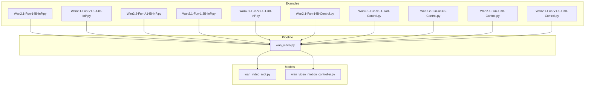
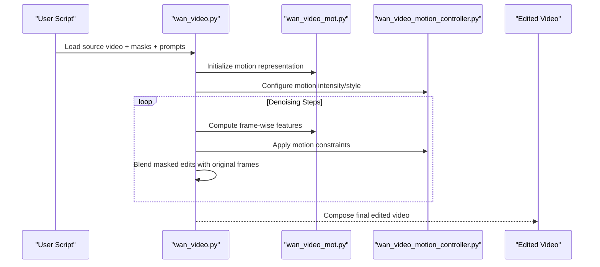
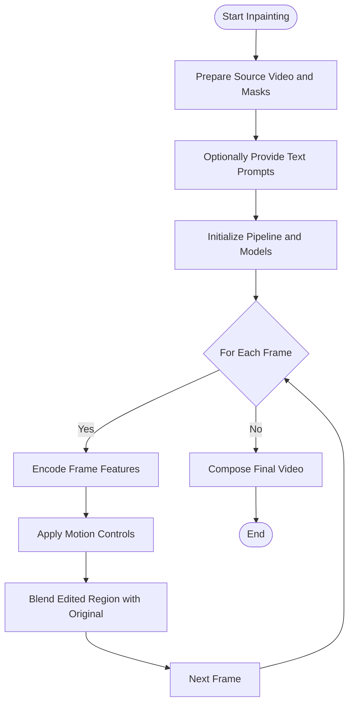
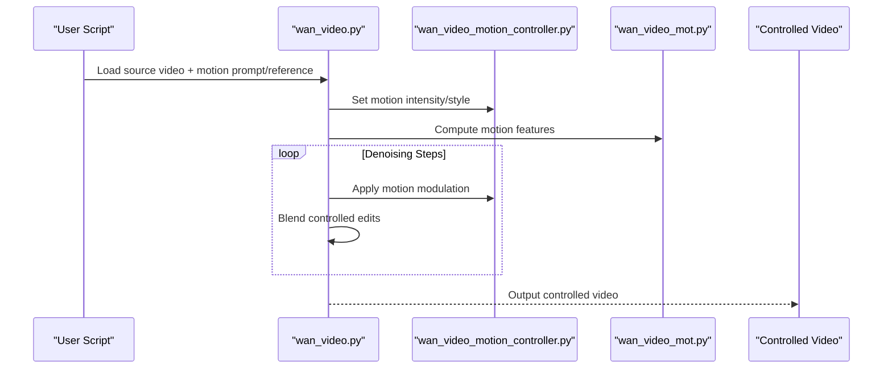
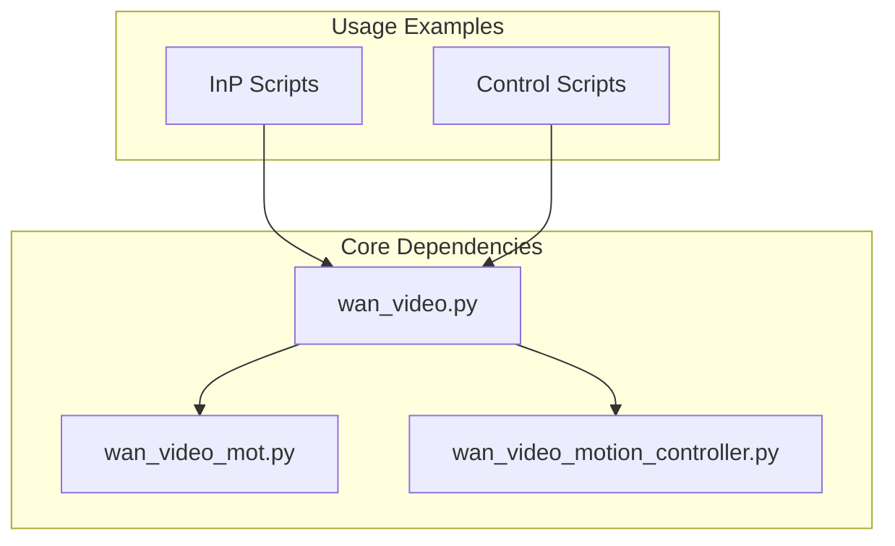

# Motion Editing and Inpainting

<cite>
**Referenced Files in This Document**
- [wan_video.py](file://diffsynth/pipelines/wan_video.py)
- [wan_video_mot.py](file://diffsynth/models/wan_video_mot.py)
- [wan_video_motion_controller.py](file://diffsynth/models/wan_video_motion_controller.py)
- [Wan2.1-Fun-14B-InP.py](file://examples/wanvideo/model_inference/Wan2.1-Fun-14B-InP.py)
- [Wan2.1-Fun-V1.1-14B-InP.py](file://examples/wanvideo/model_inference/Wan2.1-Fun-V1.1-14B-InP.py)
- [Wan2.2-Fun-A14B-InP.py](file://examples/wanvideo/model_inference/Wan2.2-Fun-A14B-InP.py)
- [Wan2.1-Fun-1.3B-InP.py](file://examples/wanvideo/model_inference/Wan2.1-Fun-1.3B-InP.py)
- [Wan2.1-Fun-V1.1-1.3B-InP.py](file://examples/wanvideo/model_inference/Wan2.1-Fun-V1.1-1.3B-InP.py)
- [Wan2.1-Fun-14B-Control.py](file://examples/wanvideo/model_inference/Wan2.1-Fun-14B-Control.py)
- [Wan2.1-Fun-V1.1-14B-Control.py](file://examples/wanvideo/model_inference/Wan2.1-Fun-V1.1-14B-Control.py)
- [Wan2.2-Fun-A14B-Control.py](file://examples/wanvideo/model_inference/Wan2.2-Fun-A14B-Control.py)
- [Wan2.1-Fun-1.3B-Control.py](file://examples/wanvideo/model_inference/Wan2.1-Fun-1.3B-Control.py)
- [Wan2.1-Fun-V1.1-1.3B-Control.py](file://examples/wanvideo/model_inference/Wan2.1-Fun-V1.1-1.3B-Control.py)
- [README.md](file://examples/wanvideo/README.md)
</cite>

## Table of Contents
1. [Introduction](#introduction)
2. [Project Structure](#project-structure)
3. [Core Components](#core-components)
4. [Architecture Overview](#architecture-overview)
5. [Detailed Component Analysis](#detailed-component-analysis)
6. [Dependency Analysis](#dependency-analysis)
7. [Performance Considerations](#performance-considerations)
8. [Troubleshooting Guide](#troubleshooting-guide)
9. [Conclusion](#conclusion)
10. [Appendices](#appendices)

## Introduction
This document explains how to edit existing video content with temporal consistency using the WanVideo motion editing and inpainting capabilities. It covers:
- How to apply motion transformations while preserving temporal coherence
- How to perform video inpainting (object removal, background replacement)
- Mask creation strategies and blending techniques
- Motion intensity parameters and their effects
- Advanced techniques for combining multiple edits and achieving seamless results

The guidance is grounded in the repository’s WanVideo pipeline and example scripts, focusing on practical usage patterns and parameter tuning.

## Project Structure
WanVideo-related functionality relevant to motion editing and inpainting spans:
- Pipeline orchestration for video generation/editing
- Motion modeling components that encode and control motion dynamics
- Example inference scripts demonstrating inpainting and control workflows

**Diagram sources**
- [wan_video.py](file://diffsynth/pipelines/wan_video.py)
- [wan_video_mot.py](file://diffsynth/models/wan_video_mot.py)
- [wan_video_motion_controller.py](file://diffsynth/models/wan_video_motion_controller.py)
- [Wan2.1-Fun-14B-InP.py](file://examples/wanvideo/model_inference/Wan2.1-Fun-14B-InP.py)
- [Wan2.1-Fun-V1.1-14B-InP.py](file://examples/wanvideo/model_inference/Wan2.1-Fun-V1.1-14B-InP.py)
- [Wan2.2-Fun-A14B-InP.py](file://examples/wanvideo/model_inference/Wan2.2-Fun-A14B-InP.py)
- [Wan2.1-Fun-1.3B-InP.py](file://examples/wanvideo/model_inference/Wan2.1-Fun-1.3B-InP.py)
- [Wan2.1-Fun-V1.1-1.3B-InP.py](file://examples/wanvideo/model_inference/Wan2.1-Fun-V1.1-1.3B-InP.py)
- [Wan2.1-Fun-14B-Control.py](file://examples/wanvideo/model_inference/Wan2.1-Fun-14B-Control.py)
- [Wan2.1-Fun-V1.1-14B-Control.py](file://examples/wanvideo/model_inference/Wan2.1-Fun-V1.1-14B-Control.py)
- [Wan2.2-Fun-A14B-Control.py](file://examples/wanvideo/model_inference/Wan2.2-Fun-A14B-Control.py)
- [Wan2.1-Fun-1.3B-Control.py](file://examples/wanvideo/model_inference/Wan2.1-Fun-1.3B-Control.py)
- [Wan2.1-Fun-V1.1-1.3B-Control.py](file://examples/wanvideo/model_inference/Wan2.1-Fun-V1.1-1.3B-Control.py)

**Section sources**
- [README.md](file://examples/wanvideo/README.md)

## Core Components
- Video pipeline: Orchestrates loading models, preparing inputs (video frames, masks, prompts), running denoising steps, and composing outputs.
- Motion model: Encodes and represents motion dynamics across frames to support consistent editing.
- Motion controller: Provides controls for adjusting motion intensity, direction, and style during editing or inpainting.

These components work together to enable temporally coherent edits by constraining changes within masked regions while preserving global motion characteristics.

**Section sources**
- [wan_video.py](file://diffsynth/pipelines/wan_video.py)
- [wan_video_mot.py](file://diffsynth/models/wan_video_mot.py)
- [wan_video_motion_controller.py](file://diffsynth/models/wan_video_motion_controller.py)

## Architecture Overview
The typical editing/inpainting workflow involves:
- Preparing a source video and per-frame masks
- Optionally providing text prompts or reference frames
- Running the pipeline with motion controls to blend edited regions into the original sequence
- Post-processing to ensure smooth transitions and temporal consistency

**Diagram sources**
- [wan_video.py](file://diffsynth/pipelines/wan_video.py)
- [wan_video_mot.py](file://diffsynth/models/wan_video_mot.py)
- [wan_video_motion_controller.py](file://diffsynth/models/wan_video_motion_controller.py)

## Detailed Component Analysis

### Inpainting Workflow
Inpainting removes objects or replaces backgrounds while maintaining temporal coherence. The typical flow:
- Create per-frame masks targeting regions to remove or replace
- Run the inpainting pipeline with motion controls to preserve surrounding motion
- Blend edited regions seamlessly with the original frames

**Diagram sources**
- [Wan2.1-Fun-14B-InP.py](file://examples/wanvideo/model_inference/Wan2.1-Fun-14B-InP.py)
- [Wan2.1-Fun-V1.1-14B-InP.py](file://examples/wanvideo/model_inference/Wan2.1-Fun-V1.1-14B-InP.py)
- [Wan2.2-Fun-A14B-InP.py](file://examples/wanvideo/model_inference/Wan2.2-Fun-A14B-InP.py)
- [Wan2.1-Fun-1.3B-InP.py](file://examples/wanvideo/model_inference/Wan2.1-Fun-1.3B-InP.py)
- [Wan2.1-Fun-V1.1-1.3B-InP.py](file://examples/wanvideo/model_inference/Wan2.1-Fun-V1.1-1.3B-InP.py)

**Section sources**
- [Wan2.1-Fun-14B-InP.py](file://examples/wanvideo/model_inference/Wan2.1-Fun-14B-InP.py)
- [Wan2.1-Fun-V1.1-14B-InP.py](file://examples/wanvideo/model_inference/Wan2.1-Fun-V1.1-14B-InP.py)
- [Wan2.2-Fun-A14B-InP.py](file://examples/wanvideo/model_inference/Wan2.2-Fun-A14B-InP.py)
- [Wan2.1-Fun-1.3B-InP.py](file://examples/wanvideo/model_inference/Wan2.1-Fun-1.3B-InP.py)
- [Wan2.1-Fun-V1.1-1.3B-InP.py](file://examples/wanvideo/model_inference/Wan2.1-Fun-V1.1-1.3B-InP.py)

### Motion Control Workflow
Motion control enables style transfer and directed motion adjustments while preserving temporal consistency:
- Define desired motion style or transformation via prompts or references
- Use motion controllers to modulate intensity and direction
- Blend controlled edits with original frames to maintain coherence

**Diagram sources**
- [Wan2.1-Fun-14B-Control.py](file://examples/wanvideo/model_inference/Wan2.1-Fun-14B-Control.py)
- [Wan2.1-Fun-V1.1-14B-Control.py](file://examples/wanvideo/model_inference/Wan2.1-Fun-V1.1-14B-Control.py)
- [Wan2.2-Fun-A14B-Control.py](file://examples/wanvideo/model_inference/Wan2.2-Fun-A14B-Control.py)
- [Wan2.1-Fun-1.3B-Control.py](file://examples/wanvideo/model_inference/Wan2.1-Fun-1.3B-Control.py)
- [Wan2.1-Fun-V1.1-1.3B-Control.py](file://examples/wanvideo/model_inference/Wan2.1-Fun-V1.1-1.3B-Control.py)

**Section sources**
- [Wan2.1-Fun-14B-Control.py](file://examples/wanvideo/model_inference/Wan2.1-Fun-14B-Control.py)
- [Wan2.1-Fun-V1.1-14B-Control.py](file://examples/wanvideo/model_inference/Wan2.1-Fun-V1.1-14B-Control.py)
- [Wan2.2-Fun-A14B-Control.py](file://examples/wanvideo/model_inference/Wan2.2-Fun-A14B-Control.py)
- [Wan2.1-Fun-1.3B-Control.py](file://examples/wanvideo/model_inference/Wan2.1-Fun-1.3B-Control.py)
- [Wan2.1-Fun-V1.1-1.3B-Control.py](file://examples/wanvideo/model_inference/Wan2.1-Fun-V1.1-1.3B-Control.py)

### Object Removal and Background Replacement
To remove objects or replace backgrounds:
- Create precise per-frame masks around target regions
- Use inpainting examples to guide the editing process
- Adjust motion intensity to avoid disrupting surrounding motion

Best practices:
- Ensure mask boundaries are smooth to prevent artifacts
- Use conservative motion intensity to preserve natural movement
- Combine multiple passes if needed for complex scenes

**Section sources**
- [Wan2.1-Fun-14B-InP.py](file://examples/wanvideo/model_inference/Wan2.1-Fun-14B-InP.py)
- [Wan2.1-Fun-V1.1-14B-InP.py](file://examples/wanvideo/model_inference/Wan2.1-Fun-V1.1-14B-InP.py)
- [Wan2.2-Fun-A14B-InP.py](file://examples/wanvideo/model_inference/Wan2.2-Fun-A14B-InP.py)

### Motion Style Transfer
For transferring motion styles:
- Provide reference motion or descriptive prompts
- Use motion control examples to modulate intensity
- Blend results carefully to maintain temporal coherence

Tips:
- Start with low motion intensity and gradually increase
- Use consistent prompts across frames for stability
- Validate results frame-by-frame before final composition

**Section sources**
- [Wan2.1-Fun-14B-Control.py](file://examples/wanvideo/model_inference/Wan2.1-Fun-14B-Control.py)
- [Wan2.1-Fun-V1.1-14B-Control.py](file://examples/wanvideo/model_inference/Wan2.1-Fun-V1.1-14B-Control.py)
- [Wan2.2-Fun-A14B-Control.py](file://examples/wanvideo/model_inference/Wan2.2-Fun-A14B-Control.py)

### Temporal Coherence Preservation
Key techniques for maintaining temporal consistency:
- Use motion-aware blending that respects frame-to-frame relationships
- Apply consistent motion constraints across all frames
- Avoid abrupt changes in editing intensity between frames

Implementation approach:
- Leverage motion model features to guide editing
- Use motion controller to enforce smooth transitions
- Validate coherence by reviewing the entire sequence

**Section sources**
- [wan_video_mot.py](file://diffsynth/models/wan_video_mot.py)
- [wan_video_motion_controller.py](file://diffsynth/models/wan_video_motion_controller.py)

### Combining Multiple Edits
Advanced technique for complex scenarios:
- Layer multiple edits sequentially (e.g., object removal followed by background replacement)
- Use intermediate masks to isolate different editing regions
- Apply motion controls globally to maintain overall coherence

Workflow:
- Plan edit layers and their dependencies
- Execute each layer with appropriate motion settings
- Blend results progressively to avoid conflicts

**Section sources**
- [Wan2.1-Fun-14B-InP.py](file://examples/wanvideo/model_inference/Wan2.1-Fun-14B-InP.py)
- [Wan2.1-Fun-14B-Control.py](file://examples/wanvideo/model_inference/Wan2.1-Fun-14B-Control.py)

## Dependency Analysis
The core dependencies for motion editing and inpainting involve the pipeline orchestrating model components and example scripts providing usage patterns.

**Diagram sources**
- [wan_video.py](file://diffsynth/pipelines/wan_video.py)
- [wan_video_mot.py](file://diffsynth/models/wan_video_mot.py)
- [wan_video_motion_controller.py](file://diffsynth/models/wan_video_motion_controller.py)
- [Wan2.1-Fun-14B-InP.py](file://examples/wanvideo/model_inference/Wan2.1-Fun-14B-InP.py)
- [Wan2.1-Fun-14B-Control.py](file://examples/wanvideo/model_inference/Wan2.1-Fun-14B-Control.py)

**Section sources**
- [wan_video.py](file://diffsynth/pipelines/wan_video.py)
- [wan_video_mot.py](file://diffsynth/models/wan_video_mot.py)
- [wan_video_motion_controller.py](file://diffsynth/models/wan_video_motion_controller.py)

## Performance Considerations
- Memory usage: Large videos and high resolutions require careful memory management
- Processing time: Longer sequences and higher motion complexity increase computation
- Optimization strategies: Use lower resolutions for testing, batch processing where possible
- Hardware considerations: GPU memory limits may require chunked processing

[No sources needed since this section provides general guidance]

## Troubleshooting Guide
Common issues and solutions:
- Artifacts at mask boundaries: Refine mask edges and adjust blending parameters
- Temporal flickering: Reduce motion intensity or use more conservative editing
- Inconsistent results: Ensure consistent prompts and motion settings across frames
- Memory errors: Process shorter clips or reduce resolution

Debugging tips:
- Review individual frames to identify problem areas
- Test with simpler scenes before complex ones
- Monitor motion intensity values for reasonable ranges

**Section sources**
- [Wan2.1-Fun-14B-InP.py](file://examples/wanvideo/model_inference/Wan2.1-Fun-14B-InP.py)
- [Wan2.1-Fun-14B-Control.py](file://examples/wanvideo/model_inference/Wan2.1-Fun-14B-Control.py)

## Conclusion
WanVideo provides robust capabilities for motion editing and inpainting through its integrated pipeline and motion control systems. By leveraging proper mask creation, motion intensity tuning, and blending techniques, users can achieve temporally consistent edits ranging from simple object removal to complex motion style transfers. The example scripts serve as practical guides for implementing these techniques effectively.

[No sources needed since this section summarizes without analyzing specific files]

## Appendices

### Mask Creation Guidelines
- Use precise segmentation tools for accurate object isolation
- Apply morphological operations to smooth mask boundaries
- Consider temporal consistency when creating multi-frame masks
- Validate masks visually before processing

### Motion Intensity Parameters
- Start with conservative values (low intensity) for initial tests
- Gradually increase based on visual feedback
- Balance between edit strength and temporal coherence
- Consider scene-specific optimal ranges

### Blending Techniques
- Use alpha blending for gradual transitions
- Apply edge-aware blending to reduce artifacts
- Consider spatial-temporal smoothing for seamless results
- Test different blending modes for optimal outcomes

[No sources needed since this section provides general guidance]