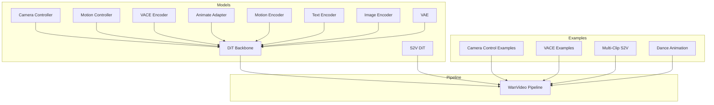
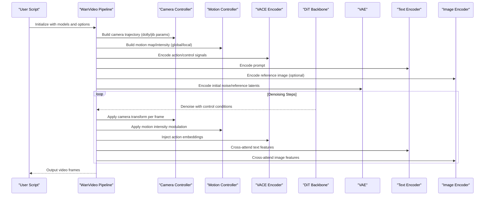
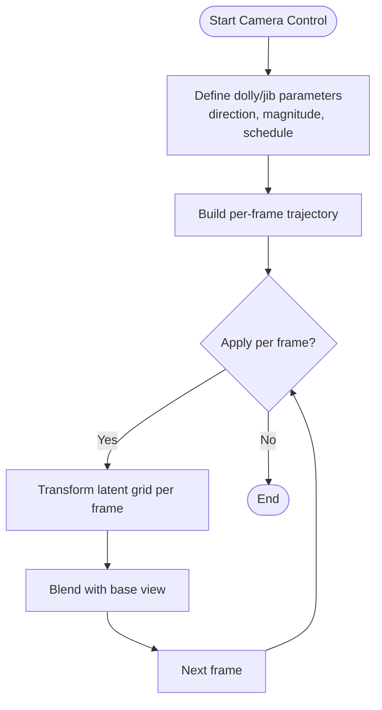
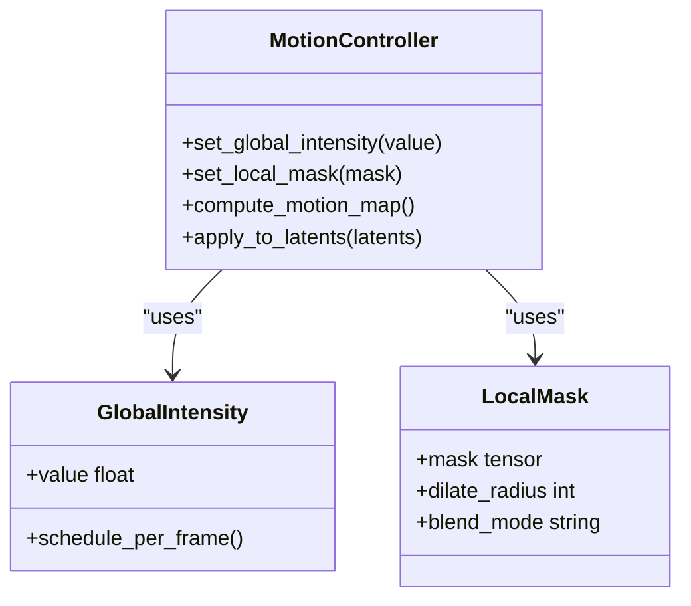
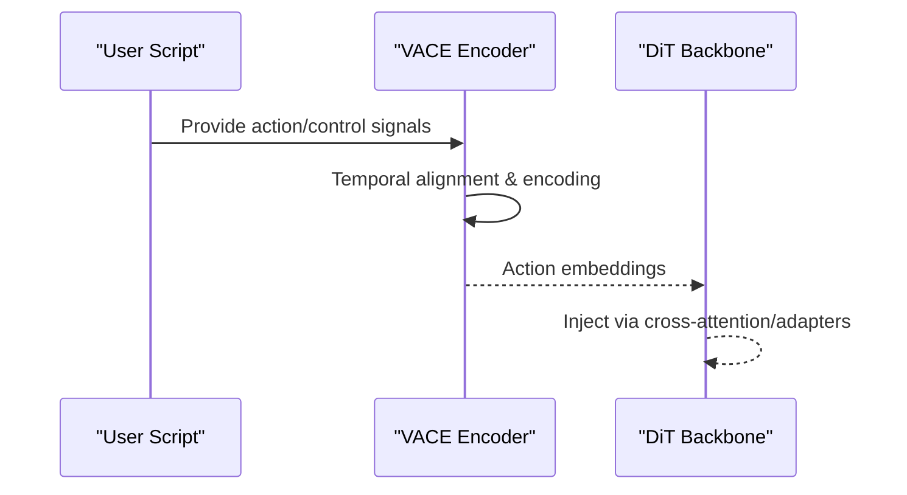
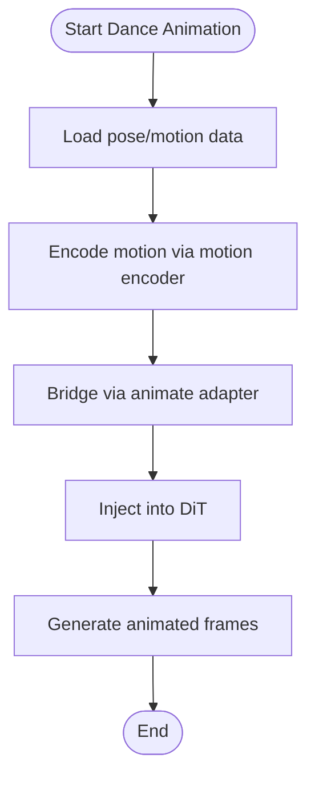
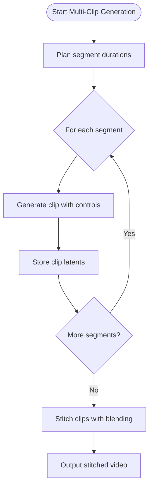
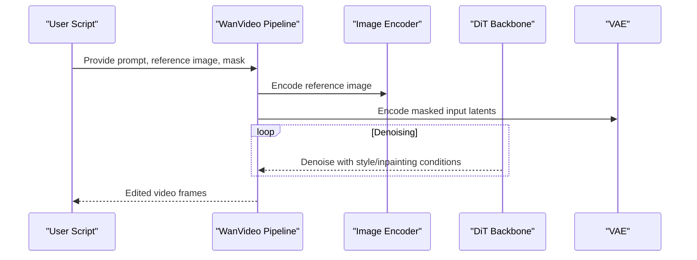
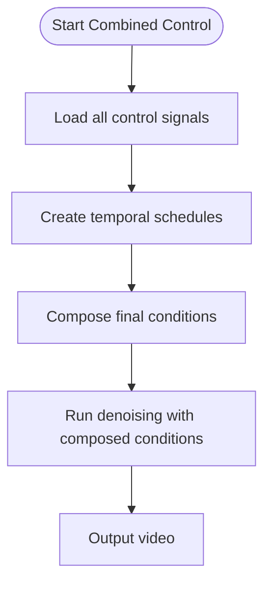
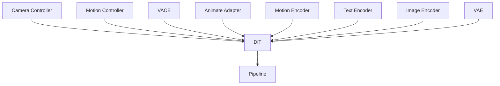

# WanVideo Control Features

<cite>
**Referenced Files in This Document**
- [wan_video_camera_controller.py](file://diffsynth/models/wan_video_camera_controller.py)
- [wan_video_motion_controller.py](file://diffsynth/models/wan_video_motion_controller.py)
- [wan_video_vace.py](file://diffsynth/models/wan_video_vace.py)
- [wan_video_dit.py](file://diffsynth/models/wan_video_dit.py)
- [wan_video_dit_s2v.py](file://diffsynth/models/wan_video_dit_s2v.py)
- [wan_video_animate_adapter.py](file://diffsynth/models/wan_video_animate_adapter.py)
- [wan_video_mot.py](file://diffsynth/models/wan_video_mot.py)
- [wan_video_vae.py](file://diffsynth/models/wan_video_vae.py)
- [wan_video_text_encoder.py](file://diffsynth/models/wan_video_text_encoder.py)
- [wan_video_image_encoder.py](file://diffsynth/models/wan_video_image_encoder.py)
- [wan_video.py](file://diffsynth/pipelines/wan_video.py)
- [Wan2.1-Fun-V1.1-14B-Control-Camera.py](file://examples/wanvideo/model_inference/Wan2.1-Fun-V1.1-14B-Control-Camera.py)
- [Wan2.1-Fun-V1.1-14B-Control.py](file://examples/wanvideo/model_inference/Wan2.1-Fun-V1.1-14B-Control.py)
- [Wan2.1-VACE-14B.py](file://examples/wanvideo/model_inference/Wan2.1-VACE-14B.py)
- [Wan2.2-S2V-14B_multi_clips.py](file://examples/wanvideo/model_inference/Wan2.2-S2V-14B_multi_clips.py)
- [WanToDance-14B-global.py](file://examples/wanvideo/model_inference/WanToDance-14B-global.py)
- [WanToDance-14B-local.py](file://examples/wanvideo/model_inference/WanToDance-14B-local.py)
- [Wan2.2-VACE-Fun-A14B.py](file://examples/wanvideo/model_inference/Wan2.2-VACE-Fun-A14B.py)
</cite>

## Table of Contents
1. Introduction
2. Project Structure
3. Core Components
4. Architecture Overview
5. Detailed Component Analysis
6. Dependency Analysis
7. Performance Considerations
8. Troubleshooting Guide
9. Conclusion

## Introduction
This document explains the WanVideo control features for precise camera choreography, motion control, VACE (Video Action Control Editor), and dance animation capabilities. It covers camera movement parameters (dolly and jib), motion intensity controls, multi-clip generation workflows, style transfer features, inpainting-based editing, and how to combine multiple control signals for complex video generation scenarios. The guidance is designed for both technical and non-technical users.

## Project Structure
The WanVideo control system is implemented across model components, pipelines, and example scripts:
- Camera controller module defines dolly/jib parameters and transforms.
- Motion controller module provides global/local motion intensity and tracking.
- VACE module encodes action/control signals into latent space.
- DiT backbone modules integrate control signals during denoising.
- Pipeline orchestrates inference with optional multi-clip stitching and inpainting.
- Example scripts demonstrate end-to-end usage for camera control, VACE, S2V multi-clips, and dance animations.

**Diagram sources**
- [wan_video_camera_controller.py](file://diffsynth/models/wan_video_camera_controller.py)
- [wan_video_motion_controller.py](file://diffsynth/models/wan_video_motion_controller.py)
- [wan_video_vace.py](file://diffsynth/models/wan_video_vace.py)
- [wan_video_dit.py](file://diffsynth/models/wan_video_dit.py)
- [wan_video_dit_s2v.py](file://diffsynth/models/wan_video_dit_s2v.py)
- [wan_video_animate_adapter.py](file://diffsynth/models/wan_video_animate_adapter.py)
- [wan_video_mot.py](file://diffsynth/models/wan_video_mot.py)
- [wan_video_vae.py](file://diffsynth/models/wan_video_vae.py)
- [wan_video_text_encoder.py](file://diffsynth/models/wan_video_text_encoder.py)
- [wan_video_image_encoder.py](file://diffsynth/models/wan_video_image_encoder.py)
- [wan_video.py](file://diffsynth/pipelines/wan_video.py)

**Section sources**
- [wan_video_camera_controller.py](file://diffsynth/models/wan_video_camera_controller.py)
- [wan_video_motion_controller.py](file://diffsynth/models/wan_video_motion_controller.py)
- [wan_video_vace.py](file://diffsynth/models/wan_video_vace.py)
- [wan_video_dit.py](file://diffsynth/models/wan_video_dit.py)
- [wan_video_dit_s2v.py](file://diffsynth/models/wan_video_dit_s2v.py)
- [wan_video_animate_adapter.py](file://diffsynth/models/wan_video_animate_adapter.py)
- [wan_video_mot.py](file://diffsynth/models/wan_video_mot.py)
- [wan_video_vae.py](file://diffsynth/models/wan_video_vae.py)
- [wan_video_text_encoder.py](file://diffsynth/models/wan_video_text_encoder.py)
- [wan_video_image_encoder.py](file://diffsynth/models/wan_video_image_encoder.py)
- [wan_video.py](file://diffsynth/pipelines/wan_video.py)

## Core Components
- Camera Controller: Defines camera movements such as dolly (in/out/left/right) and jib (up/down). Parameters include direction, magnitude, and temporal scheduling across frames.
- Motion Controller: Provides global and local motion intensity controls, enabling per-region or per-frame motion strength modulation.
- VACE (Video Action Control Editor): Encodes action/control signals (e.g., pose, motion trajectories) into a representation consumed by the DiT backbone for conditional generation.
- DiT Backbones: Integrate control signals from camera, motion, VACE, and adapters during diffusion steps.
- Animate Adapter: Bridges motion/pose inputs to the DiT for animation tasks like dance.
- Motion Encoder: Extracts motion cues from reference videos or motion maps.
- VAE: Encodes/decodes video latents.
- Text/Image Encoders: Provide semantic conditioning from prompts and reference images.

**Section sources**
- [wan_video_camera_controller.py](file://diffsynth/models/wan_video_camera_controller.py)
- [wan_video_motion_controller.py](file://diffsynth/models/wan_video_motion_controller.py)
- [wan_video_vace.py](file://diffsynth/models/wan_video_vace.py)
- [wan_video_dit.py](file://diffsynth/models/wan_video_dit.py)
- [wan_video_animate_adapter.py](file://diffsynth/models/wan_video_animate_adapter.py)
- [wan_video_mot.py](file://diffsynth/models/wan_video_mot.py)
- [wan_video_vae.py](file://diffsynth/models/wan_video_vae.py)
- [wan_video_text_encoder.py](file://diffsynth/models/wan_video_text_encoder.py)
- [wan_video_image_encoder.py](file://diffsynth/models/wan_video_image_encoder.py)

## Architecture Overview
The pipeline composes multiple control signals into the DiT denoising process. Camera and motion controllers generate spatio-temporal conditions; VACE encodes high-level actions; adapters inject motion/pose; encoders provide text/image context; VAE handles latent space operations.

**Diagram sources**
- [wan_video.py](file://diffsynth/pipelines/wan_video.py)
- [wan_video_camera_controller.py](file://diffsynth/models/wan_video_camera_controller.py)
- [wan_video_motion_controller.py](file://diffsynth/models/wan_video_motion_controller.py)
- [wan_video_vace.py](file://diffsynth/models/wan_video_vace.py)
- [wan_video_dit.py](file://diffsynth/models/wan_video_dit.py)
- [wan_video_vae.py](file://diffsynth/models/wan_video_vae.py)
- [wan_video_text_encoder.py](file://diffsynth/models/wan_video_text_encoder.py)
- [wan_video_image_encoder.py](file://diffsynth/models/wan_video_image_encoder.py)

## Detailed Component Analysis

### Camera Control (Dolly and Jib Movements)
- Purpose: Define cinematic camera motions including dolly (forward/backward/left/right) and jib (vertical tilt up/down).
- Parameters: Direction vectors, magnitudes, per-frame scheduling, and blending weights.
- Integration: Camera transforms are applied during denoising to modulate spatial sampling and attention windows.

**Diagram sources**
- [wan_video_camera_controller.py](file://diffsynth/models/wan_video_camera_controller.py)

**Section sources**
- [wan_video_camera_controller.py](file://diffsynth/models/wan_video_camera_controller.py)
- [Wan2.1-Fun-V1.1-14B-Control-Camera.py](file://examples/wanvideo/model_inference/Wan2.1-Fun-V1.1-14B-Control-Camera.py)

### Motion Controllers (Global and Local Intensity)
- Global Motion: Controls overall scene dynamics and camera-object relative motion intensity.
- Local Motion: Targets specific regions or objects for fine-grained motion modulation.
- Usage: Combine with camera control to achieve coordinated choreography between camera and subject motion.

**Diagram sources**
- [wan_video_motion_controller.py](file://diffsynth/models/wan_video_motion_controller.py)

**Section sources**
- [wan_video_motion_controller.py](file://diffsynth/models/wan_video_motion_controller.py)
- [wan_video_dit.py](file://diffsynth/models/wan_video_dit.py)

### VACE (Video Action Control Editor)
- Purpose: Encode high-level action/control signals (e.g., pose sequences, motion trajectories) into embeddings that guide DiT generation.
- Inputs: Action/control tensors, optionally aligned temporally with video length.
- Outputs: Condition embeddings injected into cross-attention or adapter layers.

**Diagram sources**
- [wan_video_vace.py](file://diffsynth/models/wan_video_vace.py)
- [wan_video_dit.py](file://diffsynth/models/wan_video_dit.py)

**Section sources**
- [wan_video_vace.py](file://diffsynth/models/wan_video_vace.py)
- [Wan2.1-VACE-14B.py](file://examples/wanvideo/model_inference/Wan2.1-VACE-14B.py)
- [Wan2.2-VACE-Fun-A14B.py](file://examples/wanvideo/model_inference/Wan2.2-VACE-Fun-A14B.py)

### Dance Animation Capabilities
- Global Dance: Applies full-body motion patterns across the entire frame.
- Local Dance: Targets specific body parts or regions for localized motion.
- Integration: Uses animate adapter and motion encoder to bridge pose/motion data to DiT.

**Diagram sources**
- [wan_video_animate_adapter.py](file://diffsynth/models/wan_video_animate_adapter.py)
- [wan_video_mot.py](file://diffsynth/models/wan_video_mot.py)
- [wan_video_dit.py](file://diffsynth/models/wan_video_dit.py)

**Section sources**
- [wan_video_animate_adapter.py](file://diffsynth/models/wan_video_animate_adapter.py)
- [wan_video_mot.py](file://diffsynth/models/wan_video_mot.py)
- [WanToDance-14B-global.py](file://examples/wanvideo/model_inference/WanToDance-14B-global.py)
- [WanToDance-14B-local.py](file://examples/wanvideo/model_inference/WanToDance-14B-local.py)

### Multi-Clip Generation Workflows (S2V)
- Purpose: Generate long videos by composing multiple clips with smooth transitions.
- Workflow: Split target duration into segments, generate each clip independently, then stitch with overlap blending.
- Control Signals: Each clip can have distinct camera/motion/VACE conditions for dynamic storytelling.

**Diagram sources**
- [wan_video_dit_s2v.py](file://diffsynth/models/wan_video_dit_s2v.py)
- [wan_video.py](file://diffsynth/pipelines/wan_video.py)

**Section sources**
- [wan_video_dit_s2v.py](file://diffsynth/models/wan_video_dit_s2v.py)
- [wan_video.py](file://diffsynth/pipelines/wan_video.py)
- [Wan2.2-S2V-14B_multi_clips.py](file://examples/wanvideo/model_inference/Wan2.2-S2V-14B_multi_clips.py)

### Style Transfer and Inpainting Editing
- Style Transfer: Use reference images or prompts to influence appearance while preserving motion/camera control.
- Inpainting Editing: Mask regions to edit content while maintaining global consistency and control signals.
- Integration: Image encoder and mask handling feed into DiT for conditioned generation.

**Diagram sources**
- [wan_video_image_encoder.py](file://diffsynth/models/wan_video_image_encoder.py)
- [wan_video_dit.py](file://diffsynth/models/wan_video_dit.py)
- [wan_video_vae.py](file://diffsynth/models/wan_video_vae.py)
- [wan_video.py](file://diffsynth/pipelines/wan_video.py)

**Section sources**
- [wan_video_image_encoder.py](file://diffsynth/models/wan_video_image_encoder.py)
- [wan_video_dit.py](file://diffsynth/models/wan_video_dit.py)
- [wan_video_vae.py](file://diffsynth/models/wan_video_vae.py)
- [wan_video.py](file://diffsynth/pipelines/wan_video.py)
- [Wan2.1-Fun-V1.1-14B-InP.py](file://examples/wanvideo/model_inference/Wan2.1-Fun-V1.1-14B-InP.py)

### Combining Multiple Control Signals
- Strategy: Layer camera control, motion intensity, VACE actions, and style references to produce complex scenes.
- Priority: Define precedence rules (e.g., camera overrides local motion in certain regions).
- Scheduling: Temporal schedules ensure smooth transitions between control phases.

**Diagram sources**
- [wan_video_camera_controller.py](file://diffsynth/models/wan_video_camera_controller.py)
- [wan_video_motion_controller.py](file://diffsynth/models/wan_video_motion_controller.py)
- [wan_video_vace.py](file://diffsynth/models/wan_video_vace.py)
- [wan_video_dit.py](file://diffsynth/models/wan_video_dit.py)
- [wan_video.py](file://diffsynth/pipelines/wan_video.py)

**Section sources**
- [wan_video_camera_controller.py](file://diffsynth/models/wan_video_camera_controller.py)
- [wan_video_motion_controller.py](file://diffsynth/models/wan_video_motion_controller.py)
- [wan_video_vace.py](file://diffsynth/models/wan_video_vace.py)
- [wan_video_dit.py](file://diffsynth/models/wan_video_dit.py)
- [wan_video.py](file://diffsynth/pipelines/wan_video.py)
- [Wan2.1-Fun-V1.1-14B-Control.py](file://examples/wanvideo/model_inference/Wan2.1-Fun-V1.1-14B-Control.py)

## Dependency Analysis
Control modules depend on encoders and backbones to inject conditions during denoising. The pipeline coordinates these dependencies and manages memory and scheduling.

**Diagram sources**
- [wan_video_camera_controller.py](file://diffsynth/models/wan_video_camera_controller.py)
- [wan_video_motion_controller.py](file://diffsynth/models/wan_video_motion_controller.py)
- [wan_video_vace.py](file://diffsynth/models/wan_video_vace.py)
- [wan_video_animate_adapter.py](file://diffsynth/models/wan_video_animate_adapter.py)
- [wan_video_mot.py](file://diffsynth/models/wan_video_mot.py)
- [wan_video_text_encoder.py](file://diffsynth/models/wan_video_text_encoder.py)
- [wan_video_image_encoder.py](file://diffsynth/models/wan_video_image_encoder.py)
- [wan_video_vae.py](file://diffsynth/models/wan_video_vae.py)
- [wan_video_dit.py](file://diffsynth/models/wan_video_dit.py)
- [wan_video.py](file://diffsynth/pipelines/wan_video.py)

**Section sources**
- [wan_video_dit.py](file://diffsynth/models/wan_video_dit.py)
- [wan_video.py](file://diffsynth/pipelines/wan_video.py)

## Performance Considerations
- VRAM Management: Use low-vram variants of examples when available to reduce memory footprint.
- Batch Size: Adjust based on GPU capacity; smaller batches improve stability.
- Precision: Mixed precision can accelerate inference with minimal quality loss.
- Scheduling: Optimize temporal schedules to minimize redundant computations.
- Multi-Clips: Segment lengths should balance coherence and memory constraints.

[No sources needed since this section provides general guidance]

## Troubleshooting Guide
- Camera Artifacts: Check parameter ranges and temporal schedules; ensure consistent directions and magnitudes.
- Motion Bleeding: Verify local masks and blending modes; adjust dilate radius and overlap.
- VACE Misalignment: Confirm temporal alignment of action/control signals with video length.
- Style Drift: Reduce reference image weight or adjust cross-attention strength.
- Inpainting Edges: Refine mask boundaries and use appropriate blending strategies.

**Section sources**
- [wan_video_camera_controller.py](file://diffsynth/models/wan_video_camera_controller.py)
- [wan_video_motion_controller.py](file://diffsynth/models/wan_video_motion_controller.py)
- [wan_video_vace.py](file://diffsynth/models/wan_video_vace.py)
- [wan_video_dit.py](file://diffsynth/models/wan_video_dit.py)
- [wan_video.py](file://diffsynth/pipelines/wan_video.py)

## Conclusion
WanVideo’s control features enable precise camera choreography, nuanced motion control, action-driven generation via VACE, and robust dance animation. By combining camera, motion, VACE, and style signals, users can create complex, cinematic videos with multi-clip workflows and inpainting edits. Proper scheduling, parameter tuning, and performance optimizations ensure high-quality results across diverse scenarios.

[No sources needed since this section summarizes without analyzing specific files]