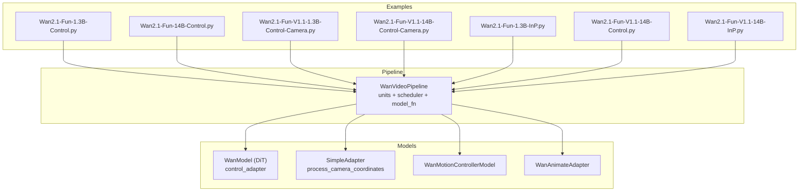
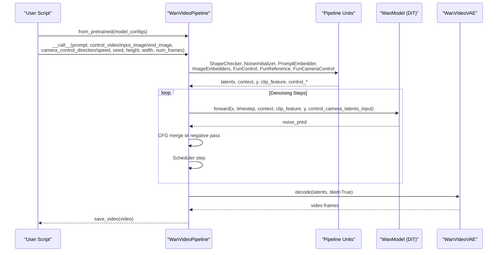
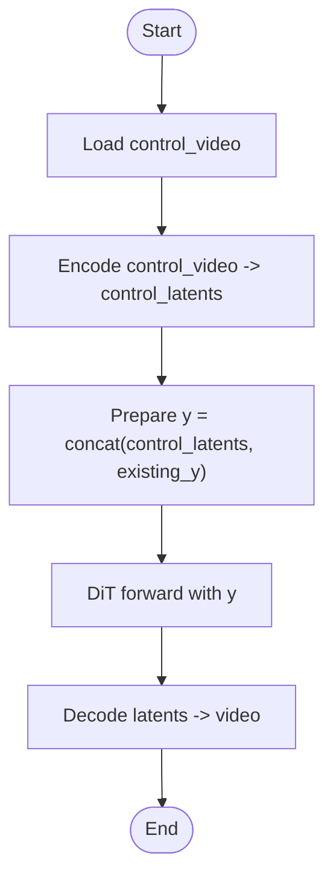
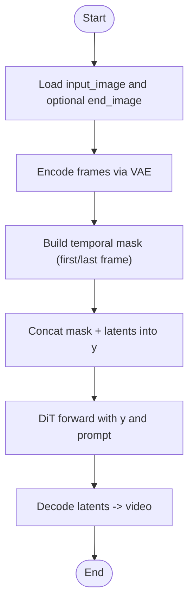
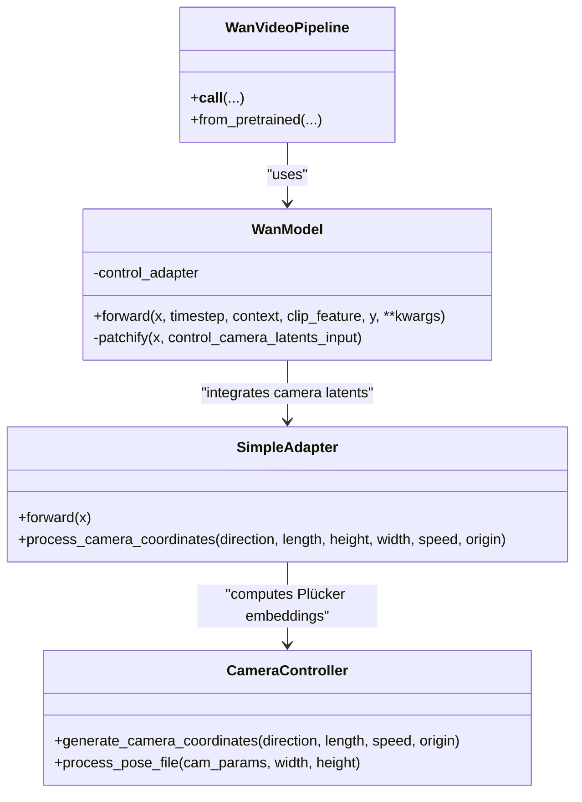
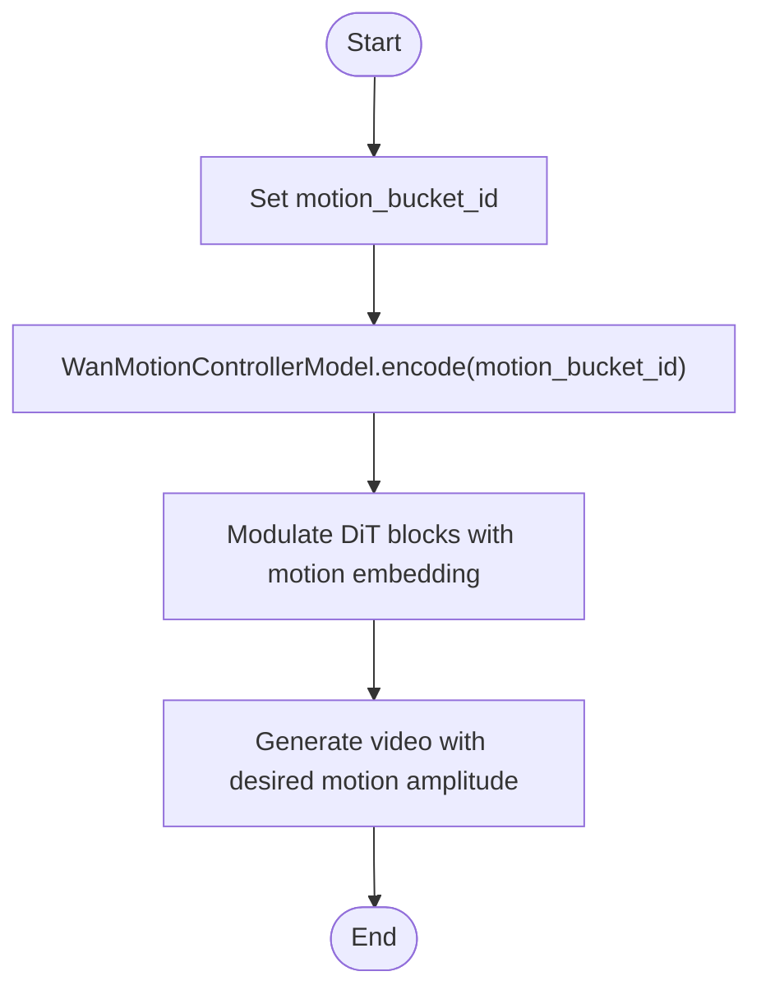
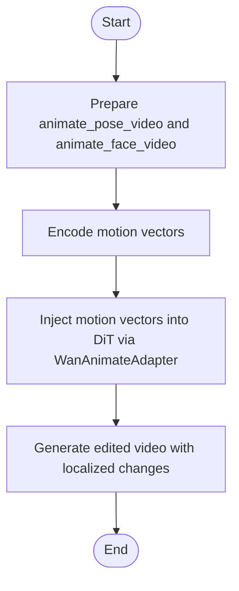
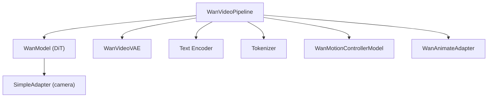

# Fun Models Inference

<cite>
**Referenced Files in This Document**
- [wan_video.py](file://diffsynth/pipelines/wan_video.py)
- [wan_video_dit.py](file://diffsynth/models/wan_video_dit.py)
- [wan_video_camera_controller.py](file://diffsynth/models/wan_video_camera_controller.py)
- [wan_video_motion_controller.py](file://diffsynth/models/wan_video_motion_controller.py)
- [wan_video_animate_adapter.py](file://diffsynth/models/wan_video_animate_adapter.py)
- [Wan2.1-Fun-1.3B-Control.py](file://examples/wanvideo/model_inference/Wan2.1-Fun-1.3B-Control.py)
- [Wan2.1-Fun-14B-Control.py](file://examples/wanvideo/model_inference/Wan2.1-Fun-14B-Control.py)
- [Wan2.1-Fun-V1.1-1.3B-Control-Camera.py](file://examples/wanvideo/model_inference/Wan2.1-Fun-V1.1-1.3B-Control-Camera.py)
- [Wan2.1-Fun-V1.1-14B-Control-Camera.py](file://examples/wanvideo/model_inference/Wan2.1-Fun-V1.1-14B-Control-Camera.py)
- [Wan2.1-Fun-1.3B-InP.py](file://examples/wanvideo/model_inference/Wan2.1-Fun-1.3B-InP.py)
- [Wan2.1-Fun-V1.1-14B-Control.py](file://examples/wanvideo/model_inference/Wan2.1-Fun-V1.1-14B-Control.py)
- [Wan2.1-Fun-V1.1-14B-InP.py](file://examples/wanvideo/model_inference/Wan2.1-Fun-V1.1-14B-InP.py)
- [Wan.md](file://docs/en/Model_Details/Wan.md)
</cite>

## Table of Contents
1. Introduction
2. Project Structure
3. Core Components
4. Architecture Overview
5. Detailed Component Analysis
6. Dependency Analysis
7. Performance Considerations
8. Troubleshooting Guide
9. Conclusion
10. Appendices

## Introduction
This document explains how to use the WanVideo Fun models for creative video generation with structured control, inpainting-based editing, and cinematic camera control. It covers:
- Fun model variants (1.3B and 14B), including V1.1 updates
- ControlNet-style control via a control video
- Inpainting features using first-and-last frame conditioning
- Camera movement control for cinematic effects
- Practical examples of prompting, control signal preparation, and advanced editing workflows

The pipeline is implemented in DiffSynth-Studio’s WanVideoPipeline, which orchestrates text encoding, image/video encoders, DiT diffusion, VAE decoding, and specialized adapters for control and motion.

## Project Structure
Key files relevant to Fun models inference:
- Pipeline orchestration and units: diffsynth/pipelines/wan_video.py
- DiT backbone and control adapter integration: diffsynth/models/wan_video_dit.py
- Camera control coordinate processing: diffsynth/models/wan_video_camera_controller.py
- Motion controller for speed/motion amplitude: diffsynth/models/wan_video_motion_controller.py
- Animate adapter for pose/face/local editing: diffsynth/models/wan_video_animate_adapter.py
- Example scripts demonstrating Control, InP, and Camera control for 1.3B and 14B variants
- Documentation overview of model lineage and parameters

**Diagram sources**
- [wan_video.py](file://diffsynth/pipelines/wan_video.py)
- [wan_video_dit.py](file://diffsynth/models/wan_video_dit.py)
- [wan_video_camera_controller.py](file://diffsynth/models/wan_video_camera_controller.py)
- [wan_video_motion_controller.py](file://diffsynth/models/wan_video_motion_controller.py)
- [wan_video_animate_adapter.py](file://diffsynth/models/wan_video_animate_adapter.py)
- [Wan2.1-Fun-1.3B-Control.py](file://examples/wanvideo/model_inference/Wan2.1-Fun-1.3B-Control.py)
- [Wan2.1-Fun-14B-Control.py](file://examples/wanvideo/model_inference/Wan2.1-Fun-14B-Control.py)
- [Wan2.1-Fun-V1.1-1.3B-Control-Camera.py](file://examples/wanvideo/model_inference/Wan2.1-Fun-V1.1-1.3B-Control-Camera.py)
- [Wan2.1-Fun-V1.1-14B-Control-Camera.py](file://examples/wanvideo/model_inference/Wan2.1-Fun-V1.1-14B-Control-Camera.py)
- [Wan2.1-Fun-1.3B-InP.py](file://examples/wanvideo/model_inference/Wan2.1-Fun-1.3B-InP.py)
- [Wan2.1-Fun-V1.1-14B-Control.py](file://examples/wanvideo/model_inference/Wan2.1-Fun-V1.1-14B-Control.py)
- [Wan2.1-Fun-V1.1-14B-InP.py](file://examples/wanvideo/model_inference/Wan2.1-Fun-V1.1-14B-InP.py)

**Section sources**
- [Wan.md](file://docs/en/Model_Details/Wan.md)

## Core Components
- WanVideoPipeline: Orchestrates inputs, runs preprocessing units, iterates denoising steps, switches DiT if needed, decodes latents via VAE, and returns video frames. Supports tiled decoding and unified sequence parallelism.
- WanModel (DiT): Transformer blocks with self/cross attention, time modulation, optional image embeddings, and an optional control_adapter that integrates camera or other control signals into patches.
- SimpleAdapter (camera controller): Converts camera coordinates into Plücker embeddings and adapts them to DiT patch space; supports directions like Left, Right, Up, Down, diagonals, and zoom In/Out.
- WanMotionControllerModel: Encodes motion bucket id into a modulation vector used by DiT blocks to control motion amplitude/speed.
- WanAnimateAdapter: Integrates pose/face pixel values and motion vectors into DiT for detailed local editing and animation.

Key capabilities exposed through the pipeline:
- Control video input for structured generation (ControlNet-like)
- First-and-last frame conditioning for inpainting transitions
- Camera control direction and speed for cinematic effects
- Reference image support for consistency
- Speed/motion control via motion_bucket_id

**Section sources**
- [wan_video.py](file://diffsynth/pipelines/wan_video.py)
- [wan_video_dit.py](file://diffsynth/models/wan_video_dit.py)
- [wan_video_camera_controller.py](file://diffsynth/models/wan_video_camera_controller.py)
- [wan_video_motion_controller.py](file://diffsynth/models/wan_video_motion_controller.py)
- [wan_video_animate_adapter.py](file://diffsynth/models/wan_video_animate_adapter.py)

## Architecture Overview
The Fun models inference follows a modular pipeline:
- Inputs are validated and normalized (shape checker, noise initializer)
- Prompts are tokenized and encoded
- Image/video inputs are embedded (VAE/CLIP)
- Control signals (control video, reference image, camera control) are prepared
- Denoising loop runs DiT forward passes with CFG merging or separate negative pass
- Latents are decoded by VAE (tiled decoding supported)
- Output is saved as video

**Diagram sources**
- [wan_video.py](file://diffsynth/pipelines/wan_video.py)
- [wan_video_dit.py](file://diffsynth/models/wan_video_dit.py)
- [wan_video_camera_controller.py](file://diffsynth/models/wan_video_camera_controller.py)

## Detailed Component Analysis

### ControlNet Integration (Control Video)
Fun models accept a control video to guide structure and motion while following the prompt. The pipeline:
- Encodes control video via VAE into latents
- Concatenates control latents into the DiT input channel dimension (y)
- Optionally merges with CLIP features when required by the model variant

Example usage demonstrates loading the Control model and passing a control video alongside prompts and dimensions.

**Diagram sources**
- [wan_video.py](file://diffsynth/pipelines/wan_video.py)

**Section sources**
- [Wan2.1-Fun-1.3B-Control.py](file://examples/wanvideo/model_inference/Wan2.1-Fun-1.3B-Control.py)
- [Wan2.1-Fun-14B-Control.py](file://examples/wanvideo/model_inference/Wan2.1-Fun-14B-Control.py)
- [wan_video.py](file://diffsynth/pipelines/wan_video.py)

### Inpainting Features (First-and-Last Frame)
For inpainting transitions, provide an input_image and optionally an end_image. The pipeline:
- Encodes the first frame (and last frame if provided) via VAE
- Builds masks indicating where content should be preserved
- Injects these into DiT input channels and uses CLIP features when available
- Generates dynamic content between the two frames guided by the prompt

Example scripts show how to generate videos from a single image or between two images.

**Diagram sources**
- [wan_video.py](file://diffsynth/pipelines/wan_video.py)

**Section sources**
- [Wan2.1-Fun-1.3B-InP.py](file://examples/wanvideo/model_inference/Wan2.1-Fun-1.3B-InP.py)
- [Wan2.1-Fun-V1.1-14B-InP.py](file://examples/wanvideo/model_inference/Wan2.1-Fun-V1.1-14B-InP.py)
- [wan_video.py](file://diffsynth/pipelines/wan_video.py)

### Camera Control Functions (Cinematic Effects)
Camera control allows specifying direction and speed to produce cinematic movements such as panning left/right, tilting up/down, diagonal moves, and zooming in/out. The pipeline:
- Computes Plücker embeddings from camera coordinates based on direction and speed
- Adapts embeddings into DiT patch space via SimpleAdapter
- Injects camera latents into DiT during patchify stage

Supported directions include Left, Right, Up, Down, LeftUp, LeftDown, RightUp, RightDown, and zoom In/Out.

**Diagram sources**
- [wan_video.py](file://diffsynth/pipelines/wan_video.py)
- [wan_video_dit.py](file://diffsynth/models/wan_video_dit.py)
- [wan_video_camera_controller.py](file://diffsynth/models/wan_video_camera_controller.py)

**Section sources**
- [Wan2.1-Fun-V1.1-1.3B-Control-Camera.py](file://examples/wanvideo/model_inference/Wan2.1-Fun-V1.1-1.3B-Control-Camera.py)
- [Wan2.1-Fun-V1.1-14B-Control-Camera.py](file://examples/wanvideo/model_inference/Wan2.1-Fun-V1.1-14B-Control-Camera.py)
- [wan_video_camera_controller.py](file://diffsynth/models/wan_video_camera_controller.py)
- [wan_video_dit.py](file://diffsynth/models/wan_video_dit.py)

### Motion and Speed Control
Motion amplitude can be controlled via motion_bucket_id. The motion controller maps this scalar to a modulation vector injected into DiT blocks, influencing the intensity of motion across frames.

**Diagram sources**
- [wan_video_motion_controller.py](file://diffsynth/models/wan_video_motion_controller.py)

**Section sources**
- [wan_video_motion_controller.py](file://diffsynth/models/wan_video_motion_controller.py)

### Advanced Editing Workflows (Animate Adapter)
For detailed local editing and animation, the Animate adapter integrates pose and face pixel values along with motion vectors into DiT. This enables precise control over facial expressions and body poses while maintaining global coherence.

**Diagram sources**
- [wan_video_animate_adapter.py](file://diffsynth/models/wan_video_animate_adapter.py)

**Section sources**
- [wan_video_animate_adapter.py](file://diffsynth/models/wan_video_animate_adapter.py)

## Dependency Analysis
The Fun models inference depends on several components:
- WanVideoPipeline orchestrates all units and manages model loading/unloading
- WanModel (DiT) requires control_adapter for camera control and optional image embeddings
- SimpleAdapter processes camera coordinates into Plücker embeddings
- VAE encodes/decodes video frames and images
- Text encoder and tokenizer process prompts
- Optional motion controller and animate adapter enhance control fidelity

**Diagram sources**
- [wan_video.py](file://diffsynth/pipelines/wan_video.py)
- [wan_video_dit.py](file://diffsynth/models/wan_video_dit.py)
- [wan_video_camera_controller.py](file://diffsynth/models/wan_video_camera_controller.py)
- [wan_video_motion_controller.py](file://diffsynth/models/wan_video_motion_controller.py)
- [wan_video_animate_adapter.py](file://diffsynth/models/wan_video_animate_adapter.py)

**Section sources**
- [wan_video.py](file://diffsynth/pipelines/wan_video.py)

## Performance Considerations
- Tiled VAE decoding reduces VRAM usage at the cost of slight quality degradation and longer decoding time
- Unified Sequence Parallelism (USP) can accelerate inference across multiple GPUs
- VRAM management automatically offloads/preloads models based on available memory
- Choosing appropriate tile_size and tile_stride balances memory and speed
- For large models (14B), consider low-vram configurations and distributed inference

[No sources needed since this section provides general guidance]

## Troubleshooting Guide
Common issues and resolutions:
- Insufficient VRAM: Enable VRAM management, reduce resolution/frame count, enable tiled decoding
- Model loading errors: Ensure correct model_configs and file patterns match the repository structure
- Camera control not applied: Verify camera_control_direction and speed parameters; check that the model variant supports camera control
- Control video mismatch: Ensure control_video dimensions and frame count align with output settings
- Inpainting artifacts: Adjust denoising_strength and ensure proper mask construction for first/last frames

**Section sources**
- [wan_video.py](file://diffsynth/pipelines/wan_video.py)

## Conclusion
WanVideo Fun models provide powerful tools for creative video generation with structured control, inpainting-based editing, and cinematic camera movements. The modular pipeline architecture allows flexible integration of control signals and efficient inference across different hardware configurations. By leveraging control videos, reference images, and camera controls, users can achieve precise and artistic video synthesis tailored to their creative needs.

[No sources needed since this section summarizes without analyzing specific files]

## Appendices

### Fun Model Variants Summary
- 1.3B variants: PAI/Wan2.1-Fun-1.3B-Control, PAI/Wan2.1-Fun-1.3B-InP, PAI/Wan2.1-Fun-V1.1-1.3B-Control, PAI/Wan2.1-Fun-V1.1-1.3B-InP, PAI/Wan2.1-Fun-V1.1-1.3B-Control-Camera
- 14B variants: PAI/Wan2.1-Fun-14B-Control, PAI/Wan2.1-Fun-14B-InP, PAI/Wan2.1-Fun-V1.1-14B-Control, PAI/Wan2.1-Fun-V1.1-14B-InP, PAI/Wan2.1-Fun-V1.1-14B-Control-Camera

**Section sources**
- [Wan.md](file://docs/en/Model_Details/Wan.md)

### Creative Prompting Examples
- Use descriptive prompts with style cues (e.g., “flat anime style”, “cinematic lighting”)
- Combine positive and negative prompts to refine output quality
- Specify scene details, character appearance, and background elements for consistent results

[No sources needed since this section provides general guidance]

### Control Signal Generation
- Control video: Provide a video with desired motion/structure to guide generation
- Reference image: Use for character/object consistency across frames
- Camera control: Specify direction (Left/Right/Up/Down/diagonals) and speed for cinematic effects
- Motion bucket ID: Adjust motion amplitude for dynamic scenes

**Section sources**
- [Wan2.1-Fun-1.3B-Control.py](file://examples/wanvideo/model_inference/Wan2.1-Fun-1.3B-Control.py)
- [Wan2.1-Fun-V1.1-1.3B-Control-Camera.py](file://examples/wanvideo/model_inference/Wan2.1-Fun-V1.1-1.3B-Control-Camera.py)
- [wan_video_camera_controller.py](file://diffsynth/models/wan_video_camera_controller.py)

### Advanced Editing Workflows
- First-and-last frame interpolation: Create smooth transitions between static images
- Local editing with masks: Use animate_inpaint_video and animate_mask_video for precise edits
- Pose-driven animation: Drive character animations with pose sequences

**Section sources**
- [Wan2.1-Fun-1.3B-InP.py](file://examples/wanvideo/model_inference/Wan2.1-Fun-1.3B-InP.py)
- [wan_video_animate_adapter.py](file://diffsynth/models/wan_video_animate_adapter.py)