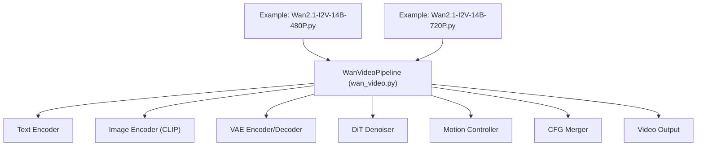
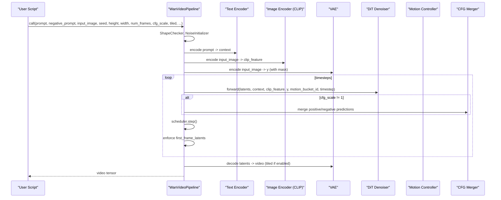
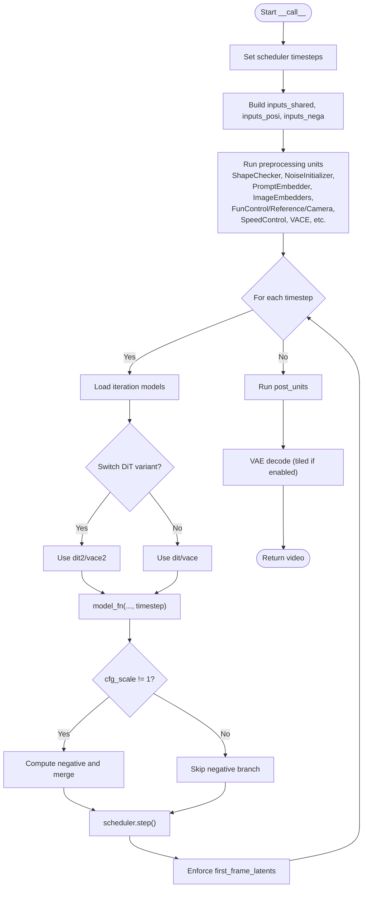
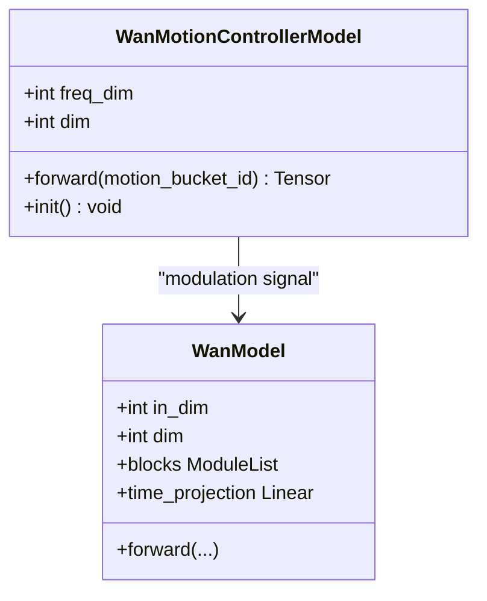
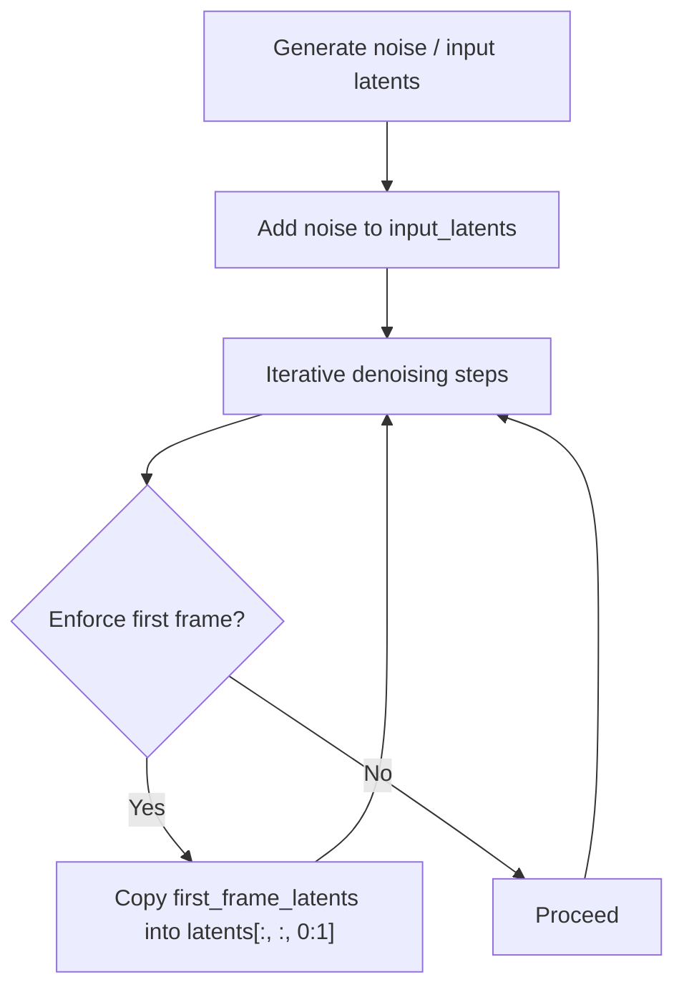
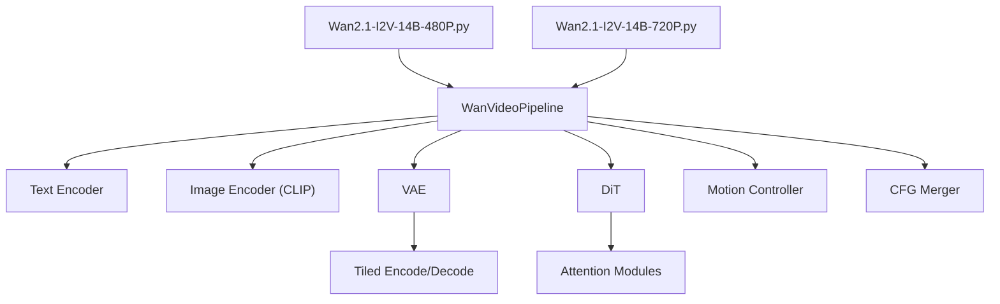

# Image-to-Video Inference

<cite>
**Referenced Files in This Document**
- [Wan2.1-I2V-14B-480P.py](file://examples/wanvideo/model_inference/Wan2.1-I2V-14B-480P.py)
- [Wan2.1-I2V-14B-720P.py](file://examples/wanvideo/model_inference/Wan2.1-I2V-14B-720P.py)
- [wan_video.py](file://diffsynth/pipelines/wan_video.py)
- [wan_video_motion_controller.py](file://diffsynth/models/wan_video_motion_controller.py)
- [wan_video_dit.py](file://diffsynth/models/wan_video_dit.py)
- [Wan.md](file://docs/en/Model_Details/Wan.md)
- [VRAM_management.md](file://docs/en/Pipeline_Usage/VRAM_management.md)
</cite>

## Table of Contents
1. [Introduction](#introduction)
2. [Project Structure](#project-structure)
3. [Core Components](#core-components)
4. [Architecture Overview](#architecture-overview)
5. [Detailed Component Analysis](#detailed-component-analysis)
6. [Dependency Analysis](#dependency-analysis)
7. [Performance Considerations](#performance-considerations)
8. [Troubleshooting Guide](#troubleshooting-guide)
9. [Conclusion](#conclusion)
10. [Appendices](#appendices)

## Introduction
This document explains how to animate static images into dynamic videos using WanVideo I2V models at 480P and 720P resolutions. It covers input image requirements, motion control parameters, temporal consistency settings, quality optimization options, examples for different image types, motion intensity controls, post-processing techniques, and common challenges such as maintaining image fidelity while adding motion effects. The guidance is grounded in the provided repository’s pipeline implementation and example scripts.

## Project Structure
The image-to-video (I2V) workflow is implemented via a unified pipeline that orchestrates text encoding, image encoding, DiT denoising, and VAE decoding. Example scripts demonstrate usage for both 480P and 720P targets.

**Diagram sources**
- [Wan2.1-I2V-14B-480P.py:1-35](file://examples/wanvideo/model_inference/Wan2.1-I2V-14B-480P.py#L1-L35)
- [Wan2.1-I2V-14B-720P.py:1-36](file://examples/wanvideo/model_inference/Wan2.1-I2V-14B-720P.py#L1-L36)
- [wan_video.py:32-86](file://diffsynth/pipelines/wan_video.py#L32-L86)

**Section sources**
- [Wan2.1-I2V-14B-480P.py:1-35](file://examples/wanvideo/model_inference/Wan2.1-I2V-14B-480P.py#L1-L35)
- [Wan2.1-I2V-14B-720P.py:1-36](file://examples/wanvideo/model_inference/Wan2.1-I2V-14B-720P.py#L1-L36)
- [wan_video.py:32-86](file://diffsynth/pipelines/wan_video.py#L32-L86)

## Core Components
- WanVideoPipeline: Orchestrates all units for I2V inference, including shape checks, noise initialization, prompt embedding, image embeddings (CLIP and VAE), fun control/reference/camera control, speed/motion control, VACE, sequence parallelism, Teacache, CFG merging, and long-context handling. It also manages model loading, VRAM management, and decoding with tiled VAE support.
- Motion Controller: Converts a scalar motion bucket ID into modulation signals used by the DiT blocks to control motion amplitude/intensity.
- DiT Denoiser: Transformer-based video diffusion backbone with self-attention, cross-attention, time modulations, and optional image inputs. Uses efficient attention backends when available.
- Examples: Two scripts show minimal I2V calls for 480P and 720P, demonstrating input_image, prompts, seed, and tiled decoding.

Key responsibilities:
- Input preparation: resize images to target resolution, encode via CLIP and/or VAE, prepare masks for first-frame anchoring.
- Temporal consistency: enforce first-frame latents to preserve input image fidelity across frames.
- Motion control: inject motion_bucket_id through the motion controller to scale movement.
- Quality and performance: CFG guidance, sigma shift, tiled VAE decode, Teacache thresholds, sliding window, and multi-GPU sequence parallelism.

**Section sources**
- [wan_video.py:32-86](file://diffsynth/pipelines/wan_video.py#L32-L86)
- [wan_video_motion_controller.py:1-28](file://diffsynth/models/wan_video_motion_controller.py#L1-L28)
- [wan_video_dit.py:338-400](file://diffsynth/models/wan_video_dit.py#L338-L400)

## Architecture Overview
The I2V pipeline follows a standard diffusion flow: initialize latents, iteratively denoise with DiT conditioned on text and image features, optionally switch DiT variants based on timestep boundary, apply CFG, then decode latents to pixel space with VAE.

**Diagram sources**
- [wan_video.py:189-359](file://diffsynth/pipelines/wan_video.py#L189-L359)
- [wan_video.py:427-451](file://diffsynth/pipelines/wan_video.py#L427-L451)
- [wan_video.py:454-474](file://diffsynth/pipelines/wan_video.py#L454-L474)
- [wan_video.py:477-509](file://diffsynth/pipelines/wan_video.py#L477-L509)
- [wan_video.py:634-646](file://diffsynth/pipelines/wan_video.py#L634-L646)

## Detailed Component Analysis

### I2V Pipeline Call Flow
The pipeline’s __call__ method sets up the scheduler, prepares shared and conditional inputs, runs preprocessing units, performs iterative denoising with optional DiT switching, applies CFG, enforces first-frame consistency, decodes with VAE (optionally tiled), and returns the video.

**Diagram sources**
- [wan_video.py:189-359](file://diffsynth/pipelines/wan_video.py#L189-L359)

**Section sources**
- [wan_video.py:189-359](file://diffsynth/pipelines/wan_video.py#L189-L359)

### Motion Control Parameters
Motion intensity is controlled via motion_bucket_id, which is transformed by the motion controller into modulation vectors injected into DiT blocks. Larger values increase motion amplitude.

**Diagram sources**
- [wan_video_motion_controller.py:1-28](file://diffsynth/models/wan_video_motion_controller.py#L1-L28)
- [wan_video_dit.py:338-400](file://diffsynth/models/wan_video_dit.py#L338-L400)

**Section sources**
- [wan_video_motion_controller.py:1-28](file://diffsynth/models/wan_video_motion_controller.py#L1-L28)
- [wan_video.py:634-646](file://diffsynth/pipelines/wan_video.py#L634-L646)

### Temporal Consistency Settings
Temporal consistency is enforced by preserving the first frame latent throughout denoising steps. The pipeline ensures the first-frame latents remain anchored to the input image, reducing drift and maintaining fidelity.

**Diagram sources**
- [wan_video.py:335-337](file://diffsynth/pipelines/wan_video.py#L335-L337)

**Section sources**
- [wan_video.py:335-337](file://diffsynth/pipelines/wan_video.py#L335-L337)

### Quality Optimization Options
- Classifier-Free Guidance (CFG): Blend positive and negative predictions using cfg_scale; can be merged or computed separately.
- Sigma Shift: Adjusts timestep schedule for smoother sampling.
- Tiled VAE Decoding: Reduces VRAM during encode/decode with slight quality trade-offs.
- Teacache: Optional caching threshold to accelerate inference.
- Sliding Window: Controls long-sequence processing windows.
- Multi-GPU Sequence Parallelism: Enables distributed inference for large models.

**Section sources**
- [wan_video.py:237-269](file://diffsynth/pipelines/wan_video.py#L237-L269)
- [wan_video.py:323-334](file://diffsynth/pipelines/wan_video.py#L323-L334)
- [wan_video.py:349-359](file://diffsynth/pipelines/wan_video.py#L349-L359)

### Resolution-Specific Usage (480P vs 720P)
- 480P: Default height/width are set by the pipeline; examples use tiled decoding and default dimensions.
- 720P: Explicitly specify height=720 and width=1280 to target higher resolution.

Both examples demonstrate:
- Loading the appropriate I2V model IDs.
- Providing a prompt and negative_prompt.
- Passing input_image, seed, and tiled=True.
- Saving the output video with save_video.

**Section sources**
- [Wan2.1-I2V-14B-480P.py:1-35](file://examples/wanvideo/model_inference/Wan2.1-I2V-14B-480P.py#L1-L35)
- [Wan2.1-I2V-14B-720P.py:1-36](file://examples/wanvideo/model_inference/Wan2.1-I2V-14B-720P.py#L1-L36)

### Input Image Requirements
- Images are resized to target height/width before encoding.
- For I2V, the first frame is anchored via VAE-encoded latents and mask construction to ensure fidelity.
- End images can be provided for first-and-last frame generation where supported by specific models.

**Section sources**
- [wan_video.py:454-474](file://diffsynth/pipelines/wan_video.py#L454-L474)
- [wan_video.py:477-509](file://diffsynth/pipelines/wan_video.py#L477-L509)

### Post-Processing Techniques
- Quantized output: Convert decoded floatpoint tensors to quantized video format suitable for saving.
- FPS and quality: Use save_video with fps and quality parameters to control playback and compression.

**Section sources**
- [wan_video.py:354-359](file://diffsynth/pipelines/wan_video.py#L354-L359)
- [Wan2.1-I2V-14B-480P.py:34](file://examples/wanvideo/model_inference/Wan2.1-I2V-14B-480P.py#L34)
- [Wan2.1-I2V-14B-720P.py:35](file://examples/wanvideo/model_inference/Wan2.1-I2V-14B-720P.py#L35)

## Dependency Analysis
The I2V workflow depends on several components orchestrated by the pipeline:

**Diagram sources**
- [wan_video.py:32-86](file://diffsynth/pipelines/wan_video.py#L32-L86)
- [wan_video_dit.py:129-201](file://diffsynth/models/wan_video_dit.py#L129-L201)

**Section sources**
- [wan_video.py:32-86](file://diffsynth/pipelines/wan_video.py#L32-L86)
- [wan_video_dit.py:129-201](file://diffsynth/models/wan_video_dit.py#L129-L201)

## Performance Considerations
- VRAM Management: Use dynamic VRAM management or disk offload to run large models on limited hardware. Configure vram_limit and per-model vram_config for optimal balance between speed and memory usage.
- Tiled VAE: Enable tiled encoding/decoding to reduce peak VRAM at the cost of minor quality differences and longer runtime.
- Attention Backends: Flash attention and other optimized attention implementations are used when available to accelerate DiT inference.
- Multi-GPU: Unified sequence parallelism can distribute computation across GPUs for faster inference.

**Section sources**
- [VRAM_management.md:1-206](file://docs/en/Pipeline_Usage/VRAM_management.md#L1-L206)
- [wan_video.py:89-108](file://diffsynth/pipelines/wan_video.py#L89-L108)
- [wan_video_dit.py:30-63](file://diffsynth/models/wan_video_dit.py#L30-L63)

## Troubleshooting Guide
Common issues and remedies:
- Insufficient VRAM: Enable VRAM management (dynamic or disk offload), reduce tile_size/tile_stride, lower resolution, or decrease num_frames.
- Blurry or distorted first frame: Ensure first_frame_latents enforcement is active and input_image is correctly resized and encoded.
- Excessive motion artifacts: Reduce motion_bucket_id or adjust cfg_scale; consider increasing num_inference_steps for stability.
- Slow inference: Enable tiled VAE decoding, use Teacache thresholds, or enable multi-GPU sequence parallelism.

**Section sources**
- [VRAM_management.md:1-206](file://docs/en/Pipeline_Usage/VRAM_management.md#L1-L206)
- [wan_video.py:335-337](file://diffsynth/pipelines/wan_video.py#L335-L337)
- [wan_video.py:237-269](file://diffsynth/pipelines/wan_video.py#L237-L269)

## Conclusion
WanVideo I2V pipelines provide robust tools to animate static images into coherent videos at 480P and 720P. By leveraging motion control, temporal consistency mechanisms, and quality optimizations like CFG and tiled decoding, users can achieve high-fidelity results while managing VRAM constraints effectively. The provided examples and documentation offer clear pathways to configure and tune inference for diverse image types and motion intensities.

## Appendices

### Model Lineage and I2V Models
The Wan series includes multiple I2V variants, notably Wan-AI/Wan2.1-I2V-14B-480P and Wan-AI/Wan2.1-I2V-14B-720P, derived from the base T2V models.

**Section sources**
- [Wan.md:60-105](file://docs/en/Model_Details/Wan.md#L60-L105)