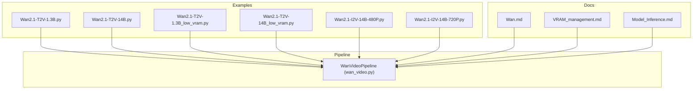
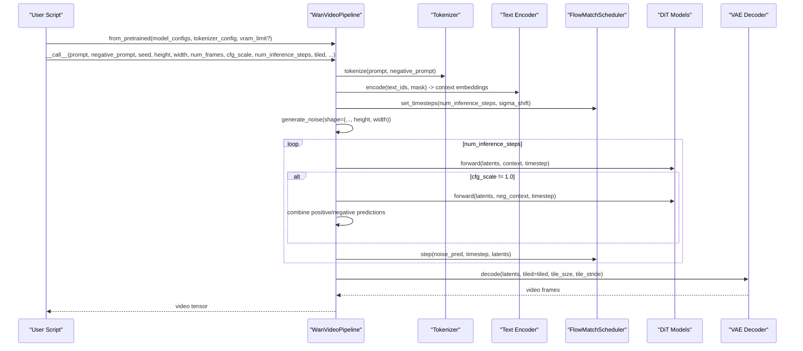
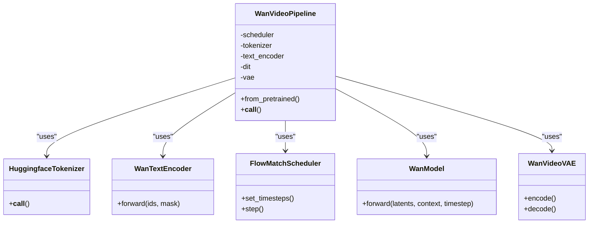

# Text-to-Video Inference

<cite>
**Referenced Files in This Document**
- [Wan.md](file://docs/en/Model_Details/Wan.md)
- [wan_video.py](file://diffsynth/pipelines/wan_video.py)
- [VRAM_management.md](file://docs/en/Pipeline_Usage/VRAM_management.md)
- [Model_Inference.md](file://docs/en/Pipeline_Usage/Model_Inference.md)
- [Wan2.1-T2V-1.3B.py](file://examples/wanvideo/model_inference/Wan2.1-T2V-1.3B.py)
- [Wan2.1-T2V-14B.py](file://examples/wanvideo/model_inference/Wan2.1-T2V-14B.py)
- [Wan2.1-T2V-1.3B_low_vram.py](file://examples/wanvideo/model_inference_low_vram/Wan2.1-T2V-1.3B.py)
- [Wan2.1-T2V-14B_low_vram.py](file://examples/wanvideo/model_inference_low_vram/Wan2.1-T2V-14B.py)
- [Wan2.1-I2V-14B-480P.py](file://examples/wanvideo/model_inference/Wan2.1-I2V-14B-480P.py)
- [Wan2.1-I2V-14B-720P.py](file://examples/wanvideo/model_inference/Wan2.1-I2V-14B-720P.py)
- [wan_video_dit.py](file://diffsynth/models/wan_video_dit.py)
</cite>

## Table of Contents
1. Introduction
2. Project Structure
3. Core Components
4. Architecture Overview
5. Detailed Component Analysis
6. Dependency Analysis
7. Performance Considerations
8. Troubleshooting Guide
9. Conclusion

## Introduction
This document explains how to perform text-to-video inference with WanVideo models, focusing on the 1.3B and 14B variants. It covers prompt formatting, resolution settings (480P and 720P), frame rate configuration, guidance scale, performance tuning, batch processing considerations, and VRAM optimization techniques for low-memory environments.

## Project Structure
The repository provides:
- A unified pipeline for WanVideo models under diffsynth/pipelines/wan_video.py
- Example scripts for both standard and low-VRAM inference
- Documentation for model details and VRAM management
- Model-specific examples demonstrating resolutions and inputs

**Diagram sources**
- [wan_video.py:1-120](file://diffsynth/pipelines/wan_video.py#L1-L120)
- [Wan.md:154-206](file://docs/en/Model_Details/Wan.md#L154-L206)
- [VRAM_management.md:1-206](file://docs/en/Pipeline_Usage/VRAM_management.md#L1-L206)
- [Model_Inference.md:1-167](file://docs/en/Pipeline_Usage/Model_Inference.md#L1-L167)

**Section sources**
- [Wan.md:154-206](file://docs/en/Model_Details/Wan.md#L154-L206)
- [Model_Inference.md:1-167](file://docs/en/Pipeline_Usage/Model_Inference.md#L1-L167)

## Core Components
- WanVideoPipeline orchestrates text encoding, latent initialization, denoising steps, and VAE decoding.
- Supports multiple input modalities (text, images, videos, audio) and control signals (camera motion, reference images).
- Provides VRAM-aware loading and optional tiling for memory-constrained devices.

Key capabilities relevant to text-to-video:
- Prompt and negative prompt embedding via a text encoder
- Latent noise initialization based on height, width, num_frames
- Denoising loop with configurable steps and guidance scale
- Optional VAE tiling to reduce VRAM usage during encode/decode
- Multi-GPU sequence parallel acceleration option

**Section sources**
- [wan_video.py:32-110](file://diffsynth/pipelines/wan_video.py#L32-L110)
- [wan_video.py:189-359](file://diffsynth/pipelines/wan_video.py#L189-L359)

## Architecture Overview
The inference flow for text-to-video is as follows:

**Diagram sources**
- [wan_video.py:189-359](file://diffsynth/pipelines/wan_video.py#L189-L359)
- [wan_video.py:427-451](file://diffsynth/pipelines/wan_video.py#L427-L451)
- [wan_video.py:376-393](file://diffsynth/pipelines/wan_video.py#L376-L393)

## Detailed Component Analysis

### Pipeline Parameters for Text-to-Video
- Prompt and negative_prompt: textual descriptions guiding generation
- cfg_scale: classifier-free guidance strength; default 5.0; set to 1.0 to disable CFG
- height, width: must be multiples of 16; typical 480P uses 480x832; 720P uses 720x1280
- num_frames: number of frames; default 81; must satisfy time_division_factor=4 and remainder=1
- num_inference_steps: default 50; controls quality vs speed trade-off
- seed: random seed for reproducibility
- tiled: enables VAE tiling to reduce VRAM usage at slight cost in speed and fidelity
- tile_size, tile_stride: tiling parameters for VAE encode/decode
- output_type: quantized or floatpoint outputs

These parameters are defined in the pipeline’s call interface and documented in the model overview.

**Section sources**
- [wan_video.py:189-359](file://diffsynth/pipelines/wan_video.py#L189-L359)
- [Wan.md:154-206](file://docs/en/Model_Details/Wan.md#L154-L206)

### Resolution Settings (480P and 720P)
- 480P example: height=480, width=832 (commonly used aspect ratio)
- 720P example: height=720, width=1280
- Ensure dimensions are multiples of 16; the pipeline enforces this constraint

Examples demonstrate setting these parameters explicitly when generating from images or text.

**Section sources**
- [Wan2.1-I2V-14B-480P.py:27-34](file://examples/wanvideo/model_inference/Wan2.1-I2V-14B-480P.py#L27-L34)
- [Wan2.1-I2V-14B-720P.py:27-34](file://examples/wanvideo/model_inference/Wan2.1-I2V-14B-720P.py#L27-L34)

### Frame Rate Configuration
- The pipeline does not directly accept an fps parameter for generation; fps is applied when saving the video
- Use save_video(video, path, fps=X, quality=Y) to set playback frame rate
- Typical fps values: 15–30 depending on content and storage constraints

**Section sources**
- [Wan2.1-T2V-1.3B.py:18-24](file://examples/wanvideo/model_inference/Wan2.1-T2V-1.3B.py#L18-L24)
- [Wan2.1-T2V-14B.py:18-24](file://examples/wanvideo/model_inference/Wan2.1-T2V-14B.py#L18-L24)

### Prompt Formatting and Negative Prompts
- Provide descriptive prompts that specify scene, style, camera movement, and subject details
- Negative prompts can exclude unwanted artifacts (e.g., overexposure, static frames, blurry details)
- Examples include both Chinese and English prompts in the provided scripts

Prompt styles:
- Descriptive narrative with visual cues
- Style descriptors (e.g., “documentary photography style”)
- Camera direction and motion hints (e.g., “side moving shot”)

Negative prompts typically list undesirable qualities and artifacts to avoid.

**Section sources**
- [Wan2.1-T2V-1.3B.py:18-24](file://examples/wanvideo/model_inference/Wan2.1-T2V-1.3B.py#L18-L24)
- [Wan2.1-T2V-14B.py:18-24](file://examples/wanvideo/model_inference/Wan2.1-T2V-14B.py#L18-L24)
- [Wan.md:154-206](file://docs/en/Model_Details/Wan.md#L154-L206)

### Guidance Scale and Denoising Strength
- cfg_scale: controls adherence to prompt; higher values increase prompt fidelity but may reduce diversity
- denoising_strength: primarily for video-to-video; range 0–1; defaults to 1.0 for pure text-to-video

For text-to-video, adjust cfg_scale and num_inference_steps to balance quality and speed.

**Section sources**
- [wan_video.py:189-359](file://diffsynth/pipelines/wan_video.py#L189-L359)
- [Wan.md:154-206](file://docs/en/Model_Details/Wan.md#L154-L206)

### Memory Optimization Techniques
- VRAM Management:
  - CPU offload: move unused components to CPU
  - FP8 quantization: store parameters in FP8, compute in BF16
  - Dynamic VRAM management: auto-split layers based on vram_limit
  - Disk offload: lazy load from disk for extreme memory constraints
- VAE Tiling:
  - Enable tiled=True to reduce VRAM during VAE encode/decode
  - Adjust tile_size and tile_stride to balance memory and speed

Recommended configurations are provided in low-VRAM examples.

**Section sources**
- [VRAM_management.md:1-206](file://docs/en/Pipeline_Usage/VRAM_management.md#L1-L206)
- [Wan2.1-T2V-1.3B_low_vram.py:7-27](file://examples/wanvideo/model_inference_low_vram/Wan2.1-T2V-1.3B.py#L7-L27)
- [Wan2.1-T2V-14B_low_vram.py:7-27](file://examples/wanvideo/model_inference_low_vram/Wan2.1-T2V-14B.py#L7-L27)

### Batch Processing Capabilities
- The pipeline processes one prompt per call; batching requires multiple calls
- For multi-GPU acceleration, enable unified sequence parallelism (use_usp=True) and run with torchrun
- Save outputs only from rank 0 to avoid duplicate files

Batching strategy:
- Loop over prompts and invoke pipe(...) sequentially
- Optionally use distributed execution for faster throughput across GPUs

**Section sources**
- [Wan.md:208-250](file://docs/en/Model_Details/Wan.md#L208-L250)
- [wan_video.py:89-109](file://diffsynth/pipelines/wan_video.py#L89-L109)

### Examples of Different Prompt Styles
- Documentary-style description with dynamic camera movement
- Sci-fi narrative with environmental details and character actions
- Include negative prompts to suppress common artifacts

See example scripts for concrete prompt formulations.

**Section sources**
- [Wan2.1-T2V-1.3B.py:18-24](file://examples/wanvideo/model_inference/Wan2.1-T2V-1.3B.py#L18-L24)
- [Wan2.1-T2V-14B.py:18-24](file://examples/wanvideo/model_inference/Wan2.1-T2V-14B.py#L18-L24)

## Dependency Analysis
WanVideoPipeline composes several components:
- Tokenizer and text encoder for prompt embeddings
- FlowMatchScheduler for timestep scheduling
- DiT models for denoising
- VAE for decoding latents to video frames
- Optional modules for image/audio/control inputs

**Diagram sources**
- [wan_video.py:32-110](file://diffsynth/pipelines/wan_video.py#L32-L110)
- [wan_video.py:427-451](file://diffsynth/pipelines/wan_video.py#L427-L451)
- [wan_video.py:376-393](file://diffsynth/pipelines/wan_video.py#L376-L393)

**Section sources**
- [wan_video.py:32-110](file://diffsynth/pipelines/wan_video.py#L32-L110)

## Performance Considerations
- Precision: Use bfloat16 for computation; consider FP8 quantization for VRAM savings
- Steps vs Quality: Increase num_inference_steps for better quality at the cost of time
- Tiling: Enable tiled=True for VAE operations to reduce peak VRAM
- Multi-GPU: Use unified sequence parallelism for large models like 14B
- Resolution and Frames: Higher resolution and more frames increase VRAM and compute time
- Scheduler shift: sigma_shift affects timestep schedule; tune if needed

Optimization checklist:
- Set vram_limit appropriately for your GPU
- Use tiled=True and tune tile_size/tile_stride
- Reduce num_inference_steps for faster runs
- Prefer lower resolutions for quick iterations

[No sources needed since this section provides general guidance]

## Troubleshooting Guide
Common issues and resolutions:
- Out-of-memory errors:
  - Enable VRAM management (CPU offload, FP8, dynamic splitting, disk offload)
  - Reduce resolution, num_frames, or num_inference_steps
  - Enable VAE tiling
- Slow inference:
  - Reduce steps or resolution
  - Use multi-GPU parallel acceleration
- Artifacts or poor prompt adherence:
  - Adjust cfg_scale (increase for stronger adherence)
  - Refine negative prompts
- Incorrect frame rate:
  - Set fps correctly in save_video

Diagnostic tips:
- Monitor VRAM usage and adjust vram_limit slightly below available memory
- Validate that height/width are multiples of 16
- Ensure num_frames satisfies time_division_factor and remainder constraints

**Section sources**
- [VRAM_management.md:1-206](file://docs/en/Pipeline_Usage/VRAM_management.md#L1-L206)
- [Wan.md:154-206](file://docs/en/Model_Details/Wan.md#L154-L206)

## Conclusion
WanVideo pipelines provide flexible text-to-video generation with support for 1.3B and 14B models. By configuring prompts, resolutions, frame counts, and guidance scales, users can tailor outputs to their needs. Memory optimization techniques such as VRAM management and VAE tiling enable running on constrained hardware. For high-throughput scenarios, multi-GPU acceleration is available. Follow the examples and guidelines to achieve reliable results across different prompt styles and resolutions.

[No sources needed since this section summarizes without analyzing specific files]