# WanVideo Inference Examples

<cite>
**Referenced Files in This Document**
- [Wan2.1-T2V-14B.py](file://examples/wanvideo/model_inference/Wan2.1-T2V-14B.py)
- [Wan2.1-I2V-14B-720P.py](file://examples/wanvideo/model_inference/Wan2.1-I2V-14B-720P.py)
- [Wan2.1-Fun-14B-Control.py](file://examples/wanvideo/model_inference/Wan2.1-Fun-14B-Control.py)
- [LongCat-Video.py](file://examples/wanvideo/model_inference/LongCat-Video.py)
- [krea-realtime-video.py](file://examples/wanvideo/model_inference/krea-realtime-video.py)
- [Wan2.1-1.3b-speedcontrol-v1.py](file://examples/wanvideo/model_inference/Wan2.1-1.3b-speedcontrol-v1.py)
- [Wan2.1-VACE-14B.py](file://examples/wanvideo/model_inference/Wan2.1-VACE-14B.py)
- [Wan2.2-TI2V-5B.py](file://examples/wanvideo/model_inference/Wan2.2-TI2V-5B.py)
- [wan_video.py](file://diffsynth/pipelines/wan_video.py)
- [wan_video_dit.py](file://diffsynth/models/wan_video_dit.py)
- [wan_video_vae.py](file://diffsynth/models/wan_video_vae.py)
</cite>

## Table of Contents
1. Introduction
2. Project Structure
3. Core Components
4. Architecture Overview
5. Detailed Component Analysis
6. Dependency Analysis
7. Performance Considerations
8. Troubleshooting Guide
9. Conclusion

## Introduction
This document provides comprehensive, practical examples for WanVideo inference across text-to-video (T2V), image-to-video (I2V), and creative video generation with Fun models. It covers model sizes (1.3B, 5B, 14B), resolutions (480P, 720P), speed control, real-time generation, LongCat video processing, and Video-as-Prompt capabilities. Each example includes parameter explanations, memory optimization techniques, and performance tuning options to help you achieve the best results on your hardware.

## Project Structure
The repository organizes WanVideo examples under examples/wanvideo/model_inference, with each script demonstrating a specific capability or model variant. The core pipeline and model implementations are located under diffsynth/pipelines and diffsynth/models.

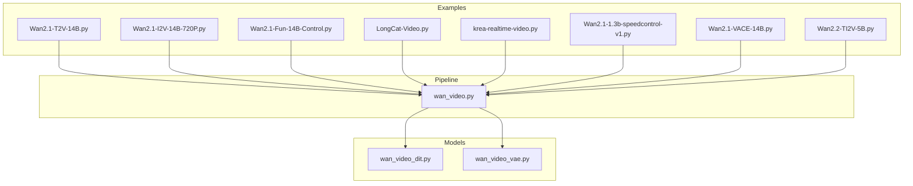

**Diagram sources**
- [wan_video.py:1-120](file://diffsynth/pipelines/wan_video.py#L1-L120)
- [wan_video_dit.py:1-120](file://diffsynth/models/wan_video_dit.py#L1-L120)
- [wan_video_vae.py:1-120](file://diffsynth/models/wan_video_vae.py#L1-L120)

**Section sources**
- [Wan2.1-T2V-14B.py:1-25](file://examples/wanvideo/model_inference/Wan2.1-T2V-14B.py#L1-L25)
- [Wan2.1-I2V-14B-720P.py:1-36](file://examples/wanvideo/model_inference/Wan2.1-I2V-14B-720P.py#L1-L36)
- [Wan2.1-Fun-14B-Control.py:1-35](file://examples/wanvideo/model_inference/Wan2.1-Fun-14B-Control.py#L1-L35)
- [LongCat-Video.py:1-36](file://examples/wanvideo/model_inference/LongCat-Video.py#L1-L36)
- [krea-realtime-video.py:1-26](file://examples/wanvideo/model_inference/krea-realtime-video.py#L1-L26)
- [Wan2.1-1.3b-speedcontrol-v1.py:1-35](file://examples/wanvideo/model_inference/Wan2.1-1.3b-speedcontrol-v1.py#L1-L35)
- [Wan2.1-VACE-14B.py:1-55](file://examples/wanvideo/model_inference/Wan2.1-VACE-14B.py#L1-L55)
- [Wan2.2-TI2V-5B.py:1-44](file://examples/wanvideo/model_inference/Wan2.2-TI2V-5B.py#L1-L44)

## Core Components
- WanVideoPipeline orchestrates all inference steps, including prompt embedding, optional image/video conditioning, DiT denoising, scheduler stepping, and VAE decoding. It supports multiple features via modular units such as Fun control, camera control, VACE, VAP, LongCat continuation, and sequence parallelism.
- DiT (Diffusion Transformer) modules provide attention mechanisms with optimized backends (FlashAttention, SageAttention) and support for image/text conditioning.
- VAE encodes/decodes video frames into latent space and supports tiled operations for memory efficiency.

Key parameters exposed by the pipeline include:
- Prompting: prompt, negative_prompt
- Conditioning: input_image, end_image, input_video, control_video, reference_image, vace_video, vace_reference_image, vap_video
- Shape and timing: height, width, num_frames, num_inference_steps, sigma_shift
- Guidance: cfg_scale, cfg_merge
- Speed control: motion_bucket_id
- Advanced: longcat_video, tea_cache_l1_thresh, tea_cache_model_id, sliding_window_size/stride, tiled/tile_size/tile_stride

**Section sources**
- [wan_video.py:189-359](file://diffsynth/pipelines/wan_video.py#L189-L359)
- [wan_video_dit.py:130-200](file://diffsynth/models/wan_video_dit.py#L130-L200)
- [wan_video_vae.py:1-120](file://diffsynth/models/wan_video_vae.py#L1-L120)

## Architecture Overview
The inference flow is a staged pipeline that transforms inputs into latents, iteratively denoises using DiT, and decodes to video frames.

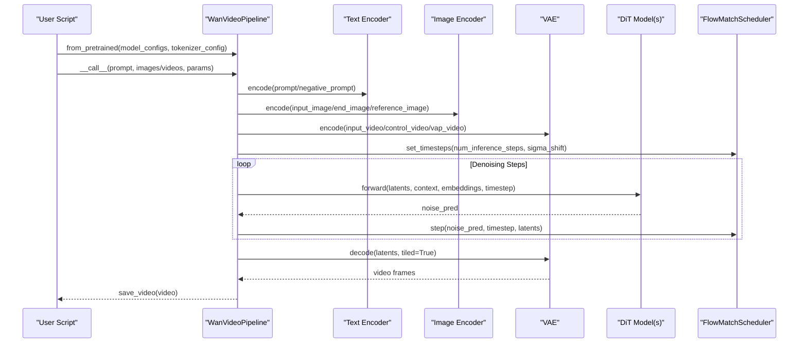

**Diagram sources**
- [wan_video.py:189-359](file://diffsynth/pipelines/wan_video.py#L189-L359)
- [wan_video_dit.py:130-200](file://diffsynth/models/wan_video_dit.py#L130-L200)
- [wan_video_vae.py:1-120](file://diffsynth/models/wan_video_vae.py#L1-L120)

## Detailed Component Analysis

### Text-to-Video (T2V) with Wan2.1-T2V-14B
- Purpose: Generate videos from text prompts using the 14B model.
- Key parameters: prompt, negative_prompt, seed, tiled, height/width defaults, num_frames default.
- Memory optimization: tiled=True enables VAE tiling; bfloat16 dtype reduces VRAM usage.
- Performance tuning: adjust num_inference_steps and sigma_shift for quality vs speed trade-offs.

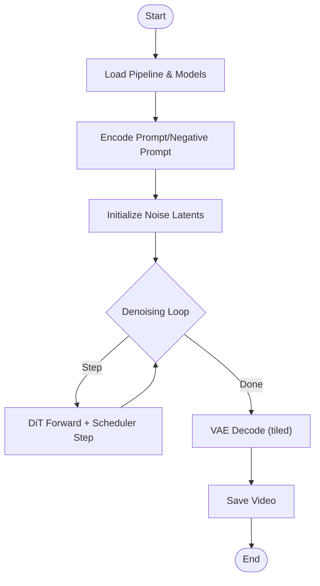

**Diagram sources**
- [Wan2.1-T2V-14B.py:1-25](file://examples/wanvideo/model_inference/Wan2.1-T2V-14B.py#L1-L25)
- [wan_video.py:189-359](file://diffsynth/pipelines/wan_video.py#L189-L359)

**Section sources**
- [Wan2.1-T2V-14B.py:1-25](file://examples/wanvideo/model_inference/Wan2.1-T2V-14B.py#L1-L25)

### Image-to-Video (I2V) with Wan2.1-I2V-14B-720P
- Purpose: Animate a given image into a video at 720P resolution.
- Key parameters: input_image, height=720, width=1280, seed, tiled, prompt/negative_prompt.
- Memory optimization: tiled=True; ensure input image matches target resolution before encoding.
- Performance tuning: reduce num_inference_steps for faster generation; tune sigma_shift for motion smoothness.

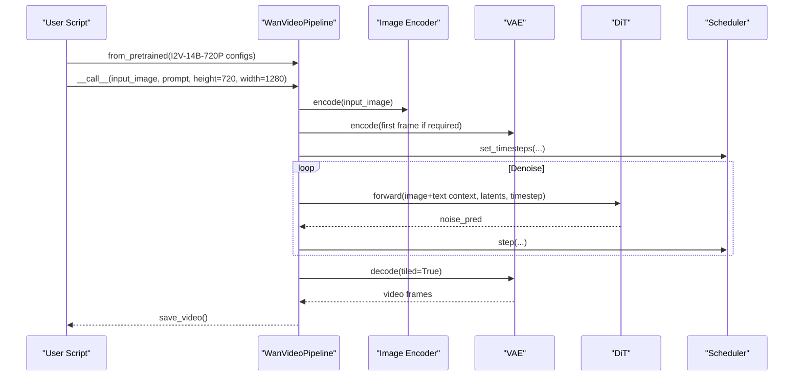

**Diagram sources**
- [Wan2.1-I2V-14B-720P.py:1-36](file://examples/wanvideo/model_inference/Wan2.1-I2V-14B-720P.py#L1-L36)
- [wan_video.py:454-509](file://diffsynth/pipelines/wan_video.py#L454-L509)

**Section sources**
- [Wan2.1-I2V-14B-720P.py:1-36](file://examples/wanvideo/model_inference/Wan2.1-I2V-14B-720P.py#L1-L36)

### Creative Video Generation with Fun Models (Control)
- Purpose: Use a control video to guide motion/style while generating new content.
- Key parameters: control_video, height, width, num_frames, seed, tiled.
- Memory optimization: VAE encoding of control video uses tiled mode; ensure consistent dimensions.
- Performance tuning: cfg_scale controls adherence to control; lower values allow more creativity.

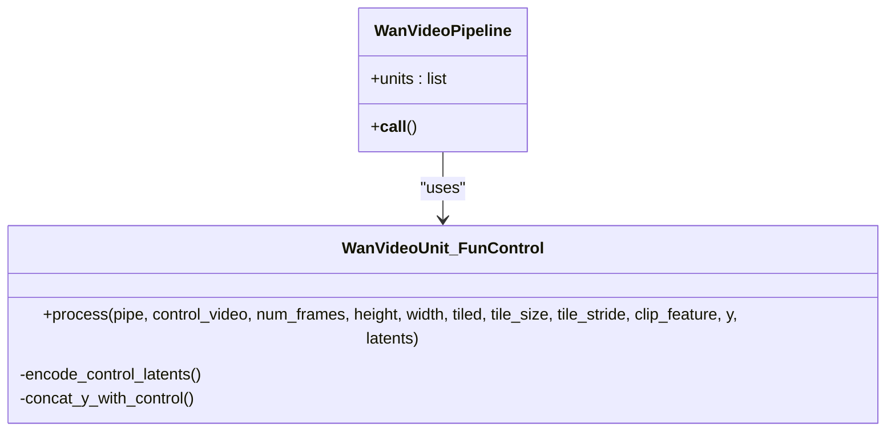

**Diagram sources**
- [wan_video.py:534-557](file://diffsynth/pipelines/wan_video.py#L534-L557)

**Section sources**
- [Wan2.1-Fun-14B-Control.py:1-35](file://examples/wanvideo/model_inference/Wan2.1-Fun-14B-Control.py#L1-L35)
- [wan_video.py:534-557](file://diffsynth/pipelines/wan_video.py#L534-L557)

### LongCat Video Processing (Continuation)
- Purpose: Extend an existing video by appending frames based on the same prompt.
- Key parameters: longcat_video (must be 4n+1 frames), num_frames, cfg_scale, sigma_shift, seed, tiled.
- Memory optimization: reuse latents from previous generation; use tiled decoding.
- Performance tuning: increase num_frames gradually; adjust sigma_shift for temporal consistency.

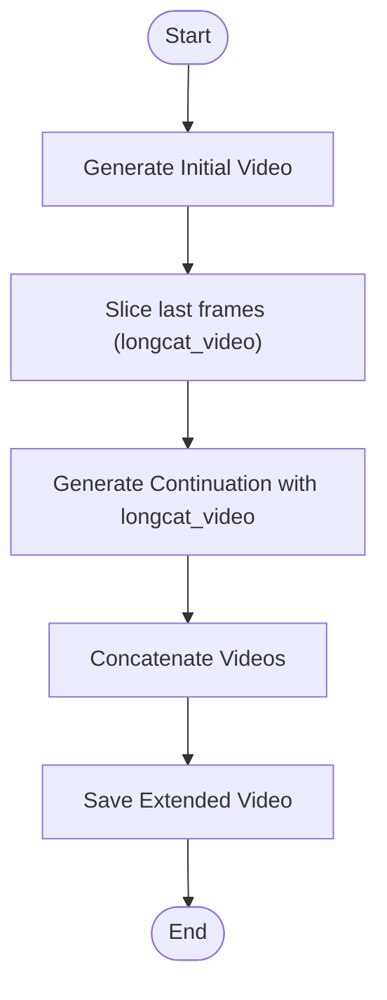

**Diagram sources**
- [LongCat-Video.py:1-36](file://examples/wanvideo/model_inference/LongCat-Video.py#L1-L36)

**Section sources**
- [LongCat-Video.py:1-36](file://examples/wanvideo/model_inference/LongCat-Video.py#L1-L36)

### Real-Time Video Generation (krea-realtime-video)
- Purpose: Fast generation suitable for interactive applications.
- Key parameters: num_inference_steps=6, num_frames=81, cfg_scale=1, sigma_shift=20, seed, tiled.
- Memory optimization: minimal steps and CFG scale reduce compute; tiled decoding saves VRAM.
- Performance tuning: further reduce steps or frames for latency; increase sigma_shift for stronger motion.

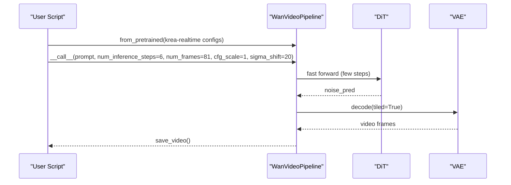

**Diagram sources**
- [krea-realtime-video.py:1-26](file://examples/wanvideo/model_inference/krea-realtime-video.py#L1-L26)
- [wan_video.py:189-359](file://diffsynth/pipelines/wan_video.py#L189-L359)

**Section sources**
- [krea-realtime-video.py:1-26](file://examples/wanvideo/model_inference/krea-realtime-video.py#L1-L26)

### Speed Control with Motion Bucket ID (1.3B)
- Purpose: Control motion intensity using motion_bucket_id.
- Key parameters: motion_bucket_id (e.g., 0 for slow, 100 for fast), seed, tiled.
- Memory optimization: smaller 1.3B model reduces VRAM; tiled decoding helps.
- Performance tuning: higher motion_bucket_id increases motion but may require more steps for stability.

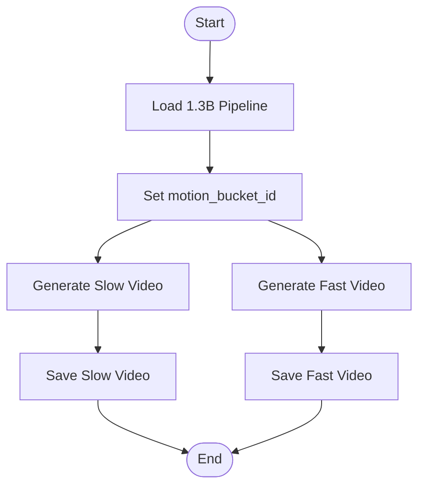

**Diagram sources**
- [Wan2.1-1.3b-speedcontrol-v1.py:1-35](file://examples/wanvideo/model_inference/Wan2.1-1.3b-speedcontrol-v1.py#L1-L35)
- [wan_video.py:634-646](file://diffsynth/pipelines/wan_video.py#L634-L646)

**Section sources**
- [Wan2.1-1.3b-speedcontrol-v1.py:1-35](file://examples/wanvideo/model_inference/Wan2.1-1.3b-speedcontrol-v1.py#L1-L35)

### Video-as-Prompt (VACE)
- Purpose: Use depth video and/or reference image to guide generation.
- Key parameters: vace_video, vace_video_mask, vace_reference_image, vace_scale, seed, tiled.
- Memory optimization: VAE encodes masked/inactive/reactive components separately; tiled mode reduces peak VRAM.
- Performance tuning: adjust vace_scale to balance guidance strength vs creativity.

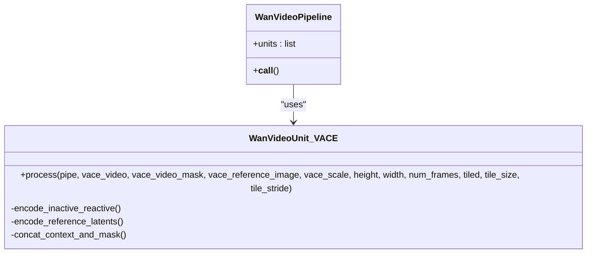

**Diagram sources**
- [wan_video.py:649-710](file://diffsynth/pipelines/wan_video.py#L649-L710)

**Section sources**
- [Wan2.1-VACE-14B.py:1-55](file://examples/wanvideo/model_inference/Wan2.1-VACE-14B.py#L1-L55)
- [wan_video.py:649-710](file://diffsynth/pipelines/wan_video.py#L649-L710)

### Text-to-Image-to-Video (TI2V) with 5B Model
- Purpose: Combine text and image inputs for controlled video generation using the 5B model.
- Key parameters: input_image, height=704, width=1248, num_frames=121, seed, tiled.
- Memory optimization: fused VAE embedding in latents reduces intermediate storage; tiled decoding.
- Performance tuning: fewer steps for speed; tune sigma_shift for motion dynamics.

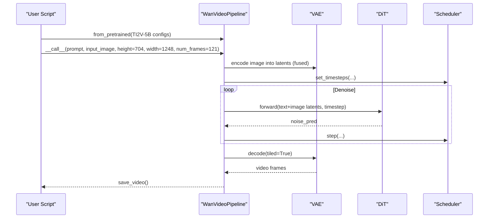

**Diagram sources**
- [Wan2.2-TI2V-5B.py:1-44](file://examples/wanvideo/model_inference/Wan2.2-TI2V-5B.py#L1-L44)
- [wan_video.py:512-531](file://diffsynth/pipelines/wan_video.py#L512-L531)

**Section sources**
- [Wan2.2-TI2V-5B.py:1-44](file://examples/wanvideo/model_inference/Wan2.2-TI2V-5B.py#L1-L44)

## Dependency Analysis
The pipeline depends on text/image encoders, VAE, and DiT models. Optional modules like motion controller, VACE, animate adapter, and audio encoder are loaded conditionally based on inputs.

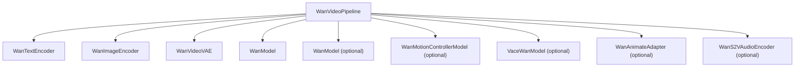

**Diagram sources**
- [wan_video.py:32-86](file://diffsynth/pipelines/wan_video.py#L32-L86)

**Section sources**
- [wan_video.py:32-86](file://diffsynth/pipelines/wan_video.py#L32-L86)

## Performance Considerations
- Dtype and precision: Use torch.bfloat16 to reduce VRAM and improve throughput on modern GPUs.
- Tiled operations: Enable tiled=True for both VAE encode/decode to split large tensors into manageable chunks.
- Scheduler tuning: Reduce num_inference_steps for speed; adjust sigma_shift to influence motion intensity and stability.
- Guidance scaling: Lower cfg_scale speeds up inference but may reduce adherence to prompts; cfg_merge can optimize dual-pass CFG.
- Sequence parallelism: For multi-GPU setups, enable unified sequence parallelism to distribute computation.
- Attention backends: FlashAttention and SageAttention are automatically selected when available for faster attention computations.
- Resolution and frames: Higher resolutions and longer videos increase VRAM and time; consider downsampling or reducing num_frames for constrained environments.

[No sources needed since this section provides general guidance]

## Troubleshooting Guide
- Out-of-memory errors:
  - Reduce height/width or num_frames.
  - Enable tiled=True for VAE operations.
  - Use smaller models (e.g., 1.3B instead of 14B).
  - Disable unnecessary modules (e.g., VACE, motion controller) if not used.
- Poor video quality:
  - Increase num_inference_steps.
  - Adjust cfg_scale and sigma_shift.
  - Ensure input images/videos are properly preprocessed and sized.
- Temporal inconsistencies:
  - Use LongCat continuation with overlapping frames.
  - Tune sigma_shift for smoother transitions.
- Slow inference:
  - Reduce steps and CFG scale.
  - Use distilled or lightweight models where applicable.
  - Ensure FlashAttention/SageAttention are installed and enabled.

**Section sources**
- [wan_video.py:189-359](file://diffsynth/pipelines/wan_video.py#L189-L359)
- [wan_video_dit.py:30-63](file://diffsynth/models/wan_video_dit.py#L30-L63)

## Conclusion
WanVideo offers a flexible and powerful framework for diverse video generation tasks. By leveraging the provided examples and tuning parameters such as resolution, steps, guidance, and memory optimizations, users can achieve high-quality results across different hardware constraints. The modular pipeline design allows easy integration of advanced features like Fun control, VACE, and LongCat continuation for creative and precise video synthesis.

[No sources needed since this section summarizes without analyzing specific files]